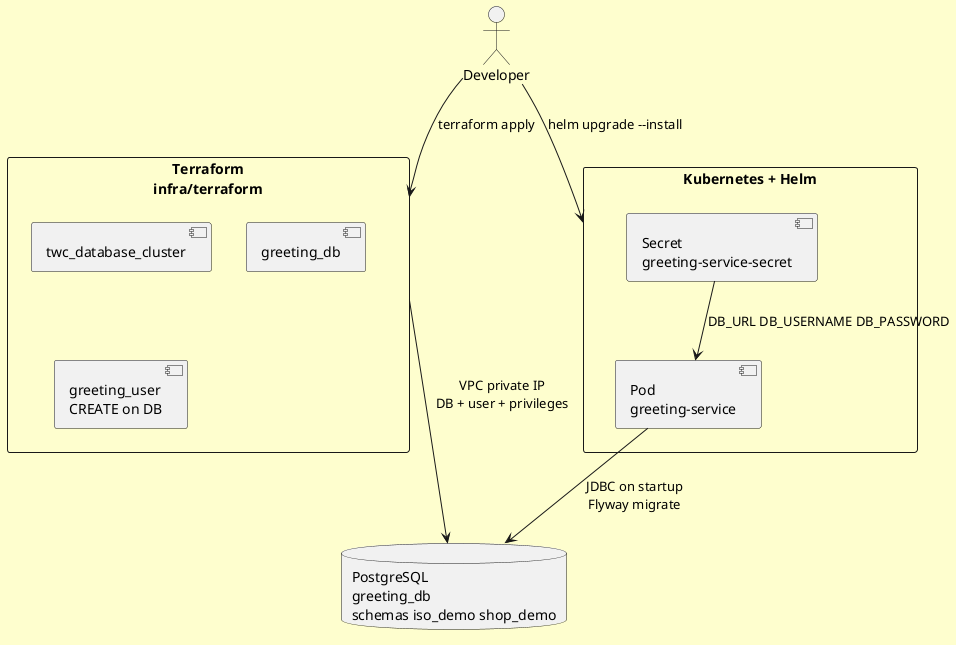
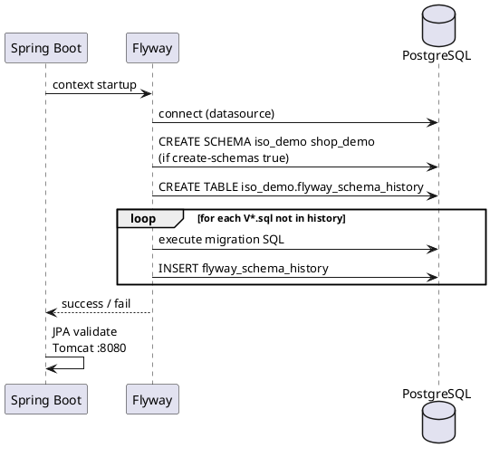
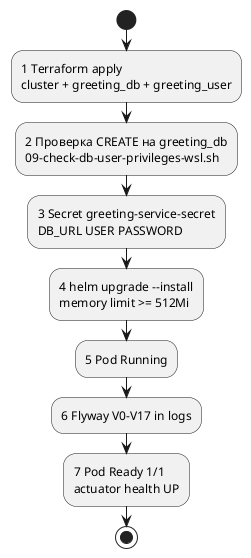
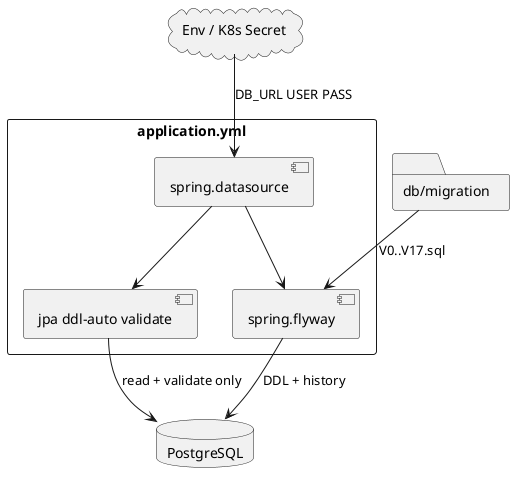

# Flyway: подключение, миграции и подготовка инфраструктуры

Инструкция для каталога `app/src/main/resources/db/`. Объясняет, **что должно быть готово до старта pod**, как Spring Boot запускает Flyway и где править настройки.

> **Просмотр схем PlantUML:** [plantuml.com/plantuml/uml](https://www.plantuml.com/plantuml/uml/) — вставьте блок `@startuml` … `@enduml` из этого файла. Все четыре диаграммы ниже проверены на синтаксис в онлайн-редакторе PlantUML.

---

## Оглавление

- [1. Кратко: что происходит при старте](#1-кратко-что-происходит-при-старте)
- [2. Общая схема: Terraform → Helm → Flyway → PostgreSQL](#2-общая-схема-terraform--helm--flyway--postgresql)
- [3. Что делает Terraform (и почему)](#3-что-делает-terraform-и-почему)
- [4. Что делает Helm / Kubernetes (и почему)](#4-что-делает-helm--kubernetes-и-почему)
- [5. Настройки в application.yml](#5-настройки-в-applicationyml)
- [6. Как Flyway выполняет миграции при старте](#6-как-flyway-выполняет-миграции-при-старте)
- [7. Порядок подготовки до успешного pod](#7-порядок-подготовки-до-успешного-pod)
- [8. Связь конфигурации и файлов](#8-связь-конфигурации-и-файлов)
- [9. Каталог db/migration](#9-каталог-dbmigration)
- [10. Первый запуск и повторные запуски](#10-первый-запуск-и-повторные-запуски)
- [11. Чек-лист успеха](#11-чек-лист-успеха)
- [12. Типичные ошибки](#12-типичные-ошибки)
- [13. Связанные файлы и скрипты](#13-связанные-файлы-и-скрипты)

---

## 1. Кратко: что происходит при старте

1. **Terraform** уже создал managed PostgreSQL в VPC, базу `greeting_db` и пользователя `greeting_user` с правом **CREATE** на эту базу.
2. **Helm** развернул pod и передал в контейнер Secret с `DB_URL`, `DB_USERNAME`, `DB_PASSWORD`.
3. **Spring Boot** читает `application.yml`, открывает JDBC-соединение.
4. **Flyway** (встроен в Spring Boot) **до** JPA/Hibernate:
   - создаёт схемы `iso_demo`, `shop_demo` (если их ещё нет);
   - создаёт таблицу `iso_demo.flyway_schema_history`;
   - выполняет SQL из `db/migration/V0__…` … `V17__…`.
5. **Hibernate** с `ddl-auto: validate` только проверяет, что схема совпадает с entity — **DDL не создаёт**.

**Важно:** DDL (CREATE TABLE, процедуры и т.д.) живёт **только** в `db/migration/`. Не в Terraform, не в Helm, не в `init-sql` datasource.

---

## 2. Общая схема: Terraform → Helm → Flyway → PostgreSQL



**Описание схемы.** Terraform готовит **сеть и базу**: кластер PostgreSQL доступен только из VPC (pod и devtools). Пользователь приложения не суперuser — только `greeting_user` с нужными привилегиями на `greeting_db`. Helm не создаёт таблицы; он передаёт **строку подключения** в pod. Flyway внутри Java-процесса накатывает миграции при каждом старте (новые версии — выполняются, старые — пропускаются).

---

## 3. Что делает Terraform (и почему)

Файл: `infra/terraform/database.tf`.

| Ресурс | Зачем |
|--------|--------|
| `twc_database_cluster.postgres` | Managed PostgreSQL 18 в VPC Timeweb |
| `twc_database_instance.app_db` | Логическая база `greeting_db` |
| `twc_database_user.app_user` | Login `greeting_user`, пароль из `TF_VAR_db_password` |

### Права пользователя

Flyway с `create-schemas: true` выполняет в PostgreSQL **`CREATE SCHEMA`**. Для этого нужен **CREATE на базу** (`has_database_privilege(..., 'CREATE') = true`), не только INSERT/SELECT.

В Timeweb API для `twc_database_user` допустимы только:

`SELECT`, `INSERT`, `UPDATE`, `DELETE`, `CREATE`, `TRUNCATE`, `REFERENCES`, `TRIGGER`, `TEMPORARY`, `CREATEDB`, `CREATEROLE`

Привилегии `DROP`, `ALTER`, `INDEX` в API **не принимаются** — их не указывать в Terraform.

**Источник:** [Пользователи и привилегии PostgreSQL — Timeweb Cloud](https://timeweb.cloud/docs/dbaas/postgresql/users-and-privileges)

**Цитата:**
> CREATE — Создание новых объектов в базе данных (таблиц, представлений, функций и др.).

**Перевод:** привилегия CREATE в панели Timeweb означает создание объектов внутри базы; после корректного `terraform apply` в PostgreSQL также появляется право создавать схемы (проверка — скрипт `scripts/dev-db-connection/09-check-db-user-privileges-wsl.sh`).

### Что Terraform **не** делает

- Не создаёт схемы `iso_demo` / `shop_demo` — это Flyway.
- Не накатывает миграции V1–V17.
- Не задаёт memory limits pod — это Helm (`values-dev.yaml`).

Outputs для Secret: `terraform output -raw db_host`, `db_port` → JDBC  
`jdbc:postgresql://<db_host>:<db_port>/greeting_db`

---

## 4. Что делает Helm / Kubernetes (и почему)

Helm chart: `infra/helm/greeting-service/`.

| Компонент | Зачем для Flyway |
|-----------|------------------|
| Secret `greeting-service-secret` | Переменные `DB_URL`, `DB_USERNAME`, `DB_PASSWORD` → подставляются в `spring.datasource` |
| Deployment | Запускает jar; Flyway стартует автоматически внутри Spring Boot |
| `resources.limits.memory` | Первый прогон 18 миграций + JVM; при 256Mi pod может упасть **OOMKilled** до Ready |

Пример создания Secret (из раздела 12 документации):

```bash
kubectl create secret generic greeting-service-secret \
  --namespace=dev \
  --from-literal=DB_URL="jdbc:postgresql://10.10.0.5:5432/greeting_db" \
  --from-literal=DB_USERNAME="greeting_user" \
  --from-literal=DB_PASSWORD="${TF_VAR_db_password}" \
  --dry-run=client -o yaml | kubectl apply -f -
```

**Почему Secret, а не Terraform:** пароль и URL подключения — runtime-конфиг приложения в K8s; Terraform создаёт **саму БД**, Helm/K8s — **как pod к ней подключается**.

Рекомендуемые limits для dev (после OOM): `memory: 512Mi` в `infra/helm/greeting-service/values-dev.yaml`.

---

## 5. Настройки в application.yml

Файл: `app/src/main/resources/application.yml` (prod/K8s).  
Локально: профиль `local` → `application-local.yml` (Docker Compose, другой URL).

### Datasource

```yaml
spring:
  datasource:
    url: ${DB_URL}
    username: ${DB_USERNAME}
    password: ${DB_PASSWORD}
    driver-class-name: org.postgresql.Driver
```

| Переменная | Откуда в K8s | Пример |
|------------|--------------|--------|
| `DB_URL` | Secret | `jdbc:postgresql://10.10.0.5:5432/greeting_db` |
| `DB_USERNAME` | Secret | `greeting_user` |
| `DB_PASSWORD` | Secret | пароль из Terraform |

База в URL — **`greeting_db`**, не `postgres` (системная БД).

### Flyway

```yaml
  flyway:
    enabled: true
    locations: classpath:db/migration
    schemas: iso_demo, shop_demo
    default-schema: iso_demo
    create-schemas: true
    baseline-on-migrate: true
```

| Параметр | Назначение |
|----------|------------|
| `enabled: true` | Flyway запускается при старте Spring Boot |
| `locations` | SQL-файлы в `src/main/resources/db/migration/` → в jar `classpath:db/migration` |
| `schemas` | Список схем, которыми управляет Flyway |
| `default-schema` | Схема по умолчанию; здесь же создаётся **`flyway_schema_history`** |
| `create-schemas: true` | Перед миграциями Flyway создаёт пустые схемы (нужен CREATE на базу) |
| `baseline-on-migrate: true` | Если БД не пустая, но history нет — baseline вместо ошибки |

### JPA / Hibernate

```yaml
  jpa:
    hibernate:
      ddl-auto: validate
```

Hibernate **не меняет** схему — только сверяет entity с БД. Все изменения — через новые файлы `V18__…sql` и redeploy.

---

## 6. Как Flyway выполняет миграции при старте



**Описание схемы.**

1. Flyway подключается тем же URL, что и приложение.
2. С `create-schemas: true` создаются пустые схемы `iso_demo`, `shop_demo`.
3. **V0** (`V0__create_schemas.sql`) задаёт `AUTHORIZATION CURRENT_USER` — владелец схем `greeting_user`.
4. Дальше по порядку версий: V1…V17 (таблицы, процедуры, seed).
5. Каждая выполненная миграция записывается в `iso_demo.flyway_schema_history`.
6. При следующем старте Flyway видит «Schema is up to date» и пропускает уже применённые файлы.

Успешный лог (фрагмент):

```text
Successfully validated 19 migrations
Current version of schema "iso_demo": 17
Schema "iso_demo" is up to date. No migration necessary.
Started GreetingServiceApplication in ... seconds
```

---

## 7. Порядок подготовки до успешного pod



**Описание схемы.** Пропуск шага 2 часто даёт `schema "iso_demo" does not exist` или `permission denied`. Пропуск шага 4 — OOMKilled при первом тяжёлом старте. Secret с неверным `DB_URL` — ошибки JDBC до Flyway.

---

## 8. Связь конфигурации и файлов



**Описание схемы.** Один источник DDL — каталог `migration/`. YAML только включает Flyway и указывает, **куда** и **в каких схемах** применять SQL. Secret не содержит SQL — только credentials.

---

## 9. Каталог db/migration

```
db/
├── migration/
│   ├── V0__create_schemas.sql      # владелец схем
│   ├── V1__iso_demo_schema.sql
│   ├── …
│   └── V17__iso_demo_n_plus_1_seed_data.sql
├── clean-database.sql              # локальный Docker
├── clean-database-remote.sql       # managed PG (DROP схем)
└── FLYWAY-GUIDE.md                 # этот файл
```

Правила имён Flyway: `V<версия>__<описание>.sql`. Версии строго по возрастанию.

Другие каталоги (`acid/`, `dirty_checking/`, `docker-greeting/`) — **учебные/demo**, Flyway их **не** читает (`locations: classpath:db/migration`).

---

## 10. Первый запуск и повторные запуски

| Ситуация | Поведение Flyway |
|----------|------------------|
| Пустая `greeting_db`, прав CREATE есть | Выполняются V0…V17, ~1–2 мин |
| Миграции уже накатаны | Validate + «No migration necessary», ~секунды |
| Добавлен `V18__….sql` | При деплое выполнится только V18 |
| Нужен чистый прогон с нуля | `db/clean-database-remote.sql` от admin/через скрипт, затем restart pod |

Очистка **не** через Terraform — только SQL drop схем или скрипт `scripts/dev-db-connection/08-clean-remote-database.sh`.

---

## 11. Чек-лист успеха

- [ ] `terraform apply` без ошибок; `greeting_user` существует
- [ ] `has_database_privilege('greeting_user', 'greeting_db', 'CREATE')` = **t**
- [ ] Secret в namespace `dev` с корректным `DB_URL` на `greeting_db`
- [ ] Pod: limits memory **≥ 512Mi** (dev)
- [ ] Логи: `Successfully validated … migrations`, версия **17**
- [ ] В БД: схемы `iso_demo`, `shop_demo`; таблица `iso_demo.flyway_schema_history`
- [ ] Pod **1/1 Ready**; `/actuator/health/readiness` → `UP`

---

## 12. Типичные ошибки

| Симптом | Причина | Что делать |
|---------|---------|------------|
| `schema "iso_demo" does not exist` | Нет CREATE на базу у `greeting_user` | Исправить `database.tf`, `terraform apply`, проверить скрипт 09 |
| `permission denied for schema public` | Неверный `default-schema` | Должен быть `iso_demo`, не `public` |
| `Invalid admin privilege` в Terraform | DROP/ALTER/INDEX в privileges | Оставить только допустимые Timeweb привилегии |
| Flyway OK, pod OOMKilled | memory limit 256Mi | `values-dev.yaml` → 512Mi, helm upgrade |
| `Schema validation failed` (Hibernate) | DDL не совпадает с entity | Добавить/исправить миграцию, не `ddl-auto: update` |
| Подключение к `postgres` вместо `greeting_db` | Неверный DB_URL в Secret | JDBC …/greeting_db |

---

## 13. Связанные файлы и скрипты

| Путь | Назначение |
|------|------------|
| `infra/terraform/database.tf` | Кластер, БД, пользователь, права |
| `infra/helm/greeting-service/values-dev.yaml` | memory, image, ingress |
| `app/src/main/resources/application.yml` | Flyway + datasource |
| `scripts/dev-db-connection/09-check-db-user-privileges-wsl.sh` | Проверка CREATE и history |
| `scripts/dev-db-connection/08-clean-remote-database.sh` | Очистка схем перед повторным прогоном |
| `docs/dev-remote-db-connection.md` | Туннель и IDEA к managed PG |
| `docs/gen_razdel_flyway_migrations_docx.py` | Word-версия для курса |

---

*Документ актуален для greeting-service: PostgreSQL 18 (Timeweb), Flyway через Spring Boot 4, миграции V0–V17.*
