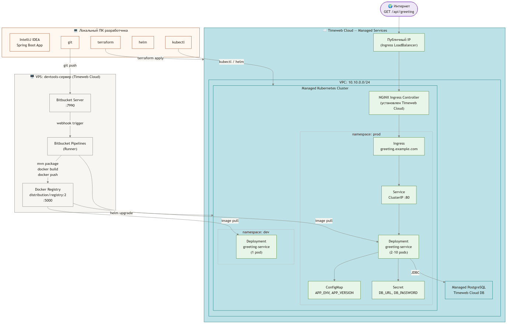
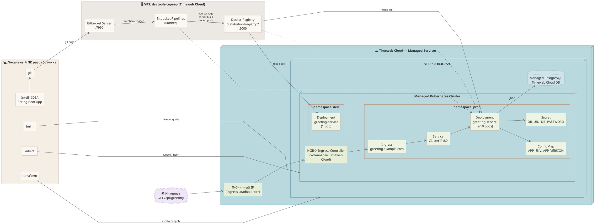
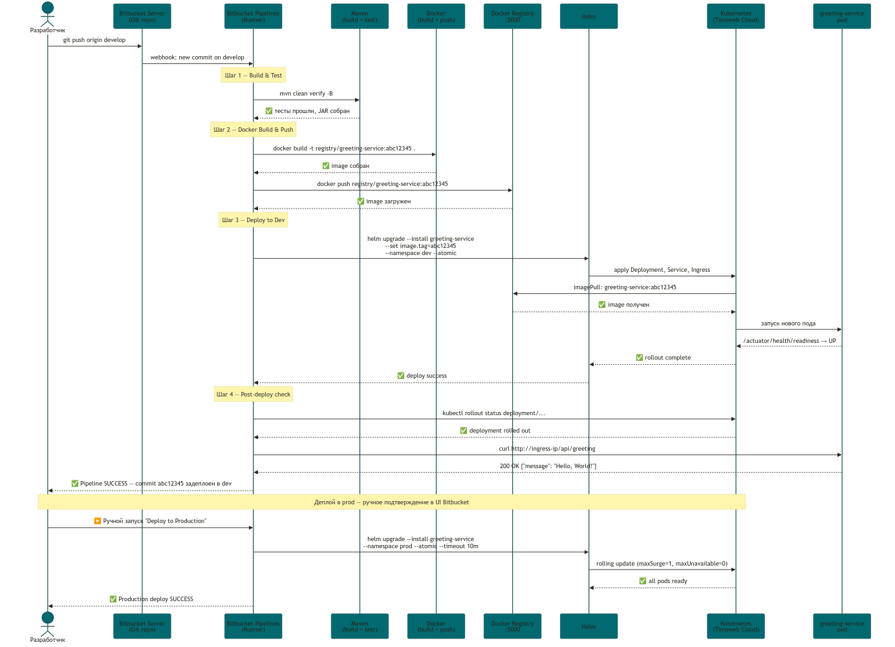
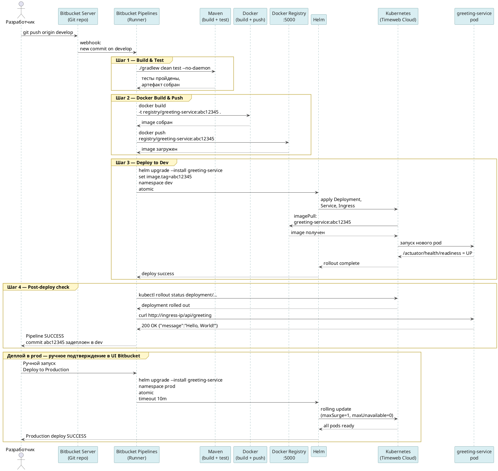
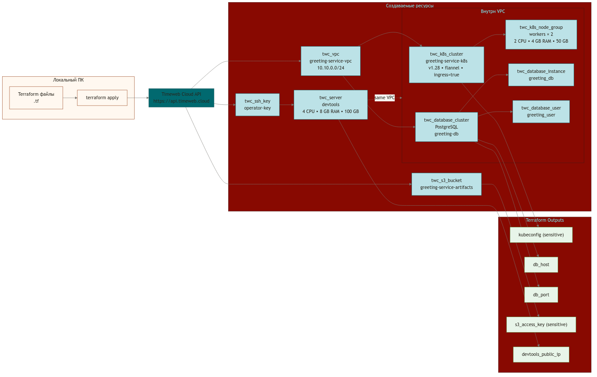
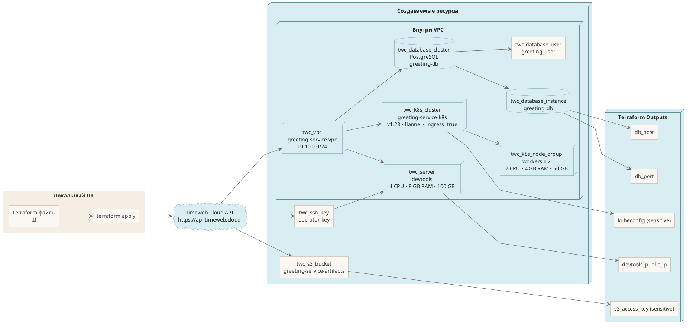

# Java-микросервис в Timeweb Cloud: полное руководство

Версия: 1.1 | 2026-04 | Целевая аудитория: backend developer middle+

Все описания — на русском языке. Технические термины — на английском. Команды — на английском.

---
## Оглавление

1. [Архитектурное описание решения](#%D1%80%D0%B0%D0%B7%D0%B4%D0%B5%D0%BB-1-%D0%B0%D1%80%D1%85%D0%B8%D1%82%D0%B5%D0%BA%D1%82%D1%83%D1%80%D0%BD%D0%BE%D0%B5-%D0%BE%D0%BF%D0%B8%D1%81%D0%B0%D0%BD%D0%B8%D0%B5-%D1%80%D0%B5%D1%88%D0%B5%D0%BD%D0%B8%D1%8F)
2. [Схема архитектуры](#%D1%80%D0%B0%D0%B7%D0%B4%D0%B5%D0%BB-2-%D1%81%D1%85%D0%B5%D0%BC%D0%B0-%D0%B0%D1%80%D1%85%D0%B8%D1%82%D0%B5%D0%BA%D1%82%D1%83%D1%80%D1%8B)
3. [Схема CI/CD процесса](#%D1%80%D0%B0%D0%B7%D0%B4%D0%B5%D0%BB-3-%D1%81%D1%85%D0%B5%D0%BC%D0%B0-cicd-%D0%BF%D1%80%D0%BE%D1%86%D0%B5%D1%81%D1%81%D0%B0)
4. [Схема Terraform-инфраструктуры](#%D1%80%D0%B0%D0%B7%D0%B4%D0%B5%D0%BB-4-%D1%81%D1%85%D0%B5%D0%BC%D0%B0-terraform-%D0%B8%D0%BD%D1%84%D1%80%D0%B0%D1%81%D1%82%D1%80%D1%83%D0%BA%D1%82%D1%83%D1%80%D1%8B)
5. [Структура репозитория](#%D1%80%D0%B0%D0%B7%D0%B4%D0%B5%D0%BB-5-%D1%81%D1%82%D1%80%D1%83%D0%BA%D1%82%D1%83%D1%80%D0%B0-%D1%80%D0%B5%D0%BF%D0%BE%D0%B7%D0%B8%D1%82%D0%BE%D1%80%D0%B8%D1%8F)
6. [Требования к локальному ПК](#%D1%80%D0%B0%D0%B7%D0%B4%D0%B5%D0%BB-6-%D1%82%D1%80%D0%B5%D0%B1%D0%BE%D0%B2%D0%B0%D0%BD%D0%B8%D1%8F-%D0%BA-%D0%BB%D0%BE%D0%BA%D0%B0%D0%BB%D1%8C%D0%BD%D0%BE%D0%BC%D1%83-%D0%BF%D0%BA--%D0%B8%D0%BD%D1%81%D1%82%D1%80%D1%83%D0%BC%D0%B5%D0%BD%D1%82%D1%8B-%D0%B8-%D0%BD%D0%B0%D1%81%D1%82%D1%80%D0%BE%D0%B9%D0%BA%D0%B0)
7. [Минимальный пример Spring Boot приложения](#%D1%80%D0%B0%D0%B7%D0%B4%D0%B5%D0%BB-7-%D0%BC%D0%B8%D0%BD%D0%B8%D0%BC%D0%B0%D0%BB%D1%8C%D0%BD%D1%8B%D0%B9-%D0%BF%D1%80%D0%B8%D0%BC%D0%B5%D1%80-spring-boot-%D0%BF%D1%80%D0%B8%D0%BB%D0%BE%D0%B6%D0%B5%D0%BD%D0%B8%D1%8F)
8. [Инструкция по локальной разработке](#%D1%80%D0%B0%D0%B7%D0%B4%D0%B5%D0%BB-8-%D0%B8%D0%BD%D1%81%D1%82%D1%80%D1%83%D0%BA%D1%86%D0%B8%D1%8F-%D0%BF%D0%BE-%D0%BB%D0%BE%D0%BA%D0%B0%D0%BB%D1%8C%D0%BD%D0%BE%D0%B9-%D1%80%D0%B0%D0%B7%D1%80%D0%B0%D0%B1%D0%BE%D1%82%D0%BA%D0%B5)
9. [Создание инфраструктуры через Terraform](#%D1%80%D0%B0%D0%B7%D0%B4%D0%B5%D0%BB-9-%D1%81%D0%BE%D0%B7%D0%B4%D0%B0%D0%BD%D0%B8%D0%B5-%D0%B8%D0%BD%D1%84%D1%80%D0%B0%D1%81%D1%82%D1%80%D1%83%D0%BA%D1%82%D1%83%D1%80%D1%8B-%D1%87%D0%B5%D1%80%D0%B5%D0%B7-terraform)
10. [Настройка devtools-сервера](#%D1%80%D0%B0%D0%B7%D0%B4%D0%B5%D0%BB-10-%D0%BD%D0%B0%D1%81%D1%82%D1%80%D0%BE%D0%B9%D0%BA%D0%B0-devtools-%D1%81%D0%B5%D1%80%D0%B2%D0%B5%D1%80%D0%B0-bitbucket-server--docker-registry)
11. [Bitbucket Pipelines Runner (self-hosted)](#%D1%80%D0%B0%D0%B7%D0%B4%D0%B5%D0%BB-11-%D0%B8%D0%BD%D1%81%D1%82%D1%80%D1%83%D0%BA%D1%86%D0%B8%D1%8F-%D0%BF%D0%BE-bitbucket-pipelines-runner-self-hosted)
12. [Развёртывание Kubernetes](#%D1%80%D0%B0%D0%B7%D0%B4%D0%B5%D0%BB-12-%D1%80%D0%B0%D0%B7%D0%B2%D1%91%D1%80%D1%82%D1%8B%D0%B2%D0%B0%D0%BD%D0%B8%D0%B5-kubernetes-%D0%BE%D1%82-%D0%BD%D1%83%D0%BB%D1%8F-%D0%B4%D0%BE-%D1%80%D0%B0%D0%B1%D0%BE%D1%82%D0%B0%D1%8E%D1%89%D0%B5%D0%B3%D0%BE-%D0%BF%D0%BE%D0%B4%D0%B0)
13. [Ручное управление Kubernetes](#%D1%80%D0%B0%D0%B7%D0%B4%D0%B5%D0%BB-13-%D1%80%D1%83%D1%87%D0%BD%D0%BE%D0%B5-%D1%83%D0%BF%D1%80%D0%B0%D0%B2%D0%BB%D0%B5%D0%BD%D0%B8%D0%B5-kubernetes-%D1%81-%D0%BB%D0%BE%D0%BA%D0%B0%D0%BB%D1%8C%D0%BD%D0%BE%D0%B3%D0%BE-%D0%BF%D0%BA)
14. [Helm chart: деплой и управление](#%D1%80%D0%B0%D0%B7%D0%B4%D0%B5%D0%BB-14-helm-chart-%D0%B4%D0%B5%D0%BF%D0%BB%D0%BE%D0%B9-%D0%B8-%D1%83%D0%BF%D1%80%D0%B0%D0%B2%D0%BB%D0%B5%D0%BD%D0%B8%D0%B5-%D0%BF%D1%80%D0%B8%D0%BB%D0%BE%D0%B6%D0%B5%D0%BD%D0%B8%D0%B5%D0%BC)
15. [Bitbucket Pipelines: CI/CD](#%D1%80%D0%B0%D0%B7%D0%B4%D0%B5%D0%BB-15-bitbucket-pipelines-%D0%BD%D0%B0%D1%81%D1%82%D1%80%D0%BE%D0%B9%D0%BA%D0%B0-%D0%B8-%D0%B7%D0%B0%D0%BF%D1%83%D1%81%D0%BA-cicd)
16. [Стратегия окружений](#%D1%80%D0%B0%D0%B7%D0%B4%D0%B5%D0%BB-16-%D1%81%D1%82%D1%80%D0%B0%D1%82%D0%B5%D0%B3%D0%B8%D1%8F-%D0%BE%D0%BA%D1%80%D1%83%D0%B6%D0%B5%D0%BD%D0%B8%D0%B9-dev--stage--prod)
17. [PostgreSQL](#%D1%80%D0%B0%D0%B7%D0%B4%D0%B5%D0%BB-17-postgresql-%D0%B2%D1%8B%D0%B1%D0%BE%D1%80-%D0%BF%D0%BE%D0%B4%D0%BA%D0%BB%D1%8E%D1%87%D0%B5%D0%BD%D0%B8%D0%B5-%D0%B4%D0%BE%D0%B1%D0%B0%D0%B2%D0%BB%D0%B5%D0%BD%D0%B8%D0%B5-%D0%BF%D0%BE%D0%B7%D0%B6%D0%B5)
18. [Безопасность](#%D1%80%D0%B0%D0%B7%D0%B4%D0%B5%D0%BB-18-%D0%B1%D0%B5%D0%B7%D0%BE%D0%BF%D0%B0%D1%81%D0%BD%D0%BE%D1%81%D1%82%D1%8C)
19. [Эксплуатация](#%D1%80%D0%B0%D0%B7%D0%B4%D0%B5%D0%BB-19-%D1%8D%D0%BA%D1%81%D0%BF%D0%BB%D1%83%D0%B0%D1%82%D0%B0%D1%86%D0%B8%D1%8F-rollback-scale-update-redeploy)
20. [Диагностика](#%D1%80%D0%B0%D0%B7%D0%B4%D0%B5%D0%BB-20-%D0%B4%D0%B8%D0%B0%D0%B3%D0%BD%D0%BE%D1%81%D1%82%D0%B8%D0%BA%D0%B0-%D1%82%D0%B8%D0%BF%D0%BE%D0%B2%D1%8B%D1%85-%D0%BF%D1%80%D0%BE%D0%B1%D0%BB%D0%B5%D0%BC)
21. [Расширение решения](#%D1%80%D0%B0%D0%B7%D0%B4%D0%B5%D0%BB-21-%D1%80%D0%B0%D1%81%D1%88%D0%B8%D1%80%D0%B5%D0%BD%D0%B8%D0%B5-%D1%80%D0%B5%D1%88%D0%B5%D0%BD%D0%B8%D1%8F)
22. [Self-review](#%D1%80%D0%B0%D0%B7%D0%B4%D0%B5%D0%BB-22-self-review-%D0%BF%D1%80%D0%BE%D0%B1%D0%B5%D0%BB%D1%8B-%D0%B8-%D1%83%D0%BB%D1%83%D1%87%D1%88%D0%B5%D0%BD%D0%B8%D1%8F)
23. [Финальная сводка](#%D1%80%D0%B0%D0%B7%D0%B4%D0%B5%D0%BB-23-%D1%84%D0%B8%D0%BD%D0%B0%D0%BB%D1%8C%D0%BD%D0%B0%D1%8F-%D1%81%D0%B2%D0%BE%D0%B4%D0%BA%D0%B0-%D1%87%D1%82%D0%BE-%D0%B3%D0%BE%D1%82%D0%BE%D0%B2%D0%BE-%D1%87%D1%82%D0%BE-%D0%B7%D0%B0%D0%BF%D0%BE%D0%BB%D0%BD%D0%B8%D1%82%D1%8C-%D0%B2%D1%80%D1%83%D1%87%D0%BD%D1%83%D1%8E)

***


---

## Раздел 1. Архитектурное описание решения

### Что строим

- Простой Java-микросервис на Spring Boot с **REST** endpoint **GET /api/greeting**.
- Сервис разворачивается в **Kubernetes**-кластере в **Timeweb Cloud,** доступен из интернета
через **NGINX Ingress Controller**. 
- Весь путь от **git push** до появления новой версии
в кластере автоматизирован через **Bitbucket Pipelines**.

- **Bitbucket Server, Docker Registry и Bitbucket Pipelines Runner** развёрнуты на VPS-сервере
внутри Timeweb Cloud — инфраструктура полностью автономна.

### Ключевые компоненты

| Компонент | Технология | Где развёрнут |
|---|---|---|
| Исходный код | Java 21, Spring Boot 3.3 | Bitbucket Server (VPS Timeweb Cloud) |
| CI/CD pipeline | Bitbucket Pipelines + Runner | VPS devtools-сервер |
| Docker Registry | distribution/registry:2 | VPS devtools-сервер |
| Kubernetes кластер | Managed K8S (twc_k8s_cluster) | Timeweb Cloud |
| База данных | Managed PostgreSQL (twc_database_cluster) | Timeweb Cloud |
| Хранилище артефактов | S3 (twc_s3_bucket) | Timeweb Cloud |
| Сеть | VPC 10.10.0.0/24 (twc_vpc) | Timeweb Cloud |
| Infrastructure as Code | Terraform + timeweb-cloud provider | Локальный ПК |
| Деплой в K8S | Helm 3 | Bitbucket Pipelines / Локальный ПК |


### Ключевые архитектурные решения

- **Почему Bitbucket Server на VPS, а не Bitbucket Cloud?**
Задание требует автономной инфраструктуры — всё размещено на серверах **Timeweb Cloud**:
  - **Bitbucket Cloud** — это SaaS-сервис (внешний), тогда как **Bitbucket Server** — **self-hosted** решение.

- **Почему Docker Registry на том же VPS?**
  - Для одного разработчика или небольшой команды этого достаточно.
**distribution/registry:2** — лёгкий **open-source registry** под полным контролем.
 - В **Timeweb Cloud** есть Container Registry API, но на момент написания отсутствует **Terraform-ресурс** в провайдере.

- **Почему Managed PostgreSQL, а не PostgreSQL в Kubernetes?**
   - **Timeweb Cloud** берёт на себя управление: **бэкапы**, **failover**, **обновления**.
   Нет риска потери данных при пересоздании кластера.
   - **PostgreSQL в Kubernetes** через **StatefulSet** — это отдельный сложный сценарий.

- **Почему Helm, а не plain Kubernetes YAML?**
  - **Helm** даёт шаблонизацию под разные окружения через **values**.
  - Встроенный **rollback**: `helm rollback`.
  - История релизов: `helm history`.

***

## Раздел 2. Схема архитектуры





### Пояснение технологии


**Локальный ПК разработчика**

- **IntelliJ IDEA** используется для разработки **Spring Boot** приложения.
- **git**, **terraform**, **helm**, **kubectl** — локальные инструменты для работы с кодом, инфраструктурой и кластером.

**VPS: devtools-сервер**

- **Bitbucket Server** хранит репозиторий и принимает **git push**.
- **Bitbucket Pipelines Runner** запускает сборку после **webhook trigger**.
- **Docker Registry** хранит собранные контейнерные образы.

**Timeweb Cloud — Managed Services**

- **VPC** объединяет управляемые ресурсы в одной приватной сети.
- **Managed Kubernetes Cluster** запускает приложение и связанные Kubernetes-ресурсы.
- **Managed PostgreSQL** вынесен из кластера и используется как управляемая БД.

**Контур Kubernetes**

- **NGINX Ingress Controller** принимает внешний трафик от **LoadBalancer**.
- В **namespace prod** расположены **Ingress**, **Service**, **Deployment**, **ConfigMap**, **Secret**.
- В **namespace dev** расположен отдельный **Deployment** для dev-окружения.

**Поток работы**

- Разработчик отправляет код в **Bitbucket Server**.
- **Runner** собирает приложение, выполняет **docker build** и **docker push** в **Docker Registry**.
- **Kubernetes Deployment** выполняет **image pull** из registry.
- Входящий HTTP-запрос проходит путь: **Интернет → Публичный IP → NGINX Ingress Controller → Ingress → Service → Pod**.
- Приложение получает настройки из **ConfigMap** и **Secret**, затем подключается к **Managed PostgreSQL** по **JDBC**.


### Пояснение по инструментам

**Что делает Terraform**

- **Terraform** создаёт и изменяет инфраструктуру: например, **VPC**, сетевые ресурсы и управляемые сервисы через декларативную конфигурацию. См. [Terraform Intro](https://developer.hashicorp.com/terraform/intro)
- Стрелка **terraform apply** показывает: запускается команда, после чего облачная инфраструктура приводится к описанному в коде состоянию. См. [Create infrastructure](https://developer.hashicorp.com/terraform/tutorials/aws-get-started/aws-create)
- Проще говоря, **Terraform** нужен не для деплоя приложения, а для подготовки самой платформы, куда это приложение потом будет выкатываться. См. [What is Terraform](https://developer.hashicorp.com/terraform/intro)

> "Terraform allows you to define infrastructure in human-readable configuration files."

> «Terraform позволяет описывать инфраструктуру в человекочитаемых конфигурационных файлах.»

**Что делает Helm**

- **Helm** — это пакетный менеджер для **Kubernetes**, который устанавливает приложение как набор шаблонов и настроек (**chart + values**). См. [Helm Charts: making it simple to package and deploy apps on Kubernetes](https://kubernetes.io/blog/2016/10/helm-charts-making-it-simple-to-package-and-deploy-apps-on-kubernetes/)
- Стрелка **helm upgrade** показывает обновление или установку приложения в кластер: меняются **Deployment**, **Service**, **Ingress** и другие Kubernetes-ресурсы. См. [Deploying Apps in Your K8s Cluster with Helm, Step By Step](https://codefresh.io/learn/kubernetes-management/helm-deployment/)
- Проще говоря, **Helm** нужен для удобного деплоя приложения в разные окружения, например **dev** и **prod**. См. [Kubernetes Helm: K8s application deployment made simple](https://www.flexera.com/blog/finops/kubernetes-architecture-kubernetes-helm-k8s-application-deployment-made-simple/)

> "Helm Charts help you define, install, and upgrade even the most complex Kubernetes application."

> «Helm Charts помогают описывать, устанавливать и обновлять даже очень сложные приложения Kubernetes.»

**Что делает kubectl**

- **kubectl** — это основная CLI-утилита для управления **Kubernetes** и диагностики: посмотреть pod, логи, состояние deployment, применить или удалить ресурсы. См. [Command line tool (kubectl)](https://kubernetes.io/docs/reference/kubectl/)
- Стрелка **kubectl / helm** означает ручную работу администратора или разработчика с кластером: проверка состояния, отладка, перезапуск, просмотр логов. См. [Introduction to kubectl](https://kubernetes.io/docs/reference/kubectl/introduction/)
- Проще говоря, если **Terraform** строит инфраструктуру, а **Helm** выкатывает приложение, то **kubectl** помогает этим всем управлять и разбираться, если что-то пошло не так. См. [Обзор kubectl](https://kubernetes.io/ru/docs/reference/kubectl/overview/)

> "kubectl controls the Kubernetes cluster manager."

> «kubectl управляет менеджером кластера Kubernetes.»

---

## Раздел 3. Схема CI/CD процесса

***


Sequence diagram: полная последовательность от git push до работающего пода в K8S.

Исходник в формате Mermaid: docs/diagrams/cicd-flow.mmd

Ключевые точки:
1. git push origin develop → Bitbucket Server → webhook → Pipelines Runner
2. Runner: ./gradlew clean test --no-daemon (сборка + тесты)
3. Runner: docker build + docker push в Registry (тег = short commit hash)
4. Runner: helm upgrade --install --atomic → Kubernetes
5. K8S: imagePull из Registry → запуск нового пода → readiness probe
6. Пост-деплой проверка через kubectl rollout status
7. Деплой в prod — только ручной триггер в UI Bitbucket

---



## Ключевые точки

1. **`git push origin develop` → Bitbucket Server → webhook → Pipelines Runner**
  - Разработчик отправляет изменения в ветку **develop**.
  - **Bitbucket Server** фиксирует новый commit и через **webhook** запускает pipeline на **Runner**.
2. **Runner: `./gradlew clean test --no-daemon` — сборка и тесты**
   - На этом шаге проект собирается и проходят автоматические тесты.
   - `clean` очищает результаты прошлых сборок, `test` запускает проверки, а `--no-daemon` обычно используют для более предсказуемого одноразового запуска в CI-среде. См. [Gradle CLI](https://docs.gradle.org/current/userguide/command_line_interface.html)

> "--daemon , --no-daemon. Use the Gradle Daemon to run the build. Starts the daemon if not running or the existing daemon is busy. Default is on."

> «--daemon и --no-daemon управляют использованием Gradle Daemon для выполнения сборки. По умолчанию daemon включён.»
3. **Runner: `docker build` + `docker push` в Registry, тег = short commit hash**
   - После успешной сборки создаётся Docker-образ приложения.
   - Затем этот образ публикуется в **Docker Registry**, чтобы **Kubernetes** мог скачать именно ту версию, которая соответствует конкретному commit.
   - Использование **short commit hash** в теге помогает однозначно связать контейнер с исходным кодом.
4. **Runner: `helm upgrade --install --atomic` → Kubernetes**
   - **Helm** разворачивает приложение в кластер или обновляет уже существующий релиз.
     - Ключ `--install` означает: если релиза ещё нет, его нужно создать.
     - Ключ `--atomic` означает: если обновление не удалось, **Helm** автоматически откатывает изменения назад. См. [helm upgrade](https://helm.sh/docs/helm/helm_upgrade/) и [atomic explanation](https://learn.microsoft.com/en-us/answers/questions/1368659/aks-helm-chart-and-cloud-native-application-bundle)

> "In Helm, the atomic flag is used to ensure that the release is installed or upgraded atomically. This means that if the installation or upgrade fails, the release is rolled back to the previous version."

> «В Helm флаг atomic гарантирует атомарную установку или обновление релиза. Если установка или обновление завершается ошибкой, релиз откатывается к предыдущей версии.»
5. **K8S: imagePull из Registry → запуск нового pod → readiness probe**
   - После применения манифестов **Kubernetes** скачивает нужный образ из **Registry**.
   - Затем создаётся новый **pod** приложения.
   - После старта Kubernetes проверяет **readiness probe**: пока приложение не готово принимать трафик, оно не считается рабочим.
6. **Пост-деплой проверка через `kubectl rollout status`**
   - Этот шаг нужен, чтобы дождаться завершения rollout и убедиться, что deployment дошёл до состояния ready.
   - Если rollout завис или завершился ошибкой, pipeline должен остановиться. См. [kubectl rollout status example](https://oneuptime.com/blog/post/2026-01-25-kubectl-rollout-deployment-management/view)

> "Wait for rollout with timeout"

> «Ожидать завершения rollout с таймаутом»

Важно: успешный `rollout status` ещё не гарантирует полную бизнес-исправность приложения, он подтверждает только то, что pod поднялся и прошёл readiness-проверки. См. [kubectl rollout best practices](https://scaleops.com/blog/kubectl-rollout-7-best-practices-for-production-2025/)

> "When it returns deployment \"my-app\" successfully rolled out, it only means one thing: Kubernetes managed to start the expected number of pods and they passed their readiness probes."

> «Когда команда возвращает, что deployment успешно выкатился, это означает только одно: Kubernetes смог поднять нужное число pod и они прошли readiness-проверки.»
7. **Деплой в prod — только ручной триггер в UI Bitbucket**
   - В **prod** деплой не должен запускаться автоматически после каждого push.
   - Сначала изменения проверяются на **dev**, и только потом человек вручную подтверждает выкладку в production.
   - Это снижает риск случайного выката неподтверждённой версии и добавляет контроль на финальном этапе.

***

***

### Разбор команды Helm

**Команда для dev**

`helm upgrade --install greeting-service --set image.tag=abc12345 --namespace dev --atomic`

- **`upgrade`** — обновить существующий релиз.
- **`--install`** — если релиза ещё нет, создать его.
- **`greeting-service`** — имя Helm-релиза.
- **`--set image.tag=abc12345`** — подставить тег Docker-образа в chart.
- **`--namespace dev`** — выполнить деплой в namespace **dev**.
- **`--atomic`** — если выкладка завершится ошибкой, **Helm** автоматически откатит изменения назад. См. [helm upgrade](https://helm.sh/docs/helm/helm_upgrade/)

> "If set, upgrade process rolls back changes made in case of failed upgrade. The --wait flag will be set automatically if --atomic is used"

> «Если флаг установлен, при неуспешном обновлении Helm откатывает внесённые изменения. При использовании --atomic автоматически включается --wait.»

**Команда для prod**

`helm upgrade --install greeting-service --namespace prod --atomic --timeout 10m`

- **`--namespace prod`** — деплой идёт в production namespace.
- **`--timeout 10m`** — Helm ждёт до 10 минут, пока ресурсы станут готовыми. Если readiness не достигнут за это время, операция считается неуспешной. См. [helm upgrade](https://helm.sh/docs/helm/helm_upgrade/) и [Helm timeout explanation](https://stackoverflow.com/questions/71417105/how-to-handle-helm-upgrade-timeout-error)

> "time to wait for any individual Kubernetes operation (like Jobs for hooks)"

> «время ожидания для любой отдельной операции Kubernetes (например, Job для hook-ов)»

Итог: тебе не хватает блока **«Разбор параметров команды»**.


## Раздел 4. Схема Terraform-инфраструктуры



Схема показывает, какие ресурсы создаёт terraform apply в Timeweb Cloud.

Исходник в формате Mermaid: docs/diagrams/infra-terraform.mmd


---





### Пояснение

**Что показывает схема**

- Схема показывает, какие ресурсы создаёт команда **`terraform apply`** в **Timeweb Cloud**.
- Источником является локальная Terraform-конфигурация, которая через **Timeweb Cloud API** создаёт облачные ресурсы.
- Отдельно показаны не только сами ресурсы, но и **Terraform Outputs**, которые потом используются в настройке и эксплуатации.

**Что создаётся через Terraform**

- **`twc_ssh_key`** — SSH-ключ для доступа к серверу.
- **`twc_vpc`** — приватная сеть **10.10.0.0/24**, в которой размещаются основные сервисы.
- **`twc_server`** — сервер **devtools**, на котором затем могут работать **Bitbucket Server**, **Docker Registry** и другие утилиты.
- **`twc_k8s_cluster`** — управляемый кластер **Kubernetes**.
- **`twc_k8s_node_group`** — группа worker-нод для запуска приложений в Kubernetes.
- **`twc_database_cluster`** — кластер управляемой базы данных **PostgreSQL**.
- **`twc_database_instance`** — конкретный инстанс базы внутри database cluster.
- **`twc_database_user`** — пользователь базы данных для приложения.
- **`twc_s3_bucket`** — S3-совместимый bucket для артефактов и файлов.

**Как связаны ресурсы**

- Сначала Terraform обращается к **Timeweb Cloud API** и создаёт базовые ресурсы.
- **SSH key** используется сервером **devtools**.
- **VPC** объединяет **devtools**, **Kubernetes** и **PostgreSQL** в одной сети.
- **Kubernetes cluster** использует **node group** для вычислительных ресурсов.
- **Database cluster** содержит **database instance** и **database user**.
- **S3 bucket** создаётся отдельно, но тоже управляется той же Terraform-конфигурацией.

**Что такое Terraform Outputs**

- **`kubeconfig`** — данные для подключения к кластеру **Kubernetes**.
- **`db_host`** и **`db_port`** — адрес и порт базы данных.
- **`s3_access_key`** — ключ доступа к S3-хранилищу.
- **`devtools_public_ip`** — публичный IP сервера **devtools**.


### Пояснение по Terraform

**Что делает `terraform apply`**

- Команда **`terraform apply`** берёт описанные в `.tf` файлах ресурсы и приводит инфраструктуру к этому состоянию. См. [Terraform в Timeweb Cloud](https://timeweb.cloud/docs/terraform)
- Проще говоря, это запуск создания или обновления всей облачной инфраструктуры из кода.

> "Terraform позволяет автоматизированно управлять ресурсами в Timeweb Cloud с помощью удобных файлов конфигурации формата HCL (HashiCorp Configuration Language) и детальных планов вносимых изменений."

> «Terraform позволяет автоматизированно управлять ресурсами в Timeweb Cloud с помощью удобных файлов конфигурации формата HCL (HashiCorp Configuration Language) и детальных планов вносимых изменений.»

**Почему `kubeconfig` и `s3_access_key` помечены как sensitive**

- Terraform требует явно помечать чувствительные output-значения как **sensitive**, чтобы снизить риск случайной утечки. См. [How-to output sensitive data with Terraform](https://support.hashicorp.com/hc/en-us/articles/5175257151891-How-to-output-sensitive-data-with-Terraform)
- Поэтому такие значения не должны свободно светиться в логах и выводе команд.

> "Terraform requires that any root module output containing sensitive data be explicitly marked as sensitive, to confirm your intent."

> «Terraform требует, чтобы любой output корневого модуля, содержащий чувствительные данные, был явно помечен как sensitive, чтобы подтвердить это намерение.»


---

## Раздел 5. Структура репозитория

```
greeting-service/
│
├── app/                                    Spring Boot приложение
│   ├── src/main/java/com/example/greeting/
│   │   ├── GreetingServiceApplication.java  Точка входа
│   │   ├── controller/GreetingController.java  REST endpoint
│   │   └── model/GreetingResponse.java      DTO ответа
│   ├── src/main/resources/application.yml  Конфигурация приложения
│   ├── src/test/java/...                   JUnit тесты
│   ├── Dockerfile                          Multi-stage build
│   ├── .dockerignore
│   └── pom.xml                             Maven зависимости
│
├── infra/
│   ├── terraform/                          Infrastructure as Code
│   │   ├── main.tf                         Provider + backend конфигурация
│   │   ├── variables.tf                    Все входные параметры
│   │   ├── outputs.tf                      Выходные значения
│   │   ├── vpc.tf                          twc_vpc — приватная сеть
│   │   ├── kubernetes.tf                   twc_k8s_cluster + node group
│   │   ├── database.tf                     twc_database_cluster (PostgreSQL)
│   │   ├── s3.tf                           twc_s3_bucket
│   │   ├── registry_server.tf              twc_server — VPS devtools
│   │   ├── scripts/devtools-init.sh        cloud-init скрипт
│   │   ├── terraform.tfvars.example        Пример переменных
│   │   └── .gitignore
│   │
│   ├── helm/greeting-service/              Helm chart
│   │   ├── Chart.yaml
│   │   ├── values.yaml                     Базовые значения
│   │   ├── values-dev.yaml                 Переопределения dev
│   │   ├── values-prod.yaml                Переопределения prod
│   │   └── templates/
│   │       ├── _helpers.tpl
│   │       ├── deployment.yaml
│   │       ├── service.yaml
│   │       ├── ingress.yaml
│   │       ├── serviceaccount.yaml
│   │       └── hpa.yaml
│   │
│   └── k8s/                                Сырые Kubernetes-манифесты
│       ├── namespace.yaml
│       ├── secret-template.yaml
│       └── registry-secret.yaml
│
├── ci/
│   └── bitbucket-pipelines.yml             CI/CD pipeline конфигурация
│
├── scripts/
│   ├── setup-registry.sh                   Установка Docker Registry на VPS
│   ├── get-kubeconfig.sh                   Получение kubeconfig из Terraform
│   └── create-secrets.sh                   Создание K8S Secrets во всех namespace
│
└── docs/
    ├── GUIDE.md                            Этот документ
    ├── TECHNOLOGIES.md                     Пояснение всех технологий
    ├── K8S_DEPLOYMENT.md                   Полная инструкция по K8S
    ├── diagrams/
    │   ├── architecture.mmd               Mermaid: архитектура
    │   ├── cicd-flow.mmd                  Mermaid: CI/CD sequence
    │   └── infra-terraform.mmd            Mermaid: Terraform ресурсы
    └── images/
        ├── architecture.png
        ├── cicd-flow.png
        └── infra-terraform.png
```

---


## Раздел 6. Требования к локальному ПК — инструменты и настройка

### Цель

- Установить и настроить все инструменты, необходимые для управления инфраструктурой,
деплоя и разработки с локального ПК.

### Необходимые инструменты

| Инструмент | Минимальная версия | Назначение |
|---|---|---|
| git | любая актуальная | Работа с репозиторием |
| Java JDK | 21 LTS (Eclipse Temurin) | Локальная сборка и запуск |
| Gradle | 8.x+ | Сборка Java проекта |
| Docker Desktop | актуальная | Локальная сборка и запуск контейнеров |
| kubectl | соответствует версии K8S | Управление Kubernetes кластером |
| helm | 3.x | Деплой через Helm chart |
| terraform | 1.4.4+ | Управление инфраструктурой |
| ssh | встроен в OS | Подключение к VPS серверам |

Gradle — современная система сборки для JVM-проектов. Официальная документация: https://docs.gradle.org/current/userguide/userguide.html

Скачать Eclipse Temurin JDK 21: https://adoptium.net/
Скачать kubectl: https://kubernetes.io/docs/tasks/tools/
Скачать Helm 3: https://helm.sh/docs/intro/install/
Скачать Terraform: https://developer.hashicorp.com/terraform/install

### Команды / действия (выполняется на локальном ПК)

```bash
# Проверка установки. Каждая команда должна вернуть версию без ошибок:
git --version
java --version
./gradlew --version
docker --version
kubectl version --client
helm version
terraform -v
ssh -V
```

```bash
# Генерация SSH-ключа для доступа к VPS.
# Terraform добавит этот публичный ключ на созданный devtools-сервер.
ssh-keygen -t rsa -b 4096 -C "devops-timeweb" -f ~/.ssh/id_rsa
# Публичный ключ: ~/.ssh/id_rsa.pub
# Приватный ключ: ~/.ssh/id_rsa (никому не передавать)

cat ~/.ssh/id_rsa.pub
# Убедитесь, что файл существует и начинается с "ssh-rsa"
```

```bash
# Переменные окружения. Добавьте в ~/.bashrc или ~/.zshrc:
export TF_VAR_twc_token="ваш-токен-timeweb-cloud"
export TF_VAR_db_password="надёжный-пароль-базы"
# После получения kubeconfig (Раздел 12):
export KUBECONFIG="$HOME/.kube/timeweb-greeting.yaml"

# Применить без перезапуска терминала:
source ~/.bashrc
```

### Как проверить результат

- Все команды из блока проверки установки возвращают версии.
    - `cat ~/.ssh/id_rsa.pub` показывает строку, начинающуюся с `ssh-rsa`.

### Типичные ошибки

- Ошибка: `command not found: terraform`
    - Причина: Terraform не добавлен в PATH.
    - Исправление (Linux/macOS): переместите бинарник в /usr/local/bin/: `sudo mv terraform /usr/local/bin/`

- Ошибка: `java --version` показывает версию 11 или 17, хотя установили 21.
    - Причина: активна другая версия JDK.
    - Исправление: `export JAVA_HOME=$(dirname $(dirname $(readlink -f $(which java))))` и добавьте JAVA_HOME в PATH. Либо используйте SDKMAN: https://sdkman.io/

---

## Раздел 7. Минимальный пример Spring Boot приложения

### Цель

- Показать структуру приложения. 
- **Основной акцент проекта** — инфраструктура и деплой, поэтому приложение намеренно минимальное.

### Ключевые файлы

`app/src/main/java/com/example/greeting/controller/GreetingController.java`:

```java
@RestController
@RequestMapping("/api")
public class GreetingController {

    @Value("${app.env:local}")
    private String appEnv;

    @Value("${app.version:unknown}")
    private String appVersion;

    @GetMapping("/greeting")
    public GreetingResponse greeting(
            @RequestParam(name = "name", defaultValue = "World") String name) {

        String message = "Hello, %s! Environment: %s, Version: %s"
                .formatted(name, appEnv, appVersion);

        return new GreetingResponse(message, appEnv, appVersion, Instant.now().toString());
    }
}
```

`app/src/main/java/com/example/greeting/model/GreetingResponse.java`:

```java
// Java 21 record — лаконичный DTO без boilerplate
public record GreetingResponse(
        String message,
        String environment,
        String version,
        String timestamp
) {}
```

`app/src/main/resources/application.yml`:

```yaml
server:
  port: 8080

app:
  env: ${APP_ENV:local}          # читается из переменной окружения, fallback: local
  version: ${APP_VERSION:unknown}

management:
  endpoints:
    web:
      exposure:
        include: health,info,metrics
  endpoint:
    health:
      show-details: always
  health:
    livenessState:
      enabled: true   # /actuator/health/liveness — для K8S liveness probe
    readinessState:
      enabled: true   # /actuator/health/readiness — для K8S readiness probe
```

**Разница проб простая:**

- **liveness** — жив ли вообще процесс, надо ли его остановить и перезапустить.
- **readiness** — готов ли этот экземпляр сейчас обслуживать трафик.

***

### Контекст `application.yml`

```yaml
management:
  health:
    livenessState:
      enabled: true   # /actuator/health/liveness — для K8S liveness probe
    readinessState:
      enabled: true   # /actuator/health/readiness — для K8S readiness probe
```

**`/actuator/health/liveness` (liveness probe)**

- Kubernetes ходит сюда, чтобы понять: **приложение “зависло” или умерло**.
- Если endpoint возвращает **ошибку**, kubelet считает **pod** “мертвым” и **перезапускает контейнер**.
- Используется для ситуаций вроде **deadlock**, бесконечной блокировки, утечки памяти — когда лечится только рестартом.

**`/actuator/health/readiness` (readiness probe)**

- Kubernetes проверяет: **можно ли сейчас слать трафик именно в этот pod**.
- Если endpoint возвращает **ошибку**, pod **остается запущенным**, но его **убирают из Service/Endpoints**, и трафик на него не идёт.
- Типичные случаи: инициализация данных, миграции, перегрев по нагрузке, временная недоступность внешних зависимостей.

Проще:

- **Liveness** — “убить и перезапустить или оставить жить?”.
- **Readiness** — “готов принимать запросы или пока не трогаем?”.


Официальная документация Spring Boot: https://docs.spring.io/spring-boot/docs/current/reference/html/

> **EN:** Spring Boot makes it easy to create stand-alone, production-grade Spring based Applications that you can just run. We take an opinionated view of the Spring platform and third-party libraries, so you can get started with minimum fuss.

> **RU:** Spring Boot упрощает создание самостоятельных, готовых к продакшну Spring-приложений, которые можно просто запустить. Мы придерживаемся продуманного подхода к платформе Spring и сторонним библиотекам, чтобы вы могли начать работу с минимальными усилиями.

### Как проверить результат

После запуска: `curl http://localhost:8080/api/greeting?name=Developer`

Ожидаемый ответ:
```json
{
  "message": "Hello, Developer! Environment: local, Version: unknown",
  "environment": "local",
  "version": "unknown",
  "timestamp": "2026-04-03T..."
}
```

---

## Раздел 8. Инструкция по локальной разработке

### Цель

Запустить и проверить приложение локально до работы с инфраструктурой.

### Команды / действия (выполняется на локальном ПК)

```bash
# 1. Клонировать репозиторий после создания в Bitbucket:
git clone http://<BITBUCKET_IP>:7990/scm/greeting/greeting-service.git
cd greeting-service

# 2. Запустить тесты и собрать JAR:
cd app
./gradlew clean test --no-daemon
# Результат: build/libs/greeting-service-0.0.1-SNAPSHOT.jar
# Если тесты провалились — смотрите вывод, там будет строка с "FAILED"

# 3. Запустить локально через Gradle:
APP_ENV=local APP_VERSION=dev ./gradlew bootRun --no-daemon
# Приложение слушает на порту 8080

# 4. Проверить endpoint (в другом терминале):
curl "http://localhost:8080/api/greeting?name=Developer"

# 5. Проверить health:
curl "http://localhost:8080/actuator/health"
```

```bash
# Локальный запуск через Docker (проверить перед push в Registry):
cd app
docker build -t greeting-service:local .

docker run --rm -p 8080:8080 \
  -e APP_ENV=local \
  -e APP_VERSION=dev \
  greeting-service:local

# Проверка:
curl "http://localhost:8080/api/greeting"
```

### Как проверить результат

`curl http://localhost:8080/api/greeting` возвращает JSON с HTTP 200.
`curl http://localhost:8080/actuator/health` возвращает `{"status":"UP"}`.

### Типичные ошибки

- Ошибка: `Port 8080 is already in use`
  - Исправление: `lsof -ti :8080 | xargs kill -9` или запустить на другом порту: `SERVER_PORT=8081 ./gradlew bootRun --no-daemon`

- Ошибка: `Cannot find symbol: record GreetingResponse`
  - Причина: активна Java версии ниже 16 (records появились в Java 16, стабилизировались в 17+).
  - Исправление: убедитесь, что `java --version` показывает 21. В `build.gradle` должно быть настроено `sourceCompatibility = JavaVersion.VERSION_21`.

---

## Раздел 9. Создание инфраструктуры через Terraform

### Цель

- Воспроизводимо создать всю инфраструктуру в Timeweb Cloud одной командой.
- После этого шага у вас есть Kubernetes-кластер, VPS devtools-сервер и PostgreSQL.

### Предварительные условия (выполняется один раз)

```bash
# 1. Создайте аккаунт Timeweb Cloud: https://timeweb.cloud
# 2. Создайте API-токен: https://timeweb.cloud/my/api-keys
#    ВАЖНО: в настройках токена отключите подтверждение удаления через Telegram.
#    Иначе terraform destroy будет ждать подтверждения и зависнет.
#    Подробнее: https://timeweb.cloud/docs/terraform/nachalo-raboty-s-terraform
```

### Настройка зеркала Terraform для России

Стандартный registry.terraform.io может быть недоступен из России.
Создайте файл `~/.terraformrc`:

```hcl
provider_installation {
  network_mirror {
    url     = "https://terraform-mirror.timeweb.cloud/"
    include = ["registry.terraform.io/timeweb-cloud/*"]
  }
  direct {
    exclude = ["registry.terraform.io/timeweb-cloud/*"]
  }
}
```

- Документация провайдера в реестре: https://registry.terraform.io/providers/timeweb-cloud/timeweb-cloud/latest/docs
- Зеркало: http://terraform-mirror.timeweb.cloud/

### Команды / действия (выполняется на локальном ПК)

```bash
cd infra/terraform

# Шаг 1. Задаём секреты через переменные окружения.
# НИКОГДА не записывайте токен напрямую в .tf файл.
export TF_VAR_twc_token="ваш-api-токен"
export TF_VAR_db_password="надёжный-пароль"

# Шаг 2. Копируем пример переменных и заполняем несекретные значения.
cp terraform.tfvars.example terraform.tfvars
# Отредактируйте terraform.tfvars: укажите location, k8s_version и т.д.
# terraform.tfvars уже добавлен в .gitignore — не попадёт в git.

# Шаг 3. Инициализация — скачать провайдер, подключить backend.
terraform init
# Ожидаемый вывод: "Terraform has been successfully initialized!"

# Шаг 4. Планирование — показывает что будет создано. ВСЕГДА перед apply.
terraform plan
# Внимательно прочитайте вывод. Должно быть около 10 ресурсов "to add".

# Шаг 5. Применение.
# ВНИМАНИЕ: создаёт реальные платные ресурсы в Timeweb Cloud.
# Terraform запросит подтверждение: введите 'yes'.
terraform apply
# Процесс занимает 10–20 минут (K8S кластер создаётся дольше всего).

# Шаг 6. Сохранение kubeconfig. Обязательно сразу после apply.
terraform output -raw kubeconfig > ~/.kube/timeweb-greeting.yaml
chmod 600 ~/.kube/timeweb-greeting.yaml
# terraform output -raw — выводит sensitive output без маскировки звёздочками.
```

- Документация Terraform: https://developer.hashicorp.com/terraform/intro

> **EN:** Terraform is an infrastructure as code tool that lets you define both cloud and on-prem resources in human-readable configuration files that you can version, reuse, and share.

> **RU:** Terraform — это инструмент «инфраструктура как код», который позволяет описывать облачные и локальные ресурсы в читаемых конфигурационных файлах, которые можно версионировать, переиспользовать и совместно использовать.

### Как проверить результат

```bash
# Статус кластера (должен быть 'active'):
terraform output k8s_cluster_status

# Список всех созданных ресурсов в state:
terraform state list

# Проверка подключения к Kubernetes:
export KUBECONFIG=~/.kube/timeweb-greeting.yaml
kubectl get nodes
# Ожидаемый вывод: 2 worker-узла в статусе Ready
```

### Типичные ошибки

- Ошибка: `Error: 401 Unauthorized`
  - Причина: некорректный API токен.
  - Исправление: проверьте токен в панели https://timeweb.cloud/my/api-keys. Убедитесь, что скопирован полностью.

- Ошибка: `Provider produced inconsistent result after apply`
  - Причина: кластер ещё инициализируется — Terraform не дождался статуса `active`.
  - Исправление: подождите 5–10 минут, выполните `terraform refresh`, затем `terraform apply` снова.

- Ошибка: `no such file or directory: ~/.ssh/id_rsa.pub`
  - Причина: SSH-ключ не сгенерирован, а `registry_server.tf` пытается его прочитать.
  - Исправление: `ssh-keygen -t rsa -b 4096 -f ~/.ssh/id_rsa` — сгенерировать ключ.

- Ошибка: `data.twc_k8s_preset not found` или `data.twc_configurator not found`
  - Причина: запрошенная комбинация CPU/RAM не соответствует доступным пресетам.
  - Исправление: в панели Timeweb Cloud проверьте доступные конфигурации K8S и обновите переменные в `terraform.tfvars`.

---

## Раздел 10. Настройка devtools-сервера (Bitbucket Server + Docker Registry)

### Цель

Развернуть Bitbucket Server и Docker Registry на VPS devtools-сервере,
созданном Terraform. Это основа всего CI/CD.

### Что делается на локальном ПК

```bash
# Получить публичный IP devtools-сервера из Terraform outputs:
DEVTOOLS_IP=$(terraform -chdir=infra/terraform output -raw devtools_public_ip)
echo "Devtools IP: ${DEVTOOLS_IP}"

# Проверить SSH-доступ к серверу:
ssh ubuntu@${DEVTOOLS_IP} "echo connected"
# Если отвечает "connected" — всё работает.
```

### Что делается на devtools-сервере — установка Docker Registry

```bash
# Передаём скрипт с локального ПК и запускаем на сервере:
ssh ubuntu@${DEVTOOLS_IP} 'bash -s' < scripts/setup-registry.sh

# Скрипт установит:
# - Docker (уже есть из cloud-init)
# - distribution/registry:2 с htpasswd-аутентификацией
# - Registry поднимается как Docker-контейнер на порту 5000
```

### Что делается на devtools-сервере — установка Bitbucket Server

Bitbucket Server — self-hosted продукт Atlassian. Требует лицензию.
Для учебного проекта используется trial (30 дней).
Официальная инструкция по установке на Linux:
https://confluence.atlassian.com/bitbucketserver/install-bitbucket-server-on-linux-868976317.html

```bash
# Подключиться к серверу:
ssh ubuntu@${DEVTOOLS_IP}

# На сервере — установка Bitbucket Server:
# cloud-init уже установил Java 17, Docker, nginx

# Скачать Bitbucket Server (проверьте актуальную версию на сайте Atlassian):
wget https://product-downloads.atlassian.com/software/stash/downloads/atlassian-bitbucket-9.4.0.tar.gz
tar -xzf atlassian-bitbucket-9.4.0.tar.gz

# Задать HOME директорию для данных Bitbucket:
export BITBUCKET_HOME=/opt/bitbucket-home
mkdir -p ${BITBUCKET_HOME}
echo "export BITBUCKET_HOME=/opt/bitbucket-home" >> ~/.bashrc

# Запустить:
cd atlassian-bitbucket-9.4.0
./bin/start-bitbucket.sh

# Bitbucket запустится на порту 7990.
# Открыть в браузере: http://<DEVTOOLS_IP>:7990
# Пройти первичную настройку: создать admin-пользователя, ввести лицензию.
```

### Настройка nginx как reverse proxy перед Bitbucket

```bash
# На devtools-сервере:
sudo tee /etc/nginx/sites-available/bitbucket > /dev/null << 'EOF'
server {
    listen 80;
    server_name _;

    # Bitbucket
    location / {
        proxy_pass         http://localhost:7990;
        proxy_set_header   Host $host;
        proxy_set_header   X-Real-IP $remote_addr;
        proxy_set_header   X-Forwarded-For $proxy_add_x_forwarded_for;
        proxy_set_header   X-Forwarded-Proto $scheme;
        client_max_body_size 100m;
    }
}
EOF

sudo ln -sf /etc/nginx/sites-available/bitbucket /etc/nginx/sites-enabled/bitbucket
sudo rm -f /etc/nginx/sites-enabled/default
sudo nginx -t && sudo systemctl reload nginx
```

### Как проверить результат

```bash
# Docker Registry отвечает (с локального ПК):
curl -u registryuser:registrypassword http://${DEVTOOLS_IP}:5000/v2/
# Ожидаемый ответ: {}

# Bitbucket отвечает:
curl http://${DEVTOOLS_IP}:7990/status
# Ожидаемый ответ: {"state":"RUNNING",...}

# Тестовый docker pull/push с локального ПК:
docker login ${DEVTOOLS_IP}:5000 -u registryuser -p registrypassword
docker pull hello-world
docker tag hello-world ${DEVTOOLS_IP}:5000/hello-world:test
docker push ${DEVTOOLS_IP}:5000/hello-world:test
```

### Типичные ошибки

- Ошибка: SSH отклоняет подключение.
  - Причина: Firewall блокирует порт 22 или Terraform не добавил SSH-ключ корректно.
  - Исправление: в панели Timeweb Cloud проверьте раздел Firewall. Убедитесь, что `twc_ssh_key` создан с правильным публичным ключом.

- Ошибка: `http: server gave HTTP response to HTTPS client` при docker push.
  - Причина: Docker по умолчанию требует HTTPS для любого Registry, кроме localhost.
  - Исправление: добавьте сервер в insecure-registries. На локальном ПК в `/etc/docker/daemon.json`:
```json
{ "insecure-registries": ["<DEVTOOLS_IP>:5000"] }
```
Затем `sudo systemctl restart docker`.

---

## Раздел 11. Инструкция по Bitbucket Pipelines Runner (self-hosted)

### Цель

- **Bitbucket Server** сам по себе не выполняет pipeline-шаги.
  - Для этого нужен отдельный компонент — Bitbucket Pipelines Runner.
  - Runner запускается как Docker-контейнер на devtools-сервере и подключается
к Bitbucket для получения задач.

- Официальная документация: https://support.atlassian.com/bitbucket-cloud/docs/runners/

### Аналогия

- Runner — это исполнитель на заводе-конвейере. Bitbucket (менеджер) ставит задачи,
- Runner (рабочий) их выполняет: собирает, тестирует, публикует, деплоит.

### Команды / действия

#### Шаг 1. Создать Runner в Bitbucket UI

- На devtools-сервере в браузере открыть Bitbucket:

```html

http://<DEVTOOLS_IP>:7990

```

- Путь: Repository → Settings → Runners → Add runner

- В форме:
  - Name: `devtools-runner`
  - Platform: Linux
  - Labels: `self-hosted`

- После создания Bitbucket покажет команду запуска с параметрами.
- Скопируйте значения `ACCOUNT_UUID`, `RUNNER_UUID`, `OAUTH_CLIENT_ID`, `OAUTH_CLIENT_SECRET`.

#### Шаг 2. Запустить Runner на devtools-сервере

```bash
# Подключиться к devtools-серверу:
ssh ubuntu@${DEVTOOLS_IP}

# Запустить Bitbucket Pipelines Runner как Docker-контейнер.
# Подставьте реальные значения из шага 1.
docker run -d \
  --name bitbucket-runner \
  --restart always \
  -v /var/run/docker.sock:/var/run/docker.sock \
  -v /tmp:/tmp \
  -e ACCOUNT_UUID="{ваш-account-uuid}" \
  -e RUNNER_UUID="{ваш-runner-uuid}" \
  -e OAUTH_CLIENT_ID="ваш-client-id" \
  -e OAUTH_CLIENT_SECRET="ваш-client-secret" \
  -e WORKING_DIRECTORY="/tmp" \
  docker-public.packages.atlassian.com/atlassian/bitbucket-pipelines-runner:latest

# -v /var/run/docker.sock — даём Runner доступ к Docker на хосте.
# Это нужно, чтобы pipeline мог выполнять команды docker build / docker push.
```

#### Шаг 3. Указать Runner в bitbucket-pipelines.yml

```yaml
# В шаге, который должен выполняться на self-hosted Runner:
- step:
    name: "Build & Test"
    runs-on:
      - self-hosted       # Метка, по которой Bitbucket выбирает Runner
```

- Если `runs-on` не указан — Bitbucket использует cloud Runner
(только для Bitbucket Cloud, не для Server).

### Как проверить результат

```bash
# На devtools-сервере:
docker ps | grep bitbucket-runner
# Должен быть Running

docker logs bitbucket-runner --tail 30
# В логах должно быть: "Runner is connected"

# В Bitbucket UI: Repository → Settings → Runners
# Runner должен быть в статусе Online
```

### Типичные ошибки

- Ошибка: Runner в статусе Offline после запуска.
  - Причина: неверные OAUTH_CLIENT_ID / OAUTH_CLIENT_SECRET.
  - Исправление: пересоздайте Runner в Bitbucket UI — будут новые credentials.

- Ошибка: `Cannot connect to the Docker daemon` в pipeline.
  - Причина: в docker run не передан `-v /var/run/docker.sock:/var/run/docker.sock`.
  - Исправление: перезапустите Runner с правильными параметрами:
  
```bash

docker stop bitbucket-runner && docker rm bitbucket-runner
docker run -d --name bitbucket-runner ... -v /var/run/docker.sock:/var/run/docker.sock ...
```

---

## Раздел 12. Развёртывание Kubernetes: от нуля до работающего пода

### Цель

- **Пошаговая инструкция** первичного развёртывания приложения в Kubernetes-кластере.
- После этого раздела: приложение запущено в кластере, доступно по HTTP снаружи.

- **Этот раздел** — **ручной деплой** для понимания процесса. CI/CD (Раздел 15) автоматизирует те же шаги.

### Предварительные условия

- terraform apply выполнен (Раздел 9)
- kubeconfig сохранён в `~/.kube/timeweb-greeting.yaml`
- Docker Registry запущен на devtools-сервере (Раздел 10)
- Docker image собран и загружен в Registry

### Шаг 12.1. Настройка kubectl (локальный ПК)

```bash
# Установить KUBECONFIG:
export KUBECONFIG=~/.kube/timeweb-greeting.yaml
# Добавьте эту строку в ~/.bashrc, чтобы не повторять каждый раз.

# Убедиться, что кластер доступен:
kubectl cluster-info
# Ожидаемый вывод:
# Kubernetes control plane is running at https://...
# CoreDNS is running at https://...

# Посмотреть узлы кластера:
kubectl get nodes
# Ожидаемый вывод:
# NAME        STATUS   ROLES    AGE   VERSION
# worker-1    Ready    <none>   15m   v1.28.9
# worker-2    Ready    <none>   15m   v1.28.9
# Оба узла должны быть в статусе Ready.

# Посмотреть системные компоненты кластера:
kubectl get pods --all-namespaces
# Видим поды kube-system, ingress-nginx и т.д.
```

### Шаг 12.2. Создание namespace (локальный ПК)

```bash
# Создать все рабочие namespace одной командой из манифеста:
kubectl apply -f infra/k8s/namespace.yaml

# Проверить:
kubectl get namespaces
# Ожидаемый вывод: видим dev, stage, prod (кроме системных)

# Посмотреть содержимое namespace.yaml перед применением — хорошая практика:
kubectl apply --dry-run=client -f infra/k8s/namespace.yaml
# --dry-run=client — показывает что будет создано, не создавая реально
```

- Документация Kubernetes по Namespace: https://kubernetes.io/docs/concepts/overview/working-with-objects/namespaces/

> **EN:** Namespaces are a mechanism for isolating groups of resources within a single cluster. Names of resources need to be unique within a namespace, but not across namespaces.

> **RU:** Namespace — это механизм изоляции групп ресурсов внутри одного кластера. Имена ресурсов должны быть уникальными внутри namespace, но не между разными namespace.

### Шаг 12.3. Создание Secret для Docker Registry (локальный ПК)

- Чтобы Kubernetes мог скачивать (pull) образ из вашего приватного Docker Registry на VPS с devtools, kubelet использует `imagePullSecrets`, которые ссылаются на Secret с логином и паролем к registry.
- Для этого в каждом namespace (`dev`, `stage`, `prod`) создаётся Secret типа `docker-registry` с адресом `${DEVTOOLS_IP}:5000`, пользователем и паролем; затем этот Secret указывается в манифестах Pod через `imagePullSecrets`, позволяя кластеру авторизоваться и скачивать образы.

```bash
DEVTOOLS_IP="<ваш-devtools-ip>"

# Создать imagePullSecret во всех namespace одной командой в цикле:
for NS in dev stage prod; do
  kubectl create secret docker-registry registry-credentials \
    --namespace="${NS}" \
    --docker-server="${DEVTOOLS_IP}:5000" \
    --docker-username="registryuser" \
    --docker-password="registrypassword" \
    --dry-run=client -o yaml | kubectl apply -f -
  echo "registry-credentials создан в namespace ${NS}"
done

# --dry-run=client -o yaml | kubectl apply -f -
# Этот паттерн позволяет применить команду идемпотентно:
# если Secret уже существует — обновит его, а не выдаст ошибку.

### Шаг 12.4. Создание Secret с переменными приложения (локальный ПК)

```bash
# Получить host и port PostgreSQL из Terraform:
DB_HOST=$(terraform -chdir=infra/terraform output -raw db_host)
DB_PORT=$(terraform -chdir=infra/terraform output -raw db_port)

# Создать Secret с конфигурацией приложения:
for NS in dev stage prod; do
  kubectl create secret generic greeting-service-secret \
    --namespace="${NS}" \
    --from-literal=DB_URL="jdbc:postgresql://${DB_HOST}:${DB_PORT}/greeting_db" \
    --from-literal=DB_USERNAME="greeting_user" \
    --from-literal=DB_PASSWORD="${TF_VAR_db_password}" \
    --dry-run=client -o yaml | kubectl apply -f -
  echo "greeting-service-secret создан в namespace ${NS}"
done

# Или использовать скрипт из репозитория:
export REGISTRY_HOST="${DEVTOOLS_IP}:5000"
export REGISTRY_USER="registryuser"
export REGISTRY_PASSWORD="registrypassword"
export DB_URL="jdbc:postgresql://${DB_HOST}:${DB_PORT}/greeting_db"
export DB_USERNAME="greeting_user"
export DB_PASSWORD="${TF_VAR_db_password}"

bash scripts/create-secrets.sh
```

### Шаг 12.5. Сборка и загрузка Docker image (локальный ПК)

```bash
DEVTOOLS_IP="<ваш-devtools-ip>"
IMAGE_TAG="manual-v1"

# Войти в Registry:
docker login ${DEVTOOLS_IP}:5000 -u registryuser -p registrypassword

# Собрать image:
cd app
docker build -t ${DEVTOOLS_IP}:5000/greeting-service:${IMAGE_TAG} .

# Загрузить в Registry:
docker push ${DEVTOOLS_IP}:5000/greeting-service:${IMAGE_TAG}

# Убедиться, что image есть в Registry:
curl -u registryuser:registrypassword \
  http://${DEVTOOLS_IP}:5000/v2/greeting-service/tags/list
# Ожидаемый ответ: {"name":"greeting-service","tags":["manual-v1"]}
```

### Шаг 12.6. Первый деплой через Helm (локальный ПК)

```bash
DEVTOOLS_IP="<ваш-devtools-ip>"
IMAGE_TAG="manual-v1"

# Проверить синтаксис chart перед деплоем:
helm lint infra/helm/greeting-service

# Посмотреть, какие K8S объекты будет создавать Helm (без реального создания):
helm template greeting-service infra/helm/greeting-service \
  -f infra/helm/greeting-service/values.yaml \
  -f infra/helm/greeting-service/values-dev.yaml \
  --set image.repository="${DEVTOOLS_IP}:5000/greeting-service" \
  --set image.tag="${IMAGE_TAG}"
# Выведет YAML всех манифестов — Deployment, Service, Ingress, etc.

# Деплой в dev namespace:
helm upgrade --install greeting-service infra/helm/greeting-service \
  --namespace dev \
  --create-namespace \
  -f infra/helm/greeting-service/values.yaml \
  -f infra/helm/greeting-service/values-dev.yaml \
  --set image.repository="${DEVTOOLS_IP}:5000/greeting-service" \
  --set image.tag="${IMAGE_TAG}" \
  --atomic \
  --timeout 5m

# --atomic: если деплой упал — Helm автоматически откатит все изменения
# --timeout 5m: ждём до 5 минут готовности подов

# Ожидаемый вывод:
# Release "greeting-service" has been upgraded. Happy Helming!
# STATUS: deployed
```

### Шаг 12.7. Проверка состояния подов (локальный ПК)

```bash
# Статус подов в namespace dev:
kubectl get pods -n dev
# Ожидаемый вывод:
# NAME                                          READY   STATUS    RESTARTS   AGE
# greeting-service-5d8f9b-abc12                1/1     Running   0          2m

# Если статус не Running — смотрим события:
kubectl describe pod <pod-name> -n dev
# Раздел Events внизу вывода покажет причину.

# Логи пода:
kubectl logs <pod-name> -n dev
# В логах Spring Boot должна быть строка: "Started GreetingServiceApplication in X seconds"

# Следить за rollout (дождаться полной готовности):
kubectl rollout status deployment/greeting-service-greeting-service -n dev --timeout=300s
# Ожидаемый вывод: deployment "greeting-service-greeting-service" successfully rolled out
```

### Шаг 12.8. Получение публичного IP Ingress (локальный ПК)

```bash
# NGINX Ingress Controller был установлен Timeweb Cloud автоматически.
# Ему назначается публичный IP через Service типа LoadBalancer.

# Получить IP Ingress Controller:
kubectl get svc -n ingress-nginx
# Ищем строку ingress-nginx-controller со значением EXTERNAL-IP

# Или через jsonpath:
INGRESS_IP=$(kubectl get svc -n ingress-nginx \
  -o jsonpath='{.items[?(@.spec.type=="LoadBalancer")].status.loadBalancer.ingress[0].ip}')
echo "Ingress IP: ${INGRESS_IP}"

# Если EXTERNAL-IP показывает <pending> — подождите 2–5 минут.
# Timeweb Cloud назначает IP асинхронно.
```

### Шаг 12.9. Проверка доступности через Ingress (локальный ПК)

```bash
INGRESS_IP="<ваш-ingress-ip>"

# Проверить напрямую по IP (без DNS, через заголовок Host):
curl -H "Host: greeting-dev.example.com" http://${INGRESS_IP}/api/greeting
# Ожидаемый ответ: {"message":"Hello, World!...",...}

# Временная запись в /etc/hosts для проверки через hostname:
echo "${INGRESS_IP} greeting-dev.example.com" | sudo tee -a /etc/hosts

curl http://greeting-dev.example.com/api/greeting
# Ожидаемый ответ: JSON с HTTP 200

# Проверить actuator health:
curl -H "Host: greeting-dev.example.com" http://${INGRESS_IP}/actuator/health
# Ожидаемый ответ: {"status":"UP",...}
```

## Шаг 12.10. Настройка DNS (у вашего DNS-провайдера)

После проверки работоспособности добавьте реальную A-запись:

```
greeting-dev.example.com.    IN  A  <INGRESS_IP>
greeting.example.com.        IN  A  <INGRESS_IP>
```

DNS-провайдер — это где зарегистрирован ваш домен. Это не Timeweb Cloud настройка.
Timeweb Cloud DNS можно настроить через `twc_dns_rr` ресурс Terraform, если домен делегирован туда.

мне непонятно что и куда добавить и как это сделать. исправь

- После проверки работы Ingress, в DNS‑провайдере (регистраторе или там, где делегирован ваш домен) добавьте две A‑записи:
  `greeting-dev.example.com.  IN  A  <INGRESS_IP>`
  `greeting.example.com.      IN  A  <INGRESS_IP>`
  где `<INGRESS_IP>` – внешний IP вашего Ingress‑контроллера в Kubernetes.
- Если домен делегирован в Timeweb Cloud, опишите эти записи в Terraform через ресурс `twc_dns_rr` и примените конфигурацию:

```hcl
resource "twc_dns_rr" "greeting_dev" {
  domain = "example.com"
  type   = "A"
  name   = "greeting-dev"
  value  = "<INGRESS_IP>"
  ttl    = 300
}

resource "twc_dns_rr" "greeting" {
  domain = "example.com"
  type   = "A"
  name   = "greeting"
  value  = "<INGRESS_IP>"
  ttl    = 300
}
```

Затем выполните `terraform apply` – записи будут созданы в DNS Timeweb Cloud.

### Как проверить результат

После всех шагов:
```bash
# Поды запущены:
kubectl get pods -n dev
# Все в статусе Running, READY 1/1

# Ingress создан:
kubectl get ingress -n dev
# Видим greeting-service с правильным hostname

# Сервис доступен из интернета:
curl http://greeting-dev.example.com/api/greeting?name=World
# {"message":"Hello, World! Environment: dev, Version: manual-v1",...}
```

### Типичные ошибки

- Ошибка: под в статусе `ImagePullBackOff`
  - Причина: Kubernetes не может получить image из Registry.

- Исправление пошагово:

```bash

# 1. Смотрим детали:
kubectl describe pod <pod-name> -n dev
# В Events ищем строку: Failed to pull image "..."

# 2. Проверяем imagePullSecret:
kubectl get secret registry-credentials -n dev -o yaml
# Проверяем, что data/.dockerconfigjson содержит правильный адрес Registry

# 3. Проверяем, что image реально есть в Registry:
curl -u registryuser:registrypassword \
  http://<DEVTOOLS_IP>:5000/v2/greeting-service/tags/list

# 4. Если Docker Registry без HTTPS — проверяем insecure-registries на узлах.
# На каждом K8S узле (через kubectl debug) должен быть настроен insecure registry.
```

- Ошибка: под в статусе `CrashLoopBackOff`
  - Причина: приложение падает при старте. Чаще всего — неверная конфигурация (DB_URL, отсутствующий Secret).

- Исправление:

```bash

# Логи упавшего контейнера:
kubectl logs <pod-name> -n dev --previous
# --previous — логи предыдущего (упавшего) запуска контейнера

# Проверить, что Secret существует и содержит нужные ключи:
kubectl get secret greeting-service-secret -n dev -o jsonpath='{.data}' | tr ',' '\n'
```

- Ошибка: `EXTERNAL-IP` у ingress-nginx остаётся `<pending>` долго.
  - Причина: Timeweb Cloud не смог назначить LoadBalancer IP (возможно, проблема с аккаунтом или квотой).
  - Исправление: проверьте панель Timeweb Cloud, возможно нужно пополнить баланс или обратиться в поддержку.
  - Временный обход: NodePort вместо LoadBalancer — для отладки без настройки Ingress:

```bash
kubectl port-forward svc/greeting-service-greeting-service 8080:80 -n dev
# Теперь сервис доступен локально: curl http://localhost:8080/api/greeting
```

---

## Раздел 13. Ручное управление Kubernetes с локального ПК

### Цель

- Полный справочник команд **kubectl** для ежедневной работы.
- Каждая команда сопровождается объяснением, что именно она делает.

- Все команды выполняются на локальном ПК с настроенным **KUBECONFIG**.

### Навигация по кластеру

```bash
# Информация о кластере:
kubectl cluster-info

# Все узлы и их статус:
kubectl get nodes
kubectl get nodes -o wide        # Больше деталей: IP адреса, версия ОС

# Все ресурсы во всех namespace:
kubectl get all --all-namespaces

# Все ресурсы в конкретном namespace:
kubectl get all -n prod

# Поды:
kubectl get pods -n prod
kubectl get pods -n prod -o wide  # IP пода, на каком узле запущен
kubectl get pods -n prod -w       # -w: следить за изменениями в реальном времени
```

### Детальная информация и события

```bash

# Подробная информация о любом ресурсе:
kubectl describe pod <pod-name> -n prod
kubectl describe deployment greeting-service-greeting-service -n prod
kubectl describe ingress greeting-service-greeting-service -n prod

# kubectl describe — самая полезная команда для диагностики.
# Раздел "Events" внизу показывает историю событий ресурса.
```

### Работа с логами

```bash

# Логи пода (последние 100 строк):
kubectl logs <pod-name> -n prod --tail=100

# Логи в реальном времени (следить):
kubectl logs -f <pod-name> -n prod

# Логи предыдущего (упавшего) контейнера:
kubectl logs <pod-name> -n prod --previous

# Логи всех подов конкретного Deployment (через label selector):
kubectl logs -l app.kubernetes.io/name=greeting-service -n prod --tail=50

# Если в поде несколько контейнеров — указать конкретный:
kubectl logs <pod-name> -c <container-name> -n prod
```

### Выполнение команд в поде

```bash

# Войти в под интерактивно (если есть shell):
kubectl exec -it <pod-name> -n prod -- /bin/sh
# Для образов на alpine — /bin/sh, для ubuntu — /bin/bash

# Выполнить одну команду в поде:
kubectl exec <pod-name> -n prod -- env
# Показывает все переменные окружения — полезно проверить, что Secret попал корректно

kubectl exec <pod-name> -n prod -- curl http://localhost:8080/actuator/health
# Проверить health изнутри пода
```

### Port-forward: локальный доступ к сервису без Ingress

```bash

# Пробросить порт сервиса на локальный ПК.
# Полезно для отладки без настройки DNS или Ingress.
kubectl port-forward svc/greeting-service-greeting-service 8080:80 -n prod

# После запуска команды (оставьте терминал открытым):
curl http://localhost:8080/api/greeting
# Трафик идёт: localhost:8080 → K8S Service :80 → Pod :8080

# Port-forward пода напрямую (в обход Service):
kubectl port-forward pod/<pod-name> 8080:8080 -n prod
```

### Работа с Secrets и ConfigMaps

```bash

# Список Secrets:
kubectl get secrets -n prod

# Посмотреть структуру Secret (значения в base64):
kubectl get secret greeting-service-secret -n prod -o yaml

# Декодировать конкретное значение из Secret:
kubectl get secret greeting-service-secret -n prod \
  -o jsonpath='{.data.DB_URL}' | base64 -d
echo ""
# echo "" нужен чтобы добавить перенос строки после base64 -d

# Список ConfigMaps:
kubectl get configmap -n prod

# Создать Secret вручную:
kubectl create secret generic my-secret \
  --namespace prod \
  --from-literal=KEY="value"

# Обновить существующий Secret (пересоздать):
kubectl create secret generic greeting-service-secret \
  --namespace prod \
  --from-literal=DB_URL="jdbc:postgresql://..." \
  --from-literal=DB_PASSWORD="new-password" \
  --dry-run=client -o yaml | kubectl apply -f -
# --dry-run=client -o yaml | kubectl apply -f - позволяет обновить Secret без ошибки "already exists"
```

### Управление Deployment

```bash

# Масштабировать:
kubectl scale deployment greeting-service-greeting-service -n prod --replicas=5

# Принудительный перезапуск подов (rolling restart):
kubectl rollout restart deployment/greeting-service-greeting-service -n prod
# Kubernetes постепенно пересоздаёт все поды (без даунтайма, через RollingUpdate).

# Следить за ходом обновления:
kubectl rollout status deployment/greeting-service-greeting-service -n prod

# История обновлений:
kubectl rollout history deployment/greeting-service-greeting-service -n prod

# Откат к предыдущей версии:
kubectl rollout undo deployment/greeting-service-greeting-service -n prod

# Откат к конкретной ревизии:
kubectl rollout undo deployment/greeting-service-greeting-service -n prod --to-revision=2
```

### Просмотр ресурсов узлов

```bash

# Потребление CPU и RAM по узлам:
kubectl top nodes
# Требует установки metrics-server (в managed K8S Timeweb Cloud обычно предустановлен)

# Потребление CPU и RAM по подам:
kubectl top pods -n prod
```

### Работа с Ingress

```bash

# Список Ingress:
kubectl get ingress --all-namespaces

# Детали Ingress (правила маршрутизации):
kubectl describe ingress greeting-service-greeting-service -n prod

# IP LoadBalancer Ingress Controller:
kubectl get svc -n ingress-nginx
# Смотрим колонку EXTERNAL-IP у ingress-nginx-controller

# Логи NGINX Ingress Controller для отладки маршрутизации:
kubectl logs -n ingress-nginx \
  -l app.kubernetes.io/name=ingress-nginx \
  --tail=100
```

---

## Раздел 14. Helm chart: деплой и управление приложением

### Цель

- Управлять жизненным циклом приложения в Kubernetes через Helm:
  - **первичный деплой**, _обновление_, **откат**, _масштабирование_.

- Официальная документация Helm: https://helm.sh/docs/topics/charts/

> **EN:** Helm uses a packaging format called charts. A chart is a collection of files that describe a related set of Kubernetes resources. A single chart might be used to deploy something simple, like a memcached pod, or something complex, like a full web app stack with HTTP servers, databases, caches, and so on.

> **RU:** Helm использует формат пакетов, называемых chart-ами. Chart — это набор файлов, описывающих связанный набор ресурсов Kubernetes. Один chart может использоваться для развёртывания чего-то простого, например пода memcached, или чего-то сложного, например полного стека веб-приложения с HTTP-серверами, базами данных, кэшами и т.д.

### Команды / действия (выполняется на локальном ПК)

```bash

# Проверить синтаксис chart:
helm lint infra/helm/greeting-service

# Посмотреть финальные YAML после рендеринга шаблонов (dry-run):
helm template greeting-service infra/helm/greeting-service \
  -f infra/helm/greeting-service/values.yaml \
  -f infra/helm/greeting-service/values-dev.yaml \
  --set image.tag="abc12345"

# Первый деплой (или обновление) в dev:
helm upgrade --install greeting-service infra/helm/greeting-service \
  --namespace dev \
  --create-namespace \
  -f infra/helm/greeting-service/values.yaml \
  -f infra/helm/greeting-service/values-dev.yaml \
  --set image.repository="<DEVTOOLS_IP>:5000/greeting-service" \
  --set image.tag="abc12345" \
  --atomic \
  --timeout 5m

# Деплой в prod:
helm upgrade --install greeting-service infra/helm/greeting-service \
  --namespace prod \
  --create-namespace \
  -f infra/helm/greeting-service/values.yaml \
  -f infra/helm/greeting-service/values-prod.yaml \
  --set image.repository="<DEVTOOLS_IP>:5000/greeting-service" \
  --set image.tag="abc12345" \
  --atomic \
  --timeout 10m

# Список установленных releases:
helm list --all-namespaces

# История конкретного release:
helm history greeting-service -n prod

# Откат к предыдущей ревизии:
helm rollback greeting-service -n prod

# Откат к конкретной ревизии:
helm rollback greeting-service 2 -n prod

# Удалить release полностью (Deployment, Service, Ingress и т.д. будут удалены):
helm uninstall greeting-service -n dev
```

### Как проверить результат

```bash

helm list -n dev
# STATUS должен быть: deployed

kubectl get pods -n dev
# Поды в статусе Running
```

### Типичные ошибки

- Ошибка: `Error: INSTALLATION FAILED: timed out waiting for the condition`
  - Причина: поды не стали Ready за отведённое время (`--timeout 5m`).
  
  - Исправление: смотрим логи и события подов:
  
```bash

kubectl get pods -n dev
kubectl describe pod <pod-name> -n dev
kubectl logs <pod-name> -n dev
```
**Helm** с флагом `--atomic` уже откатил изменения. Исправьте причину и попробуйте снова.

---

## Раздел 15. Bitbucket Pipelines: настройка и запуск CI/CD

### Цель

- **Автоматизировать**: **сборку** → _тесты_ → **Docker build** → _Docker push_ → **K8S deploy** при каждом git push в соответствующую ветку.

Документация **Bitbucket Pipelines Runner**: https://support.atlassian.com/bitbucket-cloud/docs/runners/

> **EN:** Runners are Bitbucket Pipelines agents that you host on your own infrastructure. You can use runners to run your pipelines on your own infrastructure, giving you full control over the environment in which your pipelines run.

> **RU:** Runners — это агенты Bitbucket Pipelines, которые вы размещаете на собственной инфраструктуре. С их помощью вы запускаете пайплайны на своём железе, получая полный контроль над средой выполнения.

### Шаг 1. Создание репозитория в Bitbucket (Bitbucket web UI)

```
http://<DEVTOOLS_IP>:7990
→ Create Project (например: GREETING)
→ Create Repository: greeting-service
→ Скопировать Clone URL: http://<DEVTOOLS_IP>:7990/scm/greeting/greeting-service.git
```

### Шаг 2. Первый push (локальный ПК)

```bash

cd greeting-service

# Инициализировать git и сделать первый коммит:
git init
git add .
git commit -m "feat: initial project setup"

# Добавить remote:
git remote add origin http://<DEVTOOLS_IP>:7990/scm/greeting/greeting-service.git

# Переместить bitbucket-pipelines.yml в корень (там его ищет Bitbucket):
cp ci/bitbucket-pipelines.yml ./bitbucket-pipelines.yml
git add bitbucket-pipelines.yml
git commit -m "ci: add Bitbucket Pipelines configuration"

# Первый push:
git push -u origin main
```

### Шаг 3. Настройка Repository Variables (Bitbucket web UI)

```
Repository → Settings → Repository Variables
```

- Добавить переменные (отметить **Secured** — для паролей и токенов):

| Переменная | Значение | Secured |
|---|---|---|
| REGISTRY_HOST | `<DEVTOOLS_IP>:5000` | нет |
| REGISTRY_USER | `registryuser` | нет |
| REGISTRY_PASSWORD | `registrypassword` | да |
| IMAGE_NAME | `greeting-service` | нет |
| KUBE_CONFIG_BASE64 | содержимое kubeconfig в base64 | да |
| HELM_RELEASE_NAME | `greeting-service` | нет |

```bash

# Получить KUBE_CONFIG_BASE64 (локальный ПК):
cat ~/.kube/timeweb-greeting.yaml | base64 -w0
# Скопировать весь вывод и вставить в переменную KUBE_CONFIG_BASE64
```

### Шаг 4. Первый запуск pipeline (локальный ПК)

```bash

# Создать ветку feature и сделать push — запустит только шаг Build & Test:
git checkout -b feature/test-pipeline
echo "# Test pipeline" >> README.md
git add README.md
git commit -m "test: trigger pipeline build"
git push origin feature/test-pipeline
```

В **Bitbucket UI** открыть: **Repository** → **Pipelines** — должен появиться запущенный **pipeline**.

```bash

# Merge в develop — запустит Build + Docker push + Deploy to dev:
git checkout develop  # или main, в зависимости от настройки
git merge feature/test-pipeline
git push origin develop
```

### Как проверить результат

**В Bitbucket UI**: все шаги pipeline зелёные (прошли).

```bash

kubectl get pods -n dev
# Поды обновились — новый IMAGE_TAG из pipeline
```

### Типичные ошибки

- Ошибка: `docker: command not found` в pipeline
  - Причина: шаг не объявляет `services: - docker`.
  
  - Исправление: добавить в шаг Build & Push:
  
```yaml

services:
  - docker
```

- Ошибка: `helm: command not found` в шаге деплоя
  - Причина: базовый image шага не содержит Helm.
  - Исправление: использовать `image: alpine/helm:3.15.0` для deploy-шагов.

- Ошибка: `exec format error` в поде после деплоя
  - Причина: image собран на arm64 (Apple Silicon), K8S-узлы amd64.
  - Исправление: в Dockerfile указать platform явно:
  
```dockerfile

FROM --platform=linux/amd64 eclipse-temurin:21-jre-alpine AS runtime
```

---

## Раздел 16. Стратегия окружений dev / stage / prod

### Принципы разделения

| Параметр | dev | stage | prod |
|---|---|---|---|
| K8S namespace | `dev` | `stage` | `prod` |
| Реплики | 1 | 2 | 3+ (HPA) |
| Триггер деплоя | push в develop | push в main (авто) | push в main + ручной approve |
| Image tag | commit hash | commit hash | тот же из stage |
| Ingress hostname | greeting-dev.example.com | greeting-stage.example.com | greeting.example.com |
| K8S Secrets | отдельный Secret | отдельный Secret | отдельный Secret |
| PostgreSQL | своя БД `greeting_db_dev` | своя БД `greeting_db_stage` | production БД |
| Resources | минимальные | средние | полные |

### Слоение Helm values

```bash

# dev:
helm upgrade --install greeting-service infra/helm/greeting-service \
  -f values.yaml -f values-dev.yaml \
  --namespace dev

# prod:
helm upgrade --install greeting-service infra/helm/greeting-service \
  -f values.yaml -f values-prod.yaml \
  --namespace prod
```

---

## Раздел 17. PostgreSQL: выбор, подключение, добавление позже

### Почему Managed PostgreSQL

- Terraform-ресурс `twc_database_cluster` с `type = "postgres"` создаёт управляемый кластер.
- Timeweb Cloud управляет бэкапами, failover и обновлениями.
- Нет риска потерять данные при пересоздании K8S кластера.

Официальная документация: https://registry.terraform.io/providers/timeweb-cloud/timeweb-cloud/latest/docs/resources/database_cluster

### Подключение из Spring Boot

```bash

# Строка подключения из Terraform outputs:
DB_HOST=$(terraform -chdir=infra/terraform output -raw db_host)
DB_PORT=$(terraform -chdir=infra/terraform output -raw db_port)
echo "JDBC URL: jdbc:postgresql://${DB_HOST}:${DB_PORT}/greeting_db"
```

В `application.yml`:

```yaml

spring:
  datasource:
    url: ${DB_URL}
    username: ${DB_USERNAME}
    password: ${DB_PASSWORD}
    driver-class-name: org.postgresql.Driver
```

Зависимости в `build.gradle`:

```xml
<dependency>
    <groupId>org.postgresql</groupId>
    <artifactId>postgresql</artifactId>
    <scope>runtime</scope>
</dependency>
<dependency>
    <groupId>org.springframework.boot</groupId>
    <artifactId>spring-boot-starter-data-jpa</artifactId>
</dependency>
```

### Добавить **PostgreSQL** позже

1. `database.tf` уже написан — просто выполнить `terraform apply`
2. Создать Secret: `bash scripts/create-secrets.sh`
3. Добавить зависимости в `build.gradle`
4. Обновить `application.yml`

---

## Раздел 18. Безопасность

### Цель

- Не допустить утечки секретов и не дать злоумышленнику доступ к инфраструктуре.

### Правило №1: никакие секреты не попадают в git

- Проверьте `.gitignore`:

```
infra/terraform/terraform.tfvars  — реальные переменные Terraform
*.kubeconfig                      — kubeconfig файлы
.env                              — переменные окружения
```

```bash

# Проверить, что секреты не попали в git history:
git log --all --full-history -- infra/terraform/terraform.tfvars
# Если файл когда-то был закоммичен — смотрите BFG Repo Cleaner: https://rtyley.github.io/bfg-repo-cleaner/
```

### Безопасность контейнера (уже настроено в deployment.yaml)

```yaml

securityContext:
  runAsNonRoot: true               # Запрет root внутри контейнера
  allowPrivilegeEscalation: false  # Нельзя повысить привилегии
  readOnlyRootFilesystem: true     # Файловая система только на чтение
  capabilities:
    drop: [ALL]                    # Сброс всех Linux capabilities
```

### KUBECONFIG

```bash

# Ограничить права доступа:
chmod 600 ~/.kube/timeweb-greeting.yaml

# В pipeline — передавать через base64 Secured переменную, не через файл:
echo "${KUBE_CONFIG_BASE64}" | base64 -d > ~/.kube/config
chmod 600 ~/.kube/config
```

### Kubernetes Secrets: ограничения

- По умолчанию K8S Secrets хранятся в etcd в base64 — это не шифрование.
- Любой с доступом к etcd видит значения.


Для **production**:

- **Sealed Secrets**: https://sealed-secrets.netlify.app/ — зашифрованные Secrets в git
- **External Secrets Operator**: https://external-secrets.io/ — секреты из Vault или AWS SSM

### Docker Registry: защита

**Registry** защищён **htpasswd**. 

- Для **production**:
```bash
# Настроить HTTPS через nginx + Certbot:
sudo certbot --nginx -d registry.example.com
# После этого Registry доступен по https://registry.example.com
# и docker login не требует insecure-registries
```

---

## Раздел 19. Эксплуатация: rollback, scale, update, redeploy

### Цель

- Уметь реагировать на типовые ситуации в production без downtime (то есть без остановки всех приложений).

### Откат через Helm

```bash

# История релизов:
helm history greeting-service -n prod

# Откат к предыдущей ревизии:
helm rollback greeting-service -n prod
# Helm восстановит предыдущую версию Deployment, Service, Ingress одновременно

# Откат к конкретной ревизии:
helm rollback greeting-service 2 -n prod

# Проверить после отката:
kubectl rollout status deployment/greeting-service-greeting-service -n prod
kubectl get pods -n prod
curl http://greeting.example.com/api/greeting
```

### Масштабирование

```bash

# Ручное через kubectl (временно, не сохраняется в Helm):
kubectl scale deployment greeting-service-greeting-service -n prod --replicas=5

# Через Helm (сохраняется в конфигурации):
helm upgrade greeting-service infra/helm/greeting-service \
  -n prod \
  -f infra/helm/greeting-service/values-prod.yaml \
  --set replicaCount=5

# Включить HPA (автомасштабирование):
helm upgrade greeting-service infra/helm/greeting-service \
  -n prod \
  -f infra/helm/greeting-service/values-prod.yaml \
  --set autoscaling.enabled=true \
  --set autoscaling.minReplicas=3 \
  --set autoscaling.maxReplicas=10
```

### Redeploy без изменения кода

```bash

# Принудительный rolling restart всех подов:
kubectl rollout restart deployment/greeting-service-greeting-service -n prod
# Используется: для применения нового Secret, обновления конфигурации

# Следить:
kubectl rollout status deployment/greeting-service-greeting-service -n prod
```

### Обновление после добавления новой feature

```bash

# 1. Собрать новый image:
docker build -t <DEVTOOLS_IP>:5000/greeting-service:v2 ./app
docker push <DEVTOOLS_IP>:5000/greeting-service:v2

# 2. Обновить деплой:
helm upgrade greeting-service infra/helm/greeting-service \
  --namespace prod \
  -f infra/helm/greeting-service/values-prod.yaml \
  --set image.tag="v2" \
  --atomic

# 3. Проверить:
kubectl rollout status deployment/greeting-service-greeting-service -n prod
curl http://greeting.example.com/api/greeting
```

---

## Раздел 20. Диагностика типовых проблем

### Под не стартует

```bash

# Шаг 1. Смотрим статус:
kubectl get pods -n prod
# STATUS: Pending / CrashLoopBackOff / ImagePullBackOff / OOMKilled / Error

# Шаг 2. Смотрим события (самое информативное):
kubectl describe pod <pod-name> -n prod
# Раздел Events внизу содержит причину.

# Шаг 3. Смотрим логи:
kubectl logs <pod-name> -n prod
# Если под уже рестартовал — логи предыдущего запуска:
kubectl logs <pod-name> -n prod --previous
```

### Image не подтянулся (ImagePullBackOff)

```bash

# 1. Описание пода покажет точную ошибку:
kubectl describe pod <pod-name> -n prod | grep -A 5 "Failed to pull"

# 2. Проверить Secret для Registry:
kubectl get secret registry-credentials -n prod \
  -o jsonpath='{.data.\.dockerconfigjson}' | base64 -d
# Должен содержать правильный адрес Registry, username, password

# 3. Проверить наличие image в Registry:
curl -u registryuser:registrypassword \
  http://<DEVTOOLS_IP>:5000/v2/greeting-service/tags/list

# 4. Убедиться, что imagePullSecrets задан в Helm values:
# values.yaml: imagePullSecrets: - name: registry-credentials
```

### Ingress не работает

```bash

# 1. Проверить Ingress Controller:
kubectl get pods -n ingress-nginx
# Должен быть Running

# 2. Смотреть логи Ingress Controller:
kubectl logs -n ingress-nginx \
  -l app.kubernetes.io/name=ingress-nginx --tail=50

# 3. Проверить Ingress правила:
kubectl describe ingress greeting-service-greeting-service -n prod
# Проверить: правильный hostname, правильный Service и port

# 4. Проверить Service:
kubectl get svc -n prod
kubectl describe svc greeting-service-greeting-service -n prod
# Проверить: selector совпадает с labels подов
```

### Endpoint недоступен

```bash

# 1. Получить Ingress IP:
INGRESS_IP=$(kubectl get svc -n ingress-nginx \
  -o jsonpath='{.items[?(@.spec.type=="LoadBalancer")].status.loadBalancer.ingress[0].ip}')

# 2. Проверить напрямую по IP (минуя DNS):
curl -H "Host: greeting.example.com" http://${INGRESS_IP}/api/greeting

# 3. Если не работает — port-forward для обхода Ingress:
kubectl port-forward svc/greeting-service-greeting-service 8080:80 -n prod
curl http://localhost:8080/api/greeting
# Если работает — проблема в Ingress. Если нет — проблема в поде/Service.

# 4. Проверить маршруты внутри кластера:
kubectl run curl-debug --image=curlimages/curl -it --rm --restart=Never -n prod \
  -- curl http://greeting-service-greeting-service.prod.svc.cluster.local/api/greeting
```

---

## Раздел 21. Расширение решения

### Добавить TLS (cert-manager + Let's Encrypt)

```bash

helm repo add jetstack https://charts.jetstack.io
helm install cert-manager jetstack/cert-manager \
  --namespace cert-manager --create-namespace \
  --set installCRDs=true

kubectl apply -f - << 'EOF'
apiVersion: cert-manager.io/v1
kind: ClusterIssuer
metadata:
  name: letsencrypt-prod
spec:
  acme:
    server: https://acme-v02.api.letsencrypt.org/directory
    email: your@email.com
    privateKeySecretRef:
      name: letsencrypt-prod
    solvers:
    - http01:
        ingress:
          class: nginx
EOF
```

В `values-prod.yaml` добавить:
```yaml
ingress:
  annotations:
    cert-manager.io/cluster-issuer: "letsencrypt-prod"
  tls:
    - secretName: greeting-tls
      hosts:
        - greeting.example.com
```

### Добавить мониторинг (Prometheus + Grafana)

```bash
helm repo add prometheus-community https://prometheus-community.github.io/helm-charts
helm install monitoring prometheus-community/kube-prometheus-stack \
  --namespace monitoring --create-namespace
```

Spring Boot Actuator уже экспортирует метрики. Добавить в `build.gradle`:

```xml
<dependency>
    <groupId>io.micrometer</groupId>
    <artifactId>micrometer-registry-prometheus</artifactId>
</dependency>
```

### Добавить Terraform remote state backend

Раскомментировать секцию backend в `infra/terraform/main.tf`:
```hcl
backend "s3" {
  endpoint   = "https://s3.timeweb.cloud"
  bucket     = "my-tf-state"
  key        = "greeting-service/terraform.tfstate"
  region     = "ru-1"
  access_key = var.s3_access_key
  secret_key = var.s3_secret_key
  skip_credentials_validation = true
  skip_metadata_api_check     = true
  skip_region_validation      = true
  force_path_style            = true
}
```

---

## Раздел 22. Self-review: пробелы и улучшения

### Текущие упрощения, требующие доработки в production

| Пункт | Текущее решение | Production-решение |
|---|---|---|
| Terraform state | локальный файл | S3 backend (закомментирован в main.tf) |
| Docker Registry | HTTP без TLS | nginx + Let's Encrypt, или Harbor |
| K8S Secrets | plain base64 в etcd | Sealed Secrets или External Secrets Operator |
| PostgreSQL | без репликации | `replications = 1` в twc_database_cluster |
| Network Policy | нет | разрешить к БД только из prod namespace |
| RBAC в pipeline | admin kubeconfig | Dedicated ServiceAccount с минимальными правами |
| Resource Quotas | нет | ResourceQuota + LimitRange на каждый namespace |
| Логирование | только kubectl logs | Loki + Grafana или EFK |
| Сканирование image | нет | Harbor с Trivy или Grype в pipeline |

---

## Раздел 23. Финальная сводка: что готово, что заполнить вручную

### Что готово в репозитории

- **Spring Boot 3.3** приложение с **GET /api/greeting** и **Actuator health/liveness/readiness**
- **Dockerfile: multi-stage build,** непривилегированный пользователь, **JVM container support**
- **Terraform**: vpc.tf, kubernetes.tf, database.tf, s3.tf, registry_server.tf, variables.tf, outputs.tf
- **Helm chart:** deployment.yaml (RollingUpdate + securityContext), service.yaml, ingress.yaml, hpa.yaml
- **Kubernetes**: namespace.yaml, secret-template.yaml, registry-secret.yaml
- **Bitbucket Pipelines**: feature/develop/main стратегия, manual prod approve, rollback custom pipeline
- **Скрипты**: setup-registry.sh, get-kubeconfig.sh, create-secrets.sh
- **Mermaid диаграммы**: architecture, cicd-flow, infra-terraform
- **Документация**: GUIDE.md, TECHNOLOGIES.md, K8S_DEPLOYMENT.md

### Порядок первичного запуска

1. Установить инструменты на локальный ПК (Раздел 6)
2. Сгенерировать SSH-ключ (Раздел 6)
3. Создать API-токен Timeweb Cloud (Раздел 9)
4. terraform apply — создать инфраструктуру (Раздел 9)
5. Сохранить kubeconfig (Раздел 9)
6. Установить Docker Registry на devtools VPS (Раздел 10)
7. Установить Bitbucket Server (Раздел 10)
8. Настроить Bitbucket Pipelines Runner (Раздел 11)
9. Создать namespace и Secrets в Kubernetes (Раздел 12, шаги 12.2–12.4)
10. Создать репозиторий в Bitbucket и первый git push (Раздел 15)
11. Настроить Repository Variables в Bitbucket (Раздел 15)
12. Ручной деплой для проверки (Раздел 12, шаги 12.5–12.10)
13. Проверить pipeline через git push (Раздел 15)
14. Настроить DNS A-запись (Раздел 12, шаг 12.10)

### Что нужно заполнить вручную

| Действие | Где | Что именно |
|---|---|---|
| Создать API-токен | https://timeweb.cloud/my/api-keys | Скопировать → TF_VAR_twc_token |
| Задать пароль БД | Локально | export TF_VAR_db_password="..." |
| Проверить версию K8S | Панель Timeweb Cloud | Обновить k8s_version в variables.tf |
| Заменить example.com | values.yaml, values-prod.yaml | Реальный домен |
| Заменить DEVTOOLS_IP | Скрипты, настройки | IP из terraform output devtools_public_ip |
| Лицензия Bitbucket | https://www.atlassian.com/software/bitbucket | Trial или платная |
| Runner credentials | Bitbucket UI → Runners | ACCOUNT_UUID, RUNNER_UUID, OAUTH_CLIENT_ID/SECRET |
| DNS A-запись | DNS-провайдер домена | greeting.example.com → Ingress IP |
