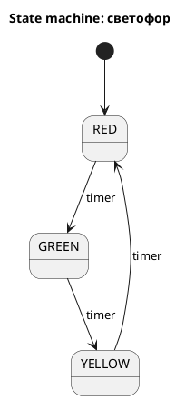

## Что такое state machine

State machine, или конечный автомат, — это способ описать систему, которая **в каждый момент находится только в одном состоянии** и переходит в другое состояние по событию или условию.
> «Машина состояний (state machine или конечный автомат) — математическая модель вычислений, представляющая систему, которая может находиться в одном из конечного числа состояний в любой момент времени.» https://sky.pro/wiki/javascript/mashina-sostoyanij-v-programmirovanii-osnovy-primery-realizaciya/

Проще говоря: у системы есть список состояний, и она не может прыгать куда угодно, а только по заранее заданным правилам.
> «В ответ на некоторые входные данные система может перейти из одного состояния в другое — это называется переходом.» https://sky.pro/wiki/javascript/mashina-sostoyanij-v-programmirovanii-osnovy-primery-realizaciya/

## Простой пример из жизни

Светофор — это state machine.
Он может быть в состоянии `red`, `yellow` или `green`, и по таймеру переходит из одного состояния в другое.

Другой пример — заказ в магазине.
 - Сначала `new`, 
 - потом `paid`, 
 - потом `shipped`(отправлен), 
 - потом `delivered` (доставлен).

## Где применяется

**State machine** используют там, где важно строго управлять шагами процесса:

 - **UI**: формы, кнопки, загрузка данных, мастера шагов.
 - **Бэкенд**: статусы заказа, оплаты, заявки, задачи.
 - **Протоколы**: TCP, сценарии обмена сообщениями.
 - **Игры**: персонаж может стоять, идти, атаковать, умирать.
 - **Устройства**: контроллеры, датчики, бытовая электроника.


## Почему это удобно

- **State machine** помогает не запутаться в логике.
- Все **состояния** и **переходы** видны явно, а значит код проще читать, тестировать и расширять.
- Это особенно полезно, когда у объекта много статусов и не все переходы разрешены.

## Максимально простой пример на Java

Вот самый простой вариант: **светофор**.

```java
public class Main {
    enum State {
        RED, GREEN, YELLOW
    }

    public static void main(String[] args) {
        State state = State.RED;

        System.out.println(state); // RED
        state = next(state);
        System.out.println(state); // GREEN
        state = next(state);
        System.out.println(state); // YELLOW
        state = next(state);
        System.out.println(state); // RED
    }

    static State next(State state) {
        if (state == State.RED) return State.GREEN;
        if (state == State.GREEN) return State.YELLOW;
        return State.RED;
    }
}
```


## Что здесь происходит

- Есть **состояния**: `RED`, `GREEN`, `YELLOW`.
- Есть **переход**: метод `next(...)`.
- Система никогда не попадает в случайное состояние.
- Каждый переход заранее описан в коде.

То есть **state machine** — это просто способ сказать:
 - «сейчас объект находится в одном из допустимых состояний, и вот так он может перейти дальше».

## Схема




## Коротко

**State machine** — это модель, где система живет в состояниях и переходит между ними по правилам.
 - Она нужна, чтобы **сложная логика** стала понятной и предсказуемой.
