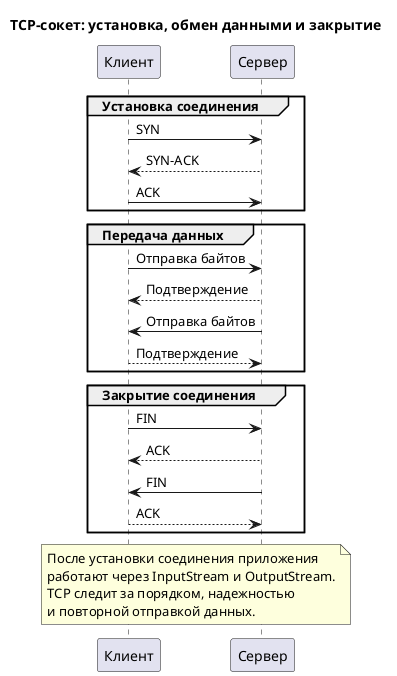

## Что такое TCP-сокет

TCP-сокет — это соединение между двумя программами по сети, где TCP отвечает за надежную доставку, порядок и повторную передачу данных.
> «Комбинация IP-адреса и порта называется сокетом, или гнездом (socket).» https://sky.pro/wiki/javascript/kak-rabotaet-tcp-osnovy-sokety-i-raznica-s-udp/

> «Протокол TCP обеспечивает надежную двустороннюю передачу данных с контролем потока.» https://help.kpda.ru/neutrino/2020/help/topic/ru.kpda.doc.os_ru/html/libraries/libsocket/t/TCP.html

В Java это часто объясняют как два потока: `InputStream` для чтения и `OutputStream` для записи.
> «С точки зрения Java-программиста, сокет – это два потока – InputStream из которого можно читать сообщения/данные и OutputStream, куда можно писать сообщения/данные.» https://javarush.com/quests/lectures/questcollections.level10.lecture07

Если совсем по-простому: одна программа открывает «линию связи», вторая отвечает, и после этого они обмениваются байтами.
> «Можно представить, что сокет — это виртуальная труба, которую строят между двумя приложениями, чтобы гонять между ними данные.» https://thecode.media/socket/

## Как это работает

Клиент начинает соединение и отправляет `SYN` — это просьба установить связь.
> «Клиент, который хочет установить соединение, посылает серверу сегмент с номером последовательности и флагом SYN.» https://ddos-guard.ru/terms/protocols/tcp-handshake

Сервер отвечает `SYN-ACK`, то есть подтверждает запрос и тоже предлагает начать соединение.
> «В случае успеха сервер посылает клиенту сегмент с номером последовательности и флагами SYN и ACK.» https://ddos-guard.ru/terms/protocols/tcp-handshake

Клиент отправляет `ACK`, и соединение считается установленным.
> «Трёхсторонний handshake завершается полем ACK от источника (A) запроса соединения.» https://habr.com/ru/articles/891682/

После этого обе стороны могут читать и писать данные через сокет.
> «После того как серверное и клиентское приложения создали потоки для приема и передачи данных, оба этих приложения могут читать и писать в канал данных.» https://alllinux.narod.ru/java/prjava/vol12/ch6.html

Когда обмен закончен, соединение закрывают.
> «TCP-соединение обычно состоит из следующих фаз: подготовка соединения (handshaking), передача данных и закрытие соединения.» https://habr.com/ru/articles/891682/

## Почему TCP удобен

TCP надежнее, потому что рассчитан на гарантированную передачу данных.
> «Протокол TCP обеспечивает надежную двустороннюю передачу данных с контролем потока.» https://help.kpda.ru/neutrino/2020/help/topic/ru.kpda.doc.os_ru/html/libraries/libsocket/t/TCP.html

Порядок байтов сохраняется.
> «После того как серверное и клиентское приложения создали потоки для приема и передачи данных, оба этих приложения могут читать и писать в канал данных.» https://alllinux.narod.ru/java/prjava/vol12/ch6.html

Если часть пакетов потерялась, TCP может отправить их заново.
> «Протокол TCP обеспечивает надежную двустороннюю передачу данных с контролем потока.» https://help.kpda.ru/neutrino/2020/help/topic/ru.kpda.doc.os_ru/html/libraries/libsocket/t/TCP.html

Для разработчика это удобно, потому что он работает не с пакетами вручную, а с потоками данных.
> «InputStream ... получать данные» и «OutputStream ... отправки данных» https://sky.pro/wiki/java/ponimanie-input-stream-i-output-stream-v-java-kogda-i-zachem-ispolzovat/

## Простая аналогия

Можно представить это как телефонный разговор: IP и порт — это номер и линия, а сокет — уже открытый канал связи между двумя участниками.
> «Комбинация IP-адреса и порта называется сокетом, или гнездом (socket).» https://sky.pro/wiki/javascript/kak-rabotaet-tcp-osnovy-sokety-i-raznica-s-udp/
> «Можно представить, что сокет — это виртуальная труба, которую строят между двумя приложениями, чтобы гонять между ними данные.» https://thecode.media/socket/

Пока канал открыт, оба собеседника могут говорить и слышать друг друга; когда разговор окончен, канал закрывается.
> «TCP-соединение обычно состоит из следующих фаз: подготовка соединения (handshaking), передача данных и закрытие соединения.» https://habr.com/ru/articles/891682/

## Схема в PlantUML

