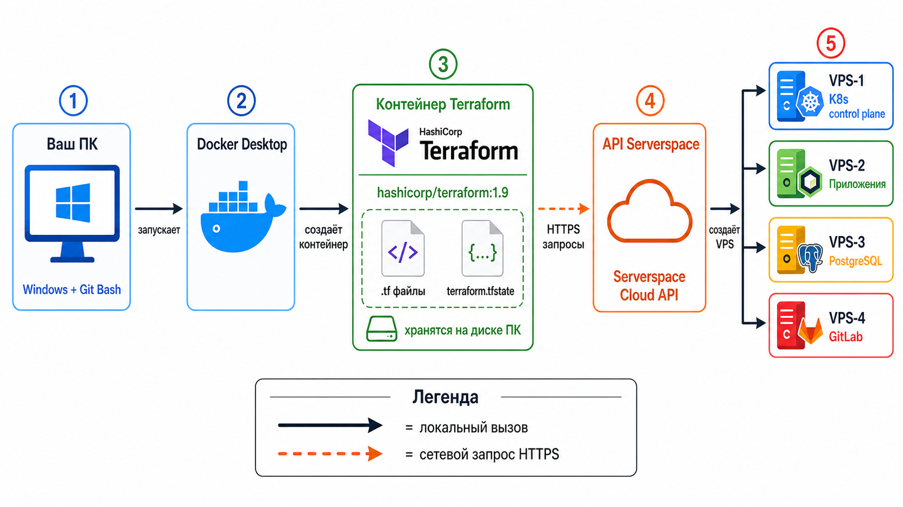

# Подготовка рабочего окружения для Terraform

> **Канонический путь:** `D:\Project_infra\greeting-service-infra\docs\dev_ops_guide\`  
> **Ядро документа:** Terraform не устанавливается на ПК как программа. Он запускается внутри Docker-контейнера. Для старта нужны только Docker Desktop и Git Bash — больше ничего.

---

## Оглавление

### Часть 0 — Подготовка рабочего окружения

1. [Главная идея — почему Terraform не устанавливается отдельно](#1-главная-идея--почему-terraform-не-устанавливается-отдельно)
2. [Схема работы Terraform с локального ПК](#2-схема-работы-terraform-с-локального-пк)
3. [Шаг 1 — Установить Docker Desktop](#3-шаг-1--установить-docker-desktop)
4. [Шаг 2 — Проверить Docker в Git Bash](#4-шаг-2--проверить-docker-в-git-bash)
5. [Шаг 3 — Создать docker-compose yml в каталоге проекта](#5-шаг-3--создать-docker-compose-yml-в-каталоге-проекта)
6. [Шаг 4 — Получить токен API Serverspace](#6-шаг-4--получить-токен-api-serverspace)
7. [Шаг 5 — Создать файл env с токеном](#7-шаг-5--создать-файл-env-с-токеном)
8. [Шаг 6 — Первый запуск Terraform через Docker](#8-шаг-6--первый-запуск-terraform-через-docker)
9. [Шаг 7 — Убедиться что Terraform работает](#9-шаг-7--убедиться-что-terraform-работает)
10. [Итоговый чеклист готовности](#10-итоговый-чеклист-готовности)

---

# Часть 0 — Подготовка рабочего окружения

## 1. Что нужно для старта

Для работы с **Terraform** через **Docker** на **ПК** нужны только два инструмента:

| Инструмент | Зачем | Уже есть? |
|---|---|---|
| **Docker Desktop** | Запускает контейнер с Terraform | Надо установить |
| **Git Bash** | Выполняет команды в терминале | Уже используется |

**Terraform** как отдельная программа на ПК **не устанавливается**.  
  - Он живёт **внутри** Docker-контейнера `hashicorp/terraform:1.9` и запускается через **Docker Compose**.  
  - Образ контейнера скачивается автоматически при первом запуске — вручную ничего качать не нужно.

---

## 2. Как работает Terraform с локального ПК — схема



### Пояснение к схеме

Схема показывает полный путь от команды в терминале до созданного VPS в **Serverspace**:

**1. Ваш ПК (Windows + Git Bash)**  
 - Отправная точка. Здесь хранятся все `.tf` файлы конфигурации и файл `terraform.tfstate`. Вы вводите команды в Git Bash — больше ничего на ПК устанавливать не нужно.

**2. Docker Desktop**  
 - Принимает команду из Git Bash и запускает контейнер с Terraform. **Docker Desktop** должен быть установлен и запущен на ПК — без него ничего не работает.

**3. Контейнер Terraform (hashicorp/terraform:1.9)**  
  - Внутри **контейнера** живёт **Terraform**. Он читает `.tf` файлы с диска вашего ПК через volume (монтированный каталог). 
   - Файлы не копируются внутрь контейнера — они остаются у вас на диске. 
   - Здесь же пишется `terraform.tfstate` — обратно на ваш диск.

**4. API Serverspace**  
 - **Terraform** отправляет HTTPS-запросы в API Serverspace. Это происходит при выполнении команд `plan` и `apply`. 
 - Никакой **Terraform** на стороне **Serverspace** не запускается — **Serverspace** только принимает запросы и создаёт ресурсы.

**5. VPS в Serverspace**  

Результат работы `terraform apply` — четыре созданных VPS:
 - VPS-1: **Kubernetes** control plane
 - VPS-2: **Приложения**
 - VPS-3: **PostgreSQL**
 - VPS-4: **GitLab**

### Легенда

| Обозначение | Смысл |
|---|---|
| Сплошная стрелка | Локальный вызов (внутри вашего ПК) |
| Пунктирная стрелка | Сетевой запрос по HTTPS |

---

## 3. Установка Docker Desktop

### Шаг 1. Скачать установщик

Перейти на сайт и скачать **Docker Desktop** для Windows:

```
https://www.docker.com/products/docker-desktop/
```

### Шаг 2. Установить

Запустить скачанный `.exe` файл и пройти стандартную установку.

**Важно при установке:**

- Оставить включённым пункт **Use WSL 2 instead of Hyper-V** — это рекомендуемый режим для Windows.
- После установки потребуется перезагрузка ПК.

### Шаг 3. Запустить Docker Desktop

После перезагрузки запустить Docker Desktop из меню Пуск.  
Дождаться пока в трее появится значок Docker и статус изменится на **Docker is running**.

---

## 4. Проверка Docker в Git Bash

Открыть Git Bash и выполнить:

```bash

docker version
```

Ожидаемый результат — вывод версий Client и Server, например:

```

Client:
 Version: 27.x.x
 ...
Server:
 Engine:
  Version: 27.x.x
  ...
```

Если команда выполнилась без ошибок — **Docker** работает корректно.

Дополнительно проверить Docker Compose:

Проверить Docker Compose:

```bash

docker compose version
```

Ожидаемый результат:

```
Docker Compose version v2.x.x
```

Если обе команды выполнились без ошибок — Docker готов к работе.

---

## 5. Шаг 3 — Создать docker-compose yml в каталоге проекта

Перейти в рабочий каталог:

```bash

cd '/d/Project_infra/greeting-service-infra/infra/terraform-serverspace'
```

Создать подкаталог `docker`:

```bash

mkdir docker
```

Создать файл `docker/docker-compose.yml` со следующим содержимым:

```yaml
services:
  terraform:
    image: hashicorp/terraform:1.9
    working_dir: /workspace
    volumes:
      - ..:/workspace
      - terraform-plugin-cache:/root/.terraform.d/plugin-cache
    environment:
      TF_PLUGIN_CACHE_DIR: /root/.terraform.d/plugin-cache
      TF_VAR_serverspace_token: ${SERVERSPACE_TOKEN:-}
    entrypoint: ["terraform"]

volumes:
  terraform-plugin-cache:
```

**Пояснение к файлу:**

| Строка | Смысл |
|---|---|
| `image: hashicorp/terraform:1.9` | Образ с Terraform — Docker скачает сам при первом запуске |
| `working_dir: /workspace` | Рабочий каталог внутри контейнера |
| `..:/workspace` | Монтирует каталог `terraform-serverspace` с твоего диска в контейнер |
| `terraform-plugin-cache` | Кэш провайдеров — чтобы не скачивать при каждом запуске |
| `TF_VAR_serverspace_token` | Токен API Serverspace — читается из файла `docker/.env` |
| `entrypoint: ["terraform"]` | При запуске контейнера сразу выполняет terraform |
---

---

## 6. Шаг 4 — Получить токен API Serverspace

Чтобы **Terraform** мог создавать **VPS** в Serverspace, ему нужен **токен API** — это **секретный ключ** доступа к твоему аккаунту в **Serverspace**.

### 6.1 Зарегистрироваться или войти

Перейти на сайт и войти в аккаунт:

```
https://serverspace.by
```

### 6.2 Открыть раздел API

После входа в панель управления:

**Автоматизация** → **API** → кнопка «Создать API»

Ты уже видишь пункт «Автоматизация» в левом меню на скриншоте — нажми на него, затем перейди во вкладку **API** и там создай ключ

```
a1b2c3d4e5f6a1b2c3d4e5f6a1b2c3d4e5f6a1b2
```

- Сохрани его в надёжное место, например `D:\Project_infra\keys\terraform`.
- Этот файл **не коммитить** в git — добавить в `.gitignore`.

### 6.3 Что такое токен и зачем он нужен

Токен — это способ для Terraform подтвердить что он действует от твоего имени.  
Вместо логина и пароля Serverspace принимает токен в каждом API-запросе.  
Токен **не хранится** в `.tf` файлах и **не коммитится** в git — только в локальном `.env` файле на твоём ПК.

---

## 7. Шаг 5 — Создать файл env с токеном

Файл `.env` — это локальный файл с секретами. Он хранится только на твоём ПК и никогда не попадает в git-репозиторий.

### 7.1 Создать шаблон .env.example

Создать файл `docker/.env.example` — это шаблон без реальных значений, его можно коммитить в git:

```bash

cd '/d/Project_infra/greeting-service-infra/infra/terraform-serverspace'
```

Создать файл `docker/.env.example` со следующим содержимым:

```env

# Токен API Serverspace — получить в панели управления Serverspace
SERVERSPACE_TOKEN=
```

### 7.2 Создать рабочий файл .env

Скопировать шаблон в рабочий файл:

```bash

cp docker/.env.example docker/.env
```

Открыть файл `docker/.env` в любом редакторе и вставить токен:

```env

SERVERSPACE_TOKEN=a1b2c3d4e5f6a1b2c3d4e5f6a1b2c3d4e5f6a1b2
```

Сохранить файл.

### 7.3 Добавить .env в .gitignore

Чтобы токен никогда не попал в git, добавить `.env` в `.gitignore`.

Проверить есть ли `.gitignore` в корне репозитория:

```bash

cat '/d/Project_infra/greeting-service-infra/.gitignore'
```

Если файл есть — добавить в него строку:

```
infra/terraform-serverspace/docker/.env
```

Если файла нет — создать его с этой строкой.

---

## 8. Шаг 6 — Первый запуск Terraform через Docker

 - Обязательно запустите **Docker compose**.

Первая команда — `terraform version`.  
 - Она ничего не создаёт. Она проверяет что Terraform запускается внутри контейнера.

При первом запуске Docker автоматически скачает образ `hashicorp/terraform:1.9` — это займёт около минуты в зависимости от скорости интернета.

```bash

cd '/d/Project_infra/greeting-service-infra/infra/terraform-serverspace'

docker compose -f docker/docker-compose.yml run --rm terraform version
```

Ожидаемый результат:

```
 c3054bc0ebc2 Pull complete 0B
 Image hashicorp/terraform:1.9 Pulled
 Container docker-terraform-run-9881a508f543 Creating
 Container docker-terraform-run-9881a508f543 Created
Terraform v1.9.8
on linux_amd64

```

Если видишь версию Terraform — образ скачан, контейнер запускается, всё работает.

---

## 9. Шаг 7 — Убедиться что Terraform работает

Проверить что каталог монтируется правильно и токен передаётся в контейнер:

```bash

docker compose -f docker/docker-compose.yml --env-file docker/.env run --rm terraform version
```

Ожидаемый результат — тот же вывод версии Terraform без ошибок.

```textmate
$ docker compose -f docker/docker-compose.yml --env-file docker/.env run --rm terraform version
 Container docker-terraform-run-c887f991cd7a Creating
 Container docker-terraform-run-c887f991cd7a Created
Terraform v1.9.8
on linux_amd64

```

Ключевое отличие от предыдущей команды — здесь добавлен `--env-file docker/.env`.  
Это значит что токен из `.env` файла передаётся в контейнер. Именно так будут запускаться все последующие команды `init`, `plan`, `apply`.

---

Все команды **Terraform** в этом проекте запускаются **не напрямую** (terraform установлен в системе), а через:

```bash

docker compose -f docker/docker-compose.yml --env-file docker/.env run --rm terraform <команда>
```

Вместо `<команда>` подставляешь нужное:

```bash

# Проверка версии
docker compose -f docker/docker-compose.yml --env-file docker/.env run --rm terraform version

# Инициализация
docker compose -f docker/docker-compose.yml --env-file docker/.env run --rm terraform init

# Просмотр плана
docker compose -f docker/docker-compose.yml --env-file docker/.env run --rm terraform plan

# Применение — создаёт VPS в панели Serverspace
docker compose -f docker/docker-compose.yml --env-file docker/.env run --rm terraform apply
```

Локальный `terraform version` на Windows — это просто отдельно установленный **Terraform**, он к проекту отношения не имеет и в гайде не используется. 
  - Все команды идут только через `docker compose`.


## 10. Итоговый чеклист готовности

Перед переходом к документу 3 убедиться что все пункты выполнены:

- [ ] Docker Desktop установлен и запущен — статус **Docker is running**.
- [ ] `docker version` в Git Bash — выполняется без ошибок.
- [ ] `docker compose version` в Git Bash — выполняется без ошибок.
- [ ] Файл `docker/docker-compose.yml` создан в каталоге `terraform-serverspace`.
- [ ] Токен API Serverspace получен в панели управления.
- [ ] Файл `docker/.env` создан и содержит токен `SERVERSPACE_TOKEN=...`.
- [ ] Строка `infra/terraform-serverspace/docker/.env` добавлена в `.gitignore`.
- [ ] Команда `docker compose -f docker/docker-compose.yml --env-file docker/.env run --rm terraform version` — показывает версию Terraform.

Если все пункты отмечены — рабочее окружение готово.


### Следующий документ

`3 - Terraform для Serverspace и первый запуск.md` — создание файлов Terraform, подключение провайдера **Serverspace**, первый `init → validate → plan`.
