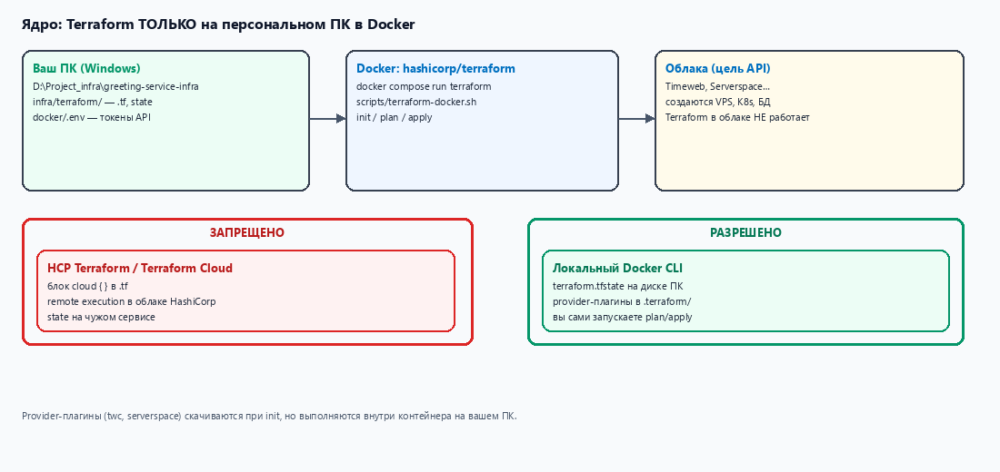
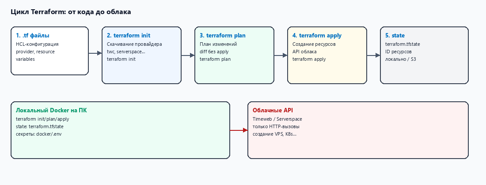
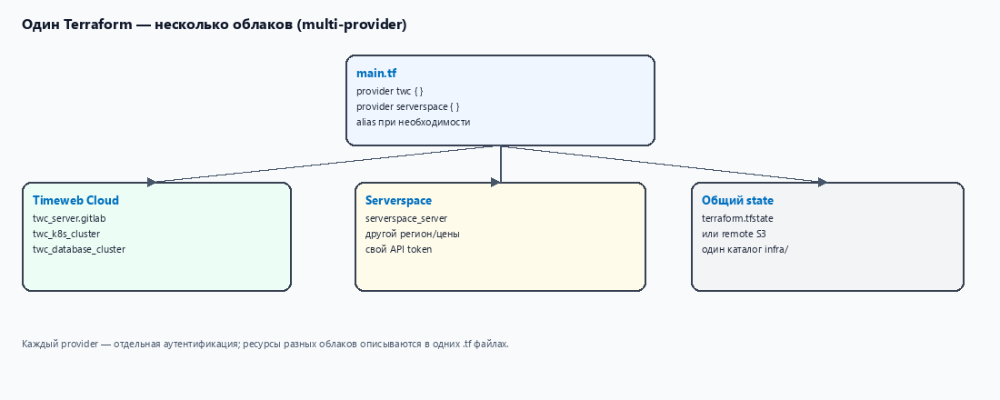
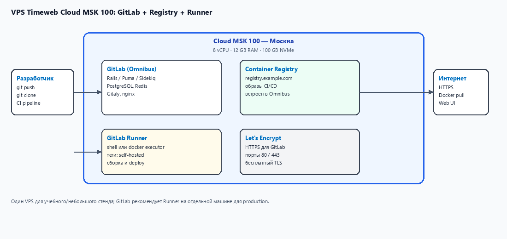
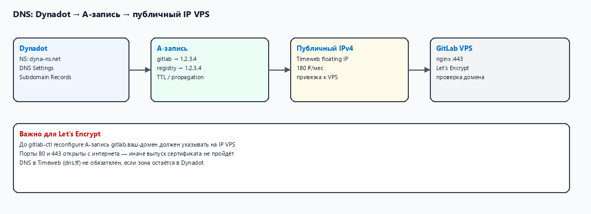
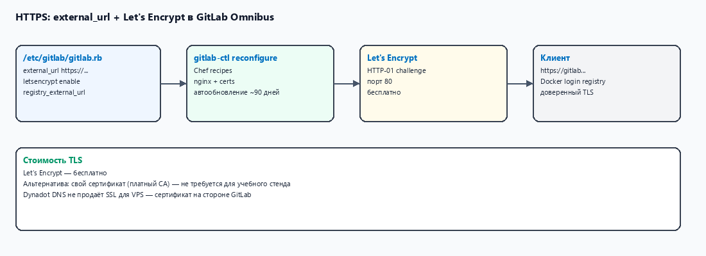

# Свой Terraform на персональном ПК (Docker) + VPS под GitLab

> **Канонический путь:** `D:\Project_infra\greeting-service-infra\docs\`  
> **Ядро документа:** 
>  - Terraform работает **только на вашем ПК в Docker**. 
>  - Облака (Timeweb, Serverspace) — лишь **цель API** (куда создаются VPS, K8s, БД). 
>  - **Не** используем HCP Terraform / Terraform Cloud (удалённый Terraform в облаке HashiCorp).

---

## Оглавление

### Часть I — Локальный Terraform (главное)

1. [Главный принцип](#1-главный-принцип)
2. [Что запрещено и что разрешено](#2-что-запрещено-и-что-разрешено)
3. [Архитектура: ПК → Docker → API облаков](#3-архитектура-пк--docker--api-облаков)
4. [Рецепт: Docker Compose для Terraform](#4-рецепт-docker-compose-для-terraform)
5. [Секреты и переменные](#5-секреты-и-переменные)
6. [Цикл init → plan → apply → destroy](#6-цикл-init--plan--apply--destroy)
7. [State: где хранится «память» Terraform](#7-state-где-хранится-память-terraform)
8. [Обёртка `terraform-docker.sh` (Git Bash)](#8-обёртка-terraform-dockersh-git-bash)
9. [Несколько облаков из одного локального Docker](#9-несколько-облаков-из-одного-локального-docker)
10. [Структура `infra/terraform`](#10-структура-infraterraform)

### Часть II — Прикладная задача: GitLab на VPS

11. [Зачем отдельный VPS под GitLab](#11-зачем-отдельный-vps-под-gitlab)
12. [Архитектура GitLab на одном VPS](#12-архитектура-gitlab-на-одном-vps)
13. [Конфигурация VPS (Timeweb MSK 100 / аналог)](#13-конфигурация-vps-timeweb-msk-100--аналог)
14. [DNS Dynadot и HTTPS Let's Encrypt](#14-dns-dynadot-и-https-lets-encrypt)
15. [GitLab Runner](#15-gitlab-runner)
16. [Стоимость в месяц](#16-стоимость-в-месяц)
17. [Чеклист развёртывания](#17-чеклист-развёртывания)
18. [Официальные источники](#18-официальные-источники)

---

# Часть I — Локальный Terraform (главное)

## 1. Главный принцип

**Terraform — это CLI-утилита на вашем компьютере.** Вы пишете `.tf`-файлы в git, запускаете `plan` и `apply` **локально в Docker**, а утилита по API **создаёт** ресурсы в Timeweb, Serverspace и т.д.

Облачный провайдер **не запускает** Terraform за вас. В панели Timeweb/Serverspace есть *документация* «как писать .tf», но **исполнение** — всегда на вашем ПК.

**Источник:** [Install Terraform — HashiCorp](https://developer.hashicorp.com/terraform/install)

> **EN**
> Download the Terraform binary for your operating system. Terraform is a CLI tool you run on your machine.
>
> **RU**
> Terraform — бинарник/образ, который **вы запускаете на своей машине**. Это не сервис, который крутится в облаке провайдера VPS.

---

## 2. Что запрещено и что разрешено



| | Запрещено | Разрешено |
|---|-----------|-----------|
| **Где крутится Terraform** | HCP Terraform, Terraform Cloud, `cloud { }` с remote execution | Docker на **вашем ПК** (`hashicorp/terraform`) |
| **Где state** | Только на серверах HashiCorp (без вашей копии) | `terraform.tfstate` на диске ПК (или **ваш** S3, см. §7) |
| **Секреты** | В `.tf` в git | `docker/.env`, `TF_VAR_*`, не в репозитории |
| **Облака Timeweb/Serverspace** | — | Цель API: VPS, K8s, БД **создаются** по вашему `apply` |

**Источник:** [Terraform CLI — HCP Terraform integration](https://developer.hashicorp.com/terraform/cli/config/environment-variables#hcp-terraform-cli-integration)

> **EN**
> The CLI integration with HCP Terraform lets you use HCP Terraform and Terraform Enterprise on the command line. The integration requires including a `cloud` block in your Terraform configuration.
>
> **RU**
> Интеграция с HCP Terraform требует блока `cloud { }` и передаёт выполнение в облако HashiCorp. **В этом проекте блок `cloud` не используем** — только локальный CLI в Docker.

**Важно:** слово *provider* в Terraform — это **плагин** (драйвер API), который скачивается при `terraform init` в папку `.terraform/` **на вашем ПК**. Это не «Terraform в облаке Timeweb». Плагин лишь учит локальный Terraform, как вызывать API облака.

---

## 3. Архитектура: ПК → Docker → API облаков

**Пояснение.** Вы нажимаете `plan` на ноутбуке: 
    → контейнер Docker читает `.tf` 
    → обращается по HTTPS к API **Timeweb**/**Serverspace** 
    → облако создаёт VPS. 

Ни **Timeweb**, ни **Serverspace**, ни _HashiCorp Cloud_ **не выполняют** ваш `terraform apply` вместо вас.

```
[Ваш ПК]
  └── Docker (hashicorp/terraform:1.9)
        ├── читает infra/terraform/*.tf
        ├── пишет terraform.tfstate
        └── HTTP → API облаков (создать VPS, K8s, …)
```

---

## 4. Рецепт: Docker Compose для Terraform

В **репозитории** уже есть готовая конфигурация:

| Файл | Назначение |
|------|------------|
| `infra/terraform/docker/docker-compose.yml` | образ `hashicorp/terraform:1.9`, volume конфигурации |
| `infra/terraform/docker/.env.example` | шаблон токенов API |
| `scripts/terraform-docker.sh` | обёртка для **Git Bash** |

Все команды ниже — только в **Git Bash** (не PowerShell, не cmd).

### Шаг 1. Docker Desktop

Установите [Docker Desktop](https://www.docker.com/products/docker-desktop/) и убедитесь в Git Bash: `docker version`.

### Шаг 2. Секреты

```bash
cd '/d/Project_infra/greeting-service-infra/infra/terraform'
cp docker/.env.example docker/.env
# Отредактируйте docker/.env — токены API облаков (не коммитить!)
cp terraform.tfvars.example terraform.tfvars
```

### Шаг 3. Первый запуск

```bash
cd '/d/Project_infra/greeting-service-infra'
./scripts/terraform-docker.sh init
./scripts/terraform-docker.sh validate
./scripts/terraform-docker.sh plan
```

Или напрямую через compose:

```bash
cd '/d/Project_infra/greeting-service-infra/infra/terraform'
docker compose -f docker/docker-compose.yml --env-file docker/.env run --rm terraform init
```

**Пояснение `docker-compose.yml`.** Каталог `infra/terraform` монтируется в `/workspace` — `terraform.tfstate`, `.terraform/` и `.tf` остаются **на диске ПК**. Volume `terraform-plugin-cache` хранит скачанные provider-плагины между запусками.

Содержимое compose (сокращённо):

```yaml
services:
  terraform:
    image: hashicorp/terraform:1.9
    working_dir: /workspace
    volumes:
      - ..:/workspace
      - terraform-plugin-cache:/root/.terraform.d/plugin-cache
    environment:
      TF_PLUGIN_CACHE_DIR: /root/.terraform.d/plugin-cache
      TWC_TOKEN: ${TWC_TOKEN:-}
      TF_VAR_twc_token: ${TWC_TOKEN:-}
    entrypoint: ["terraform"]
```

**Источник:** [Docker Hub — hashicorp/terraform](https://hub.docker.com/r/hashicorp/terraform)

> **EN**
> Official Terraform Docker images contain the Terraform CLI binary.
>
> **RU**
> Официальный образ Docker содержит бинарник Terraform CLI — это и есть «свой Terraform» на ПК, без установки `.exe` в систему.

---

## 5. Секреты и переменные

**Источник:** [TF_VAR_name — Terraform CLI](https://developer.hashicorp.com/terraform/cli/config/environment-variables#tf_var_name)

> **EN**
> Environment variables can be used to set variables. The environment variables must be in the format `TF_VAR_name`.
>
> **RU**
> Переменные Terraform можно передать как `TF_VAR_имя` в окружении контейнера — так токены не попадают в `.tf` файлы.

| Секрет | Куда | Пример |
|--------|------|--------|
| Timeweb API | `docker/.env` → `TWC_TOKEN` | панель [API keys](https://timeweb.cloud/my/api-keys) |
| Serverspace API | `docker/.env` → `S2_TOKEN` | панель Serverspace → API key |
| Пароль БД | `terraform.tfvars` или `TF_VAR_db_password` | не в git |

Файлы `docker/.env`, `terraform.tfvars`, `terraform.tfstate` — в `.gitignore`.

---

## 6. Цикл init → plan → apply → destroy



**Пояснение.**

| Команда | Что делает |
|---------|------------|
| `init` | Скачивает provider-плагины в `.terraform/` **на ПК** |
| `validate` | Проверяет синтаксис `.tf` |
| `plan` | Показывает diff; **ничего не создаёт** |
| `apply` | Вызывает API облаков; обновляет `terraform.tfstate` |
| `destroy` | Удаляет ресурсы из state |

Все команды — через локальный Docker:

```bash
./scripts/terraform-docker.sh plan
./scripts/terraform-docker.sh apply
```

**Источник:** [Terraform CLI overview](https://developer.hashicorp.com/terraform/cli/commands)

> **EN**
> The terraform plan command creates an execution plan, which lets you preview the changes Terraform will make to your infrastructure.
>
> **RU**
> `terraform plan` — предпросмотр на **вашем ПК**; `apply` — применение через API облака.

---

## 7. State: где хранится «память» Terraform

По умолчанию: `infra/terraform/terraform.tfstate` на **вашем диске**.

**Пояснение.** State — карта «имя в .tf → ID в облаке». Без него Terraform не знает, что уже создано. Файл **не** хранится у Timeweb/Serverspace.

Опционально (позже): backend `s3` на **вашем** bucket Timeweb — см. закомментированный блок в `main.tf`. Это по-прежнем **ваше** хранилище, не HCP Terraform.

**Источник:** [State — Terraform docs](https://developer.hashicorp.com/terraform/language/state)

> **EN**
> Terraform must store state about your managed infrastructure and configuration.
>
> **RU**
> State хранит сведения об инфраструктуре. В нашем рецепте — локальный файл на ПК (или ваш S3).

---

## 8. Обёртка `terraform-docker.sh` (Git Bash)

```bash
# Из корня репозитория (Git Bash):
cd '/d/Project_infra/greeting-service-infra'
chmod +x scripts/terraform-docker.sh   # один раз, если нет права на запуск
./scripts/terraform-docker.sh init
./scripts/terraform-docker.sh plan -out=tfplan
./scripts/terraform-docker.sh apply tfplan
```

Скрипт сам переходит в `infra/terraform`, подхватывает `docker/.env` и запускает `docker compose run --rm terraform …`.

---

## 9. Несколько облаков из одного локального Docker



**Пояснение.** Один контейнер на ПК, один `terraform.tfstate`, в `.tf` — несколько блоков `provider`. Каждое облако получает HTTP-запросы от **вашего** локального Terraform. Ни одно облако не хостит процесс `terraform`.

Токены разных облаков — в одном `docker/.env`. Ресурсы описываются в общих `.tf` (например K8s в Timeweb, дополнительный VPS в Serverspace).

**Ограничение проекта:** полный стек K8s + PostgreSQL + S3 в `greeting-service-infra` сейчас в `.tf` для **Timeweb**. Serverspace можно добавить как второй `provider` в том же локальном Docker — без смены способа запуска.

---

## 10. Структура `infra/terraform`

| Файл | Назначение |
|------|------------|
| `main.tf` | `terraform { }`, `provider "twc"` — **без** `cloud { }` |
| `docker/docker-compose.yml` | **ядро:** локальный Terraform в Docker |
| `docker/.env` | токены API (не в git) |
| `variables.tf`, `terraform.tfvars` | параметры ресурсов |
| `registry_server.tf` | VPS под GitLab / devtools |
| `kubernetes.tf`, `database.tf`, `s3.tf` | остальной стек |
| `terraform.tfstate` | state на ПК |
| `.terraform/` | скачанные provider-плагины на ПК |

---

# Часть II — Прикладная задача: GitLab на VPS

> Ниже — **что** создавать через уже настроенный локальный Terraform. Способ запуска — только §4–§8.

## 11. Зачем отдельный VPS под GitLab

**GitLab + Container Registry + Runner** на **Timeweb Cloud MSK 100** (8 vCPU, 12 GB, 100 GB NVMe, Москва). Альтернатива по ресурсам — конфигуратор **Serverspace** (цена через [калькулятор](https://serverspace.io/pricing/)).

Создание VPS: `./scripts/terraform-docker.sh apply` → ресурс `twc_server` в `registry_server.tf` (или аналог).

---

## 12. Архитектура GitLab на одном VPS



**Пояснение.** После `apply` вы по SSH ставите **GitLab Omnibus** (`gitlab-ctl`) — это **не** Terraform. Terraform только **заказал** VPS. Registry и Runner — на той же VM (учебный стенд).

---

## 13. Конфигурация VPS (Timeweb MSK 100 / аналог)

**Источник:** [Облачные серверы Timeweb](https://timeweb.cloud/services/cloud-servers)

> **EN**
> Cloud MSK 100 — **2 772 ₽/month**. 8 × 3.3 GHz, 12 GB, 100 GB, 1 Gbit/s.
>
> **RU**
> Тариф MSK 100 — **2 772 ₽/мес**, 8 CPU, 12 GB, 100 GB NVMe.

**Источник (GitLab):** [Installation requirements](https://docs.gitlab.com/ee/install/requirements.html)

> **EN**
> For a single-node installation, **8 vCPU** is the baseline. **16 GB** is the baseline for memory; at least **8 GB** in constrained environments.
>
> **RU**
> 8 vCPU — базовая линия; 12 GB RAM допустимо для малой нагрузки.

Публичный IPv4 Timeweb: **+180 ₽/мес** ([public-ip](https://timeweb.cloud/docs/public-ip)).

> **EN**
> The cost of renting one IPv4 is **180 rubles per month**.
>
> **RU**
> Аренда IPv4 — **180 ₽/мес**.

Serverspace: pay-as-you-go, цену считать в [калькуляторе](https://serverspace.io/pricing/) или `POST /api/v1/servers/price` ([API](https://docs.serverspace.ru/public_api.html)).

---

## 14. DNS Dynadot и HTTPS Let's Encrypt



Домен в **Dynadot** — A-записи `gitlab`, `registry` → IP VPS (после `apply`).

**Источник:** [Dynadot — A record](https://www.dynadot.com/help/question/create-A-record)

> **EN**
> In Subdomain Records, enter the subdomain, select A, enter the IP address. Press Save Settings.
>
> **RU**
> Subdomain Records → тип A → IP вашего VPS.



На VPS: `external_url "https://gitlab.домен"` в `/etc/gitlab/gitlab.rb` → `gitlab-ctl reconfigure`.

**Источник:** [GitLab SSL / Let's Encrypt](https://docs.gitlab.com/omnibus/settings/ssl/)

> **EN**
> Let's Encrypt is enabled by default if `external_url` uses HTTPS and no other certificates are configured.
>
> **RU**
> Let's Encrypt включён по умолчанию при HTTPS в `external_url`. Стоимость: **0 ₽**.

---

## 15. GitLab Runner

Устанавливается **на VPS вручную** после Omnibus (не Terraform).

**Источник:** [Install GitLab Runner](https://docs.gitlab.com/runner/install/)

> **EN**
> For security and performance reasons, install GitLab Runner on a machine separate from GitLab. For a personal sandbox, same host is acceptable.
>
> **RU**
> Для production Runner — отдельно; для учебного стенда — на том же VPS.

---

## 16. Стоимость в месяц

| Статья | ₽/мес | Источник |
|--------|-------|----------|
| Timeweb MSK 100 | **2 772** | [cloud-servers](https://timeweb.cloud/services/cloud-servers) |
| Публичный IPv4 | **180** | [public-ip](https://timeweb.cloud/docs/public-ip) |
| GitLab / Registry / Runner / Let's Encrypt | **0** | GitLab Docs |
| **Итого (Timeweb GitLab-VPS)** | **~2 952** | |
| Serverspace 8/12/100 | уточнить в калькуляторе | [pricing](https://serverspace.io/pricing/) |
| **Локальный Terraform в Docker** | **0** | ваш ПК |

---

## 17. Чеклист развёртывания

### A. Локальный Terraform (обязательно первым)

1. Docker Desktop установлен; терминал — **Git Bash**.
2. `cp infra/terraform/docker/.env.example infra/terraform/docker/.env` — заполнить токены API.
3. `cp infra/terraform/terraform.tfvars.example infra/terraform/terraform.tfvars`.
4. `./scripts/terraform-docker.sh init`
5. `./scripts/terraform-docker.sh plan`
6. `./scripts/terraform-docker.sh apply` — создать VPS в облаке.
7. Записать публичный IP из output / панели.

### B. GitLab на созданном VPS (вручную на сервере)

8. Dynadot: A `gitlab`, `registry` → IP.
9. SSH → установка GitLab Omnibus ([about.gitlab.com/install](https://about.gitlab.com/install/)).
10. `gitlab.rb` + `gitlab-ctl reconfigure` (HTTPS).
11. Установка и регистрация GitLab Runner.
12. Проверка: `https://gitlab.домен`, pipeline.

---

## 18. Официальные источники

### Локальный Terraform (ядро)

| Тема | URL |
|------|-----|
| Установка / CLI | https://developer.hashicorp.com/terraform/install |
| Команды CLI | https://developer.hashicorp.com/terraform/cli/commands |
| Переменные `TF_VAR_*` | https://developer.hashicorp.com/terraform/cli/config/environment-variables |
| State | https://developer.hashicorp.com/terraform/language/state |
| Образ Docker | https://hub.docker.com/r/hashicorp/terraform |
| HCP Terraform (не используем) | https://developer.hashicorp.com/terraform/cli/config/environment-variables#hcp-terraform-cli-integration |

### Облака (цель API)

| Тема | URL |
|------|-----|
| Timeweb API keys | https://timeweb.cloud/my/api-keys |
| Timeweb VPS / MSK 100 | https://timeweb.cloud/services/cloud-servers |
| Timeweb публичный IP | https://timeweb.cloud/docs/public-ip |
| Serverspace pricing | https://serverspace.io/pricing/ |
| Serverspace API price | https://docs.serverspace.ru/public_api.html |

### GitLab и DNS

| Тема | URL |
|------|-----|
| Требования GitLab | https://docs.gitlab.com/ee/install/requirements.html |
| SSL / Let's Encrypt | https://docs.gitlab.com/omnibus/settings/ssl/ |
| GitLab Runner | https://docs.gitlab.com/runner/install/ |
| Dynadot A-record | https://www.dynadot.com/help/question/create-A-record |

---

*Диаграммы: `docs/Images-docs/gen_terraform_gitlab_diagrams.py`. Docker-рецепт: `infra/terraform/docker/`.*
