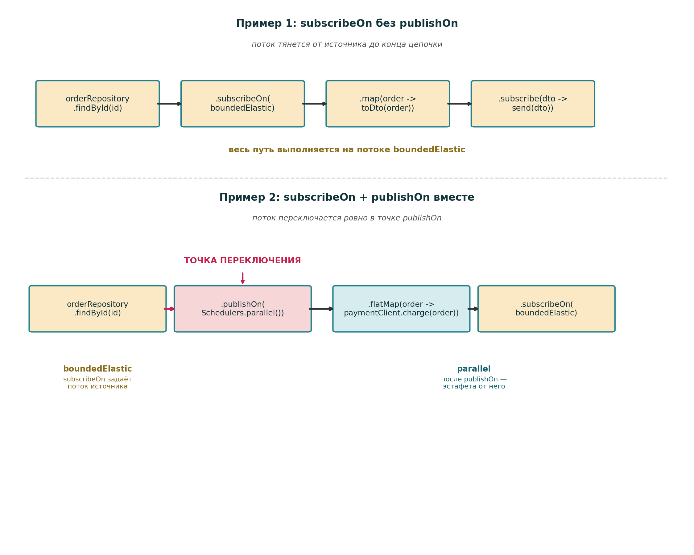

## 7. `subscribeOn` и `publishOn`

> **Аналогия из жизни:** `subscribeOn` — в каком цехе запускают конвейер у источника данных. `publishOn` — на какую линию переводят следующие станки после точки переключения.

**Ответ:** 
 - оба оператора переключают выполнение на другой `Scheduler`, но делают это в разных местах цепочки: 
   - `subscribeOn` влияет на подписку и источник, 
   - а `publishOn` — на операторы, расположенные **ниже по цепочке**.

**Источник:** https://projectreactor.io/docs/core/release/reference/coreFeatures/schedulers.html

> "`subscribeOn` applies to the subscription process."

**Ru**:
> "`subscribeOn` относится к процессу подписки."
> 

> "`publishOn` applies in the same way as any other operator, in the middle of the subscriber chain."

**Ru**:
> "`publishOn` применяется так же, как любой другой оператор, в середине цепочки подписчиков."

***

### `subscribeOn` — исходник

```java
public final Mono<T> subscribeOn(Scheduler scheduler) {
    return onAssembly(new MonoSubscribeOn<>(this, scheduler));
}
```

**Пояснение:** 
 - `subscribeOn` используют там, где нужно вынести **блокирующий** источник из **event loop**, например JDBC, файловый API или legacy SDK.

**Источник:** https://projectreactor.io/docs/core/release/reference/coreFeatures/schedulers.html

> "This is a better choice for I/O blocking work."

**Ru**:
> "Это лучший выбор для блокирующей I/O-работы."

**Источник:** https://github.com/netty/netty/discussions/15021

> "All blocking operations should be avoided in the event loop"

Ru:
> "Всех блокирующих операций в event loop нужно избегать."

**Бизнес-кейс:** 
 - HTTP-запрос на оформление заказа приходит в WebFlux, но для проверки кредитного лимита клиента нужно обратиться к старой billing-базе через блокирующий JDBC-драйвер.

```java
Mono.fromCallable(() -> billingJdbcRepository.findCustomerLimit(customerId))
    .subscribeOn(Schedulers.boundedElastic())
    .map(this::toLimitDto);
```

**Пояснение:** 
 - в этом примере блокирующий **JDBC-вызов** уходит на `boundedElastic`, а **не выполняется** на Netty **event loop**.

**Источник:** https://projectreactor.io/docs/core/release/reference/coreFeatures/schedulers.html

> "`subscribeOn` applies to the subscription process."

Ru:
> "`subscribeOn` относится к процессу подписки."

***



## Роль `BossGroup` и `WorkerGroup`

**Пояснение:** 
 - `BossGroup` нужен для принятия нового TCP-соединения. 
 - После этого созданный `Channel` регистрируется на конкретном `EventLoop`, и дальнейшая обработка идёт уже через `Channel` и его `ChannelPipeline`, без повторного участия `BossGroup` в обработке каждого запроса или ответа.

**Источник:** https://netty.io/4.1/api/io/netty/channel/ChannelPipeline.html

> "A `Channel` was registered to its `EventLoop`."

Ru:
> "`Channel` был зарегистрирован в своём `EventLoop`."

> "Each channel has its own pipeline"

Ru:
> "У каждого канала свой собственный pipeline."

**Ключевой момент:** 
  - даже если часть бизнес-логики временно выполняется на `boundedElastic` или `parallel`, сам `Channel` остаётся связанным со своим `EventLoop`.

**Источник:** https://netty.io/4.1/api/io/netty/channel/ChannelPipeline.html

> "A `Channel` was registered to its `EventLoop`."

Ru:
> "`Channel` был зарегистрирован в своём `EventLoop`."

**Как ответ возвращается клиенту:** 
 - когда формируется HTTP-ответ, outbound-событие проходит через outbound-часть `ChannelPipeline` и обрабатывается I/O-потоком, связанным с этим `Channel`.

**Источник:** https://netty.io/4.1/api/io/netty/channel/ChannelPipeline.html

> "An outbound event is handled by an I/O thread associated with the `Channel`."

Ru:
> "Outbound-событие обрабатывается I/O-потоком, связанным с данным `Channel`."

***

## Что происходит дальше: 
  - `subscribeOn()` меняет поток обработки

**Пояснение:** 
 - когда во время обработки запроса встречается блокирующая операция, например JDBC-запрос, её выносят с **event loop** на отдельный пул потоков, обычно `boundedElastic`.

**Источник:** https://github.com/netty/netty/discussions/15021

> "All blocking operations should be avoided in the event loop"

Ru:
> "Всех блокирующих операций в event loop нужно избегать."

**Важно:** 
  - `subscribeOn` задаёт **контекст** для подписки и источника, но не отменяет последующие переключения через `publishOn`.

**Источник:** https://projectreactor.io/docs/core/release/reference/coreFeatures/schedulers.html

> "However, this does not affect the behavior of subsequent calls to `publishOn` — they still switch the execution context for the part of the chain after them."

**Ru**:
> "Однако это **не влияет** на поведение последующих вызовов `publishOn` — они всё равно **переключают контекст** выполнения для части цепочки после себя."

***

### `publishOn` — исходник

```java
public final Mono<T> publishOn(Scheduler scheduler) {
    return onAssembly(new MonoPublishOn<>(this, scheduler));
}

public final Flux<T> publishOn(Scheduler scheduler, int prefetch) {
    return onAssembly(new FluxPublishOn<>(this, scheduler, true, prefetch));
}
```

**Пояснение:** 
  - `publishOn` **переключает** поток выполнения для операторов, стоящих **ниже по цепочке**, поэтому его позиция в цепочке имеет значение.

**Источник:** https://projectreactor.io/docs/core/release/reference/coreFeatures/schedulers.html

> "`publishOn` applies in the same way as any other operator, in the middle of the subscriber chain."

**Ru**:
> "`publishOn` применяется так же, как любой другой оператор, **в середине цепочки** подписчиков."

> "Consequently, it affects where the subsequent operators execute (until another `publishOn` is chained in)..."

**Ru**:
> "Следовательно, он влияет на то, где выполняются последующие операторы, пока в цепочку не будет добавлен другой `publishOn`."

**Бизнес-кейс:** 
  - заказ загружается из старой **ERP** через блокирующий драйвер, после чего нужно выполнить CPU-нагруженный antifraud scoring и расчёт промо-правил.

```java
Mono.fromCallable(() -> legacyOrderRepository.findById(orderId))
    .subscribeOn(Schedulers.boundedElastic())
    .publishOn(Schedulers.parallel())
    .map(order -> fraudScoringService.score(order))
    .map(scored -> pricingService.applyPromotions(scored));
```

**Пояснение:** 
  - здесь источник выполняется на `boundedElastic`, а всё, что стоит после `publishOn`, выполняется уже на `parallel`.

**Источник:** https://projectreactor.io/docs/core/release/reference/coreFeatures/schedulers.html

> "Consequently, it affects where the subsequent operators execute (until another `publishOn` is chained in)..."

Ru:
> "Следовательно, он влияет на то, где выполняются последующие операторы, пока в цепочку не будет добавлен другой `publishOn`."

***

## Пример 2: `subscribeOn` + `publishOn` вместе

```java
orderRepository.findById(id)
    .publishOn(Schedulers.parallel())
    .flatMap(order -> paymentClient.charge(order))
    .subscribeOn(Schedulers.boundedElastic());
```

**Пояснение:** 
  - здесь `findById` выполняется на `boundedElastic`, потому что `subscribeOn` влияет на процесс подписки и источник. Но как только сигнал доходит до `publishOn`, дальнейшая часть цепочки переключается на `parallel`, и `flatMap(order -> paymentClient.charge(order))` уже выполняется там.

**Источник:** https://projectreactor.io/docs/core/release/reference/coreFeatures/schedulers.html

> "Both take a `Scheduler` and let you switch the execution context to that scheduler. But the placement of `publishOn` in the chain matters, while the placement of `subscribeOn` does not."

Ru:
> "Оба принимают `Scheduler` и позволяют переключить контекст выполнения на него. 
> Но расположение `publishOn` в цепочке имеет значение, тогда как расположение `subscribeOn` — нет."

**Итог:** 
 - блокирующую работу выносят с event loop через `subscribeOn(Schedulers.boundedElastic())`, 
 - последующую CPU-обработку при необходимости переносят через `publishOn(...)`, 
 - а запись ответа уходит через `ChannelPipeline` и I/O-поток, связанный с конкретным `Channel`, без повторного участия `BossGroup`.

**Источник:** https://projectreactor.io/docs/core/release/reference/coreFeatures/schedulers.html

> "However, this does not affect the behavior of subsequent calls to `publishOn` — they still switch the execution context for the part of the chain after them."

**Ru**:
> "Однако это не влияет на поведение последующих вызовов `publishOn` — они всё равно переключают контекст выполнения для части цепочки после себя."

**Источник:** https://netty.io/4.1/api/io/netty/channel/ChannelPipeline.html

> "An outbound event is handled by an I/O thread associated with the `Channel`."

Ru:
> "Outbound-событие обрабатывается I/O-потоком, связанным с данным `Channel`."
