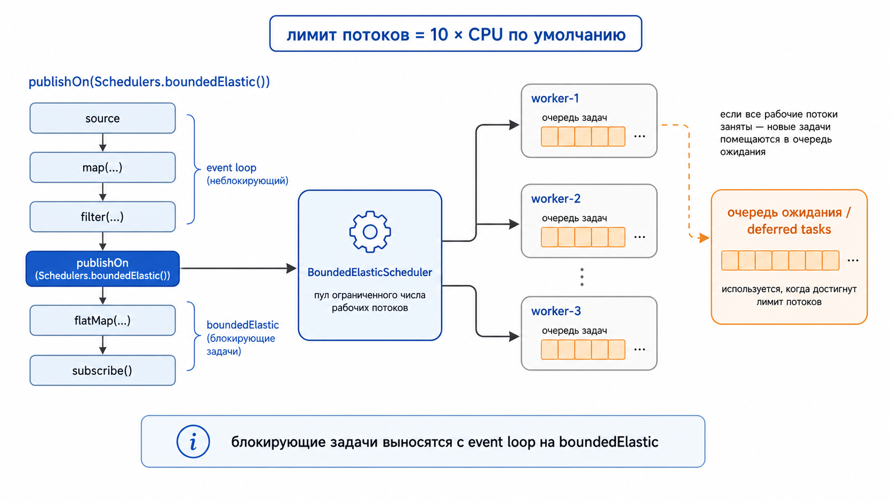

# boundedElastic в Project Reactor

> `boundedElastic` — это не «магический реактивный поток» и не `new Thread()` на каждую задачу, а специальный scheduler для **блокирующих** операций: он создаёт **ограниченное** число рабочих потоков, переиспользует их, а лишние задачи временно ставит в очередь.

## Оглавление

1. [Что такое boundedElastic](#что-такое-boundedelastic)
2. [Зачем он нужен](#зачем-он-нужен)
3. [Как это выглядит концептуально](#как-это-выглядит-концептуально)
4. [Как это выглядит в коде Reactor](#как-это-выглядит-в-коде-reactor)
5. [Сколько потоков создаётся](#сколько-потоков-создаётся)
6. [Зачем нужна очередь задач](#зачем-нужна-очередь-задач)
7. [Как задавать свои параметры](#как-задавать-свои-параметры)
8. [Когда использовать publishOn и subscribeOn](#когда-использовать-publishon-и-subscribeon)
9. [Чем отличается от parallel и new Thread](#чем-отличается-от-parallel-и-new-thread)
10. [Короткий итог](#короткий-итог)

---

## Что такое boundedElastic

`Schedulers.boundedElastic()` — это **scheduler** в Project Reactor, предназначенный для задач, которые могут **блокировать поток**: 
  - JDBC без реактивного драйвера, 
  - файловый ввод-вывод, 
  - вызовы старого HTTP-клиента, 
  - SDK с синхронным API и тому подобное. 


- boundedElastic нужен для blocking операций;

- R2DBC-драйвер объявлен как **non-blocking**;
   - значит, сам **database call** через R2DBC **не надо оборачивать** в _boundedElastic_.

В официальном Reactor Reference Guide прямо сказано, что это *«a handy way to give a blocking process its own thread so that it does not tie up other resources (удобный способ выделить отдельный поток, чтобы не блокировать другие ресурсы)»* — https://projectreactor.io/docs/core/release/reference/coreFeatures/schedulers.html

Ключевая идея здесь в слове **bounded**: это не бесконечно растущий пул, а пул с верхней границей. 

В Javadoc `Schedulers` указано, что максимальный размер общего `boundedElastic()` по умолчанию берётся из свойства `reactor.schedulers.defaultBoundedElasticSize`, а если оно не задано — используется значение `10 * availableProcessors` — https://projectreactor.io/docs/core/release/api/reactor/core/scheduler/Schedulers.html

---

## Зачем он нужен

Reactor по своей природе хорошо работает там, где код **не блокирует** поток. Если же внутри реактивной цепочки внезапно вызвать блокирующую операцию на event loop или на `parallel()`, можно «заморозить» поток, на котором должны были обрабатываться и другие задачи. Поэтому blocking work обычно **выносят** на `boundedElastic` — https://docs.spring.io/projectreactor/reactor-core/docs/3.7.0-M3/reference/html/coreFeatures/schedulers.html и https://stackoverflow.com/questions/61304762/difference-between-boundedelastic-vs-parallel-scheduler

Именно поэтому типичный шаблон в Reactor выглядит так:

```java
Mono.fromCallable(() -> blockingCall())
    .subscribeOn(Schedulers.boundedElastic());
```

Такой код означает: «сама блокирующая работа должна выполняться не на текущем реактивном потоке, а на одном из потоков boundedElastic». 
  - Это **официальный** рекомендуемый **способ** оборачивать синхронные блокирующие вызовы — https://docs.spring.io/projectreactor/reactor-core/docs/3.7.0-M3/reference/html/coreFeatures/schedulers.html

---

## Как это выглядит концептуально

Ниже схема, которая помогает представить внутреннюю модель `boundedElastic`.




Мысленно это можно представить так:

- есть **центральный** _scheduler_;
- он управляет набором **рабочих потоков**;
- на каждый **worker** можно назначать _задачи_;
- если свободного **worker** нет, **но лимит** ещё **не достигнут** — _создаётся_ **новый**;
- если **лимит** уже **достигнут** — **задача** не теряется, а попадает **в очередь ожидания**;
- когда **поток** освобождается, отложенная **задача** берётся **из очереди** и запускается.

Именно поэтому `boundedElastic` хорошо подходит для блокирующего I/O: 
  - он допускает, что часть потоков может какое-то время просто ждать ответа от базы, файла или сети, и при этом не заставляет event loop обслуживать этот простой — https://projectreactor.io/docs/core/release/reference/coreFeatures/schedulers.html

---

## Как это выглядит в коде Reactor

### Вариант 1. Правильный шаблон для одного блокирующего вызова

```java
  Mono<String> result = Mono.fromCallable(
                () -> jdbcTemplate.queryForObject(sql, String.class)
        )
        .subscribeOn(
                Schedulers.boundedElastic()
        );
```

Это самый частый и рекомендуемый вариант. 

 - `fromCallable(...)` оборачивает синхронную блокирующую операцию, а 
 - `subscribeOn(...)` говорит Reactor выполнить источник на `boundedElastic` — https://docs.spring.io/projectreactor/reactor-core/docs/3.7.0-M3/reference/html/coreFeatures/schedulers.html

### Вариант 2. Переключение части цепочки через publishOn

```java
Flux<Integer> flux = Flux.range(1, 5)
    .map(i -> i * 2)
    .publishOn(Schedulers.boundedElastic())
    .map(i -> blockingTransform(i));
```

 - Здесь первые операторы идут на прежнем **scheduler**, а 
 - после `publishOn(...)` **downstream-часть** цепочки выполняется уже на `boundedElastic`. 

Это полезно, когда нужно вынести **не весь источник**, а только определённый _участок_ **pipeline** — https://projectreactor.io/docs/core/release/reference/coreFeatures/schedulers.html

### Вариант 3. Несколько блокирующих задач параллельно

```java
        Flux<String> users = Flux.just("1", "2", "3", "4")
        .flatMap(
                id -> Mono.fromCallable(() -> loadUserBlocking(id)
                        )
                        .subscribeOn(
                                Schedulers.boundedElastic()
                        )
        );
```

В этом примере каждая блокирующая загрузка пользователя получает возможность выполниться на одном из потоков `boundedElastic`. 
 - **При достаточном лимите** потоков **задачи** пойдут **параллельно**; 
 - если лимит достигнут, лишние задачи будут _**ждать в очереди**_ — https://stackoverflow.com/questions/61304762/difference-between-boundedelastic-vs-parallel-scheduler и https://projectreactor.io/docs/core/release/api/reactor/core/scheduler/Schedulers.html

---

## Сколько потоков создаётся

По умолчанию общий `Schedulers.boundedElastic()` имеет верхнюю границу количества backing threads: **`10 * количество доступных процессоров`**. 

- Это прямо отражено в Javadoc через `DEFAULT_BOUNDED_ELASTIC_SIZE` и **свойство** `reactor.schedulers.defaultBoundedElasticSize` — https://projectreactor.io/docs/core/release/api/reactor/core/scheduler/Schedulers.html

То есть если у машины **8 CPU**, то стандартный cap будет равен 80. 
 - Это **не означает**, что при старте приложения сразу создадутся все 80 потоков.
   - `boundedElastic` создаёт их **по мере необходимости**, а не заранее, и затем **пере-использует** простаивающие потоки — https://projectreactor.io/docs/core/release/reference/coreFeatures/schedulers.html и https://eherrera.net/project-reactor-course/06-schedulers-and-threads/what-is-a-scheduler.html

В reference guide также указано, что **idle worker pools** могут быть удалены спустя период простоя (**TTL**); 
 - исторически для ExecutorService-based реализации это **TTL** порядка 60 секунд, а в API создания **пользовательского** _scheduler_ этот параметр задаётся явно через `ttlSeconds` — https://projectreactor.io/docs/core/release/api/reactor/core/scheduler/Schedulers.html

---

## Зачем нужна очередь задач

**Если бы** `boundedElastic` просто создавал новый **поток** на каждую задачу, он бы быстро **деградировал** до аналога плохого `new Thread()`-подхода. 
  - Поэтому Reactor не только **ограничивает количество потоков**, но и **ограничивает количество задач**, которые можно отложить, когда все рабочие потоки заняты — https://projectreactor.io/docs/core/release/reference/coreFeatures/schedulers.html

В документации указано, что после достижения cap до **100_000 задач на один backing thread** могут быть поставлены в очередь; 
 - соответствующее значение связано с `DEFAULT_BOUNDED_ELASTIC_QUEUESIZE` и свойством `reactor.schedulers.defaultBoundedElasticQueueSize` — https://projectreactor.io/docs/core/release/api/reactor/core/scheduler/Schedulers.html

**Это нужно** для двух вещей:

 - не создавать бесконтрольно новые потоки;
 - не терять задачу сразу, если все потоки временно заняты блокирующими вызовами.

Но это не «бесконечная страховка». 
 - Если и **лимит потоков**, и **лимит** отложенных **задач** _исчерпаны_, **новые задачи** будут **отклоняться**, что обычно проявляется как `RejectedExecutionException` — https://eherrera.net/project-reactor-course/06-schedulers-and-threads/what-is-a-scheduler.html и https://stackoverflow.com/questions/75130321/reactor-api-returning-task-capacity-of-bounded-elastic-scheduler-exception

### Важное замечание

Очередь в `boundedElastic` **не делает** _blocking code_ «реактивным». 
  - Она лишь позволяет **scheduler** пережить короткий всплеск блокирующих задач, не разрушая приложение мгновенным созданием тысяч потоков. 
  - Если очередь у тебя постоянно забита, это уже не победа, а симптом: **blocking work** слишком **много**, либо **лимиты** заданы **неверно**, либо архитектурно нужен другой подход.

---

## Как задавать свои параметры

Есть два основных пути: 
 - менять **глобальные свойства** или 
 - создавать **свой экземпляр scheduler**.

### 1. Глобальные свойства

Для общего **shared** `boundedElastic()` Reactor использует системные свойства:

- `reactor.schedulers.defaultBoundedElasticSize`
- `reactor.schedulers.defaultBoundedElasticQueueSize`

Они описаны в Javadoc `Schedulers` — https://projectreactor.io/docs/core/release/api/reactor/core/scheduler/Schedulers.html

Пример запуска JVM:

```bash

-Dreactor.schedulers.defaultBoundedElasticSize=50 \
-Dreactor.schedulers.defaultBoundedElasticQueueSize=20000
```

Это влияет на **общий** scheduler, который возвращает `Schedulers.boundedElastic()`.

>Начиная с версии 3.6.0 boundedElastic() может запускать задачи на **VirtualThreads**, 
> 
> если приложение работает на **Java 21+** и системное свойство **DEFAULT_BOUNDED_ELASTIC_ON_VIRTUAL_THREADS** установлено в **true**.

### 2. Пользовательский scheduler

Когда **не хочется** менять **глобальное поведение** всего приложения, лучше **создать** _отдельный scheduler_ под конкретный сценарий:

```java
Scheduler ioScheduler = Schedulers.newBoundedElastic(
    20,           // threadCap
    5000,         // queuedTaskCap
    "jdbc-io",   // name
    60            // ttlSeconds
);
```

Такой API есть в `Schedulers.newBoundedElastic(...)`, а его параметры документированы в Javadoc — https://projectreactor.io/docs/core/release/api/reactor/core/scheduler/Schedulers.html

### Что означают параметры

- `threadCap` — максимум backing threads;
- `queuedTaskCap` — максимум отложенных задач на backing thread;
- `name` — префикс имён потоков, удобен для логов и thread dump;
- `ttlSeconds` — сколько держать простаивающий ресурс перед удалением.

### Когда это полезно

Свой **scheduler** удобно выделять, когда:

 - у тебя есть отдельный тяжёлый интеграционный слой, например JDBC или файловый архив;
 - ты не хочешь, чтобы он конкурировал за общий `boundedElastic()` со всем приложением;
 - тебе нужен понятный префикс потока для диагностики;
 - ты хочешь жёстче контролировать лимиты именно для этой категории задач.

---

## Когда использовать publishOn и subscribeOn

Представь: ты **менеджер**, у тебя есть **архив** (база данных) и **аналитик**.

***

### subscribeOn — кто идёт в архив

```java
Mono.fromCallable(() -> archive.findDocument(id))
    .subscribeOn(Schedulers.boundedElastic())
```

Без `subscribeOn` — **ты сам идёшь в архив** и стоишь там, пока документ ищут. Ты заблокировал поток (путь) по которому нужно отправить данные (а ведь этот путь для передачи грузов(данных) могли использовать другие подписчики).

А вот если ты используешь `subscribeOn(boundedElastic())` — это как курьер из отдела **boundedElastic** идёт в архив вместо тебя. Ты свободен и занимаешься другим (то есть ты освободил путь для других данных, а работу со своими данными перевел на запасной путь.

`subscribeOn` — это не подписчик. 
 - Это **инструкция**: «когда кто-то подпишется — запусти источник на этом **scheduler**». Подписчик всегда один — тот, кто вызвал `.subscribe()` в самом конце цепочки.

- То есть думай так, если метод который ты вызвал, будет долго ждать данные, а значит заблокирует поток и не даст другим задачам выполниться, пока не получит данные, значит нужно его перевести на `boundedElastic`, 
   - и здесь нужен `subscribeOn`, потому что результат этих данных, затем будет использован ниже в цепочке операторов!
***

### publishOn — кто потом работает с результатом

```java
Mono.fromCallable(() -> archive.findDocument(id))
    .subscribeOn(Schedulers.boundedElastic())    // курьер идёт в архив
    .map(doc -> doc.toUpperCase())               // курьер обрабатывает по дороге
    .publishOn(Schedulers.parallel())            // передаёт документ аналитику
    .map(doc -> analyze(doc))                    // аналитик делает своё дело
    .subscribe(result -> save(result));          // аналитик же и сохраняет
```

 Когда курьер принёс документ (смотри задачу, которую направили в `.subscribeOn(Schedulers.boundedElastic())` )
 - затем документ полученный ранее из архива будет вынут из коробки ( `.map(doc -> doc.toUpperCase())` ) и это быстрая задача
 - затем курьер когда достал из коробки документ  — он **передаёт документ аналитику из parallel-пула** и далее нужно документ будут проанализировать, а это займет время
 - используем `publishOn(parallel())`, который позволит направить работу такого объема на соседний "путь" (отдельный поток), а значит и операторы `analyze()` и `save()`, будут работать на этом же выделнном потоке
 - то есть мы делегировали работу по обработке документа **аналитику, а не курьеру**.
 - Всё что дальше: `analyze()` и `save()` — 

***

### Короткое правило

**Блокирует источник в начале** — например, вызов удалённого сервиса или обращение к базе через JDBC:

```java
Mono.fromCallable(() -> remoteService.getData())  // долго отвечает
    .subscribeOn(Schedulers.boundedElastic())      // ← источник на boundedElastic
    .map(data -> process(data))
    .map(data -> format(data))
```

**Блокирует один оператор посередине** — например, получение курса валют после быстрых расчётов:

```java
Flux.of(100.0, 200.0, 300.0)
    .map(amount -> calculate(amount))              // быстро
    .publishOn(Schedulers.boundedElastic())        // ← переключаем перед медленным
    .map(amount -> currencyService.getRate(amount)) // долго, блокирует
    .map(rate -> format(rate))
```

Ответ **не возвращается к тебе** сам по себе. Он идёт к тому, кому передали через `publishOn`. Если `publishOn` нет — курьер сам несёт документ до конца цепочки.


---

## Чем отличается от parallel и new Thread

### boundedElastic vs parallel

  - `parallel()` рассчитан на **быстрые неблокирующие CPU-bound задачи**. 
    - В **typical** case число его потоков ближе к количеству **CPU**, а сам он не предназначен для того, чтобы потоки долго стояли в блокировке — https://stackoverflow.com/questions/61304762/difference-between-boundedelastic-vs-parallel-scheduler

  - `boundedElastic()` рассчитан именно на **долгие или блокирующие** задачи, где поток может ждать сеть, диск, JDBC или чужую библиотеку. 
    - Он допускает рост числа **_workers_** до лимита и использует очередь ожидания, когда лимит достигнут — https://projectreactor.io/docs/core/release/reference/coreFeatures/schedulers.html

### boundedElastic vs new Thread()

 - `new Thread()` каждый раз создаёт новый поток вручную, без **_пере-использования_**, без центрального лимита и без общей политики очереди. 
   - Если таких задач много, приложение может быстро упереться в память, переключение контекста и системные лимиты.

- `boundedElastic`, наоборот:

  - создаёт потоки по мере необходимости;
  - **пере-использует** их;
  - ограничивает общий рост;
  - даёт контролируемую очередь;
  - интегрирован в модель Reactor через `publishOn` и `subscribeOn`.

**Старый `elastic()`** — это предшественник `boundedElastic`. Он тоже создавал потоки для блокирующих задач, но **без верхней границы**: 
  - пришло 1000 задач — создал 1000 потоков. **Никаких** _лимитов_.

- Проблема в том, что при резком наплыве задач он **молча создавал всё новые и новые потоки**, не давя на источник, не сигнализируя, что система перегружена. 

**Backpressure** — это механизм в Reactive Streams, когда получатель говорит источнику «притормози, я не справляюсь» и в этом случае он не работал:
 - `elastic()` этот сигнал _**фактически игнорировал**_: очереди нет, лимита нет — просто создай ещё поток.

**Итог**: приложение могло _**тихо завершиться**_ под нагрузкой, создав **несколько тысяч потоков**, **вместо** того чтобы честно **вернуть ошибку** или **замедлить** приём **задач**.


- **`boundedElastic()` исправляет это**: 
  - лимит потоков есть, очередь задач ограничена. Когда лимиты исчерпаны — задача **отклоняется** с явной **ошибкой**. Это лучше, чем молчаливый рост потоков до краша.

**Поэтому** `elastic()` в современном Reactor помечен как **нежелательный** — https://docs.spring.io/projectreactor/reactor-core/docs/3.7.0-M3/reference/html/coreFeatures/schedulers.html


---

## Короткий итог

`boundedElastic` — это **bounded thread pool** для **blocking work** внутри Reactor. 
 - Он создаёт потоки **не заранее, а по требованию**, 
   - ограничивает их количество, 
   - ставит лишние задачи в очередь и 
   - позволяет вынести синхронные операции с **event loop** на отдельный **scheduler** — https://projectreactor.io/docs/core/release/reference/coreFeatures/schedulers.html

Если объяснять совсем просто, то модель такая:

 - **blocking task** пришла на `boundedElastic`;
 - есть свободный **worker** → задача запускается сразу;
 - свободного **worker** нет, но **лимит не достигнут** → создаётся новый **worker** ;
 - **лимит** достигнут → задача **ждёт** в очереди;
 - очередь переполнена → задача отклоняется.

Когда очередь переполнена у `boundedElastic`, появляется **Ошибка**  — `ReactorRejectedExecutionException` с сообщением:

```
Task capacity of bounded elastic scheduler reached
while scheduling 1 tasks (3/2)
```

... смотри — https://stackoverflow.com/questions/75130321/reactor-api-returning-task-capacity-of-bounded-elastic-scheduler-exception, где человек словил эту ошибку в реальном коде.

Сам текст исключения, можно увидеть прямо из исходников Reactor на GitHub — https://github.com/reactor/reactor-core/blob/main/reactor-core/src/main/java/reactor/core/scheduler/BoundedElasticScheduler.java:

```java
throw Exceptions.failWithRejected(
    "Task capacity of bounded elastic scheduler reached " +
    "while scheduling " + taskCount + " tasks (" + 
    (queueSize + taskCount) + ")"
);
```

То есть **Reactor** сам **бросает** `ReactorRejectedExecutionException` в момент, когда пытается поставить задачу в очередь, а очередь уже заполнена.

Именно поэтому `boundedElastic` — это не «любой фоновой поток», а **контролируемый механизм изоляции блокирующих участков** внутри реактивного приложения.
