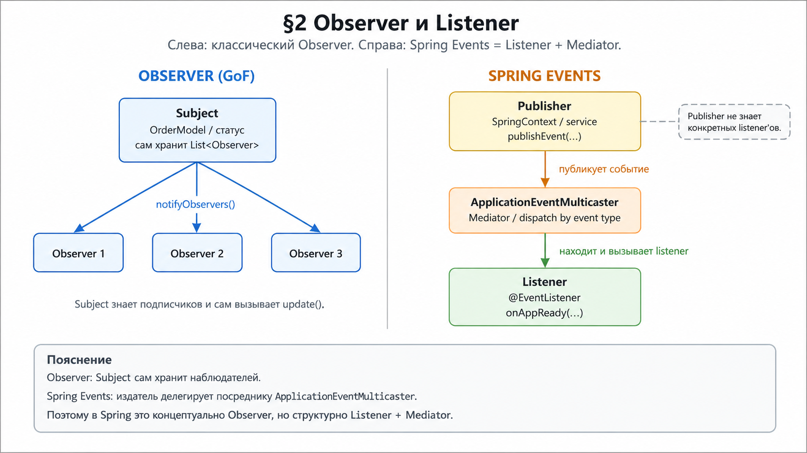

# Observer и Listener: паттерны в Java и Spring

> Отдельное руководство к [project-reactor-interview-guide.md](../project-reactor-interview-guide.md), §2.  
> **Формат:** схема → кто есть кто → как выглядит код → источник → цитата EN/RU.

**Перегенерация PNG:** `python docs/Images-docs/gen_reactor_diagrams.py`.

---

## Оглавление

1. [Observer в Java — `Observable` / `Observer`](#1-observer-в-java--observable--observer)
2. [Слушатель в Spring — `ApplicationListener` / `@EventListener`](#2-слушатель-в-spring--applicationlistener--eventlistener)
    - [Пример: `ApplicationReadyEvent`](#application-ready-event)
3. [Паттерн Mediator — что это и при чём тут Spring](#3-паттерн-mediator--что-это-и-при-чём-тут-spring)
4. [Observer, Listener, Mediator — три синонима или три разных паттерна?](#4-observer-listener-mediator--три-синонима-или-три-разных-паттерна)
5. [GoF-Observer в Spring без `ApplicationEventPublisher`](#5-gof-observer-в-spring-без-applicationeventpublisher)
6. [Observer и Listener — сравнительная таблица](#6-observer-и-listener--сравнительная-таблица)
7. [А где здесь Reactor?](#7-а-где-здесь-reactor)

---



**Как читать рисунок:** 
  - слева — **классический Observer** (Subject **сам хранит** список наблюдателей и **сам вызывает** `update()`). 
  - Справа — **события Spring** (издатель публикует событие в контекст, а `ApplicationEventMulticaster` — центральный посредник — находит нужные listener'ы по типу события и вызывает их).

> **Уточнение:** Spring в официальной документации называет `ApplicationListener` реализацией «standard Observer design pattern».
> 
> Это верно **концептуально** (push-уведомление, ослабленная связанность). 
>  - Однако **структурно** модель ближе к **Listener + Mediator**: 
>   - издатель (Publisher) не знает слушателей (**Listeners**) и не вызывает их напрямую — за это отвечает `ApplicationEventMulticaster` как посредник. Подробно — в §3 и §4.


# Пояснение к рисунку: почему на схеме есть `ApplicationEventMulticaster`, а в коде его нет

## В чём возникает путаница

На рисунке справа показана цепочка `Publisher → ApplicationEventMulticaster → Listener`, а в примере кода разработчик видит только `ApplicationEvent`, `ApplicationEventPublisher`, `ApplicationListener` и `@EventListener`. 
 - Из-за этого может возникнуть ощущение, что схема и код противоречат друг другу.

На самом деле противоречия нет: 
 - код показывает **публичный API Spring**, 
 - а рисунок показывает **внутреннюю архитектурную цепочку доставки события**.

---

## Что пишет разработчик в коде

В обычном Spring-коде разработчик работает только со следующими сущностями:

- `ApplicationEvent` — объект события.
- `ApplicationEventPublisher` — API для публикации события.
- `ApplicationListener<E>` или `@EventListener` — обработчик события.

Именно поэтому в минимальном примере нет явного `ApplicationEventMulticaster`: его обычно **не создают и не вызывают вручную**.

---

### Минимальный пример (доменное событие — из документации Spring)

**1. Событие:**

```java
/**
 * Доменное событие: адрес добавлен в чёрный список.
 * <p>Расширяет {@link ApplicationEvent}: Spring автоматически
 * передаст объект всем listener'ам, подписанным на этот тип.</p>
 */
public class BlockedListEvent extends ApplicationEvent {

    private final String address;

    /**
     * @param source  объект, опубликовавший событие (обычно {@code this})
     * @param address e-mail адрес, попавший в чёрный список
     */
    public BlockedListEvent(Object source, String address) {
        super(source);
        this.address = address;
    }

    /** @return заблокированный адрес */
    public String getAddress() { return address; }
}
```

**2. Публикация** (сервис реализует `ApplicationEventPublisherAware`):

```java
/**
 * Сервис рассылки.
 * <p>Реализует {@link ApplicationEventPublisherAware}, чтобы Spring
 * автоматически внедрил {@link ApplicationEventPublisher} — через него
 * сервис публикует события, <em>не зная</em>, кто на них подписан.</p>
 */
@Service
public class EmailService implements ApplicationEventPublisherAware {

    /** Внедряется Spring'ом автоматически через setApplicationEventPublisher. */
    private ApplicationEventPublisher publisher;

    @Override
    public void setApplicationEventPublisher(ApplicationEventPublisher publisher) {
        this.publisher = publisher;
    }

    /**
     * Добавляет адрес в чёрный список и публикует событие.
     * <p>Издатель не вызывает listener'ы напрямую —
     * он лишь «бросает» событие в контекст.</p>
     *
     * @param address адрес для блокировки
     */
    public void blockAddress(String address) {
        publisher.publishEvent(new BlockedListEvent(this, address));
    }
}
```

**3. Слушатель** — стиль `ApplicationListener`:

```java
/**
 * Listener, отправляющий уведомление при блокировке адреса.
 * <p>Реализует {@link ApplicationListener}: Spring найдёт этот bean
 * в контексте и вызовет {@code onApplicationEvent} при каждой
 * публикации {@link BlockedListEvent}.</p>
 */
@Component
public class BlockedListNotifier implements ApplicationListener<BlockedListEvent> {

    /**
     * Вызывается Spring'ом (через {@code ApplicationEventMulticaster}),
     * <em>не</em> вызывается издателем напрямую.
     *
     * @param event опубликованное событие
     */
    @Override
    public void onApplicationEvent(BlockedListEvent event) {
        System.out.println("Заблокирован адрес: " + event.getAddress());
    }
}
```

**4. Тот же слушатель** — стиль `@EventListener` (рекомендуемый):

```java
/**
 * Listener в аннотационном стиле.
 * <p>{@link EventListener} заменяет реализацию интерфейса —
 * Spring сам определяет тип события по параметру метода.</p>
 */
@Component
public class BlockedListNotifier {

    /**
     * Вызывается контекстом при публикации {@link BlockedListEvent}.
     *
     * @param event опубликованное событие
     */
    @EventListener
    public void onBlocked(BlockedListEvent event) {
        System.out.println("Заблокирован адрес: " + event.getAddress());
    }
}
```

## Что происходит внутри Spring

Когда код вызывает:

```java
publisher.publishEvent(new BlockedListEvent(this, address));
```

- это не означает, что `EmailService` сам ищет нужные **listener**'ы и вызывает их. 
  - На практике **вызов** уходит внутрь `ApplicationContext`, а дальше **событие** передаётся компоненту `ApplicationEventMulticaster`, который уже находит подходящие **listener**'ы и вызывает их.

```java
/**
* Сервис рассылки.
* <p>Реализует {@link ApplicationEventPublisherAware}, чтобы Spring
* автоматически внедрил {@link ApplicationEventPublisher} — через него
* сервис публикует события, <em>не зная</em>, кто на них подписан.</p>
  */
  @Service
  public class EmailService implements ApplicationEventPublisherAware {

  /** Внедряется Spring'ом автоматически через setApplicationEventPublisher. */
  private ApplicationEventPublisher publisher;

  @Override
  public void setApplicationEventPublisher(ApplicationEventPublisher publisher) {
  this.publisher = publisher;
  }

  /**
    * Добавляет адрес в чёрный список и публикует событие.
    * <p>Издатель не вызывает listener'ы напрямую —
    * он лишь «бросает» событие в контекст.</p>
    *
    * @param address адрес для блокировки
      */
      public void blockAddress(String address) {
      publisher.publishEvent(new BlockedListEvent(this, address));
      }
  }
```

То есть фактическая цепочка такая:

```text
EmailService
  → ApplicationEventPublisher.publishEvent(...)
    → ApplicationContext
      → ApplicationEventMulticaster
        → ApplicationListener / @EventListener
```

- Именно эту внутреннюю цепочку рисунок и показывает.

---

## Почему `ApplicationEventMulticaster` есть на схеме

Он нужен на рисунке не потому, что разработчик обязан его писать в коде, а потому что без него трудно объяснить, 
 - **почему Spring structurally ближе к Listener + Mediator, чем к классическому GoF Observer**.

В GoF Observer:

- Subject **сам хранит** список наблюдателей.
- Subject **сам вызывает** `update()` у каждого Observer.

В Spring Events:

- издатель **не хранит** список listener'ов;
- издатель **не вызывает** listener'ы напрямую;
- эту работу делает `ApplicationEventMulticaster` как центральный посредник.

Именно поэтому на рисунке его показывать правильно.

---

## На что опираться при чтении примера

Нужно опираться сразу на **два уровня понимания**:

### 1. Уровень прикладного кода

Если задача — писать Spring-приложение, достаточно помнить следующее:

- событие создаётся как `ApplicationEvent` или обычный объект;
- событие публикуется через `ApplicationEventPublisher`;
- обработка делается через `ApplicationListener` или `@EventListener`.

На этом уровне `ApplicationEventMulticaster` можно вообще не трогать.

### 2. Уровень архитектуры

Если задача — **понять паттерн**, тогда важно знать внутреннюю роль `ApplicationEventMulticaster`:

- он выступает **посредником** между _издателем_ и _listener'ами_;
- он решает, какие **listener'ы** подходят _по типу_ **события**;
- он делает реальную dispatch-**рассылку** внутри Spring.

---

## Как связать код и рисунок одной фразой

Самая удобная формулировка такая:

> В примере кода показан **внешний API**, с которым работает разработчик, а на рисунке показан **внутренний механизм доставки события** внутри Spring.

Или ещё короче:

> `publishEvent()` — это то, что пишет разработчик; `ApplicationEventMulticaster` — это то, через что Spring реально доставляет событие listener'ам.

---

## Практический вывод

- Если документ ориентирован на **объяснение паттернов**, `ApplicationEventMulticaster` на схеме нужен. 
- Если документ ориентирован только на **прикладное использование API**, его можно было бы не рисовать.

Для текущего документа логичнее оставить `ApplicationEventMulticaster` на рисунке, но рядом с примером кода добавить короткое пояснение в отдельной теме:

> `ApplicationEventMulticaster` не участвует в пользовательском коде напрямую, но участвует во внутренней доставке события внутри `ApplicationContext`.

Так схема и код перестают конфликтовать: 
  - один показывает **что пишет разработчик**, другой — **как это реально работает внутри Spring**.

---

## 1. Observer в Java — `Observable` / `Observer`

### Как выглядит паттерн

| Роль в GoF | В JDK (до reactive) | Что происходит |
|------------|---------------------|----------------|
| **Subject** (наблюдаемый) | `java.util.Observable` | Хранит **набор** `Observer`. При изменении состояния вызывает `setChanged()` → `notifyObservers()`. |
| **Observer** (наблюдатель) | `java.util.Observer` | Реализует `update(Observable o, Object arg)` — его вызывают **все** подписанные наблюдатели. |
| **Подписка** | `observable.addObserver(observer)` | Subject **знает** каждого Observer в своём списке. |
| **Уведомление** | `notifyObservers(arg)` | Subject **сам обходит** список и вызывает `update()` у каждого. |

**Цепочка в одну строку:** изменили данные в Subject → `notifyObservers()` → `update()` у каждого Observer.

* GoF — это «Gang of Four», четыре автора книги “Design Patterns: Elements of Reusable Object-Oriented Software” (Gamma, Helm, Johnson, Vlissides), где формализованы классические паттерны проектирования, включая Observer

### пример

```java
import java.util.ArrayList;
import java.util.List;

/**
 * ROLE: Observer
 *
 * <p>Общий контракт для всех наблюдателей.</p>
 * <p>Любой Observer обязан реализовать метод {@link #update(String)},
 * чтобы Subject мог уведомить его об изменении состояния.</p>
 */
interface OrderObserver {

    /**
     * Вызывается Subject'ом при изменении статуса заказа.
     *
     * @param newStatus новое состояние Subject'а
     */
    void update(String newStatus);
}

/**
 * ROLE: Subject
 *
 * <p>Наблюдаемый объект из GoF Observer.</p>
 * <p><b>Главный признак Subject:</b> он сам хранит список Observer'ов
 * и сам вызывает их метод {@code update()}.</p>
 */
class OrderStatus {

    /**
     * 1. Subject ХРАНИТ список подписчиков.
     * <p>Это ключевая часть GoF Observer:
     * список наблюдателей находится внутри Subject.</p>
     */
    private final List<OrderObserver> observers = new ArrayList<>();

    /**
     * Текущее состояние Subject'а.
     */
    private String status;

    /**
     * 2. Подписка Observer на Subject.
     *
     * @param observer наблюдатель, которого нужно добавить
     */
    public void addObserver(OrderObserver observer) {
        observers.add(observer);
    }

    /**
     * 3. Отписка Observer от Subject.
     *
     * @param observer наблюдатель, которого нужно удалить
     */
    public void removeObserver(OrderObserver observer) {
        observers.remove(observer);
    }

    /**
     * 4. Изменение состояния Subject'а.
     * <p>Как только состояние изменилось, Subject сам запускает
     * механизм уведомления всех подписчиков.</p>
     *
     * @param newStatus новый статус заказа
     */
    public void setStatus(String newStatus) {
        this.status = newStatus;
        notifyObservers();
    }

    /**
     * 5. Subject САМ обходит список Observer'ов
     * и САМ вызывает {@code update()} у каждого.
     *
     * <p>Именно это и есть суть GoF Observer.</p>
     * <p>Здесь нет Spring, нет EventBus, нет Mediator,
     * нет скрытой логики в родительском классе.</p>
     */
    private void notifyObservers() {
        for (OrderObserver observer : observers) {
            observer.update(status);
        }
    }
}

/**
 * ROLE: ConcreteObserver
 *
 * <p>Конкретная реализация Observer.</p>
 * <p>Получает уведомление от Subject'а и выполняет свою реакцию.</p>
 */
class OrderLogger implements OrderObserver {

    /**
     * Реакция на изменение состояния Subject'а.
     *
     * @param newStatus новый статус заказа
     */
    @Override
    public void update(String newStatus) {
        System.out.println("OrderLogger: статус заказа = " + newStatus);
    }
}

/**
 * ROLE: ConcreteObserver
 *
 * <p>Ещё один конкретный Observer.</p>
 * <p>Показывает, что у одного Subject может быть несколько подписчиков.</p>
 */
class OrderNotifier implements OrderObserver {

    /**
     * Реакция на изменение статуса.
     *
     * @param newStatus новый статус заказа
     */
    @Override
    public void update(String newStatus) {
        System.out.println("OrderNotifier: отправляем уведомление о статусе " + newStatus);
    }
}

/**
 * ROLE: Client
 *
 * <p>Клиентский код собирает паттерн:</p>
 * <ol>
 *   <li>создаёт Subject;</li>
 *   <li>создаёт ConcreteObserver'ов;</li>
 *   <li>подписывает Observer'ов на Subject;</li>
 *   <li>меняет состояние Subject'а.</li>
 * </ol>
 */
public class OrderObserverDemo {

    public static void main(String[] args) {

        // Шаг 1. Создаём Subject
        OrderStatus subject = new OrderStatus();

        // Шаг 2. Создаём ConcreteObserver'ов
        OrderObserver logger = new OrderLogger();
        OrderObserver notifier = new OrderNotifier();

        // Шаг 3. Подписываем Observer'ов на Subject
        subject.addObserver(logger);
        subject.addObserver(notifier);

        // Шаг 4. Меняем состояние Subject'а
        // Subject сам вызовет update() у каждого подписчика
        subject.setStatus("PAID");
        subject.setStatus("SHIPPED");

        // Шаг 5. Можно отписать одного Observer'а
        subject.removeObserver(logger);

        // Теперь уведомление получит только оставшийся Observer
        subject.setStatus("DELIVERED");
    }
}
```

> `Observable` / `Observer` помечены **`@Deprecated` с Java 9** — для нового кода JDK их не рекомендует, но они остаются **каноническим примером** паттерна в Java API.

### Когда встречается сегодня

- Учебные и legacy-коды на `Observable` / `Observer`.
- **Reactor / Reactive Streams** — та же **push-идея** («источник уведомляет подписчика»), но через `Publisher` / `Subscriber` и с backpressure (§7).

**Источник:** [Oracle — `Observable` (Java SE 8)](https://docs.oracle.com/javase/8/docs/api/java/util/Observable.html) · [`Observer`](https://docs.oracle.com/javase/8/docs/api/java/util/Observer.html)

> **EN:** «This class represents an observable object … It can have one or more observers. An observer may be any object that implements interface Observer. After an observable instance changes, an application calling the Observable's notifyObservers method causes all of its observers to be notified of the change by a call to their update method.»

> **RU:** «Этот класс представляет наблюдаемый объект … У него может быть один или несколько observers. Observer — любой объект, реализующий интерфейс Observer. После изменения observable вызов notifyObservers приводит к тому, что все observers получают update.»

---

<a id="pattern-listener"></a>

## 2. Слушатель в Spring — `ApplicationListener` / `@EventListener`

### Как выглядит паттерн в Spring

Здесь **не** `addObserver()` на вашем объекте. Модель такая:

| Роль | Класс / API в Spring | Что происходит |
|------|----------------------|----------------|
| **Событие** | `ApplicationEvent` (или любой объект, с 4.2) | Объект-сообщение: «произошло X». |
| **Издатель** | `ApplicationEventPublisher` | Вызывает `publishEvent(event)` — **не** знает список listener'ов и **не** вызывает их напрямую. |
| **Слушатель** | `ApplicationListener<E>` или метод с `@EventListener` | Bean в контексте; Spring **регистрирует** его и **вызывает** при совпадении типа события. |
| **Раздача** | `ApplicationEventMulticaster` (внутри контекста) | **Центральный посредник**: находит подходящие listener'ы по типу события и вызывает их (по умолчанию **синхронно** в потоке издателя). |

**Цепочка в одну строку:** `publishEvent(event)` → `ApplicationEventMulticaster` → `onApplicationEvent(event)` / метод с `@EventListener`.

### Минимальный пример (доменное событие — из документации Spring)

**1. Событие:**

```java
/**
 * Доменное событие: адрес добавлен в чёрный список.
 * <p>Расширяет {@link ApplicationEvent}: Spring автоматически
 * передаст объект всем listener'ам, подписанным на этот тип.</p>
 */
public class BlockedListEvent extends ApplicationEvent {

    private final String address;

    /**
     * @param source  объект, опубликовавший событие (обычно {@code this})
     * @param address e-mail адрес, попавший в чёрный список
     */
    public BlockedListEvent(Object source, String address) {
        super(source);
        this.address = address;
    }

    /** @return заблокированный адрес */
    public String getAddress() { return address; }
}
```

**2. Публикация** (сервис реализует `ApplicationEventPublisherAware`):

```java
/**
 * Сервис рассылки.
 * <p>Реализует {@link ApplicationEventPublisherAware}, чтобы Spring
 * автоматически внедрил {@link ApplicationEventPublisher} — через него
 * сервис публикует события, <em>не зная</em>, кто на них подписан.</p>
 */
@Service
public class EmailService implements ApplicationEventPublisherAware {

    /** Внедряется Spring'ом автоматически через setApplicationEventPublisher. */
    private ApplicationEventPublisher publisher;

    @Override
    public void setApplicationEventPublisher(ApplicationEventPublisher publisher) {
        this.publisher = publisher;
    }

    /**
     * Добавляет адрес в чёрный список и публикует событие.
     * <p>Издатель не вызывает listener'ы напрямую —
     * он лишь «бросает» событие в контекст.</p>
     *
     * @param address адрес для блокировки
     */
    public void blockAddress(String address) {
        publisher.publishEvent(new BlockedListEvent(this, address));
    }
}
```

**3. Слушатель** — стиль `ApplicationListener`:

```java
/**
 * Listener, отправляющий уведомление при блокировке адреса.
 * <p>Реализует {@link ApplicationListener}: Spring найдёт этот bean
 * в контексте и вызовет {@code onApplicationEvent} при каждой
 * публикации {@link BlockedListEvent}.</p>
 */
@Component
public class BlockedListNotifier implements ApplicationListener<BlockedListEvent> {

    /**
     * Вызывается Spring'ом (через {@code ApplicationEventMulticaster}),
     * <em>не</em> вызывается издателем напрямую.
     *
     * @param event опубликованное событие
     */
    @Override
    public void onApplicationEvent(BlockedListEvent event) {
        System.out.println("Заблокирован адрес: " + event.getAddress());
    }
}
```

**4. Тот же слушатель** — стиль `@EventListener` (рекомендуемый):

```java
/**
 * Listener в аннотационном стиле.
 * <p>{@link EventListener} заменяет реализацию интерфейса —
 * Spring сам определяет тип события по параметру метода.</p>
 */
@Component
public class BlockedListNotifier {

    /**
     * Вызывается контекстом при публикации {@link BlockedListEvent}.
     *
     * @param event опубликованное событие
     */
    @EventListener
    public void onBlocked(BlockedListEvent event) {
        System.out.println("Заблокирован адрес: " + event.getAddress());
    }
}
```

> `ApplicationListener` **extends** `java.util.EventListener` — это **Java-интерфейс-маркер** для callback-модели (Swing, servlet events и т.д.). Spring строит на нём **свой** механизм событий контекста.

**Источник:** [Spring Framework — Application Events](https://docs.spring.io/spring-framework/reference/core/beans/context-introduction.html#context-functionality-events) · [Javadoc — `ApplicationListener`](https://docs.spring.io/spring-framework/docs/current/javadoc-api/org/springframework/context/ApplicationListener.html)

> **EN (Reference):** «Event handling in the ApplicationContext is provided through the ApplicationEvent class and the ApplicationListener interface. If a bean that implements the ApplicationListener interface is deployed into the context, every time an ApplicationEvent gets published to the ApplicationContext, that bean is notified. Essentially, this is the standard Observer design pattern.»

> **EN (Javadoc):** «Interface to be implemented by application event listeners. Based on the standard EventListener interface for the Observer design pattern.»

> **RU:** «Обработка событий в ApplicationContext идёт через ApplicationEvent и ApplicationListener. Если bean с ApplicationListener развёрнут в контексте, при каждой публикации ApplicationEvent он получает уведомление. По сути, это стандартный паттерн Observer.» / «Интерфейс слушателя событий приложения. Основан на стандартном EventListener — интерфейсе для паттерна Observer.»

---

<a id="application-ready-event"></a>

### Пример: `ApplicationReadyEvent`

Типичный **Spring Boot** listener — реакция на **жизненный цикл** приложения (не Reactor).


**Цепочка:** `SpringApplication.run()` → контекст поднят → runners → **`ApplicationReadyEvent`** → ваш `@EventListener`.

```java
/**
 * Listener жизненного цикла: выполняет действия после полного старта приложения.
 * <p>Spring Boot публикует {@link ApplicationReadyEvent} последним при запуске —
 * после того, как все {@code ApplicationRunner} и {@code CommandLineRunner}
 * уже отработали. Использовать для прогрева кешей, регистрации в service
 * discovery и т.п.</p>
 */
@Component
@Slf4j
public class AppStartupListener {

    /**
     * Вызывается контекстом, когда приложение готово обслуживать запросы.
     *
     * @param event событие готовности приложения; содержит ссылку
     *              на {@link org.springframework.boot.SpringApplication}
     */
    @EventListener(ApplicationReadyEvent.class)
    public void onAppReady(ApplicationReadyEvent event) {
        log.info("Приложение готово обслуживать запросы");
    }
}
```

| Шаг | Кто | Действие |
|-----|-----|----------|
| 1 | Spring Boot | Публикует `ApplicationReadyEvent` **после** runners |
| 2 | `ApplicationContext` | Передаёт событие `ApplicationEventMulticaster` |
| 3 | Ваш bean | Метод `onAppReady` вызывается **контекстом**, не вами |

**Источник:** [Spring Boot — Application events](https://docs.spring.io/spring-boot/reference/features/spring-application.html#features.spring-application.application-events-and-listeners) · [Javadoc — `ApplicationReadyEvent`](https://docs.spring.io/spring-boot/api/java/org/springframework/boot/context/event/ApplicationReadyEvent.html)

> **EN:** «An ApplicationReadyEvent is sent after any application and command-line runners have been called.» / «Event published as late as conceivably possible to indicate that the application is ready to service requests.»

> **RU:** «ApplicationReadyEvent отправляется после выполнения всех ApplicationRunner и CommandLineRunner.» / «Событие публикуется максимально поздно при старте — приложение готово обслуживать запросы.»

---

<a id="pattern-mediator"></a>

## 3. Паттерн Mediator — что это и при чём тут Spring

### Идея простыми словами

Представьте диспетчерскую вышку аэропорта. Самолёты не договариваются друг с другом напрямую — каждый говорит только с вышкой, а она решает, кому что передать. Убрать вышку — и все начнут кричать друг на друга.

Именно это и есть **Mediator (Посредник)**: объект, через который общаются все остальные. Участники **не знают** друг о друге — они знают только о посреднике.

### Когда нужен Mediator

Без посредника при `N` взаимодействующих объектах связей может быть \( N \times (N-1) \) — каждый знает каждого. Mediator сводит это к `N` связям: все знают только посредника.

### Минимальный пример паттерна

```java
/**
 * Посредник: знает всех участников чата и маршрутизирует сообщения.
 * <p>Ни один {@link ChatUser} не хранит ссылок на других пользователей —
 * все сообщения проходят только через {@code ChatRoom}.</p>
 */
class ChatRoom {

    /** Список всех участников, известных посреднику. */
    private final List<ChatUser> users = new ArrayList<>();

    /**
     * Регистрирует участника в посреднике.
     *
     * @param user новый участник чата
     */
    public void join(ChatUser user) {
        users.add(user);
    }

    /**
     * Рассылает сообщение всем участникам, кроме отправителя.
     * <p>Отправитель не знает, кто получит сообщение —
     * это решение посредника.</p>
     *
     * @param sender  участник, отправивший сообщение
     * @param message текст сообщения
     */
    public void send(ChatUser sender, String message) {
        for (ChatUser user : users) {
            if (user != sender) {              // не отправлять самому себе
                user.receive(sender.getName(), message);
            }
        }
    }
}

/**
 * Участник чата.
 * <p>Знает только посредника {@link ChatRoom} —
 * не знает других {@code ChatUser} напрямую.</p>
 */
class ChatUser {

    private final String name;
    private final ChatRoom room; // единственная зависимость — посредник

    /**
     * @param name имя участника
     * @param room посредник (чат-комната)
     */
    public ChatUser(String name, ChatRoom room) {
        this.name = name;
        this.room = room;
        room.join(this); // регистрация у посредника
    }

    /**
     * Отправляет сообщение через посредника.
     *
     * @param message текст сообщения
     */
    public void send(String message) {
        room.send(this, message); // делегируем посреднику
    }

    /**
     * Получает сообщение от посредника.
     *
     * @param from    имя отправителя
     * @param message текст сообщения
     */
    public void receive(String from, String message) {
        System.out.println(name + " получил от " + from + ": " + message);
    }

    public String getName() { return name; }
}

// ── Использование ──────────────────────────────────────────────────────
ChatRoom room = new ChatRoom();        // посредник
ChatUser alice = new ChatUser("Alice", room);
ChatUser bob   = new ChatUser("Bob",   room);
ChatUser carol = new ChatUser("Carol", room);

alice.send("Привет всем!");
// → Bob получил от Alice: Привет всем!
// → Carol получил от Alice: Привет всем!
// Alice и Bob не знают ничего друг о друге — только о ChatRoom.
```

### Как Mediator связан с `ApplicationEventMulticaster`

В Spring роль `ChatRoom` играет **`ApplicationEventMulticaster`**. Посмотрите на аналогию:

| Роль в паттерне Mediator | В Spring Events |
|--------------------------|-----------------|
| Посредник (`ChatRoom`) | `ApplicationEventMulticaster` |
| Участник, отправляющий | `ApplicationEventPublisher` → `publishEvent()` |
| Участник, получающий | `ApplicationListener` / `@EventListener` |
| Регистрация у посредника | Spring сам регистрирует bean'ы-listener'ы при старте контекста |

`ApplicationEventPublisher.publishEvent()` не обходит listener'ы сам — он делегирует `ApplicationEventMulticaster`, который **ищет подходящие listener'ы по типу события** и вызывает их. Это и есть роль Mediator.

**Источник:** [Refactoring.Guru — Mediator vs Observer](https://refactoring.guru/design-patterns/observer)

> **EN:** «The primary goal of Mediator is to eliminate mutual dependencies among a set of system components. Instead, these components become dependent on a single mediator object … There's a popular implementation of the Mediator pattern that relies on Observer. The mediator object plays the role of publisher, and the components act as subscribers … When Mediator is implemented this way, it may look very similar to Observer.»

> **RU:** «Цель Mediator — устранить прямые зависимости между компонентами, сделав их зависимыми от единственного объекта-посредника … Существует популярная реализация паттерна Mediator, основанная на Observer: объект-посредник играет роль издателя, а компоненты — подписчиков. В таком виде Mediator очень похож на Observer.»

---

<a id="observer-listener-mediator-diff"></a>

## 4. Observer, Listener, Mediator — три синонима или три разных паттерна?

### Как связаны термины

На практике эти три термина часто используют как взаимозаменяемые, хотя между ними есть структурные отличия. Разобраться помогает цитата из [Refactoring.Guru — Observer](https://refactoring.guru/design-patterns/observer):

> **EN:** «Observer — Also known as: **Event-Subscriber, Listener**.»

> **RU:** «Observer — также известен как: **Event-Subscriber, Listener**.»

Это значит: Refactoring.Guru считает все три названия **синонимами одного паттерна**. Spring придерживается той же позиции, называя `ApplicationListener` реализацией Observer.

### Почему же мы говорим «в Spring это Listener, а не Observer»?

Потому что **идея** и **структура** — разные вещи:

| Критерий | GoF Observer | Spring Events (Listener) |
|----------|-------------|--------------------------|
| **Идея** | Push-уведомление при изменении состояния | Push-уведомление при наступлении события |
| **Кто хранит список получателей** | Сам Subject | `ApplicationEventMulticaster` (посредник) |
| **Знает ли издатель получателей** | **Да** — Subject хранит `List<Observer>` | **Нет** — издатель знает только `ApplicationEventPublisher` |
| **Посредник** | Отсутствует | `ApplicationEventMulticaster` — явный Mediator |
| **Триггер** | Изменение **состояния** объекта | Любой **факт** (событие) |

**Итог:** Spring называет свою систему Observer по **концепции** (push + слабая связанность). Но структурно реализация совмещает три паттерна: **Listener** (интерфейс `EventListener`), **Mediator** (`ApplicationEventMulticaster`) и **Observer** (идея push-уведомления). Именно поэтому в разговорной практике Spring-код с `@EventListener` принято называть listener'ом.

[blog.beezwax.net](https://blog.beezwax.net/did-you-hear-something-observer-pattern-vs-event-listeners/) формулирует практическое разграничение:

> **EN:** «Observers are registered to the subjects they are observing, and **a subject knows all the observers it notifies**. Listeners, on the other hand, are listening for events on a global Events instance … **Any objects that are triggering events will broadcast their events without knowing who they are broadcasting to.**»

> **RU:** «Наблюдатели регистрируются у конкретного Subject, и **Subject знает всех своих Observer'ов**. Listener'ы же слушают события через глобальный экземпляр Events … **Любой объект, публикующий событие, не знает, кто его слушает.**»

---

<a id="gof-observer-spring"></a>

## 5. GoF-Observer в Spring без `ApplicationEventPublisher`

### Зачем это нужно

Если вам нужен именно **GoF-Observer** — где Subject **сам** хранит список и **сам** обходит его — это можно сделать в Spring вручную, не используя механизм `ApplicationEvent`. Такой подход используют, когда хотят явно управлять подпиской: добавлять и удалять наблюдателей в runtime, или когда Subject должен знать своих конкретных подписчиков.

### Ключевое отличие от Spring Events (перед кодом)

В Spring Events издатель вызывает `publishEvent()` и **не знает**, кто получит событие. В GoF-Observer ниже `StockPriceTracker` **сам хранит** `List<StockObserver>` и **сам вызывает** каждого — никакого `ApplicationEventMulticaster` посередине нет.

### Пример

```java
/**
 * Интерфейс Observer'а (наблюдателя).
 * <p>Любой объект, желающий следить за ценой акции,
 * должен реализовать этот интерфейс.</p>
 */
public interface StockObserver {

    /**
     * Вызывается Subject'ом при изменении цены.
     *
     * @param ticker   тикер акции, например {@code "AAPL"}
     * @param newPrice новая цена
     */
    void onPriceChanged(String ticker, double newPrice);
}

/**
 * Subject (наблюдаемый объект) — GoF-Observer в рамках Spring-бина.
 *
 * <p><b>Ключевое отличие от Spring Events:</b> этот класс
 * <em>сам хранит</em> {@code List<StockObserver>} и <em>сам вызывает</em>
 * каждого наблюдателя. Нет никакого {@code ApplicationEventPublisher},
 * нет {@code ApplicationEventMulticaster} — чистый GoF-паттерн.</p>
 */
@Component
public class StockPriceTracker {

    /**
     * Список наблюдателей.
     * <p>Subject <em>знает</em> каждого Observer'а — это главный
     * признак GoF-Observer в отличие от Spring Events (Listener).</p>
     */
    private final List<StockObserver> observers = new ArrayList<>();

    /**
     * Регистрирует нового наблюдателя.
     *
     * @param observer наблюдатель, которого нужно уведомлять об изменениях
     */
    public void addObserver(StockObserver observer) {
        observers.add(observer);
    }

    /**
     * Удаляет наблюдателя (отписка в runtime).
     *
     * @param observer наблюдатель для удаления
     */
    public void removeObserver(StockObserver observer) {
        observers.remove(observer);
    }

    /**
     * Обновляет цену и уведомляет всех наблюдателей.
     * <p>Subject <em>сам обходит</em> список — аналог
     * {@code notifyObservers()} из {@link java.util.Observable}.</p>
     *
     * @param ticker   тикер акции
     * @param newPrice новая цена
     */
    public void updatePrice(String ticker, double newPrice) {
        // Subject сам идёт по списку — это и есть GoF Observer
        observers.forEach(observer -> observer.onPriceChanged(ticker, newPrice));
    }
}

/**
 * Конкретный Observer: отправляет алерт при изменении цены.
 * <p>Реализует {@link StockObserver}: ничего не знает о других
 * Observer'ах и не знает, когда именно будет вызван — Subject решает.</p>
 */
@Component
public class AlertService implements StockObserver {

    /**
     * Вызывается Subject'ом ({@link StockPriceTracker}) напрямую.
     *
     * @param ticker   тикер акции
     * @param newPrice новая цена
     */
    @Override
    public void onPriceChanged(String ticker, double newPrice) {
        System.out.println("ALERT: " + ticker + " → " + newPrice);
    }
}

/**
 * Конфигурация подписок при старте приложения.
 *
 * <p>В GoF-Observer подписку настраивают явно: здесь
 * {@link AlertService} регистрируется у {@link StockPriceTracker}.
 * Subject знает конкретного Observer'а — в отличие от Spring Events,
 * где издатель не знает listener'ов.</p>
 */
@Component
public class AppSetup {

    /**
     * @param tracker      Subject — будет хранить ссылку на alertService
     * @param alertService Observer — регистрируется у Subject'а вручную
     */
    @Autowired
    public AppSetup(StockPriceTracker tracker, AlertService alertService) {
        tracker.addObserver(alertService); // Subject теперь ЗНАЕТ alertService
    }
}

// ── Использование ──────────────────────────────────────────────────────
// tracker.updatePrice("AAPL", 195.50);
// → "ALERT: AAPL → 195.5"
//
// Хотите отписаться в runtime? Просто:
// tracker.removeObserver(alertService);
```

### Что здесь отличает от Spring Events

| | GoF-Observer выше | Spring `@EventListener` |
|---|---|---|
| Кто хранит список | `StockPriceTracker` сам | `ApplicationEventMulticaster` |
| Знает ли издатель получателей | **Да** — `observers` список | **Нет** |
| Отписка в runtime | `removeObserver()` | Нет встроенного механизма |
| Посредник | Нет | `ApplicationEventMulticaster` |

---

<a id="observer-listener-diff"></a>

## 6. Observer и Listener — сравнительная таблица

| | **Observer (GoF / JDK)** | **Listener (Spring Events)** |
|---|---|---|
| **API** | `Observable` + `Observer` | `ApplicationEvent` + `ApplicationListener` / `@EventListener` |
| **Кто хранит подписчиков** | **Сам Subject** (`addObserver`) | **Контекст** (`ApplicationEventMulticaster`) |
| **Как уведомляют** | Subject вызывает `notifyObservers()` → `update()` напрямую | Издатель вызывает `publishEvent()` → **посредник** вызывает listener'ы |
| **Связь издатель ↔ получатель** | Subject **знает** и **хранит** список Observer'ов | Издатель **не знает** listener'ов — только публикует событие |
| **Триггер** | Изменение **состояния** объекта (`setChanged`) | Факт **события** (`BlockedListEvent`, `ApplicationReadyEvent`, …) |
| **Посредник** | Отсутствует | `ApplicationEventMulticaster` — явный Mediator |
| **Отписка в runtime** | `removeObserver()` | Нет встроенного механизма |
| **Типичный кейс** | Модель MVC, push-потоки данных, legacy | Доменные и lifecycle-события в Spring-приложении |

### Практическое правило

- **Observer (GoF)** — «мой объект **сам ведёт** список и **сам зовёт** `update()` у каждого наблюдателя».
- **Listener (Spring)** — «я **публикую событие** в контекст, посредник (`ApplicationEventMulticaster`) **сам найдёт** bean'ы и **вызовет** обработчик».

---

<a id="reactor-and-observer"></a>

## 7. А где здесь Reactor?

Reactor — **не** `@EventListener` и **не** `Observable`. Это **Reactive Streams**: `Publisher` → `Subscriber`.

| Роль | В Reactor | Аналогия |
|------|-----------|----------|
| Источник | `Flux` / `Mono` | Как Subject, но шлёт **поток** `onNext` / `onError` / `onComplete` |
| Подписчик | `subscribe(...)` / `Subscriber` | Как Observer, но с протоколом **request(n)** (backpressure) |
| Спецификация | [Reactive Streams](https://www.reactive-streams.org/) → `java.util.concurrent.Flow` (Java 9+) | Стандарт JVM для асинхронных push-потоков |

```java
// Reactor: подписались на поток — не Spring Event, не Observable.addObserver
Flux.just("a", "b", "c")
    .map(String::toUpperCase)
    .subscribe(System.out::println);
```

**Источник:** [Reactor — Introduction to Reactive Programming](https://projectreactor.io/docs/core/release/reference/reactiveProgramming.html) · [Reactor — Introduction (Reactive Streams)](https://projectreactor.io/docs/core/release/reference/#intro-reactor)

> **EN:** «The reactive programming paradigm is often presented in object-oriented languages as an extension of the Observer design pattern. … In reactive streams, the equivalent … is Publisher-Subscriber. But it is the Publisher that notifies the Subscriber of newly available values as they come, and this push aspect is the key to being reactive.»

> **RU:** «Парадигму реактивного программирования в ОО-языках часто представляют как развитие паттерна Observer. … В reactive streams аналог — Publisher-Subscriber: Publisher уведомляет Subscriber о новых значениях по мере поступления; этот push-аспект и делает модель реактивной.»

**Вопрос на собеседовании:** *How does reactive programming relate to Observer vs Spring ApplicationListener?*

**Краткий ответ:** 
   - JDK **Observer** — push от **одного объекта** с **явным списком** observers. 
   - Spring Events — push через **посредника** (`ApplicationEventMulticaster`) и **тип события** (издатель не знает слушателей). 
   - Reactor — push **потока данных** по контракту **Publisher / Subscriber** с backpressure; 
      - ближе к Observer по идее, дальше от Spring `@EventListener` по API и сценарию (HTTP, БД, Kafka, а не lifecycle bean'ов).

---

## Источники (сводка)

| Тема | Документ |
|------|----------|
| Observer в JDK | [Observable](https://docs.oracle.com/javase/8/docs/api/java/util/Observable.html), [Observer](https://docs.oracle.com/javase/8/docs/api/java/util/Observer.html) |
| GoF Observer / Mediator / синонимы | [Refactoring.Guru — Observer](https://refactoring.guru/design-patterns/observer) |
| Observer vs Listener (практика) | [blog.beezwax.net — Did You Hear Something?](https://blog.beezwax.net/did-you-hear-something-observer-pattern-vs-event-listeners/) |
| Spring Events | [Application Events (Reference)](https://docs.spring.io/spring-framework/reference/core/beans/context-introduction.html#context-functionality-events) |
| ApplicationListener | [Javadoc](https://docs.spring.io/spring-framework/docs/current/javadoc-api/org/springframework/context/ApplicationListener.html) |
| ApplicationReadyEvent | [Spring Boot](https://docs.spring.io/spring-boot/reference/features/spring-application.html#features.spring-application.application-events-and-listeners), [Javadoc](https://docs.spring.io/spring-boot/api/java/org/springframework/boot/context/event/ApplicationReadyEvent.html) |
| Reactor | [Introduction to Reactive Programming](https://projectreactor.io/docs/core/release/reference/reactiveProgramming.html) |
