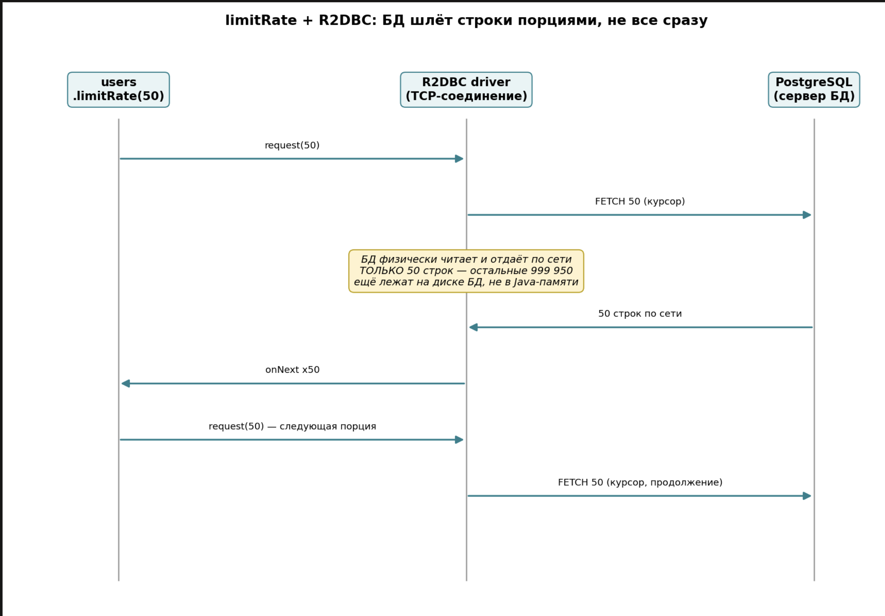
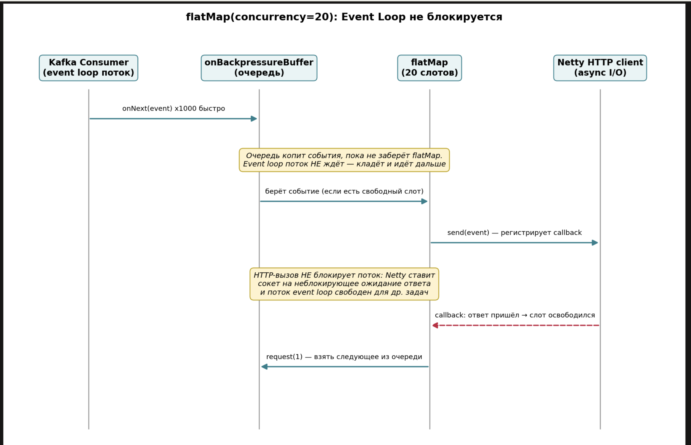
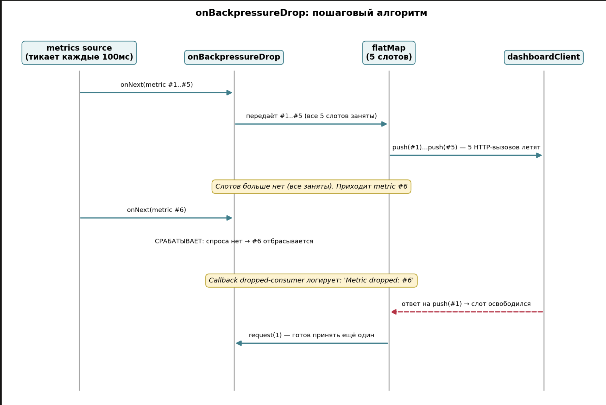
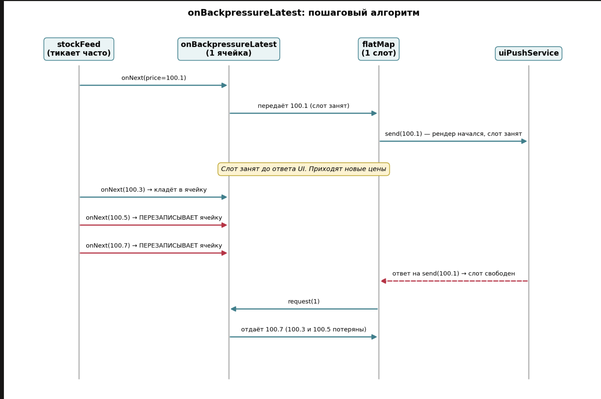
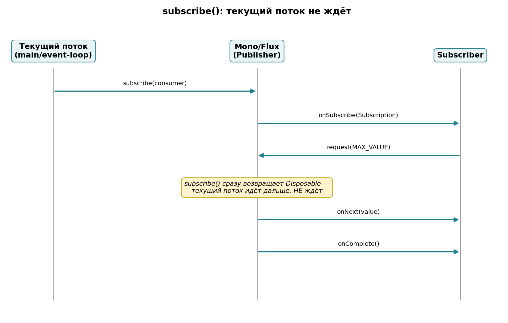
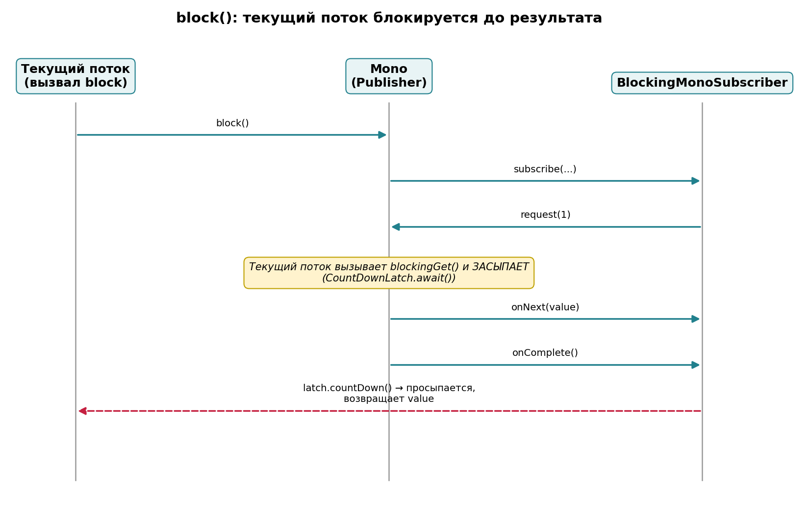
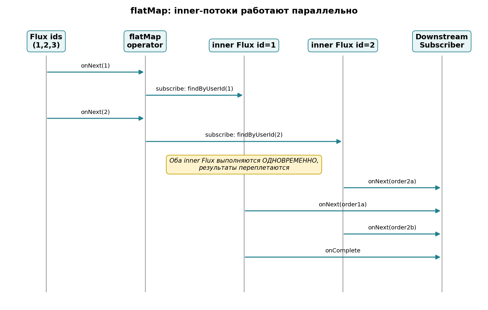
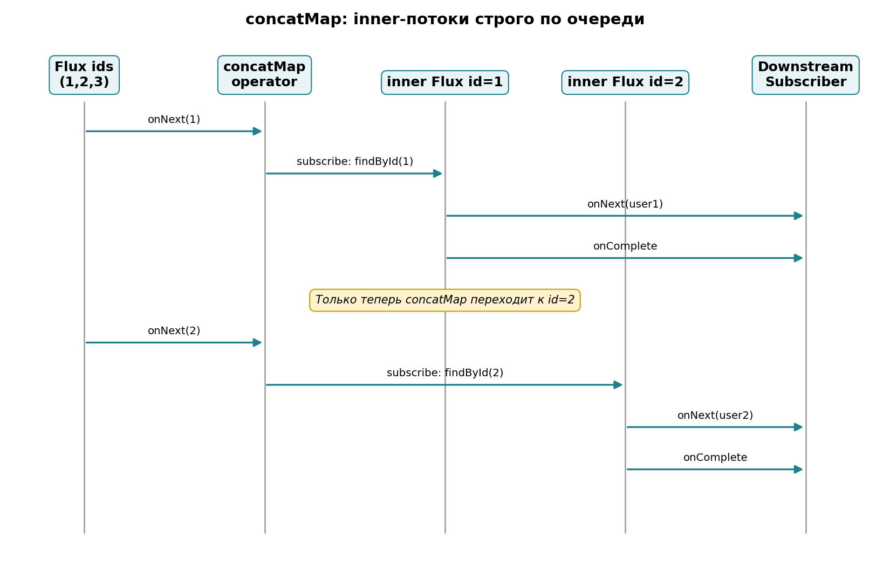
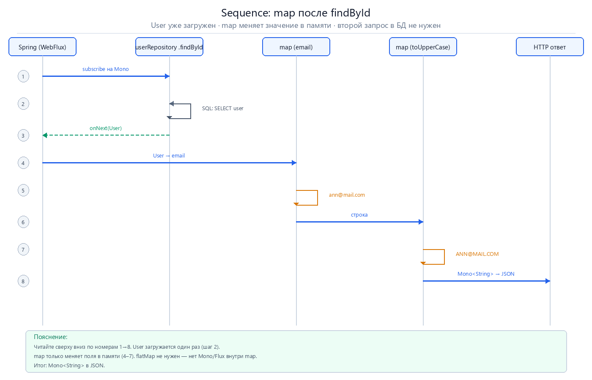
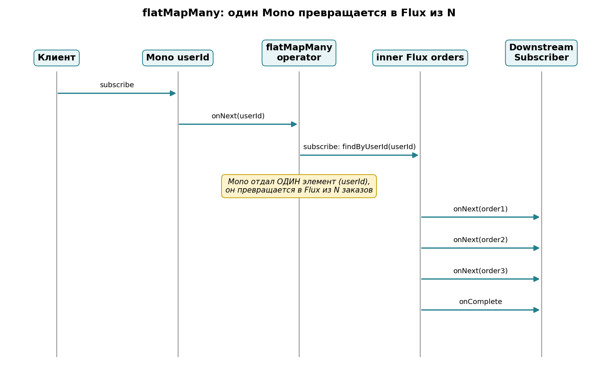

# Project Reactor: руководство и вопросы для собеседования

> Краткое руководство по **Project Reactor** для Java-разработчиков.  

---

## Оглавление

1. [Что такое Project Reactor](#1-что-такое-project-reactor)
2. [Что такое реактивное программирование](#2-что-такое-реактивное-программирование)
   - [2.1 Императивный и реактивный код — кто ждёт и где](#21-императивный-и-реактивный-код--кто-ждёт-и-где)
   - [Observer и Listener — отдельный документ](observer-vs-listener.md)
3. [Mono и Flux — в чём разница](#3-mono-и-flux--в-чём-разница)
4. [Backpressure (обратное давление)](#4-backpressure-обратное-давление)
5. [subscribe() и block() — в чём разница](#5-subscribe-и-block--в-чём-разница)
6. [map и flatMap — когда что использовать](#6-map-и-flatmap--когда-что-использовать)
7. [subscribeOn и publishOn](#7-subscribeon-и-publishon)
8. [Schedulers — какие бывают и зачем](#8-schedulers--какие-бывают-и-зачем)
9. [Cold и Hot publishers](#9-cold-и-hot-publishers)
10. [Обработка ошибок в Reactor](#10-обработка-ошибок-в-reactor)
11. [Retry — повтор при ошибке](#11-retry--повтор-при-ошибке)
12. [Как тестировать Reactor-код (StepVerifier)](#12-как-тестировать-reactor-код-stepverifier)
13. [Project Reactor и Spring WebFlux](#13-project-reactor-и-spring-webflux)
14. [Reactor vs RxJava — кратко](#14-reactor-vs-rxjava--кратко)
15. [Когда реактивный подход уместен, а когда нет](#15-когда-реактивный-подход-уместен-а-когда-нет)
16. [Disposable и отмена подписки](#16-disposable-и-отмена-подписки)
17. [Блокирующий код внутри реактивной цепочки](#17-блокирующий-код-внутри-реактивной-цепочки)
18. [Краткая шпаргалка по операторам](#18-краткая-шпаргалка-по-операторам)
19. [share() и cache() — cold → hot](#19-share-и-cache--cold--hot)
20. [flatMap, concatMap и switchMap](#20-flatmap-concatmap-и-switchmap)
21. [Отладка реактивной цепочки](#21-отладка-реактивной-цепочки)
22. [Context — MDC и traceId между потоками](#22-context--mdc-и-traceid-между-потоками)
23. [Сводка: 30 вопросов → разделы](#23-сводка-30-вопросов--разделы)

---

## Введение

**Project Reactor** — библиотека для реактивного (неблокирующего) программирования на JVM. 
 - Вместо «вызвал метод — ждёшь результат» вы описываете _**последовательность операций**_ над потоками данных; 
 - эти операции запускаются только когда кто‑то подпишется на поток.

**Аналогия**: не носите каждую деталь по цеху — а навешиваете операции на конвейер, который эту деталь обработает.

Типы:

- **Mono<T>** — один элемент или пусто (например, findById).
- **Flux<T>** — ноль или больше элементов (например, findAll, SSE).

Стиль кода (рекомендуется — «лесенка»):

```java
return userRepository.findById(id)
    .map(User::getEmail)
    .map(String::toUpperCase);
```

Ключевые моменты:

- Реализует спецификацию **Reactive Streams**: управление потоком (_**backpressure**_) встроено.
- Операции объявляются декларативно и выполняются при подписке.
- Не блокируйте реактивный поток (
   - то есть не используйте в коде .block(), Thread.sleep()...
  ).

```
- Если внутренняя операция возвращает Mono<T> или Flux<T>, используйте flatMap (или flatMapMany), чтобы продолжить цепочку без вложенных контейнеров. Пример:
```

```java
// userRepository.findById(id) -> Mono<User>
// emailService.sendConfirmation(email) -> Mono<Void>
        return userRepository
                .findById(id)
                .flatMap(
        user -> emailService.sendConfirmation(user.getEmail())
        .thenReturn(user)
                );
```

- Для переключения потоков используйте **publishOn**/_subscribeOn_ с **Schedulers**.
- Тестируйте цепочки через **reactor-test** (**StepVerifier**).

**Источник:** [Reactor 3 Reference Guide — Introduction](https://projectreactor.io/docs/core/release/reference/#intro-reactor)

> **EN:** «Reactor is a fully non-blocking reactive programming foundation for the JVM … implements the Reactive Streams specification.»

> **RU:** «Reactor — неблокирующая основа для реактивного программирования на JVM … реализует спецификацию Reactive Streams.»

---

## 1. Что такое Project Reactor

> **Аналогия из жизни:** 
>  - Reactor — это **конвейер на фабрике**. 
>   - Вы не таскаете каждую деталь руками до конца цеха, а **навешиваете на ленту** шаги: «прикрути → покрась → упакуй». 
>   - Лента сама движется, когда её **включают** (`subscribe()` или Spring в WebFlux).


**Ответ:**

**Project Reactor** — это Java‑библиотека для неблокирующего реактивного программирования на JVM. Она позволяет описывать последовательность операций над потоками данных; выполнение этих операций начинается только при подписке на поток (например, Spring автоматически подписывает возвращаемые Mono/Flux в WebFlux).

В ней используются специальные **Контейнеры-обертки**, для обрабатываемых данных:

**Mono**<T> и **Flux**<T> — это типы‑**обёртки** (публикаторы), в которых хранятся данные и список операторов; 
 
  - Они используются для представления и обработки асинхронных потоков: 
    - **Mono**<T> содержит 0 или 1 элемент,
    - **Flux**<T> — 0 и более элементов.
- Операторы (**map, flatMap, filter, concat, zip** и др.) добавляют преобразования, комбинирование и управление потоком данных.

**Ленивость и выполнение**
 - Операторы в реактивном стеке, собирают «конвейер» (assembly) — они описывают то, что нужно сделать; 
 - реальное выполнение начинается при подписке (subscription). 

 - Обычно подписку выполняет фреймворк (например, Spring WebFlux) или явный вызов **subscribe()**.

**Спецификация и управление потоком**

- Reactor реализует спецификацию **Reactive Streams**: 
  - есть контракт «подписчик ↔ источник» и встроенная поддержка **backpressure** (механизм управления скоростью передачи данных между производителем и потребителем).

**Короткие практические моменты**

- **Не блокируйте реактивный поток** (.block(), Thread.sleep()....).
- Для управления потоками используйте **subscribeOn** / **publishOn** и **Schedulers**.
- Тестирование — **reactor-test** и **StepVerifier**.

Документация и полезные чтения

https://projectreactor.io/docs/core/release/reference/\#intro-reactor

https://projectreactor.io/docs/core/release/api/reactor/core/publisher/Flux.html

https://spring.io/blog/2019/03/06/flight-of-the-flux-1-assembly-vs-subscription

---

## 2. Что такое реактивное программирование

> **Аналогия:** 
>  - Обычный код — **стоите у окна** и ждёте одно письмо. 
>  - Реактивный — **подписались на уведомления**: 
>    - пришло → обработали → ждёте следующее.

**Ответ:**

Вы не «вызвали метод и ждёте ответ», а **описали, что делать, когда придут данные**. 

В Reactor это сигналы: 
 - **`onNext`** (данные), 
 - **`onError`** (ошибка), 
 - **`onComplete`** (конец).

---

### 2.1 Императивный и реактивный код — кто ждёт и где

> **Аналогия (ж/д):** 
>   - **Императивно** — поезд с грузом **стоит на главном пути**, пока вагоны грузят 2 минуты; линия **занята**, остальные поезда **ждут в очереди**. 
>   - **Реактивно** — вагоны отправили на **отстойный путь** (ожидание данных), **локомотив** (поток event loop) **свободен** и везёт другие составы по главной; 
>     - когда груз готов — вагоны **прицепляют** и состав едет дальше (`onNext`).


#### Императивный код (Servlet, блокирующий JDBC)

1. На **каждый HTTP-запрос** сервер выделяет **поток** из пула (Tomcat: например, 200 потоков).
2. Внутри обработчика вызываете БД или другой сервис **синхронно** — поток **стоит и ждёт** ответ (1 секунда или 2 минуты — неважно).
3. Пока поток ждёт, он **занят**: им нельзя обслужить другой запрос.
4. Если пришло **101 запрос**, а **100 потоков** уже ждут БД — **101-й попадает в очередь** Tomcat и ждёт **свободный поток**.

Вот про какую **"очередь"** вы говорили в первом ответе — да, она есть, но это **очередь запросов на поток**, а не «умная пауза» внутри одного потока.

```java

// Упрощённо: поток ЗАНЯТ всё время
@GetMapping("/{id}")
public User getUser(@PathVariable Long id) {
    return jdbcTemplate.queryForObject(          // поток ждёт здесь
        "SELECT … WHERE id = ?", User.class, id);
}
```

#### Реактивный код (WebFlux, R2DBC, WebClient)

1. Мало потоков **event loop** (Netty) — часто **по числу ядер**, не по числу пользователей.
2. Контроллер **возвращает** `Mono<User>` — это **описание** шагов, не готовый ответ.
3. `findById` через R2DBC **отправляет** запрос в БД **без блокировки** потока: цепочка **приостановлена**, подписка ждёт **callback**.
4. Тот же поток за это время обрабатывает **другие** запросы.
5. Когда БД ответила — приходит **`onNext(User)`**, цепочка **продолжается** (map, JSON, ответ клиенту).

```java

@GetMapping("/{id}")
public Mono<User> getUser(@PathVariable Long id) {
    return userRepository.findById(id);   // поток НЕ ждёт ответ БД здесь
}
```

#### Про «очереди» в реактивном программировании — что правда, что нет

| Утверждение | Верно? |
|-------------|--------|
| «Запрос встаёт в очередь, поток помнит состояние и ждёт» (как в Servlet) | **Нет** — поток **освобождается**. Состояние цепочки хранит **Reactor** (подписка + операторы), не заблокированный thread. |
| «Есть очередь запросов, когда все потоки заняты» | **В императиве — да** (Tomcat). **В WebFlux** — другая модель: много соединений на **мало** потоков. |
| «В Reactor вообще нет очередей» | **Нет** — очереди **есть**, но другие: буферы операторов (`onBackpressureBuffer`), **backpressure** (`request(n)`), очередь задач у **`Schedulers.boundedElastic()`**. Это не очередь «100 потоков ждут БД». |

**Кратко:** в реактивном коде **не блокируют поток** ради ожидания I/O; **ждёт цепочка** (`Mono`/`Flux`), а поток крутит другие дела. Когда данные пришли — подписчик получает сигнал и обработка **продолжается**.

**Источник:** [Reactor Reference — Introduction](https://projectreactor.io/docs/core/release/reference/#intro-reactor) · [Spring WebFlux — Overview](https://docs.spring.io/spring-framework/reference/web/webflux.html)

> **EN:** «Reactor is a fully non-blocking reactive programming foundation for the JVM.» / «Spring WebFlux … non-blocking I/O … reactive streams.»

> **RU:** «Reactor — полностью неблокирующая основа для JVM.» / «WebFlux … неблокирующий I/O … реактивные потоки.»

**Подробнее:** отдельный документ [Реактивный код: где ждёт запрос и где хранится состояние](./state-reactive(EventLoop).md) — Event Loop, два запроса А/Б, **[§5 очередь `Queue<Runnable>` и callback]**

**Паттерны Observer и Listener:** отдельный документ [Observer и Listener: паттерны в Java и Spring](observer-vs-listener.md) — `Observable`/`Observer`, Spring Events, сравнение, Reactor.

---

## 3. Mono и Flux — в чём разница

> **Аналогия:** **`Mono`** и **`Flux`** — это **контейнеры** для данных. Контейнер **сам по себе пустой**, пока вы не **подпишетесь** (`subscribe`) или Spring не «откроет» его в WebFlux.


**Ответ:**

| | **Mono** | **Flux** |
|---|----------|----------|
| **Что это** | Контейнер на **один** элемент | Контейнер на **ноль и больше** элементов |
| **Внутри может быть** | один `User`, одна строка, ничего (пустой контейнер) | список `User`, много строк подряд, пусто |
| **Когда брать** | «вернётся **одна** вещь» | «вернётся **много** (или неизвестно сколько)» |

**Простыми словами:**

- **`Mono<User>`** — коробка, в которой лежит **максимум один** `User` (или коробка пустая).
- **`Flux<User>`** — коробка, в которой лежит **0, 1, 2, 3…** пользователей подряд.

**Как выбрать за 5 секунд:** спросите себя — «сколько результатов жду?» **Один** → `Mono`. **Несколько или поток** → `Flux`.

**Пример:**

```java

// одна запись из БД → Mono (контейнер на 1)
Mono<User> one = userRepository.findById(1L);

// все записи → Flux (контейнер на много)
Flux<User> many = userRepository.findAll();
```

**Важно:** контейнер **ленивый** — данные появятся только когда цепочку **запустят** (см. §5). В WebFlux это делает Spring, не вы.

**Вопрос:** *What is the difference between Mono and Flux in Project Reactor?*

**Источник:** [Reactor Core Features](https://projectreactor.io/docs/core/release/reference/coreFeatures.html)

> **EN:** «A Flux represents 0..N items, while a Mono represents a single-value-or-empty (0..1) result.»

> **RU:** «Flux — от нуля до многих элементов. Mono — один элемент или пусто.»

---

## 4. Backpressure (обратное давление)


## 4. Backpressure (обратное давление)

> **Аналогия:** Официант приносит **порциями по три** блюда — вы съели → просите ещё три. Не вываливает все 50 тарелок сразу.

**Ответ:**

1. Источник может отдавать данные **быстрее**, чем вы обрабатываете.
2. Подписчик через `Subscription.request(n)` говорит: «готов принять n штук».
3. Простой `subscribe()` внутри запрашивает «сколько угодно» (`Long.MAX_VALUE`). Для `Mono` — OK. Для миллионов строк `Flux` — риск памяти → нужны операторы ниже.

Официальное описание механизма:

> "A subscriber can work in *unbounded* mode and let the source push all the data at its fastest achievable rate or it can use the `request` mechanism to signal the source that it is ready to process at most `n` elements."

Перевод:

> «Подписчик может работать в *неограниченном* режиме, позволяя источнику слать данные с максимальной скоростью, либо использовать механизм `request`, чтобы сообщить источнику, что готов обработать не более `n` элементов.»

Источник: https://projectreactor.io/docs/core/3.6.3/reference

***

### Где физически лежат данные — очередь vs пул потоков

Это два **разных объекта**, их нельзя путать:

**Очередь (buffer/queue)** — обычная структура данных в памяти JVM (массив или связный список), находится **внутри конкретного оператора**. Она хранит элементы, которые уже пришли от источника, но ещё не обработаны подписчиком. Кода она не выполняет.

**Scheduler (пул потоков)** — набор потоков ОС, которые **выполняют** код операторов (`map`, `flatMap` и т.д.). Он ничего не хранит.

> "Some operators also implement **prefetching** strategies, which avoid `request(1)` round-trips."

Перевод:

> «Некоторые операторы также реализуют стратегии **prefetching** (предварительной загрузки), которые позволяют избежать множества round-trip вызовов `request(1)`.»

Источник: https://projectreactor.io/docs/core/3.6.3/reference

**Проще**:
элемент сначала кладётся в **очередь** оператора → затем берётся оттуда и **обрабатывается** в потоке, который выделил Scheduler. Очередь — «склад», Scheduler — «рабочие руки». Разные задачи.

***

### `limitRate` — просить порциями

**Исходник** (`Flux.java`):

```java
/**
 * Ensure that backpressure signals from downstream subscribers are capped
 * at the provided prefetchRate.
 * (Гарантирует, что сигналы backpressure от подписчика ограничены
 * значением prefetchRate — то есть подписчик не может запросить
 * больше элементов за раз, чем указано)
 */
public final Flux<T> limitRate(int prefetchRate) {
    return onAssembly(this.publishOn(Schedulers.immediate(), prefetchRate));
}
```

**Пояснение:** downstream не сможет запросить больше `prefetchRate` элементов за раз — источник отдаёт **порциями**. Важно: оператор **ничего не буферизует сам по себе** — он просто регулирует размер `request`.

**Реальный пример** (рассылка приветственных писем новым пользователям из БД через R2DBC):

```java
Flux<User> newUsers = userRepository.findByOnboardingStatus("PENDING");

newUsers
    .limitRate(50)                                        // читаем из БД пачками по 50
    .flatMap(user -> emailService.sendWelcomeEmail(user))  // асинхронный вызов, Mono<Void>
    .subscribe(
        v -> {},
        error -> log.error("Email send failed", error)
    );
```

**Как это работает по шагам** (диаграмма ниже):

1. `limitRate(50)` вызывает `request(50)` у R2DBC-драйвера.
2. Драйвер открывает **курсор** на стороне PostgreSQL и делает `FETCH 50` — просит у сервера БД именно 50 строк.
3. PostgreSQL читает 50 строк с диска и шлёт их по сети драйверу.
4. Драйвер конвертирует их в Java-объекты и вызывает `onNext` 50 раз.
5. Как только эти 50 обработаны, `flatMap` сигнализирует о готовности, `limitRate` снова шлёт `request(50)`.



Важно: **остальные 999 950 строк всё это время физически лежат на диске сервера БД**, а не в памяти Java-приложения. Java-очереди на миллион элементов не существует — в этом смысл backpressure на уровне протокола.

> "R2DBC is fully reactive and backpressure-aware all the way down to the database wire protocol."

Перевод:
> «R2DBC полностью реактивен и учитывает backpressure вплоть до самого протокола общения с базой данных.»

Источник: https://r2dbc.github.io

***

### `onBackpressureBuffer` — склад для лишнего

**Исходник** (`Flux.java`):

```java
/**
 * Request an unbounded demand and push to the returned Flux, or park elements
 * when not enough demand is requested downstream.
 * (Запрашивает у источника неограниченное количество элементов и передаёт их
 * дальше; если подписчик не успевает — временно "паркует" (складывает)
 * элементы в буфер)
 */
public final Flux<T> onBackpressureBuffer() {
    return onAssembly(new FluxOnBackpressureBuffer<>(this,
        Queues.SMALL_BUFFER_SIZE, true, null));
}

public final Flux<T> onBackpressureBuffer(int maxSize) {
    return onAssembly(new FluxOnBackpressureBuffer<>(this, maxSize, false, null));
}
```

**Пояснение:**

- если потребитель отстаёт — элементы **складываются в буфер** (ограниченный `maxSize` или нет).
- **Буфер** — это конкретная структура данных: **очередь** фиксированного или неограниченного размера (внутри Reactor используются реализации вроде `SpscLinkedArrayQueue`), физически хранящая объекты в памяти JVM, пока подписчик их не заберёт.

**Реальный пример** (события заказов из Kafka, обработка — HTTP-вызов в аналитический сервис):

```java
Flux<OrderEvent> kafkaEvents = kafkaReceiver.receive()
    .map(record -> record.value());

kafkaEvents
    .onBackpressureBuffer(10_000)                        // очередь на 10 000 событий в памяти
    .flatMap(event -> analyticsClient.send(event), 20)    // не более 20 параллельных HTTP-вызовов
    .subscribe(
        v -> {},
        error -> log.error("Analytics send failed", error)
    );
```

**Как это работает по шагам, и почему event loop не блокируется:**

1. Kafka Consumer быстро шлёт события через `onNext`.
2. `onBackpressureBuffer(10_000)` — события **складываются в очередь в памяти**, если `flatMap` ещё не готов их забрать. Поток **Kafka Consumer** не ждёт — кладёт элемент и продолжает читать дальше.
3. `flatMap(mapper, 20)` держит **20 "слотов"**. Он берёт из очереди по одному событию на каждый свободный слот и вызывает `analyticsClient.send(event)`.
4. Каждый `send()` — асинхронный HTTP-вызов через Netty. Сокет регистрируется в неблокирующем I/O ОС (epoll/kqueue), и поток event loop **немедленно освобождается** для других задач — никакой блокировки нет.
5. Когда ответ приходит по сети, ОС уведомляет event loop через callback.
6. Слот в `flatMap` освобождается → вызывается `request(1)` у очереди → берётся следующее событие.



> "The concurrency argument controls how many inner publishers can be subscribed to and merged in parallel."

Перевод:
> «Аргумент concurrency определяет, сколько внутренних Publisher'ов может быть подписано и объединено параллельно.»

Источник: https://eherrera.net/project-reactor-course/03-working-with-map-and-flatmap/flatmap.html

**Риск:** если поток событий стабильно быстрее обработки → очередь на 10 000 переполнится и Reactor выбросит `OverflowException`.

***

## Чем подтверждается механизм "слотов"

В исходном коде reactor-core, в классе `FluxFlatMap` (внутренний класс `FlatMapMain`), параметр `maxConcurrency` используется буквально:
- при подписке у источника сразу запрашивается ровно столько элементов, сколько указано в `concurrency` (через вызов вида `s.request(Operators.unboundedOrPrefetch(maxConcurrency))`), а для каждого полученного элемента создаётся объект-подписчик `FlatMapInner`, который добавляется в служебный массив-трекер.

Источник: https://github.com/reactor/reactor-core/blob/main/reactor-core/src/main/java/reactor/core/publisher/FluxFlatMap.java

- Когда один из внутренних **Publisher**'ов завершается, у главного источника запрашивается ещё один элемент, освобождая место для следующего — именно этот механизм и создаёт эффект "фиксированного числа слотов".

Официальная трактовка этого параметра дана в учебном курсе по Project Reactor:

> "The concurrency argument controls how many inner publishers can be subscribed to and merged in parallel."

Перевод:

> "Аргумент concurrency определяет, сколько внутренних Publisher'ов может быть подписано и объединено параллельно."

Источник: https://eherrera.net/project-reactor-course/03-working-with-map-and-flatmap/flatmap.html

## Что такое "слот" физически

- "**Слот**" — это не поток и не объект операционной системы, а просто ячейка в массиве Java-объектов внутри трекера flatMap, каждая из которых хранит ссылку на активную подписку (Subscription) на один внутренний Publisher — в вашем примере это подписка на результат `analyticsClient.send(event)`.
- Когда подписка завершается, ячейка освобождается, и **upstream** получает запрос на следующий элемент из очереди `onBackpressureBuffer`.

Источник: https://github.com/reactor/reactor-core/blob/main/reactor-core/src/main/java/reactor/core/publisher/FluxFlatMap.java

## Откуда цифра "20" в вашем примере

- Число 20 в `flatMap(mapper, 20)` — это буквально значение параметра `concurrency`, которое сохраняется в поле `maxConcurrency` и используется именно как лимит запроса у источника, описанный выше.
- Статья Baeldung подтверждает ту же семантику на уровне API:
    - **flatMap** асинхронно трансформирует элементы, а версия с указанием **concurrency** ограничивает число одновременно обрабатываемых внутренних Publisher'ов.

Источник: https://www.baeldung.com/java-reactor-map-flatmap

## А как же "параллельно", если это один event loop

- Слово "параллельно" в реактивном контексте означает не одновременное выполнение кода на CPU, а число одновременно "в процессе" (in-flight) асинхронных операций. Поток **event loop** физически один — каждый Netty event loop это один поток, выполняющий код строго последовательно.

Источник: https://cosysoft.org/blog/4345jbi341-spring-webflux-na-realnih-proektah-chto

- Когда вызывается `analyticsClient.send(event)`, Netty регистрирует **TCP-сокет** в неблокирующем I/O операционной системы (epoll/kqueue) и не ждёт ответа — вызов возвращается почти мгновенно, а поток идёт выполнять следующую задачу.
- "20 параллельных вызовов" значит, что до 20 таких сокетов могут одновременно находиться в состоянии "запрос отправлен, ответ ещё не пришёл" — именно эти операции физически идут параллельно на уровне сети и ядра ОС, а не на уровне вашего Java-потока.

- Дополнительно про параметр **prefetch** в связке с flatMap и распределением задач по "рельсам" разбирается в статье на Habr:

Источник: https://habr.com/ru/companies/gazprombank/articles/562482/

Поэтому корректная формулировка звучит так:
- до **20 асинхронных операций** могут **одновременно** быть в состоянии ожидания результата, и как только у любой из них ОС сигнализирует о готовности данных, единственный поток **event loop** быстро обрабатывает этот результат и, если освободился слот, запрашивает следующий элемент из буфера.


***

### `onBackpressureDrop` — лишнее выбросить

**Исходник** (`Flux.java`):

```java
/**
 * Drop observed elements if not enough demand is requested downstream.
 * (Отбрасывает наблюдаемые элементы, если подписчик не запросил
 * достаточное количество — то есть спроса не хватает)
 */
public final Flux<T> onBackpressureDrop() {
    return onAssembly(new FluxOnBackpressureDrop<>(this));
}
```

**Пояснение:** нет спроса (`request`) → элемент **отбрасывается**, очередь при этом вообще не создаётся (в отличие от `onBackpressureBuffer`). Актуально, когда важнее **последнее/текущее** значение, а не все подряд.

**Реальный пример** (метрики CPU/памяти сервиса, отправляемые в дашборд):

```java
Flux<SystemMetric> metrics = metricsCollector.stream(); // тикает каждые 100 мс

metrics
    .onBackpressureDrop(dropped -> log.warn("Metric dropped: {}", dropped))
    .flatMap(metric -> dashboardClient.push(metric), 5)  // максимум 5 параллельных отправок
    .subscribe();
```

**Пошаговый алгоритм — когда именно срабатывает drop:**

1. `metrics` тикает каждые 100 мс, приходят метрики №1 – №5.
2. `flatMap(mapper, 5)` — 5 слотов, все заняты: `push(#1)`...`push(#5)` улетели асинхронно.
3. Приходит метрика **№6**. `flatMap` физически не может её взять — слотов нет, `request` для нового элемента не приходил.
4. Именно в этот момент срабатывает `onBackpressureDrop`: он видит, что спроса нет → **выбрасывает метрику №6**.
5. Передан `Consumer` (`dropped -> log.warn(...)`) — он вызывается с выброшенным элементом → лог `"Metric dropped: 6"`.
6. Когда ответ на `push(#1)` приходит, слот освобождается, `flatMap` шлёт `request(1)` — следующая метрика примется нормально.



> "onBackpressureDrop(Consumer): Drops any items produced above what was requested and calls the given Consumer for each dropped item."

Перевод:

> «**onBackpressureDrop** с **Consumer**: отбрасывает любые элементы, произведённые сверх запрошенного количества, и вызывает переданный **Consumer** для каждого отброшенного элемента.»

Источник: http://www.adamldavis.com/blog/2020/03.html

***

### `onBackpressureLatest` — только последнее

**Исходник** (`Flux.java`):

```java
/**
 * Keep only the most recent observed item if not enough demand downstream.
 * (Сохраняет только самый последний наблюдаемый элемент, если подписчик
 * не успевает его забрать)
 */
public final Flux<T> onBackpressureLatest() {
    return onAssembly(new FluxOnBackpressureLatest<>(this));
}
```

**Пояснение:**
- пока подписчик занят, источник **перезаписывает** значение — вы получите **самое свежее**. В отличие от **буфера**, здесь хранится не очередь, а буквально **одна ячейка памяти**.

**Реальный пример** (котировки акций для UI, где важна только последняя цена):

```java

Flux<StockPrice> priceStream = stockFeed.subscribe("AAPL"); // тикает часто

priceStream
    .onBackpressureLatest()
    .flatMap(price -> uiPushService.send(price), 1) // UI обновляется строго по одному
    .subscribe();
```

**Пошаговый алгоритм — что и когда перезаписывается:**

1. Приходит цена **100.1**.
- `flatMap(mapper, 1)` — 1 слот, занимает его:
    - `send(100.1)` начал выполняться (например, рендер через **WebSocket**, ещё не завершился).
2. Приходит цена **100.3** — `onBackpressureLatest` кладёт её в свою **единственную ячейку**.
3. Приходит цена **100.5** — **перезаписывает** ячейку поверх **100.3**. Цена **100.3** потеряна.
4. Приходит цена **100.7** — снова перезаписывает ячейку.
5. Когда `send(100.1)` завершается, слот освобождается, вызывается `request(1)`.
6. `onBackpressureLatest` отдаёт то, что сейчас в ячейке — **100.7**.
- Значения **100.3** и **100.5** никогда не отправятся в **UI**.


> "**onBackpressureLatest** ensures that if the subscriber can't keep up, it will only get the most recent value emitted by the producer, discarding any previous values that have not been processed yet."

Перевод:
> «**onBackpressureLatest** гарантирует, что если **подписчик** не успевает, он получит только **самое последнее** значение от источника, **отбросив** все предыдущие **необработанные значения**.»

Источник: https://blog.devops.dev/managing-back-pressure-in-reactive-streams-c64f91a10adf

***

### `subscribe()` и unbounded request

**Исходник** (`Mono.java`):

```java
/**
 * Subscribe a Consumer to this Mono that can terminate either successfully
 * or with an error. It will request an unbounded demand (Long.MAX_VALUE).
 * (Подписывает Consumer на этот Mono, который завершится либо успехом,
 * либо ошибкой. При этом запрашивается неограниченный спрос —
 * Long.MAX_VALUE)
 */
public final Disposable subscribe(Consumer<? super T> consumer) {
    return subscribe(consumer, null, null);
}
```

**Пояснение:** «**unbounded**» означает, что **подписчик** сразу говорит **источнику** «отдай всё, что можешь». Для одного элемента (`Mono.just("a")`) это безопасно — источник физически не может прислать больше одного значения. Для миллионов строк `Flux` это риск, если **downstream** не успевает
- поэтому лучше применять операторы описанные выше.

***

### Когда что использовать

| Оператор | Что делает с "лишними" элементами               | Где хранятся данные                                                                | Когда использовать                                                                                                                                   |
| :-- |:------------------------------------------------|:-----------------------------------------------------------------------------------|:-----------------------------------------------------------------------------------------------------------------------------------------------------|
| `limitRate` | Ничего не хранит, уменьшает размер `request`    | Нигде не храниться, а только регулирует спрос на источник                          | Источником данных является — БД/API, важно не перегрузить его запросом                                                                               |
| `onBackpressureBuffer` | Складывает в очередь                            | В памяти JVM, реальная очередь ограниченного размера                               | Используется, когда **нельзя терять** данные (Kafka, события заказов)                                                                                |
| `onBackpressureDrop` | Выбрасывает                                     | Нигде не хранит промежуточные данные, очередь не создаётся                         | Используется, когда потеря данных не критична (метрики, телеметрия)                                                                                  |
| `onBackpressureLatest` | Перезаписывает старое значение, новым значением | Данные храняться (перезаписываются) в одной переменной (ячейка памяти), не очередь | Используется, когда в нужный момент времени (когда данные потребляются подписчиком), поэтому используется самая свежая версия данных (котировки, UI) |

**Вопрос:** *What is backpressure? When do you use limitRate vs onBackpressureBuffer vs drop?*

**Источник:** https://projectreactor.io/docs/core/release/reference/\#backpressure

> **EN:** «Consumer pressure is propagated back to the source by sending a request to the upstream operator.»

Перевод:
- «Потребитель через request сообщает источнику, сколько элементов готов принять.»


---

## 5. subscribe() и block() — в чём разница

Разница между `subscribe()` и `block()` в том, кто именно ждёт результат и что происходит с текущим потоком.

- `subscribe()` — запускает выполнение цепочки и возвращается сразу, текущий поток не ждёт конца обработки.
- `block()` — подписывается и блокирует именно тот поток, из которого вызван метод, пока не будет результат или завершение.

***

## Как работает subscribe()

**Исходник** (`Mono.java` / `Flux.java`, упрощённо):

```java
/**
 * Subscribe a Consumer to this Mono …
 * It will request an unbounded demand (Long.MAX_VALUE).
 * (Подписывает Consumer к этому Mono и запрашивает неограниченное
 * количество элементов — Long.MAX_VALUE)
 */
public final Disposable subscribe(Consumer<? super T> consumer) { … }
```



Пошагово:

1. Ты вызываешь `mono.subscribe(...)` из какого-то конкретного потока — например, `main` в обычном приложении, поток Netty event-loop в WebFlux, или поток из `Schedulers.boundedElastic()`.
2. Reactor собирает `Subscriber` и вызывает `Publisher.subscribe(subscriber)`.
3. Дальше всё зависит от операторов: если ты не использовал `subscribeOn/publishOn` и нет операторов, переключающих потоки (например, `delayElements`), вся цепочка выполняется в том же потоке, из которого вызван `subscribe()`. Если есть `publishOn/subscribeOn`, часть работы уйдёт в потоки соответствующего Scheduler.

Официальное подтверждение переключения потоков через **Scheduler**:

**En:**
> "In this post, we explore the threading model, how some (most) operators are concurrent agnostic, the Scheduler abstraction and how to hop from one thread to another."

**Ru:**
> «В этой статье мы разбираем **модель работы** с потоками, то, как большинство операторов не зависят от конкретного потока, абстракцию **Scheduler** и то, как переключаться с одного потока на другой.»

Источник: https://spring.io/blog/2019/12/13/flight-of-the-flux-3-hopping-threads-and-schedulers

Ключ:

- сам факт вызова `subscribe()` не обязан блокировать поток, но операции внутри цепочки могут быть синхронными и выполняться в том же потоке, если ты не переключил их на Scheduler.

***

## Как работает block()

**Исходник** (`Mono.java`):

```java
/**
 * Subscribe to this Mono and block indefinitely until a next signal is
 * received. Will return that value, or null if the Mono completes empty.
 * (Подписывается на этот Mono и блокирует выполнение неограниченно
 * долго, пока не придёт следующий сигнал. Вернёт значение, либо null,
 * если Mono завершился пустым)
 */
public @Nullable T block() {
    BlockingMonoSubscriber<T> subscriber = new BlockingMonoSubscriber<>(context);
    subscribe((Subscriber<T>) subscriber); // здесь создаётся подписка
    return subscriber.blockingGet();       // здесь текущий поток ждёт
}
```



Источник: https://eherrera.net/project-reactor-course/08-working-with-blocking-calls/back-to-synchronous-types.html

> "block subscribes to the Mono and blocks indefinitely until the element is received, returning that element."

**Ru**:

> «**block** подписывается на Mono и **блокирует** выполнение неограниченно, пока не получит элемент, возвращая этот элемент.»

Что важно пояснить явно:

- «Текущий поток» — это ровно тот поток, из которого ты вызвал `block()`.
    - Если это `main` — блокируется `main`.
    - Если это Netty event-loop (WebFlux) — ты блокируешь **event-loop**, и делать так нельзя.
- Внутри метода: сначала вызывается обычный `subscribe(...)`, создаётся специальный `BlockingMonoSubscriber`, он ставит блокировку (через `CountDownLatch`) и ждёт сигналов `onNext`/`onComplete`/`onError`.

То есть `block()` — это **синхронный мост** из реактивного мира в обычный, и этот **мост** держит поток до результата.

***

## Где какой поток «живёт»

Чтобы не было догадок, называем вещи своими именами:

- «Текущий поток» — тот поток, где написано `subscribe()` или `block()` в твоём коде.
- **EventLoop** (Netty, WebFlux) — поток(и), обслуживающие чтение/запись сокетов, обработку HTTP-запросов и ответов.
- **Scheduler-потоки**:
    - `Schedulers.boundedElastic()` — пул для блокирующих задач (БД, файловая система и т.д.),
    - `Schedulers.parallel()` — CPU-bound задачи.

Источник (модель потоков Reactor): https://spring.io/blog/2019/12/13/flight-of-the-flux-3-hopping-threads-and-schedulers

Рекомендации:

- `block()` допустим в `main()` при запуске приложения, в миграциях, в тестах.
- `block()` нельзя в контроллерах WebFlux, в обработчиках на Netty event-loop, в реактивных цепочках, которые должны оставаться неблокирующими.

***

## Что такое Disposable

**Исходник:**

```java
/**
 * Subscribe a Consumer to this Mono …
 * Returns a Disposable that allows disposing the subscription.
 * (Подписывает Consumer к этому Mono. Возвращает Disposable,
 * с помощью которого можно отменить подписку)
 */
public final Disposable subscribe(Consumer<? super T> consumer);
```

Источник: https://www.maoudia.com/blog/reactor-disposable-management/

> "Reactor Disposable provides a mechanism for managing resources, subscriptions, or actions in a reactive application."

**Ru**:

«**Disposable** в Reactor предоставляет механизм управления ресурсами, подписками или действиями в реактивном приложении.»

Проще:
- `Disposable` — это ручка, с помощью которой ты можешь **отменить подписку** (`dispose()`) и **освободить** связанные ресурсы (соединения, таймеры и т.д.).

**Пример:**

```java
Disposable subscription = flux
    .flatMap(service::process)
    .subscribe();

// позже, например при остановке сервиса:
subscription.dispose(); // отменить выполнение цепочки
```
***

## Publisher, Mono, Flux

Правильная формулировка:

- `Publisher<T>` — это интерфейс из спецификации Reactive Streams.

Источник: https://javadoc.io/doc/org.reactivestreams/reactive-streams/latest/org/reactivestreams/Subscriber.html


- `Mono<T>` и `Flux<T>` — конкретные реализации `Publisher` от Project Reactor:
    - `Mono<T>` испускает максимум 1 элемент,
    - `Flux<T>` — от 0 до N элементов.


Источник: https://projectreactor.io/docs/core/release/reference/coreFeatures/simple-ways-to-create-a-flux-or-mono-and-subscribe-to-it.html

То есть `Mono`/`Flux` — виды `Publisher`, а не «равно Publisher».

***

## 6. map и flatMap — когда что использовать

> **Аналогия из жизни:** На конвейере лежит **яблоко** (`User`).
> - **`map`** — вы **снимаете кожуру** на месте: яблоко → очищенное яблоко → дольки. Объект уже в руках.
> - **`flatMap`** — вам дали **закрытую коробку с наклейкой «внутри яблоко»** (`Mono<User>`). **`map`** положит **саму коробку** на ленту. **`flatMap`** **откроет** коробку и положит **яблоко**.


**Ответ:** смотрите **сигнатуру** — что возвращает лямбда: **обычный объект** → `map`, **`Mono`/`Flux`** → `flatMap`.

---

### `Mono.map` — исходник

```java

// Mono.java
/**
 * Transform the item emitted by this Mono by applying a synchronous function to it.
 */
public final <R> Mono<R> map(Function<? super T, ? extends R> mapper) {
    return onAssembly(new MonoMap<>(this, mapper));
}
```

**Пояснение:** `mapper` получает **готовый `T`** (User) и возвращает **`R`** (String). Внутри — класс `MonoMap`, синхронный вызов `mapper.apply(t)`.

**Пример:**

```java

Mono.just(new User(1L, "ann@example.com"))
    .map(User::email)              // User → String
    .map(String::toUpperCase);     // String → String
// Mono<String> "ANN@EXAMPLE.COM"
```

---

### `Flux.map` — исходник

```java

// Flux.java
/**
 * Transform the items emitted by this Flux by applying a synchronous function to each item.
 */
public final <R> Flux<R> map(Function<? super T, ? extends R> mapper) {
    return onAssembly(new FluxMap<>(this, mapper));
}
```

**Пояснение:** то же, что `Mono.map`, но для **каждого** элемента потока.

**Пример:**

```java

Flux.just("a", "b", "c")
    .map(String::toUpperCase)
    .collectList()
    .block();   // [A, B, C]
```

---

### `Flux.flatMap` — исходник

```java

// Flux.java
/**
 * Transform elements into Publishers, then flatten through merging (interleaved).
 * (Преобразовывает элементы в Publishers, затем выравнивают (flatten) их путем слияния (чередования).)
 */
public final <R> Flux<R> flatMap(
        Function<? super T, ? extends Publisher<? extends R>> mapper) {
    return flatMap(mapper, Queues.SMALL_BUFFER_SIZE, Queues.XS_BUFFER_SIZE);
}

public final <R> Flux<R> flatMap(
        Function<? super T, ? extends Publisher<? extends R>> mapper,
        int concurrency, int prefetch) {
    return flatMap(mapper, false, concurrency, prefetch);
}
```

**Пояснение:** 
  - В исходном коде видно, что тип `Publisher` может принять контейнер как `Mono`, так и `Flux`. 
  - Inner-потоки **могут идти параллельно** и **переплетаться** (`FluxFlatMap`).

**Пример:**

```java

Flux.just(1L, 2L)
    .flatMap(id -> userRepository.findById(id))   // id → Mono<User>
    .map(UserResponse::from);
// Flux<UserResponse>
```


**Пояснение:** 
 - лямбда возвращает **`Mono<R>`** — Reactor **подписывается** на **inner-Mono** и «разворачивает» результат (`MonoFlatMap`), 
  - то есть распаковывается результат из контейнера Mono.

**Пример:**

```java

Mono.just(1L)
    .flatMap(id -> userRepository.findById(id))  // Long → Mono<User>
    .map(User::email);
// Mono<String>
```

## flatMap — inner-потоки и их «переплетение»

 - Когда используется `flatMap`, каждый элемент исходного потока превращается во **внутренний Publisher** (inner publisher) — то есть в новый поток данных, порождённый функцией-преобразователем для конкретного элемента.

**Пример** (реальная задача — получить заказы нескольких активных пользователей):

```java
Flux<UserId> userIds = userService.activeUserIds();

Flux<Order> orders = userIds
    .flatMap(id -> orderRepository.findByUserId(id)); // каждый вызов возвращает Flux<Order>
```

Здесь `userIds` — внешний `Flux`,
- а каждый вызов `orderRepository.findByUserId(id)` — это **inner** _Flux_, порождённый для конкретного `id`.

Источник: https://stackoverflow.com/questions/64072896/how-does-backpressure-work-in-flatmap-operator-of-project-reactor

Официальная механика:
- `flatMap` может подписываться сразу на несколько **inner Publisher** и **обрабатывать** их **одновременно** (параллельно, в терминах _**порядка прихода данных**_), количество одновременных inner-подписок ограничивается параметром `concurrency`.
    - Поэтому элементы разных внутренних потоков могут «переплетаться» в итоговом Flux:
        - сначала часть заказов пользователя 1,
        - затем пользователя 2,
        - затем снова пользователя 1 и так далее — **порядок** исходных id **не сохраняется**.**


***

## flatMap — inner-потоки и их «переплетение»

 Когда используется `flatMap`, каждый элемент исходного потока превращается во **внутренний Publisher** (inner publisher) — то есть в новый поток данных, порождённый **функцией-преобразователем** для конкретного элемента.

**Пример** (реальная задача — получить заказы нескольких активных пользователей):

```java
Flux<UserId> userIds = userService.activeUserIds();

Flux<Order> orders = userIds
    .flatMap(id -> orderRepository.findByUserId(id)); // каждый вызов возвращает Flux<Order>
```

Здесь `userIds` — внешний `Flux`,

- а каждый вызов `orderRepository.findByUserId(id)` — это **inner** _Flux_, порождённый для конкретного `id`.

Источник: [https://stackoverflow.com/questions/64072896/how-does-backpressure-work-in-flatmap-operator-of-project-reactor](https://stackoverflow.com/questions/64072896/how-does-backpressure-work-in-flatmap-operator-of-project-reactor)

Официальная механика:

- `flatMap` может подписываться сразу на несколько **inner Publisher** и **обрабатывать** их **одновременно** (параллельно, в терминах _**порядка прихода данных**_), количество одновременных **inner-подписок** ограничивается параметром `concurrency`.
    - Поэтому элементы разных внутренних потоков могут «переплетаться» в итоговом Flux:
        - сначала часть заказов пользователя 1,
        - затем пользователя 2,
        - затем снова пользователя 1 и так далее — **порядок** исходных id **не сохраняется**.


```java

Flux<SystemMetric> metrics = metricsCollector.stream(); // тикает каждые 100 мс

metrics
    .onBackpressureDrop(dropped -> log.warn("Metric dropped: {}", dropped))
    .flatMap(metric -> dashboardClient.push(metric), 5)  // максимум 5 параллельных отправок
    .subscribe();
```

 
 - Второй параметр `flatMap(mapper, N)` задаёт именно максимальное число одновременно открытых **inner-подписок** (в вашем HTTP-примере это соответствует N ожидающим сокетам/callback'ам). 
   - Если это число не указывать явно, **_Reactor_** всё равно ограничивает параллелизм — но значением по умолчанию, а не "бесконечностью".

## Что происходит, если concurrency не указан

Если вызвать `flatMap(mapper)` без второго аргумента, то внутри **reactor-core** этот вызов явно делегируется в перегруженный метод с параметрами по умолчанию:

```java
public final <R> Flux<R> flatMap(Function<? super T, ? extends Publisher<? extends R>> mapper) {
    return flatMap(mapper, Queues.SMALL_BUFFER_SIZE, Queues.XS_BUFFER_SIZE);
}
```

Источник: https://github.com/reactor/reactor-core/blob/main/reactor-core/src/main/java/reactor/core/publisher/FluxFlatMap.java

То есть `concurrency` по умолчанию равен константе `Queues.SMALL_BUFFER_SIZE`, а `prefetch` — константе `Queues.XS_BUFFER_SIZE`. Их значения зафиксированы в классе `Queues`:

- `Queues.SMALL_BUFFER_SIZE` = 256 — это и есть дефолтный лимит одновременных inner-подписок.
- `Queues.XS_BUFFER_SIZE` = 32 — это дефолтный prefetch (сколько элементов запрашивается у каждого inner-Publisher заранее).

Тот же принцип подтверждает автор курса по Project Reactor, разбирая параметр concurrency:

> "The concurrency argument controls how many inner publishers can be subscribed to and merged in parallel. For example, with a Flux of four elements, a concurrency of 2 means that flatMap subscribes to the first two inner publishers immediately."

 **Ru**:
> "Аргумент **concurrency** определяет, сколько внутренних publisher'ов может быть подписано и объединено параллельно. Например, для Flux из четырёх элементов concurrency равное 2 означает, что flatMap немедленно подписывается на первые два внутренних publisher'а."

Источник: https://eherrera.net/project-reactor-course/03-working-with-map-and-flatmap/flatmap.html

 - Так что без явного указания вы получаете **не безлимитное** количество **открытых сокетов**, 
   - а до 256 одновременных inner-подписок — и это тоже считается "**параллельной регистрацией**" в том же смысле, что и explicit `concurrency`: до 256 callback'ов могут одновременно висеть в ожидании ответа от ОС.

## Важный нюанс — это не автоматическая многопоточность

Отдельный **важный момент**, который стоит уточнить: 
  - сам параметр **concurrency** (в том числе дефолтные **256**) **не создаёт** _потоки_ и не гарантирует выполнение на разных ядрах CPU. 
  - Он лишь **ограничивает** число открытых **Subscription** — то есть, регистрируемых callback'ов. 
  - Разработчики на StackOverflow отдельно подчёркивают эту путаницу:

      > "Flatmap does not exhibit any concurrency out-of-the-box. You have to switch schedulers if you want concurrency... The concurrency argument allows to control how many Publisher can be subscribed to and merged in parallel."

  **Ru**:
   > "**Flatmap** _не даёт_ **параллелизм** "из коробки". 
   > Если вам нужен параллелизм (в смысле использования нескольких потоков CPU), 
   > нужно переключать Scheduler... 
   > 
   > Аргумент **concurrency** позволяет **контролировать**, сколько Publisher'ов может быть подписано и объединено параллельно."

Источник: https://stackoverflow.com/questions/61676716/how-to-control-parallelism-of-flux-flatmap-mono

Иными словами: 
  - если ваши inner-Publisher'ы **асинхронны** сами по себе (как HTTP-вызов через Netty, который регистрирует сокет в epoll/kqueue), то _concurrency_ **ограничивает** число "в полёте" сетевых операций, и это происходит на одном event-loop потоке без блокировки. 
  - Но если inner-Publisher содержит **блокирующий код** (например, `Вызов в удаленную систему по REST API`), то **concurrency** без явного `publishOn(Schedulers.parallel())` не даст реального параллелизма на нескольких потоках — все "слоты" будут просто последовательно **блокировать** один и тот же поток.

## А что с Mono.flatMap (то есть когда получаем объект в контейнере Mono и вызываем flatMap, для распаковки)

Здесь вопрос **параллелизма** вообще **не возникает**: 
 - `Mono` по определению испускает максимум **один элемент**, поэтому у `Mono.flatMap` нет и не может быть параметра **concurrency** — Reactor всегда подписывается ровно на один inner-Mono и ждёт его единственный результат (или его отсутствие).

Источник: https://projectreactor.io/docs/core/release/api/reactor/core/publisher/Mono.html

Так что понятие "количество открытых сокетов на один оператор" применимо именно к `Flux.flatMap`, а не к `Mono.flatMap`, где всегда ровно один "слот".

---

### `Flux.concatMap` — исходник (порядок)

```java

// Flux.java
/**
 * Flatten inner publishers sequentially, preserving order (concatenation).
 */
public final <R> Flux<R> concatMap(
        Function<? super T, ? extends Publisher<? extends R>> mapper) {
    return onAssembly(new FluxConcatMapNoPrefetch<>(this, mapper,
        FluxConcatMap.ErrorMode.IMMEDIATE));
}
```

**Пояснение:** inner-потоки **строго по очереди** — id=1 полностью, потом id=2. Подробнее §20.

---
Речь именно о _сохранении_ **исходного порядка** элементов, а **не о какой-либо сортировке** по признаку.

## Что именно означает "сохранение порядка"

`concatMap` (как и его аналог в Reactor `Flux.concatMap`) обрабатывает inner-Publisher'ы строго последовательно: 
  - он полностью **завершает обработку** одного inner-потока, **прежде чем** _подписаться_ на следующий, и только после этого переходит к элементу, который пришёл следующим от источника.

> "concatMap — последний оператор высшего порядка. Ключевое отличие заключается в том, что concatMap поддерживает порядок выполнения. Он дождется завершения одного внутреннего потока, прежде чем перейдет к следующему."

Источник: https://habr.com/ru/articles/757202/

То есть здесь **нет пересортировки** уже обработанных данных по какому-то критерию (как, например, делает `sorted()`) — просто элементы **обрабатываются** _в том же порядке_, в котором пришли от исходного Publisher'а, и результаты выходят в этом же порядке, потому что второй inner-поток просто не начинает выполняться, пока не закончится первый.

## Чем это отличается от flatMap/mergeMap

`flatMap` (в RxJS его аналог — `mergeMap`) подписывается на несколько inner-потоков одновременно, и тот из них, что завершится быстрее, попадёт в итоговый поток первым — независимо от исходного порядка элементов:

> "mergeMap — оператор, который объединяет все внутренние потоки в один выходной поток. 
> Это значит, что **внутренние потоки** могут завершаться в любом порядке, и их результаты будут объединены вместе."

Источник: https://habr.com/ru/articles/757202/

Наглядно эта разница описана и в статье про RxJS-операторы:

> "Но mergeMap не гарантирует сохранение порядка... И раз мы получаем 4 независимых друг от друга потока, которые выполняются параллельно — исходный порядок идентификаторов может быть нарушен."
> "Этот оператор [concatMap] работает так же, как mergeMap с ограничением в 1 параллельно выполняемый поток. То есть из всех элементов потока создается очередь, и concatMap последовательно выполняется для каждого из них. Соответственно, в этом случае исходный порядок будет сохранен."

Источник: https://habr.com/ru/sandbox/195514/

Так что итог такой: `concatMap` — это фактически `flatMap` с concurrency, зафиксированным равным 1, из-за чего очередь inner-Publisher'ов выполняется строго один за другим, в том порядке, в котором пришли исходные элементы — а не переупорядочивание результатов по какому-либо признаку.

---

## concatMap — зачем нужен и как работает

**Исходник** (`Flux.java`):

```java
/**
 * Transform the elements emitted by this Flux asynchronously into Publishers,
 * then flatten these inner publishers into a single Flux, executing them
 * one after the other and preserving order.
 * (Асинхронно преобразует элементы этого Flux в Publisher, затем
 * разворачивает эти внутренние publisher'ы в единый Flux, выполняя их
 * строго по очереди, сохраняя порядок исходных элементов)
 */
public final <V> Flux<V> concatMap(Function<? super T, ? extends Publisher<? extends V>> mapper)
```

Источник: https://www.javacodegeeks.com/2020/07/backpressure-in-project-reactor.html

> "concatMap is similar to flatMap but concatenates inner sequences, processing them one after the other, preserving order."

**Ru**:
> «**concatMap** похож на flatMap, но **объединяет** внутренние **последовательности**, обрабатывая их одну за другой, **сохраняя порядок**.»

**Пример:**

```java
Flux<Long> ids = Flux.just(1L, 2L, 3L);

ids.concatMap(id -> userRepository.findById(id))
   .subscribe();
```

Принцип, по которому `concatMap` сохраняет порядок (пошагово):

1. Берётся `id = 1`, вызывается `userRepository.findById(1)` — это отдельный **inner-Publisher**.
2. `concatMap` **ждёт**, пока этот inner-Publisher полностью завершится (`onComplete`), и только после этого подписывается на следующий.
3. Берётся `id = 2`, вызывается `findById(2)`, снова полное ожидание завершения.
4. Берётся `id = 3`, и так далее.

То есть сортировки как таковой нет — есть строгая **последовательная подписка**:
- следующий **inner-Publisher** создаётся только после завершения предыдущего, поэтому порядок результатов всегда совпадает с порядком исходных элементов. Плата за это — **отсутствие параллелизма**: если один запрос выполняется долго, все последующие ждут.


***

### Одно правило

| Что пишете в лямбде после `->` | Оператор |
|--------------------------------|----------|
| `user.email()`, `UserResponse.from(u)`, `"hello"` | **`map`** |
| `userRepository.findById(id)`, `webClient.get()…bodyToMono(...)` | **`flatMap`** |

**Не путайте:** 
  - «можно ли вызвать БД в map» — можно, но если метод репозитория возвращает **`Mono<User>`**, в `map` вы кладёте в поток **сам Mono**, а не User. Reactor **не подписывается** на него автоматически. Нужен **`flatMap`**.

---

### Пример 1: `map` — данные уже есть, только преобразуем

`findById` уже вернул `User`. Дальше — поля в памяти:

```java

// UserService.java
return userRepository.findById(id)
    .map(User::email)
    .map(String::toUpperCase);
```


**На диаграмме:** 
   - Выполняется запрос в базу данных (SQL)
   - Получаем User в памяти → два `map` → JSON. БД больше не вызывается.

**Проверка:** `curl http://localhost:8081/api/users/1/email-upper` → `"ANN@EXAMPLE.COM"`

---

### Пример 2: `map` — ошибка, если репозиторий возвращает Mono

`findById` возвращает **`Mono<User>`**, не `User`:
```java

// ❌ Flux<Mono<User>> — в поток попали «коробки» Mono, не User
return Flux.fromIterable(ids)
    .map(userRepository::findById);
```
```java

// ❌ Mono<Flux<Order>> — заказы не загрузились
return userRepository.findById(id)
    .map(user -> orderRepository.findByUserId(user.id()));
```
**Правильно:**

```java

// ✅ UserService.getUserSummary
return userRepository.findById(id)
    .flatMap(user -> orderRepository.findByUserId(user.id())
        .collectList()
        .map(orders -> UserSummaryResponse.of(user, orders)));
```
| Строка | Оператор | Почему |
|--------|----------|--------|
| `findById` | — | вернул `Mono<User>` |
| `flatMap(… findByUserId …)` | **flatMap** | `findByUserId` → `Flux<Order>` |
| `map(orders -> …)` | **map** | DTO — обычный объект |


**Проверка:** `curl http://localhost:8081/api/users/1/summary`

---

### Пример 3: `map` vs `flatMap` на одном findById

**Ошибка (`map`):**

```java

// ReactorDemoService.java
return Flux.fromIterable(ids)
    .map(userRepository::findById);
```


**SQL не уходит** — в потоке лежит объект `Mono`, а не `User`.

**Правильно (`flatMap`):**

```java

return Flux.fromIterable(ids)
    .flatMap(userRepository::findById)
    .map(UserResponse::from);
```


**Проверка:**

```bash

curl "http://localhost:8081/api/demo/reactor/compare?ids=1,2"
curl "http://localhost:8081/api/demo/reactor/users?ids=1,2"
```

 - Вот пример:

```java
    public Flux<Mono<User>> loadUsersWithMapWrong(List<Long> ids) {

        Flux<User> allById = userRepository.findAllById(ids);
        //map() используется, чтобы открыть контейнер у каждого
       // элемента текущего потока пользователей и получить строку в которой email
      // а так как здесь не нужно доставать значение из Mono<...> или Flux<...>
       // поэтмоу уместен map()
        Flux<String> map = allById.map(user -> user.email());  

        Mono<User> byId = userRepository.findById(1L); // сначала получаем пользователя
        Mono<User> userM = byId
                .map(userM -> userM.email()) 
                // но так как userRepository.findByEmail(email) - возвращает Mono<User>
                // используем flatMap, чтобы распаковать из контейнера Mono результат и передать
                // подписчику
                .flatMap(email -> userRepository.findByEmail(email));


        return Flux.fromIterable(ids)
                // не правильно использование map(), потому что получим  Flux<Mono<User>>
                .map(userRepository::findById); 
        
        
        
        //корректно вот так

        Flux<User> userFlux = Flux.fromIterable(ids)
            .flatMap(userRepository::findById);
    }

```

## Общее правило: чем определяется выбор

Ключевой критерий — не "синхронно/асинхронно" сам по себе, а то, **что возвращает функция-маппер**:

> "map converts from one to N number of values... to another Publisher with the same number of elements... Whereas Flux's flatMap works with a one-to-many relationship, since each element can generate a Flux of any number of elements."

**Ru**:
> "**map** преобразует один или N значений в другой Publisher с тем же количеством элементов... 
> 
> Тогда как flatMap у Flux работает по принципу один-ко-многим, поскольку каждый элемент может породить Flux с произвольным количеством элементов."

Источник: https://eherrera.net/project-reactor-course/03-working-with-map-and-flatmap/using-map-flatmap.html

Практическое правило звучит так: 
  - если функция возвращает обычное значение (`String`, `Long`, POJO) — используйте `map()`; 
  - если функция возвращает `Mono<...>` или `Flux<...>` (то есть `Publisher`) — используйте `flatMap()`, чтобы Reactor "развернул" (распаковал) внутренний **Publisher**, а не завернул его в дополнительный слой.

Источник: https://stackoverflow.com/questions/49115135/map-vs-flatmap-in-reactor

## Разбор первого фрагмента — корректно

```java
Flux<String> map = allById.map(user -> user.email());
```

- Здесь `user.email()` возвращает обычную строку, а не `Mono<String>` — значит, `map()` уместен, как и написано в вашем комментарии. 
- Никакой "распаковки контейнера" тут не требуется, потому что контейнера и нет — есть просто синхронное превращение одного объекта в другой без изменения структуры потока (Baeldung называет это "one-to-one transformation").

Источник: https://www.baeldung.com/java-reactor-map-flatmap

## Разбор второго фрагмента — корректно, но комментарий чуть сбивает с толку

```java
Mono<User> userM = byId
        .map(userM -> userM.email())
        .flatMap(email -> userRepository.findByEmail(email));
```

 - Сама логика верна: `.map()` синхронно достаёт `email` из уже полученного `User` (без Publisher — обычный `map`), 
 - а `.flatMap()` нужен, потому что `findByEmail(email)` возвращает `Mono<User>`, и без `flatMap` вы получили бы `Mono<Mono<User>>`. 
   -  `byId` уже издает `User`, а `.map()` тут не "получает пользователя", а извлекает из него **email**; 
   - сам пользователь был получен раньше, при вызове `userRepository.findById(1L)`.

## Разбор третьего фрагмента — это демонстрация ошибки

```java
return Flux.fromIterable(ids)
        .map(userRepository::findById);
```

Название метода `loadUsersWithMapWrong` явно указывает: это анти-пример. Здесь `userRepository::findById` возвращает `Mono<User>`, а не обычное значение — значит, маппер возвращает Publisher, и по правилу выше здесь нужен `flatMap`, а не `map`. Если использовать `map`, вы получите `Flux<Mono<User>>` — то есть поток "непереваренных" контейнеров `Mono`, на которые никто не подписался и внутри которых лежит нераскрытый результат, вместо ожидаемого `Flux<User>`. Именно поэтому сигнатура метода в коде и объявлена как `Flux<Mono<User>>` — это не опечатка, а прямое следствие неправильного выбора оператора.

## Итоговая формулировка правила

 - основной критерий — это не столько ... "нужно ли распаковывать Mono/Flux", а нужно понимать более широко — "что возвращает лямбда-функция":

  - `map()` — когда функция возвращает обычный объект/значение (синхронное 1-к-1 преобразование, без изменения структуры потока).
  - `flatMap()` — когда функция возвращает `Mono<...>` или `Flux<...>` (Publisher), и его нужно "развернуть", слив его элементы в общий поток, а не вложить как объект внутри объекта.

Источник: https://afkoffer.com/interview/java/java-reactor-flatmap-vs-map

---

### Пример 4: WebClient — тот же принцип

HTTP-вызов возвращает `Mono` → нужен `flatMap`:

```java

return Flux.fromIterable(orderIds)
    .flatMap(id -> webClient.get()
        .uri("/orders/{id}", id)
        .retrieve()
        .bodyToMono(Order.class));
```
---

### `flatMap` vs `concatMap` — порядок

`flatMap` — запросы могут идти **параллельно**, порядок ответов не гарантирован:
```java

Flux.fromIterable(ids)
    .flatMap(userRepository::findById);
```
`concatMap` — **строго по очереди** (1, потом 2, потом 3):
```java

Flux.fromIterable(ids)
    .concatMap(userRepository::findById);
```


**Проверка в reactive-demo:**

```bash

curl "http://localhost:8081/api/demo/reactor/users?ids=1,2,3"
curl "http://localhost:8081/api/demo/reactor/users-concat?ids=1,2,3"
```
---

### Шпаргалка

| Ситуация | Оператор |
|----------|----------|
| Преобразовать поле, строку, DTO | `map` |
| Метод возвращает `Mono` или `Flux` | `flatMap` |
| `Flux` внутри `Mono` | `flatMapMany` (см. ниже) |
| Нужен порядок как у id | `concatMap` |

### `flatMapMany` — исходник

```java

// Mono.java — Mono → Flux (развернуть inner-Flux)
public final <R> Flux<R> flatMapMany(
        Function<? super T, ? extends Publisher<? extends R>> mapper) {
    return Flux.onAssembly(new MonoFlatMapMany<>(this, mapper));
}
```

**Пример:**

```java

Mono.just(userId)
    .flatMapMany(id -> orderRepository.findByUserId(id));
// Flux<Order>
```

## flatMapMany — превращает Mono в Flux

**Исходник** (`Mono.java`):

```java
/**
 * Transform the item emitted by this Mono into a Publisher, then forward
 * its emissions into the returned Flux.
 * (Преобразует элемент, испущенный этим Mono, в Publisher, а затем
 * передаёт все его элементы в итоговый Flux)
 */
public final <R> Flux<R> flatMapMany(
        Function<? super T, ? extends Publisher<? extends R>> mapper) {
    return Flux.onAssembly(new MonoFlatMapMany<>(this, mapper));
}
```

Источник: https://projectreactor.io/docs/core/release/api/reactor/core/publisher/Mono.html

Зачем нужен:
- у тебя есть `Mono<T>` (ровно 1 элемент), но по этому элементу нужно получить много результатов — например, есть один `userId`, а нужны все его заказы.

**Пример:**

```java
Mono<UserId> userIdMono = authService.currentUserId();

Flux<Order> orders = userIdMono
    .flatMapMany(id -> orderRepository.findByUserId(id));
```

Что происходит пошагово:

1. `userIdMono` выдаёт ровно один элемент — `userId`.
2. `flatMapMany` применяет `mapper`: вызывает `orderRepository.findByUserId(id)`, что возвращает `Flux<Order>`.
3. Этот внутренний `Flux<Order>` «разворачивается» — его элементы становятся элементами итогового потока.
4. Дальше с `orders` можно работать как с обычным `Flux` (`filter`, `map`, `collect` и т.д.).

Это удобный **мост**:
- один элемент на входе → много элементов на выходе.



***

**Вопрос:** *What is the difference between map and flatMap in Project Reactor?*

**Источник:** [Reactor — which operator](https://projectreactor.io/docs/core/release/reference/#which-operator)

> **EN:** «map applies a function returning a new element; flatMap applies a function that returns a Publisher, merging elements into a single output stream.»

> **RU:** 
>  - «map возвращает новый элемент; 
>  - flatMap — возвращает inner-Publisher, элементы которого сливаются в один поток.»

---

## 7. subscribeOn и publishOn

> **Аналогия из жизни:** **`subscribeOn`** — **в каком цехе включают конвейер** (у источника). **`publishOn`** — **на какой ленте работают следующие станки** после развилки. Один заказ может начаться на складе, а упаковка — в другом зале.


## 7. `subscribeOn` и `publishOn`

> **Аналогия из жизни:** `subscribeOn` — в каком цехе запускают конвейер у источника данных. `publishOn` — на какую линию переводят следующие станки после точки переключения.

**Ответ:**
- оба оператора переключают выполнение на другой `Scheduler`, но делают это в разных местах цепочки:
    - `subscribeOn` влияет на подписку и источник,
    - а `publishOn` — на операторы, расположенные **ниже по цепочке**.

**Источник:** https://projectreactor.io/docs/core/release/reference/coreFeatures/schedulers.html

> "`subscribeOn` applies to the subscription process."

**Ru**:
> "`subscribeOn` относится к процессу подписки."
>

> "`publishOn` applies in the same way as any other operator, in the middle of the subscriber chain."

**Ru**:
> "`publishOn` применяется так же, как любой другой оператор, в середине цепочки подписчиков."

***

### `subscribeOn` — исходник

```java
public final Mono<T> subscribeOn(Scheduler scheduler) {
    return onAssembly(new MonoSubscribeOn<>(this, scheduler));
}
```

**Пояснение:**
- `subscribeOn` используют там, где нужно вынести **блокирующий** источник из **event loop**, например JDBC, файловый API или legacy SDK.

**Источник:** https://projectreactor.io/docs/core/release/reference/coreFeatures/schedulers.html

> "This is a better choice for I/O blocking work."

**Ru**:
> "Это лучший выбор для блокирующей I/O-работы."

**Источник:** https://github.com/netty/netty/discussions/15021

> "All blocking operations should be avoided in the event loop"

Ru:
> "Всех блокирующих операций в event loop нужно избегать."

**Бизнес-кейс:**
- HTTP-запрос на оформление заказа приходит в WebFlux, но для проверки кредитного лимита клиента нужно обратиться к старой billing-базе через блокирующий JDBC-драйвер.

```java
Mono.fromCallable(() -> billingJdbcRepository.findCustomerLimit(customerId))
    .subscribeOn(Schedulers.boundedElastic())
    .map(this::toLimitDto);
```

**Пояснение:**
- в этом примере блокирующий **JDBC-вызов** уходит на `boundedElastic`, а **не выполняется** на Netty **event loop**.

**Источник:** https://projectreactor.io/docs/core/release/reference/coreFeatures/schedulers.html

> "`subscribeOn` applies to the subscription process."

Ru:
> "`subscribeOn` относится к процессу подписки."

***


## Роль `BossGroup` и `WorkerGroup`

**Пояснение:**
- `BossGroup` нужен для принятия нового TCP-соединения.
- После этого созданный `Channel` регистрируется на конкретном `EventLoop`, и дальнейшая обработка идёт уже через `Channel` и его `ChannelPipeline`, без повторного участия `BossGroup` в обработке каждого запроса или ответа.

**Источник:** https://netty.io/4.1/api/io/netty/channel/ChannelPipeline.html

> "A `Channel` was registered to its `EventLoop`."

Ru:
> "`Channel` был зарегистрирован в своём `EventLoop`."

> "Each channel has its own pipeline"

Ru:
> "У каждого канала свой собственный pipeline."

**Ключевой момент:**
- даже если часть бизнес-логики временно выполняется на `boundedElastic` или `parallel`, сам `Channel` остаётся связанным со своим `EventLoop`.

**Источник:** https://netty.io/4.1/api/io/netty/channel/ChannelPipeline.html

> "A `Channel` was registered to its `EventLoop`."

Ru:
> "`Channel` был зарегистрирован в своём `EventLoop`."

**Как ответ возвращается клиенту:**
- когда формируется HTTP-ответ, outbound-событие проходит через outbound-часть `ChannelPipeline` и обрабатывается I/O-потоком, связанным с этим `Channel`.

**Источник:** https://netty.io/4.1/api/io/netty/channel/ChannelPipeline.html

> "An outbound event is handled by an I/O thread associated with the `Channel`."

Ru:
> "Outbound-событие обрабатывается I/O-потоком, связанным с данным `Channel`."

***

## Что происходит дальше:
- `subscribeOn()` меняет поток обработки

**Пояснение:**
- когда во время обработки запроса встречается блокирующая операция, например JDBC-запрос, её выносят с **event loop** на отдельный пул потоков, обычно `boundedElastic`.

**Источник:** https://github.com/netty/netty/discussions/15021

> "All blocking operations should be avoided in the event loop"

Ru:
> "Всех блокирующих операций в event loop нужно избегать."

**Важно:**
- `subscribeOn` задаёт **контекст** для подписки и источника, но не отменяет последующие переключения через `publishOn`.

**Источник:** https://projectreactor.io/docs/core/release/reference/coreFeatures/schedulers.html

> "However, this does not affect the behavior of subsequent calls to `publishOn` — they still switch the execution context for the part of the chain after them."

**Ru**:
> "Однако это **не влияет** на поведение последующих вызовов `publishOn` — они всё равно **переключают контекст** выполнения для части цепочки после себя."

***

### `publishOn` — исходник

```java
public final Mono<T> publishOn(Scheduler scheduler) {
    return onAssembly(new MonoPublishOn<>(this, scheduler));
}

public final Flux<T> publishOn(Scheduler scheduler, int prefetch) {
    return onAssembly(new FluxPublishOn<>(this, scheduler, true, prefetch));
}
```

**Пояснение:**
- `publishOn` **переключает** поток выполнения для операторов, стоящих **ниже по цепочке**, поэтому его позиция в цепочке имеет значение.

**Источник:** https://projectreactor.io/docs/core/release/reference/coreFeatures/schedulers.html

> "`publishOn` applies in the same way as any other operator, in the middle of the subscriber chain."

**Ru**:
> "`publishOn` применяется так же, как любой другой оператор, **в середине цепочки** подписчиков."

> "Consequently, it affects where the subsequent operators execute (until another `publishOn` is chained in)..."

**Ru**:
> "Следовательно, он влияет на то, где выполняются последующие операторы, пока в цепочку не будет добавлен другой `publishOn`."

**Бизнес-кейс:**
- заказ загружается из старой **ERP** через блокирующий драйвер, после чего нужно выполнить CPU-нагруженный antifraud scoring и расчёт промо-правил.

```java
Mono.fromCallable(() -> legacyOrderRepository.findById(orderId))
    .subscribeOn(Schedulers.boundedElastic())
    .publishOn(Schedulers.parallel())
    .map(order -> fraudScoringService.score(order))
    .map(scored -> pricingService.applyPromotions(scored));
```

**Пояснение:**
- здесь источник выполняется на `boundedElastic`, а всё, что стоит после `publishOn`, выполняется уже на `parallel`.

**Источник:** https://projectreactor.io/docs/core/release/reference/coreFeatures/schedulers.html

> "Consequently, it affects where the subsequent operators execute (until another `publishOn` is chained in)..."

Ru:
> "Следовательно, он влияет на то, где выполняются последующие операторы, пока в цепочку не будет добавлен другой `publishOn`."

***

## Пример 2: `subscribeOn` + `publishOn` вместе

```java
orderRepository.findById(id)
    .publishOn(Schedulers.parallel())
    .flatMap(order -> paymentClient.charge(order))
    .subscribeOn(Schedulers.boundedElastic());
```

**Пояснение:**
- здесь `findById` выполняется на `boundedElastic`, потому что `subscribeOn` влияет на процесс подписки и источник. Но как только сигнал доходит до `publishOn`, дальнейшая часть цепочки переключается на `parallel`, и `flatMap(order -> paymentClient.charge(order))` уже выполняется там.

**Источник:** https://projectreactor.io/docs/core/release/reference/coreFeatures/schedulers.html

> "Both take a `Scheduler` and let you switch the execution context to that scheduler. But the placement of `publishOn` in the chain matters, while the placement of `subscribeOn` does not."

Ru:
> "Оба принимают `Scheduler` и позволяют переключить контекст выполнения на него.
> Но расположение `publishOn` в цепочке имеет значение, тогда как расположение `subscribeOn` — нет."

**Итог:**
- блокирующую работу выносят с event loop через `subscribeOn(Schedulers.boundedElastic())`,
- последующую CPU-обработку при необходимости переносят через `publishOn(...)`,
- а запись ответа уходит через `ChannelPipeline` и I/O-поток, связанный с конкретным `Channel`, без повторного участия `BossGroup`.

**Источник:** https://projectreactor.io/docs/core/release/reference/coreFeatures/schedulers.html

> "However, this does not affect the behavior of subsequent calls to `publishOn` — they still switch the execution context for the part of the chain after them."

**Ru**:
> "Однако это не влияет на поведение последующих вызовов `publishOn` — они всё равно переключают контекст выполнения для части цепочки после себя."

**Источник:** https://netty.io/4.1/api/io/netty/channel/ChannelPipeline.html

> "An outbound event is handled by an I/O thread associated with the `Channel`."

Ru:
> "Outbound-событие обрабатывается I/O-потоком, связанным с данным `Channel`."


## 8. Schedulers — какие бывают и зачем

> **Аналогия из жизни:** 
> 
> **Scheduler** — **бригады рабочих**. 
>  - `parallel()` — математики за столами (CPU). 
>  - `boundedElastic()` — грузчики для тяжёлых коробок (JDBC, файлы). 
>  - 
>  - Нельзя просить математика **час стоять у закрытого сейфа** (поэтому не используем `block()` , а установим на `Schedulers.parallel()`).


**Ответ:**

`Scheduler` — пул потоков для выполнения вашего кода.

| Scheduler | Для чего | Нельзя |
|-----------|----------|--------|
| `immediate()` | Текущий поток | — |
| `parallel()` | CPU (вычисления) | `block()`, JDBC |
| `boundedElastic()` | Блокирующий I/O (JDBC, файлы) | Долгие CPU-циклы |
| `single()` | Один фоновый поток | `block()`, нагрузка |

```java

Mono.fromCallable(() -> jdbcTemplate.queryForObject(...))
    .subscribeOn(Schedulers.boundedElastic());
```
**Вопрос:** *What are Schedulers in Project Reactor?*

**Источник:** [Reactor — Schedulers](https://projectreactor.io/docs/core/release/reference/coreFeatures/schedulers.html)

> **EN:** «boundedElastic is a handy way to give a blocking process its own thread … block() inside parallel() results in IllegalStateException.»

> **RU:** «boundedElastic — для блокирующего кода … block() в parallel() → IllegalStateException.»

---

## 9. Cold и Hot publishers


> **Аналогия из жизни:**
> - **Cold** — **Netflix по запросу**: каждый зритель нажал Play, и фильм начался с начала именно для него.
> - **Hot** — **прямой эфир радио**: подключился на 15-й минуте — слышишь только то, что идёт сейчас.
    > Источник: https://projectreactor.io/docs/core/release/reference/advancedFeatures/reactor-hotCold.html

> "The earlier description applies to the cold family of publishers. They generate data anew for each subscription."

**Ru**:
> "Это описание относится к cold-источникам. Они генерируют данные заново для каждой подписки."

> "Hot publishers ... might start publishing data right away ... the subscriber would see only new elements emitted after it subscribed."

**Ru**:
> "Hot-источники могут начать публиковать данные сразу, а подписчик увидит только те элементы, которые были отправлены после его подписки."

**Ответ:**
- **Cold / Hot** — это свойство **самого источника данных (`Publisher`)**, а не операторов вроде `map()` или `flatMap()`.

- Главный вопрос здесь такой:
    - **каждый новый подписчик запускает источник заново** или подключается **к уже идущему потоку данных**?


|  | **Cold (холодный)** | **Hot (горячий)** |
| :-- | :-- | :-- |
| **Как работает** | Каждый `subscribe()` запускает источник заново | Источник уже работает или становится общим для нескольких подписчиков |
| **Что видит новый подписчик** | Полную последовательность с начала | Только новые данные с момента подписки |
| **Типичный смысл** | Персональный запрос | Общий поток событий |
| **Примеры** | HTTP-запрос, SQL-запрос, чтение файла | WebSocket, SSE, `Flux.interval()`, биржевые котировки |
| **Как получить** | Обычно так работают источники по умолчанию | Через `share()`, `replay(...)`, `Sinks.Many`, иногда `cache()` |
| **Риск** | Повторные вызовы дорогого источника | Опоздавший подписчик может пропустить прошлые данные |


## Что такое `cold Publisher`

**Пояснение:**

- `Cold publisher` создаёт данные **заново для каждого подписчика**.

- Если на один и тот же `Mono` или `Flux` подписались два раза, это означает, что **работа источника** тоже будет выполнена два раза.

**Источник:** [https://projectreactor.io/docs/core/release/reference/advancedFeatures/reactor-hotCold.html](https://projectreactor.io/docs/core/release/reference/advancedFeatures/reactor-hotCold.html)

> "They generate data anew for each subscription. If no subscription is created, data never gets generated."

**Ru**:
> "Они генерируют данные заново для каждой подписки. Если подписки нет, данные вообще не генерируются."

> "Think of an HTTP request: Each new subscriber triggers an HTTP call..."

**Ru**:
> "Представь HTTP-запрос: каждый новый подписчик запускает отдельный HTTP-вызов."

**Бизнес-кейс:**

- Есть сервис карточки товара:
    - Когда UI-компонент запрашивает `productService.getProduct(id)`, внутри идёт HTTP-вызов в каталог товаров.
    - Если два разных подписчика подпишутся на этот `Mono` отдельно, будут выполнены **два отдельных HTTP-запроса**.

```java
Mono<ProductDto> productMono =
    webClient.get()
        .uri("/products/{id}", productId)
        .retrieve()
        .bodyToMono(ProductDto.class);

productMono.subscribe(product -> log.info("widget-1: {}", product)); //cold publisher

productMono.subscribe(product -> log.info("widget-2: {}", product)); //cold publisher
```

**Пояснение:**

- Здесь источник — **cold**:
    - каждый `subscribe()` заново запускает HTTP-вызов.
- Это удобно, когда каждому подписчику действительно нужна **своя независимая операция**.

***

## Что такое `hot Publisher`

**Пояснение:**

- `Hot publisher` **не пересоздаёт источник** заново для каждого нового подписчика.
    - Он либо уже публикует данные, либо делает один общий поток, к которому новые подписчики подключаются “на лету”.

**Источник:** [https://projectreactor.io/docs/core/release/reference/advancedFeatures/reactor-hotCold.html](https://projectreactor.io/docs/core/release/reference/advancedFeatures/reactor-hotCold.html)

> "Hot publishers ... do not depend on any number of subscribers."

**Ru**:
> "Hot-источники не зависят от количества подписчиков."
>

> "...the subscriber would see only new elements emitted after it subscribed."
>
**Ru**:
> "...подписчик увидит только новые элементы, отправленные после его подписки."

**Бизнес-кейс:**

- Есть поток курсов валют или статусов доставки заказов, который рассылается всем подключённым клиентам через WebSocket.
- Если новый клиент подключился позже, он не должен запускать генерацию потока заново — он просто получает **текущие и будущие события**.

```java
Flux<Long> ticks = Flux.interval(Duration.ofSeconds(1));

ticks.subscribe(v -> log.info("client-1: {}", v));

Thread.sleep(3000);

ticks.subscribe(v -> log.info("client-2: {}", v));
```

**Пояснение:**

- Сам `Flux.interval(...)` — типичный пример hot-поведения:
    - второй подписчик не получает события "с начала времени", а подключается к уже идущему потоку.
- Для потоков событий, метрик, нотификаций и обновлений состояния это обычно именно то, что нужно.

***

## Разница между `share()` и `cache()`

**Пояснение:**

- И `share()`, и `cache()` могут убрать повторный запуск исходного **cold**-источника, но делают это **по-разному**.
    - `share()` делает поток **общим для текущих подписчиков**, а
    - `cache()` ещё и **запоминает результат**, чтобы отдать его следующим подписчикам позже.

**Источник:** [https://projectreactor.io/docs/core/release/reference/advancedFeatures/reactor-hotCold.html](https://projectreactor.io/docs/core/release/reference/advancedFeatures/reactor-hotCold.html)

> "On the opposite, `share()` and `replay(…​)` can be used to turn a cold publisher into a hot one..."

**Ru**:
> "Наоборот, `share()` и `replay(...)` можно использовать, чтобы превратить cold-источник в hot..."

### `share()`

**Пояснение:**

- `share()` нужен, когда несколько подписчиков должны **разделить один и тот же текущий запуск источника**.
    - Поздний подписчик подключится только к тому, что ещё не прошло, но старые элементы заново ему не переиграются.

**Бизнес-кейс:**

- В сервисе заказов один и тот же дорогой запрос в **антифрод-систему** нужен одновременно для _логирования, UI-ответа и аудита_.
- Вместо трёх отдельных вызовов, внешний сервис вызывается один раз, а _результат_ **делится** между **текущими** _подписчиками_.

```java
Mono<FraudResult> sharedCheck =
    fraudClient.check(orderId)
        .share();

sharedCheck.subscribe(result -> auditService.save(result));

sharedCheck.subscribe(result -> metricsService.increment(result.status()));

sharedCheck.subscribe(result -> responseMapper.toDto(result));
```

**Смысл:**

- если все подписчики подключились в один и тот же период жизни потока, они разделят один вызов.
- Если кто-то подпишется слишком поздно, он может уже не увидеть прошлый результат.

***

### `cache()`

**Пояснение:**

- `cache()` тоже позволяет не выполнять дорогой источник повторно, но в отличие от `share()` ещё **сохраняет уже полученные данные** и отдаёт их будущим подписчикам.
- То есть поздний подписчик может получить не только "живой хвост", а уже готовый сохранённый результат.

**Бизнес-кейс:**

- Справочник курьерских тарифов редко меняется, но читается очень часто.
- Первый запрос загружает тарифы из удалённой системы, а все последующие получают уже сохранённый результат без нового сетевого вызова.

```java
Mono<TariffTable> tariffsMono =
    tariffClient.loadTariffs()
        .cache();

tariffsMono.subscribe(t -> log.info("request-1: {}", t));
tariffsMono.subscribe(t -> log.info("request-2: {}", t));
```

**Смысл:**

- первый подписчик реально запускает загрузку, а следующие получают уже закэшированный результат.
- Это удобно для справочников, конфигурации, **feature flags** и редко меняющихся данных.

***

## Когда что использовать

- **Cold** — когда каждый подписчик должен запускать **свою независимую операцию**, например собственный HTTP- или SQL-запрос.
- **Hot** — когда нужен **общий поток событий**, например **WebSocket**, метрики, **SSE**, котировки, статусные обновления.
    - `share()` — когда нужно **разделить текущий выполняющийся источник** между несколькими подписчиками.
    - `cache()` — когда нужно **сохранить результат** и отдать его следующим подписчикам без повторного вызова источника.

**Источник:** [https://projectreactor.io/docs/core/release/reference/advancedFeatures/reactor-hotCold.html](https://projectreactor.io/docs/core/release/reference/advancedFeatures/reactor-hotCold.html)

> "Think of an HTTP request: Each new subscriber triggers an HTTP call..."

**Ru:**
> "Представь HTTP-запрос: каждый новый подписчик запускает отдельный HTTP-вызов."


> "On the opposite, `share()` and `replay(…​)` can be used to turn a cold publisher into a hot one..."

**Ru:**
> "Наоборот, `share()` и `replay(...)` можно использовать, чтобы превратить cold-источник в hot..."

## Короткая формулировка для документа

- **Cold publisher** — это источник, который запускается заново для каждого `subscribe()`.
- **Hot publisher** — это источник, который уже публикует данные или делится одним запуском между несколькими подписчиками, поэтому поздний подписчик видит только текущие или будущие элементы.

**Источник:** [https://projectreactor.io/docs/core/release/reference/advancedFeatures/reactor-hotCold.html](https://projectreactor.io/docs/core/release/reference/advancedFeatures/reactor-hotCold.html)

> "A Cold sequence starts anew for each Subscriber..."

**Ru**:
> "Cold-последовательность начинается заново для каждого подписчика..."


> "A Hot sequence does not start from scratch for each Subscriber."

**Ru:**
> "Hot-последовательность не начинается заново для каждого подписчика."

- пример из реальных бизнес кейсов


## Mono: cold, share, cache

Для `Mono` главное различие такое:
- `cold` запускает работу заново на каждый `subscribe()`,
- `share()` делит один текущий запуск между почти одновременными подписчиками, а
- `cache()` ещё и сохраняет уже готовый результат для поздних подписчиков. Ниже три реальных бизнес-кейса в форме, которую удобно вставлять в документацию.

### 1) Cold Publisher
- `Mono`: каждый подписчик делает свой HTTP-вызов

**Бизнес-кейс:**
- карточка товара, где два независимых компонента случайно подписались на один и тот же `Mono`.

```java
Mono<ProductDto> productMono =
    Mono.fromCallable(() -> {
        log.info("HTTP GET /products/{}", productId);
        return catalogClient.getProduct(productId);
    })
    .subscribeOn(Schedulers.boundedElastic());

productMono.subscribe(p -> log.info("widget-1: {}", p)); //Cold Publisher

productMono.subscribe(p -> log.info("widget-2: {}", p)); //Cold Publisher
```

Что произойдёт:

- лог `HTTP GET /products/{id}` появится **два раза**
- каждый `subscribe()` запускает источник заново


### 2) Hot Publisher

`Mono.share()`:
- один текущий вызов делится между текущими подписчиками

**Бизнес-кейс:**
- один **anti-fraud** вызов нужен одновременно _для аудита, метрик и ответа_ клиенту.

```java
Mono<FraudResult> sharedCheck =
    Mono.fromCallable(() -> {
        log.info("HTTP POST /fraud-check {}", orderId);
        return fraudClient.check(orderId);
    })
    .subscribeOn(Schedulers.boundedElastic())
    .delayElement(Duration.ofMillis(300))
    .share();

sharedCheck.subscribe(r -> log.info("audit: {}", r.status())); //Hot Publisher
Thread.sleep(50);

sharedCheck.subscribe(r -> log.info("metrics: {}", r.status())); //Hot Publisher
Thread.sleep(50);

sharedCheck.subscribe(r -> log.info("response: {}", r.status())); //Hot Publisher
```

Что здесь важно:

- внешний вызов стартует **один раз**
- если все подписчики подключились до прихода результата, они разделят один и тот же ответ
- если кто-то подпишется слишком поздно, `share()` не должен рассматриваться как способ "выдать прошлый результат заново"


### 3) Hot Publisher

- `Mono.cache()`: поздние подписчики тоже получают готовый результат

**Бизнес-кейс:**
- тарифы курьеров или **feature flags**, которые редко меняются.

```java
Mono<TariffTable> cachedTariffs =
    Mono.fromCallable(() -> {
        log.info("HTTP GET /tariffs");
        return tariffClient.loadTariffs();
    })
    .subscribeOn(Schedulers.boundedElastic())
    .cache();

cachedTariffs.subscribe(t -> log.info("request-1: {}", t));  //Hot Publisher

Thread.sleep(1000);
cachedTariffs.subscribe(t -> log.info("request-2: {}", t));  //Hot Publisher

Thread.sleep(1000);
cachedTariffs.subscribe(t -> log.info("request-3: {}", t));  //Hot Publisher
```

Что увидишь:

- `HTTP GET /tariffs` выполнится **один раз**
- второй и третий подписчики получат уже сохранённый результат
- для `Mono` это обычно намного безопаснее и понятнее, чем `share()`, если нужны поздние читатели

***

## Flux: share, replay, refCount

Для `Flux` разница уже видна по элементам потока:
- `share()` даёт только живой хвост,
- `replay(...)` добавляет историю, а
- `refCount(n)` управляет моментом подключения к upstream.


- Именно на `Flux` эти различия лучше всего объяснять в документации.

### 1) `Flux.share()`:
- один live-stream **без истории**

**Бизнес-кейс:**
- дорогая подписка на статусы доставки из внешнего брокера, которую нужно разделить между UI и аудитом.

```java
Flux<String> liveStatuses =
    Flux.defer(() -> {
        log.info("CONNECT broker /orders/{}/statuses", orderId);
        return Flux.just("CREATED", "PAID", "PACKED", "SHIPPED")
                   .delayElements(Duration.ofMillis(200));
    })
    .share();

liveStatuses.subscribe(s -> log.info("audit: {}", s));

Thread.sleep(450);

liveStatuses.subscribe(s -> log.info("ui: {}", s));

Thread.sleep(1500);
```

Типичный результат:

- `CONNECT broker...` появится **один раз**
- `audit` увидит `CREATED, PAID, PACKED, SHIPPED`
- `ui` подключится позже и увидит только `PACKED, SHIPPED`

Это и есть ключевой смысл `share()`:
- общий текущий запуск, **без переигрывания прошлого**.

### 2) `Flux.replay(1)` или `replay(10)`:
- общий **live-stream** плюс история

**Бизнес-кейс:**
- экран заказа открылся позже, но ему надо сразу показать последний известный статус, а не ждать следующего события.

```java
Flux<String> statusStream =
    Flux.defer(() -> {
        log.info("CONNECT broker /orders/{}/statuses", orderId);
        return Flux.just("CREATED", "PAID", "PACKED", "SHIPPED")
                   .delayElements(Duration.ofMillis(200));
    });

Flux<String> replayLastStatus =
    statusStream
        .replay(1)
        .autoConnect(1);

replayLastStatus.subscribe(s -> log.info("audit: {}", s));

Thread.sleep(450);

replayLastStatus.subscribe(s -> log.info("ui-late: {}", s));

Thread.sleep(1500);
```

Что увидит поздний подписчик:

- сначала ему сразу прилетит последний сохранённый элемент, например `PAID`
- потом он продолжит получать живые события `PACKED`, `SHIPPED`

- Если хочешь хранить не один, а несколько последних событий, **используй** `replay(10)`.
    - Это хороший кейс для **order timeline**, последних метрик, истории последних уведомлений.

---

`.replay(1)` — запоминает 1 последний элемент для новых подписчиков.

**Источник**: [projectreactor.io/docs/core/release/reference/advancedFeatures/advanced-broadcast-multiple-subscribers-connectableflux.html](https://projectreactor.io/docs/core/release/reference/advancedFeatures/advanced-broadcast-multiple-subscribers-connectableflux.html)

> “replay buffers data seen through the first subscription, up to configurable limits (in time and buffer size), and replays it to subsequent subscribers.”

**Ru**:

> `replay` буферизует данные, полученные с первой подписки, в заданных пределах и повторно отдает их последующим подписчикам.


`.autoConnect(1)` — автоматически подключает `ConnectableFlux` к source при первом подписчике.

**Источник**: [javadoc.io/static/io.projectreactor/reactor-core/3.4.35/index.html?reactor%2Fcore%2Fpublisher%2FConnectableFlux.html](https://www.javadoc.io/static/io.projectreactor/reactor-core/3.4.35/index.html?reactor%2Fcore%2Fpublisher%2FConnectableFlux.html)

> “Connects this ConnectableFlux to the upstream source when the first Subscriber subscribes.”

**Ru**:

> Подключает `ConnectableFlux` к источнику, когда подписывается первый подписчик.

Нет, не обязаны быть только вместе:
- `replay(1)` можно использовать и с ручным `connect()`, а
- `autoConnect(1)` — это просто удобный способ автозапуска.

**Источник**: [projectreactor.io/docs/core/release/reference/advancedFeatures/advanced-broadcast-multiple-subscribers-connectableflux.html](https://projectreactor.io/docs/core/release/reference/advancedFeatures/advanced-broadcast-multiple-subscribers-connectableflux.html)

> “A ConnectableFlux lets you defer subscription to the source till enough subscribers are ready to subscribe and can replay data to later subscribers.”

Ru:

> `ConnectableFlux` позволяет **отложить подписку** на источник **до нужного числа подписчиков** и может повторно отдавать данные более поздним подписчикам.

---

### 3) `publish().refCount(2)`:
- **не стартовать** _upstream_, пока не соберётся нужное число подписчиков

**Бизнес-кейс:**
- подключение к платному **market-data feed** или тяжёлому stream API должно открываться только когда реально есть **два потребителя —** например, **UI** и **аудит**.

```java
Flux<Quote> sharedQuotes =
    Flux.defer(() -> {
        log.info("OPEN paid market stream");
        return marketDataClient.quotes("EURUSD");
    })
    .publish()
    .refCount(2);

Disposable uiSub =
    sharedQuotes.subscribe(q -> log.info("ui: {}", q));

Thread.sleep(500);
// Пока только 1 подписчик, upstream еще не открылся

Disposable auditSub =
    sharedQuotes.subscribe(q -> log.info("audit: {}", q));

// Здесь refCount(2) набран, upstream реально стартует
```

Смысл:

- до второго подписчика upstream не запускается
- как только набрали 2 подписчика — соединение открывается
- если все подписчики отпишутся, upstream обычно будет закрыт

Для документа очень полезна короткая формула:
- для `Flux` `share()` — это по сути короткая форма `publish().refCount(1)`.

***

---
`.publish()` нужен, чтобы превратить исходный `Flux` в `ConnectableFlux`, который можно **подключать не сразу**, а только когда наберется нужное число подписчиков через `refCount(2)` или `autoConnect(2)`.

**Источник**: [projectreactor.io/docs/core/release/reference/advancedFeatures/advanced-broadcast-multiple-subscribers-connectableflux.html](https://projectreactor.io/docs/core/release/reference/advancedFeatures/advanced-broadcast-multiple-subscribers-connectableflux.html)

> “Two main patterns are covered in the Flux API that return a ConnectableFlux: publish and replay.”

**Ru**:

> В API `Flux` есть **два основных** паттерна, которые возвращают `ConnectableFlux`: `publish` и `replay`.


Без `.publish()` у тебя не будет `ConnectableFlux`, а значит `refCount(2)` в таком сценарии должен "собрать 2 подписчика и только потом стартовать upstream" - не сработает как задумано.

**Источник**: [projectreactor.io/docs/core/release/reference/advancedFeatures/advanced-broadcast-multiple-subscribers-connectableflux.html](https://projectreactor.io/docs/core/release/reference/advancedFeatures/advanced-broadcast-multiple-subscribers-connectableflux.html)

> “connect() can be called manually once you reach enough subscriptions to the Flux.”
>
> “autoConnect(n) can do the same job automatically once n subscriptions have been made.”
>
> “refCount(n) not only automatically tracks incoming subscriptions but also detects when these subscriptions are cancelled.”

**Ru**:

> `connect()` можно вызвать вручную, когда наберется достаточно подписок на `Flux`.
>
> `autoConnect(n)` делает то же автоматически, когда выполнено `n` подписок.
>
> `refCount(n)` автоматически отслеживает входящие подписки и их отмену.

Коротко:

- `.publish()` здесь ознaчает -> "сделай общий управляемый **shared-stream**".

- **Источник**: [projectreactor.io/docs/core/release/reference/advancedFeatures/advanced-broadcast-multiple-subscribers-connectableflux.html](https://projectreactor.io/docs/core/release/reference/advancedFeatures/advanced-broadcast-multiple-subscribers-connectableflux.html)

> “publish dynamically tries to respect the demand from its various subscribers, in terms of backpressure, by forwarding these requests to the source.”

**Ru**:

> `publish` динамически учитывает спрос разных подписчиков с точки зрения **backpressure**, передавая эти запросы источнику.
---

## Как это формулировать в документации


| Оператор | Что делает | Поздний подписчик | Типичный кейс |
| :-- | :-- | :-- | :-- |
| `cold` источник | Каждый `subscribe()` запускает работу заново | Получает свою отдельную последовательность с начала | Новый HTTP/SQL вызов на каждого потребителя |
| `share()` | Делит один текущий запуск между текущими подписчиками | Видит только то, что ещё не прошло | Live-статусы, общий текущий стрим без истории |
| `cache()` | Сохраняет результат и отдаёт его будущим подписчикам | Получает уже готовые данные | Справочники, конфиг, feature flags |
| `replay(n)` | Делит live-stream и переигрывает последние `n` элементов | Получает часть истории + живые события | Последний статус заказа, последние 10 событий |
| `refCount(n)` | Подключает **upstream** только когда набрано `n` подписчиков | Зависит от связки с `publish()`/`replay()` | Дорогой stream, который не надо запускать раньше времени |

Готовая короткая формулировка:

- **Cold publisher** — заново выполняет источник для каждого `subscribe()`.
- **Hot publisher** — использует уже идущий или общий источник, поэтому поздний подписчик получает только текущие или будущие элементы.
    - `share()` — общий текущий поток без истории.
    - `replay(...)` — общий текущий поток с историей.
    - `cache()` — сохранённый результат для будущих подписчиков.
    - `refCount(n)` — старт upstream только после подключения `n` подписчиков.

---

## 10. Обработка ошибок в Reactor

> **Аналогия из жизни:** Конвейер — **красная лампа** (`onError`). Пока не нажмёте «аварийный сценарий», лента **стоит**. `onErrorReturn` — подставить **заглушку**. `onErrorResume` — **переключить на запасной конвейер**.


**Ответ:** ошибка = сигнал `onError`. Пока не обработаете — цепочка **останавливается**.

---

### `onErrorReturn` — исходник

```java

// Mono.java — подставить константу при любой ошибке
public final Mono<T> onErrorReturn(final T fallbackValue) {
    return onAssembly(new MonoOnErrorReturn<>(this, null, fallbackValue));
}
```

**Пример:**

```java

Mono.error(new RuntimeException("fail"))
    .onErrorReturn("default")
    .block();   // "default"
```

---

### `onErrorResume` — исходник

```java

// Mono.java — переключиться на другой Mono
public final Mono<T> onErrorResume(
        Function<? super Throwable, ? extends Mono<? extends T>> fallback) {
    return onAssembly(new MonoOnErrorResume<>(this, fallback));
}
```

**Пример:**

```java

userRepository.findById(id)
    .map(UserResponse::from)
    .onErrorResume(e -> Mono.just(UserResponse.empty()));
```

---

### `switchIfEmpty` — исходник (404 / «не найдено»)

```java

// Mono.java
public final Mono<T> switchIfEmpty(Mono<? extends T> alternate) {
    return onAssembly(new MonoSwitchIfEmpty<>(this, alternate));
}
```

**Пример:**

```java

userRepository.findById(id)
    .switchIfEmpty(Mono.error(new ResponseStatusException(NOT_FOUND)));
```

**Вопрос:** *How do you handle errors in Project Reactor?*

**Источник:** [Reactor — error handling](https://projectreactor.io/docs/core/release/reference/#error.handling)

> **EN:** «onErrorReturn, onErrorResume, and onErrorMap handle errors by returning a default value, switching streams, or transforming the error.»

> **RU:** «onErrorReturn, onErrorResume, onErrorMap — значение по умолчанию, другой поток или преобразование исключения.»

---

## 11. Retry — повтор при ошибке

> **Аналогия из жизни:** **`retry`** — **перезвонить**, если линия занята: не «дожимать трубку», а **набрать номер заново** (новая подписка на upstream).


**Ответ:** `retry` = **новая подписка** на upstream с нуля. Осторожно с POST без idempotency-key.

---

### `retry` — исходник

```java

// Mono.java — повтор при onError
public final Mono<T> retry() {
    return retry(Long.MAX_VALUE);
}

public final Mono<T> retry(long numRetries) {
    return onAssembly(new MonoRetry<>(this, numRetries));
}

public final Mono<T> retryWhen(Retry retrySpec) {
    return onAssembly(new MonoRetryWhen<>(this, retrySpec));
}
```

**Пояснение:** `MonoRetry` заново подписывается на исходный Mono при ошибке.

**Пример:**

```java

Mono.fromCallable(this::flakyCall)
    .retry(3)
    .block();

Mono.fromCallable(this::flakyCall)
    .retryWhen(Retry.backoff(3, Duration.ofSeconds(1)))
    .block();
```

**Вопрос:** *How do you implement retry logic in Reactor?*

**Источник:** [Reactor — retry](https://projectreactor.io/docs/core/release/reference/#error.handling)

> **EN:** «It works by re-subscribing to the upstream Flux.»

> **RU:** «retry работает через повторную подписку на upstream.»

---

## 12. Как тестировать Reactor-код (StepVerifier)

> **Аналогия из жизни:** **StepVerifier** — **чек-лист курьера**: «ожидаю посылку "a" → ожидаю "b" → конец маршрута». Без чек-листа вы не знаете, приехало ли уже или ещё в пути.


**Ответ:**

Reactive-код асинхронный — обычный `assertEquals` сразу после `subscribe()` не сработает.

```java

StepVerifier.create(Flux.just("a", "b"))
    .expectNext("a")
    .expectNext("b")
    .verifyComplete();
```
1. `expectNext(value)` — ожидаем элемент.
2. `expectError(SomeException.class)` — ожидаем ошибку.
3. `verifyComplete()` / `verify()` — завершение проверки.
4. Для `delayElements`, `timeout` — `StepVerifier.withVirtualTime(...)`.
5. Зависимость: `reactor-test`.

**Вопрос:** *How do you test reactive streams with StepVerifier?*

**Источник:** [Reactor — Testing](https://projectreactor.io/docs/core/release/reference/#testing)

> **EN:** «Testing that a sequence follows a given scenario, step-by-step, with StepVerifier.»

> **RU:** «Проверка сценария по шагам с помощью StepVerifier.»

---

## 13. Project Reactor и Spring WebFlux

> **Аналогия из жизни:** **WebFlux** — **ресторан с одной умной кассой**: официант (контроллер) **не готовит сам**, а передаёт **заказ-цепочку** (`Mono`) на кухню (сервис → R2DBC). Касса **сама ждёт** готовность — вам не нужно стоять у плиты (`subscribe()` / `block()`).


**Ответ:**

1. WebFlux построен на Reactor — везде `Mono`/`Flux`.
2. Контроллер **return Mono/Flux** — `subscribe()` не вызываете.
3. WebClient и R2DBC тоже возвращают `Mono`/`Flux` — цепочка без `block()`:

```java

return userRepository.findById(id)
    .flatMap(u -> paymentClient.getStatus(u.getPaymentId()));
```
4. MVC: поток на запрос, часто блокирует JDBC. WebFlux: мало потоков Netty — **если** нет `block()` в цепочке.
5. Простой CRUD на JDBC — чаще MVC + virtual threads (Java 21+).

**Вопрос:** *How does Project Reactor integrate with Spring WebFlux?*

**Источник:** [Baeldung — Reactor Core](https://www.baeldung.com/reactor-core)

> **EN:** «Spring WebFlux … reactive programming in Spring Boot.»

> **RU:** «Spring WebFlux … реактивное программирование в Spring Boot.»

---

## 14. Reactor vs RxJava — кратко

> **Аналогия из жизни:** Две марки **электроинструментов** с похожими насадками: **Reactor** — набор **в мастерской Spring**. **RxJava** — часто в **Android** и старых Java-проектах. Задача одна (крутить гайки), бренд и коробка разные.


**Ответ:**

1. Обе реализуют Reactive Streams.
2. `Mono` ≈ `Single`/`Maybe`; `Flux` ≈ `Observable`/`Flowable`.
3. RxJava — Android, старые проекты. Reactor — **стандарт Spring** (WebFlux, R2DBC).
4. Смешивать через адаптеры можно, но в новом Spring-коде лучше не смешивать.
5. На собеседовании: «API похожи, для Spring Boot — Reactor».

**Вопрос:** *How does Project Reactor differ from RxJava?*

**Источник:** [EasyInterview — Project Reactor](https://easyinterview.me/interview-questions/project-reactor)

> **EN:** «How does Project Reactor differ from RxJava?» (common interview question)

> **RU:** Частый вопрос на собеседованиях.

---

## 15. Когда реактивный подход уместен, а когда нет

> **Аналогия из жизни:** Reactive — **скоростной автобус с одной полосой** (мало потоков, много пассажиров, если никто не «застрял» в дверях). Обычный MVC + virtual threads — **такси на каждого** (проще, если поездок немного и без стриминга).


**Ответ:**

**Берите reactive, если:**

1. Стек неблокирующий: WebFlux + R2DBC/WebClient, без `block()`.
2. Нужна высокая конкурентность I/O или стриминг (SSE, WebSocket).
3. Команда готова к reactive-отладке.

**Не берите, если:**

1. Основной доступ — JDBC/JPA.
2. Простой CRUD — MVC + virtual threads часто проще.
3. Reactive «только в контроллере», а внутри `block()` — смысла нет.

**Вопрос:** *When should you use reactive programming?*

**Источник:** [kindatechnical — Reactive Questions](https://kindatechnical.com/reactive-processing/top-30-reactive-programming-interview-questions.html)

> **EN:** «Virtual threads solve thread scalability for 70-80% of web code. Reactive retains advantages for streaming and backpressure.»

> **RU:** «Виртуальные потоки решают масштабирование для большей части веб-кода. Reactive силён в стриминге и backpressure.»

---

## 16. Disposable и отмена подписки

> **Аналогия из жизни:** **`Disposable`** — **пульт от будильника**: подписка тикает (`Flux.interval`), пока не нажмёте **выключить** (`dispose()`).


**Ответ:**

1. `subscribe()` возвращает **`Disposable`** — «ручку» подписки.
2. `dispose()` — отмена: upstream получает cancel, ресурсы освобождаются.
3. Нужно явно: `Flux.interval`, WebSocket, shutdown приложения.
4. В WebFlux-контроллере Spring управляет подпиской сам.
5. Пример:

```java

Disposable sub = Flux.interval(Duration.ofSeconds(1))
    .subscribe(System.out::println);

sub.dispose();
```
**Вопрос:** *What is a Disposable?*

**Источник:** [EasyInterview — Subscription and Lifecycle](https://easyinterview.me/interview-questions/project-reactor)

> **EN:** «What is a Disposable and how do you manage subscriptions?»

> **RU:** Стандартный вопрос по жизненному циклу подписки.

---

## 17. Блокирующий код внутри реактивной цепочки

> **Аналогия из жизни:** Поток Netty — **единственная касса в супермаркете**. **`block()` / JDBC** — покупатель **5 минут ищет сдачу** — очередь встаёт. **`boundedElastic`** — **отдельная касса «медленные операции»**.


**Ответ:**

1. JDBC, `Thread.sleep`, sync-код **занимают поток** — на Netty это останавливает другие запросы.
2. Не выполняйте блокировку на `parallel()`, `single()`, потоке Netty.
3. Legacy JDBC — оберните и перенесите:

```java

Mono.fromCallable(() -> jdbcTemplate.queryForObject(...))
    .subscribeOn(Schedulers.boundedElastic());
```
4. Лучше: R2DBC вместо JDBC, WebClient вместо sync HTTP.
5. `.block()` внутри `flatMap` в WebFlux — **нельзя**.

**Вопрос:** *How do you handle blocking operations in reactive code?*

**Источник:** [Reactor — Schedulers](https://projectreactor.io/docs/core/release/reference/coreFeatures/schedulers.html)

> **EN:** «boundedElastic is made to help with legacy blocking code if it cannot be avoided.»

> **RU:** «boundedElastic — для legacy-блокирующего кода, если его нельзя убрать.»

---

## 18. Краткая шпаргалка по операторам

> **Аналогия из жизни:** Операторы — **надписи над станками на конвейере**: «перекрасить» (`map`), «открыть коробку и достать содержимое» (`flatMap`), «пропустить брак» (`filter`), «взять первые три» (`take`).


**Ответ:** ниже — **сигнатура из исходника** + **минимальный пример** для каждого оператора. `map` / `flatMap` / `concatMap` — подробно в §6.

---

### `filter`

```java

// Flux.java
public final Flux<T> filter(Predicate<? super T> p) {
    return onAssembly(new FluxFilter<>(this, p));
}
```

```java

Flux.just(1, 2, 3).filter(n -> n % 2 == 0).blockLast();  // 2
```

---

### `take`

```java

// Flux.java
public final Flux<T> take(long n) {
    return onAssembly(new FluxTake<>(this, n));
}
```

```java

Flux.range(1, 100).take(3).collectList().block();  // [1, 2, 3]
```

---

### `zip`

```java

// Flux.java — статический: ждёт элемент из КАЖДОГО источника, склеивает
public static <T1, T2, O> Flux<O> zip(
        Publisher<? extends T1> source1,
        Publisher<? extends T2> source2,
        BiFunction<? super T1, ? super T2, ? extends O> combinator) {
    return onAssembly(new FluxZip<>(null, a -> combinator.apply(a[0], a[1]),
        Queues.XS_BUFFER_SIZE, source1, source2));
}
```

```java

Flux.zip(
    Flux.just("a", "b"),
    Flux.just(1, 2),
    (letter, num) -> letter + num
).collectList().block();  // [a1, b2]
```

---

### `mergeWith` / `concatWith`

```java

// Flux.java
public final Flux<T> mergeWith(Publisher<? extends T> other) {
    return merge(this, other);
}

public final Flux<T> concatWith(Publisher<? extends T> other) {
    return concat(this, other);
}
```

```java

Flux.just(1, 2).mergeWith(Flux.just(10, 20)).collectList().block();
Flux.just(1, 2).concatWith(Flux.just(10, 20)).collectList().block();
```

---

### `timeout`

```java

// Flux.java
public final Flux<T> timeout(Duration timeout) {
    return timeout(timeout, null, Schedulers.parallel());
}
```

```java

Flux.just(1).delayElements(Duration.ofSeconds(5))
    .timeout(Duration.ofSeconds(1))
    .onErrorReturn(-1)
    .blockLast();   // -1 (timeout)
```

---

### `doOnNext` / `log`

```java

// Flux.java — side-effect, не меняет поток
public final Flux<T> doOnNext(Consumer<? super T> onNext) {
    return doOnSignal(this, null, null, onNext, null, null, null, null);
}

public final Flux<T> log() {
    return log(null, Level.INFO);
}
```

```java

Flux.just("x")
    .doOnNext(v -> System.out.println("before: " + v))
    .map(String::toUpperCase)
    .log()
    .blockLast();
```

**Вопрос:** *What are the most commonly used transformation operators?*

**Источник:** [Reactor — which operator](https://projectreactor.io/docs/core/release/reference/#which-operator)

> **EN:** «map … flatMap … filter … zip …»

> **RU:** Чаще всего спрашивают map, flatMap, filter, zip.

---

## 19. share() и cache() — cold → hot

> **Аналогия:** **share()** — **прямой эфир**: опоздавший не увидит начало. **cache()** — **запись эфира**: новый зритель может **пересмотреть** с начала.


**Ответ:**

| Оператор | Что делает | Когда |
|----------|------------|-------|
| **`share()`** | Hot, без истории | Live-события |
| **`cache()`** | Replay для новых subscribe | Дорогой запрос один раз |

---

### `share()` — исходник

```java

// Mono.java — hot multicast, опоздавшие не получают прошлое
public final Mono<T> share() {
    return onAssembly(new MonoShare<>(this));
}
```

**Пример:**

```java

Mono<String> hot = Mono.just("once").share();
hot.subscribe(v -> System.out.println("A:" + v));
hot.subscribe(v -> System.out.println("B:" + v));
// оба подписчика делят ОДНУ подписку к источнику
```

---

### `cache()` — исходник

```java

// Mono.java — запомнить и отдавать новым подписчикам
public final Mono<T> cache() {
    return onAssembly(new MonoCacheTime<>(this, Duration.ofMillis(Long.MAX_VALUE),
        Schedulers.parallel()));
}
```

**Пример:**

```java

Mono<String> cached = Mono.fromCallable(() -> expensiveCall()).cache();
cached.block();   // expensiveCall() один раз
cached.block();   // из кэша, без повторного вызова
```

**Вопрос:** *What is the difference between share() and cache()?*

**Источник:** [kindatechnical — Q26](https://kindatechnical.com/reactive-processing/top-30-reactive-programming-interview-questions.html)

> **EN:** «share(): hot multicast, late subscribers miss history. cache(): replays to new subscribers.»

> **RU:** «share — live без прошлого. cache — replay для опоздавших.»

---

## 20. flatMap, concatMap и switchMap

> **Аналогия:** Три способа обработать **очередь задач**: все сразу (**flatMap**), строго по одной (**concatMap**), только **последняя** (**switchMap** — как автодополнение в поиске).


**Ответ:** три оператора — три стратегии «разворота» inner-`Publisher`. Сигнатуры — §6; здесь **`switchMap`**.

---

### `switchMap` — исходник

```java

// Flux.java — новый элемент → отменить предыдущий inner-Publisher
public final <R> Flux<R> switchMap(
        Function<? super T, ? extends Publisher<? extends R>> fn) {
    return onAssembly(new FluxSwitchMapNoPrefetch<>(this, fn));
}
```

**Пояснение:** при каждом `onNext` от upstream **отменяется** предыдущий inner-поток (`FluxSwitchMap`).

**Пример (typeahead):**

```java

Flux.just("a", "ab", "abc")
    .delayElements(Duration.ofMillis(50))
    .switchMap(q -> searchApi(q))   // только последний запрос живёт
    .take(1)
    .blockLast();
```

**Вопрос:** *Explain flatMap vs concatMap vs switchMap.*

**Источник:** [kindatechnical — Q10](https://kindatechnical.com/reactive-processing/top-30-reactive-programming-interview-questions.html)

> **EN:** «concatMap: sequential, ordered. flatMap: concurrent. switchMap: cancels previous on new element.»

> **RU:** «concatMap — по очереди. flatMap — параллельно. switchMap — отменяет предыдущий.»

---

## 21. Отладка реактивной цепочки

> **Аналогия:** Цепочка **невидима** — как трубы под полом. **`.log()`** — стеклянные окна; **`checkpoint()`** — табличка «мы здесь».


**Ответ:** начните с `.log()` на dev.

---

### `log()` — исходник

```java

// Flux.java — печатает onNext / onError / onComplete / request / cancel
public final Flux<T> log() {
    return log(null, Level.INFO);
}
```

**Пример:**

```java

Flux.just(1, 2)
    .map(i -> i * 10)
    .log("demo")
    .blockLast();
// в консоли: | demo | onNext(1) | onNext(10) | …
```

**Вопрос:** *How do you debug reactive pipelines?*

**Источник:** [kindatechnical — Q23](https://kindatechnical.com/reactive-processing/top-30-reactive-programming-interview-questions.html)

> **EN:** «.log(), checkpoint(), Hooks.onOperatorDebug(), ReactorDebugAgent.»

> **RU:** «Начните с .log() и checkpoint(); в prod — ReactorDebugAgent.»

---

## 22. Context — MDC и traceId между потоками

> **Аналогия:** **ThreadLocal** — заметка **на руке** одного кассира. **`publishOn`** — кассир сменился → заметка **потерялась**. **Reactor Context** — **бейдж**, который передаётся по цепочке.


**Ответ:**

1. **`ThreadLocal`** (MDC, Spring Security, traceId) **не переносится** при `publishOn` / `subscribeOn`.
2. **Reactor `Context`** — immutable map на подписчике; **`contextWrite`** / **`deferContextual`**.
3. **Micrometer Tracing** в Spring Boot 3 часто прокидывает traceId **автоматически**.

**Вопрос:** *How do you propagate MDC / trace context in reactive code?*

**Источник:** [kindatechnical — Q15](https://kindatechnical.com/reactive-processing/top-30-reactive-programming-interview-questions.html)

> **EN:** «ThreadLocal breaks across thread switches. Reactor Context attaches to subscribers.»

> **RU:** «ThreadLocal ломается при смене потока — используйте Reactor Context.»

---

## 23. Сводка: 30 вопросов → разделы

**Источник:** [Top 30 Reactive Programming Interview Questions](https://kindatechnical.com/reactive-processing/top-30-reactive-programming-interview-questions.html) (Feb 2026).

> **EN:** «Top 30 reactive programming interview questions covering Mono, Flux, backpressure, WebFlux, and operators.»

> **RU:** «30 типовых вопросов по реактивному программированию: Mono, Flux, backpressure, WebFlux, операторы.»

| # | Вопрос | Раздел |
|---|-----------------|--------|
| 1 | Reactive vs imperative | §2 |
| 2 | Reactive Streams — 4 интерфейса | §2 |
| 3 | Backpressure | §4 |
| 4 | Mono vs Flux | §3 |
| 5 | Cold vs hot | §9, §19 |
| 6 | map vs flatMap | §6 |
| 7 | Error handling | §10 |
| 8 | Schedulers | §8 |
| 9 | Why subscribe()? | §5 |
| 10 | concatMap vs flatMap vs switchMap | §6, §20 |
| 11 | WebFlux vs MVC | §13, §15 |
| 12 | Reactive Manifesto | §15 (системный уровень) |
| 13 | Circuit breaker | Resilience4j + §10 |
| 14 | Testing (StepVerifier) | §12 |
| 15 | Context propagation | §22 |
| 16 | When NOT reactive | §15 |
| 17 | Observable vs Flowable (RxJava) | §14 |
| 18 | R2DBC | §13, §17 |
| 19 | Reactive transactions | §13 (TransactionalOperator) |
| 20 | publishOn vs subscribeOn | §7 |
| 21 | Project Loom / virtual threads | §15 |
| 22 | Kafka 100K events/sec | §6 flatMap + backpressure + partitions |
| 23 | Debugging pipelines | §21 |
| 24 | Operator fusion | §18 (оптимизация Reactor, без ручной настройки) |
| 25 | Rate limiting | WebFilter / Resilience4j |
| 26 | share() vs cache() | §19 |
| 27 | Graceful shutdown | §16 dispose + Spring `server.shutdown=graceful` |
| 28 | Mono.zip vs when | §18 (zip) |
| 29 | Reactive + relational DB | §17, §15 |
| 30 | Migrate MVC → reactive | §15, §17 (инкрементально) |

---

## Мини-пример (reactive-demo)

```java

// UserService.java
return userRepository.findById(id)
    .flatMap(user -> orderRepository.findByUserId(user.id())
        .collectList()
        .map(orders -> UserSummaryResponse.of(user, orders)));

// UserController.java — subscribe() не вызываем
@GetMapping("/{id}/summary")
public Mono<UserSummaryResponse> getUserSummary(@PathVariable Long id) {
    return userService.getUserSummary(id);
}
```
Живые примеры map/flatMap: модуль **`reactive-demo`**, порт **8081**, раздел 6 этого документа.

**Источник:** [reactive-demo/README.md](../../reactive-demo/README.md) · [Reactor Reference — which operator](https://projectreactor.io/docs/core/release/reference/#which-operator)

> **EN:** «map applies a synchronous transformation; flatMap applies an asynchronous transformation that returns a Publisher.»

> **RU:** «`map` — синхронное преобразование; `flatMap` — асинхронное, возвращающее Publisher.»

---

## Полезные ссылки

| Ресурс | URL |
|--------|-----|
| Reactor Reference Guide | https://projectreactor.io/docs/core/release/reference/ |
| Flux API | https://projectreactor.io/docs/core/release/api/reactor/core/publisher/Flux.html |
| Baeldung — Reactor | https://www.baeldung.com/reactor-core |
| reactive-demo в проекте | `reactive-demo/README.md` |

---

*Документ для подготовки к собеседованиям. Сигнатуры операторов — из [reactor-core](https://github.com/reactor/reactor-core) (`Mono.java`, `Flux.java`). PNG: `docs/Images-docs/`.*
