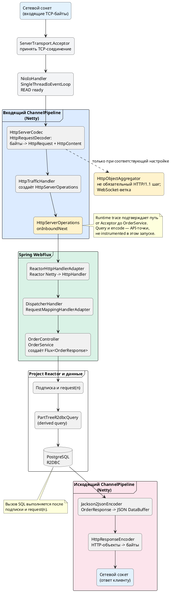

# Путь HTTP-запроса в Netty, Reactor Netty и Spring WebFlux

## Содержание

- [Путь запроса](#%D0%BF%D1%83%D1%82%D1%8C-%D0%B7%D0%B0%D0%BF%D1%80%D0%BE%D1%81%D0%B0)
- [Схема](#%D1%81%D1%85%D0%B5%D0%BC%D0%B0)
- [Главное](#%D0%B3%D0%BB%D0%B0%D0%B2%D0%BD%D0%BE%D0%B5)

**Channel Handlers**  (обработчики канала Netty) и **реактивные операторы**  — разные слои:
  - Первые обрабатывают сетевые события и преобразуют данные на уровне Netty; 
  - вторые строят реактивную цепочку бизнес-логики в Project Reactor.

## Путь запроса

Ниже — путь одного `GET /api/orders/first-10` в `reactive-study`.
 - Создание **server Channel** и **bind порта** — описывает отдельный документ [`Block 0`](BLOCK-0-INIT-PATH-VERIFICATION.md); 
 - здесь сервер уже слушает порт.

1. **TCP accept и EventLoop.** `reactor.netty.transport.ServerTransport$Acceptor#channelRead` принимает новый **client Channel**. 
 - На Windows/NIO дальнейшее чтение идёт на `io.netty.channel.nio.NioIoHandler#run` внутри `io.netty.channel.SingleThreadIoEventLoop`. 
   - В этом проекте не нужно считать `NioEventLoop#run` или `ServerBootstrapAcceptor` обязательным путём: trace их не показал.

2. **Входящий ChannelPipeline.** 
  - Netty передаёт байты через `HttpServerCodec`: 
    - его inbound-половина `HttpRequestDecoder` создаёт `HttpRequest` и `HttpContent`. 
    - Затем `reactor.netty.http.server.HttpTrafficHandler#channelRead` создаёт `HttpServerOperations`.

**Источник:** https://netty.io/4.2/api/io/netty/handler/codec/http/HttpServerCodec.html

**Цитата:**
> A combination of `HttpRequestDecoder` and `HttpResponseEncoder` which enables easier server side HTTP implementation.

**Перевод:**
> Комбинация `HttpRequestDecoder` и `HttpResponseEncoder`, упрощающая серверную HTTP-реализацию.

`HttpObjectAggregator` не является обязательным элементом обычного HTTP/1.1 пути Reactor Netty. 
 - В его официальной схеме агрегатор относится к WebSocket-ветке, а 
 - основной server path содержит `HttpTrafficHandler`.

**Источник:** https://projectreactor.io/docs/netty/1.3.4/api/reactor/netty/NettyPipeline.html

**Цитата:**
> -> http traffic handler ? [HttpTrafficHandler]
>
> ...
>
> -> websocket frame aggregator ? [WsFrameAggregator]

**Перевод:**
> В server pipeline расположен `HttpTrafficHandler`; 
> 
> frame aggregator относится к WebSocket-ветке.

3. **Reactor Netty HTTP operation.** `HttpTrafficHandler` создаёт `HttpServerOperations`; далее `HttpServerOperations#onInboundNext` передаёт HTTP-сообщение в server handler. В trace этот переход подтверждён: `HttpTrafficHandler#channelRead` → `HttpServerOperations#onInboundNext`.

**Источник:** https://github.com/reactor/reactor-netty/blob/v1.3.4/reactor-netty-http/src/main/java/reactor/netty/http/server/HttpTrafficHandler.java

**Цитата:**
> ops = new HttpServerOperations(...);
>
> ops.bind();
>
> ctx.fireChannelRead(msg);

**Перевод:**
> Handler создаёт `HttpServerOperations`, привязывает операцию к channel и передаёт HTTP-сообщение дальше.

4. **Переход в Spring WebFlux.** `org.springframework.http.server.reactive.ReactorHttpHandlerAdapter#apply` адаптирует Reactor Netty request/response к Spring `HttpHandler`. Затем `DispatcherHandler#handle` находит обработчик маршрута, а `RequestMappingHandlerAdapter#handle` вызывает аннотационный контроллер.

**Источник:** https://docs.spring.io/spring-framework/docs/7.0.6/javadoc-api/org/springframework/http/server/reactive/ReactorHttpHandlerAdapter.html

**Цитата:**
> Adapt `HttpHandler` to the Reactor Netty channel handling function.

**Перевод:**
> Адаптирует `HttpHandler` к функции обработки канала Reactor Netty.

**Источник:** https://docs.spring.io/spring-framework/docs/7.0.6/javadoc-api/org/springframework/web/reactive/DispatcherHandler.html

**Цитата:**
> Central dispatcher for HTTP request handlers/controllers.

**Перевод:**
> Центральный диспетчер обработчиков HTTP-запросов и контроллеров.

5. **Код приложения.** Runtime trace показал:

```text
DispatcherHandler.handle
→ RequestMappingHandlerAdapter.handle
→ OrderController.first10
→ OrderService.findFirst10
```

Контроллер возвращает `Flux<OrderResponse>`. Сервис строит его из `OrderRepository.findTop10ByOrderByIdAsc()` и `map(OrderResponse::from)`.

6. **Reactive Streams и R2DBC.** Вызов контроллера или сервиса доказывает создание `Flux`, но сам SQL появляется при подписке и спросе downstream. Для derived query `findTop10ByOrderByIdAsc` подходящая точка — `org.springframework.data.r2dbc.repository.query.PartTreeR2dbcQuery#execute`, затем `AbstractR2dbcQuery#execute`. Эти методы не были в фильтре agent данного запуска, поэтому не помечаются как runtime-подтверждённые.

7. **Ответ.** WebFlux кодирует `OrderResponse` в JSON (`Jackson2JsonEncoder#encode`), после чего outbound-половина `HttpServerCodec` — `HttpResponseEncoder#encode` — записывает HTTP-объекты как байты в сокет. Эти две точки корректны по API, но не были в фильтре agent.

## Схема



`NioIoHandler` обслуживает сетевые события и ChannelPipeline Netty. Реактивная цепочка может начаться на том же event loop, но нельзя рисовать весь R2DBC-путь как безусловно выполняющийся в одном потоке: планировщик может быть переключён, а драйвер БД работает асинхронно.

`HttpObjectAggregator` вынесен из основной линии. Пунктирная стрелка означает, что это не обязательная стадия обычного HTTP/1.1 request path.


## Главное

- **TCP accept:** в этом runtime `ServerTransport$Acceptor#channelRead` принимает client Channel.
- **EventLoop:** на Windows/NIO `NioIoHandler` обрабатывает selected keys и запускает обработчики pipeline.
- **ChannelPipeline:** `HttpServerCodec` преобразует байты в HTTP-объекты, а `HttpTrafficHandler` создаёт `HttpServerOperations`.
- **Граница Spring:** `ReactorHttpHandlerAdapter` передаёт request в `HttpHandler`; `DispatcherHandler` и `RequestMappingHandlerAdapter` доходят до контроллера.
- **Бизнес-цепочка:** `OrderController` и `OrderService` создают `Flux`; выполнение derived query происходит при подписке, а не в момент возврата `Flux`.
- **`HttpObjectAggregator` не обязателен:** он не входит в основной HTTP/1.1 путь Reactor Netty и на схеме обозначен отдельно.


