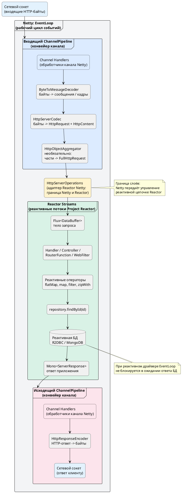

# Путь HTTP-запроса в Netty, Reactor Netty и Spring WebFlux

## Содержание

- [Путь запроса](#%D0%BF%D1%83%D1%82%D1%8C-%D0%B7%D0%B0%D0%BF%D1%80%D0%BE%D1%81%D0%B0)
- [Схема](#%D1%81%D1%85%D0%B5%D0%BC%D0%B0)
- [Главное](#%D0%B3%D0%BB%D0%B0%D0%B2%D0%BD%D0%BE%D0%B5)

**Channel Handlers (обработчики канала Netty) и реактивные операторы — разные слои.** Первые обрабатывают сетевые события и преобразуют данные на уровне Netty; вторые строят реактивную цепочку бизнес-логики в Project Reactor.

## Путь запроса

1. **Netty EventLoop (рабочий цикл событий, worker group)** — поток, который обслуживает сокет. Он получает от **Selector** сообщение, что данные в сокете готовы к чтению.
2. **ChannelPipeline (конвейер канала Netty)** — цепочка `Channel Handlers` (обработчиков канала). 
 - **Входящие байты** проходят через обработчики, например:
    - `ByteToMessageDecoder` — собирает входящие байты в сообщения или кадры;
    - `HttpServerCodec` — преобразует HTTP-байты в `HttpRequest` и `HttpContent`;
    - `HttpObjectAggregator` — необязательный обработчик: объединяет `HttpMessage` и следующие за ним части `HttpContent` в единый `FullHttpRequest`. Обычно он нужен, если приложение хочет получить тело HTTP-запроса целиком, а не обрабатывать его потоково.
 
 - Источник: https://netty.io/4.1/api/io/netty/handler/codec/http/HttpObjectAggregator.html

EN:

> “A `ChannelHandler` that aggregates an `HttpMessage` and its following `HttpContent`s into a single `FullHttpRequest` or `FullHttpResponse`.”

RU:

> «`ChannelHandler` (обработчик канала), который объединяет `HttpMessage` и следующие за ним части `HttpContent` в единый `FullHttpRequest` или `FullHttpResponse`.»
3. **HttpServerOperations (адаптер Reactor Netty)** — это граница между Netty и реактивным API Reactor Netty. После обработки HTTP-протокола данные становятся доступными реактивному коду:
    - тело запроса читается как поток `Flux<DataBuffer>`;
    - данные запроса — метод, URI, заголовки — доступны через API HTTP-запроса.
4. **Твой реактивный код: Spring WebFlux / RouterFunction / WebFilter** — здесь начинается область Project Reactor:
    - `flatMap`, `map`, `filter`, `zipWith` — реактивные операторы;
    - обработчик маршрута (`Handler`, `Controller` или `RouterFunction`) вызывает бизнес-логику;

```
- например, `repository.findById(id)` возвращает `Mono<Entity>` или `Flux<Entity>` при использовании реактивного драйвера БД.
```

5. **Подписчик (Subscriber, подписчик)** запрашивает данные у источника. Это реализует `backpressure` (обратное давление): получатель сам сообщает, сколько элементов готов принять.

Reactor Netty поддерживает Reactive Streams и обратное давление на уровне сетевого движка.
    - Источник: https://projectreactor.io/docs/netty/1.1.21/reference

EN:

> “Reactor Netty offers backpressure-ready network engines for HTTP (including Websockets), TCP, and UDP.”

RU:

> «Reactor Netty предоставляет сетевые движки с поддержкой обратного давления для HTTP, включая WebSocket, TCP и UDP.»
6. **Реактивный запрос к БД** — при вызове `repository.findById(...)` реактивный драйвер отправляет запрос к БД неблокирующе. Пока БД не ответила, `EventLoop` не ждёт её синхронно и может обслуживать другие каналы.
```
7. **Результат: `Mono<ServerResponse>`** — реактивная цепочка формирует ответ. В функциональном API WebFlux это обычно `Mono<ServerResponse>`; в аннотационных контроллерах результат затем адаптируется инфраструктурой Spring WebFlux в HTTP-ответ.
```

8. **Исходящий ChannelPipeline (конвейер канала Netty)** — ответ проходит обратно через исходящие `Channel Handlers`:
    - `HttpResponseEncoder` — преобразует HTTP-ответ и заголовки в байты;
    - Netty записывает байты в сокет;
    - ОС передаёт данные через сетевой интерфейс клиенту.

## Схема



На схеме `EventLoop` охватывает обработку сетевых событий, входящий и исходящий `ChannelPipeline`, а также выполнение реактивной цепочки, если код явно не переключил выполнение на другой планировщик через `publishOn(...)` или `subscribeOn(...)`.


`HttpObjectAggregator` в реальном pipeline `Reactor Netty` 
 - отсутствует по умолчанию — сноска про "необязательный обработчик" уже есть, 
 - но в самой схеме (PlantUML) и в основном тексте пункта 2 он показан как штатный последовательный шаг наравне с `HttpServerCodec`. 
 - Стоит визуально пометить его **как опциональный** (пунктиром или отдельным примечанием), а не как обязательное звено цепочки.


## Главное

- **EventLoop (рабочий цикл событий)** читает данные из сокета, запускает обработку сетевых событий и записывает ответ обратно в сокет.
- **ChannelPipeline (конвейер канала)** — часть Netty; он содержит `Channel Handlers` (обработчики канала).
- **Channel Handlers** работают на уровне транспорта и протокола: преобразуют байты в HTTP-объекты и HTTP-объекты в байты.
- **HttpServerOperations** — мост между обработкой Netty и реактивной моделью Reactor Netty.
- **Реактивные операторы** — `flatMap`, `map`, `filter` и другие операторы Project Reactor; здесь находится бизнес-логика приложения.
- **`HttpObjectAggregator` не обязателен**: он собирает HTTP-сообщение полностью, что не требуется для потоковой обработки тела запроса. [Источник: документация Netty](https://netty.io/4.1/api/io/netty/handler/codec/http/HttpObjectAggregator.html)


