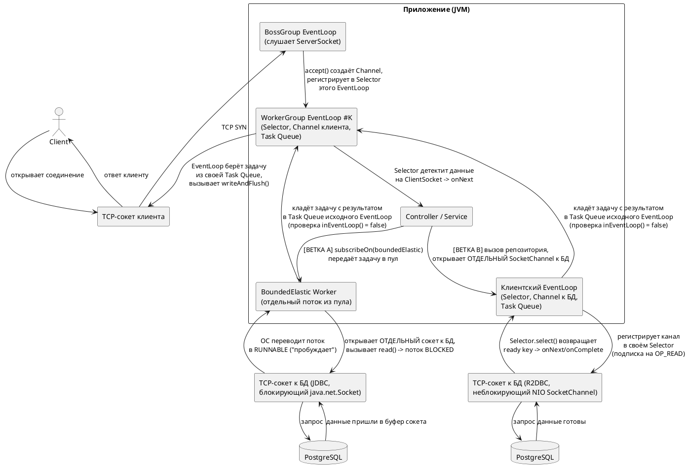

# Путь данных через приложение  две «двери» вместо одной (представление работы Http transport Netty web-server)

## Содержание
1. [Ошибка в исходном представлении](#1-ошибка-в-исходном-представлении)
2. [Сценарий A: блокирующий JDBC-драйвер](#2-сценарий-a-блокирующий-jdbc-драйвер)
3. [Сценарий B: реактивный R2DBC-драйвер](#3-сценарий-b-реактивный-r2dbc-драйвер)
4. [Функциональная схема пути данных](#4-функциональная-схема-пути-данных)
5. [Итоговое правильное понимание](#5-итоговое-правильное-понимание)

## 1. Ошибка в исходном представлении

**Исходная модель** — «одна серверная дверь, через которую данные входят и выходят, а внутри приложение само сходило за данными и вернуло их через ту же дверь» — **неточна**. 

**На самом деле** у приложения не одна «дверь», а потенциально **несколько независимых дверей**, каждая со своим отдельным TCP-соединением, своим `Channel` и (в реактивном случае) своим `Selector`. 
- Дверь **для входящего HTTP-запроса** от клиента и **дверь для исходящего запроса** к базе данных или другому сервису — это **два физически разных сетевых соединения**, которые никак **не пересекаются на уровне сокета**.

## 2. Сценарий A: блокирующий JDBC-драйвер

Здесь второй «двери» в смысле Netty-канала вообще нет. 
 JDBC-драйвер использует классический блокирующий `java.net.Socket` — обычное синхронное TCP-соединение, где поток, вызвавший `read()`, физически «засыпает» на уровне операционной системы и ждёт ответа, никакого `Selector` и мультиплексирования здесь не задействовано.


**Дверь на уровне TCP ...** 
 - JDBC-драйвер физически открывает отдельный **TCP-сокет** к базе данных — то есть на сетевом уровне это ровно такая же "вторая дверь", как и в реактивном сценарии:
  - отдельное соединение, отдельный порт, отдельный сокет операционной системы.

**Дверь на уровне абстракции Netty ...** 
  - Когда я говорил "второй двери в смысле Netty-канала нет", речь шла не про сам TCP-сокет, а про то, как именно Java-код с этим сокетом работает:
    - В блокирующем JDBC-случае используется `java.net.Socket` — обычный, "сырой" TCP-сокет из стандартной библиотеки Java (java.net, не java.nio). 
       - Он не оборачивается в объект `Channel` и не регистрируется ни в каком `Selector`. 
       - Поток, вызвавший `socket.read()`, просто блокируется операционной системой **на системном вызове**, ожидая данных — без какого-либо event-driven механизма.
    - **В реактивном R2DBC-случае** используется `java.nio.channels.SocketChannel`, обёрнутый Netty в объект `Channel`, который регистрируется в `Selector` — то есть та же по сути "дверь" (TCP-соединение к БД), но управляемая совершенно другим механизмом: неблокирующим, событийным, через `EventLoop`.

**Итог**: 
 - физическая "дверь" (TCP-сокет к базе данных) в обоих случаях действительно есть и это два отдельных соединения. 
 - Разница не в наличии сокета, а в том, **как** приложение с ним взаимодействует — блокирующим синхронным вызовом ОС или неблокирующей регистрацией в `Selector`. 
 - Именно эту вторую вещь (Netty-канал и Selector) имеется ввиду, что в JDBC-сценарии её нет — а не сам факт существования сетевого соединения к БД.


Именно поэтому такой вызов оборачивается в `subscribeOn(Schedulers.boundedElastic())` — если выполнить блокирующий вызов прямо на потоке `EventLoop`, этот `EventLoop`-поток «зависнет» в ожидании ответа от БД и не сможет обслуживать другие клиентские соединения, которые на нём же зарегистрированы через `Selector`.

```java
public Mono<Order> findOrder(String id) {
    return Mono.fromCallable(() -> orderRepository.findById(id)) // блокирующий JDBC-вызов
        .subscribeOn(Schedulers.boundedElastic()); // изолируем блокировку от EventLoop
}
```

Путь данных: 
 - `EventLoop`- worker-thread**  передаёт задачу воркеру `boundedElastic` → этот **worker-thread** блокируется на обычном сокете к БД → получает ответ → возвращает данные обратно в реактивную цепочку → результат передаётся в `EventLoop`, привязанный к каналу клиента, для отправки ответа.

## 3. Сценарий B: реактивный R2DBC-драйвер

Здесь у соединения к базе данных действительно есть собственный `Channel` (обычно построенный на Netty), собственный `Selector` и собственный `EventLoop` — возможно, из отдельного `EventLoopGroup`, специально выделенного для клиентских (outbound) соединений, а не для приёма входящих запросов.

```java
public Mono<Order> findOrder(String id) {
    return orderRepository.findById(id); // R2DBC — уже неблокирующий вызов, свой Channel/Selector под капотом
}
```

Здесь `subscribeOn` не нужен вообще: 
 - R2DBC-драйвер сам регистрирует запрос через свой `Selector`, а когда ответ от БД готов, соответствующий `EventLoop` этого outbound-соединения уведомляет реактивную цепочку через `onNext`/`onComplete`, и данные продолжают путь дальше без блокировки какого-либо потока.

## 4. Функциональная схема пути данных



**Шаг 1.** Клиент открывает отдельный TCP-сокет (`ClientSocket`) к приложению — это первая "дверь". Пакет `TCP SYN` попадает на серверный сокет, который слушает `EventLoop` внутри `BossGroup`.

**Шаг 2.** `BossGroup` выполняет `accept()` — создаёт `Channel` для этого клиентского сокета и регистрирует его в `Selector` одного из `EventLoop` из `WorkerGroup`. С этого момента данный `EventLoop` навсегда закреплён именно за этим `Channel`.

**Шаг 3.** `Selector` этого `EventLoop` детектирует появление данных на `ClientSocket` и передаёт их дальше по `ChannelPipeline` — вызывается контроллер/сервис.

**Ветка A — блокирующий JDBC:**

**Шаг 4a.** Сервис оборачивает вызов репозитория в `subscribeOn(Schedulers.boundedElastic())` — задача передаётся отдельному потоку из пула `boundedElastic`.

**Шаг 5a.** Этот поток открывает второй, отдельный TCP-сокет — `JdbcSocket` — уже к базе данных, и вызывает на нём блокирующий `read()`. ОС снимает поток с CPU и переводит его в состояние `BLOCKED`: поток физически не потребляет процессорное время, просто стоит в очереди ожидания у ядра ОС.

**Шаг 6a.** Запрос доходит до `PostgreSQL`, база обрабатывает его и присылает данные — они попадают в буфер `JdbcSocket`.

**Шаг 7a.** Ядро ОС видит, что в буфере сокета появились данные, и переводит ранее заблокированный поток обратно в состояние `RUNNABLE` (кладёт его в очередь потоков, готовых к выполнению) — это и называется "пробуждением": не мистика, а стандартная работа планировщика ОС.

**Шаг 8a.** Поток `boundedElastic`, только что получивший результат от блокирующего вызова к БД, пытается передать этот результат дальше по цепочке. Netty видит, что этот поток — не тот `EventLoop`, за которым был закреплён `Channel` клиента на шаге 2, поэтому не выполняет запись напрямую, а кладёт задачу с результатом в `Task Queue` именно того, правильного `EventLoop`, чтобы он сам выполнил `writeAndFlush()` в своем поток.

**Ветка B — реактивный R2DBC:**

**Шаг 4b.** Сервис вызывает R2DBC-репозиторий напрямую. Драйвер открывает второй, отдельный `SocketChannel` — `R2dbcSocket` — к базе данных, на клиентском `EventLoop`, выделенном именно для outbound-соединений.

**Шаг 5b.** Этот `EventLoop` регистрирует `R2dbcSocket` в своём `Selector`, явно подписываясь на событие `OP_READ` — то есть ставит своеобразный "callback": "уведоми меня через `epoll`/`kqueue`, когда на этом сокете появятся данные для чтения". Никакой поток при этом не блокируется — `EventLoop` продолжает опрашивать все зарегистрированные каналы в цикле `select()`.

**Шаг 6b.** Запрос доходит до `PostgreSQL`, база присылает ответ в буфер `R2dbcSocket`.

**Шаг 7b.** На следующей итерации `Selector.select()` этого `EventLoop` возвращает "ready key" для `R2dbcSocket` — событие `OP_READ` сработало, и `EventLoop` эмитит `onNext`/`onComplete` в реактивную цепочку.

**Шаг 8b.** Этот же `EventLoop` кладёт задачу с результатом в `Task Queue` того `EventLoop`, что закреплён за `ClientSocket` (снова через проверку `inEventLoop()`).

**Финальный шаг.** `EventLoop`, закреплённый за `ClientSocket`, в своём обычном цикле обработки очереди задач достаёт эту задачу и вызывает `writeAndFlush()` — данные уходят обратно клиенту через ту же самую первую "дверь" (`ClientSocket`), через которую пришёл исходный запрос.


## 5. Итоговое правильное понимание

- Входящее соединение от клиента и исходящее соединение к БД/внешнему сервису — это два физически разных TCP-канала, каждый со своим `Channel` и (если это неблокирующий Netty-based клиент) своим `Selector`.
- Приложение не «сходило за данными через ту же дверь» — оно открыло отдельное исходящее соединение, дождалось ответа по нему (либо через блокирующий поток `boundedElastic`, либо через отдельный неблокирующий `Selector` этого outbound-соединения), и только после этого вернуло результат в `EventLoop`, обслуживающий исходное соединение с клиентом, чтобы отправить финальный ответ через ту дверь, через которую пришёл запрос.
- Блокирующий JDBC-драйвер — это классический синхронный сокет без `Selector` вообще, требующий изоляции на отдельном пуле потоков (`boundedElastic`), чтобы не парализовать `EventLoop`.
- Реактивный R2DBC-драйвер — это такой же неблокирующий Netty-канал со своим `Selector`, как и HTTP-соединение с клиентом, просто это другое, самостоятельное соединение в другую сторону.
