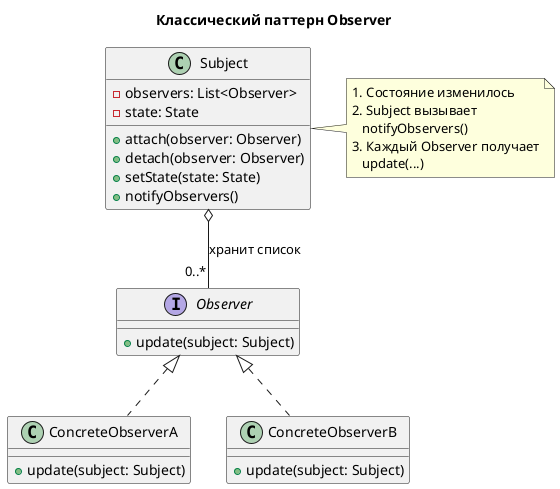
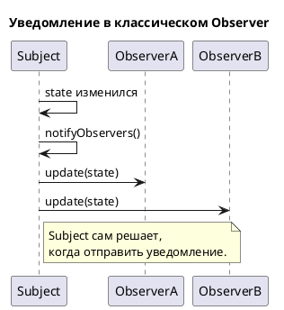
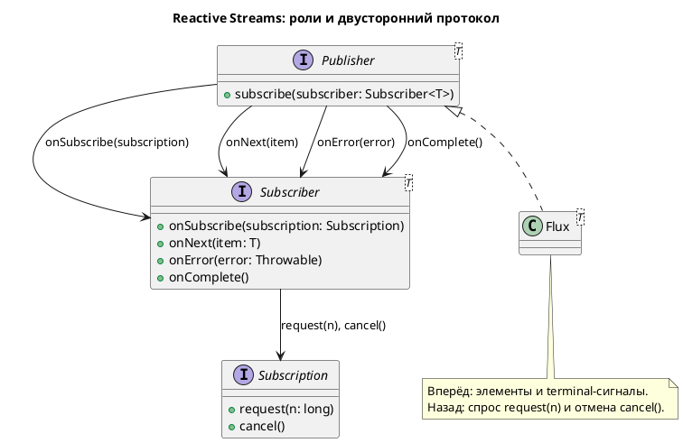
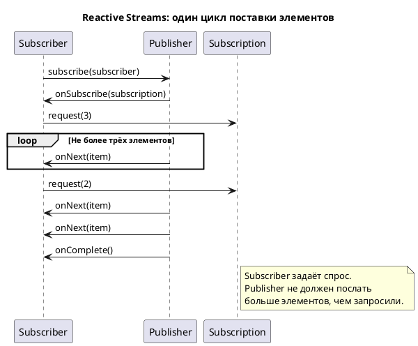

Project Reactor действительно построен **на основе** _Observer pattern_ в своей базовой механике подписки: 
 - у вас есть Publisher (аналог Subject/Observable), к которому подписывается Subscriber (аналог Observer), и Publisher уведомляет подписчика о новых элементах через методы `onNext`, `onError`, `onComplete`.

## Классический Observer

> В классическом паттерне есть **Subject** — объект, за изменениями которого наблюдают, и несколько **Observer**.
> 
> **Observer** регистрируется у **Subject**.
> 
> Когда состояние **Subject** изменяется, он обходит список зарегистрированных **Observer** и вызывает у каждого метод уведомления, обычно `update(...)`.

Поток вызовов выглядит так:

`Observable` может иметь несколько наблюдателей (**Observers**); 
- после изменения состояния вызов `notifyObservers()` приводит к вызову `update()` у всех наблюдателей.

- Источник: https://docs.oracle.com/en/java/javase/17/docs/api/java.base/java/util/Observable.html

EN:

> “After an observable instance changes, an application calling the `Observable`'s `notifyObservers` method causes all of its observers to be notified of the change by a call to their `update` method.”

RU:

> «После изменения экземпляра **Observable** вызов его метода `notifyObservers` приводит **к уведомлению** всех наблюдателей вызовом их метода `update`».

## Reactive Streams

> В Reactive Streams `Publisher` не просто хранит список `Subscriber` и немедленно рассылает данные.
> 
> **При подписке** он передаёт каждому **Subscriber** объект `Subscription`.
> 
> Через него **Subscriber** задаёт спрос: `request(n)` означает «я готов принять до `n` следующих элементов», а `cancel()` прекращает подписку.

Поток сигналов показан ниже:

Спецификация требует, чтобы число сигналов `onNext`, 
- отправленных конкретному **Subscriber**, не превышало суммарного количества элементов, запрошенных этим Subscriber. 
- Именно это и есть формальное правило backpressure.

- Источник: https://github.com/reactive-streams/reactive-streams-jvm

EN:

> “The total number of `onNext`´s signalled by a Publisher to a Subscriber MUST be less than or equal to the total number of elements requested by that Subscriber.”

RU:

> «Общее число сигналов `onNext`, отправленных Publisher конкретному Subscriber, должно быть меньше или равно общему числу элементов, запрошенных этим Subscriber».

## Главное различие

| Критерий | Observer | Reactive Streams / Project Reactor |
| :-- | :-- | :-- |
| Кто хранит связь | `Subject` хранит список `Observer` | `Publisher` создаёт отдельную `Subscription` для подписки |
| Начало работы | `Subject` уведомляет при изменении состояния | `Publisher` вызывает `onSubscribe(subscription)` |
| Передача данных | Обычно `update(...)` | `onNext(item)` |
| Управление скоростью | Обычно отсутствует в контракте | `Subscriber` вызывает `request(n)` |
| Отмена | Часто `detach(observer)` у Subject | `Subscription.cancel()` |
| Завершение потока | Обычно не стандартизировано | `onComplete()` или `onError()` |
| Основная модель | Уведомление об изменении состояния | Асинхронный поток элементов по контракту |

Поэтому точнее писать так:

> Project Reactor похож на Observer pattern тем, что
> 
> Publisher передаёт события **Subscriber**.
> 
> Но Reactor реализует Reactive Streams — стандартизированный двусторонний протокол:
> 
>   - Publisher отправляет данные через `onNext`, `onError` и `onComplete`, а
>   - 
>   - Subscriber через `Subscription` управляет спросом (`request(n)`) и может отменить подписку (`cancel()`).

Reactor основан на спецификации Reactive Streams и предназначен для построения **неблокирующих приложений** на JVM.

- Источник: https://projectreactor.io/docs/core/release/reference/reactiveProgramming.html

EN:

> “Reactive programming is an asynchronous programming paradigm concerned with data streams and the propagation of change.”

RU:

> «Реактивное программирование — это асинхронная парадигма программирования, связанная с потоками данных и распространением изменений».
