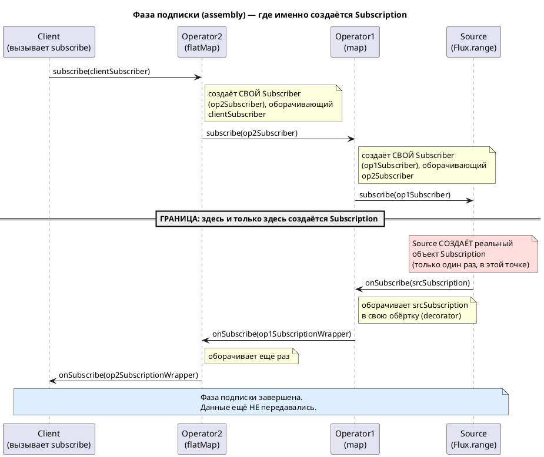
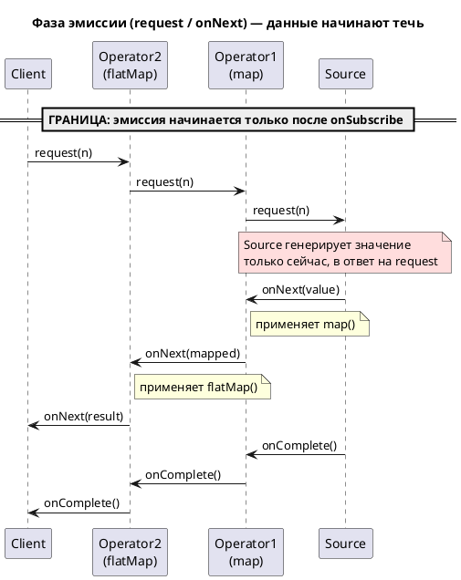

# Decorator Pattern и Subscription/Context в Project Reactor

## Оглавление

- [1. Классический паттерн Decorator](#1-классический-паттерн-decorator)
- [2. Как Subscriber создаётся по цепочке операторов](#2-как-subscriber-создаётся-по-цепочке-операторов)
- [3. Как Subscription оборачивается (decorator) снизу вверх](#3-как-subscription-оборачивается-decorator-снизу-вверх)
- [4. Context и его связь с Subscriber](#4-context-и-его-связь-с-subscriber)
- [5. Фазы жизненного цикла: подписка и эмиссия (PlantUML)](#5-фазы-жизненного-цикла-подписка-и-эмиссия-plantuml)

---

## 1. Классический паттерн Decorator

**Утверждение:**

**Decorator** — структурный паттерн, позволяющий динамически добавлять объекту новое поведение, оборачивая его в объект-обёртку того же интерфейса. Все обёртки следуют одному интерфейсу с исходным объектом, поэтому их можно накладывать друг на друга сколько угодно раз.

- Источник: https://refactoring.guru/design-patterns/decorator/java/example

> "Decorator is a structural pattern that allows adding new behaviors to objects dynamically by placing them inside special wrapper objects, called decorators. Using decorators you can wrap objects countless number of times since both target objects and decorators follow the same interface."

RU:

> "Декоратор — это структурный паттерн, который позволяет динамически добавлять объектам новое поведение, помещая их в объекты-обёртки, называемые декораторами.
>
> С помощью декораторов можно оборачивать объекты бесконечное число раз, так как целевые объекты и декораторы реализуют один и тот же интерфейс."

**Код (интерфейс + декоратор):**

```java
public interface DataSource {
    void writeData(String data);
    String readData();
}

/**
 * DataSourceDecorator хранит ссылку на wrappee того же интерфейса DataSource и делегирует вызовы, добавляя своё поведение поверх
 */
public abstract class DataSourceDecorator implements DataSource {
    private DataSource wrappee;

    DataSourceDecorator(DataSource source) {
        this.wrappee = source;
    }

    @Override
    public void writeData(String data) {
        wrappee.writeData(data);
    }

    @Override
    public String readData() {
        return wrappee.readData();
    }
}
```

- Источник: https://refactoring.guru/design-patterns/decorator/java/example

Ключевая идея: `DataSourceDecorator` хранит ссылку на `wrappee` того же интерфейса `DataSource` и делегирует вызовы, добавляя своё поведение поверх.

---

## 2. Как Subscriber создаётся по цепочке операторов

**Утверждение:**

Вызов `subscribe()` идёт от последнего оператора к первому (к источнику), и на каждом шаге оператор создаёт новый Subscriber, оборачивающий тот, что пришёл к нему снизу.

- Источник: https://stackoverflow.com/questions/45739200/how-to-write-operators-in-reactor-3

- Каждый оператор в Reactor (`FluxMap`, `FluxFilter`, `FluxContextWrite` и т.д.) реализует `Publisher`,
- а при вызове `subscribe(downstreamSubscriber)` создаёт собственный внутренний класс `Subscriber` (например, `FluxMap.MapSubscriber`),
- который оборачивает `downstreamSubscriber` и подписывает его на исходный (upstream) `Publisher`.

---

## Пример из практики

```java
userRepository.findAllUsers()          // (1) источник — запрос в БД
    .flatMap(user -> enrichUser(user))  // (2) для каждого юзера — доп. запрос
    .map(User::toDto)                   // (3) конвертация в DTO
    .subscribe(dto -> save(dto));       // (4) запуск всего процесса
```

## Порядок выполнения простыми словами

- Ничего не происходит, пока не вызван `subscribe()` в строке (4) — до этого момента у вас просто "рецепт", а не запущенный процесс.
- `subscribe()` запускает цепочку "снизу вверх":
  - сначала обращается к оператору `map`,
  - оператор `map` обращается к оператору `flatMap`,
  - оператор `flatMap` сообщает источнику — "начинай присылать данные".

- Дальше данные летят "сверху вниз":
  - БД присылает набор пользователей и оператор `flatMap` принимает из этого списка пользователей один элемент (это упрощенно...)
  - → оператор `flatMap` получает объект User и передает его в доп. запрос
  - → То есть, происходит обогащение данными и только после этого, результат идёт в оператор `map`
  - → оператор `map` конвертирует полученную сущность в DTO
  - → DTO попадает в ваш `subscribe(dto -> save(dto))`.

## Аналогия

Это как заказ в кафе:
 - вы делаете заказ (`subscribe`) — сигнал идёт на кухню (к источнику данных).
 - Кухня готовит блюдо и передаёт его официанту (`flatMap`),
 - официант кладёт соус (`map`) и приносит вам (`subscribe`).

 - Каждый "работник" в этой цепочке просто получает то, что сделал предыдущий, и передаёт дальше — ничего абстрактного здесь нет, просто "обёртки" в Reactor физически создаются в момент вызова `subscribe()`,
 - а данные летят в обратном направлении.

Источник: https://projectreactor.io/docs/core/release/reference/reactiveProgramming.html

> "Nothing happens until you subscribe."

RU:

> "Ничего не происходит, пока вы не подпишетесь."

---

## Поясняю фразу на вашем примере

```java
userRepository.findAllUsers()          // источник (Publisher)
    .flatMap(user -> enrichUser(user))  // оператор A
    .map(User::toDto)                   // оператор B
    .subscribe(dto -> save(dto));       // ваш Subscriber
```

## Где и как создаётся Subscriber на каждом шаге

- Вы вызываете `.subscribe(dto -> save(dto))` — это создаёт ваш Subscriber (назовём его `terminalSubscriber`).
- `map(User::toDto)` получает этот `terminalSubscriber` и создаёт **свой собственный** объект-обёртку (условно `mapSubscriber`), который внутри себя хранит ссылку на `terminalSubscriber`.
- Дальше `mapSubscriber` подписывается на `flatMap` — то есть `flatMap` получает `mapSubscriber` и создаёт **свой** объект-обёртку (`flatMapSubscriber`), который хранит ссылку на `mapSubscriber`.
- И наконец `flatMapSubscriber` подписывается на `findAllUsers()` — это и есть момент, когда сигнал "подпишись" дошёл до самого источника.

## Почему "от последнего оператора к первому"

Порядок вызовов такой:
  - `subscribe → map → flatMap → findAllUsers`.
  - Именно поэтому в исходной фразе сказано "от последнего оператора к первому (к источнику)" — `map` в коде написан позже, чем `flatMap`, но именно `map` первым узнаёт о подписке, потому что он ближе к `subscribe()`.

## Что означает "создаёт новый Subscriber, оборачивающий тот, что пришёл снизу"

"Снизу" здесь — это ближе к `subscribe()`. Когда `flatMap` создаёт `flatMapSubscriber`, он оборачивает `mapSubscriber` (который пришёл к нему как параметр) — то есть внутри `flatMapSubscriber` лежит ссылка на `mapSubscriber`, а внутри `mapSubscriber` — ссылка на ваш `terminalSubscriber`.

Источник: https://github.com/reactor/reactor-core/blob/master/reactor-core/src/main/java/reactor/core/publisher/FluxMap.java

> "public CoreSubscriber<? super T> subscribeOrReturn(CoreSubscriber<? super R> actual) { return new MapSubscriber<>(actual, mapper); }"

RU:

> "Метод subscribeOrReturn получает готового Subscriber-а (actual) и создаёт новый MapSubscriber, который хранит ссылку именно на этот `actual`."

- То есть `actual` в этой цитате — это и есть тот Subscriber, "который пришёл снизу" (от `map` в сторону `flatMap`), а `new MapSubscriber<>(actual, ...)` — это создание новой обёртки поверх него.

---

## 3. Как Subscription оборачивается (decorator) снизу вверх

**Утверждение:**
- Объект `Subscription`, создаётся источником данных (то есть, объектом Publisher), и происходит это в момент вызова `onSubscribe`.
  - Каждый промежуточный реактивный оператор, может обернуть полученный объект `Subscription` в свою реализацию,
    - делегируя вызовы `request()`/`cancel()` вложенному объекту.
  - То есть, это тот же паттерн **Decorator**, просто применённый к интерфейсу `Subscription`.

- Источник: https://github.com/reactive-streams/reactive-streams-jvm

> "Subscription represents a one-to-one lifecycle of a Subscriber subscribing to a Publisher. [...] Subscription.request(long n) and Subscription.cancel() [...] MUST only be performed by the Subscriber to whom the Subscription was given."

RU:

> "Subscription представляет собой связь один-к-одному в жизненном цикле подписки Subscriber на Publisher. [...] Методы Subscription.request(long n) и Subscription.cancel() должны вызываться только тем Subscriber-ом, которому была выдана данная Subscription."

## Поясним на том же примере

```java
userRepository.findAllUsers()          // источник (Publisher)
    .flatMap(user -> enrichUser(user))  // оператор A
    .map(User::toDto)                   // оператор B
    .subscribe(dto -> save(dto));       // ваш Subscriber
```

## Кто вызывает onSubscribe

Из раздела 2 мы уже выяснили: подписка "дошла" до `findAllUsers()` — то есть `flatMapSubscriber` подписался на источник. Именно в этот момент **сам источник** (`findAllUsers()`) создаёт объект `Subscription` и сам же вызывает `flatMapSubscriber.onSubscribe(subscription)`. Источник — единственный, кто создаёт **настоящую, первую** `Subscription`, и он же первым её передаёт.

## Как Subscription идёт дальше — не передаётся как есть, а оборачивается на каждом шаге

- `findAllUsers()` вызывает `flatMapSubscriber.onSubscribe(subscription)`.
- `flatMapSubscriber` сохраняет `subscription` у себя, но вниз передаёт **себя** — `mapSubscriber.onSubscribe(flatMapSubscriber)`, потому что `flatMapSubscriber` одновременно Subscriber и Subscription.
- `mapSubscriber` так же передаёт вниз **себя** — `terminalSubscriber.onSubscribe(mapSubscriber)`.

Настоящая `Subscription` от источника остаётся только у `flatMapSubscriber`. Дальше по цепочке идут уже обёртки, а не оригинал.

Источник: https://github.com/reactor/reactor-core/blob/main/reactor-core/src/main/java/reactor/core/publisher/FluxMap.java

```java
static final class MapSubscriber<T, R> implements InnerOperator<T, R> {
    final CoreSubscriber<? super R> actual; // = terminalSubscriber, передан в конструкторе при создании
    Subscription s;

    @Override
    public void onSubscribe(Subscription s) {
        this.s = s;
        actual.onSubscribe(this); // передаёт вниз себя, а не s
    }

    @Override
    public void request(long n) {
        s.request(n);
    }
}
```

RU:

`actual` — это просто поле, куда сохранили `terminalSubscriber` в момент создания `MapSubscriber` (когда вызывался `subscribe()`). Никакого нового объекта здесь нет — это тот же Subscriber, который "пришёл снизу".

## Зачем нужна обёртка

Когда вы в конце вызовете `subscription.request(n)` (это Reactor делает автоматически при `subscribe()`), запрос пойдёт в обратном направлении — от `terminalSubscriber` вниз к источнику:
 - `terminalSubscriber → mapSubscriber → flatMapSubscriber → источник`.
 - Если, например, `flatMap` обернул `Subscription`, чтобы контролировать, сколько параллельных запросов к `enrichUser()` можно делать одновременно — именно в этой обёртке и сработает нужная логика перед тем,
   - как запрос уйдёт дальше к источнику.

Источник: https://github.com/reactive-streams/reactive-streams-jvm

> "The Publisher.subscribe method [...] can be called as many times as necessary but only with different Subscriber instances. [...] The Publisher MUST call onSubscribe on the Subscriber instance."

RU:

> "Метод Publisher.subscribe можно вызывать сколько угодно раз, но только с разными экземплярами Subscriber. [...] Publisher ОБЯЗАН вызвать onSubscribe у этого экземпляра Subscriber."

> "Subscription represents a one-to-one lifecycle of a Subscriber subscribing to a Publisher."

RU:

> "Subscription представляет собой связь один-к-одному в жизненном цикле подписки Subscriber на Publisher."

Иначе говоря:
- `onSubscribe` всегда вызывает тот, кто выше по цепочке (в направлении к источнику), но передаёт он не оригинальную `Subscription`,
- а собственную обёртку — именно правило "один-к-одному" объясняет, почему у каждой пары (оператор как Subscriber) → (его downstream) обязана быть своя собственная `Subscription`, а не общая для всех.

---

## 4. Context и его связь с Subscriber

**Утверждение:**

**Context** привязан не к оператору, а к каждому **Subscriber** в цепочке.

- Он распространяется через механизм **Subscription** — начиная с финального **subscribe** и двигаясь вверх по цепочке.
  - `contextWrite` объединяет переданный **ContextView** с **Context**, пришедшим снизу, создавая новый **Context** для всех операторов выше.

- Технически `Context` хранится как обычное поле внутри объекта `Subscriber` на каждом уровне цепочки, а метод `currentContext()` просто возвращает значение этого поля.

- Источник: https://projectreactor.io/docs/core/release/reference/advancedFeatures/context.html

> "Actually, a Context is tied to each Subscriber in a chain. It uses the Subscription propagation mechanism to make itself available to each operator, starting with the final subscribe and moving up the chain. [...] contextWrite(ContextView) merges the ContextView you provide and the Context from downstream [...] resulting in a NEW Context for upstream."

RU:

> "На самом деле Context привязан к каждому Subscriber-у в цепочке. Он использует механизм распространения Subscription, чтобы стать доступным для каждого оператора, начиная с финального subscribe и двигаясь вверх по цепочке. [...] contextWrite(ContextView) объединяет переданный вами ContextView с Context, пришедшим снизу [...] в результате создаётся НОВЫЙ Context для операторов выше."

> "The reason is that the Context is associated to the Subscriber and each operator accesses the Context by requesting it from its downstream Subscriber."

RU:

> "Причина в том, что `Context` связан с `Subscriber-ом`, и каждый оператор получает доступ к `Context`, запрашивая его у своего `downstream` Subscriber-а."

**Иллюстрация (пример из документации Reactor, можно запустить и проверить живьём):**

```java
import reactor.core.publisher.Mono;

public class ContextDemo {

    public static void main(String[] args) {
    String key = "message";

    Mono<String> result = Mono.just("Hello")
            .flatMap(
                    str -> Mono.deferContextual(
                            ctx -> Mono.just(
                                    str + " " + ctx.get(key)
                            )
                    )
            )
            .contextWrite(ctx -> ctx.put(key, "World"));

    result.subscribe(System.out::println); // выведет: Hello World
  }
}
```

- Источник: https://projectreactor.io/docs/core/release/reference/advancedFeatures/context.html

**Как это выглядит в реальном исходном коде Reactor (где хранится Subscriber и Context):**

```java
static final class ContextWriteSubscriber<T> implements InnerOperator<T, T> {
    final CoreSubscriber<? super T> actual; // Subscriber, пришедший снизу
    final Context context;                  // Context, который видит ЭТОТ оператор

    ContextWriteSubscriber(CoreSubscriber<? super T> actual, Context context) {
        this.actual = actual;
        this.context = context;
    }

    @Override
    public Context currentContext() {
        return this.context; // отсюда операторы читают "свой" Context
    }
}

public CoreSubscriber<? super T> subscribeOrReturn(CoreSubscriber<? super T> actual) {
    Context c = doOnContext.apply(actual.currentContext()); // читаем Context снизу
    return new ContextWriteSubscriber<>(actual, c);          // сохраняем новый Context
}
```

- Источник: https://github.com/reactor/reactor-core/blob/main/reactor-core/src/main/java/reactor/core/publisher/FluxContextWrite.java

RU (пояснение к коду):

- `actual` — тот же Subscriber снизу, который мы уже разбирали в предыдущих разделах (обычное поле, а не новый объект). 

- `context` — тоже обычное поле того же объекта, где лежит именно тот Context, который видим на этом уровне цепочки. 

- `actual.currentContext()` читает Context, пришедший снизу, ваша лямбда из `contextWrite(ctx -> ctx.put(...))` добавляет к нему свой ключ, а результат сохраняется в новом `ContextWriteSubscriber` — именно так `Context` "поднимается" вверх по цепочке, оставаясь при этом полем внутри конкретного Subscriber-а на каждом уровне.


## Подтверждение на примере выше

```java
findAllUsers()          // источник
    .flatMap(...)        // оператор flatMap
    .map(...)             // оператор map
    .subscribe(...);      // ваш Subscriber
```

**Порядок создания объектов** (снизу вверх, начиная от `subscribe()`):

  - `subscribe()` создаёт `terminalSubscriber`.
  - `map` создаёт `mapSubscriber`, и его поле `actual` = `terminalSubscriber`.
  - `flatMap` создаёт `flatMapSubscriber`, и его поле `actual` = `mapSubscriber` (объект, созданный уровнем `map`, который стоит ниже него по цепочке).

То есть да: 
- `actual` на уровне `flatMap` — это именно объект `Subscriber`, созданный на уровне `map`, а не что-то абстрактное. 
- Каждый следующий уровень (ближе к источнику) хранит в `actual` ссылку на конкретный объект-обёртку, созданный предыдущим (более низким) уровнем.

## Является ли `actual` "обёрткой"

Смотря с какой стороны смотреть: 
 - сам объект, на который ссылается `actual` (например, `mapSubscriber`), — это обёртка вокруг `terminalSubscriber`. 
 - Но с точки зрения `flatMapSubscriber` поле `actual` — это просто ссылка на готовый, уже созданный объект, который был передан ему в конструктор при вызове `subscribeOrReturn(actual)`. 
 - Сам `flatMapSubscriber` не создаёт `actual` — он его получает как параметр.

Источник: [https://github.com/reactor/reactor-core/blob/master/reactor-core/src/main/java/reactor/core/publisher/FluxMap.java](https://github.com/reactor/reactor-core/blob/master/reactor-core/src/main/java/reactor/core/publisher/FluxMap.java)

> "public CoreSubscriber\<? super T> subscribeOrReturn(CoreSubscriber\<? super R> actual) { return new MapSubscriber\<>(actual, mapper); }"

RU:

> "`actual` передаётся в конструктор извне — это Subscriber, который пришёл к этому оператору от уровня, стоящего ниже (ближе к subscribe())."

Таким образом: 
 - `actual` на каждом уровне — это конкретный объект-**Subscriber**, созданный уровнем ниже, и цепочка `flatMapSubscriber.actual → mapSubscriber.actual → terminalSubscriber` — это и есть та самая матрёшка ссылок.


### 4.1. ВАЖНОЕ УТОЧНЕНИЕ: внутри `Context` нет "матрёшки со ссылками", в отличие от `Subscription`

- В **разделе 3** показано, что `Subscription`-обёртки реально хранят ссылку друг на друга (`this.s = s`) — это классическая матрёшка-декоратор.
  - **Context работает по-другому**: `put()`/`putAll()` не создают обёртку со ссылкой на предыдущий `Context`, а создают **новый объект с копией всех пар ключ-значение**.

- Источник: https://github.com/reactor/reactor-core/blob/main/reactor-core/src/main/java/reactor/util/context/Context1.java


```java

final class Context1 implements CoreContext {
    final Object key;
    final Object value;

    Context1(Object key, Object value) {
        this.key = key;
        this.value = value;
    }

    @Override
    public Context put(Object key, Object value) {
        if (this.key.equals(key)) {
            return new Context1(key, value); // замена значения по тому же ключу
        }
        return new Context2(this.key, this.value, key, value); // копия старой пары + новая
    }
}
```

**RU**:

- `Context1` хранит ровно одну пару ключ-значение. При `put()` с новым ключом создаётся **не обёртка** вокруг старого объекта (поля `parent` здесь нет вообще), а 
- `Context2` — новый объект, который **копирует** старую пару и добавляет новую рядом с ней.

- Источник: https://github.com/reactor/reactor-core/blob/main/reactor-core/src/main/java/reactor/util/context/Context.java

> "Note that contexts are optimized for low cardinality key/value storage [...] Past five user key/value pair, the Context will use a copy-on-write implementation backed by a new java.util.Map on each put."

**RU**:

> "Контексты оптимизированы для хранения небольшого числа пар ключ-значение [...] После пяти пар Context переключается на реализацию copy-on-write на основе нового java.util.Map при каждом put."

**Итог по разделу 4:** 
  - Reactor использует классы `Context1`, `Context2`, `Context3`, `Context4`, `Context5`, а после пяти записей — `ContextN` на основе `Map`. 
  - Каждый `put`/`putAll` создаёт новый объект с полным (скопированным) набором данных, а не цепочку ссылок на предыдущие версии — **иммутабельность** здесь достигается **через копирование**, а не через decorator-обёртки, как это было с `Subscription`.

---

## 5. Фазы жизненного цикла: подписка и эмиссия (PlantUML)

**Утверждение:**

- **Жизненный цикл реактивной цепочки** строго делится на две непересекающиеся фазы: 
  - **фазу подписки** (assembly/subscribe), в которой строится **граф** Subscriber/Subscription и ничего из данных ещё не передаётся, и 
  - **фазу эмиссии** (request/onNext), в которой **запрос** данных идёт **вверх**, а сами **данные** — **вниз**.

- Источник: https://github.com/reactive-streams/reactive-streams-jvm

> "After the Subscriber is registered with the Publisher, and before the first onNext, onComplete or onError signal, the Publisher MUST call onSubscribe on the Subscriber."

RU:

> "После того как `Subscriber` зарегистрирован у `Publisher`, и до первого сигнала `onNext`, `onComplete` или `onError`, `Publisher` ОБЯЗАН вызвать `onSubscribe` у этого `Subscriber`."

### 5.1. Фаза подписки — граница: создание `Subscriber` идёт вниз→вверх, `Subscription` — вверх→вниз



### 5.2. Фаза эмиссии — граница: request() идёт вверх, onNext/onComplete — вниз



### 5.3. Итоговая граница между фазами

| Момент | Что создаётся / происходит | Направление |
| :-- | :-- | :-- |
| `subscribe()` вызван | Создаются объекты Subscriber (по одному на оператор) | От `subscribe()` к источнику (`findAllUsers`) |
| `onSubscribe(subscription)` вызван источником | Создаётся ЕДИНСТВЕННЫЙ реальный объект Subscription, затем оборачивается decorator'ами | От источника (`findAllUsers`) к `subscribe()` |
| `request(n)` вызван подписчиком | Ничего не создаётся, идёт сигнал "дай данные" | От `subscribe()` к источнику (`findAllUsers`) |
| `onNext(value)` вызван источником | Данные преобразуются каждым оператором по пути | От источника (`findAllUsers`) к `subscribe()` |

## Проверка на вашем примере

```java
findAllUsers()          // источник
    .flatMap(...)
    .map(...)
    .subscribe(...);
```

- **Создание Subscriber-ов**: начинается от `subscribe()`, идёт к `map`, потом к `flatMap`, и заканчивается на `findAllUsers()`. Значит направление — "от `subscribe()` к источнику".
- **Создание и передача Subscription**: начинается у `findAllUsers()` (только там рождается настоящий объект), идёт к `flatMap`, потом к `map`, и заканчивается у вашего `subscribe()`. Значит направление — "от источника к `subscribe()`" — то есть строго обратное первому пункту.
- **`request(n)`**: направление такое же, как у создания Subscriber-ов — от `subscribe()` к источнику.
- **`onNext(value)`**: направление такое же, как у Subscription — от источника к `subscribe()`.

Так что правило простое: 

- создание Subscriber-ов и запрос данных (`request`) всегда идут в одну сторону (к источнику), а 
- создание/передача Subscription и сами данные (`onNext`) — всегда в другую сторону (от источника к вам).


- Источник: https://projectreactor.io/docs/core/release/reference/reactiveProgramming.html
