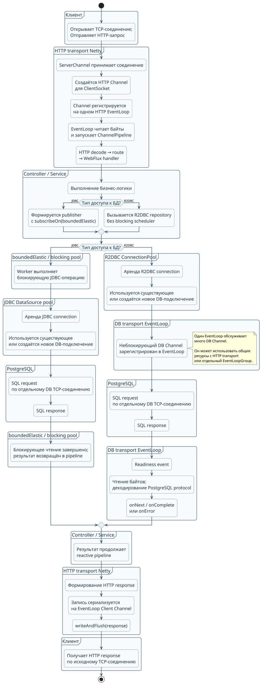

# Путь данных через приложение: две «двери» вместо одной (представление работы HTTP-транспорта Netty web-server)

## Содержание

1. [Ошибка в исходном представлении](#1-ошибка-в-исходном-представлении)
2. [Сценарий A: блокирующий JDBC-драйвер](#2-сценарий-a-блокирующий-jdbc-драйвер)
3. [Сценарий B: реактивный R2DBC-драйвер](#3-сценарий-b-реактивный-r2dbc-драйвер)
4. [Функциональная схема пути данных](#4-функциональная-схема-пути-данных)
5. [Итоговое правильное понимание](#5-итоговое-правильное-понимание)

## 1. Ошибка в исходном представлении

**Исходная модель** — «одна серверная дверь, через которую данные входят и выходят, а внутри приложение само сходило за данными и вернуло их через ту же дверь» — неточна.

**На самом деле** **HTTP-соединение клиента** с приложением и **соединение приложения с базой** данных или внешним сервисом — это **независимые** TCP-соединения. 

Они не пересекаются на уровне сокета:

- клиент устанавливает **inbound** TCP-соединение с HTTP-сервером приложения;
- приложение использует **outbound** TCP-соединение с PostgreSQL или другим внешним сервисом;
- финальный HTTP-ответ возвращается клиенту **по-исходному inbound-соединению.**


 - **Inbound TCP-соединение** — соединение, которое внешний клиент инициировал **к приложению**.
 - **Outbound TCP-соединение** — соединение, которое приложение инициировало **к внешней системе**, например PostgreSQL.

Оба соединения **двусторонние**: 
 - по ним передаются данные в обе стороны. Название зависит от того, **кто открыл соединение**, относительно приложения.


**У каждого** TCP-соединения есть **свой сокет операционной системы** а, в Netty, еще и свой `Channel`. 
 - Однако у TCP-соединения **нет собственного `Selector`**: один `EventLoop` обслуживает множество `Channel`, зарегистрированных в его механизме readiness-notification. 
 - Для Java NIO это `Selector`; при native transport Netty на Linux это, например, `epoll`.

В Netty `Channel` после регистрации закреплён за одним `EventLoop` на время своей жизни.
 - Но один поток EventLoop обслуживает множество клиентских каналов, поэтому в нём нельзя выполнять долгие, CPU-intensive или блокирующие операции. См. [Netty: Thread model clarification](https://groups.google.com/g/netty/c/1kAS-FJWGRE) и [Reactor Netty Reference Guide: Event Loop Group](https://projectreactor.io/docs/netty/1.1.24/reference/#_event_loop_group).

**Важно** также отличать логическое использование DB-соединения от физического создания TCP-сокета. 
- В обычном production-приложении JDBC `DataSource` или R2DBC `ConnectionPool` пере-использует ранее открытые подключения. 
- Поэтому на каждый SQL-запрос приложение, как правило, не открывает новый TCP-сокет, а арендует свободное соединение из пула и возвращает его в пул после завершения операции.

## 2. Сценарий A: блокирующий JDBC-драйвер

**JDBC-драйвер** работает синхронно: вызывающий поток ждёт завершения чтения или записи в сетевом соединении с БД. 
- На сетевом уровне это всё равно отдельный TCP-сокет к PostgreSQL — вторая «дверь» относительно inbound HTTP-соединения.

При этом JDBC-соединение не является Netty `Channel` и обычно не обслуживается Netty EventLoop или Java NIO `Selector`. Классический JDBC-драйвер выполняет блокирующий I/O через стандартную сетевую реализацию Java и ОС.

Не следует буквально называть это состояние Java-потока `BLOCKED`.
- В Java `Thread.State.BLOCKED` означает ожидание захвата monitor lock при входе в `synchronized`; это определено в [документации `Thread.State`](https://docs.oracle.com/javase/8/docs/api/java/lang/Thread.State.html). При блокирующем socket I/O поток не способен продолжать исполнение пользовательского кода до появления данных или иной причины завершения системного вызова, но его наблюдаемое состояние в thread dump зависит от JVM и платформы и может отображаться не как `BLOCKED`.

Следствие остаётся тем же: 
 - такой вызов нельзя выполнять на Netty EventLoop. 
 - Пока EventLoop ждёт JDBC-ответ, он не может своевременно обрабатывать I/O-события, таймеры и задачи других `Channel`, закреплённых за этим EventLoop.
 - Блокирующую работу нужно перенести на отдельный scheduler, например `Schedulers.boundedElastic()`.

```java
public Mono<Order> findOrder(String id) {
    return Mono.fromCallable(() ->
            jdbcTemplate.queryForObject(
                    "select id, status from orders where id = ?",
                    orderRowMapper,
                    id))
        .subscribeOn(Schedulers.boundedElastic());
}
```

`boundedElastic` не создаёт выделенный поток на каждый HTTP-запрос. Он ставит задачу в ограниченный elastic-пул; 
  - worker, выполняющий JDBC-вызов, будет занят до получения результата. 
  - Поэтому пропускная способность ограничена, среди прочего, размером scheduler-пула, лимитом JDBC-пула и latency базы данных.

Путь выполнения в этой ветке:

- HTTP EventLoop запускает WebFlux-обработку;
- `subscribeOn(Schedulers.boundedElastic())` планирует блокирующую часть на worker `boundedElastic`;
- worker получает JDBC-соединение из `DataSource` pool либо, при необходимости, создаёт новое физическое DB-подключение;
- worker отправляет SQL и синхронно ожидает ответ БД;
- после получения результата реактивная цепочка продолжается;
- запись HTTP-ответа в клиентский `Channel` сериализуется на EventLoop, которому принадлежит этот Channel.

Если запись инициируется не из потока EventLoop-владельца клиентского `Channel`, Netty передаёт операцию на правильный EventLoop, а не выполняет конкурентный socket write из произвольного потока.

## 3. Сценарий B: реактивный R2DBC-драйвер

R2DBC предоставляет неблокирующий API: ожидание ответа базы не удерживает поток так, как блокирующий JDBC-вызов. Но R2DBC SPI не предписывает конкретную сетевую реализацию: нельзя в общем случае утверждать, что любой R2DBC-драйвер обязан использовать Netty `Channel`, Java NIO `SocketChannel` или Java `Selector`.

Например, распространённый `r2dbc-postgresql` использует Netty, а его сетевое соединение с БД представлено отдельным транспортным каналом. Readiness-событие сети инициирует чтение байтов, разбор кадров PostgreSQL-протокола и декодирование результата; только затем драйвер эмитит соответствующие сигналы Reactive Streams (`onNext`, `onComplete` или `onError`). Поэтому событие `OP_READ` не следует отождествлять напрямую с единичным `onNext`.

В обычном случае вызов R2DBC-репозитория не открывает новый TCP-сокет для каждого SQL-запроса. Сначала берётся уже открытое соединение из `ConnectionPool`; оно используется для SQL-обмена и затем возвращается в пул.

```java
public Mono<Order> findOrder(String id) {
    return orderRepository.findById(id);
}
```

Для неблокирующего R2DBC-вызова `subscribeOn(Schedulers.boundedElastic())` не нужен. Однако **offloading** остаётся необходимым для любых сопутствующих blocking-операций и тяжёлых CPU-вычислений.

Нельзя также без явной настройки утверждать, что у DB-клиента всегда отдельный `EventLoopGroup` относительно HTTP-сервера. По умолчанию Reactor Netty использует общие global resources для server и client; отдельные `LoopResources` можно создать и назначить специально, если необходима изоляция. См. [Reactor Netty Reference Guide: HTTP Server](https://projectreactor.io/docs/netty/1.1.24/reference/#http-server) и [Reactor Netty Reference Guide: HTTP Client](https://projectreactor.io/docs/netty/1.1.24/reference/#http-client).

Путь выполнения в этой ветке:

- HTTP EventLoop запускает WebFlux-обработку;
- приложение получает R2DBC-соединение из connection pool;
- драйвер выполняет неблокирующий обмен с БД по отдельному DB TCP-соединению;


- **R2DBC-драйвер обслуживает TCP-канал соединения с БД неблокирующим способом через `EventLoop`.** 
- **В NIO-транспорте этот `EventLoop` использует `Selector`, в котором зарегистрирован DB `Channel`.**
- **Когда канал готов к чтению, `Selector` возвращает событие готовности; драйвер читает данные, декодирует ответ PostgreSQL и продолжает reactive pipeline.**
- **EventLoop, обслуживающий соединение с БД, может быть тем же самым EventLoop, который обслуживает HTTP-соединения приложения, либо другим EventLoop.**
- **Это зависит от конкретного R2DBC-драйвера и конфигурации транспортных ресурсов. Поэтому нельзя заранее утверждать, что для соединения с БД обязательно выделяется отдельный EventLoop.**


 - **R2DBC-драйвер** обслуживает TCP-канал соединения с БД неблокирующим способом через `EventLoop`.
   - В NIO-транспорте этот `EventLoop` использует `Selector`, в котором зарегистрирован DB `Channel`. 
   - Когда канал готов к чтению, `Selector` возвращает событие готовности; драйвер читает данные, декодирует ответ PostgreSQL и продолжает reactive pipeline.

   - Этот `EventLoop` не обязательно отдельный относительно HTTP-сервера: 
     -  Reactor Netty по умолчанию допускает совместное использование `EventLoopGroup` клиентом и сервером. См. [Reactor Netty Reference Guide](https://projectreactor.io/docs/netty/release/reference/http-server.html) и [Netty NioEventLoop API](https://netty.io/4.2/api/io/netty/channel/nio/NioEventLoop.html).


- 
- драйвер читает и декодирует протокольные сообщения, после чего продолжает reactive pipeline;
- запись HTTP-ответа сериализуется на EventLoop клиентского HTTP `Channel`.

Конкретный поток, на котором выполняется продолжение pipeline, определяется операторами Reactor, scheduler’ами и конфигурацией транспортных ресурсов. Поэтому нельзя как общее правило рисовать обязательный переход «DB ClientLoop → HTTP Worker EventLoop»: при общих ресурсах или иной композиции операторов такого межпоточного перехода может не быть.

## 4. Функциональная схема пути данных



## Основной путь

**Шаг 1.** Клиент открывает TCP-соединение с HTTP-сервером приложения и отправляет HTTP-запрос. Это inbound-соединение — первая «дверь» приложения.

**Шаг 2.** `ServerChannel` Netty принимает новое TCP-соединение. Netty создаёт для клиентского сокета отдельный HTTP `Channel` и регистрирует его на одном из HTTP `EventLoop`.

**Шаг 3.** Этот HTTP `Channel` остаётся закреплённым за назначенным `EventLoop` до закрытия соединения. Один `EventLoop` при этом способен обслуживать множество клиентских HTTP `Channel`.

**Шаг 4.** Когда в сокете клиента появляются данные, HTTP `EventLoop` читает байты и запускает их обработку через `ChannelPipeline`.

**Шаг 5.** В pipeline выполняются HTTP-декодирование, маршрутизация запроса и вызов WebFlux handler. Затем управление передаётся в `Controller` / `Service`, где выполняется бизнес-логика.

**Шаг 6.** На уровне `Controller` / `Service` приложение выбирает способ доступа к БД. Далее выполняется одна из двух альтернативных веток: блокирующая JDBC или неблокирующая R2DBC.

## Ветка A: JDBC

**Шаг 7a.** Для JDBC-вызова приложение создаёт реактивную обёртку и указывает `subscribeOn(Schedulers.boundedElastic())`. Это переносит выполнение блокирующей операции с HTTP `EventLoop` на worker из `boundedElastic` либо другого выделенного blocking pool.

**Шаг 8a.** Worker получает JDBC-подключение из `JDBC DataSource pool`.

**Шаг 9a.** Если в пуле есть свободное ранее открытое JDBC-подключение, используется оно. Если свободного подключения нет и пул ещё может расширяться, создаётся новое физическое TCP-соединение с PostgreSQL.

**Шаг 10a.** Worker отправляет SQL-запрос в PostgreSQL по отдельному DB TCP-соединению. Это outbound-соединение с БД — вторая «дверь» приложения.

**Шаг 11a.** Worker синхронно ожидает ответ PostgreSQL. Во время этого ожидания worker не должен быть HTTP `EventLoop`: блокировка EventLoop задержала бы обработку других HTTP-соединений, назначенных этому EventLoop.

**Шаг 12a.** PostgreSQL возвращает результат SQL-запроса. Блокирующий JDBC-вызов завершается, а результат или ошибка возвращается в реактивную цепочку.

## Ветка B: R2DBC

**Шаг 7b.** Для R2DBC-вызова `Controller` / `Service` вызывает реактивный репозиторий напрямую. Для самого обращения к БД не требуется `subscribeOn(Schedulers.boundedElastic())`, поскольку R2DBC-взаимодействие с БД неблокирующее.

**Шаг 8b.** R2DBC-драйвер получает соединение из `R2DBC ConnectionPool`.

**Шаг 9b.** Как и в JDBC-ветке, обычно используется ранее созданное физическое DB-подключение из пула. Новый TCP-сокет к PostgreSQL открывается только при необходимости.

**Шаг 10b.** R2DBC-драйвер использует DB `Channel` и неблокирующий transport для передачи SQL-запроса в PostgreSQL по отдельному DB TCP-соединению — второй «двери» приложения.

**Шаг 11b.** DB `Channel` обслуживается DB transport `EventLoop`. Один такой `EventLoop` может одновременно обслуживать множество DB `Channel`, поэтому он не ждёт ответ PostgreSQL блокирующим образом.

**Шаг 12b.** Когда PostgreSQL отправляет ответ, transport получает событие готовности данных к чтению. Драйвер читает байты из DB `Channel`, декодирует сообщения PostgreSQL protocol и преобразует их в сигналы Reactive Streams: `onNext`, `onComplete` либо `onError`.

**Шаг 13b.** Результат SQL-операции или ошибка возвращается в reactive pipeline приложения. DB transport `EventLoop` может использовать общие ресурсы с HTTP transport либо отдельный `EventLoopGroup` — это зависит от конфигурации приложения и драйвера.

## Возврат ответа

**Финальный шаг 1.** После завершения JDBC- или R2DBC-операции результат продолжает реактивную цепочку в `Controller` / `Service`.

**Финальный шаг 2.** Приложение формирует HTTP-ответ.

**Финальный шаг 3.** Операция `writeAndFlush(response)` сериализуется на HTTP `EventLoop`, которому принадлежит исходный HTTP `Channel` клиента.

**Финальный шаг 4.** HTTP-ответ записывается в тот же `Channel` и отправляется по исходному inbound TCP-соединению.

Иными словами: запрос приходит от клиента через первую «дверь», приложение получает данные от PostgreSQL через отдельную вторую «дверь», а сформированный HTTP-ответ возвращает клиенту снова через первую «дверь».


## 5. Итоговое правильное понимание

- Входящее HTTP-соединение клиента и исходящее соединение приложения с БД или внешним сервисом — разные TCP-соединения. Это две независимые «двери» на сетевом уровне.
- Ответ клиенту возвращается по первоначальному HTTP-соединению. Данные для него приложение получает по отдельному DB-соединению.
- В production DB-соединение обычно арендуется из пула и затем возвращается в него; новый TCP-сокет создаётся не обязательно для каждого запроса.
- У каждого соединения есть собственные socket и `Channel`, но не собственные `Selector` и EventLoop. Один EventLoop обслуживает множество Channel.
- JDBC выполняет блокирующий I/O. Такой код необходимо изолировать от Netty EventLoop, например через `boundedElastic` или отдельный blocking-pool.
- R2DBC использует неблокирующий API, поэтому не требует переноса DB-вызова на `boundedElastic`. Но транспортная реализация, EventLoopGroup и факт использования Netty зависят от конкретного драйвера и конфигурации.
- Утверждение, что R2DBC всегда работает на отдельном от HTTP server EventLoopGroup, неверно без явной настройки: Reactor Netty client и server могут использовать общие transport resources.
- Независимо от того, откуда получен результат, запись в HTTP `Channel` сериализуется EventLoop, которому принадлежит этот Channel.
