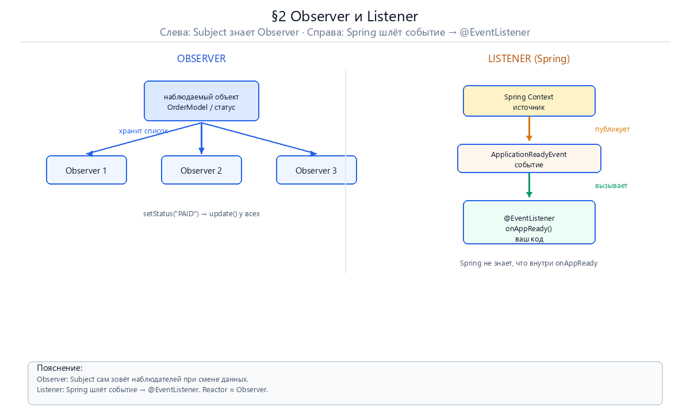
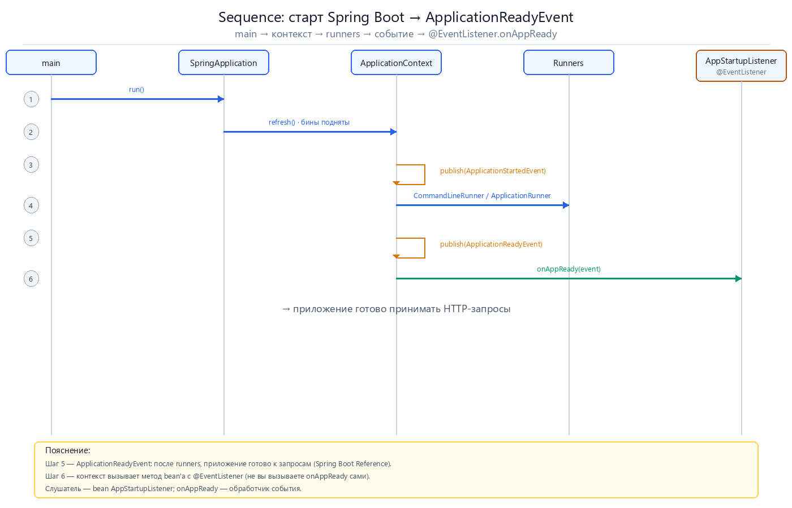

# Observer и Listener: паттерны в Java и Spring

> Отдельное руководство к [project-reactor-interview-guide.md](./project-reactor-interview-guide.md), §2.  
> **Формат:** схема → кто есть кто → как выглядит код → источник → цитата EN/RU.

**Перегенерация PNG:** `python docs/Images-docs/gen_reactor_diagrams.py`.

---

## Оглавление

1. [Observer в Java — `Observable` / `Observer`](#1-observer-в-java--observable--observer)
2. [Слушатель в Spring — `ApplicationListener` / `@EventListener`](#2-слушатель-в-spring--applicationlistener--eventlistener)
   - [Пример: `ApplicationReadyEvent`](#application-ready-event)
3. [Observer и Listener — в чём разница](#3-observer-и-listener--в-чём-разница)
4. [А где здесь Reactor?](#4-а-где-здесь-reactor)

---



**Как читать рисунок:** слева — **классический Observer** (объект **сам хранит** список наблюдателей). Справа — **события Spring** (издатель **публикует** событие, контекст **вызывает** зарегистрированные listener'ы).

> Важно: Spring в документации **называет** `ApplicationListener` «Observer design pattern», но **API и связи** другие, чем у `java.util.Observable`. Ниже — обе модели отдельно, с официальными источниками.

---

<a id="pattern-observer"></a>

## 1. Observer в Java — `Observable` / `Observer`

### Как выглядит паттерн

| Роль в GoF | В JDK (до reactive) | Что происходит |
|------------|---------------------|----------------|
| **Subject** (наблюдаемый) | `java.util.Observable` | Хранит **набор** `Observer`. При изменении состояния вызывает `setChanged()` → `notifyObservers()`. |
| **Observer** (наблюдатель) | `java.util.Observer` | Реализует `update(Observable o, Object arg)` — его вызывают **все** подписанные наблюдатели. |
| **Подписка** | `observable.addObserver(observer)` | Subject **знает** каждого Observer в своём списке. |
| **Уведомление** | `notifyObservers(arg)` | Subject **сам обходит** список и вызывает `update()` у каждого. |

**Цепочка в одну строку:** изменили данные в Subject → `notifyObservers()` → `update()` у каждого Observer.

### Минимальный пример (идея JDK)

```java

import java.util.Observable;
import java.util.Observer;

@SuppressWarnings("deprecation")
class OrderStatus extends Observable {
    private String status;

    void setStatus(String newStatus) {
        this.status = newStatus;
        setChanged();              // пометить: состояние изменилось
        notifyObservers(status);   // обойти всех Observer и вызвать update()
    }
}

class OrderLogger implements Observer {
    @Override
    public void update(Observable o, Object arg) {
        System.out.println("Статус заказа: " + arg);
    }
}

// использование:
OrderStatus subject = new OrderStatus();
subject.addObserver(new OrderLogger());
subject.setStatus("SHIPPED");
```

> `Observable` / `Observer` помечены **`@Deprecated` с Java 9** — для нового кода JDK их не рекомендует, но они остаются **каноническим примером** паттерна в Java API.

### Когда встречается сегодня

- Учебные и legacy-коды на `Observable` / `Observer`.
- **Reactor / Reactive Streams** — та же **push-идея** («источник уведомляет подписчика»), но через `Publisher` / `Subscriber` и с backpressure (§4).

**Источник:** [Oracle — `Observable` (Java SE 8)](https://docs.oracle.com/javase/8/docs/api/java/util/Observable.html) · [`Observer`](https://docs.oracle.com/javase/8/docs/api/java/util/Observer.html)

> **EN:** «This class represents an observable object … It can have one or more observers. An observer may be any object that implements interface Observer. After an observable instance changes, an application calling the Observable's notifyObservers method causes all of its observers to be notified of the change by a call to their update method.»

> **RU:** «Этот класс представляет наблюдаемый объект … У него может быть один или несколько observers. Observer — любой объект, реализующий интерфейс Observer. После изменения observable вызов notifyObservers приводит к тому, что все observers получают update.»

---

<a id="pattern-listener"></a>

## 2. Слушатель в Spring — `ApplicationListener` / `@EventListener`

### Как выглядит паттерн в Spring

Здесь **не** `addObserver()` на вашем объекте. Модель такая:

| Роль | Класс / API в Spring | Что происходит |
|------|----------------------|----------------|
| **Событие** | `ApplicationEvent` (или любой объект, с 4.2) | Объект-сообщение: «произошло X». |
| **Издатель** | `ApplicationEventPublisher` | Вызывает `publishEvent(event)` — **не** обходит список listener'ов вручную. |
| **Слушатель** | `ApplicationListener<E>` или метод с `@EventListener` | Bean в контексте; Spring **регистрирует** его и **вызывает** при совпадении типа события. |
| **Раздача** | `ApplicationEventMulticaster` (внутри контекста) | Контекст находит подходящие listener'ы и вызывает их (по умолчанию **синхронно** в потоке издателя). |

**Цепочка в одну строку:** `publishEvent(event)` → контекст / multicaster → `onApplicationEvent(event)` или метод с `@EventListener`.

### Минимальный пример (доменное событие — из документации Spring)

**1. Событие:**

```java

public class BlockedListEvent extends ApplicationEvent {
    private final String address;
    public BlockedListEvent(Object source, String address) {
        super(source);
        this.address = address;
    }
    public String getAddress() { return address; }
}
```

**2. Публикация** (сервис реализует `ApplicationEventPublisherAware`):

```java

@Service
public class EmailService implements ApplicationEventPublisherAware {
    private ApplicationEventPublisher publisher;

    @Override
    public void setApplicationEventPublisher(ApplicationEventPublisher publisher) {
        this.publisher = publisher;
    }

    public void blockAddress(String address) {
        publisher.publishEvent(new BlockedListEvent(this, address));
    }
}
```

**3. Слушатель** — стиль `ApplicationListener`:

```java

@Component
public class BlockedListNotifier implements ApplicationListener<BlockedListEvent> {
    @Override
    public void onApplicationEvent(BlockedListEvent event) {
        // реагируем на событие типа BlockedListEvent
    }
}
```

**4. Тот же слушатель** — стиль `@EventListener` (рекомендуемый):

```java

@Component
public class BlockedListNotifier {
    @EventListener
    public void onBlocked(BlockedListEvent event) {
        // Spring вызовет метод при publishEvent(BlockedListEvent)
    }
}
```

> `ApplicationListener` **extends** `java.util.EventListener` — это **Java-интерфейс-маркер** для callback-модели (Swing, servlet events и т.д.). Spring строит на нём **свой** механизм событий контекста.

**Источник:** [Spring Framework — Application Events](https://docs.spring.io/spring-framework/reference/core/beans/context-introduction.html#context-functionality-events) · [Javadoc — `ApplicationListener`](https://docs.spring.io/spring-framework/docs/current/javadoc-api/org/springframework/context/ApplicationListener.html)

> **EN:** «Event handling in the ApplicationContext is provided through the ApplicationEvent class and the ApplicationListener interface. If a bean that implements the ApplicationListener interface is deployed into the context, every time an ApplicationEvent gets published to the ApplicationContext, that bean is notified. Essentially, this is the standard Observer design pattern.» / «Interface to be implemented by application event listeners. Based on the standard EventListener interface for the Observer design pattern.»

> **RU:** «Обработка событий в ApplicationContext идёт через ApplicationEvent и ApplicationListener. Если bean с ApplicationListener развёрнут в контексте, при каждой публикации ApplicationEvent он получает уведомление. По сути, это стандартный паттерн Observer.» / «Интерфейс слушателя событий приложения. Основан на EventListener — стандартном интерфейсе для паттерна Observer.»

---

<a id="application-ready-event"></a>

### Пример: `ApplicationReadyEvent`

Типичный **Spring Boot** listener — реакция на **жизненный цикл** приложения (не Reactor).



**Цепочка:** `SpringApplication.run()` → контекст поднят → runners → **`ApplicationReadyEvent`** → ваш `@EventListener`.

```java

@Component
public class AppStartupListener {

    @EventListener(ApplicationReadyEvent.class)
    public void onAppReady(ApplicationReadyEvent event) {
        log.info("Приложение готово обслуживать запросы");
    }
}
```

| Шаг | Кто | Действие |
|-----|-----|----------|
| 1 | Spring Boot | Публикует `ApplicationReadyEvent` **после** runners |
| 2 | `ApplicationContext` | Передаёт событие multicaster'у |
| 3 | Ваш bean | Метод `onAppReady` вызывается **контекстом**, не вами |

**Источник:** [Spring Boot — Application events](https://docs.spring.io/spring-boot/reference/features/spring-application.html#features.spring-application.application-events-and-listeners) · [Javadoc — `ApplicationReadyEvent`](https://docs.spring.io/spring-boot/api/java/org/springframework/boot/context/event/ApplicationReadyEvent.html)

> **EN:** «An ApplicationReadyEvent is sent after any application and command-line runners have been called.» / «Event published as late as conceivably possible to indicate that the application is ready to service requests.»

> **RU:** «ApplicationReadyEvent отправляется после выполнения всех ApplicationRunner и CommandLineRunner.» / «Событие публикуется максимально поздно при старте — приложение готово обслуживать запросы.»

---

<a id="observer-listener-diff"></a>

## 3. Observer и Listener — в чём разница

### Две модели рядом

| | **Observer (JDK)** | **Listener (Spring Events)** |
|---|-------------------|------------------------------|
| **API** | `Observable` + `Observer` | `ApplicationEvent` + `ApplicationListener` / `@EventListener` |
| **Кто хранит подписчиков** | **Сам Subject** (`addObserver`) | **Контекст** (`ApplicationEventMulticaster`) |
| **Как уведомляют** | Subject вызывает `notifyObservers()` → `update()` | Издатель вызывает `publishEvent()` → контекст вызывает listener'ы |
| **Связь издатель ↔ получатель** | Subject **знает** список Observer | Издатель **не вызывает** listener напрямую — только публикует событие |
| **Триггер** | Изменение **состояния** объекта (`setChanged`) | Факт **события** (`BlockedListEvent`, `ApplicationReadyEvent`, …) |
| **Типичный кейс** | Модель MVC, push-потоки данных | Доменные и lifecycle-события в Spring-приложении |

### Почему Spring пишет «Observer», а мы говорим «Listener»

Spring **официально** называет `ApplicationListener` реализацией **Observer** (см. цитаты в §2). В разговорной Java/Spring речи его чаще называют **listener** — по интерфейсу `ApplicationListener` / `@EventListener` и по lineage `java.util.EventListener`.

**Практическое правило:**

- **Observer (JDK)** — «мой объект **сам ведёт** список и **сам зовёт** `update()`».
- **Listener (Spring)** — «я **публикую событие**, контекст **сам найдёт** bean'ы и **вызовет** обработчик».

---

<a id="reactor-and-observer"></a>

## 4. А где здесь Reactor?

Reactor — **не** `@EventListener` и **не** `Observable`. Это **Reactive Streams**: `Publisher` → `Subscriber`.

| Роль | В Reactor | Аналогия |
|------|-----------|----------|
| Источник | `Flux` / `Mono` | Как Subject, но шлёт **поток** `onNext` / `onError` / `onComplete` |
| Подписчик | `subscribe(...)` / `Subscriber` | Как Observer, но с протоколом **request(n)** (backpressure) |
| Спецификация | [Reactive Streams](https://www.reactive-streams.org/) → `java.util.concurrent.Flow` (Java 9+) | Стандарт JVM для асинхронных push-потоков |

```java

// Reactor: подписались на поток — не Spring Event, не Observable.addObserver
Flux.just("a", "b", "c")
    .map(String::toUpperCase)
    .subscribe(System.out::println);
```

**Источник:** [Reactor — Introduction to Reactive Programming](https://projectreactor.io/docs/core/release/reference/reactiveProgramming.html) · [Reactor — Introduction (Reactive Streams)](https://projectreactor.io/docs/core/release/reference/#intro-reactor)

> **EN:** «The reactive programming paradigm is often presented in object-oriented languages as an extension of the Observer design pattern. … In reactive streams, the equivalent … is Publisher-Subscriber. But it is the Publisher that notifies the Subscriber of newly available values as they come, and this push aspect is the key to being reactive.»

> **RU:** «Парадигму реактивного программирования в ОО-языках часто представляют как развитие паттерна Observer. … В reactive streams аналог — Publisher-Subscriber: Publisher уведомляет Subscriber о новых значениях по мере поступления; этот push-аспект и делает модель реактивной.»

**Вопрос на собеседовании:** *How does reactive programming relate to Observer vs Spring ApplicationListener?*

**Краткий ответ:** JDK Observer — push от **одного объекта** с **явным списком** observers. Spring Events — push через **контекст** и **тип события**. Reactor — push **потока данных** по контракту **Publisher / Subscriber** с backpressure; ближе к Observer по идее, дальше от Spring `@EventListener` по API и сценарию (HTTP, БД, Kafka, а не lifecycle bean'ов).

---

## Источники (сводка)

| Тема | Документ |
|------|----------|
| Observer в JDK | [Observable](https://docs.oracle.com/javase/8/docs/api/java/util/Observable.html), [Observer](https://docs.oracle.com/javase/8/docs/api/java/util/Observer.html) |
| Spring Events | [Application Events (Reference)](https://docs.spring.io/spring-framework/reference/core/beans/context-introduction.html#context-functionality-events) |
| ApplicationListener | [Javadoc](https://docs.spring.io/spring-framework/docs/current/javadoc-api/org/springframework/context/ApplicationListener.html) |
| ApplicationReadyEvent | [Spring Boot](https://docs.spring.io/spring-boot/reference/features/spring-application.html#features.spring-application.application-events-and-listeners), [Javadoc](https://docs.spring.io/spring-boot/api/java/org/springframework/boot/context/event/ApplicationReadyEvent.html) |
| Reactor | [Introduction to Reactive Programming](https://projectreactor.io/docs/core/release/reference/reactiveProgramming.html) |
