# Project Reactor: руководство и вопросы для собеседования

> Краткое руководство по **Project Reactor** для Java-разработчиков.  
> **Формат:** типичные **вопросы на собеседовании** и **простые пояснения**.
> В каждом блоке: **аналогия → рисунок → ответ → вопрос → источник → цитата**.

**Правило оформления каждого раздела:**

1. **Аналогия** → **PNG-рисунок**
2. **Ответ** — коротко, без обрывков терминов
3. **Сигнатура оператора** — отдельный блок `java` из [reactor-core](https://github.com/reactor/reactor-core) (`Mono.java` / `Flux.java`) + одна строка «что внутри»
4. **Простой пример** — отдельный блок `java` (можно `Flux.just`, без Spring)
5. **Вопрос** → источник → цитата EN/RU

**Перегенерация PNG:** `python docs/Images-docs/gen_reactor_diagrams.py`.

---

## Оглавление

1. [Что такое Project Reactor](#1-что-такое-project-reactor)
2. [Что такое реактивное программирование](#2-что-такое-реактивное-программирование)
3. [Mono и Flux — в чём разница](#3-mono-и-flux--в-чём-разница)
4. [Backpressure (обратное давление)](#4-backpressure-обратное-давление)
5. [subscribe() и block() — в чём разница](#5-subscribe-и-block--в-чём-разница)
6. [map и flatMap — когда что использовать](#6-map-и-flatmap--когда-что-использовать)
7. [subscribeOn и publishOn](#7-subscribeon-и-publishon)
8. [Schedulers — какие бывают и зачем](#8-schedulers--какие-бывают-и-зачем)
9. [Cold и Hot publishers](#9-cold-и-hot-publishers)
10. [Обработка ошибок в Reactor](#10-обработка-ошибок-в-reactor)
11. [Retry — повтор при ошибке](#11-retry--повтор-при-ошибке)
12. [Как тестировать Reactor-код (StepVerifier)](#12-как-тестировать-reactor-код-stepverifier)
13. [Project Reactor и Spring WebFlux](#13-project-reactor-и-spring-webflux)
14. [Reactor vs RxJava — кратко](#14-reactor-vs-rxjava--кратко)
15. [Когда реактивный подход уместен, а когда нет](#15-когда-реактивный-подход-уместен-а-когда-нет)
16. [Disposable и отмена подписки](#16-disposable-и-отмена-подписки)
17. [Блокирующий код внутри реактивной цепочки](#17-блокирующий-код-внутри-реактивной-цепочки)
18. [Краткая шпаргалка по операторам](#18-краткая-шпаргалка-по-операторам)
19. [share() и cache() — cold → hot](#19-share-и-cache--cold--hot)
20. [flatMap, concatMap и switchMap](#20-flatmap-concatmap-и-switchmap)
21. [Отладка реактивной цепочки](#21-отладка-реактивной-цепочки)
22. [Context — MDC и traceId между потоками](#22-context--mdc-и-traceid-между-потоками)
23. [Сводка: 30 вопросов → разделы](#23-сводка-30-вопросов--разделы)

---

## Введение

**Project Reactor** — библиотека для Java: вы описываете **цепочку шагов** над потоком данных, а не «вызвал метод — поток ждёт ответ».

> **Аналогия:** вы не носите каждую деталь по цеху — вы **навешиваете операции на конвейер** (`Mono` / `Flux`).

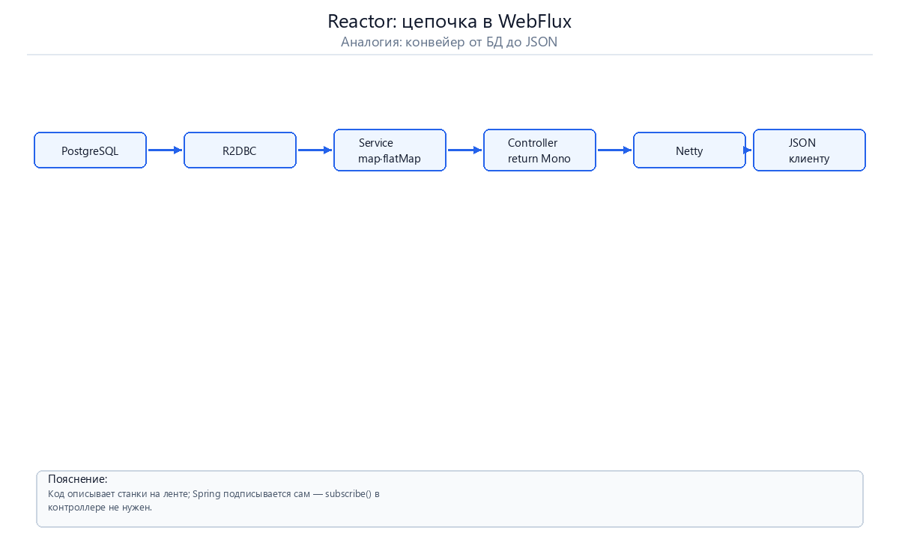


| Тип | Контейнер | Пример |
|-----|-----------|--------|
| `Mono<T>` | **один** элемент (или пусто) | `findById`, один HTTP-ответ |
| `Flux<T>` | **ноль и больше** элементов | `findAll`, список, SSE |

**Стандартное форматирование цепочки** — каждый оператор с новой строки («лесенка»):

```java

return userRepository.findById(id)
    .map(User::email)
    .map(String::toUpperCase);
```

Зависимости Maven:

```xml

<dependency>
    <groupId>io.projectreactor</groupId>
    <artifactId>reactor-core</artifactId>
</dependency>
<dependency>
    <groupId>io.projectreactor</groupId>
    <artifactId>reactor-test</artifactId>
    <scope>test</scope>
</dependency>
```

**Источник:** [Reactor 3 Reference Guide — Introduction](https://projectreactor.io/docs/core/release/reference/#intro-reactor)

> **EN:** «Reactor is a fully non-blocking reactive programming foundation for the JVM … implements the Reactive Streams specification.»

> **RU:** «Reactor — неблокирующая основа для реактивного программирования на JVM … реализует спецификацию Reactive Streams.»

---

## 1. Что такое Project Reactor

> **Аналогия из жизни:** Reactor — это **конвейер на фабрике**. Вы не таскаете каждую деталь руками до конца цеха, а **навешиваете на ленту** шаги: «прикрути → покрась → упакуй». Лента сама движется, когда её **включают** (`subscribe()` или Spring в WebFlux).

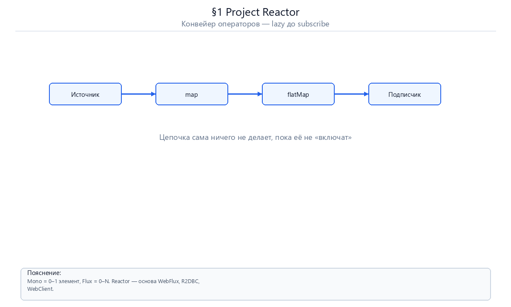


**Ответ:**

1. Java-библиотека для **неблокирующего** кода: цепочка `Mono`/`Flux` + операторы (`map`, `flatMap`, …).
2. Два типа: `Mono` (0–1 элемент), `Flux` (0–N элементов).
3. Цепочка **ленивая** — сама по себе ничего не делает, пока нет `subscribe()` (в WebFlux подписывается Spring).
4. Реализует **Reactive Streams** (протокол подписчик ↔ источник, в том числе backpressure).
5. Основа Spring WebFlux, WebClient, R2DBC.

**Вопрос:** *What is Project Reactor and how does it relate to Reactive Streams?*

**Источник:** [Reactor 3 Reference Guide](https://projectreactor.io/docs/core/release/reference/#intro-reactor)

> **EN:** «Reactor is a fully non-blocking reactive programming foundation for the JVM … Flux (for [N] elements) and Mono (for [0|1] elements) … implements the Reactive Streams specification.»

> **RU:** «Reactor — неблокирующая основа для реактивного программирования на JVM … Flux и Mono … реализует спецификацию Reactive Streams.»

---

## 2. Что такое реактивное программирование

> **Аналогия:** Обычный код — **стоите у окна** и ждёте одно письмо. Реактивный — **подписались на уведомления**: пришло → обработали → ждёте следующее.


**Ответ:**

Вы не «вызвали метод и ждёте ответ», а **описали, что делать, когда придут данные**. В Reactor это сигналы: **`onNext`** (данные), **`onError`** (ошибка), **`onComplete`** (конец).

---

### 2.1 Императивный и реактивный код — кто ждёт и где

> **Аналогия (ж/д):** **Императивно** — поезд с грузом **стоит на главном пути**, пока вагоны грузят 2 минуты; линия **занята**, остальные поезда **ждут в очереди**. **Реактивно** — вагоны отправили на **отстойный путь** (ожидание данных), **локомотив** (поток event loop) **свободен** и везёт другие составы по главной; когда груз готов — вагоны **прицепляют** и состав едет дальше (`onNext`).

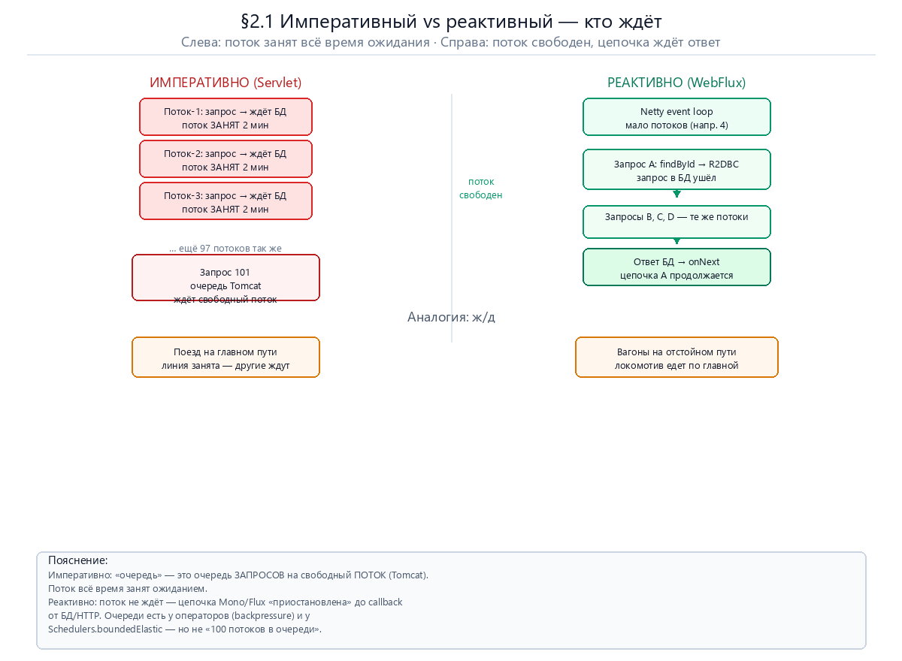

#### Императивный код (Servlet, блокирующий JDBC)

1. На **каждый HTTP-запрос** сервер выделяет **поток** из пула (Tomcat: например, 200 потоков).
2. Внутри обработчика вызываете БД или другой сервис **синхронно** — поток **стоит и ждёт** ответ (1 секунда или 2 минуты — неважно).
3. Пока поток ждёт, он **занят**: им нельзя обслужить другой запрос.
4. Если пришло **101 запрос**, а **100 потоков** уже ждут БД — **101-й попадает в очередь** Tomcat и ждёт **свободный поток**.

**Вот про какую «очередь» вы говорили в первом ответе — да, она есть, но это очередь запросов на поток, а не «умная пауза» внутри одного потока.**

```java

// Упрощённо: поток ЗАНЯТ всё время
@GetMapping("/{id}")
public User getUser(@PathVariable Long id) {
    return jdbcTemplate.queryForObject(          // поток ждёт здесь
        "SELECT … WHERE id = ?", User.class, id);
}
```

#### Реактивный код (WebFlux, R2DBC, WebClient)

1. Мало потоков **event loop** (Netty) — часто **по числу ядер**, не по числу пользователей.
2. Контроллер **возвращает** `Mono<User>` — это **описание** шагов, не готовый ответ.
3. `findById` через R2DBC **отправляет** запрос в БД **без блокировки** потока: цепочка **приостановлена**, подписка ждёт callback.
4. Тот же поток за это время обрабатывает **другие** запросы.
5. Когда БД ответила — приходит **`onNext(User)`**, цепочка **продолжается** (map, JSON, ответ клиенту).

```java

@GetMapping("/{id}")
public Mono<User> getUser(@PathVariable Long id) {
    return userRepository.findById(id);   // поток НЕ ждёт ответ БД здесь
}
```

#### Про «очереди» в реактивном программировании — что правда, что нет

| Утверждение | Верно? |
|-------------|--------|
| «Запрос встаёт в очередь, поток помнит состояние и ждёт» (как в Servlet) | **Нет** — поток **освобождается**. Состояние цепочки хранит **Reactor** (подписка + операторы), не заблокированный thread. |
| «Есть очередь запросов, когда все потоки заняты» | **В императиве — да** (Tomcat). **В WebFlux** — другая модель: много соединений на **мало** потоков. |
| «В Reactor вообще нет очередей» | **Нет** — очереди **есть**, но другие: буферы операторов (`onBackpressureBuffer`), **backpressure** (`request(n)`), очередь задач у **`Schedulers.boundedElastic()`**. Это не очередь «100 потоков ждут БД». |

**Кратко:** в реактивном коде **не блокируют поток** ради ожидания I/O; **ждёт цепочка** (`Mono`/`Flux`), а поток крутит другие дела. Когда данные пришли — подписчик получает сигнал и обработка **продолжается**.

**Источник:** [Reactor Reference — Introduction](https://projectreactor.io/docs/core/release/reference/#intro-reactor) · [Spring WebFlux — Overview](https://docs.spring.io/spring-framework/reference/web/webflux.html)

> **EN:** «Reactor is a fully non-blocking reactive programming foundation for the JVM.» / «Spring WebFlux … non-blocking I/O … reactive streams.»

> **RU:** «Reactor — полностью неблокирующая основа для JVM.» / «WebFlux … неблокирующий I/O … реактивные потоки.»

**Подробнее:** отдельный документ [Реактивный код: где ждёт запрос и где хранится состояние](./reactive-where-state-lives.md) — Event Loop, два запроса А/Б, **[§5 очередь `Queue<Runnable>` и callback](./reactive-where-state-lives.md#5-очередь-event-loop-и-контейнеры-callback)**.

---

### Паттерн Observer (Наблюдатель)

**Кто есть кто на рисунке слева:**

| Роль | Простое имя | Что делает |
|------|-------------|------------|
| **Subject** | **наблюдаемый объект** | Хранит данные (например, статус заказа). Когда данные **меняются** — сам **обходит список** подписчиков и говорит: «обновись». |
| **Observer** | **наблюдатель** | Класс, который **подписался** на Subject и получает вызов `update()` при изменении. |

**Схема:** `Subject (модель)` → **знает список** → `Observer 1`, `Observer 2` → при `setStatus(...)` вызывает `update()` у каждого.

```java

// Упрощённая идея (не production-код)
class OrderSubject {
    private final List<Observer> observers = new ArrayList<>();
    private String status;

    void addObserver(Observer o) { observers.add(o); }  // Subject ЗНАЕТ наблюдателей

    void setStatus(String newStatus) {
        this.status = newStatus;
        observers.forEach(Observer::update);           // сам уведомляет всех
    }
}
```

**Источник (Observer):** [Spring Framework — Application Events](https://docs.spring.io/spring-framework/reference/core/beans/context-introduction.html#context-functionality-events)

> **EN:** «Essentially, this is the standard Observer design pattern.»

> **RU:** «По сути, это классический паттерн Observer: Subject уведомляет подписчиков при изменении.»

---

### Паттерн Listener (Слушатель)

**Откуда пример:** это не Reactor, а **Spring Boot** — типичный способ сказать «сделай что-то **после** полного старта приложения» (прогреть кэш, проверить БД, отправить метрику).

**Кто есть кто на рисунке справа:**

| Роль | В Spring | Что делает |
|------|----------|------------|
| **Источник (publisher)** | **`ApplicationContext`** + `ApplicationEventPublisher` | В нужный момент **публикует** объект-событие в контекст. |
| **Событие** | `ApplicationReadyEvent` | Объект-сообщение: «приложение **готово обслуживать запросы**». |
| **Слушатель (listener)** | **Spring bean** — ваш `@Component` | Компонент в контексте, который **зарегистрирован** как обработчик события. |
| **Метод-обработчик** | метод с `@EventListener` | Конкретный метод bean'а, который Spring **вызовет** при событии. |

> В официальной документации Spring **слушатель** — это **bean** (`implements ApplicationListener<E>`) или **метод управляемого bean'а**, помеченный `@EventListener`. Не «метод сам по себе», а **компонент + зарегистрированный на нём обработчик**.

---

#### Что такое `ApplicationReadyEvent` и откуда он берётся

Это класс из **Spring Boot** (`org.springframework.boot.context.event.ApplicationReadyEvent`). Он **не из Reactor** — обычное **событие жизненного цикла** Spring-приложения.

**Упрощённая цепочка старта Spring Boot:**


**Смысл события (официально):** публикуется **как можно позже** при старте — когда приложение **готово обслуживать запросы** (контекст обновлён, runners выполнены).

**Схема обработки (на рисунке):** `main` → `SpringApplication.run()` → контекст поднят → `ApplicationStartedEvent` → runners → **`ApplicationReadyEvent`** → `AppStartupListener.onAppReady(...)`.

**Пример (частый кейс):** прогреть кэш, проверить внешний сервис, залогировать старт.

```java

@Component   // ← это listener-bean (компонент-слушатель в контексте)
public class AppStartupListener {

  @EventListener(ApplicationReadyEvent.class)   // ← регистрация обработчика на методе
  public void onAppReady(ApplicationReadyEvent event) {
    log.info("Spring поднялся — можно прогреть кэш или проверить БД");
    // ваш код; Spring не знает деталей — только вызывает метод при событии
  }
}
```

**Разбор по шагам:**

1. **`ApplicationReadyEvent`** — объект-событие Spring Boot: «старт завершён, можно работать».
2. **Кто публикует** — `SpringApplication` через механизм событий Spring (`ApplicationEventPublisher`), не ваш код.
3. **Кто слушает** — bean `AppStartupListener`, зарегистрированный в контексте (`@Component`).
4. **Что вызывается** — метод `onAppReady`, помеченный `@EventListener` (обработчик этого типа события).
5. **Связь** — вы **не вызываете** `onAppReady()` сами; контекст вызывает его при публикации события.

**Альтернатива (тот же смысл, старый стиль):**

```java

@Component
public class AppStartupListener implements ApplicationListener<ApplicationReadyEvent> {
  @Override
  public void onApplicationEvent(ApplicationReadyEvent event) {
    log.info("Приложение готово");
  }
}
```

Здесь слушатель — **весь класс**, реализующий `ApplicationListener<ApplicationReadyEvent>`.

> В доменном коде то же устройство: `ApplicationListener<OrderCreatedEvent>` или `@EventListener` на методе сервиса. Сервис публикует событие → слушатели реагируют. Идея одна: **реагирую на событие типа X**.

**Источник (Spring Events):** [Spring Framework — Application Events](https://docs.spring.io/spring-framework/reference/core/beans/context-introduction.html#context-functionality-events)

> **EN:** «You can register an event listener on any method of a managed bean by using the `@EventListener` annotation.» / «If a bean that implements the `ApplicationListener` interface is deployed into the context, every time an `ApplicationEvent` gets published … that bean is notified.»

> **RU:** «Слушатель можно зарегистрировать на **любом методе** управляемого bean'а через `@EventListener`.» / «Если в контекст развёрнут bean с `ApplicationListener`, он получает уведомление при каждой публикации `ApplicationEvent`.»

**Источник (`ApplicationReadyEvent`):** [Spring Boot — Application events](https://docs.spring.io/spring-boot/reference/features/spring-application.html#features.spring-application.application-events-and-listeners) · [Javadoc](https://docs.spring.io/spring-boot/api/java/org/springframework/boot/context/event/ApplicationReadyEvent.html)

> **EN:** «An `ApplicationReadyEvent` is sent after any application and command-line runners have been called.» / «Event published as late as conceivably possible to indicate that the application is ready to service requests.»

> **RU:** «`ApplicationReadyEvent` отправляется **после** выполнения всех `ApplicationRunner` и `CommandLineRunner`.» / «Событие публикуется максимально поздно при старте — приложение готово обслуживать запросы.»

---

### Observer и Listener — в чём разница

| | **Observer** | **Listener** |
|---|--------------|--------------|
| **Источник** | **Subject** — объект с **состоянием** (модель, сервис) | **Spring Context** (или другой издатель) шлёт **событие** |
| **Получатель** | **Observer** — bean/класс, «слежу за **этим объектом**» | **Listener** — **bean** в контексте (`ApplicationListener` или `@Component` с `@EventListener`) |
| **Триггер** | Изменилось **поле / состояние** (`setStatus`) | Произошло **событие** (приложение готово, заказ создан) |
| **Источник знает получателя?** | **Да** — Subject хранит список Observer | **Нет** — издатель шлёт событие; **не знает** вашу бизнес-логику внутри обработчика |
| **Где в Java / Spring** | Модели, RxJava, **Reactor** | `ApplicationListener`, `@EventListener` в **Spring** |
| **Фраза одной строкой** | «Слежу за **объектом** и его **данными**» | «Жду **событие типа X** — контекст вызовет мой обработчик» |

---

### А где здесь Reactor?

Reactor **ближе к Observer**, а не к Spring `@EventListener`:

- **`Flux` / `Mono`** — источник данных (как Subject, который шлёт `onNext`).
- **`subscribe(...)`** — вы подписались и ждёте данные (как Observer).
- Плюс **backpressure** — подписчик говорит «дай N штук» (§4). У обычного Observer такого нет.

> Reactor — **не** `@EventListener` на `ApplicationReadyEvent`. Это **поток данных** из БД, HTTP, Kafka.

**Вопрос:** *What is reactive programming? How does it relate to Observer vs Listener?*

**Источник (реактивное программирование):** [kindatechnical — Top 30 (Q1–Q2)](https://kindatechnical.com/reactive-processing/top-30-reactive-programming-interview-questions.html)

> **EN:** «Reactive programming is concerned with data streams and the propagation of change.»

> **RU:** «Реактивное программирование — потоки данных и распространение изменений.»

**Источник (Observer в Spring / Reactor):** [Spring Framework — Application Events](https://docs.spring.io/spring-framework/reference/core/beans/context-introduction.html#context-functionality-events) · [Reactor — Introduction](https://projectreactor.io/docs/core/release/reference/#intro-reactor)

> **EN:** «Essentially, this is the standard Observer design pattern.» / «Reactor … implements the Reactive Streams specification.»

> **RU:** «По сути, это классический паттерн Observer.» / «Reactor реализует спецификацию Reactive Streams (Publisher → Subscriber).»

---

## 3. Mono и Flux — в чём разница

> **Аналогия:** **`Mono`** и **`Flux`** — это **контейнеры** для данных. Контейнер **сам по себе пустой**, пока вы не **подпишетесь** (`subscribe`) или Spring не «откроет» его в WebFlux.

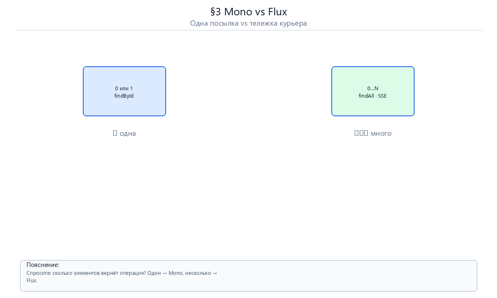

**Ответ:**

| | **Mono** | **Flux** |
|---|----------|----------|
| **Что это** | Контейнер на **один** элемент | Контейнер на **ноль и больше** элементов |
| **Внутри может быть** | один `User`, одна строка, ничего (пустой контейнер) | список `User`, много строк подряд, пусто |
| **Когда брать** | «вернётся **одна** вещь» | «вернётся **много** (или неизвестно сколько)» |

**Простыми словами:**

- **`Mono<User>`** — коробка, в которой лежит **максимум один** `User` (или коробка пустая).
- **`Flux<User>`** — коробка, в которой лежит **0, 1, 2, 3…** пользователей подряд.

**Как выбрать за 5 секунд:** спросите себя — «сколько результатов жду?» **Один** → `Mono`. **Несколько или поток** → `Flux`.

**Пример:**

```java

// одна запись из БД → Mono (контейнер на 1)
Mono<User> one = userRepository.findById(1L);

// все записи → Flux (контейнер на много)
Flux<User> many = userRepository.findAll();
```

**Важно:** контейнер **ленивый** — данные появятся только когда цепочку **запустят** (см. §5). В WebFlux это делает Spring, не вы.

**Вопрос:** *What is the difference between Mono and Flux in Project Reactor?*

**Источник:** [Reactor Core Features](https://projectreactor.io/docs/core/release/reference/coreFeatures.html)

> **EN:** «A Flux represents 0..N items, while a Mono represents a single-value-or-empty (0..1) result.»

> **RU:** «Flux — от нуля до многих элементов. Mono — один элемент или пусто.»

---

## 4. Backpressure (обратное давление)

> **Аналогия:** Официант приносит **порциями по три** блюда — вы съели → просите ещё три. Не вываливает все 50 тарелок сразу.

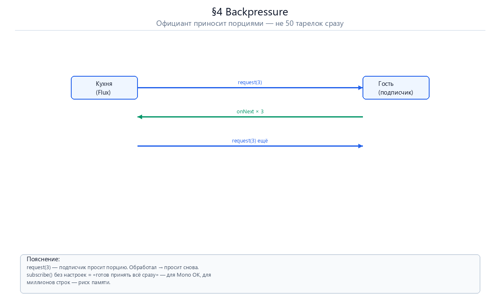

**Ответ:**

1. Источник может отдавать данные **быстрее**, чем вы обрабатываете.
2. Подписчик через **`Subscription.request(n)`** говорит: «готов принять **n** штук».
3. Простой **`subscribe()`** внутри запрашивает «сколько угодно» (`Long.MAX_VALUE`). Для **`Mono`** — OK. Для миллионов строк **`Flux`** — риск памяти → нужны операторы ниже.

---

### `limitRate` — просить порциями

**Исходник** (`Flux.java`):

```java

/**
 * Ensure that backpressure signals from downstream subscribers are capped
 * at the provided prefetchRate.
 */
public final Flux<T> limitRate(int prefetchRate) {
    return onAssembly(this.publishOn(Schedulers.immediate(), prefetchRate));
}
```

**Пояснение:** downstream не сможет запросить больше `prefetchRate` элементов за раз — источник отдаёт **порциями**.

**Пример:**

```java

Flux.range(1, 1_000_000)
    .limitRate(10)                    // не больше 10 за запрос
    .doOnNext(n -> System.out.println(n))
    .blockLast();
// в логе видно: запросы идут порциями, а не «все миллион сразу»
```

---

### `onBackpressureBuffer` — склад для лишнего

**Исходник** (`Flux.java`):

```java

/**
 * Request an unbounded demand and push to the returned Flux, or park elements
 * when not enough demand is requested downstream.
 */
public final Flux<T> onBackpressureBuffer() {
    return onAssembly(new FluxOnBackpressureBuffer<>(this,
        Queues.SMALL_BUFFER_SIZE, true, null));
}

public final Flux<T> onBackpressureBuffer(int maxSize) {
    return onAssembly(new FluxOnBackpressureBuffer<>(this, maxSize, false, null));
}
```

**Пояснение:** если потребитель отстаёт — элементы **складываются в буфер** (ограниченный `maxSize` или нет).

**Пример:**

```java

Flux.interval(Duration.ofMillis(1))     // источник быстрый
    .onBackpressureBuffer(100)           // склад максимум 100 значений
    .delayElements(Duration.ofSeconds(1)) // обработка медленная
    .take(5)
    .blockLast();
```

---

### `onBackpressureDrop` — лишнее выбросить

**Исходник** (`Flux.java`):

```java

/** Drop observed elements if not enough demand is requested downstream. */
public final Flux<T> onBackpressureDrop() {
    return onAssembly(new FluxOnBackpressureDrop<>(this));
}
```

**Пояснение:** нет места / нет demand → элемент **отбрасывается** (актуально, когда важнее **последнее** значение, а не все подряд).

**Пример:**

```java

Flux.range(1, 100)
    .onBackpressureDrop()
    .map(n -> { Thread.sleep(100); return n; })  // медленный потребитель
    .take(3)
    .collectList()
    .block();
// часть чисел потеряна — это ожидаемо
```

---

### `onBackpressureLatest` — только последнее

**Исходник** (`Flux.java`):

```java

/** Keep only the most recent observed item if not enough demand downstream. */
public final Flux<T> onBackpressureLatest() {
    return onAssembly(new FluxOnBackpressureLatest<>(this));
}
```

**Пояснение:** пока вы заняты, источник **перезаписывает** значение — вы получите **самое свежее**.

**Пример:**

```java

Flux.interval(Duration.ofMillis(10))
    .onBackpressureLatest()
    .map(n -> { Thread.sleep(500); return n; })
    .take(2)
    .collectList()
    .block();
// номера «перескакивают» — в списке не 0,1,2,3… а большие числа
```

---

### `subscribe()` и unbounded request

**Исходник** (`Mono.java`):

```java

/**
 * Subscribe a Consumer to this Mono …
 * It will request an unbounded demand (Long.MAX_VALUE).
 */
public final Disposable subscribe(Consumer<? super T> consumer) {
    return subscribe(consumer, null, null);
}
```

**Пояснение:** «unbounded» = подписчик сразу говорит источнику «отдай всё, что можешь». Для **одного** элемента (`Mono.just("a")`) это безопасно.

**Вопрос:** *What is backpressure? When do you use limitRate vs onBackpressureBuffer vs drop?*

**Источник:** [Reactor — Backpressure](https://projectreactor.io/docs/core/release/reference/#backpressure)

> **EN:** «Consumer pressure is propagated back to the source by sending a request to the upstream operator.»

> **RU:** «Потребитель через request сообщает источнику, сколько элементов готов принять.»

---

## 5. subscribe() и block() — в чём разница

> **Аналогия из жизни:** **`subscribe()`** — включили **Netflix** и занялись своими делами; сериал идёт **фоном**. **`block()`** — **замёрли перед экраном** до финала серии; ничего другого в этот момент не делаете.

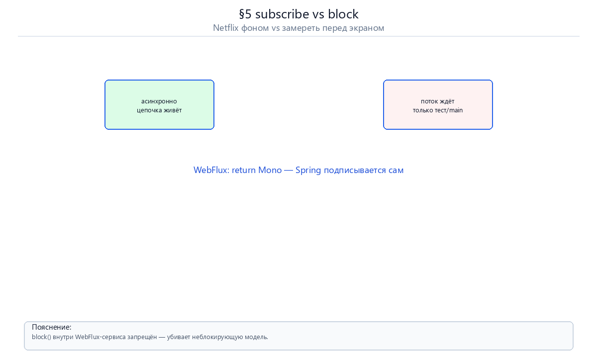


**Ответ:**

1. **`subscribe()`** — запуск в фоне; поток **не блокируется**.
2. **`block()`** — текущий поток **ждёт** результат. Только тест / `main`. **Не** в WebFlux.
3. **WebFlux:** `return Mono/Flux` — подписывается Spring.

---

### `subscribe()` — исходник

```java

// Mono.java — запрос без лимита (Long.MAX_VALUE)
public final Disposable subscribe(Consumer<? super T> consumer) {
    return subscribe(consumer, null, null);
}

public final void subscribe(Subscriber<? super T> actual) {
    // … цепочка операторов, в конце LambdaMonoSubscriber
}
```

**Пояснение:** `subscribe()` **запускает** цепочку и сразу возвращает `Disposable` — управление возвращается в ваш код.

**Пример:**

```java

Disposable d = Mono.just("hello")
    .doOnNext(System.out::println)
    .subscribe();
// println может выполниться чуть позже; d.dispose() — отмена
```

---

### `block()` — исходник

```java

// Mono.java
public @Nullable T block() {
    BlockingMonoSubscriber<T> subscriber = new BlockingMonoSubscriber<>(context);
    subscribe((Subscriber<T>) subscriber);
    return subscriber.blockingGet();   // поток ЗДЕСЬ ждёт
}
```

**Пояснение:** внутри `block()` всё равно вызывается `subscribe()`, но **текущий поток блокируется** до `onNext` / `onComplete` / `onError`.

**Пример (только тест):**

```java

String value = Mono.just("hello")
    .map(String::toUpperCase)
    .block();          // OK в тесте
// value == "HELLO"
```

---

### WebFlux — без subscribe/block

```java

@GetMapping("/{id}/email")
public Mono<String> getEmail(@PathVariable Long id) {
    return userRepository.findById(id)
        .map(User::email);
}
```

**Вопрос:** *What is the difference between block() and subscribe()?*

**Источник:** [Reactor — Backpressure / subscribing](https://projectreactor.io/docs/core/release/reference/#backpressure)

> **EN:** «subscribe() and block(), blockFirst(), blockLast() immediately trigger an unbounded request of Long.MAX_VALUE.»

> **RU:** «subscribe() и block() сразу запрашивают неограниченное количество элементов (Long.MAX_VALUE).»

---

## 6. map и flatMap — когда что использовать

> **Аналогия из жизни:** На конвейере лежит **яблоко** (`User`).
> - **`map`** — вы **снимаете кожуру** на месте: яблоко → очищенное яблоко → дольки. Объект уже в руках.
> - **`flatMap`** — вам дали **закрытую коробку с наклейкой «внутри яблоко»** (`Mono<User>`). **`map`** положит **саму коробку** на ленту. **`flatMap`** **откроет** коробку и положит **яблоко**.

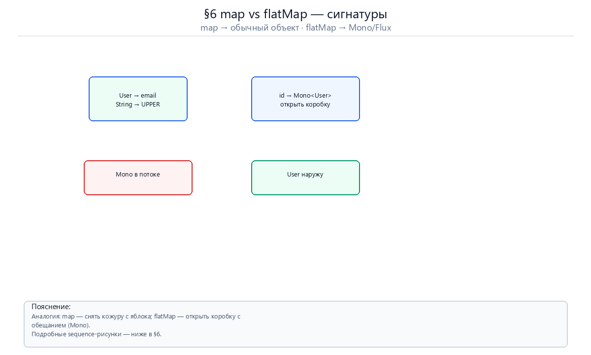


**Ответ:** смотрите **сигнатуру** — что возвращает лямбда: **обычный объект** → `map`, **`Mono`/`Flux`** → `flatMap`.

---

### `Mono.map` — исходник

```java

// Mono.java
/**
 * Transform the item emitted by this Mono by applying a synchronous function to it.
 */
public final <R> Mono<R> map(Function<? super T, ? extends R> mapper) {
    return onAssembly(new MonoMap<>(this, mapper));
}
```

**Пояснение:** `mapper` получает **готовый `T`** (User) и возвращает **`R`** (String). Внутри — класс `MonoMap`, синхронный вызов `mapper.apply(t)`.

**Пример:**

```java

Mono.just(new User(1L, "ann@example.com"))
    .map(User::email)              // User → String
    .map(String::toUpperCase);     // String → String
// Mono<String> "ANN@EXAMPLE.COM"
```

---

### `Flux.map` — исходник

```java

// Flux.java
/**
 * Transform the items emitted by this Flux by applying a synchronous function to each item.
 */
public final <R> Flux<R> map(Function<? super T, ? extends R> mapper) {
    return onAssembly(new FluxMap<>(this, mapper));
}
```

**Пояснение:** то же, что `Mono.map`, но для **каждого** элемента потока.

**Пример:**

```java

Flux.just("a", "b", "c")
    .map(String::toUpperCase)
    .collectList()
    .block();   // [A, B, C]
```

---

### `Mono.flatMap` — исходник

```java

// Mono.java
/**
 * Transform the item emitted by this Mono asynchronously, returning the value
 * emitted by another Mono (possibly changing the value type).
 */
public final <R> Mono<R> flatMap(
        Function<? super T, ? extends Mono<? extends R>> transformer) {
    return onAssembly(new MonoFlatMap<>(this, transformer));
}
```

**Пояснение:** лямбда возвращает **`Mono<R>`** — Reactor **подписывается** на inner-Mono и «разворачивает» результат (`MonoFlatMap`).

**Пример:**

```java

Mono.just(1L)
    .flatMap(id -> userRepository.findById(id))  // Long → Mono<User>
    .map(User::email);
// Mono<String>
```

---

### `Flux.flatMap` — исходник

```java

// Flux.java
/**
 * Transform elements into Publishers, then flatten through merging (interleaved).
 */
public final <R> Flux<R> flatMap(
        Function<? super T, ? extends Publisher<? extends R>> mapper) {
    return flatMap(mapper, Queues.SMALL_BUFFER_SIZE, Queues.XS_BUFFER_SIZE);
}

public final <R> Flux<R> flatMap(
        Function<? super T, ? extends Publisher<? extends R>> mapper,
        int concurrency, int prefetch) {
    return flatMap(mapper, false, concurrency, prefetch);
}
```

**Пояснение:** `Publisher` = `Mono` или `Flux`. Inner-потоки **могут идти параллельно** и **переплетаться** (`FluxFlatMap`).

**Пример:**

```java

Flux.just(1L, 2L)
    .flatMap(id -> userRepository.findById(id))   // id → Mono<User>
    .map(UserResponse::from);
// Flux<UserResponse>
```

---

### `Flux.concatMap` — исходник (порядок)

```java

// Flux.java
/**
 * Flatten inner publishers sequentially, preserving order (concatenation).
 */
public final <R> Flux<R> concatMap(
        Function<? super T, ? extends Publisher<? extends R>> mapper) {
    return onAssembly(new FluxConcatMapNoPrefetch<>(this, mapper,
        FluxConcatMap.ErrorMode.IMMEDIATE));
}
```

**Пояснение:** inner-потоки **строго по очереди** — id=1 полностью, потом id=2. Подробнее §20.

---

### Одно правило

| Что пишете в лямбде после `->` | Оператор |
|--------------------------------|----------|
| `user.email()`, `UserResponse.from(u)`, `"hello"` | **`map`** |
| `userRepository.findById(id)`, `webClient.get()…bodyToMono(...)` | **`flatMap`** |

**Не путайте:** «можно ли вызвать БД в map» — можно, но если метод репозитория возвращает **`Mono<User>`**, в `map` вы кладёте в поток **сам Mono**, а не User. Reactor **не подписывается** на него автоматически. Нужен **`flatMap`**.

---

### Пример 1: `map` — данные уже есть, только преобразуем

`findById` уже вернул `User`. Дальше — поля в памяти:
```java

// UserService.java
return userRepository.findById(id)
    .map(User::email)
    .map(String::toUpperCase);
```


**На диаграмме:** один SQL → User в памяти → два `map` → JSON. БД больше не вызывается.

**Проверка:** `curl http://localhost:8081/api/users/1/email-upper` → `"ANN@EXAMPLE.COM"`

---

### Пример 2: `map` — ошибка, если репозиторий возвращает Mono

`findById` возвращает **`Mono<User>`**, не `User`:
```java

// ❌ Flux<Mono<User>> — в поток попали «коробки» Mono, не User
return Flux.fromIterable(ids)
    .map(userRepository::findById);
```
```java

// ❌ Mono<Flux<Order>> — заказы не загрузились
return userRepository.findById(id)
    .map(user -> orderRepository.findByUserId(user.id()));
```
**Правильно:**

```java

// ✅ UserService.getUserSummary
return userRepository.findById(id)
    .flatMap(user -> orderRepository.findByUserId(user.id())
        .collectList()
        .map(orders -> UserSummaryResponse.of(user, orders)));
```
| Строка | Оператор | Почему |
|--------|----------|--------|
| `findById` | — | вернул `Mono<User>` |
| `flatMap(… findByUserId …)` | **flatMap** | `findByUserId` → `Flux<Order>` |
| `map(orders -> …)` | **map** | DTO — обычный объект |

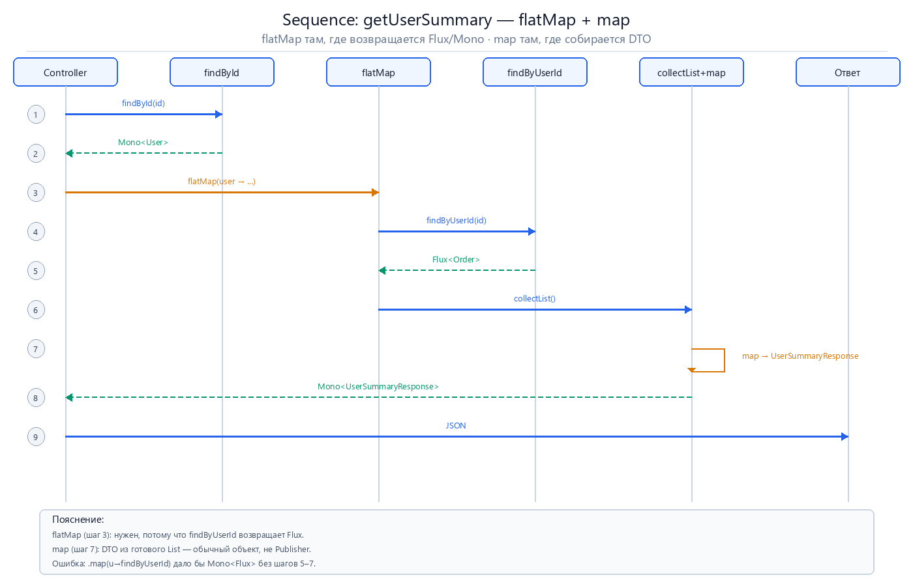

**Проверка:** `curl http://localhost:8081/api/users/1/summary`

---

### Пример 3: `map` vs `flatMap` на одном findById

**Ошибка (`map`):**

```java

// ReactorDemoService.java
return Flux.fromIterable(ids)
    .map(userRepository::findById);
```
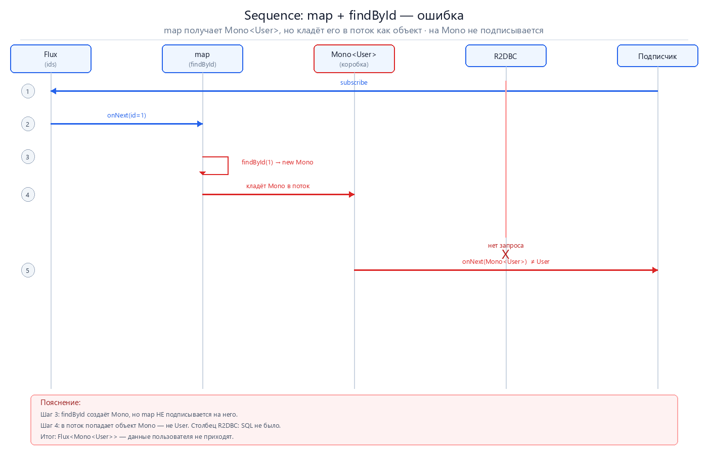

**SQL не уходит** — в потоке лежит объект `Mono`, а не `User`.

**Правильно (`flatMap`):**

```java

return Flux.fromIterable(ids)
    .flatMap(userRepository::findById)
    .map(UserResponse::from);
```
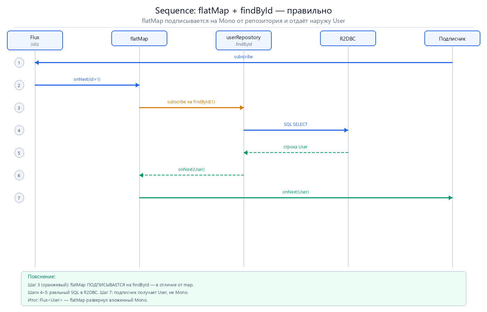

**Проверка:**

```bash

curl "http://localhost:8081/api/demo/reactor/compare?ids=1,2"
curl "http://localhost:8081/api/demo/reactor/users?ids=1,2"
```
---

### Пример 4: WebClient — тот же принцип

HTTP-вызов возвращает `Mono` → нужен `flatMap`:

```java

return Flux.fromIterable(orderIds)
    .flatMap(id -> webClient.get()
        .uri("/orders/{id}", id)
        .retrieve()
        .bodyToMono(Order.class));
```
---

### `flatMap` vs `concatMap` — порядок

`flatMap` — запросы могут идти **параллельно**, порядок ответов не гарантирован:
```java

Flux.fromIterable(ids)
    .flatMap(userRepository::findById);
```
`concatMap` — **строго по очереди** (1, потом 2, потом 3):
```java

Flux.fromIterable(ids)
    .concatMap(userRepository::findById);
```
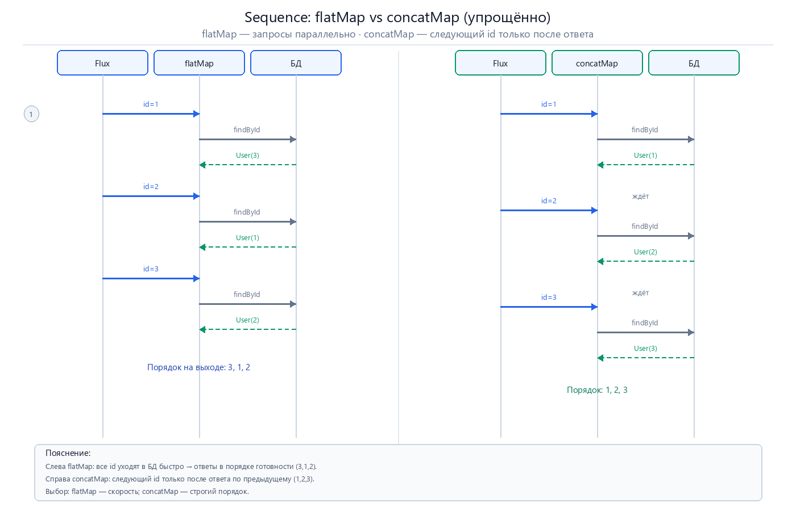

**Проверка в reactive-demo:**

```bash

curl "http://localhost:8081/api/demo/reactor/users?ids=1,2,3"
curl "http://localhost:8081/api/demo/reactor/users-concat?ids=1,2,3"
```
---

### Шпаргалка

| Ситуация | Оператор |
|----------|----------|
| Преобразовать поле, строку, DTO | `map` |
| Метод возвращает `Mono` или `Flux` | `flatMap` |
| `Flux` внутри `Mono` | `flatMapMany` (см. ниже) |
| Нужен порядок как у id | `concatMap` |

### `flatMapMany` — исходник

```java

// Mono.java — Mono → Flux (развернуть inner-Flux)
public final <R> Flux<R> flatMapMany(
        Function<? super T, ? extends Publisher<? extends R>> mapper) {
    return Flux.onAssembly(new MonoFlatMapMany<>(this, mapper));
}
```

**Пример:**

```java

Mono.just(userId)
    .flatMapMany(id -> orderRepository.findByUserId(id));
// Flux<Order>
```

**Вопрос:** *What is the difference between map and flatMap in Project Reactor?*

**Источник:** [Reactor — which operator](https://projectreactor.io/docs/core/release/reference/#which-operator)

> **EN:** «map applies a function returning a new element; flatMap applies a function that returns a Publisher, merging elements into a single output stream.»

> **RU:** «map возвращает новый элемент; flatMap — Publisher, элементы которого сливаются в один поток.»

---

## 7. subscribeOn и publishOn

> **Аналогия из жизни:** **`subscribeOn`** — **в каком цехе включают конвейер** (у источника). **`publishOn`** — **на какой ленте работают следующие станки** после развилки. Один заказ может начаться на складе, а упаковка — в другом зале.

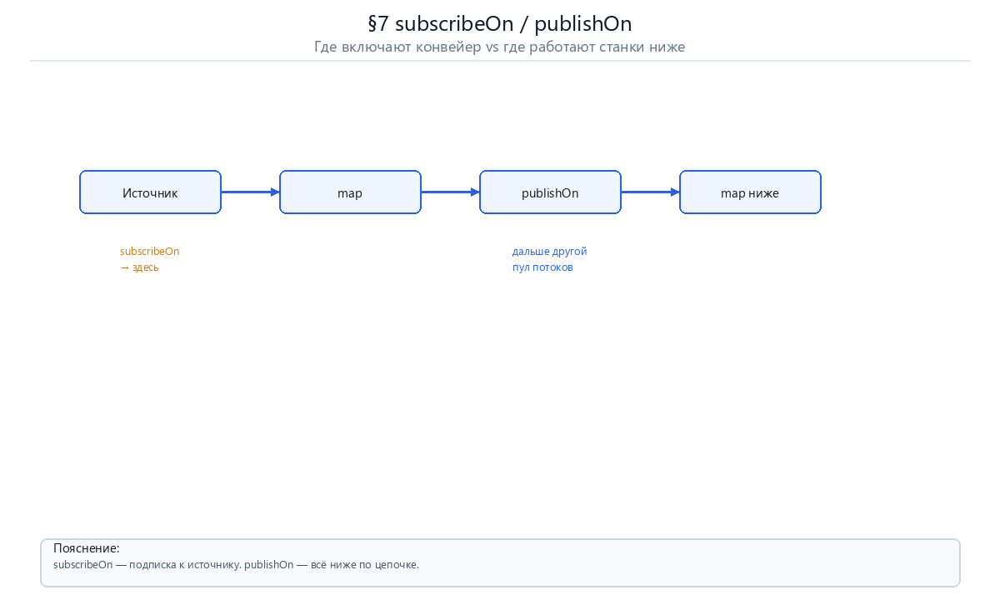


**Ответ:** оба переносят код на другой **Scheduler**, но в **разное место** цепочки.

---

### `subscribeOn` — исходник

```java

// Mono.java — подписка к источнику на указанном Scheduler
public final Mono<T> subscribeOn(Scheduler scheduler) {
    return onAssembly(new MonoSubscribeOn<>(this, scheduler));
}
```

**Пояснение:** **где выполняется подписка** к upstream (часто — блокирующий источник на `boundedElastic`).

**Пример:**

```java

Mono.fromCallable(() -> slowJdbcQuery())
    .subscribeOn(Schedulers.boundedElastic())
    .map(this::toDto);
```

---

### `publishOn` — исходник

```java

// Mono.java — всё НИЖЕ по цепочке на указанном Scheduler
public final Mono<T> publishOn(Scheduler scheduler) {
    return onAssembly(new MonoPublishOn<>(this, scheduler));
}

// Flux.java — с prefetch
public final Flux<T> publishOn(Scheduler scheduler, int prefetch) {
    return onAssembly(new FluxPublishOn<>(this, scheduler, true, prefetch));
}
```

**Пояснение:** **переключает поток** для операторов **после** `publishOn` (позиция важна).

**Пример:**

```java

Flux.just(1)
    .map(x -> x + 1)                              // поток A
    .publishOn(Schedulers.parallel())             // дальше — поток B
    .map(x -> x * 2)                              // поток B
    .subscribeOn(Schedulers.boundedElastic())     // источник — elastic
    .subscribe();
```

**Вопрос:** *What is the difference between subscribeOn and publishOn?*

**Источник:** [Reactor — Schedulers](https://projectreactor.io/docs/core/release/reference/coreFeatures/schedulers.html)

> **EN:** «publishOn applies in the middle of the subscriber chain … subscribeOn applies to the subscription process.»

> **RU:** «publishOn — в середине цепочки … subscribeOn — к процессу подписки.»

---

## 8. Schedulers — какие бывают и зачем

> **Аналогия из жизни:** **Scheduler** — **бригады рабочих**. `parallel()` — математики за столами (CPU). `boundedElastic()` — грузчики для тяжёлых коробок (JDBC, файлы). Нельзя просить математика **час стоять у закрытого сейфа** (`block()` на `parallel()`).

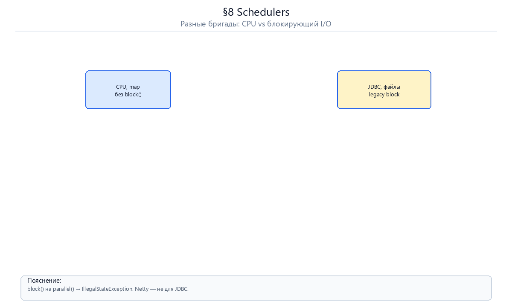


**Ответ:**

`Scheduler` — пул потоков для выполнения вашего кода.

| Scheduler | Для чего | Нельзя |
|-----------|----------|--------|
| `immediate()` | Текущий поток | — |
| `parallel()` | CPU (вычисления) | `block()`, JDBC |
| `boundedElastic()` | Блокирующий I/O (JDBC, файлы) | Долгие CPU-циклы |
| `single()` | Один фоновый поток | `block()`, нагрузка |

```java

Mono.fromCallable(() -> jdbcTemplate.queryForObject(...))
    .subscribeOn(Schedulers.boundedElastic());
```
**Вопрос:** *What are Schedulers in Project Reactor?*

**Источник:** [Reactor — Schedulers](https://projectreactor.io/docs/core/release/reference/coreFeatures/schedulers.html)

> **EN:** «boundedElastic is a handy way to give a blocking process its own thread … block() inside parallel() results in IllegalStateException.»

> **RU:** «boundedElastic — для блокирующего кода … block() в parallel() → IllegalStateException.»

---

## 9. Cold и Hot publishers

> **Аналогия из жизни:** **Cold** — **Netflix по запросу**: каждый зритель нажал Play → фильм **начался с начала** для него. **Hot** — **прямой эфир радио**: включился на 15-й минуте — **прошлое не перемотаешь**.

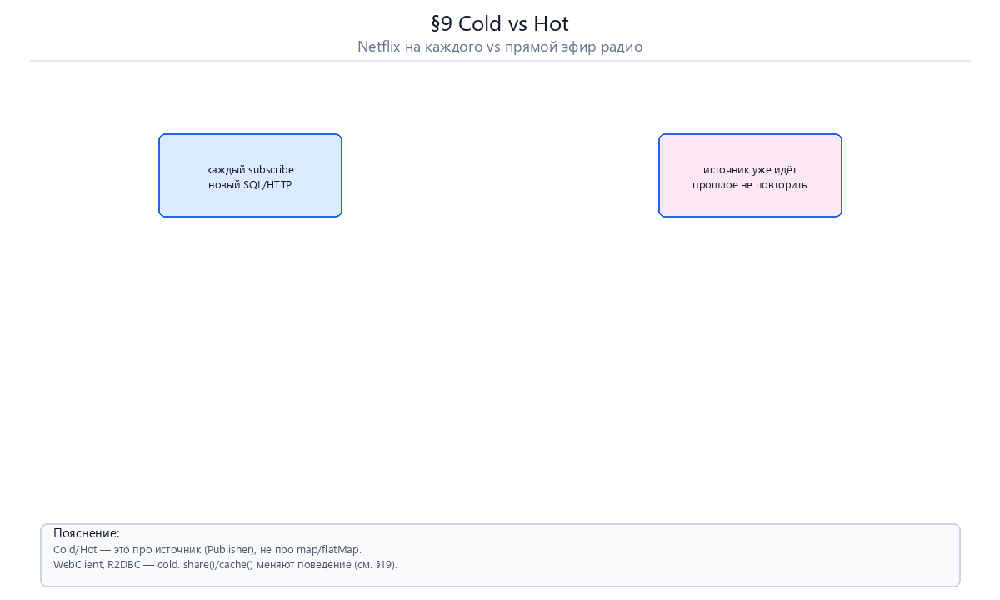


**Ответ:**

> **Важно:** **cold / hot** — это про **источник данных (Publisher)**, а **не** про операторы `map` / `flatMap`.

| | **Cold (холодный)** | **Hot (горячий)** |
|---|---------------------|-------------------|
| **Аналогия** | Netflix: каждый нажал Play → фильм **с начала** | Радио-эфир: включился на 15-й минуте → **прошлое не вернуть** |
| **Подписка** | Каждый `subscribe()` → **новый** SQL / HTTP | Источник **уже работает**; опоздавший не видит старое |
| **Примеры** | `WebClient.get()`, R2DBC `findAll()` | `Flux.interval`, WebSocket, SSE после старта |
| **Как сделать hot** | — | `share()`, `publish().refCount()`, `cache()` (см. §19) |

**Вопрос:** *Explain cold vs hot publishers. How do share() and cache() differ?*

**Источник:** [Reactor — Hot vs Cold](https://projectreactor.io/docs/core/release/reference/#intro-reactive)

> **EN:** «A Cold sequence starts anew for each Subscriber … A Hot sequence does not start from scratch for each Subscriber.»

> **RU:** «Cold стартует заново для каждого подписчика … Hot — нет.»

---

## 10. Обработка ошибок в Reactor

> **Аналогия из жизни:** Конвейер — **красная лампа** (`onError`). Пока не нажмёте «аварийный сценарий», лента **стоит**. `onErrorReturn` — подставить **заглушку**. `onErrorResume` — **переключить на запасной конвейер**.

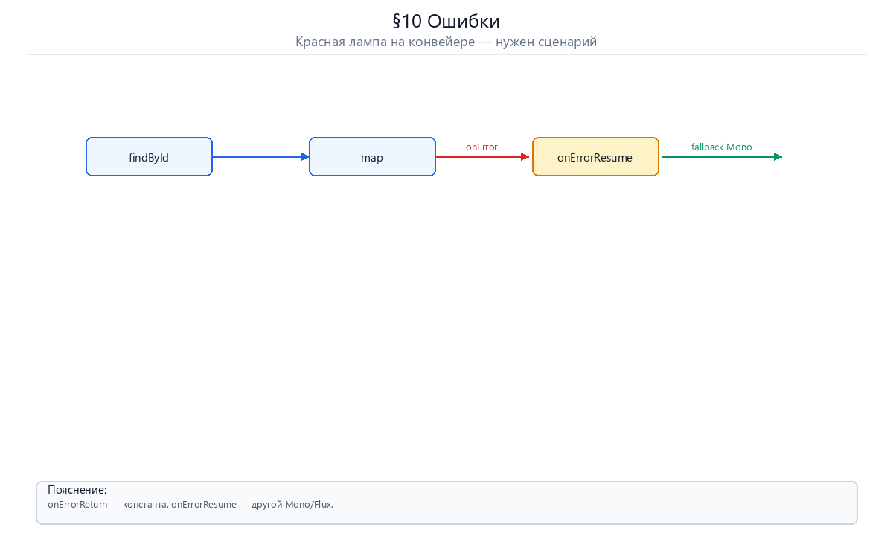


**Ответ:** ошибка = сигнал `onError`. Пока не обработаете — цепочка **останавливается**.

---

### `onErrorReturn` — исходник

```java

// Mono.java — подставить константу при любой ошибке
public final Mono<T> onErrorReturn(final T fallbackValue) {
    return onAssembly(new MonoOnErrorReturn<>(this, null, fallbackValue));
}
```

**Пример:**

```java

Mono.error(new RuntimeException("fail"))
    .onErrorReturn("default")
    .block();   // "default"
```

---

### `onErrorResume` — исходник

```java

// Mono.java — переключиться на другой Mono
public final Mono<T> onErrorResume(
        Function<? super Throwable, ? extends Mono<? extends T>> fallback) {
    return onAssembly(new MonoOnErrorResume<>(this, fallback));
}
```

**Пример:**

```java

userRepository.findById(id)
    .map(UserResponse::from)
    .onErrorResume(e -> Mono.just(UserResponse.empty()));
```

---

### `switchIfEmpty` — исходник (404 / «не найдено»)

```java

// Mono.java
public final Mono<T> switchIfEmpty(Mono<? extends T> alternate) {
    return onAssembly(new MonoSwitchIfEmpty<>(this, alternate));
}
```

**Пример:**

```java

userRepository.findById(id)
    .switchIfEmpty(Mono.error(new ResponseStatusException(NOT_FOUND)));
```

**Вопрос:** *How do you handle errors in Project Reactor?*

**Источник:** [Reactor — error handling](https://projectreactor.io/docs/core/release/reference/#error.handling)

> **EN:** «onErrorReturn, onErrorResume, and onErrorMap handle errors by returning a default value, switching streams, or transforming the error.»

> **RU:** «onErrorReturn, onErrorResume, onErrorMap — значение по умолчанию, другой поток или преобразование исключения.»

---

## 11. Retry — повтор при ошибке

> **Аналогия из жизни:** **`retry`** — **перезвонить**, если линия занята: не «дожимать трубку», а **набрать номер заново** (новая подписка на upstream).

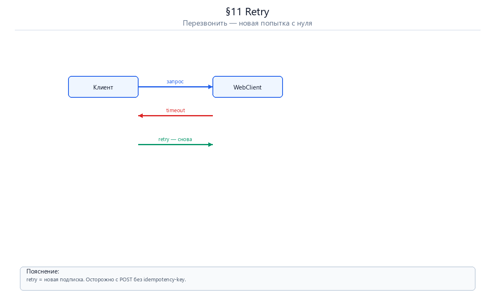


**Ответ:** `retry` = **новая подписка** на upstream с нуля. Осторожно с POST без idempotency-key.

---

### `retry` — исходник

```java

// Mono.java — повтор при onError
public final Mono<T> retry() {
    return retry(Long.MAX_VALUE);
}

public final Mono<T> retry(long numRetries) {
    return onAssembly(new MonoRetry<>(this, numRetries));
}

public final Mono<T> retryWhen(Retry retrySpec) {
    return onAssembly(new MonoRetryWhen<>(this, retrySpec));
}
```

**Пояснение:** `MonoRetry` заново подписывается на исходный Mono при ошибке.

**Пример:**

```java

Mono.fromCallable(this::flakyCall)
    .retry(3)
    .block();

Mono.fromCallable(this::flakyCall)
    .retryWhen(Retry.backoff(3, Duration.ofSeconds(1)))
    .block();
```

**Вопрос:** *How do you implement retry logic in Reactor?*

**Источник:** [Reactor — retry](https://projectreactor.io/docs/core/release/reference/#error.handling)

> **EN:** «It works by re-subscribing to the upstream Flux.»

> **RU:** «retry работает через повторную подписку на upstream.»

---

## 12. Как тестировать Reactor-код (StepVerifier)

> **Аналогия из жизни:** **StepVerifier** — **чек-лист курьера**: «ожидаю посылку "a" → ожидаю "b" → конец маршрута». Без чек-листа вы не знаете, приехало ли уже или ещё в пути.

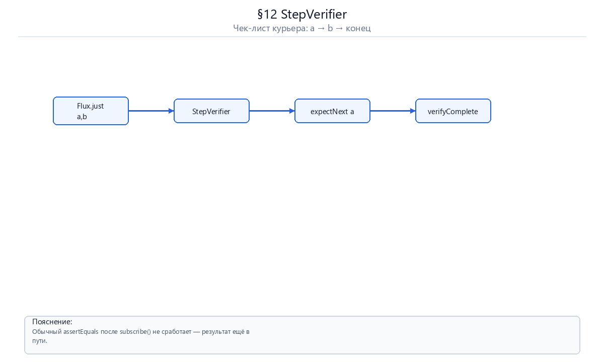


**Ответ:**

Reactive-код асинхронный — обычный `assertEquals` сразу после `subscribe()` не сработает.

```java

StepVerifier.create(Flux.just("a", "b"))
    .expectNext("a")
    .expectNext("b")
    .verifyComplete();
```
1. `expectNext(value)` — ожидаем элемент.
2. `expectError(SomeException.class)` — ожидаем ошибку.
3. `verifyComplete()` / `verify()` — завершение проверки.
4. Для `delayElements`, `timeout` — `StepVerifier.withVirtualTime(...)`.
5. Зависимость: `reactor-test`.

**Вопрос:** *How do you test reactive streams with StepVerifier?*

**Источник:** [Reactor — Testing](https://projectreactor.io/docs/core/release/reference/#testing)

> **EN:** «Testing that a sequence follows a given scenario, step-by-step, with StepVerifier.»

> **RU:** «Проверка сценария по шагам с помощью StepVerifier.»

---

## 13. Project Reactor и Spring WebFlux

> **Аналогия из жизни:** **WebFlux** — **ресторан с одной умной кассой**: официант (контроллер) **не готовит сам**, а передаёт **заказ-цепочку** (`Mono`) на кухню (сервис → R2DBC). Касса **сама ждёт** готовность — вам не нужно стоять у плиты (`subscribe()` / `block()`).

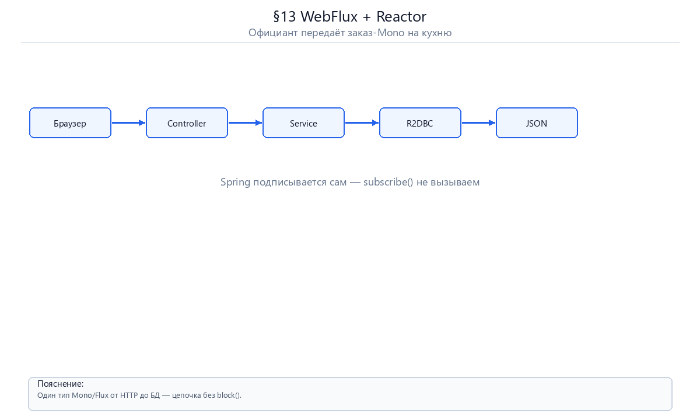


**Ответ:**

1. WebFlux построен на Reactor — везде `Mono`/`Flux`.
2. Контроллер **return Mono/Flux** — `subscribe()` не вызываете.
3. WebClient и R2DBC тоже возвращают `Mono`/`Flux` — цепочка без `block()`:

```java

return userRepository.findById(id)
    .flatMap(u -> paymentClient.getStatus(u.getPaymentId()));
```
4. MVC: поток на запрос, часто блокирует JDBC. WebFlux: мало потоков Netty — **если** нет `block()` в цепочке.
5. Простой CRUD на JDBC — чаще MVC + virtual threads (Java 21+).

**Вопрос:** *How does Project Reactor integrate with Spring WebFlux?*

**Источник:** [Baeldung — Reactor Core](https://www.baeldung.com/reactor-core)

> **EN:** «Spring WebFlux … reactive programming in Spring Boot.»

> **RU:** «Spring WebFlux … реактивное программирование в Spring Boot.»

---

## 14. Reactor vs RxJava — кратко

> **Аналогия из жизни:** Две марки **электроинструментов** с похожими насадками: **Reactor** — набор **в мастерской Spring**. **RxJava** — часто в **Android** и старых Java-проектах. Задача одна (крутить гайки), бренд и коробка разные.

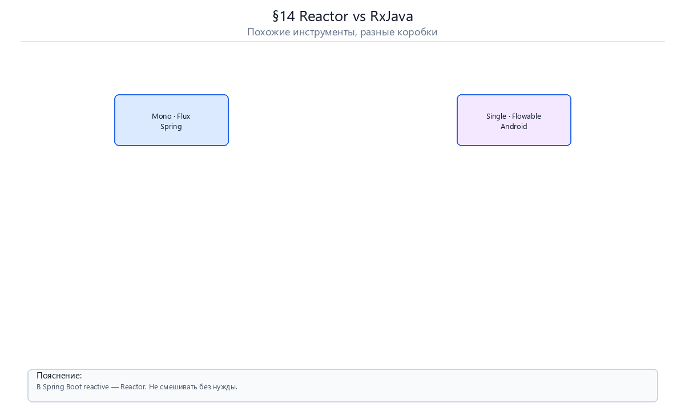


**Ответ:**

1. Обе реализуют Reactive Streams.
2. `Mono` ≈ `Single`/`Maybe`; `Flux` ≈ `Observable`/`Flowable`.
3. RxJava — Android, старые проекты. Reactor — **стандарт Spring** (WebFlux, R2DBC).
4. Смешивать через адаптеры можно, но в новом Spring-коде лучше не смешивать.
5. На собеседовании: «API похожи, для Spring Boot — Reactor».

**Вопрос:** *How does Project Reactor differ from RxJava?*

**Источник:** [EasyInterview — Project Reactor](https://easyinterview.me/interview-questions/project-reactor)

> **EN:** «How does Project Reactor differ from RxJava?» (common interview question)

> **RU:** Частый вопрос на собеседованиях.

---

## 15. Когда реактивный подход уместен, а когда нет

> **Аналогия из жизни:** Reactive — **скоростной автобус с одной полосой** (мало потоков, много пассажиров, если никто не «застрял» в дверях). Обычный MVC + virtual threads — **такси на каждого** (проще, если поездок немного и без стриминга).

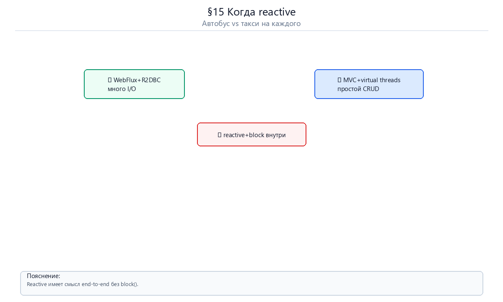


**Ответ:**

**Берите reactive, если:**

1. Стек неблокирующий: WebFlux + R2DBC/WebClient, без `block()`.
2. Нужна высокая конкурентность I/O или стриминг (SSE, WebSocket).
3. Команда готова к reactive-отладке.

**Не берите, если:**

1. Основной доступ — JDBC/JPA.
2. Простой CRUD — MVC + virtual threads часто проще.
3. Reactive «только в контроллере», а внутри `block()` — смысла нет.

**Вопрос:** *When should you use reactive programming?*

**Источник:** [kindatechnical — Reactive Questions](https://kindatechnical.com/reactive-processing/top-30-reactive-programming-interview-questions.html)

> **EN:** «Virtual threads solve thread scalability for 70-80% of web code. Reactive retains advantages for streaming and backpressure.»

> **RU:** «Виртуальные потоки решают масштабирование для большей части веб-кода. Reactive силён в стриминге и backpressure.»

---

## 16. Disposable и отмена подписки

> **Аналогия из жизни:** **`Disposable`** — **пульт от будильника**: подписка тикает (`Flux.interval`), пока не нажмёте **выключить** (`dispose()`).

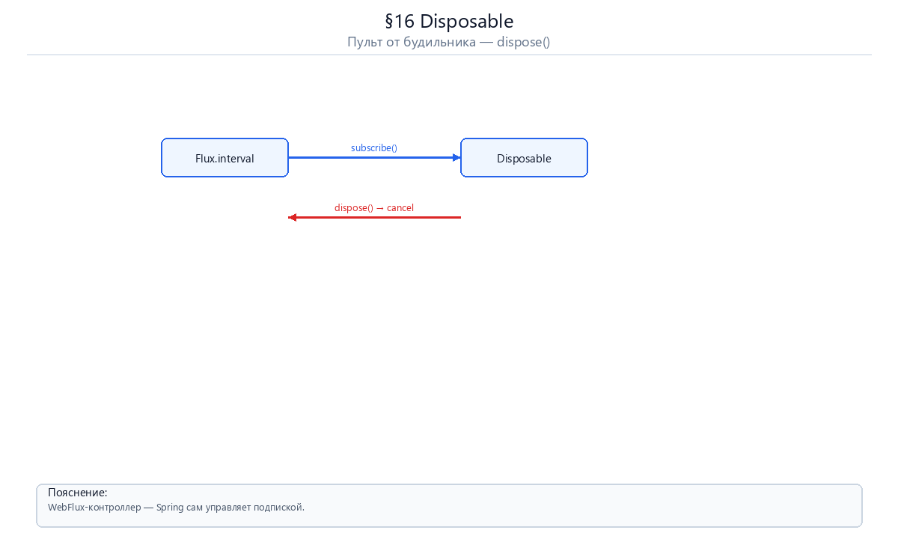


**Ответ:**

1. `subscribe()` возвращает **`Disposable`** — «ручку» подписки.
2. `dispose()` — отмена: upstream получает cancel, ресурсы освобождаются.
3. Нужно явно: `Flux.interval`, WebSocket, shutdown приложения.
4. В WebFlux-контроллере Spring управляет подпиской сам.
5. Пример:

```java

Disposable sub = Flux.interval(Duration.ofSeconds(1))
    .subscribe(System.out::println);

sub.dispose();
```
**Вопрос:** *What is a Disposable?*

**Источник:** [EasyInterview — Subscription and Lifecycle](https://easyinterview.me/interview-questions/project-reactor)

> **EN:** «What is a Disposable and how do you manage subscriptions?»

> **RU:** Стандартный вопрос по жизненному циклу подписки.

---

## 17. Блокирующий код внутри реактивной цепочки

> **Аналогия из жизни:** Поток Netty — **единственная касса в супермаркете**. **`block()` / JDBC** — покупатель **5 минут ищет сдачу** — очередь встаёт. **`boundedElastic`** — **отдельная касса «медленные операции»**.

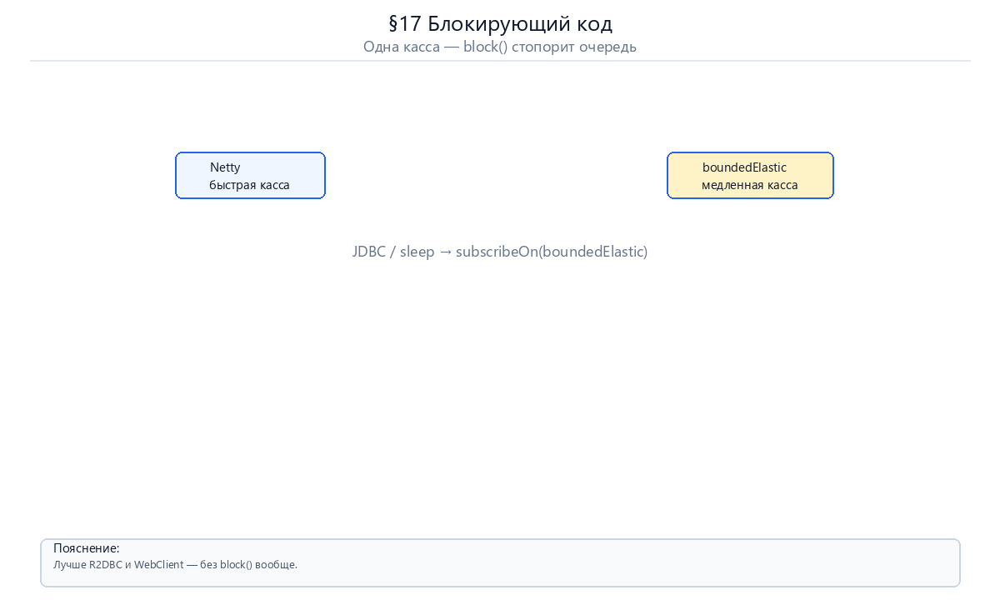


**Ответ:**

1. JDBC, `Thread.sleep`, sync-код **занимают поток** — на Netty это останавливает другие запросы.
2. Не выполняйте блокировку на `parallel()`, `single()`, потоке Netty.
3. Legacy JDBC — оберните и перенесите:

```java

Mono.fromCallable(() -> jdbcTemplate.queryForObject(...))
    .subscribeOn(Schedulers.boundedElastic());
```
4. Лучше: R2DBC вместо JDBC, WebClient вместо sync HTTP.
5. `.block()` внутри `flatMap` в WebFlux — **нельзя**.

**Вопрос:** *How do you handle blocking operations in reactive code?*

**Источник:** [Reactor — Schedulers](https://projectreactor.io/docs/core/release/reference/coreFeatures/schedulers.html)

> **EN:** «boundedElastic is made to help with legacy blocking code if it cannot be avoided.»

> **RU:** «boundedElastic — для legacy-блокирующего кода, если его нельзя убрать.»

---

## 18. Краткая шпаргалка по операторам

> **Аналогия из жизни:** Операторы — **надписи над станками на конвейере**: «перекрасить» (`map`), «открыть коробку и достать содержимое» (`flatMap`), «пропустить брак» (`filter`), «взять первые три» (`take`).

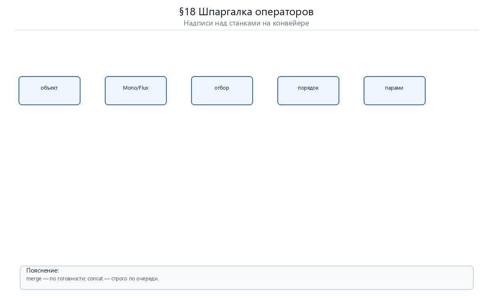


**Ответ:** ниже — **сигнатура из исходника** + **минимальный пример** для каждого оператора. `map` / `flatMap` / `concatMap` — подробно в §6.

---

### `filter`

```java

// Flux.java
public final Flux<T> filter(Predicate<? super T> p) {
    return onAssembly(new FluxFilter<>(this, p));
}
```

```java

Flux.just(1, 2, 3).filter(n -> n % 2 == 0).blockLast();  // 2
```

---

### `take`

```java

// Flux.java
public final Flux<T> take(long n) {
    return onAssembly(new FluxTake<>(this, n));
}
```

```java

Flux.range(1, 100).take(3).collectList().block();  // [1, 2, 3]
```

---

### `zip`

```java

// Flux.java — статический: ждёт элемент из КАЖДОГО источника, склеивает
public static <T1, T2, O> Flux<O> zip(
        Publisher<? extends T1> source1,
        Publisher<? extends T2> source2,
        BiFunction<? super T1, ? super T2, ? extends O> combinator) {
    return onAssembly(new FluxZip<>(null, a -> combinator.apply(a[0], a[1]),
        Queues.XS_BUFFER_SIZE, source1, source2));
}
```

```java

Flux.zip(
    Flux.just("a", "b"),
    Flux.just(1, 2),
    (letter, num) -> letter + num
).collectList().block();  // [a1, b2]
```

---

### `mergeWith` / `concatWith`

```java

// Flux.java
public final Flux<T> mergeWith(Publisher<? extends T> other) {
    return merge(this, other);
}

public final Flux<T> concatWith(Publisher<? extends T> other) {
    return concat(this, other);
}
```

```java

Flux.just(1, 2).mergeWith(Flux.just(10, 20)).collectList().block();
Flux.just(1, 2).concatWith(Flux.just(10, 20)).collectList().block();
```

---

### `timeout`

```java

// Flux.java
public final Flux<T> timeout(Duration timeout) {
    return timeout(timeout, null, Schedulers.parallel());
}
```

```java

Flux.just(1).delayElements(Duration.ofSeconds(5))
    .timeout(Duration.ofSeconds(1))
    .onErrorReturn(-1)
    .blockLast();   // -1 (timeout)
```

---

### `doOnNext` / `log`

```java

// Flux.java — side-effect, не меняет поток
public final Flux<T> doOnNext(Consumer<? super T> onNext) {
    return doOnSignal(this, null, null, onNext, null, null, null, null);
}

public final Flux<T> log() {
    return log(null, Level.INFO);
}
```

```java

Flux.just("x")
    .doOnNext(v -> System.out.println("before: " + v))
    .map(String::toUpperCase)
    .log()
    .blockLast();
```

**Вопрос:** *What are the most commonly used transformation operators?*

**Источник:** [Reactor — which operator](https://projectreactor.io/docs/core/release/reference/#which-operator)

> **EN:** «map … flatMap … filter … zip …»

> **RU:** Чаще всего спрашивают map, flatMap, filter, zip.

---

## 19. share() и cache() — cold → hot

> **Аналогия:** **share()** — **прямой эфир**: опоздавший не увидит начало. **cache()** — **запись эфира**: новый зритель может **пересмотреть** с начала.

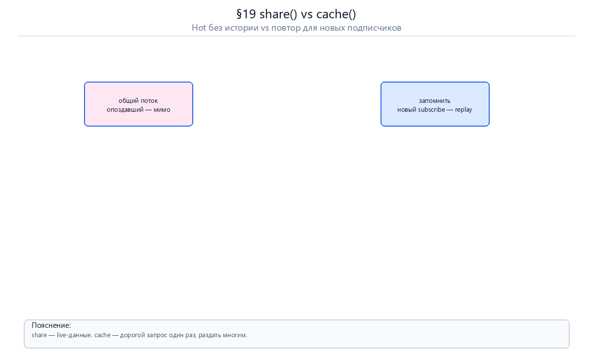

**Ответ:**

| Оператор | Что делает | Когда |
|----------|------------|-------|
| **`share()`** | Hot, без истории | Live-события |
| **`cache()`** | Replay для новых subscribe | Дорогой запрос один раз |

---

### `share()` — исходник

```java

// Mono.java — hot multicast, опоздавшие не получают прошлое
public final Mono<T> share() {
    return onAssembly(new MonoShare<>(this));
}
```

**Пример:**

```java

Mono<String> hot = Mono.just("once").share();
hot.subscribe(v -> System.out.println("A:" + v));
hot.subscribe(v -> System.out.println("B:" + v));
// оба подписчика делят ОДНУ подписку к источнику
```

---

### `cache()` — исходник

```java

// Mono.java — запомнить и отдавать новым подписчикам
public final Mono<T> cache() {
    return onAssembly(new MonoCacheTime<>(this, Duration.ofMillis(Long.MAX_VALUE),
        Schedulers.parallel()));
}
```

**Пример:**

```java

Mono<String> cached = Mono.fromCallable(() -> expensiveCall()).cache();
cached.block();   // expensiveCall() один раз
cached.block();   // из кэша, без повторного вызова
```

**Вопрос:** *What is the difference between share() and cache()?*

**Источник:** [kindatechnical — Q26](https://kindatechnical.com/reactive-processing/top-30-reactive-programming-interview-questions.html)

> **EN:** «share(): hot multicast, late subscribers miss history. cache(): replays to new subscribers.»

> **RU:** «share — live без прошлого. cache — replay для опоздавших.»

---

## 20. flatMap, concatMap и switchMap

> **Аналогия:** Три способа обработать **очередь задач**: все сразу (**flatMap**), строго по одной (**concatMap**), только **последняя** (**switchMap** — как автодополнение в поиске).

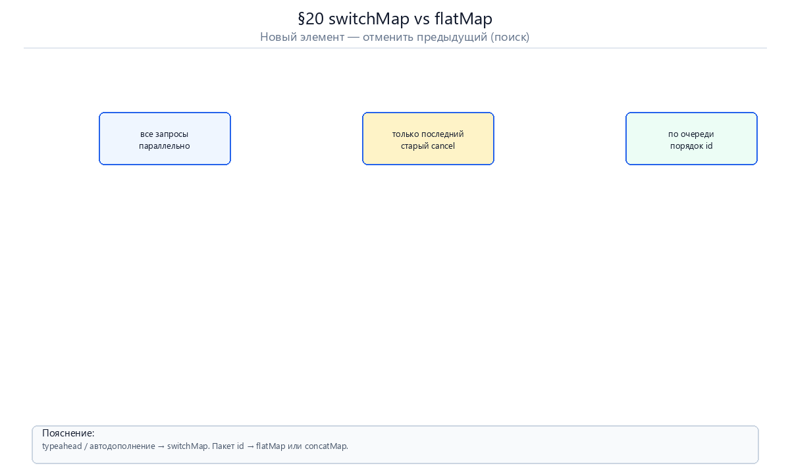

**Ответ:** три оператора — три стратегии «разворота» inner-`Publisher`. Сигнатуры — §6; здесь **`switchMap`**.

---

### `switchMap` — исходник

```java

// Flux.java — новый элемент → отменить предыдущий inner-Publisher
public final <R> Flux<R> switchMap(
        Function<? super T, ? extends Publisher<? extends R>> fn) {
    return onAssembly(new FluxSwitchMapNoPrefetch<>(this, fn));
}
```

**Пояснение:** при каждом `onNext` от upstream **отменяется** предыдущий inner-поток (`FluxSwitchMap`).

**Пример (typeahead):**

```java

Flux.just("a", "ab", "abc")
    .delayElements(Duration.ofMillis(50))
    .switchMap(q -> searchApi(q))   // только последний запрос живёт
    .take(1)
    .blockLast();
```

**Вопрос:** *Explain flatMap vs concatMap vs switchMap.*

**Источник:** [kindatechnical — Q10](https://kindatechnical.com/reactive-processing/top-30-reactive-programming-interview-questions.html)

> **EN:** «concatMap: sequential, ordered. flatMap: concurrent. switchMap: cancels previous on new element.»

> **RU:** «concatMap — по очереди. flatMap — параллельно. switchMap — отменяет предыдущий.»

---

## 21. Отладка реактивной цепочки

> **Аналогия:** Цепочка **невидима** — как трубы под полом. **`.log()`** — стеклянные окна; **`checkpoint()`** — табличка «мы здесь».

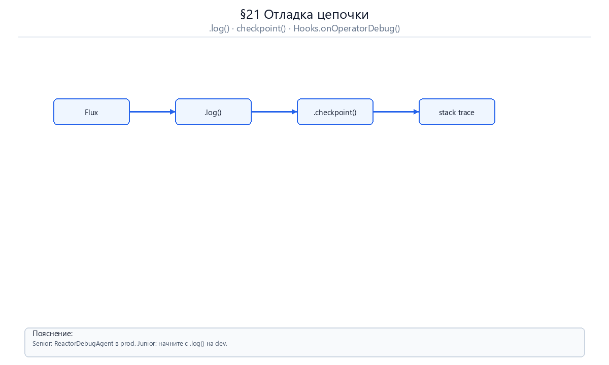

**Ответ:** начните с `.log()` на dev.

---

### `log()` — исходник

```java

// Flux.java — печатает onNext / onError / onComplete / request / cancel
public final Flux<T> log() {
    return log(null, Level.INFO);
}
```

**Пример:**

```java

Flux.just(1, 2)
    .map(i -> i * 10)
    .log("demo")
    .blockLast();
// в консоли: | demo | onNext(1) | onNext(10) | …
```

**Вопрос:** *How do you debug reactive pipelines?*

**Источник:** [kindatechnical — Q23](https://kindatechnical.com/reactive-processing/top-30-reactive-programming-interview-questions.html)

> **EN:** «.log(), checkpoint(), Hooks.onOperatorDebug(), ReactorDebugAgent.»

> **RU:** «Начните с .log() и checkpoint(); в prod — ReactorDebugAgent.»

---

## 22. Context — MDC и traceId между потоками

> **Аналогия:** **ThreadLocal** — заметка **на руке** одного кассира. **`publishOn`** — кассир сменился → заметка **потерялась**. **Reactor Context** — **бейдж**, который передаётся по цепочке.

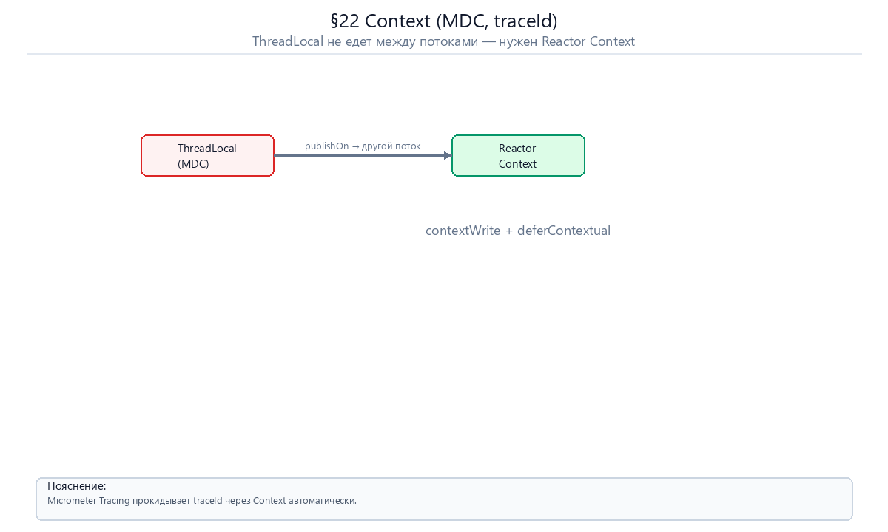

**Ответ:**

1. **`ThreadLocal`** (MDC, Spring Security, traceId) **не переносится** при `publishOn` / `subscribeOn`.
2. **Reactor `Context`** — immutable map на подписчике; **`contextWrite`** / **`deferContextual`**.
3. **Micrometer Tracing** в Spring Boot 3 часто прокидывает traceId **автоматически**.

**Вопрос:** *How do you propagate MDC / trace context in reactive code?*

**Источник:** [kindatechnical — Q15](https://kindatechnical.com/reactive-processing/top-30-reactive-programming-interview-questions.html)

> **EN:** «ThreadLocal breaks across thread switches. Reactor Context attaches to subscribers.»

> **RU:** «ThreadLocal ломается при смене потока — используйте Reactor Context.»

---

## 23. Сводка: 30 вопросов → разделы

**Источник:** [Top 30 Reactive Programming Interview Questions](https://kindatechnical.com/reactive-processing/top-30-reactive-programming-interview-questions.html) (Feb 2026).

> **EN:** «Top 30 reactive programming interview questions covering Mono, Flux, backpressure, WebFlux, and operators.»

> **RU:** «30 типовых вопросов по реактивному программированию: Mono, Flux, backpressure, WebFlux, операторы.»

| # | Вопрос | Раздел |
|---|-----------------|--------|
| 1 | Reactive vs imperative | §2 |
| 2 | Reactive Streams — 4 интерфейса | §2 |
| 3 | Backpressure | §4 |
| 4 | Mono vs Flux | §3 |
| 5 | Cold vs hot | §9, §19 |
| 6 | map vs flatMap | §6 |
| 7 | Error handling | §10 |
| 8 | Schedulers | §8 |
| 9 | Why subscribe()? | §5 |
| 10 | concatMap vs flatMap vs switchMap | §6, §20 |
| 11 | WebFlux vs MVC | §13, §15 |
| 12 | Reactive Manifesto | §15 (системный уровень) |
| 13 | Circuit breaker | Resilience4j + §10 |
| 14 | Testing (StepVerifier) | §12 |
| 15 | Context propagation | §22 |
| 16 | When NOT reactive | §15 |
| 17 | Observable vs Flowable (RxJava) | §14 |
| 18 | R2DBC | §13, §17 |
| 19 | Reactive transactions | §13 (TransactionalOperator) |
| 20 | publishOn vs subscribeOn | §7 |
| 21 | Project Loom / virtual threads | §15 |
| 22 | Kafka 100K events/sec | §6 flatMap + backpressure + partitions |
| 23 | Debugging pipelines | §21 |
| 24 | Operator fusion | §18 (оптимизация Reactor, без ручной настройки) |
| 25 | Rate limiting | WebFilter / Resilience4j |
| 26 | share() vs cache() | §19 |
| 27 | Graceful shutdown | §16 dispose + Spring `server.shutdown=graceful` |
| 28 | Mono.zip vs when | §18 (zip) |
| 29 | Reactive + relational DB | §17, §15 |
| 30 | Migrate MVC → reactive | §15, §17 (инкрементально) |

---

## Мини-пример (reactive-demo)

```java

// UserService.java
return userRepository.findById(id)
    .flatMap(user -> orderRepository.findByUserId(user.id())
        .collectList()
        .map(orders -> UserSummaryResponse.of(user, orders)));

// UserController.java — subscribe() не вызываем
@GetMapping("/{id}/summary")
public Mono<UserSummaryResponse> getUserSummary(@PathVariable Long id) {
    return userService.getUserSummary(id);
}
```
Живые примеры map/flatMap: модуль **`reactive-demo`**, порт **8081**, раздел 6 этого документа.

**Источник:** [reactive-demo/README.md](../reactive-demo/README.md) · [Reactor Reference — which operator](https://projectreactor.io/docs/core/release/reference/#which-operator)

> **EN:** «map applies a synchronous transformation; flatMap applies an asynchronous transformation that returns a Publisher.»

> **RU:** «`map` — синхронное преобразование; `flatMap` — асинхронное, возвращающее Publisher.»

---

## Полезные ссылки

| Ресурс | URL |
|--------|-----|
| Reactor Reference Guide | https://projectreactor.io/docs/core/release/reference/ |
| Flux API | https://projectreactor.io/docs/core/release/api/reactor/core/publisher/Flux.html |
| Baeldung — Reactor | https://www.baeldung.com/reactor-core |
| reactive-demo в проекте | `reactive-demo/README.md` |

---

*Документ для подготовки к собеседованиям. Сигнатуры операторов — из [reactor-core](https://github.com/reactor/reactor-core) (`Mono.java`, `Flux.java`). PNG: `docs/Images-docs/`.*
