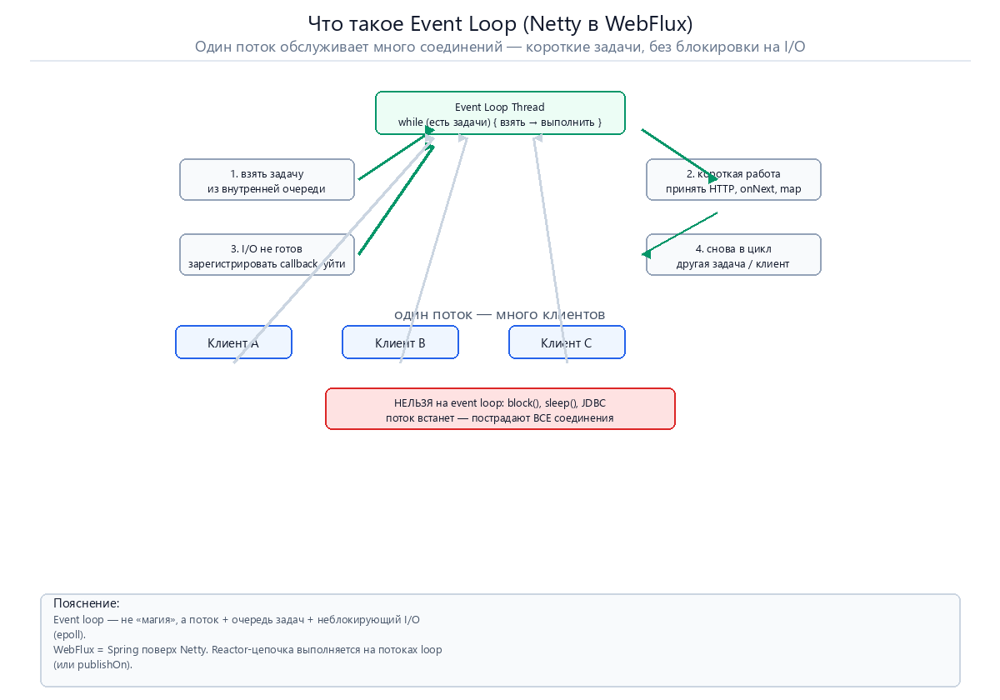
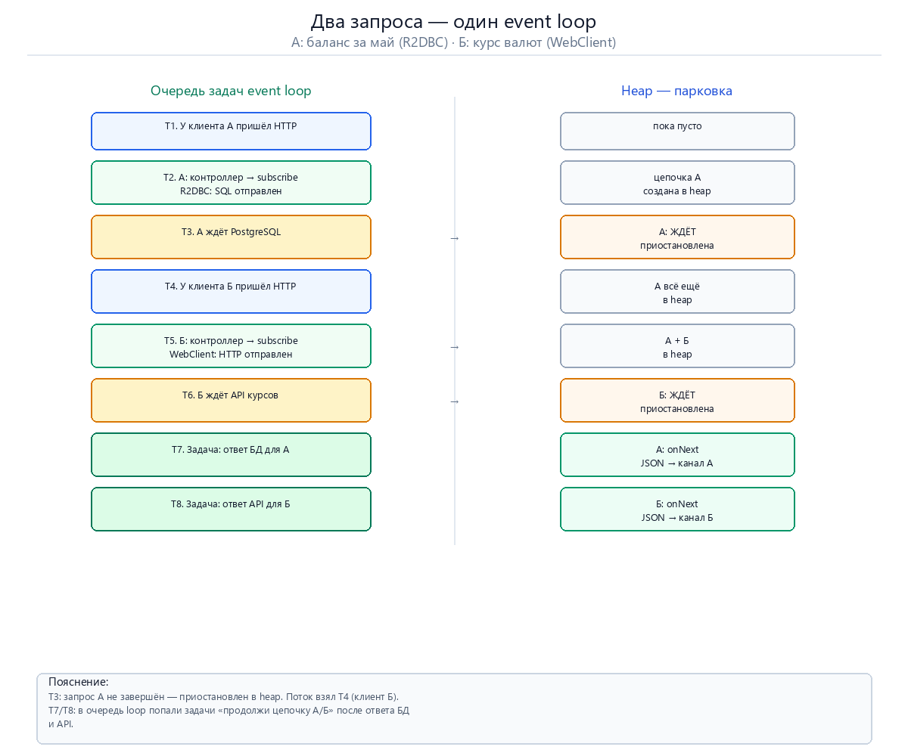
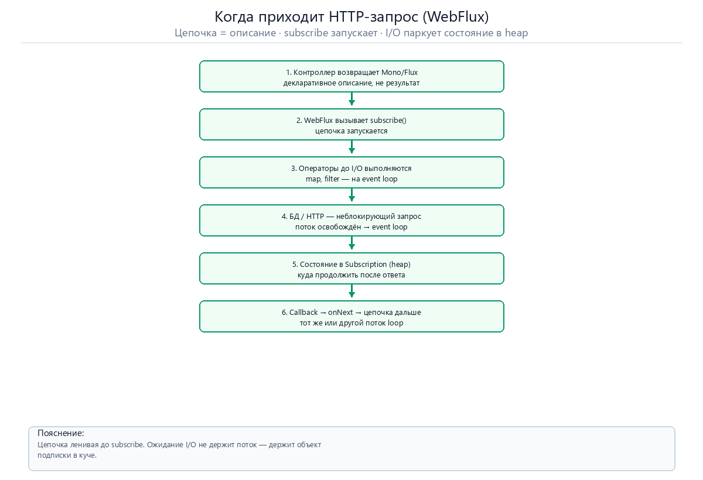
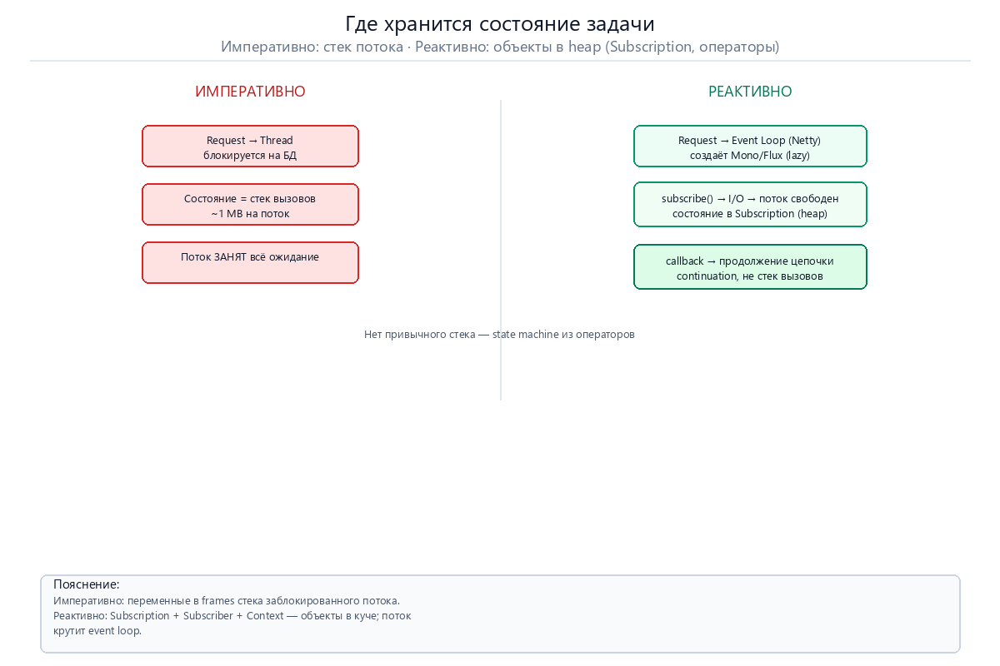
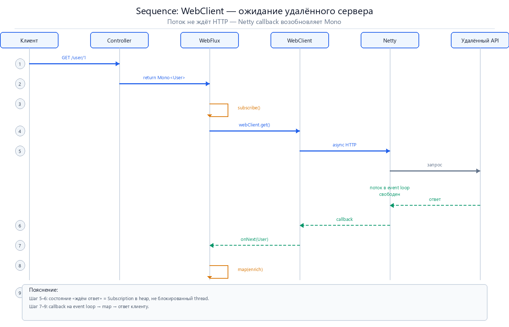
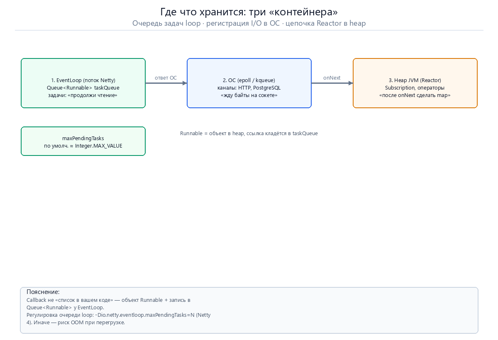
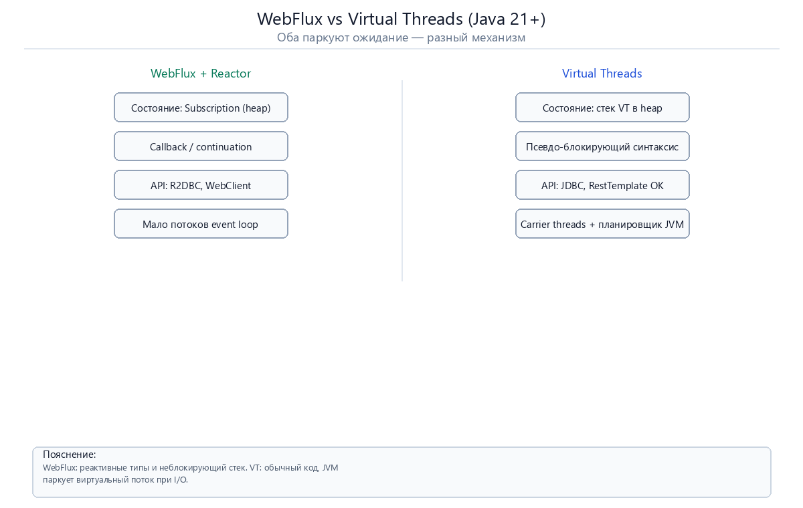

# Реактивный код: где ждёт запрос и где хранится состояние

> Отдельное руководство к [project-reactor-interview-guide.md](./project-reactor-interview-guide.md), §2.1.  
> **Формат:** аналогия → PNG → ответ → пример → источник → цитата EN/RU.

**Перегенерация PNG:** `python docs/Images-docs/gen_reactor_diagrams.py`.

> **Главные разделы:** [§1 Event Loop](#1-что-такое-event-loop) · [два запроса А и Б](#пример-два-пользователя-один-поток-loop) · **[§5 очередь loop и callback](#5-очередь-event-loop-и-контейнеры-callback)** ← про `Queue<Runnable>`, размер, три контейнера

---

## Оглавление

1. [Что такое Event Loop](#1-что-такое-event-loop)
2. [Что происходит, когда приходит запрос](#2-что-происходит-когда-приходит-запрос)
3. [Где хранится состояние: императив vs реактив](#3-где-хранится-состояние-императив-vs-реактив)
4. [Пример: WebClient и удалённый сервер](#4-пример-webclient-и-удалённый-сервер)
5. [Очередь event loop и «контейнеры» callback](#5-очередь-event-loop-и-контейнеры-callback)
6. [Где технически «паркуются» задачи (сводка)](#6-где-технически-паркуются-задачи-сводка)
7. [Сравнение с Virtual Threads (Java 21+)](#7-сравнение-с-virtual-threads-java-21)
8. [Итог](#8-итог)

---

## 1. Что такое Event Loop

> - **Аналогия:** **диспетчер на станции** с одной будкой. 
> 
> - Он **не едет в каждом поезде** до конца маршрута. 
> 
> - Он **переключает стрелки**, **принимает короткие команды** и сразу берёт следующую.
> 
> - Долгая погрузка вагонов — **не его работа**: поезд на **отстойном пути**, диспетчер **свободен** для других поездов.



**Ответ:**

**Event loop** (цикл событий) — это однопоточный исполнитель задач (класс `SingleThreadEventLoop` в Netty) в составе небольшой группы потоков (`EventLoopGroup`). 

- Каждый такой поток бесконечно делает одно и то же:

```text
пока есть работа:
    - взять задачу из очереди (Queue<Runnable>)
    - выполнить её БЫСТРО (без долгого ожидания I/O)
    - вернуться за следующей задачей
```


В **Spring WebFlux** event loop реализует **Netty** — библиотека для неблокирующего HTTP.

| Понятие | Простыми словами                                                                                                                                       |
|---------|--------------------------------------------------------------------------------------------------------------------------------------------------------|
| **Event Loop** | Поток + его **очередь коротких задач** (`Queue<Runnable>`)  (что выполнить дальше)                                                                     |
| **EventLoopGroup** | Пул таких потоков, обычно ≈ числу ядер CPU                                                                                                             |
| **Netty** | Движок неблокирующего сетевого I/O, на котором работает WebFlux                                                                                        |
| **Задача (task)** | Кусок работы (Короткий фрагмент работы:) в очереди loop:  «прочитать байты», «вызвать `onNext`», «отправить ответ»                                     |
| **Обратный вызов (callback)** | Зарегистрированный обработчик, который будет вызван, когда I/O готов (обычно реализован как `Runnable`)                                                |
| **Блокировка** | `block()`, `sleep()`, JDBC  — если эти команды (или запрос в базу данных) выполняется на event loop-потоке, все соединения на этом loop начинают ждать |

#### Пример: два пользователя, один поток loop

**Ситуация:**

- **Пользователь А** — `GET /balance/may` → в контроллере `balanceRepository.findMay(userId)` через **R2DBC** (PostgreSQL, ~200 мс).
- **Пользователь Б** — `GET /rates` → в контроллере `webClient.get().uri("/cbr/...")` (**удалённый HTTP**, ~300 мс).

Оба запроса приходят **почти одновременно**.
 - Для упрощения представим, что на сервере один event loop-поток; в реальности таких потоков несколько, но логика та же.

**Что такое «соединение» (канал):**

- У каждого клиента в браузере — свой **TCP-сокет** до вашего сервера. Netty оборачивает его в объект **`Channel` (канал)**.  
-  То есть, действие «Принять HTTP» **означает**, что на канале **А** пришли байты `GET /balance/may…`. Здесь **Netty** разобрал их и передал в Spring.

- То есть **TCP-сокет** - это **не** «соединение с БД». С БД и с API курсов — уходят **отдельные** неблокирующие запросы, которые R2DBC/WebClient используют внутри цепочек Reactor.



**Хронология (что делает поток loop — по одной задаче за раз):**

| Шаг | Задача в очереди loop | Запрос А (баланс) | Запрос Б (курсы) | Где «парковка» |
|-----|------------------------|-------------------|------------------|----------------|
| **T1** | Разобрать HTTP на **канале А** | Контроллер вернул `Mono<Balance>` | — | — |
| **T2** | WebFlux вызвал `subscribe()` для А | R2DBC **отправил** SQL в PostgreSQL | — | Объекты цепочки А в **heap** |
| **T3** | *Поток закончил задачу T2* | **Ждёт ответ БД** (~200 мс) | — | **Цепочка А приостановлена** в heap: `Subscription` + операторы знают: «после ответа — `map` → JSON» |
| **T4** | Разобрать HTTP на **канале Б** | всё ещё ждёт БД | Контроллер вернул `Mono<Rates>` | А в heap |
| **T5** | `subscribe()` для Б | — | WebClient **отправил** HTTP к API | А и Б в heap |
| **T6** | *Поток свободен* | ждёт | **Ждёт ответ API** (~300 мс) | Обе цепочки в heap |
| **T7** | ОС: «пришли байты от PostgreSQL» | R2DBC кладёт задачу: **продолжи А** → `onNext(balance)` → ответ в **канал А** | Б ещё ждёт | Б в heap |
| **T8** | ОС: «пришли байты от API» | А уже отвечен | **продолжи Б** → `onNext(rates)` → **канал Б** | — |

**Ответы на типичные вопросы:**

- **«Поток не ждёт** — берёт другую задачу.

- Что делает поток с первым запросом, который пришел ранее? Завершает? :

  - **Не завершает и не выбрасывает.**
   - Запрос А **приостановлен** (как кино-сериал на паузе в Netflix): в **heap** лежит цепочка Reactor с пометкой «ждём строку из PostgreSQL, потом сделать `map` и отдать JSON». 
   - Поток _event loop_ **закончил крошечную задачу** «отправить SQL» и перешёл к **следующей задаче в очереди** (клиент Б). 
   - Запрос А **ждет в памяти**, но не "висит в стеке потока".

**«Какую новую задачу ставит Netty, когда ответ пришёл?»**  
  → Подробно смотри в: **[§5 Очередь event loop и контейнеры callback](#5-очередь-event-loop-и-контейнеры-callback)** (очередь `Queue<Runnable>`, размер `maxPendingTasks`, контейнеры **callback**).

**«Кто паркует запрос А?»** — кратко:

| # | Контейнер                                     | Что там |
|---|-----------------------------------------------|---------|
| 1 | **`Queue<Runnable>`** у Netty EventLoop       | задачи «выполни следующий шаг» (объекты `Runnable` в heap) |
| 2 | **selector ОС** (epoll) + `Channel`           | «на этом сокете ждём байты» (пока ответ не пришёл) |
| 3 | **heap Reactor** (`Subscription`, операторы , подписчики) | «после `onNext` сделать `map` и ответить клиенту А» |

Подробно — в **§5**.

**Мини-код (для привязки к примеру):**

```java

@RestController
public class ApiController {
  // Пользователь А
  @GetMapping("/balance/may")
  public Mono<Balance> mayBalance(@RequestParam Long userId) {
    return balanceRepo.findMay(userId);   // R2DBC → PostgreSQL, неблокирующе
  }

  // Пользователь Б
  @GetMapping("/rates")
  public Mono<Rates> rates() {
    return webClient.get().uri("https://cbr.example/rates")
        .retrieve().bodyToMono(Rates.class);
  }
}
```

Ни `subscribe()`, ни `block()` в контроллере мы не указываем — подписывается на получение результата сам **WebFlux**, когда обрабатывает HTTP на **канале** клиента.

#### Что такое «callback» — коротко (после примера)

В шаге **T7** «обратный вызов» **означает, что** Netty/R2DBC **зарегистрировали заранее** обработчик (то есть callback): 
  - «когда PostgreSQL ответит — нужно создать **Runnable** для продолжения выполнения запроса от _клиента_ **А** и **поставить** его в очередь **event loop**». Вы этот код не пишете — его собирает драйвер и **_Reactor_** при работе метода `subscribe()`.

| Уровень | Кто                                   | Что хранит пока ждём |
|---------|---------------------------------------|----------------------|
| **ОС + Netty** | сокет к клиенту А, сокет к PostgreSQL | «на этом сокете ждём байты» |
| **Reactor** | цепочка `Mono` для клиента А          | «после `onNext` вызвать `map` и записать в канал А» |

**Очередь event loop** — общая для **всех** каналов: задачи от клиента А, от клиента Б, перемешаны. Поток берёт **одну** задачу, делает **чуть-чуть** какую-то работу, затем если ответ нужно ждать, переходит к следующей задаче другого клиента.

#### На каком потоке продолжается цепочка?

**В типичном WebFlux-контроллере** (без лишних операторов):

```java

return userRepository.findById(id).map(User::email);
```

 - всё выполняется на **потоке Netty event loop**, который принял HTTP-запрос. Ответ БД приходит → создаётся Runnable в очереди этого потока  → затем вызывается `onNext` → `map` → ответ клиенту.

**`publishOn(Schedulers…)`** — это **отдельный** оператор Reactor: «**ниже по цепочке** выполняй на **другом** пуле потоков». Он нужен, когда вы **сами** переносите работу (например, тяжёлый CPU или осторожно — блокирующий код на `boundedElastic`). 
 - В простых примерах из этого документа **нет** описания такой ситуации — не путайте с обычным ожиданием HTTP/БД.

Подробнее про `publishOn` / `subscribeOn` — смотрите в [§7 в interview-guide](./project-reactor-interview-guide.md#7-subscribeon-и-publishon).

**Сколько потоков используется для обработки запроса?** Обычно **немного** (часто ~число ядер CPU), а не «по потоку на каждый запрос». Поэтому важно: **не блокировать** event loop.

**Чего event loop НЕ делает:** 
 - он **не хранит** долго живущее состояние вашей бизнес-логики между шагами — это делают объекты Reactor в **heap** (`Subscription`, операторы). 
 - Долгоживущие состояния живут в объектах Reactor в heap (Subscription, операторы, подписчики, контекст). 
 - Event loop только планирует и выполняет короткие задачи (`Runnable`), которые продвигают цепочку.
---

## 2. Что происходит, когда приходит запрос

> **Аналогия:** вы не **строите дом сразу** — вы оставляете **чертёж** (Mono/Flux). 

> Стройка начинается только когда заказчик говорит «начинай» (`subscribe()`). 

> Пока ждёте цемент с завода (БД, HTTP) — **бригада уехала на другой объект** (поток event loop свободен), а **план работ лежит в офисе** (Subscription в heap).



**Ответ — по шагам:**

1. **Создаётся декларативная цепочка из различных операторов, обрабатыващих запрос** (`Mono`/`Flux` + операторы `map`, `flatMap`, `filter` и др.…) — это **описание** вычисления, не готовый результат и не «уже выполненный код».
2. При вызове метода **`subscribe()`** (в WebFlux это делает **Spring**, не вы в контроллере) цепочка **запускается** на потоке **event loop** и выполняет ту часть, которая не ждёт внешний мир (то есть данных из базы или другого сервера).
3. Когда нужно **ждать внешний вызов** (БД, удалённый сервер) — поток **освобождается**, то есть выходит из текущей задачи и возвращается в цикл **_event loop_** — берёт другие задачи. (см. §1).
4. **Состояние задачи** (куда приходить дальше, что уже получено) хранится в объектах в **куче** — в первую очередь в **`Subscription`** и связанных подписчиках/операторах.
5. Когда внешний сервис отвечает — ОС и Netty формируют задачу (Runnable), то есть **задача в очереди event loop**; 
 - при ее выполнении Reactor шлёт **`onNext`**, то есть вызывает `onNext`/`onComplete`, и следующие операторы продолжают обработку.
 - **В обычном контроллере** это **тот же** event loop-потоке, пока вы сами не сменили **_scheduler_**. (без `publishOn` — см. §1).

---

## 3. Где хранится состояние: императив vs реактив

> **Аналогия:** **императивно** — мастер **стоит у станка** с блокнотом в руке (стек потока). 
> 
>**Реактивно** — заявка **лежит в канцелярии** (heap), мастер **уехал**; когда готово — **звонок** (задача на event loop, §1).



### Императивный подход (Servlet + Tomcat)

```
Request → Thread → блокируется на БД → стек потока хранит всё состояние
```

- Поток **заблокирован** и занимает ресурс (~**1 MB** стека на поток в типичной JVM).
- Состояние = **локальные переменные и frames** в стеке вызовов.
- 100 запросов ждут БД → **100 потоков заняты** → 101-й ждёт в **очереди Tomcat**.

### Реактивный подход (WebFlux + Reactor)

```text
Request → EventLoop → Mono/Flux (описание) → subscribe() →
  - часть выполняется сразу → ждём БД → поток возвращается в EventLoop →
  - состояние между шагами храним в типе Subscription/операторах (heap) → ответ →
  - берем новую задача на event loop → onNext / onComplete
```

| Компонент | Что хранит                                                                                                               | Где |
|-----------|--------------------------------------------------------------------------------------------------------------------------|-----|
| **Subscription** | связь подписчик ↔ источник, счётчик demand (`request(n)`), флаги завершения/отмены, внутренние буферы                    | **heap** |
| **Mono / Flux** | описание цепочки операторов (lazy)                                                                                       | **heap** |
| Subscriber | уже полученные данные, логику `onNext`/`onError`/`onComplete`                                                            | heap |
| Операторы (`map`, `flatMap`, `buffer`, `scan`, `window` и др.) | конфигурацию и, у stateful-операторов, внутреннее состояние (аккумуляторы, окна, очереди)                                | heap |
| **Context** (Reactor) | trace ID, tenant и др. между операторами                                                                                 | **heap** |
| **Стек вызовов** | в момент ожидания нет «**глубокого**» стека; продолжение (**_continuation_**) представлено как **машина состояний** в объектах | — |

В Reactor **нет стека вызовов в привычном смысле** для ожидания I/O: цепочка операторов выполняется как **state machine** — на каждом шаге знаем, **куда перейти после** `onNext` / `onComplete` / `onError`.
 - Каждый оператор знает, что делать при `onNext`, `onComplete`, `onError`, и хранит своё состояние в полях и связях с другими объектами.

**Источник:** [Reactive Streams — Subscription](https://www.reactive-streams.org/reactive-stacks) · [Reactor — Core Features](https://projectreactor.io/docs/core/release/reference/coreFeatures.html)

> **EN:** «Subscription represents a one-to-one lifecycle of a Subscriber subscribing to a Publisher.»

> **RU:** «Объект Subscription — представляет связь «один подписчик ↔ один источник» на время подписки.»

---

## 4. Пример: WebClient и удалённый сервер

> **Аналогия:** вы **отправили курьера** (HTTP-запрос через Netty) и **не стоите у двери** — занимаетесь другими делами. Курьер **звонит**, когда посылка пришла (`onNext`).



```java

@GetMapping("/user/{id}")
public Mono<User> getUser(@PathVariable Long id) {
    return webClient.get()
        .uri("/user/{id}", id)
        .retrieve()
        .bodyToMono(User.class)       // ждём ответ от сервера (неблокирующе)
        .map(user -> enrich(user));   // продолжится после onNext
}
```

**Что происходит:**

1. Контроллер возвращает **`Mono<User>`** — описание пайплайна, не готовый `User`.
2. **WebFlux** подписывается на `Mono` (вызывается метод **`subscribe()`** внутри фреймворка).
3. `webClient.get()` отправляет **неблокирующий** HTTP через Netty и **регистрирует обработчик:** «когда байты придут —  распарсить и продолжить цепочку».
4. Поток event loop **свободен** — обслуживает другие запросы (§1).
5. Состояние, пока "ждём ответ, и будем выполнять `map(enrich)`" — находится в объекте **Subscription** и операторах Mono в heap.
6. Удалённый сервер ответил → ОС → Netty → **задача на event loop** →
   - при её выполнении вызывается `onNext(User)` → `map(enrich)` → результат сериализуется в JSON и отправляется клиенту на том же loop-потоке, если вы не использовали `publishOn`.


**Ключевое:** 
  - event loop-поток **не блокируется** на HTTP; 
  - распоряжения «что делать после ответа», будут храниться в **цепочке Reactor в heap**, а не в стеке thread.
---

## 5. Очередь event loop и «контейнеры» callback

> **Аналогия:** **очередь event loop** — это **лист ожидания у окошка**: «когда подойдёт ваша очередь — вас вызовут». 
> 
> **Цепочка Reactor в heap** — **ваша анкета** с пометкой «что делать, когда придут документы». 
> 
> **ОС (epoll/kqueue)** — **почтовое уведомление**: «на сокете появились байты».



**Ответ:** вы правы — **callback где-то хранится**. Не в вашем `ArrayList`, а в **трёх разных местах** одновременно (В картине Netty + Reactor есть три основных контейнера.):

### Контейнер 1 — `Queue<Runnable>` у каждого потока EventLoop (Netty)

  - **Как выглядит:** у каждого потока event loop внутри Netty есть **очередь задач** — в коде Netty это `Queue<Runnable> taskQueue` (часто **MPSC-очередь** — multi-producer, single-consumer).

  **Что в ней лежит:** не «имена callback», а **готовые к выполнению кусочки работы** — объекты `Runnable` в **heap**. Каждый `Runnable` означает, «прочитай байты с канала и запусти `pipeline.fireChannelRead()» / «вызови `onNext` у Reactor, для перехода к обработке следующего элемента (если нужно)».

  **Когда туда попадает задача T7 из примера:** PostgreSQL ответил → Netty **создаёт** `Runnable` (или берёт из пула) → вызывает **`eventLoop.execute(runnable)`** → ссылка на этот объект **встаёт в хвост очереди** → поток event loop-поток, когда дойдёт очередь, **выполнит** `run()`.


**Размер по умолчанию (Netty 4.x):**

```text
DEFAULT_MAX_PENDING_TASKS =
    Math.max(16,
             SystemPropertyUtil.getInt(
                                       "io.netty.eventloop.maxPendingTasks",
                                       Integer.MAX_VALUE
                                )
    )
```

То есть **формально** лимит огромный (`Integer.MAX_VALUE`), минимум **16**. На практике при лавине задач очередь растёт в **heap** → риск **OutOfMemory**, если не ограничивать.

**Как регулируют:**

| Способ | Пример |
|--------|--------|
| **JVM system property** | `-Dio.netty.eventloop.maxPendingTasks=100000` |
| **Свой EventLoopGroup** | передать `maxPendingTasks` в конструктор (кастомная сборка Netty) |
| **Мониторинг** | Netty `eventLoop.pendingTasks()` — сколько задач ждёт в очереди |
| **Архитектура** | не блокировать loop; backpressure; несколько event loop потоков |

- При переполнении (если лимит задан и достигнут) — **`RejectedExecutionException`** (новая задача **не** принимается).

> В **Spring Boot** обычно **не** настраивают `maxPendingTasks` в `application.yml` — это уровень Netty/JVM. Чаще настраивают **число потоков** loop: `server.netty.*` / Reactor Netty resources.

### Контейнер 2 — регистрация I/O в ОС (epoll / kqueue)

Пока ответ **ещё не пришёл**, в очереди `Runnable` **может ничего не быть**. 

Вместо этого:

  - сокет к PostgreSQL / к API зарегистрирован в **selector** ОС (epoll/kqueue);
  - поток event loop-поток **не ждёт** — он опрашивает selector или получает событие от ОС;
  - когда байты пришли — ОС «будит» Netty → Netty обрабатывает событие и создаёт Runnable в **контейнер 1**.

Это **не Java-коллекция callback'ов**, а **таблица «какие сокеты ждут данных»** на уровне ядра + плюс объекты `Channel` и `ChannelPipeline` в Netty.

### Контейнер 3 — heap Reactor (`Subscription`, операторы)

Пока ждём БД, **бизнес-цепочка** «`findMay` → `map` → JSON в канал А» хранится как **граф объектов** в heap:

 - какой оператор следующий;
 - какой `Subscriber` вызвать при `onNext`;
 - сколько элементов запрошено через `request(n)`.

**Это главная «парковка» запроса А** — здесь живёт **весь незавершённый запрос**, а не одна строчка в очереди.

#### Что значит «парковка» — развернуто на запросе А

> **Аналогия:** запрос А — **дело (некий запрос) положили в папке** на полке архива (heap Reactor). В папке лежит: «клиент А, канал А, ждём строку из `balance_may`, потом выполним преобразование `map` → JSON».
> 
> **Очередь event loop** — это **табло «сейчас вызвать №…»**: на нём **одна** надпись «сделай **следующий** крошечный шаг» (прочитай байты, вызови `onNext`).
> 
> Пока PostgreSQL молчит (шаги T3–T6), на табло **может не быть** задачи по А — дело **всё равно находится в папке**, просто **ещё не пришло время** звать.
> 
> Когда БД ответила — на табло появляется **одна** запись T7; папка **та же**, в ней уже написано, **что делать** с пришедшей строкой.

| | **Очередь loop** (`Queue<Runnable>`)                                               | **Reactor в heap** (`Subscription`, операторы)                                                                  |
|---|------------------------------------------------------------------------------------|-----------------------------------------------------------------------------------------------------------------|
| **Что хранит** | «Выполни **сейчас** вот этот кусочек кода»                                         | «**Весь** запрос А: куда писать ответ, какие операторы использлловать и что делать после получения отвеа из БД» |
| **Размер «памяти» о запросе** | Одна задача означает, что выполняется один шаг                                     | Вся цепочка `Mono` + контекст подписки                                                                          |
| **Пока ждём БД (~200 мс)** | Очередь может быть **пуста** по А (ждём событие epoll от ОС, не из **event loop**) | Цепочка А **жива** в heap — запрос **не завершён**                                                              |
| **Когда пришёл ответ БД** | В очередь **event loop** кладут **одну** задачу T7: «прочитай сокет → `onNext`»                  | Та же цепочка: по `onNext(balance)` вызывается `map` → запись в **канал А**                                     |

**Почему «очередь — только следующий шаг»:**  
 - `Runnable` в очереди — это **не** «запрос клиента А целиком». Это **курьер с одним поручением**: «сейчас зайди в R2DBC и прочитай буфер и вызови `onNext(row)».  

**«Смысл цепочки»** — это **инструкция в heap**: «если пришла строка `Balance` — преобразуй и отдай клиенту А». Без объектов Reactor курьер **не знал бы**, что делать после `onNext`.

**Мини-пример (упрощённо, не настоящий код Netty):**

```text
// T2: SQL ушёл, поток loop свободен
heap:  Subscription_A = {
         ждём: 1 элемент от R2DBC,
         потом: map(b -> toJson(b)) → write(Channel_A)
       }
taskQueue: [ обработать HTTP клиента Б ]   // А в очереди НЕТ — ждём ОС

// T7: PostgreSQL ответил
taskQueue.add( Runnable: read(PG_socket) → subscription_A.onNext(row) )
// Runnable знает ТОЛЬКО "вызвать onNext"
// map → JSON → канал А — всё ещё в Subscription_A в heap
```

**Одной фразой:** 
  - запрос от клиента А **не «висит в потоке»** и **не «лежит в очереди целиком»** — он **приостановлен в heap** (Reactor). Очередь для **event loop** лишь **периодически будит** его: «пришли данные — продолжай с места паузы».

### Сводная таблица — «где callback / состояние»

| Вопрос | Где лежит | Тип «контейнера» |
|--------|-----------|------------------|
| «Что выполнить потоку loop дальше?» | `Queue<Runnable>` у **EventLoop** | очередь задач Netty |
| «На каком сокете ждём байты?» | **selector ОС** + `Channel` Netty | регистрация I/O на уровне ядра|
| «Что сделать с балансом после строки из БД?» | **Subscription**, операторы Reactor | объекты в **heap JVM** |
| «Список в моём `@Service`?» | **Нет** | в типичном WebFlux-приложении вы его не пишете |

**Итог одной фразой:** _callback_ — это **объект `Runnable` (или лямбда) в heap**, на который есть **ссылка в очереди EventLoop**; плюс **отдельно** в heap лежит **цепочка Reactor** с логикой «после `onNext` сделать `map`/`flatMap` и отправить результат»; плюс **ОС** знает, **какой сокет** ждёт данных.

**Пример — как выглядит очередь (упрощённо, шаг T6–T8 из §1):**

```text
EventLoop thread "nioEventLoopGroup-1-1"
│
├── Queue<Runnable> taskQueue          ← контейнер 1 (Netty)
│     ├── [Runnable] обработать HTTP клиента Б
│     ├── [Runnable] keep-alive / таймер
│     └── (пусто пока ждём БД и API)
│
├── selector (epoll)                   ← контейнер 2 (ОС)
│     ├── Channel: TCP клиент А (ответ ушёл)
│     ├── Channel: TCP к PostgreSQL      ← ждём байты для запроса А
│     └── Channel: TCP к API курсов      ← ждём байты для запроса Б
│
└── heap: Mono/Flux цепочки А и Б      ← контейнер 3 (Reactor)
      ├── Subscription А: "после row → map → write channel A"
      └── Subscription Б: "после JSON → map → write channel B"

--- PostgreSQL ответил ---
taskQueue.add(Runnable: read PG buffer → onNext для А)   ← задача T7

--- API курсов ответил ---
taskQueue.add(Runnable: read HTTP buffer → onNext для Б) ← задача T8
```

**Упрощённый код Netty (идея, не ваш код):**

```java

// Внутри Netty, когда данные пришли на сокет:
eventLoop.execute(() -> {
    channel.read();              // прочитать байты
    pipeline.fireChannelRead();  // дойти до R2DBC/WebClient → onNext в Reactor
});
```

**Вопрос:** *What is the Netty event loop task queue and how is it bounded?*

**Источник:** [Netty `SingleThreadEventLoop` (source)](https://github.com/netty/netty/blob/4.1/transport/src/main/java/io/netty/channel/SingleThreadEventLoop.java) · [Netty `SingleThreadEventExecutor`](https://netty.io/4.2/api/io/netty/util/concurrent/SingleThreadEventExecutor.html)

> **EN:** «`DEFAULT_MAX_PENDING_TASKS = Math.max(16, SystemPropertyUtil.getInt("io.netty.eventloop.maxPendingTasks", Integer.MAX_VALUE))`.» / «`maxPendingTasks` — the maximum number of pending tasks before new tasks will be rejected.»

> **RU:** «По умолчанию лимит очереди задач — `Integer.MAX_VALUE` (минимум 16), задаётся через `io.netty.eventloop.maxPendingTasks`.» / «При превышении лимита новые задачи отклоняются.»

---

## 6. Где технически «паркуются» задачи (сводка)

**Ответ:** очереди **есть**, но это **не** очередь «100 потоков ждут БД».
**Ответ:** 
  - очереди и буферы есть, но это не «очередь из 100 потоков, заблокированных на БД». 
  - В реактивной модели запрос «паркуется» как набор объектов и записей, а OS-поток (event loop) продолжает работать.


| Место | Что там                                                                                                                                                            |
|-------|--------------------------------------------------------------------------------------------------------------------------------------------------------------------|
| **Netty Event Loop** | очередь задач (`Queue<Runnable>`): «что выполнить прямо сейчас» — разобрать ответ, вызвать `onNext`, отправить часть ответа                                        |
| Selector ОС | регистрация I/O: какие сокеты ждут данных (клиентские каналы, соединения к БД и внешним API)                                                                       |
| **Буферы операторов** | `onBackpressureBuffer()` — `onBackpressureBuffer()`, `buffer()`, `window()`, внутренние очереди `flatMap` — временное хранение элементов при избытке и группировке |
| **Backpressure** | `request(n)` — подписчик регулирует темп, сколько элементов можно отправить дальше                                                                                 |
| **`Schedulers.boundedElastic()`** | пул для блокирующего legacy-кода; сюда можно явным образом переносить тяжёлые операции                                                                             |
| **Reactor Subscription** | основное состояние цепочки (располагается в **Heap**): связи, demand, флаги, ссылки на операторов/подписчиков                                                      |
| **Reactor Context** | проброшенные метаданные (trace ID, tenant) между операторами и потоками                                                                                                                        |

**Императивная «очередь»** — запросы на **свободный поток** Tomcat.  
**Реактивная «парковка»** — это комбинация: **Subscription** + операторы/буферы + _**task queue event loop**_ + _**selector ОС**_.

**Источник:** [Reactor — Schedulers](https://projectreactor.io/docs/core/release/reference/coreFeatures/schedulers.html) · [Reactor — Backpressure](https://projectreactor.io/docs/core/release/reference/#backpressure)

> **EN:** «boundedElastic is made to help with legacy blocking code if it cannot be avoided.»

> **RU:** «boundedElastic помогает с legacy блокирующим кодом, если его нельзя избежать.»

---

## 7. Сравнение с Virtual Threads (Java 21+)



Оба подхода позволяют **не держать OS-поток** всё время ожидания I/O — но механизм разный.

| | **WebFlux + Reactor**                                                                                                | **Virtual Threads (Java 21+)**                                          |
|---|----------------------------------------------------------------------------------------------------------------------|-------------------------------------------------------------------------|
| **Состояние при ожидании** | `Subscription`, операторы (находятся в **heap**)                                                                     | стек **виртуального** потока (тоже в **heap**)                          |
| **Стиль кода** | `Mono`/`Flux`, callback/continuation-style                                                                           | обычный императивный Java                                               |
| **API** | R2DBC, WebClient, реактивные клиенты                                                                                 | JDBC, `RestTemplate`, другие блокирующие API, но на виртуальных потоках |
| **Потоки** | несколько event loop-потоков + дополнительные пулы scheduler-ов                                                      | **carrier (несущие) threads** + планировщик JVM                         |
| **Парковка** | состояние цепочки и demand в Subscription/операторах (находятся), задачи расположены в event loop -`Queue<Runnable>` | JVM **демонтирует** VT с carrier при блокирующем I/O                    |

**Virtual Threads:**

1. VT вызывает блокирующий I/O → JVM **сохраняет** его состояние (стек) в куче.
2. Виртуальный поток отвязывается от carrier-потока.
3. **Carrier thread** выполняет **другой** _виртуальный поток_.
4. I/O завершился → виртуальный поток **монтируется** на свободный **Carrier thread** и продолжает выполнение с сохранённого стека.

Это **cooperative scheduling** (планировщик) на уровне JVM, но **синтаксис** остаётся привычным императивным.

**Источник:** [JEP 444: Virtual Threads](https://openjdk.org/jeps/444) · [Spring Boot 3.2+ Virtual Threads](https://docs.spring.io/spring-boot/reference/features/spring-application.html#features.spring-application.virtual-threads)

> **EN:** «Virtual threads are lightweight threads that dramatically reduce the effort of writing, maintaining, and observing high-throughput concurrent applications.»

> **RU:** «Виртуальные потоки — лёгкие потоки для высоконагруженных приложений с меньшими затратами на потоки ОС.»

---

## 8. Итог

В реактивном подходе (WebFlux + Reactor):

1. **Запрос «паркуется»** в объектах **`Subscription`** операторах и подписчиках в heap, а не в стеке заблокированного потока.
2. **Состояние** — это описание пайплайна (`Mono`/`Flux`), demand (`request(n)`), буферы операторов, контекст; всё это живёт в heap и описывает «что делать дальше».
3. **Event loop**-поток освобождается на ожидании I/O и возвращается в цикл, обслуживая другие задачи. (§1).
4. Продолжение запроса — это новая задача (`Runnable`) на **event loop**, которая при поступлении данных вызывает `onNext`/`onComplete` и запускает следующие операторы. (§1).
5. Очереди и буферы — `Queue<Runnable>` у Netty **event loop**, буферы stateful-операторов, **backpressure**; но это не «100 JVM-потоков ждут БД». 
  - Запросы представлены как _**объекты**_ и **_состояния_**, которые позволяют обслуживать десятки тысяч соединений несколькими десятками потоков.

> **Магия масштаба:**  много одновременных соединений на небольшом числе event loop-потоков, потому что ожидание I/O привязано не к стеку OS-потока, а к состоянию в heap (Subscription/операторы/контекст) и структурам Netty/ОС.

**Связанные разделы:** [§2.1 в interview-guide](./project-reactor-interview-guide.md#21-императивный-и-реактивный-код--кто-ждёт-и-где) · [§5 subscribe vs block](./project-reactor-interview-guide.md#5-subscribe-и-block--в-чём-разница) · [§22 Context](./project-reactor-interview-guide.md#22-context--mdc-и-traceid-между-потоками)

---

*Сигнатуры и термины — [Reactor Reference](https://projectreactor.io/docs/core/release/reference/), [Reactive Streams](https://www.reactive-streams.org/). PNG: `docs/Images-docs/reactive-state-*.png`.*
