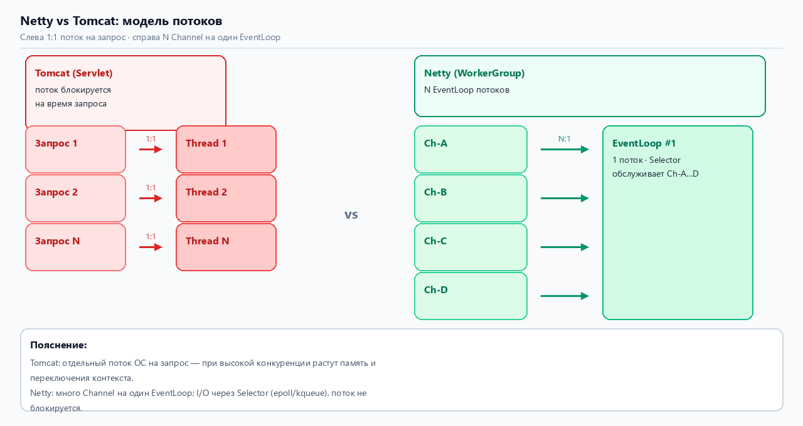
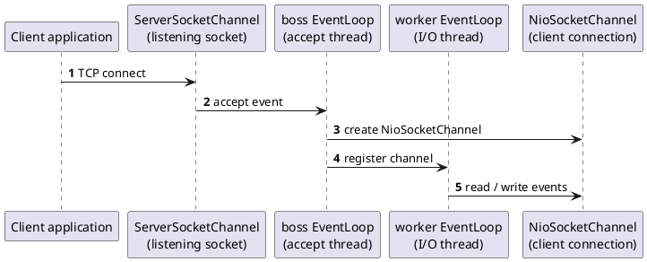
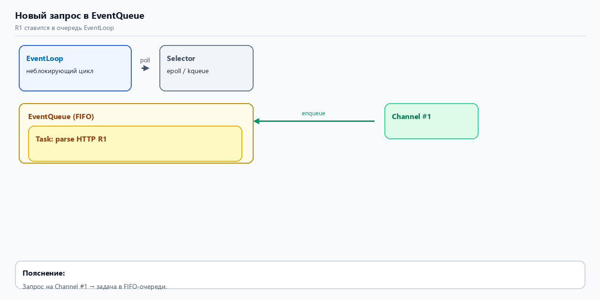
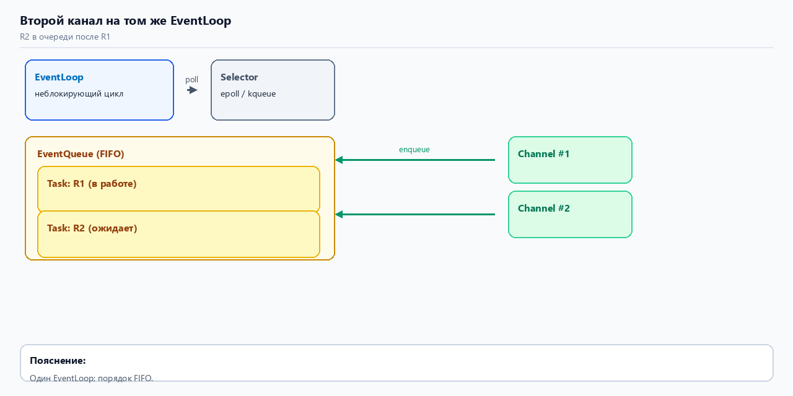
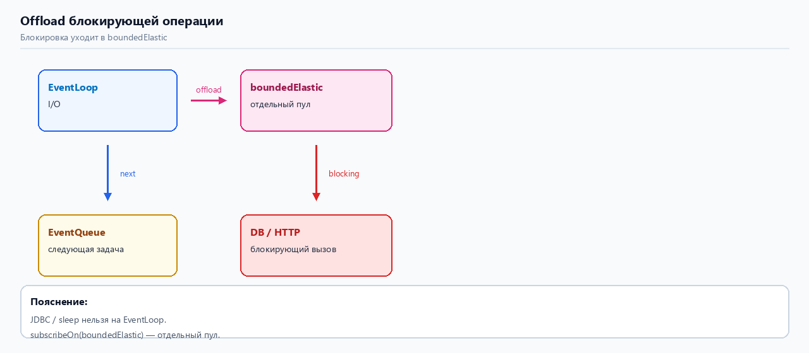
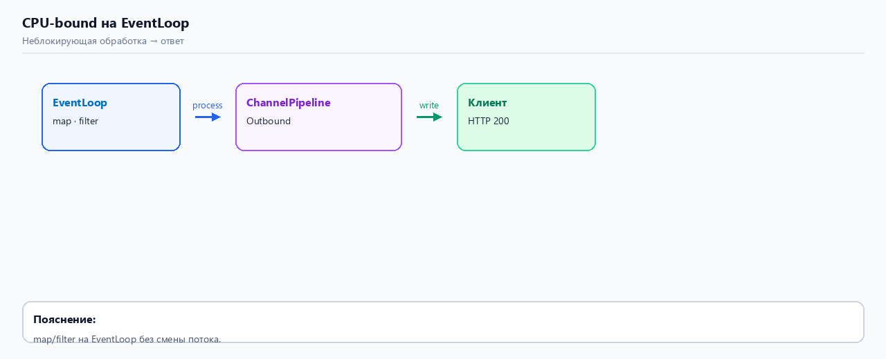
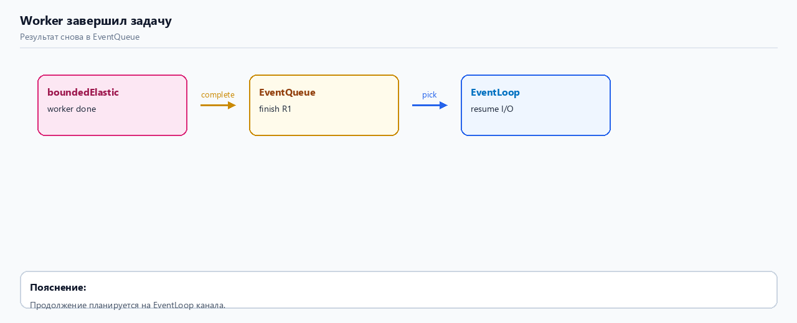
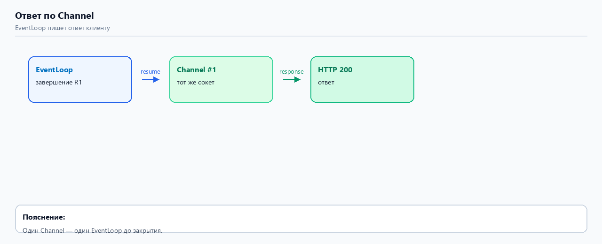
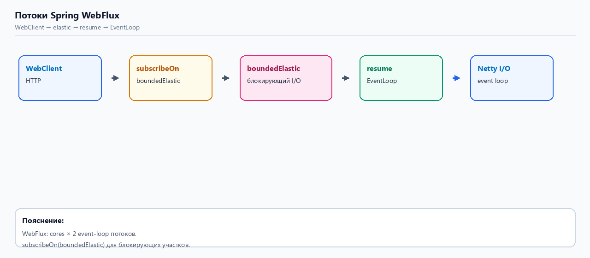

# Spring WebFlux: Netty, Event Loop и потоки

Переработка статьи [Spring WebFlux Internals: How Netty's Event Loop & Threads Power Reactive Apps](https://medium.com/@gourav20056/spring-webflux-internals-how-nettys-event-loop-threads-power-reactive-apps-4698c144ef68) (Chill_Boi.exe, март 2025).

**Перегенерация рисунков:** `python docs/Images-docs/gen_webflux_netty_diagrams.py`

---

## Оглавление

1. [Введение](#введение)
2. [Модель Event Loop](#модель-event-loop)
3. [Ключевые термины](#ключевые-термины)
4. [Механизм в действии](#механизм-в-действии)
5. [Модель потоков Spring WebFlux](#модель-потоков-spring-webflux)
6. [Что дальше](#что-дальше)
7. [Источники](#источники)

---

## Введение

Начнём с Netty. 
 - Если вы ещё не сталкивались с ним — думайте о Netty как об **аналоге Tomcat** в мире Spring WebFlux. 
 - И **Tomcat**, и **Netty** — серверные технологии для сетевого взаимодействия в Java, но архитектура и **модель потоков** у них разные.

Дальше в статье — описывается работа с **Netty**: 
 - модель _**Event Loop**_, как обрабатываются соединения, какие потоки работают в фоне.

---

## Модель Event Loop

В основе **Netty** — **Event Loop**. Это то, что делает **WebFlux** неблокирующим, быстрым и масштабируемым.

Главная мысль в одной фразе:

> **EN:** «The model uses a SINGLE non-blocking thread for processing requests. It is NOT a multi-threaded request handler like Tomcat.»

> **RU:** «Модель использует один неблокирующий поток для обработки запросов. Это не обработчик «отдельный поток на каждый запрос», как у Tomcat.»

Именно поэтому **Netty** и **WebFlux** лучше выдерживают высокую конкуренцию. **_Tomcat_** (и другие servlet-контейнеры) выделяют **отдельный поток** на входящий запрос — при большой нагрузке растут память и CPU. 
 - У Netty **мало потоков** обслуживают **много** одновременных соединений.

Каждый **Channel** в Netty с начала и до конца ведёт **один и тот же** EventLoop (один поток).

### Рисунок 1. Tomcat и Netty — разные модели потоков



**Слева**: один запрос — один поток.

**Справа**: несколько **Channel** — один **_EventLoop_**.

---

## Ключевые термины

**1. EventLoop** — ядро **Netty**. 

Обрабатывает _**сетевые события**_: 
 - чтение, 
 - запись, 
 - управление соединением. 

Каждый **_EventLoop_** всегда _привязан_ **к одному потоку** — задачи на нём выполняются последовательно, без гонок между каналами одного **EventLoop**.

**2. EventLoopGroup** — группа EventLoop. 

 Обычно две группы:
 - **BossGroup** (часто 1 поток) — принимает новые соединения и **_передаёт_** их в **WorkerGroup**;
 - **WorkerGroup** (N потоков) — обрабатывает уже установленные соединения; у каждого потока свой _**EventLoop**_.

**3. Channel** — соединение клиент–сервер (**_сокет_**). 

При запросе создаётся **Channel**; 
  - один **Channel** _всегда обслуживается одним_ **EventLoop**.

- **Socket** vs TCP **socket**:
    - В **Java** под "сокетом" обычно понимают транспортный _**endpoint**_ (например, **java.net.Socket**) — это TCP-соединение между клиентом и сервером.
    - В **Netty** поверх низкоуровневого сокета строится абстракция **Channel**. 
      - **Channel** представляет логический канал ввода/вывода (соединение, файл, datagram и т. п.). Для TCP это обычно **обёртка** над нативным сокетом (в JDK: SocketChannel/NIO; в нативных транспортах Netty — epoll/kqueue fd).
- **Channel** и **EventLoop**:
    - Каждый **Channel** привязан к одному **EventLoop** (одному потоку из пула _EventLoopGroup_). 
      - **EventLoop** отвечает за обработку событий (чтение, запись, подключение, обработка пользовательских событий) для всех **Channel**, прикреплённых к этому **EventLoop**.
    - Это не означает, что весь I/O выполняется в одном Java-потоке на уровне блокирующих **InputStream**/**OutputStream**; 
      - Netty использует неблокирующий NIO или нативный IO и работает асинхронно в рамках **EventLoop**-потока.
- **InputStream**/**OutputStream** внутри сокета:
    - У классического **java.net.Socket** есть _**getInputStream()**_ и **_getOutputStream()_**, которые дают блокирующие потоки для чтения/записи. При использовании блокирующего IO обычно чтение/запись выполняется в отдельных потоках.
    - Netty по умолчанию не использует эти потоки. Вместо этого оно оперирует _**ByteBuf, ChannelHandler**_ и вызовами типа _channelRead, write, flush_. 
      - Под капотом **Netty** использует неблокирующие системные вызовы (_**select/epoll/kqueue**_) и выполняет **callbacks** в _EventLoop_-потоке; никаких отдельных InputStream/OutputStream-объектов для каждого Channel нет.

- Про "2 потока: для передачи и для чтения":
    - В классическом блокирующем подходе часто выделяют один поток на соединение, который читает и пишет (или отдельные потоки для чтения и для записи).
    - В Netty модель другая: 
      - один **EventLoop** (один поток) обслуживает все события канала — чтение и обработка входящих данных, а запись ставится в очередь и при следующем готовом событии отправляется. 
      - Следовательно, для одного **Channel** обычно используется один и тот же **EventLoop**-поток для чтения и для инициирования записи; 
      - записи не требуют отдельного потока per-Channel.
    - При необходимости Netty позволяет передавать heavy CPU/блокирующие задачи в отдельные рабочие пулы (ChannelHandlerContext.**executor**() или собственный _**EventExecutorGroup**_), чтобы не блокировать EventLoop.
- Резюме в пунктах:
    - Сокет в Java **_означает_** TCP-соединение; Netty оборачивает нативный сокет в Channel.
    - _**Channel**_ ассоциирован с одним EventLoop (потоком), который асинхронно обрабатывает и чтение, и запись.
    - Netty **не использует** _InputStream/OutputStream_ для обычного NIO-трафика; вместо этого используются _ByteBuf_ и **callback**-hanlders.
    - В блокирующем стеке «внутри сокета всегда два потока (InputStream/OutputStream)» — это модель блокирующего IO; 
    - Netty — асинхронная/неблокирующая модель, где один поток (EventLoop) может обслуживать много каналов.


    
**4. Selector** (Java NIO) — позволяет **одному потоку** следить за **многими** Channel. 
   - 
   - В Linux — _**epoll**_, (selector) 
   - в macOS/BSD — _kqueue_. (selector)


 - **Selector** сообщает: канал готов к чтению/записи, пришло новое соединение, соединение закрыто.

**5. ChannelPipeline** — цепочка обработчиков как конвейер:
  - **Inbound** (сеть → приложение): чтение с сокета → … → ваш код;
  - **Outbound** (приложение → сеть): ответ → … → запись в сокет.

**6. EventQueue** — очередь задач внутри _EventLoop_ (FIFO). 
  - События ждут и обрабатываются по очереди, **не блокируя** поток на ожидании I/O.

---

## Механизм в действии

Что происходит при старте _**Netty**_-сервера и при _**обработке запроса**_.

## Netty connection acceptance

В **Netty** для TCP-сервера обычно используются две группы **событийных циклов**: `bossGroup` и `workerGroup`. 

 - `bossGroup` обслуживает **входящие** подключения на серверном канале, а 
 - `workerGroup` обслуживает уже **установленные** соединения. 

 - Для каждого _**нового подключения**_ создаётся отдельный `NioSocketChannel`, который затем регистрируется на одном из `EventLoop` из `workerGroup`.

## Как это происходит

1. Клиент устанавливает TCP-соединение с сервером.
2. `ServerSocketChannel` получает событие `accept`.
3. `EventLoop` из `bossGroup` обрабатывает это событие.
4. Создаётся новый `NioSocketChannel` для этого соединения.
5. Этот `NioSocketChannel` регистрируется на `EventLoop` из `workerGroup`.
6. Дальнейшие операции чтения и записи для этого канала выполняет выбранный `worker EventLoop`.

## Роли компонентов

- `EventLoop` — событийный цикл, который последовательно выполняет задачи в одном потоке.
- `EventLoopGroup` — набор `EventLoop`.
- `bossGroup` — группа, которая принимает новые соединения.
- `workerGroup` — группа, которая обслуживает активные соединения.
- `NioSocketChannel` — канал, представляющий клиентское TCP-соединение.
- `ChannelPipeline` — цепочка обработчиков, через которую проходят события канала.


## Схема потока событий

```text
Client
  |
  | TCP connect
  v
ServerSocketChannel
  |
  | accept event
  v
bossGroup EventLoop
  |
  | create NioSocketChannel
  v
workerGroup EventLoop
  |
  | register channel
  v
ChannelPipeline
  |
  +--> inbound events: read
  +--> outbound events: write
```


## Sequence diagram



## Input and output in Socket

В классическом `java.net.Socket` доступны `InputStream` и `OutputStream`.

 - `InputStream` используется для чтения данных из соединения, а `OutputStream` — для записи данных в соединение. 
 - В Netty для работы с данными обычно используются `Channel`, `ByteBuf` и обработчики в `ChannelPipeline`.

## Summary

В **Netty** новое TCP-подключение проходит через `bossGroup`, создаётся `NioSocketChannel`, после чего канал передаётся в `workerGroup` для обработки I/O. 
 - `EventLoop` выполняет события последовательно в одном потоке, а `ChannelPipeline` обрабатывает чтение и запись данных по этому каналу.


### Server Startup

- Создаётся **bossGroup** с **1 потоком** — принимать соединения.
- Создаётся **workerGroup** с **несколькими потоками** — у каждого свой _**EventLoop**_.

### Connection Acceptance (Принятие подключения)

- Клиент подключается → и _bossGroup_ принимает соединение.
- Создаётся **NioSocketChannel**.
- Канал **назначается** одному _EventLoop_ из **workerGroup**.

### Channel Registration

- Канал регистрируется в своём EventLoop (который выбран из **workerGroup** и имеет один поток).
- _EventLoop_ добавляет канал в **Selector**.
- Дальше **все I/O** (операции ввода\вывода) этого канала — происходят **только в этом потоке** (thread safety без лишних lock).

## Event Processing

- **Selector** кладёт готовое событие в очередь `EventLoop`.
  - `EventLoop` обрабатывает задачи **последовательно на одном потоке**.
  
- **Неблокирующие шаги** выполняются прямо на `EventLoop`: чтение, парсинг, `map`, сборка ответа.
- **Блокирующие шаги** выносятся в отдельный пул потоков.

- Когда результат готов, обработка **возвращается в тот же `EventLoop`**.
- Дальше `EventLoop` завершает цепочку и отправляет ответ через `OutboundHandler` того же `Channel`.


### Ещё короче

> Быстрая логика выполняется на `EventLoop`.
> Блокирующая логика уходит в отдельный пул.
> После завершения результат возвращается в тот же `EventLoop`, который продолжает обработку и пишет ответ в тот же `Channel`.


Ниже — шесть иллюстраций из оригинальной статьи (идея схем: [Diego Lucas Silva — Spring WebFlux under the hood](https://www.linkedin.com/pulse/spring-webflux-under-hood-diego-lucas-silva/)).

### Рисунок 2. Новый запрос попадает в EventQueue



Запрос с Channel превращается в задачу в очереди EventLoop.

### Рисунок 3. Второй запрос с другого Channel на том же EventLoop



Второй Channel на том же EventLoop — вторая задача встаёт в FIFO после первой.

### Рисунок 4. Блокирующая операция уходит в другой пул



- вызов оператора **subscribeOn**(boundedElastic), с указанием типа boundedElastic,  переносит JDBC / sync HTTP / sleep в отдельный пул. EventLoop не ждёт завершения этого вызова и сразу берёт следующую задачу из EventQueue.

### Рисунок 5. Неблокирующая задача завершена — ответ уходит клиенту



Лёгкая обработка на EventLoop; ответ через outbound-цепочку.

### Рисунок 6. Фоновый поток завершил работу — задача снова в EventQueue



После блокирующего шага продолжение снова планируется на EventLoop.

### Рисунок 7. Запрос завершён и отправлен по тому же Channel



Ответ уходит в тот же **Channel**, с которого пришёл запрос.

**EventLoop**, **Selector** и фоновые потоки вместе дают **настоящую** неблокирующую обработку при высокой конкуренции.

---

## Модель потоков Spring WebFlux

Где здесь _**Spring WebFlux**_? Он **сам** настраивает потоки — поэтому при работе с `Mono` и `Flux` мы обычно не создаём пулы вручную.

**WebFlux** поднимает:

**1. Event Loop Threads** — те же потоки **Netty** из раздела выше. По умолчанию их `Runtime.getRuntime().availableProcessors() * 2`.

**2. Scheduler Threads** — пулы **Project Reactor** для offload блокирующих операций (`Schedulers.boundedElastic()`, `parallel()` и др.).

Пример:

```java
return Mono.fromCallable(() -> callExternalApi())
    .subscribeOn(Schedulers.boundedElastic());
```

`subscribeOn(Schedulers.boundedElastic())` переносит выполнение на elastic-pool. 
  - Когда блокирующая часть закончилась — обработка **возвращается** на event loop.

По умолчанию **WebClient** для части операций тоже использует `boundedElastic()`.

### Рисунок 8. Цепочка потоков в WebFlux



---

## Что дальше

Понимание **Event Loop** и потоков **WebFlux** объясняет, как реактивное приложение держит много соединений на малом числе потоков.

Следующий вопрос из статьи автора: что если данные приходят **быстрее**, чем их успевают обработать? Это **Backpressure**. 
 - В проекте: [Backpressure в project-reactor-interview-guide.md](./project-reactor-interview-guide.md#4-backpressure-обратное-давление).

---

## Источники

| | |
|---|---|
| Оригинал (Medium) | https://medium.com/@gourav20056/spring-webflux-internals-how-nettys-event-loop-threads-power-reactive-apps-4698c144ef68 |
| Иллюстрации (идея) | https://www.linkedin.com/pulse/spring-webflux-under-hood-diego-lucas-silva/ |
