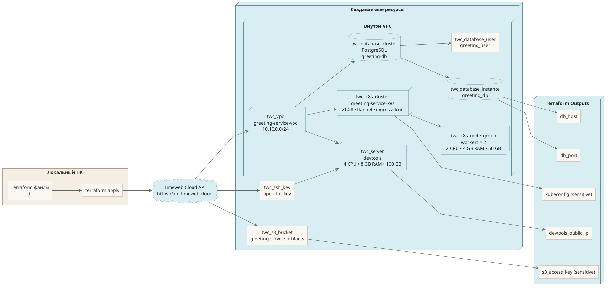

## Раздел 4. Схема Terraform-инфраструктуры

### Пояснение

**Что показывает схема**

- Схема показывает, какие ресурсы создаёт команда **`terraform apply`** в **Timeweb Cloud**.
- Источником является локальная Terraform-конфигурация, которая через **Timeweb Cloud API** создаёт облачные ресурсы.
- Отдельно показаны не только сами ресурсы, но и **Terraform Outputs**, которые потом используются в настройке и эксплуатации.

**Что создаётся через Terraform**

- **`twc_ssh_key`** — SSH-ключ для доступа к серверу.
- **`twc_vpc`** — приватная сеть **10.10.0.0/24**, в которой размещаются основные сервисы.
- **`twc_server`** — сервер **devtools**, на котором затем могут работать **Bitbucket Server**, **Docker Registry** и другие утилиты.
- **`twc_k8s_cluster`** — управляемый кластер **Kubernetes**.
- **`twc_k8s_node_group`** — группа worker-нод для запуска приложений в Kubernetes.
- **`twc_database_cluster`** — кластер управляемой базы данных **PostgreSQL**.
- **`twc_database_instance`** — конкретный инстанс базы внутри database cluster.
- **`twc_database_user`** — пользователь базы данных для приложения.
- **`twc_s3_bucket`** — S3-совместимый bucket для артефактов и файлов.

**Как связаны ресурсы**

- Сначала Terraform обращается к **Timeweb Cloud API** и создаёт базовые ресурсы.
- **SSH key** используется сервером **devtools**.
- **VPC** объединяет **devtools**, **Kubernetes** и **PostgreSQL** в одной сети.
- **Kubernetes cluster** использует **node group** для вычислительных ресурсов.
- **Database cluster** содержит **database instance** и **database user**.
- **S3 bucket** создаётся отдельно, но тоже управляется той же Terraform-конфигурацией.

**Что такое Terraform Outputs**

- **`kubeconfig`** — данные для подключения к кластеру **Kubernetes**.
- **`db_host`** и **`db_port`** — адрес и порт базы данных.
- **`s3_access_key`** — ключ доступа к S3-хранилищу.
- **`devtools_public_ip`** — публичный IP сервера **devtools**.

### Пояснение по Terraform

**Что делает `terraform apply`**

- Команда **`terraform apply`** берёт описанные в `.tf` файлах ресурсы и приводит инфраструктуру к этому состоянию. См. [Terraform в Timeweb Cloud](https://timeweb.cloud/docs/terraform)
- Проще говоря, это запуск создания или обновления всей облачной инфраструктуры из кода.

> "Terraform позволяет автоматизированно управлять ресурсами в Timeweb Cloud с помощью удобных файлов конфигурации формата HCL (HashiCorp Configuration Language) и детальных планов вносимых изменений."

> «Terraform позволяет автоматизированно управлять ресурсами в Timeweb Cloud с помощью удобных файлов конфигурации формата HCL (HashiCorp Configuration Language) и детальных планов вносимых изменений.»

**Почему `kubeconfig` и `s3_access_key` помечены как sensitive**

- Terraform требует явно помечать чувствительные output-значения как **sensitive**, чтобы снизить риск случайной утечки. См. [How-to output sensitive data with Terraform](https://support.hashicorp.com/hc/en-us/articles/5175257151891-How-to-output-sensitive-data-with-Terraform)
- Поэтому такие значения не должны свободно светиться в логах и выводе команд.

> "Terraform requires that any root module output containing sensitive data be explicitly marked as sensitive, to confirm your intent."

> «Terraform требует, чтобы любой output корневого модуля, содержащий чувствительные данные, был явно помечен как sensitive, чтобы подтвердить это намерение.»
