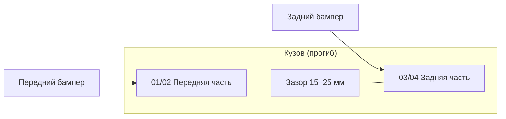

# Бушвакеры УАЗ Патриот — комплект из 4 деталей (150 мм)

Чертежи и ТЗ для **3D-печати мастер-моделей** и **изготовления формы** под литьё / термоформовку пластмассы.

| Параметр | Значение |
|---|---|
| Автомобиль | УАЗ Патриот 3163 (рестайлинг 2015+, ориентир) |
| Стиль | Pocket-style (карманы под болты), как Lapter / Bushwacker |
| Вылет от крыла | **150 мм** (±2 мм в центре арки) |
| Деталей в комплекте | **4** — по **2 на сторону** |
| Материал серии | АБС 3,5–4,0 мм (термоформовка) или LLDPE (ротационное формование) |

---

## 1. Состав комплекта

На **каждой** стороне — **две** детали, а не одна цельная наполовину кузова:

| Поз. | Обозначение | Наименование | Зеркало |
|---|---|---|---|
| 01 | БВ-П-L | Бушвакер передний левый | — |
| 02 | БВ-П-R | Бушвакер передний правый | зеркально 01 |
| 03 | БВ-З-L | Бушвакер задний левый | — |
| 04 | БВ-З-R | Бушвакер задний правый | зеркально 03 |

**Итого: 4 детали** (2 передних + 2 задних). Левая и правая стороны — зеркальные пары.

### Почему две части на сторону, а не одна

На Патриоте при движении по неровностям:

- рама и кузов **прогибаются** относительно друг друга;
- **передний** и **задний** бамперы (часто на силовых кронштейнах к раме или подрамнику) смещаются **отдельно** от боковины;
- цельная накладка «от передней до задней арки» трескается или отрывает крепёж.

Поэтому разрез проходит **между передней и задней арками** — в зоне порога / подножки, где допустим относительный ход **15–25 мм**.



---

## 2. Привязка к кузову и бамперам

| Деталь | Основная посадка | Доп. крепление | Зона скользящего нахлёста |
|---|---|---|---|
| 01, 02 | переднее крыло, кромка арки | нижний край — к кромке **переднего** бампера / «клыка» | задний торец — **нахлёст 20 мм** на порог |
| 03, 04 | заднее крыло, кромка арки | нижний край — к кромке **заднего** бампера | передний торец — **под** нахлёст передней детали |

Передняя деталь **перекрывает** заднюю на **20 мм** по вертикали стыка (см. `drawings/04-styk-front-rear.svg`). Нижняя кромка обеих деталей не жёстко сваривается — только уплотнитель и точечный крепёж к порогу (1–2 клипсы).

---

## 3. Габариты и ориентиры кузова

По официальным данным УАЗ Патриот ([каталог](https://www.uaz.ru/data/uaz/assets/uaz-patriot-catalog-011122.pdf)):

| Параметр | мм |
|---|---|
| Ширина кузова без зеркал | 1900 |
| Колея | 1600 / 1610 |
| Колёсная база | 2760 |

С вылетом **150 мм** с каждой стороны расчётная ширина по аркам: **1900 + 2×150 = 2200 мм** (без зеркал).

### Ориентировочная длина дуги по кромке (для раскладки чертежа)

| Деталь | Длина по кромке посадки, мм | Примечание |
|---|---|---|
| 01, 02 | 850–950 | от переднего бампера до стыка у передней двери |
| 03, 04 | 750–850 | от стыка у задней двери до заднего бампера |

Точные значения — **после снятия шаблона или 3D-скана** конкретного автомобиля (год, один/два бака, тип бамперов).

---

## 4. Поперечный профиль (вылет 150 мм)

Главный размер — **вылет 150 мм** от базовой плоскости крыла до наружной точки карманной стенки (в центре арки).

```
     кузов
       │
       │← фланец 30 ─→│
       │   посадки    │    выпуклая полка
       ├────────────────┤───────────────┐
       │                │               │ ← карманная стенка
       │   уплотнитель  │               │   (карманы Ø22)
       │                │               │
       └────────────────┴───────────────┘
       │←──────── 150 ────────→│← борт 12 →│
```

| Элемент | Размер, мм |
|---|---|
| Вылет | **150** |
| Высота видимой полки (по вертикали) | 140–160 |
| Фланец посадки к кузову | 30 |
| Обратный борт снизу | 12–15 |
| Радиус наружного ребра | R8–R12 |
| Толщина стенки | 3,5 (формовка) / 4,0 (3D-мастер) |
| Уклон стенок для формы | 2–3° |

Чертёж профиля: [`drawings/01-profile-cross-section.svg`](drawings/01-profile-cross-section.svg)  
DXF профиля: [`drawings/01-profile-cross-section.dxf`](drawings/01-profile-cross-section.dxf)

---

## 5. Карманы (pocket-style)

По фото — декоративно-крепёжные карманы вдоль верхней дуги.

| Параметр | Перед 01/02 | Зад 03/04 |
|---|---|---|
| Количество карманов | 7 | 6 |
| Шаг по дуге | 100 | 105 |
| Ø кармана | 22 | 22 |
| Глубина кармана | 7 | 7 |
| Крепёж | M5 × 16, потай | M5 × 16, потай |
| Уклон кармана (draft) | 3° | 3° |

Развёртка карманов: [`drawings/05-pocket-layout-front.svg`](drawings/05-pocket-layout-front.svg), [`drawings/06-pocket-layout-rear.svg`](drawings/06-pocket-layout-rear.svg)

---

## 6. Стык передней и задней детали (flex joint)

| Параметр | Значение |
|---|---|
| Зазор между деталями при установке | 5–8 мм |
| Нахлёст передней на заднюю | 20 мм |
| Допустимый ход при прогибе рамы | ±15 мм |
| Уплотнение | EPDM 8×12 мм в пазе на задней детали |

Деталь стыка: [`drawings/04-styk-front-rear.svg`](drawings/04-styk-front-rear.svg)

---

## 7. Комплект чертежей

| Файл | Содержание |
|---|---|
| [`drawings/01-profile-cross-section.svg`](drawings/01-profile-cross-section.svg) | Поперечный профиль, вылет 150 мм |
| [`drawings/01-profile-cross-section.dxf`](drawings/01-profile-cross-section.dxf) | Тот же профиль в DXF (импорт в Fusion/SolidWorks) |
| [`drawings/02-assembly-side.svg`](drawings/02-assembly-side.svg) | Сборка: вид сбоку, 2 части на сторону |
| [`drawings/03-top-layout.svg`](drawings/03-top-layout.svg) | Расположение 4 деталей, вид сверху |
| [`drawings/04-styk-front-rear.svg`](drawings/04-styk-front-rear.svg) | Узел стыка с нахлёстом |
| [`drawings/05-pocket-layout-front.svg`](drawings/05-pocket-layout-front.svg) | Развёртка карманов, перед |
| [`drawings/06-pocket-layout-rear.svg`](drawings/06-pocket-layout-rear.svg) | Развёртка карманов, зад |
| [`drawings/07-front-part.svg`](drawings/07-front-part.svg) | Чертёж детали 01 (перед лев.) |
| [`drawings/08-rear-part.svg`](drawings/08-rear-part.svg) | Чертёж детали 03 (зад лев.) |

---

## 8. 3D-печать мастер-моделей

Деталь длиной ~900 мм **не помещается** в типовой FDM-принтер. Рекомендации:

1. Печатать **мастер** (не готовую арку) секциями по **200–250 мм** вдоль дуги.
2. Стыки секций: шип **10×8 мм**, зазор **0,2 мм**, склейка + шпаклёвка.
3. Материал мастера: PETG / ABS; слой 0,2 мм; 3–4 периметра.
4. После сборки — шлифовка, грунт, **уклоны 2–3°** проверить шаблоном.

Ориентир сегментации на чертеже 07/08: линии **A–A**, **B–B**, **C–C**.

---

## 9. Форма для пластмассы

### Термоформовка АБС (рекомендуется для малой серии)

| Этап | Действие |
|---|---|
| 1 | Мастер из 3D-печати + шпаклёвка |
| 2 | Матрица из стеклопластика по мастеру |
| 3 | Лист АБС **3,5 мм**, вакуумная формовка |
| 4 | Обрезка, сверловка карманов (или карманы — отдельная вставка) |
| 5 | Утяжка листа: припуск **+0,5 %** по длине дуги |

### Литьё под давлением

Для детали ~1 м длины пресс-форма **экономически нецелесообразна** при тираже &lt;500 комплектов. Для прототипа — только термоформовка или ручная стеклопластиковая оболочка.

### Параметры формы

| Параметр | Значение |
|---|---|
| Линия разъёма | по плоскости фланца посадки |
| Уклон | 2–3° на всех вертикальных стенках |
| Радиусы | R ≥ 5 мм (для формовки), R ≥ 8 мм (наружные) |
| Усадка АБС | 0,4–0,7 % |
| Текстура «шагрень» | на матрице — пескоструй #80 или химическое травление |

---

## 10. Спецификация материалов (комплект на 1 авто)

| Поз. | Наименование | Кол-во |
|---|---|---|
| 01 | Бушвакер передний левый | 1 |
| 02 | Бушвакер передний правый | 1 |
| 03 | Бушвакер задний левый | 1 |
| 04 | Бушвакер задний правый | 1 |
| — | Болт M5×16 потай, нерж. | 26 |
| — | Гайка M5, нерж. | 26 |
| — | Уплотнитель EPDM 8×12 | 6,5 м |
| — | Клипса стыка порога | 4 |

---

## 11. Что нужно уточнить под конкретный автомобиль

Без этих данных посадочная кромка остаётся **ориентировочной**:

1. Год выпуска и **1 или 2** бензобака (вырез лючка на 03/04).
2. Тип бамперов (штатные / силовые / с «клыками»).
3. Размер шин и вылет диска (ET) — проверка, что 150 мм закрывает протектор.
4. 3D-скан или картонный шаблон кромки арки — для финальной подгонки DXF/STEP.

---

## 12. Связанные источники

| Источник | Данные |
|---|---|
| [Lapter ТКУ-3163RC](https://lapter4x4.ru/product/rasshiriteli-kolesnyh-arok-uaz-patriot-new-bez-nak-2/) | выступ 90 мм, LLDPE, комплект 4 арки |
| [Бушвакеры 160 мм, АБС](https://vnedorozhnik73.ru/rasshiriteli-kolesnykh-arok-bushvakery-uaz-patriot-s-16-g-160-mm-detail) | ширина 160 мм, высота 120–180 мм |
| [Термоформовка 3,5 мм](https://club4x4.ru/shop/rasshiriteli-kolesnyh-arok410/rasshiriteli-kolyosnyh-arok-patriot-abs-plastik-3-5-mm-restajling/) | метод изготовления серийных арок |

---

*Документ: ТЗ и эскизные чертежи. Для производства серии требуется финализация посадочных поверхностей по скану кузова.*
