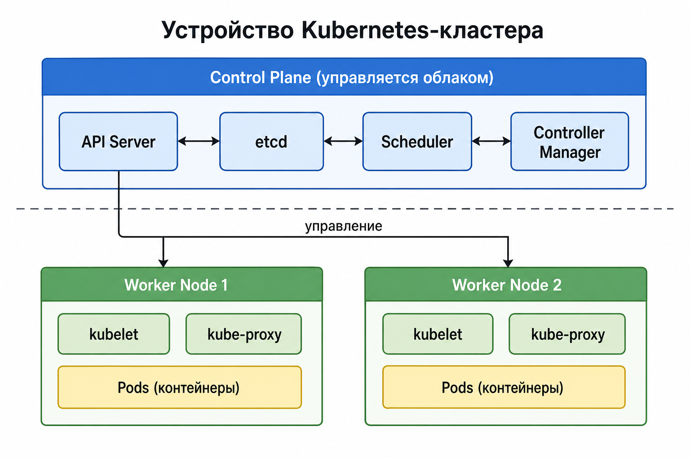
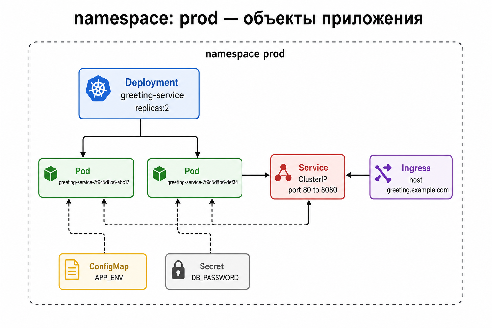
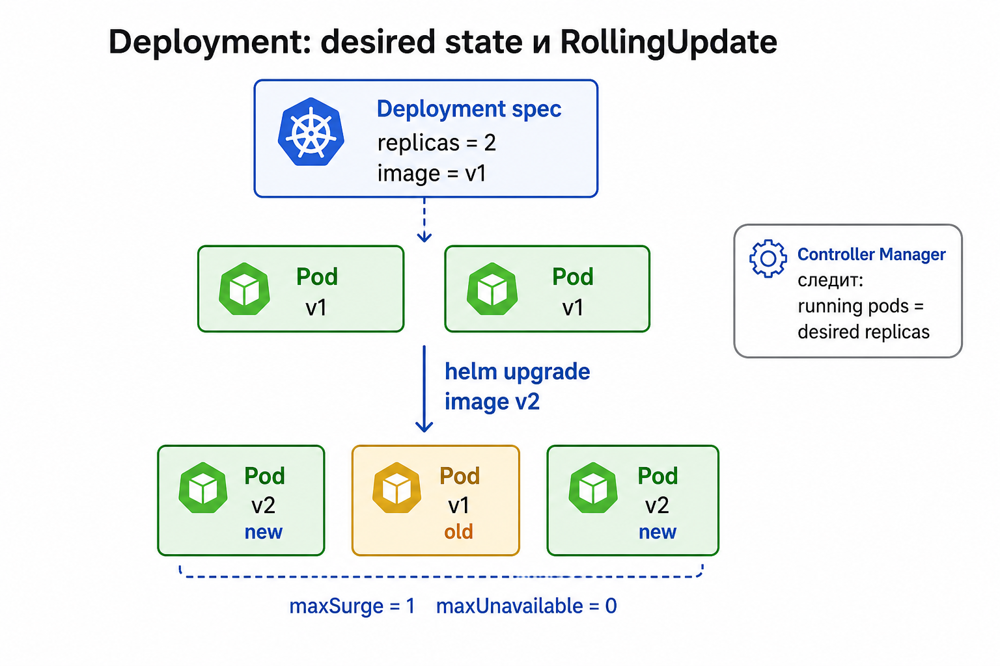
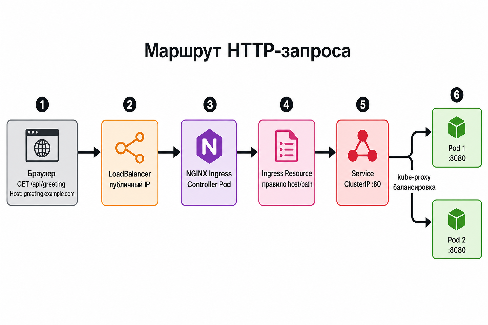

# Устройство Kubernetes-кластера и маршрут HTTP-запроса

Версия: 1.0 | 2026-06 | Проект: greeting-service-infra (Timeweb Cloud)

Документ описывает **теорию** устройства managed Kubernetes-кластера, роли основных объектов и **полный путь HTTP-запроса** от браузера до Spring Boot-пода.

> **Word-версия (основной документ):** [Устройство-кластера-Kubernetes-и-маршрут-запроса.docx](./Устройство-кластера-Kubernetes-и-маршрут-запроса.docx)  
> Пересборка: `python docs/gen_k8s_cluster_architecture_docx.py`

Этот `.md`-файл — исходник для генератора; для Word и курса используйте `.docx`.

---

## Оглавление

1. [Цель и контекст проекта](#раздел-1-цель-и-контекст-проекта)
2. [Устройство Kubernetes-кластера](#раздел-2-устройство-kubernetes-кластера)
3. [Control Plane: компоненты управления](#раздел-3-control-plane-компоненты-управления)
4. [Worker Node: где работают поды](#раздел-4-worker-node-где-работают-поды)
5. [Namespace и объекты приложения](#раздел-5-namespace-и-объекты-приложения)
6. [Deployment и жизненный цикл подов](#раздел-6-deployment-и-жизненный-цикл-подов)
7. [Service: стабильная точка доступа внутри кластера](#раздел-7-service-стабильная-точка-доступа-внутри-кластера)
8. [Ingress и Ingress Controller](#раздел-8-ingress-и-ingress-controller)
9. [Полный маршрут HTTP-запроса](#раздел-9-полный-маршрут-http-запроса)
10. [DNS и service discovery](#раздел-10-dns-и-service-discovery)
11. [Сводная таблица объектов](#раздел-11-сводная-таблица-объектов)

---

## Раздел 1. Цель и контекст проекта

### Что описывает этот документ

1. **Архитектуру** managed Kubernetes-кластера в Timeweb Cloud: control plane, worker-узлы, сетевой драйвер.
2. **Объекты** namespace `dev` / `prod`, в которых развёрнут `greeting-service` через Helm.
3. **Маршрутизацию** внешнего HTTP-трафика: LoadBalancer → NGINX Ingress Controller → Service → Pod.

### Контекст greeting-service-infra

Кластер создаётся Terraform-ресурсом `twc_k8s_cluster` с параметрами:

- `ingress = true` — Timeweb Cloud автоматически устанавливает **NGINX Ingress Controller**;
- `network_driver = "flannel"` — overlay-сеть между подами на разных узлах;
- worker-узлы — группа `twc_k8s_node_group.workers`.

Приложение публикуется через Helm chart `infra/helm/greeting-service`: Deployment, Service (`ClusterIP`), Ingress (`ingressClassName: nginx`).

---

## Раздел 2. Устройство Kubernetes-кластера

### Рисунок 1. Control Plane и Worker Nodes



### Пояснение к рисунку 1

Kubernetes-кластер логически делится на **control plane** (управление) и **worker nodes** (исполнение). В managed-кластере Timeweb Cloud control plane обслуживает провайдер; вы работаете с кластером через `kubectl` и API Server.

**Control plane** хранит желаемое состояние кластера и принимает решения:

| Компонент | Роль |
|---|---|
| **kube-apiserver** | Единая точка входа HTTP API; все `kubectl`-команды и контроллеры обращаются сюда |
| **etcd** | Распределённое key-value хранилище — «источник правды» о состоянии объектов |
| **kube-scheduler** | Назначает Pod на подходящий Node, если Pod ещё не привязан к узлу |
| **kube-controller-manager** | Запускает контроллеры (Deployment, ReplicaSet и др.), приводящие фактическое состояние к желаемому |

**Worker node** — машина (VM), на которой **kubelet** запускает контейнеры подов, **kube-proxy** реализует правила Service, **container runtime** (containerd) исполняет OCI-образы.

Стрелка «управление» от API Server к узлам означает: kubelet на каждом узле **опрашивает API** (или получает watch-события) и приводит локальные контейнеры в соответствие с манифестами.

Kubernetes определяет кластер как пару «control plane + worker nodes»:

https://kubernetes.io/docs/concepts/overview/components/

**Цитата:**

> A Kubernetes cluster consists of a **control plane** and one or more **worker nodes**.

**Перевод:**

> Kubernetes-кластер состоит из **control plane** и одного или более **worker nodes**.

---

## Раздел 3. Control Plane: компоненты управления

### kube-apiserver

Все операции с объектами (создать Deployment, прочитать Pod, обновить Service) проходят через API Server. Он валидирует запросы, записывает изменения в etcd и уведомляет подписчиков (controllers, kubelet).

https://kubernetes.io/docs/concepts/overview/components/

**Цитата:**

> **kube-apiserver** — The core component server that exposes the Kubernetes HTTP API.

**Перевод:**

> **kube-apiserver** — основной сервер, предоставляющий HTTP API Kubernetes.

### etcd

Хранит все объекты API (Pod, Service, Secret…). Потеря etcd без бэкапа — потеря «мозга» кластера. В managed-сервисе резервное копирование etcd — зона ответственности провайдера.

**Цитата:**

> **etcd** — Consistent and highly-available key value store for all API server data.

**Перевод:**

> **etcd** — согласованное и высокодоступное key-value хранилище для всех данных API server.

### kube-scheduler

Когда вы создаёте Pod (напрямую или через Deployment), scheduler выбирает узел с достаточными CPU/RAM и учётом affinity/taints.

**Цитата:**

> **kube-scheduler** — Looks for Pods not yet bound to a node, and assigns each Pod to a suitable node.

**Перевод:**

> **kube-scheduler** — ищет Pod'ы, ещё не привязанные к узлу, и назначает каждый Pod на подходящий node.

### kube-controller-manager

Deployment Controller следит: «должно быть 2 реплики» → если Pod упал, создаёт новый. Это паттерн **declarative reconciliation** — задано желаемое состояние, контроллер устраняет расхождения.

**Цитата:**

> **kube-controller-manager** — Runs controllers to implement Kubernetes API behavior.

**Перевод:**

> **kube-controller-manager** — запускает контроллеры, реализующие поведение API Kubernetes.

---

## Раздел 4. Worker Node: где работают поды

### kubelet

Агент на каждом узле. Получает спецификацию Pod от API Server, через runtime запускает контейнеры, сообщает статус (Running, CrashLoopBackOff), выполняет liveness/readiness probes.

**Цитата:**

> **kubelet** — Ensures that Pods are running, including their containers.

**Перевод:**

> **kubelet** — обеспечивает работу Pod'ов, включая их контейнеры.

### kube-proxy

Реализует абстракцию **Service**: правила iptables или IPVS на узле направляют трафик на IP подов, соответствующих selector Service. Без kube-proxy ClusterIP Service не балансировал бы запросы между репликами.

**Цитата:**

> **kube-proxy** — Maintains network rules on nodes to implement Services.

**Перевод:**

> **kube-proxy** — поддерживает сетевые правила на узлах для реализации Services.

### Container runtime

Kubernetes не запускает контейнеры сам — делегирует **container runtime** (обычно containerd). Образ `greeting-service` из Docker Registry скачивается kubelet'ом через `imagePullSecrets`.

**Цитата:**

> **Container runtime** — Software responsible for running containers.

**Перевод:**

> **Container runtime** — ПО, ответственное за запуск контейнеров.

---

## Раздел 5. Namespace и объекты приложения

### Рисунок 2. Объекты в namespace prod



### Пояснение к рисунку 2

**Namespace** — виртуальная граница внутри одного физического кластера. Объекты с одним именем могут сосуществовать в разных namespace (`dev` и `prod`). RBAC, квоты и сетевые политики часто задаются на уровне namespace.

На рисунке — типичный набор для stateless HTTP-сервиса:

| Объект | Назначение в проекте |
|---|---|
| **Deployment** | Держит 2 реплики Pod с контейнером Spring Boot |
| **Pod** | Минимальная единица исполнения: 1+ контейнеров, общий network namespace |
| **Service** | Стабильный виртуальный IP `:80` → `targetPort: 8080` на подах |
| **Ingress** | Правило: `Host: greeting.example.com` → Service |
| **ConfigMap** | Несекретные переменные (`APP_ENV`, `APP_VERSION`) |
| **Secret** | Чувствительные данные (`DB_URL`, пароль) — монтируются как env |

Deployment **не создаёт Pod напрямую** — он управляет ReplicaSet, который создаёт Pod. На схеме это упрощено до «Deployment → Pod».

Pod — эфемерен: при перезапуске меняется IP. Поэтому клиенты **никогда** не обращаются к Pod по IP — только через Service.

https://kubernetes.io/docs/concepts/workloads/pods/

**Цитата:**

> A Pod (as in a pod of whales or pea pod) is a group of one or more containers, with shared storage and network resources, and a specification for how to run the containers.

**Перевод:**

> Pod — группа из одного или нескольких контейнеров с общими storage и сетевыми ресурсами и спецификацией запуска контейнеров.

---

## Раздел 6. Deployment и жизненный цикл подов

### Рисунок 3. Deployment и RollingUpdate



### Пояснение к рисунку 3

**Deployment** — декларативный способ управлять stateless-приложением. Вы задаёте **desired state** (образ, число реплик, ресурсы), контроллер постепенно приводит кластер к этому состоянию.

При `helm upgrade` с новым тегом образа Deployment создаёт **новый ReplicaSet** и выполняет **RollingUpdate**:

- `maxSurge: 1` — временно может быть на 1 Pod больше желаемого числа;
- `maxUnavailable: 0` — нельзя опускаться ниже заданного числа готовых Pod (нет даунтайма при достаточном числе реплик).

Старые Pod'ы завершаются по одному, новые поднимаются — Service и Ingress продолжают направлять трафик только на **Ready** Pod'ы (readiness probe).

https://kubernetes.io/docs/concepts/workloads/controllers/deployment/

**Цитата:**

> You describe a **desired state** in a Deployment, and the Deployment Controller changes the **actual state** to the desired state at a controlled rate.

**Перевод:**

> Вы описываете **желаемое состояние** в Deployment, а Deployment Controller **постепенно** приводит фактическое состояние к желаемому.

**Цитата:**

> A new ReplicaSet is created, and the Deployment gradually scales it up while scaling down the old ReplicaSet, ensuring Pods are replaced at a controlled rate.

**Перевод:**

> Создаётся новый ReplicaSet; Deployment постепенно масштабирует его вверх, уменьшая старый ReplicaSet, заменяя Pod'ы контролируемым темпом.

---

## Раздел 7. Service: стабильная точка доступа внутри кластера

### Зачем нужен Service

Pod'ы получают IP из pod CIDR, но IP **непостоянны**. Service даёт:

- стабильный **ClusterIP** (внутренний виртуальный IP);
- DNS-имя `greeting-service.prod.svc.cluster.local`;
- **load balancing** между endpoints (IP:port всех подходящих Pod).

В Helm chart `greeting-service` Service слушает порт **80** и перенаправляет на **8080** контейнера Spring Boot.

https://kubernetes.io/docs/concepts/services-networking/service/

**Цитата:**

> **ClusterIP** — Exposes the Service on a cluster-internal IP. Choosing this value makes the Service only reachable from within the cluster. This is the default… You can expose the Service to the public internet using an **Ingress** or a Gateway.

**Перевод:**

> **ClusterIP** — публикует Service на внутреннем IP кластера; доступен только изнутри. Это тип по умолчанию… Доступ из интернета — через **Ingress** или Gateway.

### kube-proxy и endpoints

При создании Service контроллер endpoints записывает IP всех Pod с matching labels. kube-proxy на каждом узле обновляет правила перенаправления: трафик на ClusterIP:80 распределяется между Pod:8080 (round-robin или по политике sessionAffinity).

---

## Раздел 8. Ingress и Ingress Controller

### Два разных понятия

| | Ingress (ресурс) | Ingress Controller (Pod) |
|---|---|---|
| **Что это** | Объект API с правилами маршрутизации | Процесс (NGINX), который правила **исполняет** |
| **Аналогия** | Табличка «кому звонить» на ресепшн | Сотрудник, который реально соединяет линию |
| **В проекте** | `templates/ingress.yaml` в Helm | NGINX в `ingress-nginx`, ставится Timeweb при `ingress=true` |

**Ingress resource** описывает: при `Host: greeting.example.com` и path `/` направлять трафик на Service `greeting-service:80`.

**Ingress Controller** читает все Ingress в кластере, конфигурирует NGINX (или другой proxy) и часто получает **внешний IP** через Service типа LoadBalancer.

https://kubernetes.io/docs/concepts/services-networking/ingress/

**Цитата:**

> An Ingress may be configured to give Services **externally-reachable URLs**, **load balance** traffic, terminate SSL / TLS, and offer **name-based virtual hosting**.

**Перевод:**

> Ingress может давать Service **внешние URL**, **балансировать** трафик, терминировать SSL/TLS и обеспечивать **виртуальный хостинг по имени**.

**Цитата:**

> An **Ingress controller** is responsible for fulfilling the Ingress, usually with a load balancer, though it may also configure your edge router or additional frontends to help handle the traffic.

**Перевод:**

> **Ingress controller** исполняет Ingress — обычно через load balancer или фронтенд на периметре сети.

### ingressClassName

В `values.yaml` указано `ingressClassName: "nginx"`. Только контроллер с class `nginx` обработает этот Ingress — важно, если в кластере несколько контроллеров.

---

## Раздел 9. Полный маршрут HTTP-запроса

### Рисунок 4. От браузера до Spring Boot



### Пояснение к рисунку 4 (пошагово)

Пример: `GET https://greeting-dev.cloud-terra.online/api/greeting`

| Шаг | Компонент | Что происходит |
|-----|-----------|----------------|
| **1** | Браузер | DNS резолвит hostname → публичный IP LoadBalancer; TLS handshake (если HTTPS) |
| **2** | LoadBalancer | Облачный балансировщик Timeweb; Service `ingress-nginx-controller` типа LoadBalancer; `EXTERNAL-IP` из `kubectl get svc -n ingress-nginx` |
| **3** | NGINX Ingress Controller | Pod NGINX принимает HTTP(S), смотрит заголовок `Host` и path |
| **4** | Ingress Resource | Правило: `host` + `path` → backend `greeting-service:80`; NGINX применяет `proxy_pass` на ClusterIP Service |
| **5** | Service ClusterIP | Виртуальный IP `:80`; kube-proxy выбирает один из endpoints |
| **6** | Pod :8080 | Контейнер Spring Boot обрабатывает `/api/greeting`, ответ идёт обратно по цепочке |

**Важно:** Ingress Controller и ваше приложение — **разные Pod'ы**, часто в **разных namespace** (`ingress-nginx` vs `dev`/`prod`). Связь между ними — только через **Service API** (ClusterIP достижим из любого Pod в кластере при отсутствии NetworkPolicy).

### Fanout: один IP — много сервисов

Один LoadBalancer IP обслуживает десятки приложений: NGINX различает их по `Host` (и path). Это снижает число публичных IP и упрощает DNS.

**Цитата:**

> A **fanout** configuration routes traffic from a **single IP address** to more than one Service, based on the HTTP URI being requested. An Ingress allows you to keep the number of load balancers down to a minimum.

**Перевод:**

> Конфигурация **fanout** направляет трафик с **одного IP** на несколько Service по HTTP URI. Ingress позволяет минимизировать число load balancer'ов.

### Проверка в проекте

```bash
export KUBECONFIG=/c/Users/sky/.kube/timeweb-greeting.yaml
kubectl get svc -n ingress-nginx
kubectl get ingress -n dev
kubectl describe ingress -n dev
```

---

## Раздел 10. DNS и service discovery

### CoreDNS

Аддон **DNS** (обычно CoreDNS) в кластере отвечает на запросы вида:

`greeting-service-greeting-service.dev.svc.cluster.local`

https://kubernetes.io/docs/concepts/overview/components/

**Цитата:**

> **DNS** — For cluster-wide DNS resolution.

**Перевод:**

> **DNS** — для DNS-резолва внутри всего кластера.

### Короткие имена

Внутри того же namespace Pod может обращаться к Service по короткому имени `greeting-service-greeting-service` (имя из Helm release). Полная форма: `<service>.<namespace>.svc.cluster.local`.

Внешний пользователь использует **публичный DNS** (A-запись домена → IP Ingress), а не внутренний cluster.local.

---

## Раздел 11. Сводная таблица объектов

| Объект | Уровень | Виден снаружи? | Роль в маршруте запроса |
|---|---|---|---|
| Node | Инфраструктура | Нет (managed) | Физическая/VM площадка для Pod |
| Pod | Workload | Нет | Исполняет Spring Boot :8080 |
| Deployment | Workload | Нет | Держит N реплик Pod, rolling update |
| Service | Сеть | Только внутри кластера | Стабильный IP + LB между Pod |
| Ingress | Сеть | Правило (не процесс) | Host/path → Service |
| Ingress Controller | Сеть | Да (через LB IP) | Реальный reverse proxy |
| ConfigMap / Secret | Конфиг | Нет | Env-переменные в Pod |

---

## Связанные материалы в репозитории

- [GUIDE.md — Раздел 12. Развёртывание Kubernetes](./GUIDE.md)
- [TECHNOLOGIES.md — раздел 5. Kubernetes](./TECHNOLOGIES.md)
- [infra/terraform/kubernetes.tf](../infra/terraform/kubernetes.tf)
- [infra/helm/greeting-service/](../infra/helm/greeting-service/)
- [flush-в-JPA-и-Hibernate-автоматически-или-вручную.md](./flush-в-JPA-и-Hibernate-автоматически-или-вручную.md) — пример оформления документа с PNG-рисунками

---

*Документ составлен на основе официальной документации Kubernetes (kubernetes.io), конфигурации Terraform/Helm проекта greeting-service-infra и managed Kubernetes Timeweb Cloud.*
