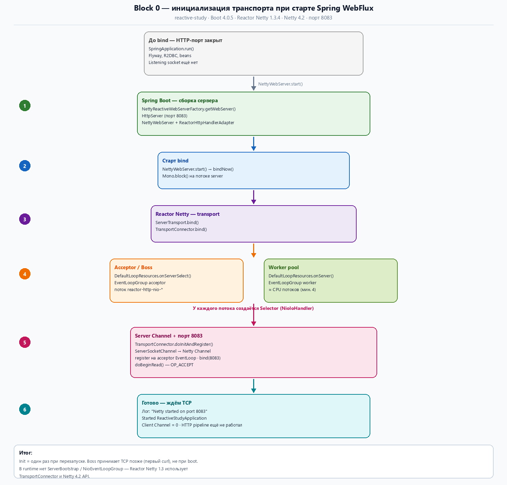
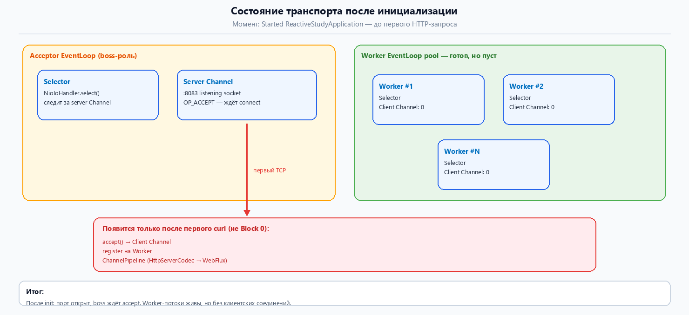

# Блок 0 — что создаётся при инициализации транспорта

**Модуль:** `reactive-study` (Spring Boot 4.0.5, Reactor Netty 1.3.4, Netty 4.2.12)  
**Цель:** 
 - понять **какие объекты уже существуют**, 
 - когда в логе появляется `Netty started on port 8083` — 
 - и **в каждом разделе** сразу видеть **класс + метод**, 
 - куда поставить breakpoint для перепроверки (не искать по всему документу).

> Проверено: `javap` по JAR (SB 4.0.5 / RN 1.3.4), **InitPathAgent** (bytecode agent), jstack после старта.  
> Инструкция agent: [`Java agent для логирования входов в методы.md`](Java%20agent%20для%20логирования%20входов%20в%20методы.md) → `docs/block0-verify/run-with-agent.cmd`.  
> Сверка с учебными материалами: `BLOCK-0-ARCHITECTURE-CROSSCHECK.md`.  
> Сводная таблица всех точек Block 0 — [§3.4](#34-все-точки-проверки-block-0).

---

## Оглавление

- [1. Главная идея](#1-главная-идея)
- [2. Когда вообще начинается init транспорта](#2-когда-вообще-начинается-init-транспорта)
  - [2.1 HttpServer и bindNow — где искать (не гадать)](#21-httpserver-и-bindnow--где-искать-не-гадать)
- [3. Хронология: что создаётся и когда](#3-хронология-что-создаётся-и-когда)
  - [3.1 Схема инициализации — функциональные блоки](#31-схема-инициализации--функциональные-блоки)
  - [3.2 Состояние после init — что уже есть и чего нет](#32-состояние-после-init--что-уже-есть-и-чего-нет)
  - [3.4 Все точки проверки Block 0](#34-все-точки-проверки-block-0)
- [4. Boss и Worker — что это у вас на самом деле](#4-boss-и-worker--что-это-у-вас-на-самом-деле)
- [5. Server socket и Channel — в какой момент](#5-server-socket-и-channel--в-какой-момент)
- [6. EventLoop и Selector — в какой момент](#6-eventloop-и-selector--в-какой-момент)
- [7. Что готово после «Started ReactiveStudyApplication»](#7-что-готово-после-started-reactivestudyapplication)
- [8. Чего ещё нет до первого curl](#8-чего-ещё-нет-до-первого-curl)
- [9. Расхождение с «классическим Netty» из интернета](#9-расхождение-с-классическим-netty-из-интернета)
- [Приложение A — breakpoint](#приложение-a--breakpoint)
- [Приложение B — как проверялось](#приложение-b--как-проверялось)

---

## 1. Главная идея

**Netty разделяет роли** :
  - _одна_ **группа потоков** принимает новые TCP-соединения на listening socket (условный **boss / acceptor**), 
  - другая обслуживает уже принятые соединения клиентов (**worker**).

**Важно для init:** 
  - при старте **Spring WebFlux** создаётся **не весь HTTP-путь**, а **только серверный транспорт**:
     - пул event loop (**boss** + **worker**),
     - **один** server `io.netty.channel.Channel` (обёртка над **listening socket** на порту 8083 (порт приложения из примера)),
     - этот socket переведён в режим «жду подключений» (`OP_ACCEPT`).

Пока никто не вызвал `curl`, **клиентских Channel ещё нет**, HTTP pipeline на соединениях не крутится (не запущен).

**Источник (Netty User Guide):** https://netty.io/wiki/user-guide-for-4.x.html

**Цитата:**
> The first one, often called 'boss', accepts an incoming connection. The second one, often called 'worker', handles the traffic of the accepted connection once the boss accepts the connection and registers the accepted connection to the worker.

**Перевод:**
> Первая группа, обычно **"boss"**, принимает входящее соединение.
> 
> Вторая, **"worker"**, обрабатывает трафик уже **принятого соединения** после того, как **boss** зарегистрировал его в **worker**.

---

## 2. Когда вообще начинается init транспорта

Транспорт **не** создаётся в момент `main()` и **не** при загрузке классов Netty.

| Момент | Что происходит | Breakpoint: класс → метод                                                                                                                            |
|--------|----------------|------------------------------------------------------------------------------------------------------------------------------------------------------|
| `org.springframework.boot.SpringApplication.run(...)` | Поднимается контекст Spring, Flyway, R2DBC — **HTTP-сервер ещё не слушает порт** | *(опционально)* `org.springframework.boot.SpringApplication` → `run` — * до refresh контекста                                                        |
| `org.springframework.boot.reactor.netty.NettyWebServer.start()` | Spring вызывает `reactor.netty.transport.ServerTransport.bindNow()` — **здесь начинается init транспорта** | `org.springframework.boot.reactor.netty.NettyWebServer` → `start` или `startHttpServer`                                                              |
| Лог `Netty started on port 8083` | Bind завершён, listening socket готов | `reactor.netty.transport.TransportConnector` → `doInitAndRegister` уже отработал; дальше — `io.netty.channel.nio.AbstractNioChannel` → `doBeginRead` |
| Лог `Started ReactiveStudyApplication` | Весь контекст готов, можно слать HTTP (`com.example.reactivestudy.ReactiveStudyApplication`) | breakpoint init **больше не срабатывают** до перезапуска                                                                                             |


* `refresh` контекста — это **основной этап инициализации** Spring.
  - В этот момент Spring создаёт и связывает бины, 
  - применяет post-processors, 
  - запускает нужные компоненты; 
  - после этого `ApplicationContext` готов к работе. 
  
Поэтому **«до refresh контекста»** означает: *до того, как Spring полностью собрал и инициализировал приложение*.

---

 - org.springframework.boot.reactor.netty.**NettyWebServer**

```java

 public void start() throws WebServerException {
        DisposableServer disposableServer = this.disposableServer;
        if (disposableServer == null) {
            try {
                disposableServer = this.startHttpServer();
                this.disposableServer = disposableServer;
            } catch (Exception var4) {
                
..............
```

 - `disposableServer = this.startHttpServer()`; - вызывает метод `startHttpServer()` из `org.springframework.boot.reactor.netty.NettyWebServer`

```java

 DisposableServer startHttpServer() {
        HttpServer server = this.httpServer;
     .............................
        return this.lifecycleTimeout != null ? server.bindNow(this.lifecycleTimeout) : server.bindNow();
    }
```

 - `HttpServer` наследует `reactor.netty.transport.**ServerTransport**` и там вызывается метод `bindNow()`


- reactor.netty.transport.**ServerTransport**

```java

public final DisposableServer bindNow() {
		return bindNow(Duration.ofSeconds(45));
	}
```

---


### Проверка (breakpoint) — §2

| # | Класс | Метод | Что увидеть при перезапуске |
|---|-------|-------|-----------------------------|
| 2a | `org.springframework.boot.reactor.netty.NettyWebServer` | `start()` | Spring входит в поднятие embedded-сервера |
| 2b | `org.springframework.boot.reactor.netty.NettyWebServer` | `startHttpServer()` *(package-private)* | внутри вызов `ServerTransport.bindNow()` |
| 2c | `reactor.netty.transport.ServerTransport` | `bindNow()` *(public)* | блокирующий bind; runtime-класс `reactor.netty.http.server.HttpServerBind`; поток `server` ждёт в `Mono.block()` |

**Lazy init:** общий пул потоков (`reactor.netty.resources.LoopResources` через `reactor.netty.http.HttpResources`) создаётся **при первом bind**, а не при старте JVM.

**Источник (LoopResources):** https://projectreactor.io/docs/netty/release/api/reactor/netty/resources/LoopResources.html

**Цитата:**
> An EventLoopGroup selector with associated Channel factories.

**Перевод:**
> Селектор EventLoopGroup с фабриками Channel.

---

### 2.1 HttpServer и bindNow — где искать (не гадать)

**Частая путаница:** в Spring видишь `HttpServer`, в log agent — `ServerTransport#bindNow`, в таблице ниже — `HttpServerBind#bind`. Это **одна цепочка**, не три разных bind.

#### Наследование (кто от кого)

```text
reactor.netty.transport.ServerTransport          ← bindNow() объявлен ЗДЕСЬ
    ↑ extends
reactor.netty.http.server.HttpServer             ← абстрактный; bindNow унаследован
    ↑ extends
reactor.netty.http.server.HttpServerBind         ← runtime-объект при bind (конкретный класс)
```

**Источник:** https://projectreactor.io/docs/netty/release/api/reactor/netty/transport/ServerTransport.html

**Цитата:**
> Direct Known Subclasses: **HttpServer**, TcpServer  
> `public final DisposableServer bindNow()` — Starts the server in a blocking fashion…

**Перевод:**
> Прямые наследники: **HttpServer**, TcpServer.  
> `bindNow()` — блокирующий запуск сервера…

#### Цепочка вызовов (полные FQCN)

```text
org.springframework.boot.reactor.netty.NettyWebServer#start()
  └─ org.springframework.boot.reactor.netty.NettyWebServer#startHttpServer()
       └─ server.bindNow()                    ← в коде Spring переменная типа HttpServer
            └─ reactor.netty.transport.ServerTransport#bindNow()   ← метод объявлен здесь
                 └─ bind() → runtime: reactor.netty.http.server.HttpServerBind#bind()
                      └─ reactor.netty.transport.TransportConnector#bind()
                           └─ … → io.netty.channel.nio.AbstractNioChannel#doBeginRead()
```

**Код Spring Boot 4.0.5** (`NettyWebServer.startHttpServer()`):

```java
HttpServer server = this.httpServer;
// … handle, route, runOn …
return server.bindNow();   // JVM идёт в ServerTransport.bindNow()
```

#### Где лежит каждый класс (JAR)

| Что ищешь | Полный путь класса | Метод | JAR |
|-----------|-------------------|-------|-----|
| Spring стартует сервер | `org.springframework.boot.reactor.netty.NettyWebServer` | `start` | `spring-boot-reactor-netty-4.0.5.jar` |
| Spring доходит до bind | `org.springframework.boot.reactor.netty.NettyWebServer` | `startHttpServer` | тот же |
| **bindNow — ставь breakpoint сюда** | **`reactor.netty.transport.ServerTransport`** | **`bindNow`** | **`reactor-netty-core-1.3.4.jar`** |
| Следующий шаг bind | `reactor.netty.http.server.HttpServerBind` | `bind` | `reactor-netty-http-1.3.4.jar` |

#### Куда смотреть в IDE (без догадок)

| Ошибка | Правильно |
|--------|-----------|
| Ищешь `bindNow` в `HttpServer.java` — **не находишь** | Открой **`ServerTransport.java`** в `reactor-netty-core` (Download Sources) |
| Ставишь breakpoint на `reactor.netty.http.server.HttpServer#bindNow` | Ставь на **`reactor.netty.transport.ServerTransport#bindNow`** |
| Путаешь `HttpServer` и `HttpServerBind` | **`HttpServer`** — тип в Spring; **`HttpServerBind`** — **конкретный** runtime-класс при bind |
| В agent-log `ServerTransport#bindNow`, а в Spring `HttpServer` | Agent пишет **класс, где метод объявлен**; Spring вызывает через переменную `HttpServer` |

**Минимум для проверки:** три breakpoint по порядку — `NettyWebServer#start` → `NettyWebServer#startHttpServer` → **`ServerTransport#bindNow`**.

Подробная таблица всех шагов — [§3.4](#34-все-точки-проверки-block-0).

---

## 3. Хронология: что создаётся и когда

### 3.1 Схема инициализации — функциональные блоки

Ниже — **цветная схема** проверенной chronology: шаги 0–6, что создаётся на каждом этапе.

**Как читать:** сверху вниз — время. Каждый цветной блок = этап init. После последнего блока порт 8083 открыт, но HTTP-запросов ещё не было.



*Пересобрать PNG:* из каталога `reactive-study` выполнить `python docs/gen_block0_init_diagram.py`.

| Цвет блока | Этап | Что **создаётся** | Breakpoint: класс → метод |
|------------|------|-------------------|---------------------------|
| ⏳ серый | До bind | Только Spring-контекст, **нет** listening socket | — |
| 🟢 зелёный | Шаг 1 | `reactor.netty.http.server.HttpServer`, `org.springframework.boot.reactor.netty.NettyWebServer` | `org.springframework.boot.reactor.netty.NettyReactiveWebServerFactory` → `getWebServer` |
| 🔵 синий | Шаг 2 | Запуск bind | `org.springframework.boot.reactor.netty.NettyWebServer` → `start` / `startHttpServer`; `reactor.netty.transport.ServerTransport` → `bindNow` |
| 🟣 фиолетовый | Шаг 3 | Reactor Netty transport | `reactor.netty.http.server.HttpServerBind` → `bind`; `reactor.netty.transport.TransportConnector` → `bind` *(static)* |
| 🟠 оранжевый | Шаг 4 | Boss + Worker EventLoopGroup | `ServerTransportConfig` → `childEventLoopGroup` / `eventLoopGroup`; `DefaultLoopResources` → `onServer` / `onServerSelect` |
| 🔴 розовый | Шаг 5 | Server Channel, порт 8083, OP_ACCEPT | `reactor.netty.transport.TransportConnector` → `doInitAndRegister`; `io.netty.channel.nio.AbstractNioChannel` → `doBeginRead` |
| ✅ бирюзовый | Готово | Транспорт слушает; client Channel **ещё нет** | после `doBeginRead` — цепочка init завершена |

---

### 3.2 Состояние после init — что уже есть и чего нет

Схема **момента «Started ReactiveStudyApplication»** (`com.example.reactivestudy.ReactiveStudyApplication`): объекты на месте, красный блок — что появится только после первого curl.



---

### 3.3 Лента времени (текст)

```text
[1] org.springframework.boot.reactor.netty.NettyReactiveWebServerFactory.getWebServer()
         → reactor.netty.http.server.HttpServer
         → org.springframework.boot.reactor.netty.NettyWebServer
         → org.springframework.http.server.reactive.ReactorHttpHandlerAdapter
         BP: org.springframework.boot.reactor.netty.NettyReactiveWebServerFactory → getWebServer

[2] org.springframework.boot.reactor.netty.NettyWebServer.start()
         → startHttpServer() → reactor.netty.transport.ServerTransport.bindNow()
         BP: org.springframework.boot.reactor.netty.NettyWebServer → start / startHttpServer
         BP: reactor.netty.transport.ServerTransport → bindNow
         (runtime: reactor.netty.http.server.HttpServerBind)

[3] reactor.netty.http.server.HttpServerBind.bind()
         → reactor.netty.transport.ServerTransport.bind()
         → reactor.netty.transport.TransportConnector.bind()  // static
         BP: reactor.netty.http.server.HttpServerBind → bind
         BP: reactor.netty.transport.TransportConnector → bind

[4] reactor.netty.transport.ServerTransportConfig.eventLoopGroup()
         → reactor.netty.resources.DefaultLoopResources.onServerSelect()  // acceptor
         BP: reactor.netty.transport.ServerTransportConfig → eventLoopGroup
         BP: reactor.netty.resources.DefaultLoopResources → onServerSelect

[4b] reactor.netty.transport.ServerTransportConfig.childEventLoopGroup()
         → reactor.netty.resources.DefaultLoopResources.onServer()  // worker
         BP: ServerTransportConfig → childEventLoopGroup
         BP: DefaultLoopResources → onServer
         (agent: вызывается **до** TransportConnector.bind)

[5] reactor.netty.transport.TransportConnector.doInitAndRegister()  // static, package-private
         → io.netty.channel.socket.nio.NioServerSocketChannel → io.netty.channel.Channel
         → bind(8083) → io.netty.channel.nio.AbstractNioChannel.doBeginRead() (OP_ACCEPT)
         BP: reactor.netty.transport.TransportConnector → doInitAndRegister
         BP: io.netty.channel.nio.AbstractNioChannel → doBeginRead

[6] Лог: "Netty started on port 8083"
```

### Таблица «объект → момент создания → breakpoint»

| Объект | Когда появляется | Уже работает после init? | Breakpoint: класс → метод |
|--------|------------------|---------------------------|---------------------------|
| `reactor.netty.http.server.HttpServer` / `org.springframework.boot.reactor.netty.NettyWebServer` | шаг [1]–[2] | да | `org.springframework.boot.reactor.netty.NettyReactiveWebServerFactory` → `getWebServer`; `org.springframework.boot.reactor.netty.NettyWebServer` → `start` |
| `reactor.netty.resources.LoopResources` (`reactor.netty.http.HttpResources`) | шаг [4], первый bind | да (singleton) | `reactor.netty.http.HttpResources` → `get` *(опционально)* |
| **Boss / acceptor** `io.netty.channel.EventLoopGroup` | шаг [4] | да | `reactor.netty.transport.ServerTransportConfig` → `eventLoopGroup`; `reactor.netty.resources.DefaultLoopResources` → `onServerSelect` |
| **Worker** `io.netty.channel.EventLoopGroup` | шаг [4b], bind | да | `reactor.netty.transport.ServerTransportConfig` → `childEventLoopGroup`; `reactor.netty.resources.DefaultLoopResources` → `onServer` |
| **Selector** у каждого EventLoop | при старте потока | да | `io.netty.channel.nio.NioIoHandler` → `run` *(jstack после старта)* |
| **Server Channel** (`io.netty.channel.Channel`) | шаг [5] | да, `:8083` | `reactor.netty.transport.TransportConnector` → `doInitAndRegister` |
| **Client Channel** | **не при init** | нет до curl | `reactor.netty.transport.ServerTransport.Acceptor` → `channelRead` *(только curl)* |
| HTTP pipeline (`io.netty.handler.codec.http.HttpServerCodec` …) | после accept | нет до curl | `reactor.netty.http.server.HttpTrafficHandler` → `channelRead` *(блок 1+)* |

**Источник (onServerSelect / onServer):** https://projectreactor.io/docs/netty/release/api/reactor/netty/resources/LoopResources.html

**Цитата:**
> `onServerSelect(boolean useNative)` — Callback for server select EventLoopGroup creation, this is the EventLoopGroup for the **acceptor channel**.
>
> `onServer(boolean useNative)` — Callback for server EventLoopGroup creation, this is the EventLoopGroup for the **child channel**.

**Перевод:**
> `onServerSelect` — callback создания EventLoopGroup для **acceptor channel** (серверный listening socket).
>
> `onServer` — callback создания EventLoopGroup для **child channel** (соединения клиентов).

---

### 3.4 Все точки проверки Block 0

Сводная таблица **в порядке вызова** (подтверждено **InitPathAgent**, 03.08.2026). Ставьте breakpoint **до** строки `Started ReactiveStudyApplication`.

| # | Шаг | Класс (полный путь) | Метод | Видимость | Agent |
|---|-----|---------------------|-------|-----------|-------|
| 1 | Spring — сборка | `org.springframework.boot.reactor.netty.NettyReactiveWebServerFactory` | `getWebServer` | public | ✅ |
| 2 | Spring — старт | `org.springframework.boot.reactor.netty.NettyWebServer` | `start` | public | ✅ |
| 3 | Spring — bind | `org.springframework.boot.reactor.netty.NettyWebServer` | `startHttpServer` | package-private | ✅ |
| 4 | RN — bindNow | `reactor.netty.transport.ServerTransport` | `bindNow` | public | ✅ |
| 5 | RN — HttpServer | `reactor.netty.http.server.HttpServerBind` | `bind` | public | ✅ |
| 6 | RN — transport | `reactor.netty.transport.ServerTransport` | `bind` | public | ✅ |
| 7 | RN — worker config | `reactor.netty.transport.ServerTransportConfig` | `childEventLoopGroup` | final | ✅ |
| 8 | RN — worker pool | `reactor.netty.resources.DefaultLoopResources` | `onServer` | public *(класс package-private)* | ✅ |
| 9 | RN — connector | `reactor.netty.transport.TransportConnector` | `bind` | **public static** | ✅ |
| 10 | RN — boss config | `reactor.netty.transport.ServerTransportConfig` | `eventLoopGroup` | protected final | ✅ |
| 11 | RN — boss pool | `reactor.netty.resources.DefaultLoopResources` | `onServerSelect` | public | ✅ |
| 12 | RN — channel | `reactor.netty.transport.TransportConnector` | `doInitAndRegister` | **static**, package-private | ✅ |
| 13 | Netty — accept | `io.netty.channel.nio.AbstractNioChannel` | `doBeginRead` | protected | ✅ |
| 14 | Netty — selector | `io.netty.channel.nio.AbstractNioChannel` | `addAndSubmit` | private | ✅ |
| — | **не Block 0** | `reactor.netty.transport.ServerTransport$Acceptor` | `channelRead` | public | только **curl** |

**Negative test (не срабатывают при boot):**

| Класс | Метод | Почему |
|-------|-------|--------|
| `reactor.netty.http.server.HttpServer` | `bindNow` | **не ищи здесь** — метод **унаследован** от `reactor.netty.transport.ServerTransport`; breakpoint — на `ServerTransport#bindNow` ([§2.1](#21-httpserver-и-bindnow--где-искать-не-гадать)) |
| `io.netty.bootstrap.ServerBootstrap` | `doBind` | метода нет; RN не использует ServerBootstrap |
| `io.netty.bootstrap.AbstractBootstrap` | `doBind` | private; RN не вызывает |

**Запуск breakpoint (CMD / IntelliJ):**

```bat

cd D:\Project_infra\greeting-service-infra\reactive-study
gradlew.bat bootRun --args="--spring.profiles.active=local"
```

**Запуск InitPathAgent (автоматический лог `>>> ENTER class#method`):**

```bat

cd D:\Project_infra\greeting-service-infra\reactive-study\docs\block0-verify
run-with-agent.cmd
```

Перед запуском освободите порт **8083** (остановите предыдущий `reactive-study`). Лог: `docs/block0-verify/agent/block0-init-trace.log`.

Remote debug: `gradlew.bat bootRun --debug-jvm --args="--spring.profiles.active=local"` → порт `:5005`.

---

## 4. Boss и Worker — что это у вас на самом деле

### Концепция (как в учебниках)

| Роль | Задача | Какой socket / Channel |
|------|--------|-------------------------|
| **Boss (acceptor)** | `accept()` новых TCP | один **listening** socket → server `io.netty.channel.Channel` |
| **Worker** | `read()` / `write()` данных клиента | отдельный **connected** socket → child `io.netty.channel.Channel` на каждого клиента |

### Реализация в вашем стеке (RN 1.3.4 + Netty 4.2)

| Учебник Netty 4.1 | У вас в runtime |
|-------------------|-----------------|
| `io.netty.channel.nio.NioEventLoopGroup` (boss + worker) | `io.netty.channel.MultiThreadIoEventLoopGroup` + `io.netty.channel.nio.NioIoHandler` |
| `io.netty.bootstrap.ServerBootstrap.group(boss, worker)` | `reactor.netty.transport.TransportConnector` + `reactor.netty.transport.ServerTransport.Acceptor` |
| поток `io.netty.channel.nio.NioEventLoop.run()` | поток `io.netty.channel.nio.NioIoHandler.run()` на `io.netty.channel.SingleThreadIoEventLoop` |

**Модель boss/worker — верная.** Меняются **имена классов** и **код, который их создаёт** (не `io.netty.bootstrap.ServerBootstrap`, а Reactor Netty `reactor.netty.transport.TransportConnector`).

### Проверка (breakpoint) — §4

| Роль | Класс (полный путь) | Метод | Когда сработает |
|------|---------------------|-------|-----------------|
| Boss / acceptor | `reactor.netty.transport.ServerTransportConfig` | `eventLoopGroup` | при bind — запрос acceptor-группы |
| Boss / acceptor | `reactor.netty.resources.DefaultLoopResources` | `onServerSelect` | при bind — создаётся acceptor EventLoopGroup |
| Worker | `reactor.netty.transport.ServerTransportConfig` | `childEventLoopGroup` | при bind — worker EventLoopGroup |
| Worker | `reactor.netty.resources.DefaultLoopResources` | `onServer` | при bind — agent ✅ |
| Event loop (Netty 4.2) | `io.netty.channel.nio.NioIoHandler` | `run` | после старта — в jstack поток `reactor-http-nio-*` |
| Accept child *(не init)* | `reactor.netty.transport.ServerTransport.Acceptor` | `channelRead` | **только первый curl** — передача на worker |

После init в jstack видно, например:

- поток **`reactor-http-nio-1`** — acceptor event loop в `io.netty.channel.nio.NioIoHandler.select()` (ждёт `OP_ACCEPT`);
- поток **`server`** — Spring временно блокируется на `reactor.core.publisher.Mono.block()` до завершения bind (это не boss и не worker).

*(В jstack сразу после старта виден acceptor `reactor-http-nio-1`; worker-потоки могут не отображаться отдельно, пока нет client Channel.)*

---

## 5. Server socket и Channel — в какой момент

**Последовательность:**

1. **До bind** — объекта `io.netty.channel.Channel` для порта 8083 **нет**.
2. **`reactor.netty.transport.TransportConnector.doInitAndRegister`** — Netty создаёт `io.netty.channel.socket.nio.NioServerSocketChannel` (JDK NIO socket).
3. **Тот же шаг** — socket оборачивается в Netty **`io.netty.channel.Channel`** (server / parent channel).
4. **Register** — Channel привязывается к одному потоку **acceptor EventLoopGroup** (`reactor.netty.resources.DefaultLoopResources.onServerSelect()`).
5. **`channel.bind(8083)`** — ОС открывает порт; в логе Spring: `Netty started on port 8083`.
6. **`io.netty.channel.nio.AbstractNioChannel.doBeginRead()` / `addAndSubmit(OP_ACCEPT)`** — event loop начинает ждать **новые** TCP-подключения.

### Проверка (breakpoint) — §5

| # | Класс (полный путь) | Метод | Что увидеть |
|---|---------------------|-------|-------------|
| 1 | `reactor.netty.transport.TransportConnector` | `doInitAndRegister` | создание `io.netty.channel.socket.nio.NioServerSocketChannel`, register на acceptor |
| 2 | `io.netty.channel.AbstractChannel` | `bind` | привязка к `:8083` *(можно на server Channel)* |
| 3 | `io.netty.channel.nio.AbstractNioChannel` | `doBeginRead` | включение `OP_ACCEPT` — «жду connect» |

**Аналогия:** сначала строят кассу (server Channel + порт), потом включают табло «принимаем клиентов». Сами клиенты в очередь встанут только после первого `curl`.

**Источник (Channel):** https://netty.io/4.1/api/io/netty/channel/Channel.html

**Цитата:**
> A nexus to a network socket or a component which is capable of I/O operations such as read, write, connect, and bind.

**Перевод:**
> Связующее звено с сетевым сокетом или компонентом, способным выполнять операции I/O: read, write, connect, bind.

---

## 6. EventLoop и Selector — в какой момент

### EventLoopGroup (boss + worker)

Создаются **во время bind**:

- `ServerTransportConfig.childEventLoopGroup()` → `DefaultLoopResources.onServer()` — worker *(agent: до `TransportConnector.bind`)*
- `ServerTransportConfig.eventLoopGroup()` → `DefaultLoopResources.onServerSelect()` — acceptor

Число worker-потоков по умолчанию — **число CPU, но не меньше 4**.

**Источник:** https://projectreactor.io/docs/netty/release/api/reactor/netty/resources/LoopResources.html

**Цитата:**
> Default worker thread count, fallback to available processor (but with a minimum value of 4).

**Перевод:**
> Число worker-потоков по умолчанию: доступные процессоры, но не меньше 4.

### Selector

**Selector не создаётся отдельно «до» EventLoop.**  
У каждого потока EventLoop при старте поднимается свой Selector (в Netty 4.2 — внутри `io.netty.channel.nio.NioIoHandler`).

| Момент | Selector |
|--------|----------|
| После init, до curl | На acceptor-потоке Selector следит **только за server Channel** (готовность к `accept`) |
| Worker Selectors | Уже **существуют** (потоки запущены), но **без клиентских Channel** в наборе ключей |
| После первого curl | Boss принимает socket → создаётся child Channel → регистрируется на **worker** Selector |

**Источник (Netty EventLoop):** https://netty.io/4.1/api/io/netty/channel/nio/NioEventLoop.html

**Цитата:**
> SingleThreadEventLoop implementation which register the Channel's to a Selector and so does the multi-plexing of these in the event loop.

**Перевод:**
> Однопоточная реализация EventLoop, регистрирующая Channel в Selector и мультиплексирующая их в event loop.

*(В Netty 4.2 та же роль у `io.netty.channel.SingleThreadIoEventLoop` + `io.netty.channel.nio.NioIoHandler` — проверено jstack.)*

### Проверка (breakpoint) — §6

| Что проверяем | Класс (полный путь) | Метод | Примечание |
|---------------|---------------------|-------|------------|
| Boss-группа | `reactor.netty.resources.DefaultLoopResources` | `onServerSelect` | срабатывает **один раз** при bind |
| Worker-группа | `reactor.netty.resources.DefaultLoopResources` | `onServer` | срабатывает при bind |
| Selector в работе | `io.netty.channel.nio.NioIoHandler` | `select` или `run(int)` | после старта — pause в jstack |
| Singleton пула | `reactor.netty.http.HttpResources` | `get` | *(опционально)* откуда берётся `LoopResources` |

---

## 7. Что готово после «Started ReactiveStudyApplication»

Когда `com.example.reactivestudy.ReactiveStudyApplication` полностью поднялось, **транспортный слой в состоянии «жду клиентов»**:

```text
┌─────────────────────────────────────────────────────────┐
│  Spring WebFlux / org.springframework.boot.reactor.netty.NettyWebServer │
│    reactor.netty.http.server.HttpServer настроен, handler подключён   │
└──────────────────────────┬──────────────────────────────┘
                           │
┌──────────────────────────▼──────────────────────────────┐
│  reactor.netty.resources.LoopResources                  │
│    (синглтон reactor.netty.http.HttpResources)          │
│    • acceptor io.netty.channel.EventLoopGroup (boss)    │
│    • worker io.netty.channel.EventLoopGroup             │
└──────────────────────────┬──────────────────────────────┘
                           │
        ┌──────────────────┴──────────────────┐
        │  Acceptor EventLoop (1+ поток)       │
        │    Selector → server Channel :8083   │
        │    режим OP_ACCEPT                   │
        └──────────────────────────────────────┘

        ┌──────────────────────────────────────┐
        │  Worker EventLoop pool (N потоков)     │
        │    Selectors готовы, client Channel'ов │
        │    пока нет                              │
        └──────────────────────────────────────┘
```

**Checklist «что уже есть»:**

- [x] Порт **8083** слушает ОС (listening socket)
- [x] Netty **server Channel** (`io.netty.channel.Channel`) зарегистрирован на acceptor EventLoop
- [x] **Boss-** и **worker-** EventLoopGroup созданы (agent: `onServerSelect` + `onServer`)
- [x] У каждого потока есть **Selector** (event loop крутится)
- [ ] **Нет** ни одного client Channel (`io.netty.channel.Channel`)
- [ ] **Нет** HTTP-запроса, pipeline codec на соединении не работал

### Проверка (breakpoint) — §7

После лога `Started ReactiveStudyApplication` **точки §3.4 (#1–#10) больше не вызываются** до перезапуска. Для перепроверки состояния «всё готово, но curl ещё не было»:

| Что проверить | Как |
|---------------|-----|
| Порт 8083 слушает | `netstat -ano \| findstr :8083` или лог `Netty started on port 8083` |
| Event loop крутится | jstack: поток `reactor-http-nio-1` в `io.netty.channel.nio.NioIoHandler.run` |
| Init-цепочка прошла | при **следующем** перезапуске с breakpoint — снова #1→#10 из [§3.4](#34-все-точки-проверки-block-0) |

---

## 8. Чего ещё нет до первого curl

Это **не** часть Block 0, но снимает типичную путаницу:

| Событие | Когда | Breakpoint: класс → метод |
|---------|--------|---------------------------|
| `accept()` → новый `io.netty.channel.Channel` (client) | **Первый TCP** (curl / браузер) | `reactor.netty.transport.ServerTransport.Acceptor` → `channelRead` |
| Регистрация child Channel на worker | там же | внутри `channelRead` / register на worker EventLoop |
| `io.netty.handler.codec.http.HttpServerCodec`, `reactor.netty.http.server.HttpTrafficHandler`, WebFlux | на **child** Channel, после accept | `reactor.netty.http.server.HttpTrafficHandler` → `channelRead` |
| Чтение HTTP-байтов, `org.springframework.web.reactive.DispatcherHandler` | блок 1+ (путь запроса) | `org.springframework.web.reactive.DispatcherHandler` → `handle` |

### Проверка (breakpoint) — §8

| # | Класс (полный путь) | Метод | Когда |
|---|---------------------|-------|-------|
| 1 | `reactor.netty.transport.ServerTransport.Acceptor` | `channelRead` | первый TCP — **не** при boot |
| 2 | `reactor.netty.http.server.HttpTrafficHandler` | `channelRead` | первый HTTP-запрос (блок 1+) |
| 3 | `org.springframework.web.reactive.DispatcherHandler` | `handle` | маршрутизация WebFlux (блок 1+) |

**Итог:** init = «открыли дверь и сели ждать». Первый запрос = «клиент постучался, boss передал соединение worker».

---

## 9. Расхождение с «классическим Netty» из интернета

Много статей показывают:

```java
ServerBootstrap b = new io.netty.bootstrap.ServerBootstrap();
b.group(bossGroup, workerGroup)...
```

**В Reactor Netty 1.3.4 этот путь при bind не используется** — вместо него `reactor.netty.transport.TransportConnector`. Поэтому breakpoint на `io.netty.bootstrap.AbstractBootstrap.doBind()` **не срабатывает**, хотя **идея boss/worker остаётся**.

| Из интернета | В вашем приложении | Breakpoint для проверки |
|--------------|-------------------|-------------------------|
| Boss + Worker | ✅ да | `onServerSelect` + `onServer` — **agent ✅** |
| Server socket → Channel | ✅ да | `reactor.netty.transport.TransportConnector` → `doInitAndRegister` — **срабатывает** |
| Selector на EventLoop | ✅ да | jstack: `io.netty.channel.nio.NioIoHandler` → `run` |
| `io.netty.bootstrap.ServerBootstrap` | ❌ не в цепочке init | `io.netty.bootstrap.ServerBootstrap` → `doBind` — **не срабатывает** |
| `io.netty.channel.nio.NioEventLoopGroup` | ❌ заменён Netty 4.2 | конструктор `NioEventLoopGroup` — **не срабатывает** |
| `io.netty.bootstrap.AbstractBootstrap` | ❌ не в цепочке | `doBind` — **не срабатывает** |

### Проверка (breakpoint) — §9

| Ожидание | Класс (полный путь) | Метод | Результат при boot |
|----------|---------------------|-------|---------------------|
| Старый путь Netty | `io.netty.bootstrap.ServerBootstrap` | `doBind` | ❌ breakpoint не попадает |
| Старый путь Netty | `io.netty.bootstrap.AbstractBootstrap` | `doBind` | ❌ breakpoint не попадает |
| Старый boss/worker | `io.netty.channel.nio.NioEventLoopGroup` | `<init>` | ❌ breakpoint не попадает |
| Ваш реальный путь | `reactor.netty.transport.TransportConnector` | `bind` *(static)* | ✅ agent |

Ваши учебные docx и док. 7 **на уровне идей совпадают** с проверкой; расхождение — в **именах классов** и в том, что **док. 13** описывает уже **рабочий HTTP-запрос**, а не момент init.

---

## Приложение A — breakpoint (краткая выжимка)

Полная таблица с порядком вызова и agent-логом — [§3.4](#34-все-точки-проверки-block-0).

| # | Класс (полный путь) | Метод | Block 0? |
|---|---------------------|-------|----------|
| 1 | `org.springframework.boot.reactor.netty.NettyReactiveWebServerFactory` | `getWebServer` | да |
| 2 | `org.springframework.boot.reactor.netty.NettyWebServer` | `start` / `startHttpServer` | да |
| 3 | `reactor.netty.transport.ServerTransport` | `bindNow` | да |
| 4 | `reactor.netty.http.server.HttpServerBind` | `bind` | да |
| 5 | `reactor.netty.transport.ServerTransport` | `bind` | да |
| 6 | `reactor.netty.transport.ServerTransportConfig` | `childEventLoopGroup` | да |
| 7 | `reactor.netty.resources.DefaultLoopResources` | `onServer` | да |
| 8 | `reactor.netty.transport.TransportConnector` | `bind` *(static)* | да |
| 9 | `reactor.netty.transport.ServerTransportConfig` | `eventLoopGroup` | да |
| 10 | `reactor.netty.resources.DefaultLoopResources` | `onServerSelect` | да |
| 11 | `reactor.netty.transport.TransportConnector` | `doInitAndRegister` | да |
| 12 | `io.netty.channel.nio.AbstractNioChannel` | `doBeginRead` | да |
| 13 | `reactor.netty.transport.ServerTransport$Acceptor` | `channelRead` | **нет** — только curl |

Запуск — см. [§3.4](#34-все-точки-проверки-block-0).

---

## Приложение B — как проверялось

| Факт | Подтверждение |
|------|----------------|
| Сигнатуры методов | `docs/block0-verify/javap-verified.txt` (`javap_verify.py`) |
| Порядок вызовов при init | `docs/block0-verify/agent/block0-init-trace.log` (InitPathAgent) |
| Bind на 8083 | лог `Netty started on port 8083` |
| Spring ждёт bind | jstack: `NettyWebServer$1.run` → `Mono.block` |
| Acceptor event loop | jstack PID 17212: `reactor-http-nio-1` → `NioIoHandler.run` → `select` |
| Нет `ServerBootstrap` | javap: `ServerBootstrap#doBind` NOT FOUND; agent не логирует |
| Цепочка bind | agent: `getWebServer` → `start` → `bindNow` → `HttpServerBind.bind` → `childEventLoopGroup`/`onServer` → `TransportConnector.bind` → `onServerSelect` → `doInitAndRegister` → `doBeginRead` |

**InitPathAgent:** `docs/block0-verify/agent/InitPathAgent.java` — ASM bytecode agent, логирует `>>> ENTER class#method` + stack trace. Сборка: `build_agent.py` или `build-agent.cmd`. Запуск: `run-with-agent.cmd`.

**Версии:** Spring Boot 4.0.5, RN 1.3.4, Netty 4.2.12, Java 21.0.11.

**Дата проверки:** 03.08.2026.

---

## Одним абзацем

При инициализации Spring **один раз** вызывает `reactor.netty.transport.ServerTransport.bindNow()` (runtime: `HttpServerBind`): Reactor Netty создаёт **acceptor и worker EventLoopGroup**, **server Channel** на порту 8083 и включает **`OP_ACCEPT`** (`doBeginRead`). Клиентских Channel до первого `curl` нет.
