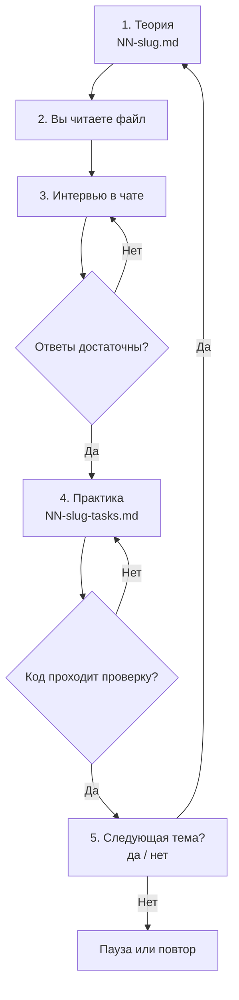

# План курса: базовая многопоточность Java

Документ — **единая точка отсчёта**. На него можно ссылаться в чате: *«работаем по плану»*, *«где мы в плане?»*, *«следующая тема по плану»*.

Одна тема за раз: сначала теория, потом интервью, потом практика.

---

## Оглавление

- [Граница курса](#граница-курса)
- [Цель](#цель)
- [Среда](#среда)
- [Структура папки](#структура-папки)
- [Как подаётся теория](#как-подаётся-теория)
- [Цитаты из официальных источников](#цитаты-из-официальных-источников)
- [Цикл одной темы](#цикл-одной-темы)
- [Как формулируются задания](#как-формулируются-задания)
- [Проверка ответов](#проверка-ответов)
- [Программа тем](#программа-тем)
    - [Тема 01. Поток и общая память](#тема-01-поток-и-общая-память)
    - [Тема 02. Гонка и synchronized](#тема-02-гонка-и-synchronized)
    - [Тема 03. Видимость и volatile](#тема-03-видимость-и-volatile)
    - [Тема 04. wait, notify, notifyAll](#тема-04-wait-notify-notifyall)
    - [Тема 05. Deadlock, livelock, starvation](#тема-05-deadlock-livelock-starvation)
    - [Тема 06. ReentrantLock и Condition](#тема-06-reentrantlock-и-condition)
    - [Тема 07. ReadWriteLock и StampedLock](#тема-07-readwritelock-и-stampedlock)
    - [Тема 08. Атомарные классы и CAS](#тема-08-атомарные-классы-и-cas)
    - [Тема 09. Concurrent-коллекции](#тема-09-concurrent-коллекции)
    - [Тема 10. BlockingQueue: производитель и потребитель](#тема-10-blockingqueue-производитель-и-потребитель)
    - [Тема 11. Пул потоков: ExecutorService, Callable, Future](#тема-11-пул-потоков-executorservice-callable-future)
    - [Тема 12. Синхронизаторы: CountDownLatch, CyclicBarrier, Semaphore, Phaser](#тема-12-синхронизаторы-countdownlatch-cyclicbarrier-semaphore-phaser)
    - [Тема 13. CompletableFuture](#тема-13-completablefuture)
- [Текущий прогресс](#текущий-прогресс)
- [Как напоминать в чате](#как-напоминать-в-чате)

---

## Граница курса

Тринадцать тем. В каждой — то, что спрашивают на собеседовании по базовой многопоточности и что применяют в обычном коде сервиса.

**Не входит:**

- виртуальные потоки, structured concurrency, scoped values;
- модель памяти как формальная теория: главы JLS, действия и порядки в терминах спецификации. Из видимости берём только рабочее правило happens-before;
- внутренности JVM и процессора: biased locking, lock elision, false sharing, барьеры памяти;
- Fork/Join как отдельная тема. Он появляется одним абзацем в теме 13, потому что `CompletableFuture` без своего пула исполняется в `ForkJoinPool.commonPool`;
- приоритеты потоков, `yield`, группы потоков.

---

## Цель

После курса уметь:

- объяснить гонку, видимость и взаимное исключение своими словами;
- закрыть общее изменяемое состояние замком, атомарным классом или готовой коллекцией — и сказать, почему выбрано именно это;
- не написать deadlock из двух замков и найти его в чужом коде;
- отдать работу в ограниченный пул, получить результат, не потерять исключение, остановить пул;
- согласовать несколько потоков штатным синхронизатором вместо самодельного `wait`/`notify`.

Каждая теория — короткий файл: что спрашивают, какое правило применять, чем это ломается. История API и разбор исходников JDK не входят.

---

## Среда

| Параметр | Значение |
|---|---|
| Язык | Java, платформенные потоки |
| JDK | 17 или новее |
| Зависимости | нет: ни Spring, ни сторонних библиотек |
| Где писать | код в чат. Ассистент сохраняет файл, компилирует и запускает сам |

Проверка одного файла:

```bash

javac Work.java && java Work
```

`Thread.ofVirtual` и `Executors.newVirtualThreadPerTaskExecutor` в примерах и решениях не используются, даже если JDK их умеет.

---

## Структура папки

```text
reactive-study/docs/java-concurrency-course/
├── 00-plan.md                      ← этот документ
├── 01-thread-basics.md             ← теория
├── 01-thread-basics-tasks.md       ← практика после интервью
├── 02-synchronized.md
├── 02-synchronized-tasks.md
└── …
```

| Файл | Содержание |
|---|---|
| `NN-<slug>.md` | Теория. Выдаётся первой |
| `NN-<slug>-tasks.md` | Задания. Выдаются после зачёта интервью |

`NN` — двузначный номер темы. Файлы создаются по одному, когда до темы дошли.

---

## Как подаётся теория

Файл темы читает человек, который в многопоточности не разбирается. Поэтому порядок объяснения всегда один: сначала житейская картинка, потом код, и только потом — что на самом деле делает JVM.

В начале файла — интерактивное оглавление, дальше блоки по шагам ниже. Так же строится каждый смысловой блок внутри темы: от простого к сложному.

| Шаг в файле | Что в нём | Объём |
|---|---|---|
| 1. Аналогия | ситуация из обычной жизни: касса, склад, ключ от комнаты. Без терминов Java | 2–4 предложения |
| 2. Тот же смысл кодом | минимальный пример, который можно запустить | до 15 строк |
| 3. Как это работает технически | что гарантирует язык, что делает монитор, поток, пул | 1–2 абзаца |
| 4. Почему не иначе | короткий контрпример: как сломается, если сделать наивно | до 10 строк кода и 2 предложения |
| 5. Цитата из официального источника | основание для шага 3 | цитата и перевод |
| 6. Правило | вывод одной строкой, который остаётся в голове | 1 строка |

### Ограничения по объёму

- Абзац — не больше трёх предложений.
- Пример — одна мысль на один пример. Несколько идей в одном классе не смешиваются.
- Файл темы — короткий: читается за один раз. Если материал не влезает, тема делится на две, а не растягивается.
- Одна и та же мысль не повторяется в разных формулировках «для закрепления».

### Требования к примерам Java

- Только стандартная библиотека: ни Spring, ни логгеров, ни сторонних зависимостей.
- Вывод через `System.out.println`, чтобы результат был виден сразу.
- Класс компилируется и запускается как есть. Псевдокод не используется.
- Обработка исключений — только там, где она часть темы.

### Что в теорию не пишем

- Пересказ спецификации и перечисление всех методов класса.
- История версий Java и эволюция API.
- Рассуждения «на будущее» про темы, до которых не дошли.
- Развёрнутый текст там, где хватает таблицы или одной строки правила.

---

## Цитаты из официальных источников

Каждое техническое утверждение опирается на **официальный** источник: документация Oracle (`java.lang.Thread`, `java.util.concurrent`), Java Tutorials, спецификация языка. Подборки вопросов с учебных сайтов служат только для того, чтобы понять, что спрашивают, и источником правил языка не считаются.

| Правило | Как делать |
|---|---|
| Цитата по делу | приводится ровно тот фрагмент, на котором держится соседнее утверждение |
| Без декоративных ссылок | ссылка «для справки» без цитаты недопустима, если по ней объясняется поведение |
| Оба языка | англоязычный фрагмент дословно, затем полный перевод на русский, без сокращений |
| Без сносок | никаких `[1]`, `[^1]` — ссылка стоит по месту |
| Без цитат по памяти | перед публикацией страница перечитывается |

Если под утверждение официальной цитаты нет, оно либо переформулируется, либо прямо помечается как наблюдение из практики, а не как гарантия языка.

**Шаблон блока:**

```markdown
Поток, который зашёл в синхронизированный блок, держит монитор объекта.
Второй поток ждёт снаружи, пока монитор не освободится.

- Источник: https://docs.oracle.com/javase/tutorial/essential/concurrency/syncmeth.html

> …дословный фрагмент…

RU:

> …полный перевод фрагмента…

**Правило:** один общий объект — один замок на всех участках работы с ним.
```

---

## Цикл одной темы

Пять шагов. Следующий — только после зачёта предыдущего.



| Шаг | Что происходит |
|---|---|
| 1. Теория | Ассистент создаёт `NN-<slug>.md`, в чате — резюме и путь к файлу. Заданий на этом шаге нет |
| 2. Чтение | Когда готовы: *«Изучил тему N, дай интервью»* |
| 3. Интервью | 4–6 вопросов в чате, на понимание. Пробел называется прямо, вопросы по той же теме повторяются |
| 4. Практика | Файл с заданиями. Вы присылаете Java-код, ассистент компилирует и запускает |
| 5. Переход | Ассистент спрашивает про тему N+1, вы отвечаете да или нет |

---

## Как формулируются задания

Задание самодостаточно: рабочая ситуация и измеримый итог, без названия нужного класса.

| Правило | Как делать |
|---|---|
| Одна цель | одна ситуация, один ожидаемый результат |
| Итог измерим | точное число, точный набор строк, «второй поток не входит, пока первый не закончил» |
| Без имени средства | не писать `synchronized`, `volatile`, `tryLock`, `ExecutorService`, `AtomicInteger` |
| Без отсылок | не писать «как в задании 2» |
| Без конструкций следующих тем | решение возможно средствами уже пройденного |

**Неправильно:** «Защитите `counter++` через `synchronized`».

**Правильно:** «Два работника увеличивают один складской счётчик по 1000 раз. В журнале должно быть ровно 2000, программа печатает это число и завершается».

Многопоточное решение, которое сходится не при каждом запуске, зачётом не считается.

---

## Проверка ответов

**Интервью** — зачёт, если смысл верен и нет ошибки, которая в работе даёт гонку, зависание или молчаливую потерю результата. Неточность формулировки ассистент поправит.

**Практика** — зачёт, если код компилируется, завершается, даёт один и тот же итог при нескольких запусках и опирается на средства текущей темы.

---

## Программа тем

### Тема 01. Поток и общая память

Что спрашивают: чем поток отличается от процесса; почему `run()` сам поток не создаёт; состояния `NEW`, `RUNNABLE`, `BLOCKED`, `WAITING`, `TIMED_WAITING`, `TERMINATED`; что делает `join()`; что такое флаг прерывания и откуда берётся `InterruptedException`; зачем daemon-поток.

Потоки одного процесса делят память — отсюда все остальные темы курса.

- Источник: https://www.baeldung.com/java-concurrency-interview-questions

> processes do not share a common memory, while threads do.

RU:

> процессы не разделяют общую память, а потоки разделяют.

Практика: запустить работу вне вызывающего потока; дождаться результата и только потом печатать итог; корректно завершить работу по прерыванию.

### Тема 02. Гонка и synchronized

Что спрашивают: как выглядит гонка на общем счётчике; что такое монитор; на чём стоит замок у метода экземпляра, у статического метода и у блока; заблокируются ли два потока, вызывая синхронизированный метод на разных объектах; почему замок обязателен на **всех** участках работы с общим состоянием, включая чтение.

Практика: два потока и точный итог; два метода с разными замками не мешают друг другу; два объекта и общий замок на классе.

### Тема 03. Видимость и volatile

Что спрашивают: что гарантирует `volatile`, а что нет; рабочее правило happens-before; почему `count++` не становится атомарным; атомарность `long` и `double`; зачем `volatile` в double-checked locking.

Главная ловушка темы:

- Источник: https://www.baeldung.com/java-concurrency-interview-questions

> The increment operation is usually done in multiple steps (retrieving a value, changing it and writing back), so it is never guaranteed to be atomic, wether the variable is volatile or not.

RU:

> Операция инкремента обычно выполняется в несколько шагов (прочитать значение, изменить его и записать обратно), поэтому она никогда не гарантированно атомарна, является переменная volatile или нет.

Практика: флаг остановки рабочего цикла; показать, что для счётчика флага недостаточно, и починить средством темы 02.

### Тема 04. wait, notify, notifyAll

Что спрашивают: разница `sleep()` и `wait()` по владению замком; почему `wait()` вызывают только внутри `synchronized`; почему условие проверяют в `while`, а не в `if`; когда `notify()` вместо `notifyAll()` теряет пробуждение.

Практика: пауза с удержанием замка блокирует второй поток; потребитель ждёт непустую полку и не теряет сигнал; два ожидающих просыпаются, когда этого требует условие.

### Тема 05. Deadlock, livelock, starvation

Что спрашивают: четыре условия deadlock; типовая причина — два замка в разном порядке; чем livelock отличается от deadlock; что такое starvation; как найти deadlock в работающем приложении по дампу потоков.

Практика: воспроизвести зависание на двух замках; починить единым порядком захвата; снять дамп потоков и показать в нём цикл.

### Тема 06. ReentrantLock и Condition

Что спрашивают: чем `ReentrantLock` отличается от `synchronized`; зачем `tryLock` и `tryLock` с таймаутом; что такое реентерабельность и счётчик захватов; что даёт честный режим и чем он платит; зачем несколько `Condition` на один замок; почему `unlock()` пишут в `finally`.

Практика: те же два замка из темы 05 расходятся без зависания за счёт таймаута; producer-consumer на двух условиях одного замка.

### Тема 07. ReadWriteLock и StampedLock

Что спрашивают: когда разделение чтения и записи выигрывает, а когда только мешает; могут ли читатели и писатель работать одновременно; что такое оптимистичное чтение в `StampedLock` и зачем проверять `validate`; почему `StampedLock` не реентерабельный.

Практика: справочник с частым чтением и редкой записью — читатели не выстраиваются в очередь друг за другом; оптимистичное чтение с корректным откатом на обычное.

### Тема 08. Атомарные классы и CAS

Что спрашивают: что делает `incrementAndGet`; что такое compare-and-swap на уровне поведения; почему атомарный счётчик не спасает, если рядом ещё одна неатомарная операция; когда брать `LongAdder` вместо `AtomicLong`; зачем `AtomicReference` и `updateAndGet`.

Практика: точный итог без своего замка; составное обновление одним `updateAndGet`; показать, что два атомарных вызова подряд атомарными не становятся.

### Тема 09. Concurrent-коллекции

Что спрашивают: почему `HashMap` в многопоточном коде нельзя; чем `ConcurrentHashMap` лучше `Collections.synchronizedMap`; зачем `computeIfAbsent` и `merge` вместо «проверил и положил»; что видит итератор `ConcurrentHashMap`; где уместен `CopyOnWriteArrayList`.

Практика: параллельные обновления одного ключа не теряют записи; подсчёт частот без внешнего замка; список подписчиков, который читают чаще, чем меняют.

### Тема 10. BlockingQueue: производитель и потребитель

Что спрашивают: чем `put`/`take` отличаются от `offer`/`poll`; что даёт ограниченная очередь при медленном потребителе; чем `ArrayBlockingQueue` отличается от `LinkedBlockingQueue` и `SynchronousQueue`; как остановить потребителя, не убивая поток.

Практика: передать элементы через очередь без `wait`/`notify`; ограниченная очередь придерживает быстрого производителя; корректная остановка через сигнальный элемент.

### Тема 11. Пул потоков: ExecutorService, Callable, Future

Что спрашивают: разница `Runnable` и `Callable`; разница `execute` и `submit` и куда исчезает исключение из `submit`; что делает `Future.get`; `shutdown` против `shutdownNow`; из чего состоит `ThreadPoolExecutor` — размеры пула, очередь, keep-alive, политика отказа; как выбрать размер пула для CPU-задач и для I/O-задач; почему `ThreadLocal` в пуле нужно снимать.

Очередь и размеры пула связаны жёстко:

- Источник: https://docs.oracle.com/javase/8/docs/api/java/util/concurrent/ThreadPoolExecutor.html

> If there are more than corePoolSize but less than maximumPoolSize threads running, a new thread will be created only if the queue is full. By setting corePoolSize and maximumPoolSize the same, you create a fixed-size thread pool.

RU:

> Если работает больше потоков, чем corePoolSize, но меньше, чем maximumPoolSize, новый поток будет создан только в том случае, если очередь заполнена. Задав corePoolSize и maximumPoolSize одинаковыми, вы получаете пул потоков фиксированного размера.

Практика: получить результат фоновой задачи; поймать ошибку задачи, отправленной через `submit`; остановить пул так, чтобы процесс завершился; на конфигурации из двух чисел объяснить, почему лимит потоков не работает при неограниченной очереди.

### Тема 12. Синхронизаторы: CountDownLatch, CyclicBarrier, Semaphore, Phaser

Что спрашивают: чем `CountDownLatch` отличается от `CyclicBarrier` — одноразовость против цикла; что происходит при `BrokenBarrierException`; как `Semaphore` ограничивает число одновременных обращений и что бывает, если `release` не вызвать; чем `Phaser` полезнее барьера при меняющемся числе участников; почему эти классы предпочтительнее самодельного `wait`/`notify`.

Практика: дождаться готовности нескольких инициализаций перед стартом основной работы; несколько раундов расчёта, где раунд начинается только после завершения всех участников; ограничить обращения к внешнему сервису тремя одновременными; тот же многораундовый расчёт с участником, который выходит на середине.

### Тема 13. CompletableFuture

Что спрашивают: чем отличается от `Future`; `thenApply` против `thenCompose`; `thenCombine` и `allOf`; где выполняется продолжение и зачем `…Async` со своим пулом; как работает `exceptionally` и `handle`; в каком пуле идут задачи без явного `Executor`.

Здесь же — единственный разговор про Fork/Join: `commonPool` рассчитан на короткие вычисления, поэтому блокирующие вызовы в нём держат общие потоки всего приложения.

Практика: последовательная цепочка и склейка двух независимых результатов; ожидание всех задач; обработка ошибки без падения цепочки; передать свой пул и показать в логе, какой поток выполняет продолжение.

---

## Текущий прогресс

| № | Тема | Теория | Интервью | Практика | Статус |
|---|---|---|---|---|---|
| 01 | Поток и общая память | ✅ | ⬜ | ⬜ | **изучение теории** |
| 02 | Гонка и `synchronized` | ⬜ | ⬜ | ⬜ | не начата |
| 03 | Видимость и `volatile` | ⬜ | ⬜ | ⬜ | не начата |
| 04 | `wait` / `notify` | ⬜ | ⬜ | ⬜ | не начата |
| 05 | Deadlock | ⬜ | ⬜ | ⬜ | не начата |
| 06 | `ReentrantLock` и `Condition` | ⬜ | ⬜ | ⬜ | не начата |
| 07 | `ReadWriteLock` и `StampedLock` | ⬜ | ⬜ | ⬜ | не начата |
| 08 | Атомарные классы и CAS | ⬜ | ⬜ | ⬜ | не начата |
| 09 | Concurrent-коллекции | ⬜ | ⬜ | ⬜ | не начата |
| 10 | `BlockingQueue` | ⬜ | ⬜ | ⬜ | не начата |
| 11 | Пул потоков | ⬜ | ⬜ | ⬜ | не начата |
| 12 | Синхронизаторы | ⬜ | ⬜ | ⬜ | не начата |
| 13 | `CompletableFuture` | ⬜ | ⬜ | ⬜ | не начата |

**Легенда:** ⬜ — не пройдено · ✅ — пройдено

---

## Как напоминать в чате

| Фраза | Что делает ассистент |
|---|---|
| *«Работаем по плану»* | Открывает этот файл и продолжает текущий шаг |
| *«Где мы в плане?»* | Называет тему и шаг: теория, интервью или практика |
| *«Дай интервью по теме N»* | Шаг 3 |
| *«Проверь задание»* и код | Компилирует, запускает, сверяет с условием |
| *«Следующая тема»* | Предлагает тему N+1 |

---

*Создано: 2026-09-21. Обновляется по мере прохождения.*
