# Тема 02. Гонка и synchronized

> **Статус:** теория · **Следующий шаг:** интервью в чате, затем [`02-synchronized-tasks.md`](02-synchronized-tasks.md)

---

## Оглавление

- [От общей памяти к гонке](#от-общей-памяти-к-гонке)
- [Что такое гонка и почему `counter++` ломается](#что-такое-гонка-и-почему-counter-ломается)
- [Монитор и intrinsic lock](#монитор-и-intrinsic-lock)
- [Синхронизированный метод экземпляра](#синхронизированный-метод-экземпляра)
- [Синхронизированный статический метод](#синхронизированный-статический-метод)
- [Синхронизированный блок](#синхронизированный-блок)
- [Разные объекты — разные замки](#разные-объекты--разные-замки)
    - [Обратная ловушка: static-поле и два экземпляра](#обратная-ловушка-static-поле-и-два-экземпляра)
    - [Почему исправление работает: один объект-замок](#почему-исправление-работает-один-объект-замок)
- [Замок на всех обращениях, включая чтение](#замок-на-всех-обращениях-включая-чтение)
- [Реентерабельность](#реентерабельность)
- [Два замка на независимые поля](#два-замка-на-независимые-поля)
- [Связь с темой 01: состояние BLOCKED](#связь-с-темой-01-состояние-blocked)
- [Типичные ошибки](#типичные-ошибки)
- [Практика](#практика)

---

## От общей памяти к гонке

В [теме 01](01-thread-basics.md) мы уже видели, что потоки одного процесса делят память: статическое поле `fridge` меняли и `main`, и `cook`. Пока один поток пишет, другой может читать или писать то же поле — порядок шагов непредсказуем.

Представьте **одну кассу** в магазине и **два кассира**, которые одновременно пробивают покупки в **одну и ту же книгу учёта**. Каждый кассир смотрит текущую сумму, прибавляет цену товара и записывает новую сумму. Если они делают это вперемешку, одна из записей может «перезаписать» другую: в книге останется не та цифра, которую ожидали оба.

В коде «книга учёта» — это общее изменяемое поле (счётчик, баланс, размер списка). **Гонка** (race condition) — когда результат зависит от того, как именно перемешались шаги разных потоков.

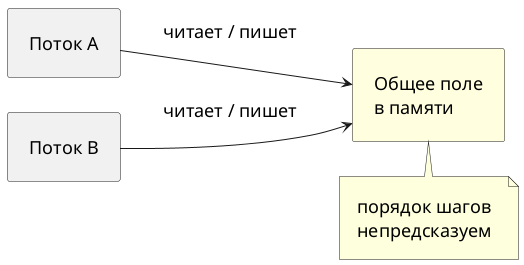

---

## Что такое гонка и почему `counter++` ломается

Классический пример — общий счётчик, который два потока увеличивают много раз подряд.

```java

public class RaceDemo {
    static int counter;

    public static void main(String[] args) throws InterruptedException {
        Runnable bump = () -> {
            for (int i = 0; i < 100_000; i++) {
                counter++;
            }
        };
        Thread a = new Thread(bump, "a");
        Thread b = new Thread(bump, "b");
        a.start();
        b.start();
        a.join();
        b.join();
        System.out.println(counter);
    }
}
```

Логически каждый поток добавляет по 100 000, итого ожидается **200 000**. На практике число часто **меньше** и **меняется от запуска к запуску**.

Причина не в «магии потоков», а в том, что выражение `counter++` для JVM — не одна неделимая операция. Официальный учебник разбирает это на примере класса `Counter`.

**Источник:** https://docs.oracle.com/javase/tutorial/essential/concurrency/interfere.html

**Цитата:**
> Interference happens when two operations, running in different threads, but acting on the same data, interleave. … it is enough to know that the single expression `c++` can be decomposed into three steps:
>
> 1. Retrieve the current value of `c`.
> 2. Increment the retrieved value by 1.
> 3. Store the incremented value back in `c`.

**Перевод:**
> Помехи (interference) возникают, когда две операции в разных потоках работают с одними и теми же данными и их шаги перемешиваются. … достаточно знать, что одно выражение `c++` можно разложить на три шага:
>
> 1. Прочитать текущее значение `c`.
> 2. Увеличить прочитанное значение на 1.
> 3. Записать результат обратно в `c`.

Если поток A прочитал 5, поток B тоже прочитал 5, оба записали 6 — одно увеличение **потерялось**. Такие ошибки трудно воспроизвести стабильно: иногда итог «случайно» верный, иногда нет.

Один из возможных порядков шагов для `c++` (оба потока стартовали с `c = 0`):

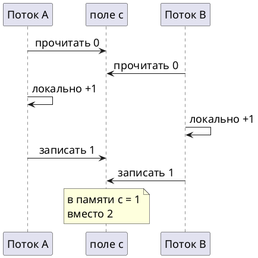

**Правило темы:** если несколько потоков **изменяют** одно и то же поле (или одну структуру) без согласования, вы не можете полагаться на арифметический итог и на целостность данных.

---

## Монитор и intrinsic lock

Чтобы два потока не перемешивали шаги над одними данными, нужно **взаимное исключение**: в каждый момент времени критический участок кода над общим состоянием выполняет **не больше одного** потока. В Java для этого используют **встроенный замок** (intrinsic lock), его же в разговорной речи и в API часто называют **монитором**.

**Источник:** https://docs.oracle.com/javase/tutorial/essential/concurrency/locksync.html

**Цитата:**
> Synchronization is built around an internal entity known as the intrinsic lock or monitor lock. (The API specification often refers to this entity simply as a "monitor.")
>
> Every object has an intrinsic lock associated with it. By convention, a thread that needs exclusive and consistent access to an object's fields has to acquire the object's intrinsic lock before accessing them, and then release the intrinsic lock when it's done with them. … As long as a thread owns an intrinsic lock, no other thread can acquire the same lock. The other thread will block when it attempts to acquire the lock.

**Перевод:**
> Синхронизация построена вокруг внутренней сущности — встроенного замка или замка монитора. (В спецификации API её часто называют просто «монитор».)
>
> У **каждого объекта** есть связанный с ним встроенный замок. По соглашению поток, которому нужен эксклюзивный и согласованный доступ к полям объекта, должен **захватить** этот замок перед доступом и **освободить** после работы. … Пока поток владеет замком, другой поток **не может** захватить тот же замок — при попытке он **блокируется**.

Ключевые слова для собеседования:

| Термин | Смысл |
|---|---|
| **монитор / intrinsic lock** | механизм взаимного исключения, привязанный к объекту |
| **захватить замок** | поток вошёл в синхронизированный участок и «владеет» замком |
| **блокировка** | второй поток ждёт, пока замок освободится |

У каждого объекта в JVM есть **свой** монитор. Поток, который вошёл в синхронизированный участок, **владеет** монитором этого объекта; остальные ждут.

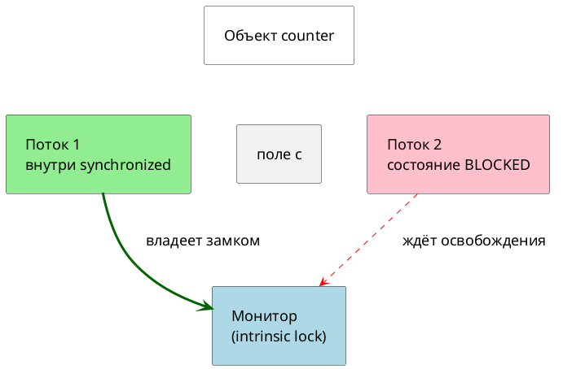

Когда поток **освобождает** замок, для следующего захвата того же замка устанавливается отношение **happens-before** (подробнее о видимости — в [теме 03](00-plan.md#тема-03-видимость-и-volatile); здесь достаточно: освобождение замка «публикует» изменения для следующего владельца).

---

## Синхронизированный метод экземпляра

Ключевое слово `synchronized` перед методом экземпляра означает: перед входом в тело метода поток захватывает **встроенный замок объекта, на котором вызван метод** (то есть `this`).

**Источник:** https://docs.oracle.com/javase/tutorial/essential/concurrency/locksync.html

**Цитата:**
> When a thread invokes a synchronized method, it automatically acquires the intrinsic lock for that method's object and releases it when the method returns. The lock release occurs even if the return was caused by an uncaught exception.

**Перевод:**
> Когда поток вызывает синхронизированный метод, он автоматически захватывает встроенный замок **объекта этого метода** и освобождает его при выходе из метода. Замок освобождается даже если выход произошёл из‑за неперехваченного исключения.

Исправленный счётчик — тот же сценарий, но увеличение и чтение идут через один объект с синхронизированными методами (как `SynchronizedCounter` в учебнике):

```java

public class SyncCounterDemo {
    static final Counter counter = new Counter();

    static class Counter {
        private int c;

        synchronized void increment() {
            c++;
        }

        synchronized int value() {
            return c;
        }
    }

    public static void main(String[] args) throws InterruptedException {
        Runnable bump = () -> {
            for (int i = 0; i < 100_000; i++) {
                counter.increment();
            }
        };
        Thread a = new Thread(bump);
        Thread b = new Thread(bump);
        a.start();
        b.start();
        a.join();
        b.join();
        System.out.println(counter.value());
    }
}
```

Результат стабильно:

```text
200000
```

Два потока вызывают `increment()` на **одном** объекте `counter` — значит, конкурируют за **один** замок. Пока один поток внутри `increment()`, второй ждёт у входа в свой `increment()`.

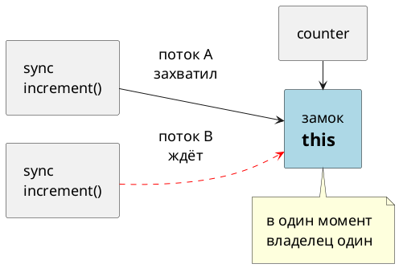

---

## Синхронизированный статический метод

Статический метод не привязан к конкретному экземпляру, но может менять **статические** поля, общие для всего класса. У такого метода замок другой.

**Источник:** https://docs.oracle.com/javase/tutorial/essential/concurrency/locksync.html

**Цитата:**
> You might wonder what happens when a static synchronized method is invoked, since a static method is associated with a class, not an object. In this case, the thread acquires the intrinsic lock for the `Class` object associated with the class. Thus access to class's static fields is controlled by a lock that's distinct from the lock for any instance of the class.

**Перевод:**
> При вызове **статического** синхронизированного метода поток захватывает встроенный замок объекта `Class`, связанного с классом. Доступ к **статическим** полям класса контролируется замком, **отличным** от замка любого экземпляра этого класса.

На собеседовании часто спрашивают: «`synchronized` на instance-методе и на static — это один замок?» **Нет.** Instance-метод блокирует `this`; static-метод блокирует `ИмяКласса.class`. Поток может одновременно держать замок экземпляра и заходить в static `synchronized` другого вызова — это **разные** замки (если только static-метод не трогает те же данные, что и instance без согласования — тогда логическая гонка останется).

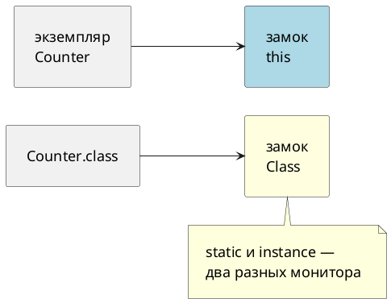

Запись `static synchronized void bump()` — **не другой вид магии**, а сокращение: JVM перед телом метода захватывает монитор **`ИмяКласса.class`**. Тот же монитор вы получите, если напишете вручную `synchronized (ИмяКласса.class) { … }` (см. [почему это чинит static-поле](#почему-исправление-работает-один-объект-замок)).

---

## Синхронизированный блок

Не обязательно помечать целый метод. Можно обернуть только нужные строки в блок `synchronized (объект) { … }`. Замок берётся у **указанного** объекта, а не автоматически у `this`.

**Источник:** https://docs.oracle.com/javase/tutorial/essential/concurrency/locksync.html

**Цитата:**
> Another way to create synchronized code is with synchronized statements. Unlike synchronized methods, synchronized statements must specify the object that provides the intrinsic lock:
>
> `synchronized(this) { … }`

**Перевод:**
> Другой способ — **синхронизированные операторы**. В отличие от синхронизированных методов, в блоке нужно **явно указать объект**, который отдаёт встроенный замок.

Зачем блок, если есть метод:

- синхронизировать **часть** метода, а не весь (меньше времени под замком — выше параллелизм, если это безопасно);
- использовать **отдельный объект-замок**, а не `this` (см. раздел про два поля);
- для статического контекста явно писать `synchronized (MyClass.class) { … }` — тот же замок, что у `static synchronized` метода.

Пример: счётчик с блоком на том же объекте, что и поле:

```java

public class SyncBlockDemo {
    private int c;
    private final Object lock = new Object();

    void increment() {
        synchronized (lock) {
            c++;
        }
    }

    int value() {
        synchronized (lock) {
            return c;
        }
    }
}
```

Важно: все потоки должны использовать **один и тот же** объект `lock` (или один и тот же `this`, или один и тот же `Class`). Иначе каждый будет держать «свой» замок, и гонка вернётся.

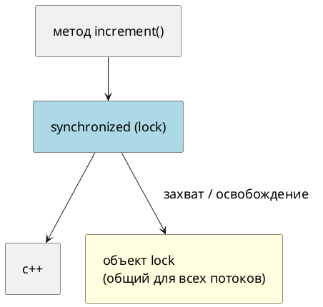

Ошибка «у каждого потока свой `new Object()` для замка»:

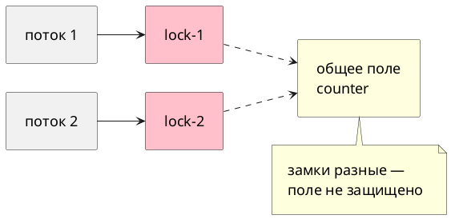

---

## Разные объекты — разные замки

Синхронизированный **instance**-метод захватывает замок **того объекта, на котором вызвали метод**. Два потока на **разных** экземплярах **не** мешают друг другу, если данные тоже разделены по экземплярам.

```java

public class TwoCounters {
    static class Counter {
        private int c;

        synchronized void increment() {
            c++;
        }

        synchronized int value() {
            return c;
        }
    }

    public static void main(String[] args) throws InterruptedException {
        Counter first = new Counter();
        Counter second = new Counter();

        Thread t1 = new Thread(() -> {
            for (int i = 0; i < 50_000; i++) {
                first.increment();
            }
        });
        Thread t2 = new Thread(() -> {
            for (int i = 0; i < 50_000; i++) {
                second.increment();
            }
        });
        t1.start();
        t2.start();
        t1.join();
        t2.join();

        System.out.println(first.value());
        System.out.println(second.value());
    }
}
```

Ожидаемый вывод:

```text
50000
50000
```

Потоки работают параллельно: замки `first` и `second` независимы. Ошибка на собеседовании — думать, что «раз `synchronized`, то все потоки в программе выстраиваются в очередь». Очередь только у **одного** замка.

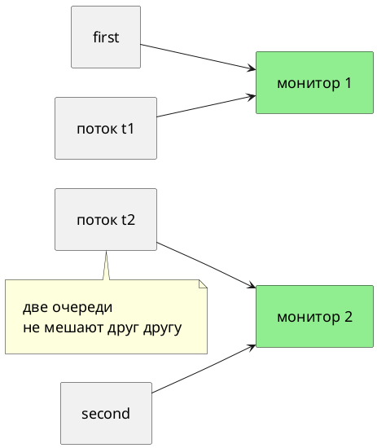

### Обратная ловушка: static-поле и два экземпляра

Выше мы вывели правило: **разные экземпляры → разные замки → можно работать параллельно**. **Обратная ловушка** — перенести это правило на ситуацию, где данные **общие не через экземпляр**, а через **одно static-поле на весь класс**.

Житейская картинка: два кассира стоят у **разных касс** (два объекта `first` и `second`), но сумму они записывают в **одну общую книгу** в сейфе директора (static-поле). Замок «только моя касса» не мешает второму кассиру в тот же момент писать в ту же книгу — защищена касса, а не книга.

В коде `synchronized` на **instance**-методе захватывает замок **this** того объекта, на котором вызвали метод. Static-поле живёт **в классе**, а не внутри `first` или `second`. Поток может держать замок `first` и одновременно другой поток — замок `second`, и оба без очереди выполняют `total++` над **одним** `static int total`.

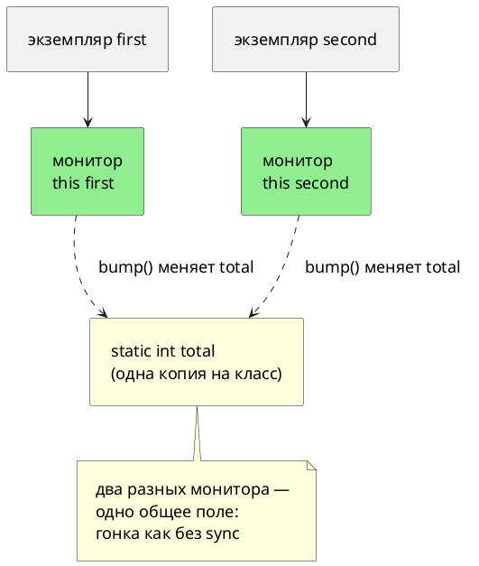

Ниже два потока вызывают `bump()` на **разных** экземплярах. Метод синхронизирован, но поле **static** — итог снова может быть меньше 200 000.

```java

public class StaticTrapDemo {
    static int total;

    synchronized void bump() {
        for (int i = 0; i < 100_000; i++) {
            total++;
        }
    }

    public static void main(String[] args) throws InterruptedException {
        StaticTrapDemo first = new StaticTrapDemo();
        StaticTrapDemo second = new StaticTrapDemo();

        Thread t1 = new Thread(() -> first.bump(), "t1");
        Thread t2 = new Thread(() -> second.bump(), "t2");
        t1.start();
        t2.start();
        t1.join();
        t2.join();
        System.out.println(total);
    }
}
```

Что происходит по шагам:

1. `t1` вызывает `first.bump()` — JVM захватывает монитор **объекта first**.
2. `t2` вызывает `second.bump()` — JVM захватывает монитор **объекта second** (это **другой** замок, `t2` не ждёт `t1`).
3. Оба потока выполняют `total++` над **одним** static-полем — шаги read/modify/write снова перемешиваются, как в [разделе про гонку](#что-такое-гонка-и-почему-counter-ломается).

#### Почему исправление работает: один объект-замок

JVM не «синхронизирует поле `total`» и не «синхронизирует метод по имени». Она всегда делает одно: поток **захватывает монитор конкретного объекта**, выполняет код, **освобождает** монитор. Гонка исчезает только когда **все** потоки, которые трогают одни и те же данные, перед этим проходят через **один и тот же** объект-замок.

В `StaticTrapDemo` объект-замок зависит от **точки вызова**, а не от того, что внутри метода лежит static-поле:

| Как написано | Кто выбирает объект-замок | Чему равен замок в нашем demo | Два потока на `first` и `second` |
|---|---|---|---|
| `synchronized void bump()` на экземпляре | JVM: монитор **получателя** вызова | `first` и `second` — **разные** объекты | два монитора → в `total` одновременно |
| `static synchronized void bump()` | JVM: монитор **`StaticTrapDemo.class`** | один объект `Class` на весь класс | один монитор → очередь |
| `synchronized (StaticTrapDemo.class) { … }` | **вы** явно в скобках | тот же `StaticTrapDemo.class` | то же, что у `static synchronized` |
| `synchronized (staticLock) { … }` | вы; `staticLock` — одно static-поле | один общий `Object`, если поле одно | то же, если все используют **это** поле |

Слово `static` у метода меняет не «силу» `synchronized`, а **ответ на вопрос: монитор какого объекта взять?** У instance-метода — `this` (тот, на ком вызвали). У static synchronized — объект класса, потому что у вызова **нет** экземпляра-получателя, и единственный общий «якорь» для всех потоков — `Class`.

Эквивалентность (один и тот же монитор — один и тот же `Class`):

```java

// Вариант A — запись короче
static synchronized void bump() {
    total++;
}

// Вариант B — тот же захват монитора, объект указан явно
static void bumpSameLock() {
    synchronized (StaticTrapDemo.class) {
        total++;
    }
}
```

Вариант B полезен, когда синхронизировать нужно **кусок** static-метода, а не весь метод, или когда в одном методе разные блоки на разных замках.

После перехода на **один** объект-замок (`StaticTrapDemo.class`) шаги для `t1` и `t2` такие:

1. `t1` входит в `bump()` → захватывает монитор **`StaticTrapDemo.class`**.
2. `t2` входит в `bump()` → пытается захватить **тот же** монитор → **BLOCKED**, пока `t1` не выйдет.
3. В каждый момент `total++` выполняет не больше одного потока → итог **200 000** стабилен.

Вызов через `first.bump()` и `StaticTrapDemo.bump()` для static-метода ведёт к **одному** классу и **одному** монитору; разные экземпляры больше не создают разные замки.

```java

public class StaticFixedDemo {
    static int total;

    static synchronized void bump() {
        for (int i = 0; i < 100_000; i++) {
            total++;
        }
    }

    public static void main(String[] args) throws InterruptedException {
        StaticFixedDemo first = new StaticFixedDemo();
        StaticFixedDemo second = new StaticFixedDemo();

        Thread t1 = new Thread(first::bump, "t1");
        Thread t2 = new Thread(second::bump, "t2");
        t1.start();
        t2.start();
        t1.join();
        t2.join();
        System.out.println(total);
    }
}
```

Здесь намеренно снова `first` и `second`: даже с разных экземпляров static synchronized всё равно берёт монитор **класса**, а не `this`.

**`first::bump` / `first.bump()`** у static-метода — только **способ записи вызова**; «получатель» `first` **не** становится замком. Эквивалентно `StaticFixedDemo.bump()` — монитор один: **`StaticFixedDemo.class`**. Запомнить: для `static synchronized` смотрим на **класс**, не на переменную слева от точки.

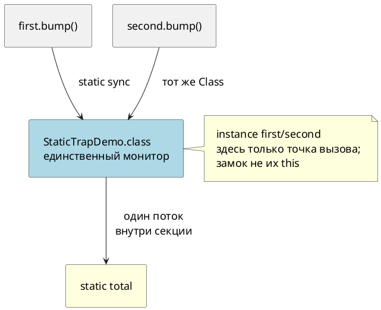

**Правило (механизм, не заучивание):** найди **общие изменяемые данные** → найди **один объект**, монитор которого должны захватывать **все** потоки перед доступом → выбери запись (`synchronized` на методе или блок), которая **привязана к этому объекту**. Для static-поля класса это обычно `ИмяКласса.class` или один общий `static final Object lock`.

---

## Замок на всех обращениях, включая чтение

Достаточно ли синхронизировать только `increment()`, а `value()` читать без замка? **Нет**, если `value()` должен видеть согласованное состояние **вместе** с изменениями из `increment()`.

Даже для «простого» чтения `int` проблема двойная:

1. **Гонка «прочитал — изменил — записал»** — если чтение участвует в решении (например, «если баланс ≥ суммы, списать»), без общего замка два потока могут оба пройти проверку по устаревшему значению.
2. **Видимость** — без happens-before между записью и чтением другой поток может долго видеть старое значение (тема 03); `synchronized` на **обоих** путях связывает запись и чтение через один замок.

Учебник для счётчика делает синхронизированным и `value()`:

**Источник:** https://docs.oracle.com/javase/tutorial/essential/concurrency/atomicvars.html

**Цитата:**
> One way to make `Counter` safe from thread interference is to make its methods synchronized, as in `SynchronizedCounter`: … `public synchronized int value() { return c; }`

**Перевод:**
> Один из способов защитить `Counter` от помех между потоками — сделать методы синхронизированными, в том числе `public synchronized int value() { return c; }`.

**Правило:** один логический инвариант (баланс, размер, содержимое структуры) — **один** замок на **все** операции чтения и записи, которые на этот инвариант опираются. Синхронизировать только «запись» — типичная ошибка в тестах и на собеседованиях.

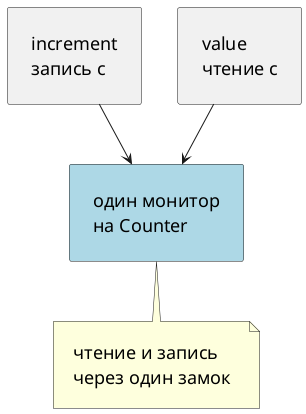

---

## Реентерабельность

Поток, который уже держит замок, **может** захватить его снова (например, `synchronized` метод вызвал другой `synchronized` метод на том же `this`). Без этого каждый внутренний вызов приводил бы к самоблокировке.

**Источник:** https://docs.oracle.com/javase/tutorial/essential/concurrency/locksync.html

**Цитата:**
> Recall that a thread cannot acquire a lock owned by another thread. But a thread can acquire a lock that it already owns. Allowing a thread to acquire the same lock more than once enables reentrant synchronization.

**Перевод:**
> Поток не может захватить замок, которым владеет **другой** поток. Но поток **может** захватить замок, которым уже владеет **он сам**. Это и есть **реентерабельная** синхронизация.

На практике: вложенные `synchronized` вызовы на одном объекте — нормальны. Счётчик захватов внутри JVM вам редко нужен, пока не перейдёте к `ReentrantLock` в теме 06.

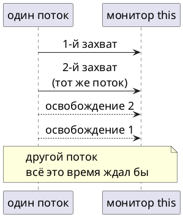

---

## Два замка на независимые поля

Если в объекте два поля, которые **никогда не используются вместе** в одной операции, можно держать **два** объекта-замка и синхронизировать обновления раздельно — так меньше взаимных блокировок.

**Источник:** https://docs.oracle.com/javase/tutorial/essential/concurrency/locksync.html (пример `MsLunch`)

**Цитата:**
> … class `MsLunch` has two instance fields, `c1` and `c2`, that are never used together. All updates of these fields must be synchronized, but there's no reason to prevent an update of c1 from being interleaved with an update of c2 … we create two objects solely to provide locks.

**Перевод:**
> … два поля `c1` и `c2`, которые **никогда не используются вместе**. Все обновления должны быть синхронизированы, но нет причин запрещать перемешивание обновления `c1` с обновлением `c2` … создаются два объекта **только как замки**.

Учебник предупреждает: так делайте **только** если вы **уверены**, что поля действительно независимы. Одна операция «перевести из c1 в c2» уже требует **одного** замка на оба поля или другой схемы — иначе снова гонка.

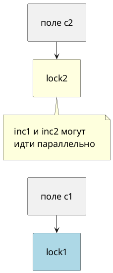

---

## Связь с темой 01: состояние BLOCKED

Когда поток пытается войти в `synchronized`, а замок занят, он **блокируется** — в [теме 01](01-thread-basics.md) это состояние `BLOCKED`: ожидание мониторного замка.

Пока поток в `BLOCKED`, он не выполняет ваш код внутри блока — он стоит в очереди за замком. После освобождения замка JVM даст ему войти; порядок пробуждения **не** гарантируется как «строго FIFO» — для курса достаточно помнить: **один замок — один исполнитель критической секции в момент времени**.

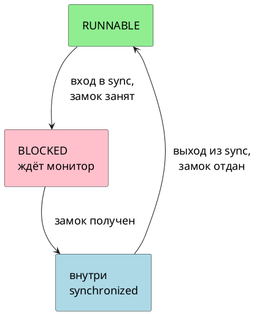

---

## Типичные ошибки

| Ошибка | Что получится |
|---|---|
| Синхронизировать только запись, читать без замка | устаревшие или «рваные» значения; решения по условию на основе поля ломаются |
| Разные потоки используют разные объекты-замки для одного поля | каждый думает, что защищён; гонка как без `synchronized` |
| `synchronized` на instance-методе при общем **static**-поле | static не защищён замком экземпляра |
| Два независимых замка на связанные поля (перевод между счётами) | частичные обновления, нарушение инварианта |
| Долгая работа (сеть, диск) внутри `synchronized` | все остальные потоки простаивают в `BLOCKED`; плохая производительность |
| Полагать, что «раз на собеседовании спросили про `volatile`, им хватит для счётчика» | для `count++` нужен замок или атомарный класс (тема 08); `volatile` — тема 03 |

---

## Практика

После зачёта **интервью** по этой теме — файл [`02-synchronized-tasks.md`](02-synchronized-tasks.md). Задачи формулируются как рабочие ситуации: нужный итог, параллельное поведение, без подсказок по конкретным API в условии.

Проверочная практика после основной — отдельно, в `02-synchronized-verify-tasks.md` (появится позже по [плану](00-plan.md)).

---

*Тема 02 курса [`00-plan.md`](00-plan.md).*
