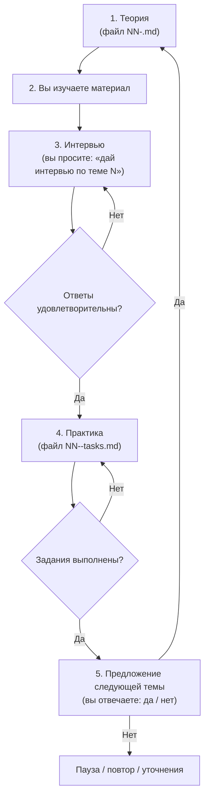

# План интерактивного курса SQL

Документ — **единая точка отсчёта** для нашего курса. На него можно ссылаться в чате: *«работаем по плану»*, *«где мы в плане?»*, *«следующая тема по плану»*.

---

## Оглавление

- [Цель курса](#цель-курса)
- [Среда и подключение](#среда-и-подключение)
- [Структура папки курса](#структура-папки-курса)
- [Оформление материалов](#оформление-материалов)
- [Цикл одной темы](#цикл-одной-темы)
- [Проверка ответов](#проверка-ответов)
- [База данных и миграции](#база-данных-и-миграции)
- [Программа тем](#программа-тем)
- [Текущий прогресс](#текущий-прогресс)
- [Как напоминать в чате](#как-напоминать-в-чате)

---

## Цель курса

Освоить SQL на практике, используя учебную базу **Reactive Shop** (`reactive_study`):

| Таблица | Назначение | ~строк |
|---|---|---|
| `users` | Пользователи | 5 000 |
| `orders` | Заказы | 100 000 |
| `products` | Товары | 203 |
| `product_categories` | Категории | 10 |
| `order_status_events` | История статусов заказов | — |
| `payment_attempts` | Попытки оплаты | — |

Курс идёт **от простого к сложному**: каждая тема опирается на предыдущие и использует реальные таблицы проекта.

---

## Среда и подключение

| Параметр | Значение |
|---|---|
| JDBC | `jdbc:postgresql://localhost:5434/reactive_study` |
| Пользователь / пароль | `app` / `app` |
| Схема | `reactive_study` |
| Контейнер | `reactive-study-postgres` |
| Клиент | pgAdmin (`http://localhost:5050`), DBeaver, `psql` — на ваш выбор |

Перед практикой контейнер должен быть запущен:

```bash

docker ps --filter name=reactive-study-postgres
```

---

## Структура папки курса

```
reactive-study/docs/sql-course/
├── 00-plan.md                 ← этот документ (план и прогресс)
├── 01-select-basics.md        ← тема 1: теория
├── 01-select-basics-tasks.md  ← тема 1: практические задания (после интервью)
├── 02-filtering.md
├── 02-filtering-tasks.md
├── …
├── 06-subqueries.md
├── 06-subqueries-tasks.md
├── 07-conditional-aggregates.md
├── 06-lovushka-null-i-plan-zaprosa.md  ← доп. разбор к теме 6: ловушка NULL + планы
├── 06-uzly-plana-zaprosa.md            ← доп. разбор к теме 6: узлы плана построчно
└── planner-explain.md                  ← общее руководство по EXPLAIN
```

**Правила имён файлов:**

| Файл | Содержание |
|---|---|
| `NN-<slug>.md` | Теория темы (выдаётся первой) |
| `NN-<slug>-tasks.md` | Практические задания (выдаётся после успешного интервью) |
| `NN-<slug>.md` без пары `-tasks` | Дополнительный разбор к теме — по отдельному запросу |
| `<slug>.md` без номера | Сквозное руководство, не привязанное к одной теме |

`NN` — двузначный номер темы (`01`, `02`, …).  
`<slug>` — короткое имя латиницей (`select-basics`, `joins`, …).

---

## Оформление материалов

Каждый учебный документ оформляется по правилам из:

[`reactive-study/docs/Промпт для оформления ответов с источниками.md`](../Промпт%20для%20оформления%20ответов%20с%20источниками.md)

Кратко:

1. **Без сносок** `[1]`, `[^1]` — только гиперссылки по месту.
2. Для **англоязычных** источников — блок **EN** (дословная цитата) и блок **RU** (**полный** перевод цитаты, без сокращений и потери смысла; «non-null» → «не равных NULL», не «не нулю»).
3. Для **русскоязычных** — ссылка и пересказ.
4. **Интерактивное оглавление** в начале каждого документа.
5. Примеры SQL — с указанием таблиц `reactive_study`.
6. **У каждого запроса в теории — таблица результата. Без исключений.** Правило действует и для вводных разделов, где объясняется термин, и для примеров «как не надо», и для заданий «попробовать самостоятельно» (там таблица идёт как ответ для сверки). Запрос без показанного результата в теории не публикуется.
7. Порядок такой: сначала маленькая таблица на вымышленных данных из обычной жизни (магазин, банк, авиакомпания) — видно строки на входе и строку сводки на выходе. Затем тот же смысл на `reactive_study` и таблица реального результата. Числа учебной базы снимаются запросом до публикации, не выдумываются.
8. Новый термин объясняется через **текст запроса и его результат**, а не через определение. Жаргон вида «повесить условие на агрегат» не используется: пишется, где конструкция стоит в запросе и на какую колонку влияет. Логические значения — `true` и `false`, не «истина» и «ложь».
9. Псевдонимы колонок (`AS …`) — **только осмысленные английские слова**: `total`, `delivered_revenue`, `success_pct`. Транслит русских слов латиницей (`vsego`, `dostavleno`, `vyruchka_dostavlennyh`) запрещён: такое имя нечитаемо ни по-русски, ни по-английски. В заголовках таблиц результата стоят те же имена, что в запросе.
10. Раздел **«Что попробовать самостоятельно»** пишется законченными русскими предложениями, как постановка от менеджера разработчику. Каждый пункт самодостаточен: названа таблица и что в ней лежит, какие строки считать, какие поля вывести и сколько строк в результате. Поле называют так, как оно называется в таблице, и сразу пишут, что означает каждое значение: «в столбце `status` значение `success` значит, что деньги списались». Постановка звучит как запрос на дашборд: назван каждый столбец и какое значение в нём должно стоять. Два столбца не спрашивают одно и то же разными словами. В постановке нельзя придумывать сущности, которых нет в таблице: если в `payment_attempts` нет карты, нельзя писать «первая карта», «другая карта». Пишут то, что в столбце есть: номер попытки по заказу. Запрещены обрывки, двоеточие вместо сказуемого и слова-заменители вроде «итог», «такой итог», «строка на каждый итог», если из них неясно, какой столбец и какие значения имеются в виду. Отсылка «тот же запрос» допустима только если числа в этом же пункте названы заново. Перед публикацией новой темы этот раздел сверяется с правилами 6–12.
11. Если в задании или в разделе «Что попробовать самостоятельно» считают **попытки оплаты**, в тексте прямо написано, что считать. Одна строка таблицы `payment_attempts` — одна попытка списать деньги по заказу, поэтому «сколько попыток» — это число строк. Рядом поясняется разница полей: `id` — номер строки во всей таблице, по нему попытки не группируют; `attempt_no` — какая по счёту попытка у одного заказа (первая, вторая), и его используют только если задание прямо про порядок попыток внутри заказа. Без этих двух фраз задание не выдаётся.
12. **Оформление пункта задания — список с дефисом, одна мысль на строке.** Сплошной абзац, в котором несколько разных мыслей идут подряд, не используется. Вложенная мысль сдвигается на один уровень и тоже начинается с дефиса. При правке текста этот список не склеивают обратно в абзац: меняются слова, расположение строк остаётся. В строке списка нельзя писать «этот статус», «этим статусом», «с этим статусом»: из такой строки неясно, о каком значении речь. Нужно назвать группу или значение: «статус группы», «статус `failed`», «попытки из этой группы». Запрещены фразы, которые подсказывают, как писать запрос: «по одной строке на каждую группу», «сделайте группировку», «верните отдельную строку на каждое значение». Сколько строк получится, читающий видит сам по данным и по постановке.

Образец:

```markdown
- Каждая строка таблицы — одна попытка списать деньги, поэтому число попыток — это число строк.
- Столбец `id` только нумерует строку. По нему отчёт не строят.
- Столбец `attempt_no` показывает, какая это попытка у одного заказа: первая, вторая или третья.
- В столбце `status` записано, чем закончилась попытка.
  - `success` значит, что деньги списались.
  - `failed` значит, что списание не удалось.
- На дашборд нужен отчёт из трёх столбцов.
  - Первый столбец — статус попытки: `success` или `failed`.
  - Второй столбец — сколько попыток оплаты в статусе `success` и сколько попыток оплаты в статусе `failed`.
    - В строке, где первый столбец равен `success`, стоит число попыток со статусом `success`.
    - В строке, где первый столбец равен `failed`, стоит число попыток со статусом `failed`.
  - Третий столбец — сколько из попыток второго столбца являются второй или третьей попыткой по тому же заказу.
    - Если по заказу это первая попытка списания, в `attempt_no` стоит `1`. Такую попытку в третий столбец не считают.
    - Если по тому же заказу платили ещё раз, в `attempt_no` стоит `2`. Если ещё раз — `3`. Такие попытки считают.
    - Это не число попыток у одного заказа и не число карт. В таблице карты нет: клиент мог платить одной картой несколько раз. Считают только номер попытки по заказу.
```

---

## Цикл одной темы

Каждая тема проходит **строго в пять шагов**. Переход к следующему шагу — только после успешного завершения предыдущего.



### Шаг 1 — Теория

- Ассистент создаёт файл `NN-<slug>.md` и сообщает в чате.
- В чате — краткое резюме темы и ссылка на файл.
- Раздел «Что попробовать самостоятельно» сверяется с правилами 10–12 в [оформлении материалов](#оформление-материалов).
- **Интервью и задания на этом шаге не выдаются.**

### Шаг 2 — Самостоятельное изучение

- Вы читаете документ, пробуете примеры в своём SQL-клиенте.
- Когда готовы — пишете в чат, например:  
  *«Изучил тему 1, дай интервью»*.

### Шаг 3 — Интервью

- Ассистент задаёт вопросы **устно в чате** (без отдельного файла).
- Формат: 3–7 вопросов на понимание, не на зубрёжку синтаксиса.
- Можно отвечать своими словами; SQL-примеры — по желанию.
- Если ответы **неудовлетворительны** — ассистент указывает пробелы и задаёт уточняющие вопросы по той же теме (шаг 3 повторяется).
- Если ответы **удовлетворительны** — переход к шагу 4.

### Шаг 4 — Практические задания

- Ассистент создаёт файл `NN-<slug>-tasks.md` и выдаёт задания в чате.
- Задания формулируются как **бизнес-задачи** (ситуация + что нужно получить), **без подсказок**, какой оператор SQL использовать — выбор конструкции по пройденной теории.
- Вы присылаете **SQL-запросы** в чат.
- Ассистент **сам** прогоняет запросы в БД и сверяет результат.
- Если есть ошибки — указывает и просит исправить (шаг 4 повторяется).
- Если всё верно — переход к шагу 5.

#### Как формулировать каждое задание

Каждое задание **самодостаточно**. Читающий не должен открывать другое задание ради формулировки.

| Правило | Как делать |
|---|---|
| Одна цель | одна понятная бизнес-задача |
| Полный список полей результата | **бизнес-имена**: номер заказа, имя клиента, артикул, название отдела, сумма |
| Полные ограничения | какие заказы, какой отдел, сколько строк, как сортировать |
| Без отсылок | запрещены «как в задании N», «такой же набор», «те же группы» |
| Без двусмысленности | не «сравнить», «оформили текстом», «дыры» — только ясно, **какие поля** в ответе |
| Без подсказки SQL | не писать `INNER JOIN`, `LEFT JOIN`, `ON`, `WHERE`, `GROUP BY`, скобки, `NULL` как способ решения |

**Запрещено — подсказка, откуда брать данные в базе:**

- имена таблиц и столбцов: `orders.id`, `products.sku`, `product_categories.name`;
- фразы «из таблицы заказов», «поле `product_id` пустое»;
- объяснение, **как не решать**: «не сопоставляйте названия», «карточки нет — используйте …»;
- ожидаемый технический результат: «артикул будет пустым», «образуют отдельную группу».

**Разрешено — что нужно бизнесу:**

- «номер заказа **2**», «отдел **Электроника**», «5 строк», «сначала меньший номер»;
- «оба заказа должны быть в списке»;
- «название отдела показывать только для отдела **Электроника**» — это правило отчёта, не синтаксис SQL.

**Неправильно:** «Вывести `orders.id`, `users.full_name`, связать через `product_id`».

**Неправильно:** «У заказа 100003 нет `product_id`, артикул будет NULL».

**Правильно:** «По заказу **100003** одна строка: номер заказа, как товар назван в заказе, артикул из каталога».

#### Соответствие типовым задачам на собеседовании

Практика темы должна покрывать паттерны, которые чаще всего дают на SQL-интервью именно по этой теме. Конструкции следующих тем программы в задания не закладываются.

Общие правила для любой темы:

- разные номера задач — разные паттерны, дублировать одно задание с другим названием отдела нельзя;
- перед выдачей сверять набор с актуальными подборками interview-вопросов по теме (e-commerce: orders, products, categories, customers);
- **каждое задание прогоняется в БД до выдачи** — задание с пустым результатом непригодно, если пустота не является самим ответом по условию.

**Тема 05 — JOIN нескольких таблиц:**

| Паттерн на собеседовании | Пример формулировки для кандидата |
|---|---|
| Детальная строка из 3–4 таблиц | заказ + клиент + товар + отдел |
| Фильтр по категории после цепочки | продажи отдела «Электроника» |
| Агрегация по категории | число заказов или выручка по отделам |
| LEFT: сохранить строки без совпадения | заказы без карточки в каталоге |
| GROUP BY с «пустым» отделом | продажи без отдела — отдельная строка отчёта |
| Бизнес-правило фильтра в отчёте | показывать отдел только для «Электроника» |
| JOIN + GROUP BY: два счётчика | все заказы группы и только с заполненным отделом |
| История клиента / топ заказов | все заказы одного клиента; самые дорогие заказы |

**Тема 06 — подзапросы:**

| Паттерн на собеседовании | Пример формулировки для кандидата |
|---|---|
| Сравнение с вычисленным числом | заказы дороже средней суммы по магазину |
| Сравнение с крайним значением | заказ на самую большую сумму за всё время |
| Счётчик рядом с каждой строкой | сколько заказов у каждого клиента |
| Проверка вхождения в список | клиенты, у которых была покупка дороже 2000 |
| Поиск «чего нет» слева | клиенты без заказов |
| Поиск «чего нет» справа | товары, которые ни разу не купили |
| Ловушка NULL на связи | заказы, товар которых не определить по каталогу |
| Проверка наличия с доп. условием | клиенты с заказом в статусе pending дороже 1500 |
| Сравнение со всем набором значений | товары дороже каждого товара отдела «Офис» |
| Сравнение со средним по своей группе | заказы выше личного среднего того же клиента |
| Вложенная проверка по цепочке | отделы, где есть хотя бы один непроданный товар |
| Отрицание с доп. условием | клиенты, ни один заказ которых не доставлен |
| Подзапрос считает по отделу, не по всему магазину | порог или наличие покупки ищутся по названию отдела; номер отдела заранее неизвестен |

**Тема 07 — условные агрегаты:**

| Паттерн на собеседовании | Пример формулировки для кандидата |
|---|---|
| Несколько счётчиков в одной строке | всего / доставлено / отменено на одном дашборде |
| Статусы разложены по столбцам | пять статусов заказа — пять чисел в одной строке |
| Доля в процентах | какая часть заказов доставлена; какая часть списаний прошла |
| Счётчик и сумма рядом | штуки доставленных и деньги доставленных; то же по отменам |
| Среднее только по части строк | средний чек доставленного заказа |
| Внутри каждой корзины — общее и только дорогие | по статусу: все заказы, крупные, деньги крупных |
| Два условия на одну попытку | первое списание не прошло; третье списание прошло |
| Первая и повторная попытка | по статусу списания: всего, первые, повторные |
| Сумма только повторных | деньги всех попыток статуса и деньги только 2-й и 3-й попытки |

#### Оформление текста задания

- **Ситуация** и **Что получить** — отдельные блоки.
- Если в блоке несколько мыслей — каждая с новой строки.
- Список полей — маркированный список, не через запятую в одной строке.
- Сортировка и лимит — отдельной строкой после списка полей или одной фразой в конце блока «Что получить».
- Сортировка называется **полным именем поля**, а не словом «номер». Если в результате больше одного числа (номер клиента и число заказов, номер заказа и номер клиента), формулировка «сначала с меньшим номером» двусмысленна: непонятно, по какому из чисел сортировать. Писать «сортировать по номеру клиента, от меньшего к большему».
- Поле не должно звучать как «сходи в другую сущность», если оно принадлежит основному объекту отчёта. «Номер клиента» в отчёте по заказам читается как «открой карточку клиента». Писать «номер клиента, которому принадлежит этот заказ» и явно сказать, если имени, почты и карточки в отчёте нет. Имена таблиц при этом по-прежнему не называть.

**Пример:**

```markdown
**Ситуация:** менеджер открывает карточку клиента **Ann Smith**.
Он хочет видеть все её заказы с артикулом и отделом каждой покупки.

**Что получить:** по одной строке на каждый заказ этого клиента.

- Поля:
  - номер заказа,
  - артикул товара,
  - название отдела,
  - сумма заказа.

Сначала заказы с большим номером, но не более **10** строк.
```

### Шаг 5 — Переход к следующей теме

- Ассистент спрашивает: *«Переходим к теме N+1?»*
- Вы отвечаете **да** или **нет**.
- **Да** → шаг 1 для следующей темы.
- **Нет** → пауза, повтор материала, дополнительные задания — по вашему запросу.

---

## Проверка ответов

### Интервью — зачёт, если:

- суть понятия объяснена верно;
- нет грубых ошибок, меняющих смысл;
- допустимы неточности формулировок — ассистент поправит.

### Практика — зачёт, если:

- запрос **выполняется без ошибки** на `reactive_study`;
- отбор строк **соответствует смыслу** задания;
- используются конструкции **именно текущей темы** (не обязательно «идеальный» SQL, но без обхода темы).

Сортировка, направление сортировки и `LIMIT` — оформление выдачи. На зачёт не влияют, если набор отобранных строк верный. Замечание по ним — отдельно, без снятия зачёта. Исключение: задание прямо проверяет порядок или число строк как смысл отчёта, а не как способ обрезать вывод.

---

## База данных и миграции

Учебная база живёт в проекте **reactive-study**. Схема и данные наращиваются через **Flyway-миграции**:

```
reactive-study/src/main/resources/db/migration/
```

Текущие миграции: `V0` … `V14` (схема `reactive_study`, таблицы, seed-данные).

| Миграция | Для какой темы добавлена | Что даёт |
|---|---|---|
| `V12__join_demo_seed.sql` | 04–05 | клиенты без заказов, заказы без товара в каталоге |
| `V13__products_never_ordered.sql` | 06 | товары, которых нет ни в одном заказе |
| `V14__payment_retry_attempts.sql` | 07 | у части заказов три попытки списания: две карты не прошли, третья прошла |

### Если для темы не хватает таблиц или данных

Перед выдачей теории/практики ассистент:

1. Проверяет, хватает ли существующей структуры и данных для заданий.
2. Если **не хватает** — добавляет новые файлы миграций (`V12__…sql`, `V13__…sql`, …):
   - создание таблиц, индексов, ограничений;
   - seed-данные (`INSERT`, `generate_series` и т.п.).
3. Сообщает в чате: **запустите приложение reactive-study**, чтобы Flyway применил миграции.
4. После успешного прогона — продолжаем теорию / практику на обновлённой базе.

### Если задание — ручной DDL/DML (ваши руки)

Для тем вроде **индексов**, **ALTER TABLE**, части **DML** — ассистент **явно** пишет:

- что выполнить в SQL-клиенте (`CREATE INDEX …`, `ALTER TABLE … ADD COLUMN …`);
- на какой таблице и **зачем** (в контексте задачи).

Такие изменения **не** всегда идут в миграции — только если нужны для всего курса навсегда.

### Кто проверяет практику

- Вы присылаете **SQL-запросы** в чат.
- Ассистент **сам** прогоняет их в БД и сверяет результат (как в теме 01).

---

## Программа тем

| № | Файл (теория) | Тема | Таблицы / фокус |
|---|---|---|---|
| 01 | `01-select-basics.md` | SELECT, FROM, WHERE, ORDER BY, LIMIT | `users` |
| 02 | `02-filtering.md` | Фильтрация: `AND`/`OR`, `IN`, `BETWEEN`, `LIKE`, `IS NULL` | `users`, `orders` |
| 03 | `03-aggregations.md` | Агрегаты: `COUNT`, `SUM`, `AVG`, `MIN`, `MAX`; `GROUP BY`, `HAVING` | `orders` |
| 04 | `04-joins-inner-left.md` | `INNER JOIN`, `LEFT JOIN` | `users` + `orders` |
| 05 | `05-joins-multi-table.md` | JOIN трёх и более таблиц | `orders` + `products` + `product_categories` |
| 06 | `06-subqueries.md` | Подзапросы: скalar, `IN`, `EXISTS` | `orders`, `users` |
| 07 | `07-conditional-aggregates.md` | Условные агрегаты: `FILTER`, `count(CASE …)` | `orders`, `payment_attempts` |
| 08 | `08-cte.md` | CTE (`WITH … AS`) | `orders`, `payment_attempts` |
| 09 | `09-window-functions.md` | Оконные функции: `ROW_NUMBER`, `RANK`, `SUM() OVER` | `orders` |
| 10 | `10-datetime.md` | Даты и время: `date_trunc`, интервалы, `EXTRACT` | `orders`, `order_status_events` |
| 11 | `11-indexes-explain.md` | Индексы и `EXPLAIN` (чтение плана) | индексы на `orders`, `users` |
| 12 | `12-event-log.md` | Аналитика по логу событий | `order_status_events` |
| 13 | `13-payments-analytics.md` | Платежи: успех/неудача, повторные попытки | `payment_attempts` + `orders` |

> Порядок тем можно скорректировать по ходу — изменения фиксируются в этом файле.

**Тема 07 добавлена по ходу курса.** Возникла из вопроса про `count(*) FILTER (WHERE …)`, который встретился в проверочном запросе к теме 06. Опирается только на агрегаты темы 03, поэтому поставлена сразу после подзапросов, а CTE и следующие темы сдвинуты на один номер.

Что в неё входит:

- `FILTER (WHERE …)` — несколько счётчиков с разными условиями в одной строке за один проход по таблице;
- старая запись того же через `count(CASE WHEN … THEN 1 END)` и `sum(CASE …)` — её до сих пор спрашивают на интервью, потому что она работает в любой СУБД;
- чем это отличается от `WHERE`, который отсекает строки для всего запроса сразу;
- сводки для дашбордов: заказы по статусам одной строкой, доля успешных оплат, выручка только по доставленным.

---

## Текущий прогресс

| № | Тема | Теория | Интервью | Практика | Статус |
|---|---|---|---|---|---|
| 01 | SELECT — основы | ✅ | ✅ | ✅ | **завершена** |
| 02 | Фильтрация | ✅ | ✅ | ✅ | **завершена** |
| 03 | Агрегации | ✅ | ✅ | ✅ | **завершена** |
| 04 | JOIN (inner/left) | ✅ | ✅ | ✅ | **завершена** |
| 05 | JOIN (несколько таблиц) | ✅ | ✅ | ✅ | **завершена** |
| 06 | Подзапросы | ✅ | ✅ | ✅ | **завершена** |
| 07 | Условные агрегаты (`FILTER`) | ✅ | ✅ | ⬜ | **практика** |
| 08 | CTE | ⬜ | ⬜ | ⬜ | не начата |
| 09 | Оконные функции | ⬜ | ⬜ | ⬜ | не начата |
| 10 | Даты и время | ⬜ | ⬜ | ⬜ | не начата |
| 11 | Индексы и EXPLAIN | ⬜ | ⬜ | ⬜ | не начата |
| 12 | Лог событий | ⬜ | ⬜ | ⬜ | не начата |
| 13 | Аналитика платежей | ⬜ | ⬜ | ⬜ | не начата |

**Легенда:** ⬜ — не пройдено · ✅ — пройдено

---

## Как напоминать в чате

| Ваша фраза | Что делает ассистент |
|---|---|
| *«Работаем по плану»* | Смотрит таблицу прогресса, продолжает с текущего шага |
| *«Где мы в плане?»* | Показывает текущую тему и шаг (теория / интервью / практика) |
| *«Дай интервью по теме N»* | Запускает шаг 3 для темы N |
| *«Проверь задание»* + SQL | Проверяет практику (шаг 4) |
| *«Следующая тема»* | Предлагает тему N+1 (шаг 5) |

---

*Создано: 2026-08-19. Обновлено: 2026-09-24. Тема 06 завершена, тема 07 — практика.*
