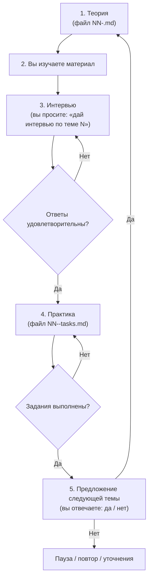

# План интерактивного курса SQL

Документ — **единая точка отсчёта** для нашего курса. На него можно ссылаться в чате: *«работаем по плану»*, *«где мы в плане?»*, *«следующая тема по плану»*.

---

## Оглавление

- [Цель курса](#цель-курса)
- [Среда и подключение](#среда-и-подключение)
- [Структура папки курса](#структура-папки-курса)
- [Оформление материалов](#оформление-материалов)
- [Цикл одной темы](#цикл-одной-темы)
- [Проверка ответов](#проверка-ответов)
- [База данных и миграции](#база-данных-и-миграции)
- [Программа тем](#программа-тем)
- [Текущий прогресс](#текущий-прогресс)
- [Как напоминать в чате](#как-напоминать-в-чате)

---

## Цель курса

Освоить SQL на практике, используя учебную базу **Reactive Shop** (`reactive_study`):

| Таблица | Назначение | ~строк |
|---|---|---|
| `users` | Пользователи | 5 000 |
| `orders` | Заказы | 100 000 |
| `products` | Товары | 200 |
| `product_categories` | Категории | 10 |
| `order_status_events` | История статусов заказов | — |
| `payment_attempts` | Попытки оплаты | — |

Курс идёт **от простого к сложному**: каждая тема опирается на предыдущие и использует реальные таблицы проекта.

---

## Среда и подключение

| Параметр | Значение |
|---|---|
| JDBC | `jdbc:postgresql://localhost:5434/reactive_study` |
| Пользователь / пароль | `app` / `app` |
| Схема | `reactive_study` |
| Контейнер | `reactive-study-postgres` |
| Клиент | pgAdmin (`http://localhost:5050`), DBeaver, `psql` — на ваш выбор |

Перед практикой контейнер должен быть запущен:

```bash

docker ps --filter name=reactive-study-postgres
```

---

## Структура папки курса

```
reactive-study/docs/sql-course/
├── 00-plan.md                 ← этот документ (план и прогресс)
├── 01-select-basics.md        ← тема 1: теория
├── 01-select-basics-tasks.md  ← тема 1: практические задания (после интервью)
├── 02-filtering.md
├── 02-filtering-tasks.md
└── …
```

**Правила имён файлов:**

| Файл | Содержание |
|---|---|
| `NN-<slug>.md` | Теория темы (выдаётся первой) |
| `NN-<slug>-tasks.md` | Практические задания (выдаётся после успешного интервью) |

`NN` — двузначный номер темы (`01`, `02`, …).  
`<slug>` — короткое имя латиницей (`select-basics`, `joins`, …).

---

## Оформление материалов

Каждый учебный документ оформляется по правилам из:

[`reactive-study/docs/Промпт для оформления ответов с источниками.md`](../Промпт%20для%20оформления%20ответов%20с%20источниками.md)

Кратко:

1. **Без сносок** `[1]`, `[^1]` — только гиперссылки по месту.
2. Для **англоязычных** источников — блок **EN** (дословная цитата) и блок **RU** (**полный** перевод цитаты, без сокращений и потери смысла; «non-null» → «не равных NULL», не «не нулю»).
3. Для **русскоязычных** — ссылка и пересказ.
4. **Интерактивное оглавление** в начале каждого документа.
5. Примеры SQL — с указанием таблиц `reactive_study`.

---

## Цикл одной темы

Каждая тема проходит **строго в пять шагов**. Переход к следующему шагу — только после успешного завершения предыдущего.



### Шаг 1 — Теория

- Ассистент создаёт файл `NN-<slug>.md` и сообщает в чате.
- В чате — краткое резюме темы и ссылка на файл.
- **Интервью и задания на этом шаге не выдаются.**

### Шаг 2 — Самостоятельное изучение

- Вы читаете документ, пробуете примеры в своём SQL-клиенте.
- Когда готовы — пишете в чат, например:  
  *«Изучил тему 1, дай интервью»*.

### Шаг 3 — Интервью

- Ассистент задаёт вопросы **устно в чате** (без отдельного файла).
- Формат: 3–7 вопросов на понимание, не на зубрёжку синтаксиса.
- Можно отвечать своими словами; SQL-примеры — по желанию.
- Если ответы **неудовлетворительны** — ассистент указывает пробелы и задаёт уточняющие вопросы по той же теме (шаг 3 повторяется).
- Если ответы **удовлетворительны** — переход к шагу 4.

### Шаг 4 — Практические задания

- Ассистент создаёт файл `NN-<slug>-tasks.md` и выдаёт задания в чате.
- Задания формулируются как **бизнес-задачи** (ситуация + что нужно получить), **без подсказок**, какой оператор SQL использовать — выбор конструкции по пройденной теории.
- Вы присылаете **SQL-запросы** в чат.
- Ассистент **сам** прогоняет запросы в БД и сверяет результат.
- Если есть ошибки — указывает и просит исправить (шаг 4 повторяется).
- Если всё верно — переход к шагу 5.

### Шаг 5 — Переход к следующей теме

- Ассистент спрашивает: *«Переходим к теме N+1?»*
- Вы отвечаете **да** или **нет**.
- **Да** → шаг 1 для следующей темы.
- **Нет** → пауза, повтор материала, дополнительные задания — по вашему запросу.

---

## Проверка ответов

### Интервью — зачёт, если:

- суть понятия объяснена верно;
- нет грубых ошибок, меняющих смысл;
- допустимы неточности формулировок — ассистент поправит.

### Практика — зачёт, если:

- запрос **выполняется без ошибки** на `reactive_study`;
- результат **соответствует условию** задания;
- используются конструкции **именно текущей темы** (не обязательно «идеальный» SQL, но без обхода темы).

---

## База данных и миграции

Учебная база живёт в проекте **reactive-study**. Схема и данные наращиваются через **Flyway-миграции**:

```
reactive-study/src/main/resources/db/migration/
```

Текущие миграции: `V0` … `V11` (схема `reactive_study`, таблицы, seed-данные).

### Если для темы не хватает таблиц или данных

Перед выдачей теории/практики ассистент:

1. Проверяет, хватает ли существующей структуры и данных для заданий.
2. Если **не хватает** — добавляет новые файлы миграций (`V12__…sql`, `V13__…sql`, …):
   - создание таблиц, индексов, ограничений;
   - seed-данные (`INSERT`, `generate_series` и т.п.).
3. Сообщает в чате: **запустите приложение reactive-study**, чтобы Flyway применил миграции.
4. После успешного прогона — продолжаем теорию / практику на обновлённой базе.

### Если задание — ручной DDL/DML (ваши руки)

Для тем вроде **индексов**, **ALTER TABLE**, части **DML** — ассистент **явно** пишет:

- что выполнить в SQL-клиенте (`CREATE INDEX …`, `ALTER TABLE … ADD COLUMN …`);
- на какой таблице и **зачем** (в контексте задачи).

Такие изменения **не** всегда идут в миграции — только если нужны для всего курса навсегда.

### Кто проверяет практику

- Вы присылаете **SQL-запросы** в чат.
- Ассистент **сам** прогоняет их в БД и сверяет результат (как в теме 01).

---

## Программа тем

| № | Файл (теория) | Тема | Таблицы / фокус |
|---|---|---|---|
| 01 | `01-select-basics.md` | SELECT, FROM, WHERE, ORDER BY, LIMIT | `users` |
| 02 | `02-filtering.md` | Фильтрация: `AND`/`OR`, `IN`, `BETWEEN`, `LIKE`, `IS NULL` | `users`, `orders` |
| 03 | `03-aggregations.md` | Агрегаты: `COUNT`, `SUM`, `AVG`, `MIN`, `MAX`; `GROUP BY`, `HAVING` | `orders` |
| 04 | `04-joins-inner-left.md` | `INNER JOIN`, `LEFT JOIN` | `users` + `orders` |
| 05 | `05-joins-multi-table.md` | JOIN трёх и более таблиц | `orders` + `products` + `product_categories` |
| 06 | `06-subqueries.md` | Подзапросы: скalar, `IN`, `EXISTS` | `orders`, `users` |
| 07 | `07-cte.md` | CTE (`WITH … AS`) | `orders`, `payment_attempts` |
| 08 | `08-window-functions.md` | Оконные функции: `ROW_NUMBER`, `RANK`, `SUM() OVER` | `orders` |
| 09 | `09-datetime.md` | Даты и время: `date_trunc`, интервалы, `EXTRACT` | `orders`, `order_status_events` |
| 10 | `10-indexes-explain.md` | Индексы и `EXPLAIN` (чтение плана) | индексы на `orders`, `users` |
| 11 | `11-event-log.md` | Аналитика по логу событий | `order_status_events` |
| 12 | `12-payments-analytics.md` | Платежи: успех/неудача, повторные попытки | `payment_attempts` + `orders` |

> Порядок тем можно скорректировать по ходу — изменения фиксируются в этом файле.

---

## Текущий прогресс

| № | Тема | Теория | Интервью | Практика | Статус |
|---|---|---|---|---|---|
| 01 | SELECT — основы | ✅ | ✅ | ✅ | **завершена** |
| 02 | Фильтрация | ✅ | ✅ | ✅ | **завершена** |
| 03 | Агрегации | ✅ | ✅ | ✅ | **завершена** |
| 04 | JOIN (inner/left) | ✅ | ✅ | ✅ | **завершена** |
| 05 | JOIN (несколько таблиц) | ✅ | ⬜ | ⬜ | **теория выдана** |
| 06 | Подзапросы | ⬜ | ⬜ | ⬜ | не начата |
| 07 | CTE | ⬜ | ⬜ | ⬜ | не начата |
| 08 | Оконные функции | ⬜ | ⬜ | ⬜ | не начата |
| 09 | Даты и время | ⬜ | ⬜ | ⬜ | не начата |
| 10 | Индексы и EXPLAIN | ⬜ | ⬜ | ⬜ | не начата |
| 11 | Лог событий | ⬜ | ⬜ | ⬜ | не начата |
| 12 | Аналитика платежей | ⬜ | ⬜ | ⬜ | не начата |

**Легенда:** ⬜ — не пройдено · ✅ — пройдено

---

## Как напоминать в чате

| Ваша фраза | Что делает ассистент |
|---|---|
| *«Работаем по плану»* | Смотрит таблицу прогресса, продолжает с текущего шага |
| *«Где мы в плане?»* | Показывает текущую тему и шаг (теория / интервью / практика) |
| *«Дай интервью по теме N»* | Запускает шаг 3 для темы N |
| *«Проверь задание»* + SQL | Проверяет практику (шаг 4) |
| *«Следующая тема»* | Предлагает тему N+1 (шаг 5) |

---

*Создано: 2026-08-19. Обновляется по мере прохождения курса.*
