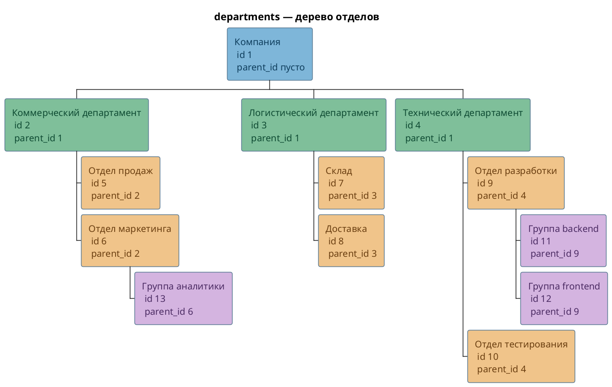
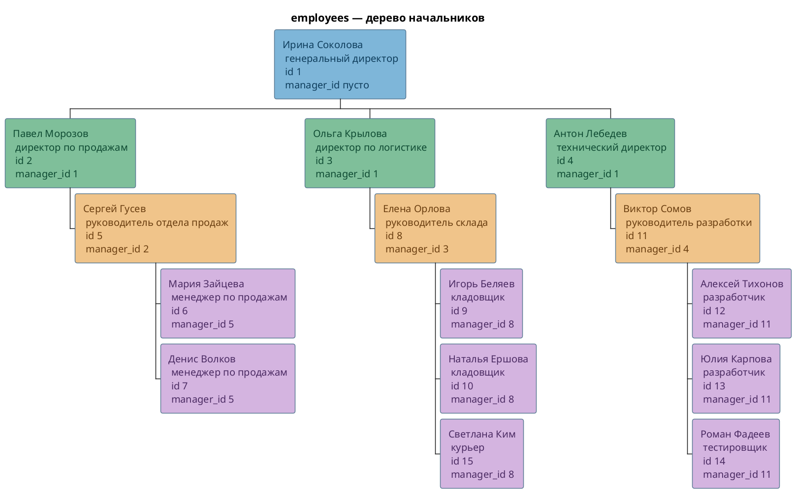
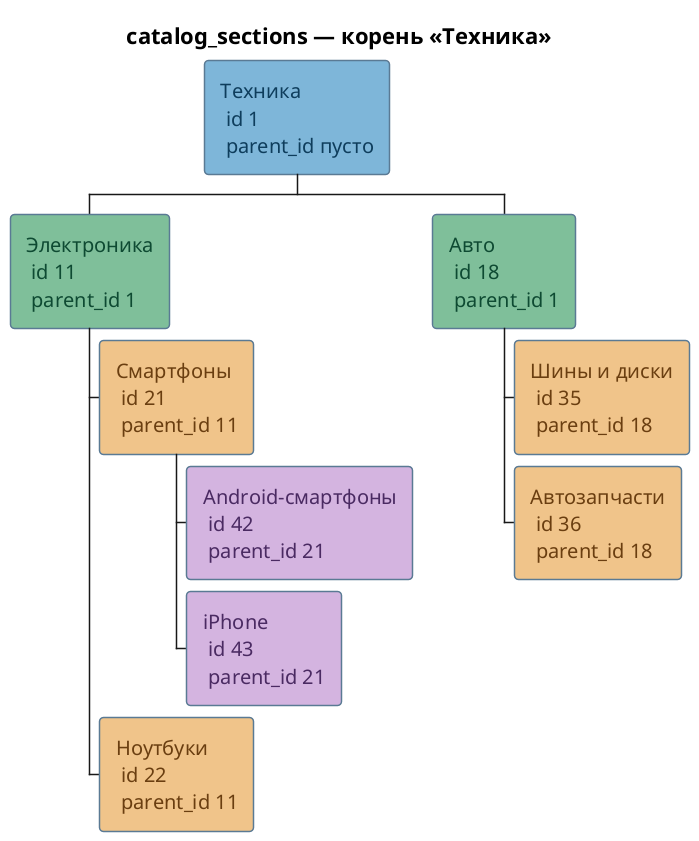
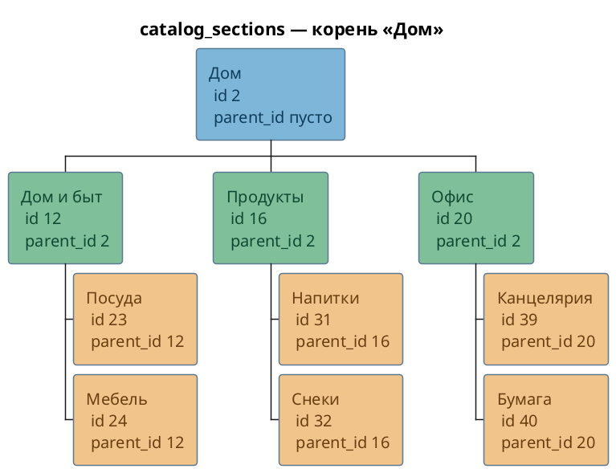
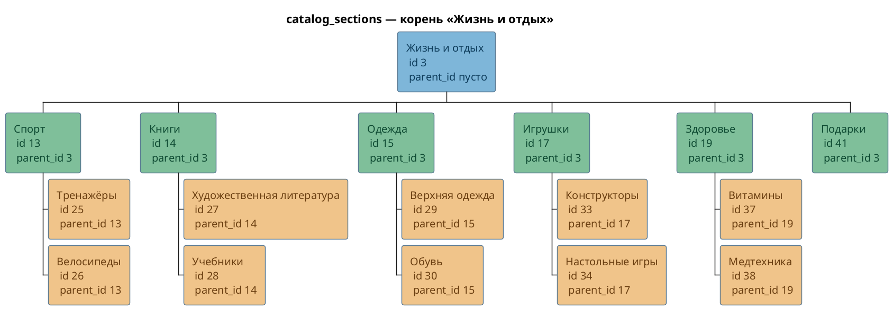
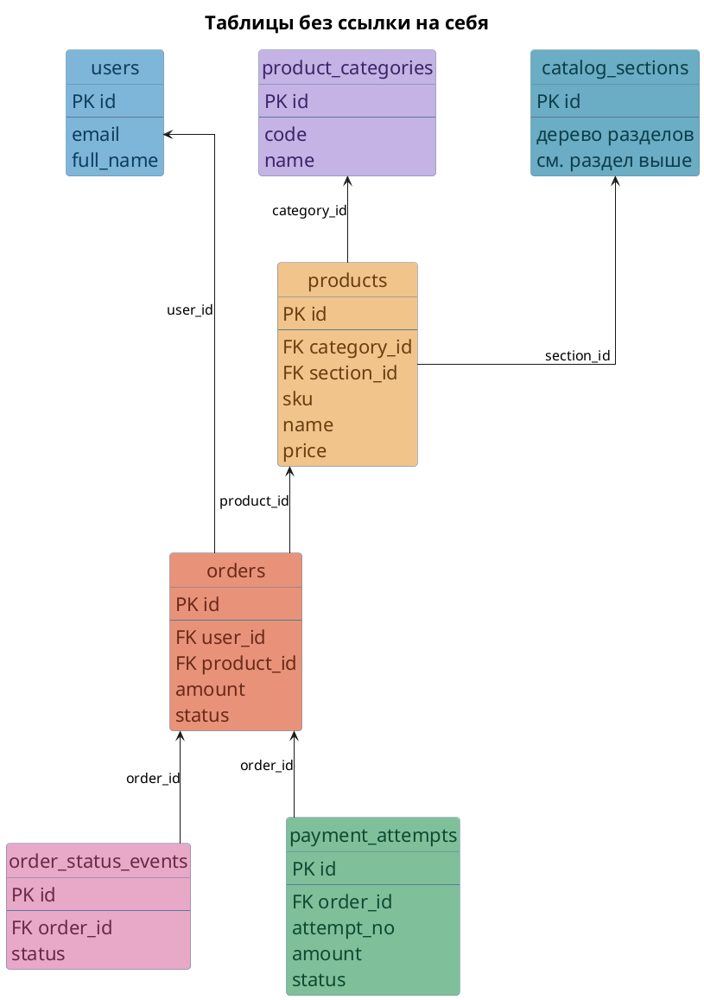

# Схемы таблиц учебной базы

Деревья нарисованы по строкам базы `reactive_study`. Стрелка вниз — от старшей строки к младшей.

Цвет блока в дереве — это уровень вложенности, один и тот же на всех деревьях. Подпись внутри блока того же оттенка, только темнее, чтобы строка не сливалась с заливкой:

- голубой — корень, ссылка на себя пустая
- зелёный — второй уровень
- персиковый — третий уровень
- сиреневый — четвёртый уровень

## departments

`parent_id` ссылается на `id` этой же таблицы. У корня «Компания» `parent_id` пустой.

## employees

`manager_id` ссылается на `id` этой же таблицы. У корня «Ирина Соколова» `manager_id` пустой.

Отдельно от этого дерева: `employees.department_id` ссылается на `departments.id`. Это связь между двумя таблицами, не ссылка сотрудника на самого себя.

## catalog_sections

`parent_id` ссылается на `id` этой же таблицы. Корней три, у каждого `parent_id` пустой. Поэтому ниже три дерева одной таблицы.

### Корень «Техника»

### Корень «Дом»

### Корень «Жизнь и отдых»

## Таблицы без ссылки на себя

У этих таблиц нет столбца, который ссылается на ту же таблицу. Стрелка подписана именем внешнего ключа и идёт к таблице, на которую он ссылается.

Цвет здесь отличает таблицу от таблицы, а не уровень дерева. Подпись внутри блока того же оттенка, только темнее.

`catalog_sections` на этой схеме только как цель `products.section_id`. Её собственное дерево — в разделе выше.

