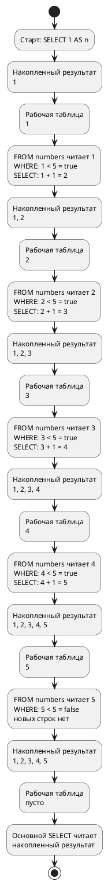

# Тема 08 — CTE: `WITH … AS`

> **Статус:** теория · **Следующий шаг:** изучить материал → написать в чат *«дай интервью по теме 8»*

Тема опирается на темы 03, 04, 06 и 07: `count`, `sum`, `avg`, `GROUP BY`, `JOIN`, подзапрос, `FILTER` / `CASE`. Оконные функции здесь не нужны.

Все примеры — на учебной базе `reactive_study`. Каждый запрос можно запустить у себя и получить ровно те числа, что показаны. Под каждым запросом — разбор по шагам: какой кусок запроса что делает и что получается после него.

Чтобы разбор было видно на конкретных строках, в шагах показаны **первые 10 заказов** базы:

```sql

SELECT id, status, amount
FROM orders
ORDER BY id
LIMIT 10;
```

| id | status | amount |
|---|---|---|
| 1 | shipped | 1132.36 |
| 2 | pending | 1394.86 |
| 3 | processing | 1670.01 |
| 4 | shipped | 1667.31 |
| 5 | processing | 1666.63 |
| 6 | pending | 451.77 |
| 7 | shipped | 1994.61 |
| 8 | processing | 1848.02 |
| 9 | cancelled | 970.06 |
| 10 | delivered | 570.83 |

- `ORDER BY id` ставит заказы по номеру, от меньшего к большему.
- `LIMIT 10` оставляет первые 10 строк. Всего заказов в базе 100007.

---

## Оглавление

- [Как читать статусы](#как-читать-статусы)
- [Слово CTE](#слово-cte)
- [Зачем имя, если есть подзапрос](#зачем-имя-если-есть-подзапрос)
- [Два имени подряд](#два-имени-подряд)
- [Одно число рядом с каждой строкой](#одно-число-рядом-с-каждой-строкой)
- [Имя можно прочитать дважды](#имя-можно-прочитать-дважды)
- [Имя живёт только в этом запросе](#имя-живёт-только-в-этом-запросе)
- [UNION ALL: строки одна под другой](#union-all-строки-одна-под-другой)
- [WITH RECURSIVE: следующий номер](#with-recursive-следующий-номер)
- [Деревья в учебной базе](#деревья-в-учебной-базе)
- [Сводка по отделам без вложенности](#сводка-по-отделам-без-вложенности)
- [Все отделы внутри департамента](#все-отделы-внутри-департамента)
- [Цепочка руководителей](#цепочка-руководителей)
- [Путь от корня до отдела](#путь-от-корня-до-отдела)
- [Фонд оплаты по дереву отдела](#фонд-оплаты-по-дереву-отдела)
- [Выручка по разделу каталога](#выручка-по-разделу-каталога)
- [Типичные ошибки](#типичные-ошибки)
- [Что попробовать самостоятельно](#что-попробовать-самостоятельно)

---

## Как читать статусы

**Заказы**

| В тексте по-русски | В базе | Что происходит с заказом |
|---|---|---|
| ждёт обработки | `pending` | заказ принят, его ещё не начали собирать |
| собирают | `processing` | заказ собирают на складе |
| отправлено | `shipped` | заказ уже уехал к покупателю, но ещё не вручён |
| доставлено | `delivered` | заказ уже у покупателя |
| отменено | `cancelled` | заказ отменили |

«Доставлено» — это только `delivered`. «Отправлено» — только `shipped`.

**Попытки оплаты**

| В тексте по-русски | В базе | Что произошло |
|---|---|---|
| деньги списались | `success` | попытка оплаты прошла |
| списание не удалось | `failed` | попытка оплаты не прошла |

---

## Слово CTE

`WITH имя AS (запрос)` даёт промежуточному запросу **имя**. Дальше основной `SELECT` читает это имя так же, как таблицу. Имя живёт только внутри этого запроса.

Проще всего представить так. Вы сначала выписываете на отдельный листок нужные строки и подписываете листок, например «доставленные». Потом считаете уже по этому листку, а не по всей тетради. `WITH` — это и есть подписанный листок.

**Источник:** https://www.postgresql.org/docs/current/queries-with.html

EN:

> `WITH` provides a way to write auxiliary statements for use in a larger query. These statements, which are often referred to as Common Table Expressions or CTEs, can be thought of as defining temporary tables that exist just for one query.

RU:

> `WITH` даёт способ написать вспомогательные запросы для использования в более крупном запросе. Такие запросы часто называют Common Table Expressions, или CTE. Их можно представлять как временные таблицы, которые существуют только на время одного запроса.

### Пример: сколько доставлено и на какую сумму

Сначала выписываем на листок только доставленные заказы. Потом считаем по листку.

```sql

WITH delivered_orders AS (
    SELECT id, amount
    FROM orders
    WHERE status = 'delivered'
)
SELECT count(*)              AS delivered,
       round(sum(amount), 2) AS delivered_revenue
FROM delivered_orders;
```

**Как читается запрос**

- Шаг 1. `WITH delivered_orders AS ( … )` — объявляем листок с именем `delivered_orders`. Что на нём будет, написано в скобках.
- Шаг 2. Внутри скобок обычный запрос:
  - `FROM orders` — берём все 100007 заказов;
  - `WHERE status = 'delivered'` — проверяем каждый заказ. На первых 10 заказах:
    - заказы 1–9: статусы `shipped`, `pending`, `processing`, `cancelled`. Условие даёт `false`, строки выбывают;
    - заказ 10: статус `delivered`. Условие даёт `true`, строка остаётся;
  - по всей таблице остаются 20076 заказов;
  - `SELECT id, amount` — на листок выписываем только два столбца: номер и сумму. Столбец `status` на листок не попал.
- Шаг 3. На листке `delivered_orders` теперь 20076 строк. Первые три из них:

| id | amount |
|---|---|
| 10 | 570.83 |
| 18 | 1601.41 |
| 19 | 1770.18 |

- Шаг 4. Скобка закрылась — дальше идёт основной `SELECT`. `FROM delivered_orders` — он читает не `orders`, а листок. Заказов 1–9 он не видит вообще.
- Шаг 5. `count(*) AS delivered` — на листке 20076 строк.
- Шаг 6. `round(sum(amount), 2) AS delivered_revenue` — складываем суммы всех 20076 строк листка и округляем до двух знаков.

| delivered | delivered_revenue |
|---|---|
| 20076 | 20121989.26 |

**Нюансы**

- Внутри скобок стоит полноценный `SELECT`. В нём можно писать `WHERE`, `GROUP BY`, `JOIN` — всё, что уже знаете.
- Основной `SELECT` видит только те столбцы, что выписаны на листок. Здесь это `id` и `amount`. Написать в основном запросе `status` уже нельзя: такого столбца на листке нет.
- После закрывающей скобки нет точки с запятой. Точка с запятой ставится один раз — в самом конце, после основного `SELECT`.

---

## Зачем имя, если есть подзапрос

Тот же отчёт можно написать подзапросом в `FROM`. Числа совпадут. `WITH` нужен не ради другого ответа, а ради шагов: сначала назвать кусок, потом читать его сверху вниз.

**Источник:** https://www.postgresql.org/docs/current/queries-with.html

EN:

> The basic value of `SELECT` in `WITH` is to break down complicated queries into simpler parts. […] This example could have been written without `WITH`, but we'd have needed two levels of nested sub-`SELECT`s. It's a bit easier to follow this way.

RU:

> Основная ценность `SELECT` внутри `WITH` — разбить сложный запрос на более простые части. […] Этот пример можно было написать и без `WITH`, но тогда понадобились бы два уровня вложенных подзапросов `SELECT`. Так читать чуть проще.

---

Да, для `CTE` можно задать короткий псевдоним там, где вы используете его в основном запросе — после `FROM`:


```sql
WITH delivered_orders AS (
    SELECT id, amount
    FROM orders o
    WHERE o.status = 'delivered'
)
SELECT count(*),
       round(sum(d.amount), 2)
FROM delivered_orders AS d;

```

- Здесь `delivered_orders` — имя **CTE**, а 
- `d` — его псевдоним в основном запросе. 
- Если в `FROM` только этот источник данных, писать `d.amount` необязательно: 
  - ваш вариант `sum(amount)` тоже корректен. 
- Псевдоним особенно полезен при **JOIN**, когда нужно явно указать, из какого источника взят столбец

Результат на учебной базе. У колонок нет `AS`, поэтому база подписала их именами функций: `count` и `round`.

| count | round |
|---|---|
| 20076 | 20121989.26 |

---
### Тот же отчёт подзапросом

```sql

SELECT count(*)              AS delivered,
       round(sum(amount), 2) AS delivered_revenue
FROM (
    SELECT id, amount
    FROM orders
    WHERE status = 'delivered'
) delivered_orders;
```

**Как читается запрос**

- Шаг 1. Читать приходится изнутри наружу. Сначала база выполняет то, что в скобках после `FROM`: берёт 100007 заказов, оставляет 20076 со статусом `delivered`, выписывает `id` и `amount`.
- Шаг 2. `) delivered_orders` — после скобки стоит имя. Это псевдоним подзапроса. В учебной базе стоит PostgreSQL 16, он принимает подзапрос в `FROM` и без имени. С именем видно, что лежит в скобках.
- Шаг 3. Внешний `SELECT` считает по этим 20076 строкам: `count(*)` и `sum(amount)`.

| delivered | delivered_revenue |
|---|---|
| 20076 | 20121989.26 |

Числа те же, что в разделе про слово CTE.

**Чем отличается от `WITH`**

- В подзапросе сначала пишут, **что считать** (`count`, `sum`), а **откуда** — ниже, в скобках. Читать приходится снизу вверх.
- В `WITH` сначала пишут, **откуда** (листок `delivered_orders`), а потом — **что считать**. Читать можно сверху вниз, как обычный текст.
- Когда шагов три-четыре, подзапросы вкладываются друг в друга, как матрёшка. `WITH` раскладывает те же шаги подряд.

---

## Два имени подряд

Имена перечисляют через запятую. Второе имя может читать первое. Основной `SELECT` читает уже второе.

Это как два листка. На первом — сколько заказов в каждом статусе. На второй переписывают с первого только крупные статусы. Считают по второму.

### Пример: статусы, где заказов больше 20000

```sql

WITH by_status AS (
    SELECT status,
           count(*) AS total
    FROM orders
    GROUP BY status
),
large_statuses AS (
    SELECT status, total
    FROM by_status
    WHERE total > 20000
)
SELECT status, total
FROM large_statuses
ORDER BY status;
```

**Как читается запрос**

- Шаг 1. Первый листок `by_status`. Внутри скобок:
  - `FROM orders` — берём все 100007 заказов;
  - `GROUP BY status` — раскладываем их по кучкам. На первых 10 заказах: заказы 1, 4, 7 идут в кучку `shipped`, заказы 2 и 6 — в `pending`, заказы 3, 5, 8 — в `processing`, заказ 9 — в `cancelled`, заказ 10 — в `delivered`;
  - `SELECT status, count(*) AS total` — на каждую кучку одна строка: статус кучки и сколько в ней заказов.

| status | total |
|---|---|
| cancelled | 20071 |
| delivered | 20076 |
| pending | 19946 |
| processing | 20081 |
| shipped | 19833 |

- Шаг 2. `),` — первый листок закрыт, запятая говорит: дальше будет ещё один листок.
- Шаг 3. Второй листок `large_statuses`. Внутри скобок:
  - `FROM by_status` — второй листок читает **не** `orders`, а первый листок;
  - `WHERE total > 20000` проверяет каждую из пяти строк:
    - `cancelled`: `20071 > 20000` — `true`, строка остаётся;
    - `delivered`: `20076 > 20000` — `true`, строка остаётся;
    - `pending`: `19946 > 20000` — `false`, строка выбывает;
    - `processing`: `20081 > 20000` — `true`, строка остаётся;
    - `shipped`: `19833 > 20000` — `false`, строка выбывает.
- Шаг 4. Основной `SELECT` читает `FROM large_statuses` — второй листок. `ORDER BY status` ставит строки по алфавиту статуса.

| status | total |
|---|---|
| cancelled | 20071 |
| delivered | 20076 |
| processing | 20081 |

**Нюансы**

- Слово `WITH` пишется один раз. Второй листок начинается сразу после запятой — со своего имени.
- Второй листок может читать первый, потому что первый объявлен **выше**. Наоборот нельзя: первый листок не видит того, что объявлено ниже него.
- Здесь `WHERE total > 20000` стоит во втором листке, а не в первом. В первом листке `total` ещё только считается, фильтровать по нему там можно только через `HAVING`. Во втором листке `total` — уже готовый столбец, поэтому работает обычный `WHERE`.

---

## Одно число рядом с каждой строкой

Частая задача: сначала посчитать одно число по всей таблице, а потом сравнить с ним каждую строку. Например, найти заказы дороже средней суммы.

Листок со средним содержит **одну** строку и **один** столбец. Его приклеивают к каждому заказу через `JOIN` и сравнивают.

### Пример: сколько заказов дороже средней суммы

```sql

WITH order_avg AS (
    SELECT avg(amount) AS avg_amount
    FROM orders
)
SELECT count(*) AS above_avg
FROM orders o
JOIN order_avg a ON o.amount > a.avg_amount;
```

**Как читается запрос**

- Шаг 1. Листок `order_avg`. Внутри скобок `avg(amount)` считает среднюю сумму по всем 100007 заказам. На листке одна строка:

| avg_amount |
|---|
| 1007.3767633265671403 |

- Шаг 2. `FROM orders o` — основной запрос берёт все 100007 заказов. `o` — короткое имя таблицы заказов в этом запросе.
- Шаг 3. `JOIN order_avg a` — к заказам приклеиваем листок со средним. `a` — короткое имя листка. На листке одна строка, поэтому к **каждому** заказу приклеивается одно и то же число. На первых 10 заказах:

| o.id | o.amount | a.avg_amount |
|---|---|---|
| 1 | 1132.36 | 1007.3767… |
| 2 | 1394.86 | 1007.3767… |
| 3 | 1670.01 | 1007.3767… |
| 4 | 1667.31 | 1007.3767… |
| 5 | 1666.63 | 1007.3767… |
| 6 | 451.77 | 1007.3767… |
| 7 | 1994.61 | 1007.3767… |
| 8 | 1848.02 | 1007.3767… |
| 9 | 970.06 | 1007.3767… |
| 10 | 570.83 | 1007.3767… |

- Шаг 4. `ON o.amount > a.avg_amount` — условие склейки. Обычно в `JOIN` пишут `=`, но здесь стоит `>`. Склейка остаётся только там, где условие даёт `true`. На первых 10 заказах:
  - заказы 1, 2, 3, 4, 5, 7, 8: сумма больше `1007.3767…` — `true`, строки остаются;
  - заказ 6: `451.77 > 1007.3767…` — `false`, строка выбывает;
  - заказ 9: `970.06 > 1007.3767…` — `false`, строка выбывает;
  - заказ 10: `570.83 > 1007.3767…` — `false`, строка выбывает.
- Шаг 5. `count(*) AS above_avg` — так проверяются все 100007 заказов. Остаётся 49971.

| above_avg |
|---|
| 49971 |

**Нюансы**

- `JOIN` здесь работает, потому что на листке **ровно одна** строка. Если бы строк было две, каждый заказ приклеился бы дважды и счёт удвоился бы.
- Если на листке ноль строк, `INNER JOIN` не найдёт ни одной пары, и результат будет `0`.
- Среднее на листке не округлено. Сравнение идёт с точным числом `1007.3767…`, а не с `1007.38`.
- Тот же ответ можно получить подзапросом из темы 06. `WITH` удобнее, когда среднее нужно ещё и показать в отчёте или использовать в нескольких местах.

То же самое подзапросом из темы 06:

```sql

SELECT count(*) AS above_avg
FROM orders
WHERE amount > (SELECT avg(amount) FROM orders);
```

| above_avg |
|---|
| 49971 |

---

## Имя можно прочитать дважды

Здесь один и тот же листок читают **два раза** в одном запросе. Первый раз — чтобы посчитать среднее. Второй раз — чтобы сравнить с этим средним каждую строку листка. Без `WITH` один и тот же подзапрос пришлось бы написать дважды.

### Пример: статусы, где заказов больше, чем в среднем статусе

```sql

WITH by_status AS (
    SELECT status,
           count(*) AS total
    FROM orders
    GROUP BY status
)
SELECT status, total
FROM by_status
WHERE total > (SELECT avg(total) FROM by_status)
ORDER BY status;
```

**Как читается запрос**

- Шаг 1. Листок `by_status` раскладывает 100007 заказов по статусам и считает каждую кучку:

| status | total |
|---|---|
| cancelled | 20071 |
| delivered | 20076 |
| pending | 19946 |
| processing | 20081 |
| shipped | 19833 |

- Шаг 2. `FROM by_status` — основной запрос читает листок **первый раз**: берёт эти пять строк.
- Шаг 3. `(SELECT avg(total) FROM by_status)` — подзапрос читает тот же листок **второй раз** и считает среднее по столбцу `total`: `(20071 + 20076 + 19946 + 20081 + 19833) / 5 = 100007 / 5 = 20001.40`.
- Шаг 4. `WHERE total > 20001.40` проверяет каждую строку:
  - `cancelled`: `20071 > 20001.40` — `true`;
  - `delivered`: `20076 > 20001.40` — `true`;
  - `pending`: `19946 > 20001.40` — `false`;
  - `processing`: `20081 > 20001.40` — `true`;
  - `shipped`: `19833 > 20001.40` — `false`.

| status | total |
|---|---|
| cancelled | 20071 |
| delivered | 20076 |
| processing | 20081 |

**Нюансы**

- Имя `by_status` встречается в запросе два раза: после основного `FROM` и внутри скобок подзапроса. Оба раза это один и тот же листок.
- Без `WITH` текст `SELECT status, count(*) … GROUP BY status` пришлось бы вставить в оба места. Если потом поменять условие в одном месте и забыть во втором, отчёт станет неверным.

---

## Имя живёт только в этом запросе

После точки с запятой имени `delivered_orders` в базе нет. Это не `CREATE TABLE`. Листок выбрасывают сразу, как только запрос закончился.

Попробуем прочитать листок отдельным запросом:

```sql

SELECT *
FROM delivered_orders;
```

Результат — ошибка:

```text
ERROR:  relation "delivered_orders" does not exist
```

**Как читается ошибка**

- `relation "delivered_orders"` — база ищет таблицу с таким именем.
- `does not exist` — такой таблицы нет. Листок `delivered_orders` существовал только внутри того запроса, где был написан `WITH`.

Правило одно: имя видно только тому `SELECT`, который стоит сразу после `WITH`.

---

## UNION ALL: строки одна под другой

`UNION ALL` стоит между двумя `SELECT`. Он берёт строки первого `SELECT` и **дописывает под ними** строки второго. Получается одна общая таблица.

Без `UNION ALL` рекурсию не понять: в `WITH RECURSIVE` именно он дописывает каждую новую строку к уже полученным.

**Источник:** https://www.postgresql.org/docs/current/queries-union.html

EN:

> `UNION` effectively appends the result of `query2` to the result of `query1` (although there is no guarantee that this is the order in which the rows are actually returned). Furthermore, it eliminates duplicate rows from its result, in the same way as `DISTINCT`, unless `UNION ALL` is used.

RU:

> `UNION` по сути дописывает результат `query2` к результату `query1` (хотя нет гарантии, что строки на самом деле вернутся именно в таком порядке). Кроме того, он убирает из результата повторяющиеся строки так же, как `DISTINCT`, если не используется `UNION ALL`.

EN:

> In order to calculate the union, intersection, or difference of two queries, the two queries must be “union compatible”, which means that they return the same number of columns and the corresponding columns have compatible data types.

RU:

> Чтобы вычислить объединение, пересечение или разность двух запросов, эти два запроса должны быть «совместимы для объединения». Это значит, что они возвращают одинаковое число столбцов, и соответствующие столбцы имеют совместимые типы данных.

### Две строки из двух запросов

Эти запросы не читают таблиц. Они дают одинаковый результат в любой базе, в том числе в учебной.

```sql

SELECT 1 AS n
UNION ALL
SELECT 2;
```

**Как читается запрос**

- Шаг 1. `SELECT 1 AS n` — первый запрос. Он даёт одну строку: `1`. Столбец называется `n`.
- Шаг 2. `SELECT 2` — второй запрос. Он даёт одну строку: `2`.
- Шаг 3. `UNION ALL` — ставит строку второго запроса под строку первого.
- Шаг 4. Имя столбца берётся из **первого** запроса. Поэтому у общей таблицы столбец `n`, хотя во втором запросе `AS n` не написано.

| n |
|---|
| 1 |
| 2 |

### UNION ALL и UNION: что будет с одинаковыми строками

```sql

SELECT 1 AS n
UNION ALL
SELECT 1;
```

| n |
|---|
| 1 |
| 1 |

- `UNION ALL` оставляет **все** строки, даже одинаковые. Обе единицы на месте.

```sql

SELECT 1 AS n
UNION
SELECT 1;
```

| n |
|---|
| 1 |

- `UNION` без `ALL` выбрасывает повторы. Две одинаковые единицы превратились в одну.

### На учебной базе

Два отдельных подсчёта, сложенные в одну таблицу:

```sql

SELECT 'delivered' AS status,
       count(*)    AS total
FROM orders
WHERE status = 'delivered'
UNION ALL
SELECT 'cancelled',
       count(*)
FROM orders
WHERE status = 'cancelled';
```

**Как читается запрос**

- Шаг 1. Первый `SELECT` оставляет доставленные заказы и считает их. Он даёт одну строку: `delivered | 20076`. Слово `'delivered'` в кавычках — не столбец из таблицы, а просто текст, который мы сами кладём в первый столбец.
- Шаг 2. Второй `SELECT` оставляет отменённые заказы и считает их. Он даёт одну строку: `cancelled | 20071`.
- Шаг 3. `UNION ALL` ставит вторую строку под первую.
- Шаг 4. В обоих запросах по два столбца: текст и число. Поэтому их можно склеить.

| status | total |
|---|---|
| delivered | 20076 |
| cancelled | 20071 |

**Нюансы**

- Число столбцов в обоих `SELECT` должно совпадать. Если в первом два столбца, а во втором три, база выдаст ошибку.
- Типы столбцов должны подходить друг к другу: текст под текстом, число под числом.
- Порядок строк без `ORDER BY` не гарантирован. Обычно первая часть идёт первой, но полагаться на это нельзя.

---

## WITH RECURSIVE: следующий номер

Обычный `WITH` не может читать сам себя. `WITH RECURSIVE` может. Запрос внутри скобок у него всегда из двух частей, между ними стоит `UNION ALL`:

- **стартовая часть** — выполняется один раз и даёт первые строки;
- **повторяющаяся часть** — выполняется снова и снова. Каждый раз она читает строки, которые появились на прошлом шаге, и делает из них новые.

**Источник:** https://www.postgresql.org/docs/current/queries-with.html

EN:

> The optional `RECURSIVE` modifier changes `WITH` from a mere syntactic convenience into a feature that accomplishes things not otherwise possible in standard SQL. Using `RECURSIVE`, a `WITH` query can refer to its own output.

RU:

> Необязательное слово `RECURSIVE` превращает `WITH` из удобной записи в средство, которым в обычном SQL иначе не сделать задуманное. С `RECURSIVE` запрос в `WITH` может ссылаться на свой собственный результат.

### Номера от 1 до 5

Этот запрос не читает ни `orders`, ни `payment_attempts`. В учебной базе он даёт ровно ту таблицу, что показана ниже.

```sql

WITH RECURSIVE numbers AS (
    SELECT 1 AS n
    UNION ALL
    SELECT n + 1
    FROM numbers
    WHERE n < 5
)
SELECT n
FROM numbers
ORDER BY n;
```

**Из каких кусков состоит запрос**

- `WITH RECURSIVE numbers AS ( … )` — листок `numbers`, которому разрешено читать самого себя.
- `SELECT 1 AS n` — стартовая часть. Выполняется один раз.
- `UNION ALL` — всё, что даст повторяющаяся часть, дописывается под уже полученными строками.
- `SELECT n + 1 FROM numbers WHERE n < 5` — повторяющаяся часть.
  - `FROM numbers` здесь значит «из **рабочей таблицы**», то есть только из строк прошлого шага. Не из всего результата.
  - `WHERE n < 5` — условие остановки. Когда оно даёт `false`, новых строк нет.
- `SELECT n FROM numbers ORDER BY n` — основной запрос. Он читает **результат** целиком, когда рекурсия закончилась.

### Почему у `numbers` то одна строка, то пять

Имя `numbers` используется в двух местах, но в этих местах база даёт ему разное содержимое:

- внутри повторяющейся части, после `FROM numbers`, имя означает **рабочую таблицу текущего шага**;
- в основном запросе, после закрывающей скобки, имя означает **весь накопленный результат**.

Поэтому во время одного шага `FROM numbers` может читать одну строку, а в конце основной запрос получает пять строк. Это не одна таблица в одном и том же состоянии.

Ниже у каждой таблицы есть своё название:

- **накопленный результат** — строки для будущего ответа; он только растёт;
- **рабочая таблица** — строки, которые повторяющаяся часть читает прямо сейчас; после каждого шага её содержимое заменяется.

### Что происходит от начала до конца

#### Старт

База выполняет стартовую часть:

```sql

SELECT 1 AS n;
```

Запрос вернул:

| n |
|---|
| 1 |

База записывает эту строку сразу в два разных места.

**Накопленный результат:**

| n |
|---|
| 1 |

**Рабочая таблица:**

| n |
|---|
| 1 |

До начала первого повтора обе таблицы выглядят одинаково. Но это всё равно два разных места в памяти.

#### Первый повтор: из `1` получить `2`

Повторяющаяся часть:

```sql

SELECT n + 1
FROM numbers
WHERE n < 5;
```

В этом месте `FROM numbers` читает рабочую таблицу:

| n |
|---|
| 1 |

- `WHERE n < 5` проверяет строку `1`: `1 < 5` даёт `true`.
- `SELECT n + 1` считает `1 + 1` и возвращает новую строку:

| n |
|---|
| 2 |

База дописывает `2` в накопленный результат:

| n |
|---|
| 1 |
| 2 |

Затем база заменяет содержимое рабочей таблицы новой строкой:

| n |
|---|
| 2 |

Число `1` осталось в накопленном результате, но в рабочей таблице его больше нет.

#### Второй повтор: из `2` получить `3`

Тот же `FROM numbers` теперь читает уже другую рабочую таблицу:

| n |
|---|
| 2 |

- `WHERE` проверяет `2 < 5` и получает `true`.
- `SELECT` считает `2 + 1` и возвращает:

| n |
|---|
| 3 |

После этого **накопленный результат** выглядит так:

| n |
|---|
| 1 |
| 2 |
| 3 |

А **рабочая таблица** выглядит так:

| n |
|---|
| 3 |

#### Третий повтор: из `3` получить `4`

`FROM numbers` читает рабочую таблицу:

| n |
|---|
| 3 |

- `WHERE` проверяет `3 < 5` и получает `true`.
- `SELECT` считает `3 + 1` и возвращает:

| n |
|---|
| 4 |

После этого **накопленный результат**:

| n |
|---|
| 1 |
| 2 |
| 3 |
| 4 |

**Рабочая таблица:**

| n |
|---|
| 4 |

#### Четвёртый повтор: из `4` получить `5`

`FROM numbers` читает рабочую таблицу:

| n |
|---|
| 4 |

- `WHERE` проверяет именно старое число: `4 < 5` даёт `true`.
- Только после проверки `SELECT` считает `4 + 1` и возвращает:

| n |
|---|
| 5 |

После этого **накопленный результат**:

| n |
|---|
| 1 |
| 2 |
| 3 |
| 4 |
| 5 |

**Рабочая таблица:**

| n |
|---|
| 5 |

Вот откуда взялось `5`: его создал предыдущий шаг из числа `4`.

#### Пятый повтор: остановка

`FROM numbers` читает рабочую таблицу:

| n |
|---|
| 5 |

`WHERE` проверяет `5 < 5` и получает `false`. Строка не проходит проверку, поэтому `SELECT n + 1` не создаёт новую строку.

Результат повторяющейся части — пустая таблица:

| n |
|---|

Нечего дописывать, поэтому **накопленный результат не изменился**:

| n |
|---|
| 1 |
| 2 |
| 3 |
| 4 |
| 5 |

Новых строк нет, поэтому **рабочая таблица стала пустой**:

| n |
|---|

Пустая рабочая таблица означает, что следующий повтор запускать не с чем. Рекурсия закончилась.

### Конкретная схема именно этого запроса



**Как читать схему**

- Каждый блок `FROM numbers` показывает конкретное содержимое рабочей таблицы в этот момент.
- После него написаны конкретная проверка `WHERE` и конкретное вычисление `SELECT`.
- Следующие два блока показывают обе таблицы после этого действия: сначала весь накопленный результат, затем рабочую таблицу для следующего шага.
- На последнем шаге `WHERE` получает `false`. Накопленный результат сохраняет пять строк, а рабочая таблица становится пустой.
- Основной `SELECT` читает накопленный результат, а не пустую рабочую таблицу.

**Итог основного запроса**

| n |
|---|
| 1 |
| 2 |
| 3 |
| 4 |
| 5 |

**Нюансы**

- Условие `WHERE n < 5` — это тормоз. 
  - Без него рабочая таблица никогда не станет пустой, и запрос будет дописывать строки бесконечно.


- В результате есть `5`, хотя в условии написано `n < 5`. 
  - `WHERE` проверяет старое число, а не новое: на шаге 4 проверяется `4 < 5` — `true`, и только после этого `SELECT` считает `5`. 
  - Число `5` проверяется только на шаге 5, когда само лежит в рабочей таблице: `5 < 5` даёт `false`, нового числа нет. 
  - Но в результат `5` уже записано на шаге 4.

- Повторяющаяся часть никогда не видит весь результат. 
  - Она видит только то, что появилось на прошлом шаге. 
  - В этом примере это одна строка, поэтому `n + 1` не считается сразу для `1, 2, 3, 4`: 
    - каждое число получается ровно один раз. Если бы шаг давал три строки, на следующем шаге `FROM numbers` взял бы все три.

- Рекурсию берут, когда данные устроены как дерево: раздел внутри раздела, начальник над начальником. 
  - Числа `1, 2, 3, 4, 5` — это разминка, чтобы увидеть сами шаги.
  - Таблицы-деревья в учебной базе есть: `departments`, `employees`, `catalog_sections`. Все примеры ниже идут по ним.

---

## Деревья в учебной базе

Дерево в SQL — это таблица, которая ссылается на саму себя. В строке лежит ссылка на родителя: у отдела — на отдел, которому он подчинён, у сотрудника — на его начальника.

В учебной базе три таких таблицы.

### Отделы: `departments`

```sql

SELECT id, parent_id, name
FROM departments
ORDER BY id;
```

| id | parent_id | name |
|---|---|---|
| 1 | | Компания |
| 2 | 1 | Коммерческий департамент |
| 3 | 1 | Логистический департамент |
| 4 | 1 | Технический департамент |
| 5 | 2 | Отдел продаж |
| 6 | 2 | Отдел маркетинга |
| 7 | 3 | Склад |
| 8 | 3 | Доставка |
| 9 | 4 | Отдел разработки |
| 10 | 4 | Отдел тестирования |
| 11 | 9 | Группа backend |
| 12 | 9 | Группа frontend |
| 13 | 6 | Группа аналитики |

**Как читается таблица**

- `parent_id` — номер отдела, которому этот отдел подчинён.
  - Это номер строки из этой же таблицы.
- У строки `1` в `parent_id` пусто (`NULL`).
  - Пусто значит, что над ней никого нет: это корень дерева.
- У строки `9` в `parent_id` стоит `4`.
  - Значит, «Отдел разработки» подчинён «Техническому департаменту».
- У строки `11` в `parent_id` стоит `9`.
  - Значит, «Группа backend» подчинена «Отделу разработки», а тот — «Техническому департаменту».
  - Получается цепочка в три звена под корнем.
- Всего в таблице 13 строк.

### Сотрудники: `employees`

```sql

SELECT id, manager_id, department_id, full_name, position, salary
FROM employees
ORDER BY id;
```

| id | manager_id | department_id | full_name | position | salary |
|---|---|---|---|---|---|
| 1 | | 1 | Ирина Соколова | Генеральный директор | 450000.00 |
| 2 | 1 | 2 | Павел Морозов | Директор по продажам | 300000.00 |
| 3 | 1 | 3 | Ольга Крылова | Директор по логистике | 290000.00 |
| 4 | 1 | 4 | Антон Лебедев | Технический директор | 320000.00 |
| 5 | 2 | 5 | Сергей Гусев | Руководитель отдела продаж | 180000.00 |
| 6 | 5 | 5 | Мария Зайцева | Менеджер по продажам | 120000.00 |
| 7 | 5 | 5 | Денис Волков | Менеджер по продажам | 115000.00 |
| 8 | 3 | 7 | Елена Орлова | Руководитель склада | 160000.00 |
| 9 | 8 | 7 | Игорь Беляев | Кладовщик | 90000.00 |
| 10 | 8 | 7 | Наталья Ершова | Кладовщик | 88000.00 |
| 11 | 4 | 9 | Виктор Сомов | Руководитель разработки | 280000.00 |
| 12 | 11 | 11 | Алексей Тихонов | Разработчик | 230000.00 |
| 13 | 11 | 12 | Юлия Карпова | Разработчик | 220000.00 |
| 14 | 11 | 10 | Роман Фадеев | Тестировщик | 170000.00 |
| 15 | 8 | 8 | Светлана Ким | Курьер | 85000.00 |

**Как читается таблица**

- `manager_id` — номер строки этой же таблицы: кто начальник этого сотрудника.
- У строки `1` в `manager_id` пусто.
  - Над генеральным директором начальника нет.
- У строки `12` в `manager_id` стоит `11`.
  - Значит, начальник Алексея Тихонова — Виктор Сомов.
  - У Виктора Сомова в `manager_id` стоит `4` — Антон Лебедев. Это и есть «начальник над начальником».
- `department_id` — номер отдела из таблицы `departments`, где сотрудник работает.
- `salary` — зарплата в месяц.
- Всего в таблице 15 строк.

### Разделы каталога: `catalog_sections`

```sql

SELECT id, parent_id, name
FROM catalog_sections
WHERE parent_id IS NULL
ORDER BY id;
```

| id | parent_id | name |
|---|---|---|
| 1 | | Техника |
| 2 | | Дом |
| 3 | | Жизнь и отдых |

**Как читается запрос**

- `WHERE parent_id IS NULL` оставляет только корневые разделы: те, что не вложены ни в какой другой раздел.
  - Таких три.
- Всего в таблице 36 строк, глубина дерева — четыре уровня.
- У товара в таблице `products` есть столбец `section_id` — номер раздела, в котором товар лежит.
  - Так дерево разделов связано с заказами: `orders.product_id` → `products.id` → `products.section_id`.

---

## Сводка по отделам без вложенности

Сначала пример **без** рекурсии: обычное `WITH`, но уже на таблицах-деревьях. Нужно по каждому отделу увидеть, сколько в нём сотрудников и какой у него фонд зарплат.

```sql

WITH dept_staff AS (
    SELECT department_id,
           count(*)    AS people,
           sum(salary) AS fund
    FROM employees
    GROUP BY department_id
)
SELECT d.name, s.people, s.fund
FROM departments d
JOIN dept_staff s ON s.department_id = d.id
ORDER BY d.id;
```

**Как читается запрос**

- Шаг 1. Листок `dept_staff`. Внутри скобок `GROUP BY department_id` раскладывает 15 сотрудников по отделам, `count(*)` считает людей в кучке, `sum(salary)` складывает их зарплаты.
  - Например, в отделе `5` три сотрудника: Сергей Гусев 180000, Мария Зайцева 120000, Денис Волков 115000.
  - Значит, в строке отдела `5` будет `people` = 3 и `fund` = 415000.00.
- Шаг 2. `FROM departments d` — основной запрос берёт 13 отделов. `d` — короткое имя таблицы отделов.
- Шаг 3. `JOIN dept_staff s ON s.department_id = d.id` — к отделу подставляется его строка с листка. `s` — короткое имя листка.
  - отдел `5`: на листке есть строка с `department_id` = 5, пара нашлась;
  - отдел `6` («Отдел маркетинга»): сотрудников в нём нет, на листке такой строки нет, пара не нашлась — отдел выпадает из отчёта.
- Шаг 4. `ORDER BY d.id` ставит отделы по номеру.

| name | people | fund |
|---|---|---|
| Компания | 1 | 450000.00 |
| Коммерческий департамент | 1 | 300000.00 |
| Логистический департамент | 1 | 290000.00 |
| Технический департамент | 1 | 320000.00 |
| Отдел продаж | 3 | 415000.00 |
| Склад | 3 | 338000.00 |
| Доставка | 1 | 85000.00 |
| Отдел разработки | 1 | 280000.00 |
| Отдел тестирования | 1 | 170000.00 |
| Группа backend | 1 | 230000.00 |
| Группа frontend | 1 | 220000.00 |

**Нюансы**

- В отчёте 11 строк, а отделов 13.
  - Не попали «Отдел маркетинга» и «Группа аналитики»: в них нет сотрудников, поэтому `JOIN` не нашёл для них пары.
  - Чтобы они были в отчёте с нулём, нужен `LEFT JOIN` и `coalesce`.
- Каждое число здесь — только про сам отдел.
  - В строке «Технический департамент» стоит `1` человек и `320000.00`, хотя внутри него есть «Отдел разработки», «Отдел тестирования» и две группы.
  - Вложенные отделы `GROUP BY` не собирает: он видит только значение `department_id` в строке сотрудника.
- Собрать отдел вместе со всем, что внутри него, умеет `WITH RECURSIVE`. Этим заняты следующие разделы.

---

## Все отделы внутри департамента

Задача: показать «Технический департамент» и всё, что внутри него, на любой глубине. Рядом с каждым отделом — его уровень: сам департамент `1`, его отделы `2`, группы внутри отделов `3`.

```sql

WITH RECURSIVE subtree AS (
    SELECT d.id, d.parent_id, d.name, 1 AS level
    FROM departments d
    WHERE d.id = 4
    UNION ALL
    SELECT child.id, child.parent_id, child.name, subtree.level + 1
    FROM departments child
    JOIN subtree ON child.parent_id = subtree.id
)
SELECT id, parent_id, name, level
FROM subtree
ORDER BY level, id;
```

**Из каких кусков состоит запрос**

- `SELECT … WHERE d.id = 4` — стартовая часть. Находит один отдел, от которого идёт поиск.
- `1 AS level` — номер уровня для стартовой строки.
- `JOIN subtree ON child.parent_id = subtree.id` — повторяющаяся часть.
  - `child` — короткое имя таблицы `departments` в этом месте: так видно, что берутся дети.
  - Условие читается так: «взять отдел, у которого в `parent_id` стоит номер отдела из рабочей таблицы».
- `subtree.level + 1` — каждый следующий уровень на единицу глубже предыдущего.

**Старт**

`WHERE d.id = 4` находит одну строку.

**Накопленный результат:**

| id | parent_id | name | level |
|---|---|---|---|
| 4 | 1 | Технический департамент | 1 |

**Рабочая таблица:**

| id | parent_id | name | level |
|---|---|---|---|
| 4 | 1 | Технический департамент | 1 |

**Первый повтор: дети отдела 4**

`FROM departments child JOIN subtree ON child.parent_id = subtree.id` — в рабочей таблице один номер, `4`. База проверяет строки `departments`:

- «Отдел разработки» (id 9): в `parent_id` стоит `4` — совпало с номером из рабочей таблицы, строка берётся;
- «Отдел тестирования» (id 10): в `parent_id` стоит `4` — совпало, строка берётся;
- «Отдел продаж» (id 5): в `parent_id` стоит `2` — не совпало, строка не берётся;
- «Группа backend» (id 11): в `parent_id` стоит `9` — не совпало, строка не берётся.

`subtree.level + 1` даёт `1 + 1 = 2`. Повторяющаяся часть вернула две строки.

**Накопленный результат:**

| id | parent_id | name | level |
|---|---|---|---|
| 4 | 1 | Технический департамент | 1 |
| 9 | 4 | Отдел разработки | 2 |
| 10 | 4 | Отдел тестирования | 2 |

**Рабочая таблица:**

| id | parent_id | name | level |
|---|---|---|---|
| 9 | 4 | Отдел разработки | 2 |
| 10 | 4 | Отдел тестирования | 2 |

**Второй повтор: дети отделов 9 и 10**

Теперь в рабочей таблице два номера: `9` и `10`. База снова проверяет `departments`:

- «Группа backend» (id 11): в `parent_id` стоит `9` — такой номер в рабочей таблице есть, строка берётся;
- «Группа frontend» (id 12): в `parent_id` стоит `9` — строка берётся;
- строк, у которых в `parent_id` стоит `10`, в таблице нет — у «Отдела тестирования» детей не нашлось.

`subtree.level + 1` даёт `2 + 1 = 3`.

**Накопленный результат:**

| id | parent_id | name | level |
|---|---|---|---|
| 4 | 1 | Технический департамент | 1 |
| 9 | 4 | Отдел разработки | 2 |
| 10 | 4 | Отдел тестирования | 2 |
| 11 | 9 | Группа backend | 3 |
| 12 | 9 | Группа frontend | 3 |

**Рабочая таблица:**

| id | parent_id | name | level |
|---|---|---|---|
| 11 | 9 | Группа backend | 3 |
| 12 | 9 | Группа frontend | 3 |

**Третий повтор: остановка**

В рабочей таблице номера `11` и `12`. Строк, у которых в `parent_id` стоит `11` или `12`, в таблице нет. Повторяющаяся часть вернула пустую таблицу, рабочая таблица стала пустой — рекурсия закончилась. Накопленный результат не изменился.

**Итог основного запроса**

`ORDER BY level, id` ставит строки по уровню, внутри уровня — по номеру.

| id | parent_id | name | level |
|---|---|---|---|
| 4 | 1 | Технический департамент | 1 |
| 9 | 4 | Отдел разработки | 2 |
| 10 | 4 | Отдел тестирования | 2 |
| 11 | 9 | Группа backend | 3 |
| 12 | 9 | Группа frontend | 3 |

**Нюансы**

- Здесь на одном шаге в рабочей таблице оказалось **две** строки, и повторяющаяся часть обработала обе сразу.
  - В примере с числами строка всегда была одна, но это частный случай, а не правило.
- Стартовая строка тоже попадает в результат: «Технический департамент» стоит в отчёте с уровнем `1`.
  - Если нужны только вложенные отделы без самого департамента, в основной запрос добавляют `WHERE level > 1`.
- Остановка здесь происходит сама: у листьев дерева нет детей, поэтому рабочая таблица рано или поздно опустеет.
  - Отдельное условие вроде `n < 5` не нужно.
- Если в данных появится цикл (отдел, который через цепочку подчинён сам себе), запрос зациклится.
  - От этого защищаются ограничением `LIMIT` в основном запросе или проверкой пройденного пути.

---

## Цепочка руководителей

Та же таблица, но идём в другую сторону: от сотрудника наверх, до генерального директора. Это частый вопрос на собеседовании: «покажите всех начальников сотрудника».

```sql

WITH RECURSIVE chain AS (
    SELECT e.id, e.manager_id, e.full_name, e.position, 1 AS step
    FROM employees e
    WHERE e.id = 12
    UNION ALL
    SELECT boss.id, boss.manager_id, boss.full_name, boss.position, chain.step + 1
    FROM employees boss
    JOIN chain ON chain.manager_id = boss.id
)
SELECT step, id, full_name, position
FROM chain
ORDER BY step;
```

**Чем условие отличается от предыдущего примера**

- Вниз по дереву было так: `child.parent_id = subtree.id` — «у кого в ссылке стоит мой номер».
- Вверх по дереву наоборот: `chain.manager_id = boss.id` — «чей номер стоит в моей ссылке».
  - `boss` — короткое имя таблицы `employees` в этом месте: так видно, что берётся начальник.

**Старт**

`WHERE e.id = 12` находит одного сотрудника. Накопленный результат и рабочая таблица состоят из одной строки:

| id | manager_id | full_name | step |
|---|---|---|---|
| 12 | 11 | Алексей Тихонов | 1 |

**Первый повтор**

В рабочей таблице строка, у которой `manager_id` = 11. Условие `chain.manager_id = boss.id` ищет сотрудника с `id` = 11 — это Виктор Сомов. `chain.step + 1` даёт `2`.

**Накопленный результат:**

| id | manager_id | full_name | step |
|---|---|---|---|
| 12 | 11 | Алексей Тихонов | 1 |
| 11 | 4 | Виктор Сомов | 2 |

**Рабочая таблица:**

| id | manager_id | full_name | step |
|---|---|---|---|
| 11 | 4 | Виктор Сомов | 2 |

**Второй повтор**

В рабочей таблице `manager_id` = 4. Сотрудник с `id` = 4 — Антон Лебедев.

**Накопленный результат:**

| id | manager_id | full_name | step |
|---|---|---|---|
| 12 | 11 | Алексей Тихонов | 1 |
| 11 | 4 | Виктор Сомов | 2 |
| 4 | 1 | Антон Лебедев | 3 |

**Рабочая таблица:**

| id | manager_id | full_name | step |
|---|---|---|---|
| 4 | 1 | Антон Лебедев | 3 |

**Третий повтор**

В рабочей таблице `manager_id` = 1. Сотрудник с `id` = 1 — Ирина Соколова.

**Накопленный результат:**

| id | manager_id | full_name | step |
|---|---|---|---|
| 12 | 11 | Алексей Тихонов | 1 |
| 11 | 4 | Виктор Сомов | 2 |
| 4 | 1 | Антон Лебедев | 3 |
| 1 | | Ирина Соколова | 4 |

**Рабочая таблица:**

| id | manager_id | full_name | step |
|---|---|---|---|
| 1 | | Ирина Соколова | 4 |

**Четвёртый повтор: остановка**

В рабочей таблице у Ирины Соколовой `manager_id` пустой (`NULL`). Условие `chain.manager_id = boss.id` сравнивает `NULL` с номерами сотрудников, и ни одно сравнение не даёт `true`. Новых строк нет, рабочая таблица стала пустой — рекурсия закончилась.

**Итог основного запроса**

| step | id | full_name | position |
|---|---|---|---|
| 1 | 12 | Алексей Тихонов | Разработчик |
| 2 | 11 | Виктор Сомов | Руководитель разработки |
| 3 | 4 | Антон Лебедев | Технический директор |
| 4 | 1 | Ирина Соколова | Генеральный директор |

**Нюансы**

- Сам сотрудник попадает в результат со `step` = 1.
  - Если нужны только начальники, в основной запрос добавляют `WHERE step > 1`.
- Остановка здесь происходит из-за `NULL` в `manager_id` у корня дерева.
  - Сравнение с `NULL` не даёт `true` — это правило из темы 02, и именно оно останавливает рекурсию.
- Столбец `step` показывает, насколько начальник далеко: `2` — прямой руководитель, `3` — начальник начальника.

---

## Путь от корня до отдела

Рекурсия умеет не только считать уровень, но и собирать текст. На каждом шаге к пути родителя дописывается имя ребёнка — получается полный путь по дереву.

```sql

WITH RECURSIVE tree AS (
    SELECT d.id, d.parent_id, d.name, 1 AS level, d.name AS path
    FROM departments d
    WHERE d.parent_id IS NULL
    UNION ALL
    SELECT child.id, child.parent_id, child.name, tree.level + 1,
           tree.path || ' / ' || child.name
    FROM departments child
    JOIN tree ON child.parent_id = tree.id
)
SELECT id, level, path
FROM tree
ORDER BY path;
```

**Как читается запрос**

- `WHERE d.parent_id IS NULL` — стартовая часть берёт корни дерева.
  - В `departments` корень один: «Компания».
- `d.name AS path` — у корня путь равен просто его имени.
- `tree.path || ' / ' || child.name` — две вертикальные черты `||` склеивают текст.
  - К пути родителя добавляется разделитель ` / ` и имя ребёнка.
- `JOIN tree ON child.parent_id = tree.id` — как в примере с департаментом: спуск на уровень ниже.

**Что происходит по шагам**

- Старт. Одна строка: `id` 1, `level` 1, `path` «Компания».
  - И накопленный результат, и рабочая таблица состоят из этой строки.
- Первый повтор. В рабочей таблице номер `1`. Дети: отделы 2, 3, 4.
  - Для отдела 2 путь получается «Компания» + ` / ` + «Коммерческий департамент».
  - В накопленном результате становится 4 строки, в рабочей таблице — 3 строки уровня 2.
- Второй повтор. В рабочей таблице номера 2, 3, 4. Дети: 5 и 6 у отдела 2, 7 и 8 у отдела 3, 9 и 10 у отдела 4.
  - Для отдела 6 путь: «Компания / Коммерческий департамент / Отдел маркетинга».
  - В накопленном результате 10 строк, в рабочей таблице — 6 строк уровня 3.
- Третий повтор. В рабочей таблице номера 5, 6, 7, 8, 9, 10. Дети нашлись только у отдела 9 (группы 11 и 12) и у отдела 6 (группа 13).
  - В накопленном результате 13 строк, в рабочей таблице — 3 строки уровня 4.
- Четвёртый повтор. У групп 11, 12, 13 детей нет. Повторяющаяся часть вернула пустую таблицу, рекурсия закончилась.

**Итог основного запроса**

`ORDER BY path` сортирует по тексту пути, поэтому дети идут сразу под своим родителем.

| id | level | path |
|---|---|---|
| 1 | 1 | Компания |
| 2 | 2 | Компания / Коммерческий департамент |
| 6 | 3 | Компания / Коммерческий департамент / Отдел маркетинга |
| 13 | 4 | Компания / Коммерческий департамент / Отдел маркетинга / Группа аналитики |
| 5 | 3 | Компания / Коммерческий департамент / Отдел продаж |
| 3 | 2 | Компания / Логистический департамент |
| 8 | 3 | Компания / Логистический департамент / Доставка |
| 7 | 3 | Компания / Логистический департамент / Склад |
| 4 | 2 | Компания / Технический департамент |
| 9 | 3 | Компания / Технический департамент / Отдел разработки |
| 11 | 4 | Компания / Технический департамент / Отдел разработки / Группа backend |
| 12 | 4 | Компания / Технический департамент / Отдел разработки / Группа frontend |
| 10 | 3 | Компания / Технический департамент / Отдел тестирования |

**Нюансы**

- В результате 13 строк — все отделы базы.
  - Так получилось потому, что стартовая часть взяла корень дерева, а рекурсия спустилась до самых глубоких групп.
- Тип столбца `path` задаёт стартовая часть. Здесь это `text`, потому что `d.name` — текст.
- Если в `name` окажется `NULL`, склейка через `||` даст `NULL` на всю строку пути.
  - Защищаются через `coalesce(name, '')`.
- `ORDER BY path` даёт порядок дерева, `ORDER BY level, id` — порядок по уровням.
  - Это сортировка в основном запросе, на саму рекурсию она не влияет.

---

## Фонд оплаты по дереву отдела

Вопрос руководителя: сколько людей и сколько денег в «Техническом департаменте» вместе со всеми вложенными отделами и группами. Рекурсия собирает номера отделов, а `JOIN` прибавляет к ним сотрудников.

```sql

WITH RECURSIVE subtree AS (
    SELECT d.id
    FROM departments d
    WHERE d.id = 4
    UNION ALL
    SELECT child.id
    FROM departments child
    JOIN subtree ON child.parent_id = subtree.id
)
SELECT count(e.id)   AS people,
       sum(e.salary) AS fund
FROM subtree s
JOIN employees e ON e.department_id = s.id;
```

**Как читается запрос**

- Шаг 1. Листок `subtree` — та же рекурсия, что в разделе «Все отделы внутри департамента», только из столбцов остался один `id`.
  - Имена и уровни здесь не нужны: нужны только номера отделов.

| id |
|---|
| 4 |
| 9 |
| 10 |
| 11 |
| 12 |

- Шаг 2. `FROM subtree s` — основной запрос берёт эти пять номеров. `s` — короткое имя листка.
- Шаг 3. `JOIN employees e ON e.department_id = s.id` — к номеру отдела подставляются сотрудники этого отдела. `e` — короткое имя таблицы сотрудников. Проверка идёт по каждому сотруднику:
  - Антон Лебедев, `department_id` = 4 — такой номер в листке есть, строка берётся;
  - Виктор Сомов, `department_id` = 9 — берётся;
  - Алексей Тихонов, `department_id` = 11 — берётся;
  - Юлия Карпова, `department_id` = 12 — берётся;
  - Роман Фадеев, `department_id` = 10 — берётся;
  - Сергей Гусев, `department_id` = 5 — такого номера в листке нет, строка не берётся.

| id | full_name | department_id | salary |
|---|---|---|---|
| 4 | Антон Лебедев | 4 | 320000.00 |
| 11 | Виктор Сомов | 9 | 280000.00 |
| 12 | Алексей Тихонов | 11 | 230000.00 |
| 13 | Юлия Карпова | 12 | 220000.00 |
| 14 | Роман Фадеев | 10 | 170000.00 |

- Шаг 4. `count(e.id)` считает эти строки, `sum(e.salary)` складывает зарплаты: `320000 + 280000 + 230000 + 220000 + 170000`.

| people | fund |
|---|---|
| 5 | 1220000.00 |

**Нюансы**

- Без рекурсии тот же вопрос дал бы `1` человека и `320000.00`: в самом «Техническом департаменте» работает только Антон Лебедев.
  - Именно рекурсия добавила отделы и группы внутри него.
- `JOIN` здесь не удваивает строки: у сотрудника один `department_id`, а в листке каждый номер отдела встречается один раз.
- Если бы в поддереве не было ни одного сотрудника, `INNER JOIN` не дал бы ни одной пары: `count` вернул бы `0`, а `sum` — `NULL`, не ноль.
  - Для отчёта с нулём пишут `coalesce(sum(e.salary), 0)`.

---

## Выручка по разделу каталога

То же самое, но по каталогу товаров: сколько заказов и денег принёс раздел «Электроника» вместе со всеми вложенными разделами.

```sql

WITH RECURSIVE subtree AS (
    SELECT s.id
    FROM catalog_sections s
    WHERE s.id = 11
    UNION ALL
    SELECT child.id
    FROM catalog_sections child
    JOIN subtree ON child.parent_id = subtree.id
)
SELECT count(o.id)             AS orders,
       round(sum(o.amount), 2) AS revenue
FROM subtree sub
JOIN products p ON p.section_id = sub.id
JOIN orders o ON o.product_id = p.id;
```

**Как читается запрос**

- Шаг 1. Листок `subtree` собирает номера разделов.
  - Старт — раздел 11 «Электроника».
  - Первый повтор добавляет «Смартфоны» и «Ноутбуки», второй — «Android-смартфоны» и «iPhone» внутри «Смартфонов».

| id | name | level |
|---|---|---|
| 11 | Электроника | 1 |
| 21 | Смартфоны | 2 |
| 22 | Ноутбуки | 2 |
| 42 | Android-смартфоны | 3 |
| 43 | iPhone | 3 |

- Шаг 2. `JOIN products p ON p.section_id = sub.id` — к номерам разделов подставляются товары. `sub` — короткое имя листка, `p` — таблицы товаров.
  - Товары лежат не во всех разделах поддерева:

| section_id | name | products | orders | revenue |
|---|---|---|---|---|
| 11 | Электроника | 0 | 0 | 0.00 |
| 21 | Смартфоны | 0 | 0 | 0.00 |
| 22 | Ноутбуки | 7 | 3017 | 3034990.15 |
| 42 | Android-смартфоны | 7 | 3583 | 3556133.82 |
| 43 | iPhone | 7 | 3440 | 3456464.09 |

- Шаг 3. `JOIN orders o ON o.product_id = p.id` — к товару подставляются заказы на этот товар.
  - Один товар заказывали много раз, поэтому строк становится много.
- Шаг 4. `count(o.id)` считает заказы, `round(sum(o.amount), 2)` складывает суммы и округляет до копеек: `3017 + 3583 + 3440 = 10040` заказов.

| orders | revenue |
|---|---|
| 10040 | 10047588.06 |

**Нюансы**

- Без рекурсии запрос с условием `section_id = 11` дал бы `0` заказов: прямо в разделе «Электроника» товаров нет, они разложены по вложенным разделам.
- Товары поддерева лежат на разных уровнях: «Ноутбуки» — второй уровень, «Android-смартфоны» и «iPhone» — третий.
  - Рекурсии это не мешает: она собирает все номера разделов, а `JOIN` не смотрит на глубину.
- Разделы без товаров (`11` и `21`) в итог ничего не добавляют: `INNER JOIN` не находит для них пары.

---

## Типичные ошибки

Все запросы ниже запущены на учебной базе. Под каждым — точный ответ базы.

### 1. Забыть основной `SELECT` после `WITH`

```sql

WITH delivered_orders AS (
    SELECT id, amount
    FROM orders
    WHERE status = 'delivered'
);
```

```text
ERROR:  syntax error at or near ";"
```

- Листок объявили, а читать его некому. После закрывающей скобки база ждёт основной `SELECT`, а видит точку с запятой.

### 2. Прочитать листок вторым запросом

```sql

SELECT *
FROM delivered_orders;
```

```text
ERROR:  relation "delivered_orders" does not exist
```

- Листок жил только в предыдущем запросе. После его точки с запятой имени уже нет.

### 3. Сослаться на себя без `RECURSIVE`

```sql

WITH numbers AS (
    SELECT 1 AS n
    UNION ALL
    SELECT n + 1
    FROM numbers
    WHERE n < 5
)
SELECT n
FROM numbers;
```

```text
ERROR:  relation "numbers" does not exist
DETAIL:  There is a WITH item named "numbers", but it cannot be referenced from this part of the query.
HINT:  Use WITH RECURSIVE, or re-order the WITH items to remove forward references.
```

- Обычный `WITH` не умеет читать сам себя. База сама подсказывает: нужно `WITH RECURSIVE`.

### 4. Порог, после которого на листке не осталось строк

Второй листок с условием `total > 20100`:

```sql

WITH by_status AS (
    SELECT status,
           count(*) AS total
    FROM orders
    GROUP BY status
),
large_statuses AS (
    SELECT status, total
    FROM by_status
    WHERE total > 20100
)
SELECT status, total
FROM large_statuses;
```

| status | total |
|---|---|

- Ошибки нет, но и строк нет. Самая большая кучка — `processing` с `20081` заказом, а `20081 > 20100` даёт `false`. У остальных статусов заказов ещё меньше. Второй листок пустой, основному `SELECT` нечего показать.

---

## Что попробовать самостоятельно

Откройте свой SQL-клиент и выполните `SET search_path TO reactive_study`. Дальше три отдельных запроса. В каждом запросе промежуточный шаг назовите через `WITH`.

**1.** Напишите запрос к таблице заказов `orders`.

- Сначала соберите в именованный шаг только заказы со статусом `processing`.
  - `processing` значит, что заказ сейчас собирают на складе.
- Затем из этого шага получите одну строку из двух полей.
  - Первое поле — сколько заказов со статусом `processing`.
  - Второе поле — сумма столбца `amount` только у заказов со статусом `processing`.

Ниже числа для сверки первого запроса.

| processing | processing_sum |
|---|---|
| 20081 | 20326718.59 |

**2.** Напишите запрос к таблице заказов `orders`.

- Первый именованный шаг считает, сколько заказов имеет каждый статус.
- Второй именованный шаг читает первый и оставляет только статусы, в которых заказов больше **20000**.
- Основной `SELECT` читает второй шаг.
- Поля результата:
  - статус заказа;
  - сколько заказов имеют этот статус.

Ниже числа для сверки второго запроса. Порядок строк не важен.

| status | total |
|---|---|
| cancelled | 20071 |
| delivered | 20076 |
| processing | 20081 |

**3.** Напишите запрос к таблице `payment_attempts`.

- Каждая строка этой таблицы — одна попытка списать деньги по заказу, поэтому число попыток — это число строк.
- Столбец `id` — уникальный номер этой строки.
- В столбце `status` записано, чем закончилась попытка.
  - `success` значит, что деньги списались.
  - `failed` значит, что списание не удалось.
- Сначала соберите в именованный шаг только попытки со статусом `success`.
- Затем из этого шага получите одну строку из двух полей.
  - Первое поле — сколько попыток оплаты имеют статус `success`.
  - Второе поле — сумма столбца `amount` у попыток оплаты со статусом `success`.

Ниже числа для сверки третьего запроса.

| success_cnt | success_sum |
|---|---|
| 95884 | 96612590.20 |
