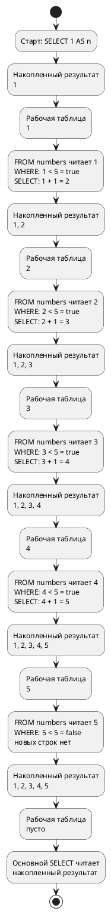
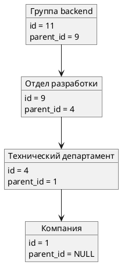
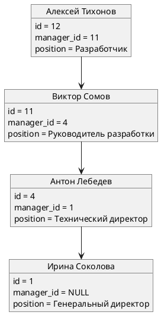
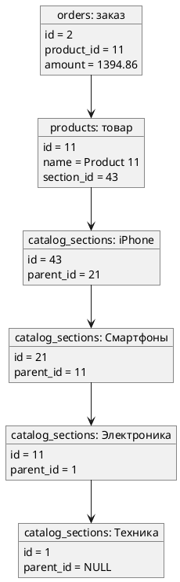
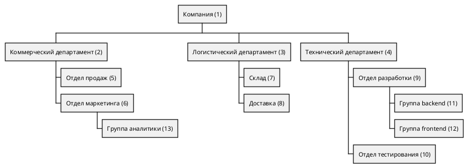
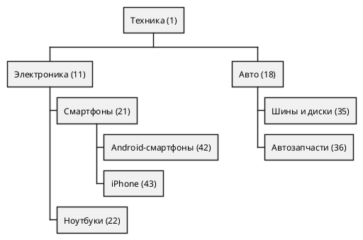

# Тема 08 — CTE: `WITH … AS`

> **Статус:** теория · **Следующий шаг:** изучить материал → написать в чат *«дай интервью по теме 8»*

Тема опирается на темы 03, 04, 06 и 07: `count`, `sum`, `avg`, `GROUP BY`, `JOIN`, подзапрос, `FILTER` / `CASE`. Оконные функции здесь не нужны.

Все примеры — на учебной базе `reactive_study`. Каждый запрос можно запустить у себя и получить ровно те числа, что показаны. Под каждым запросом — разбор по шагам: какой кусок запроса что делает и что получается после него.

Чтобы разбор было видно на конкретных строках, в шагах показаны **первые 10 заказов** базы:

```sql

SELECT id, status, amount
FROM orders
ORDER BY id
LIMIT 10;
```

| id | status | amount |
|---|---|---|
| 1 | shipped | 1132.36 |
| 2 | pending | 1394.86 |
| 3 | processing | 1670.01 |
| 4 | shipped | 1667.31 |
| 5 | processing | 1666.63 |
| 6 | pending | 451.77 |
| 7 | shipped | 1994.61 |
| 8 | processing | 1848.02 |
| 9 | cancelled | 970.06 |
| 10 | delivered | 570.83 |

- `ORDER BY id` ставит заказы по номеру, от меньшего к большему.
- `LIMIT 10` оставляет первые 10 строк. Всего заказов в базе 100007.

---

## Оглавление

- [Как читать статусы](#как-читать-статусы)
- [Слово CTE](#слово-cte)
- [Зачем имя, если есть подзапрос](#зачем-имя-если-есть-подзапрос)
- [Два имени подряд](#два-имени-подряд)
- [Одно число рядом с каждой строкой](#одно-число-рядом-с-каждой-строкой)
- [Имя можно прочитать дважды](#имя-можно-прочитать-дважды)
- [Имя живёт только в этом запросе](#имя-живёт-только-в-этом-запросе)
- [UNION ALL: строки одна под другой](#union-all-строки-одна-под-другой)
- [WITH RECURSIVE: следующий номер](#with-recursive-следующий-номер)
- [Деревья в учебной базе](#деревья-в-учебной-базе)
  - [Как это называется и почему так делают](#как-это-называется-и-почему-так-делают)
  - [Что с чем связано](#что-с-чем-связано)
  - [Как один отдел ссылается на другой](#как-один-отдел-ссылается-на-другой)
  - [Как сотрудник ссылается на начальника](#как-сотрудник-ссылается-на-начальника)
  - [Как деньги заказа попадают в дерево каталога](#как-деньги-заказа-попадают-в-дерево-каталога)
- [Сводка по отделам без вложенности](#сводка-по-отделам-без-вложенности)
- [Все отделы внутри департамента](#все-отделы-внутри-департамента)
- [Дерево компании: path, отступы и порядок строк](08-cte-tree-report.md) — отдельный разбор запроса с `array[path]` и `ORDER BY path`
- [Дерево компании: `SEARCH DEPTH FIRST`](08-cte-tree-search.md) — встроенный порядок обхода и столбец `ord`
- [Цепочка руководителей](#цепочка-руководителей)
- [Условие JOIN: вниз или вверх](08-cte-join-direction.md) — где в `ON` стоят `parent_id` и `manager_id`
- [Кто в последней колонке: руководитель или подчинённый](08-cte-boss-or-child.md) — слева `child` или слева `boss`
- [Путь от корня до отдела](#путь-от-корня-до-отдела)
- [Фонд оплаты по дереву отдела](#фонд-оплаты-по-дереву-отдела)
- [Выручка по разделу каталога](#выручка-по-разделу-каталога)
- [self-JOIN: те же деревья без рекурсии](#self-join-те-же-деревья-без-рекурсии)
  - [Новый уровень, которого запрос не видит](#новый-уровень-которого-запрос-не-видит)
- [Типичные ошибки](#типичные-ошибки)
- [Что попробовать самостоятельно](#что-попробовать-самостоятельно)

---

## Как читать статусы

**Заказы**

| В тексте по-русски | В базе | Что происходит с заказом |
|---|---|---|
| ждёт обработки | `pending` | заказ принят, его ещё не начали собирать |
| собирают | `processing` | заказ собирают на складе |
| отправлено | `shipped` | заказ уже уехал к покупателю, но ещё не вручён |
| доставлено | `delivered` | заказ уже у покупателя |
| отменено | `cancelled` | заказ отменили |

«Доставлено» — это только `delivered`. «Отправлено» — только `shipped`.

**Попытки оплаты**

| В тексте по-русски | В базе | Что произошло |
|---|---|---|
| деньги списались | `success` | попытка оплаты прошла |
| списание не удалось | `failed` | попытка оплаты не прошла |

---

## Слово CTE

`WITH имя AS (запрос)` даёт промежуточному запросу **имя**. Дальше основной `SELECT` читает это имя так же, как таблицу. Имя живёт только внутри этого запроса.

Проще всего представить так. Вы сначала выписываете на отдельный листок нужные строки и подписываете листок, например «доставленные». Потом считаете уже по этому листку, а не по всей тетради. `WITH` — это и есть подписанный листок.

**Источник:** https://www.postgresql.org/docs/current/queries-with.html

EN:

> `WITH` provides a way to write auxiliary statements for use in a larger query. These statements, which are often referred to as Common Table Expressions or CTEs, can be thought of as defining temporary tables that exist just for one query.

RU:

> `WITH` даёт способ написать вспомогательные запросы для использования в более крупном запросе. Такие запросы часто называют Common Table Expressions, или CTE. Их можно представлять как временные таблицы, которые существуют только на время одного запроса.

### Пример: сколько доставлено и на какую сумму

Сначала выписываем на листок только доставленные заказы. Потом считаем по листку.

```sql

WITH delivered_orders AS (
    SELECT id, amount
    FROM orders
    WHERE status = 'delivered'
)
SELECT count(*)              AS delivered,
       round(sum(amount), 2) AS delivered_revenue
FROM delivered_orders;
```

**Как читается запрос**

- Шаг 1. `WITH delivered_orders AS ( … )` — объявляем листок с именем `delivered_orders`. Что на нём будет, написано в скобках.
- Шаг 2. Внутри скобок обычный запрос:
  - `FROM orders` — берём все 100007 заказов;
  - `WHERE status = 'delivered'` — проверяем каждый заказ. На первых 10 заказах:
    - заказы 1–9: статусы `shipped`, `pending`, `processing`, `cancelled`. Условие даёт `false`, строки выбывают;
    - заказ 10: статус `delivered`. Условие даёт `true`, строка остаётся;
  - по всей таблице остаются 20076 заказов;
  - `SELECT id, amount` — на листок выписываем только два столбца: номер и сумму. Столбец `status` на листок не попал.
- Шаг 3. На листке `delivered_orders` теперь 20076 строк. Первые три из них:

| id | amount |
|---|---|
| 10 | 570.83 |
| 18 | 1601.41 |
| 19 | 1770.18 |

- Шаг 4. Скобка закрылась — дальше идёт основной `SELECT`. `FROM delivered_orders` — он читает не `orders`, а листок. Заказов 1–9 он не видит вообще.
- Шаг 5. `count(*) AS delivered` — на листке 20076 строк.
- Шаг 6. `round(sum(amount), 2) AS delivered_revenue` — складываем суммы всех 20076 строк листка и округляем до двух знаков.

| delivered | delivered_revenue |
|---|---|
| 20076 | 20121989.26 |

**Нюансы**

- Внутри скобок стоит полноценный `SELECT`. В нём можно писать `WHERE`, `GROUP BY`, `JOIN` — всё, что уже знаете.
- Основной `SELECT` видит только те столбцы, что выписаны на листок. Здесь это `id` и `amount`. Написать в основном запросе `status` уже нельзя: такого столбца на листке нет.
- После закрывающей скобки нет точки с запятой. Точка с запятой ставится один раз — в самом конце, после основного `SELECT`.

---

## Зачем имя, если есть подзапрос

Тот же отчёт можно написать подзапросом в `FROM`. Числа совпадут. `WITH` нужен не ради другого ответа, а ради шагов: сначала назвать кусок, потом читать его сверху вниз.

**Источник:** https://www.postgresql.org/docs/current/queries-with.html

EN:

> The basic value of `SELECT` in `WITH` is to break down complicated queries into simpler parts. […] This example could have been written without `WITH`, but we'd have needed two levels of nested sub-`SELECT`s. It's a bit easier to follow this way.

RU:

> Основная ценность `SELECT` внутри `WITH` — разбить сложный запрос на более простые части. […] Этот пример можно было написать и без `WITH`, но тогда понадобились бы два уровня вложенных подзапросов `SELECT`. Так читать чуть проще.

---

Да, для `CTE` можно задать короткий псевдоним там, где вы используете его в основном запросе — после `FROM`:


```sql
WITH delivered_orders AS (
    SELECT id, amount
    FROM orders o
    WHERE o.status = 'delivered'
)
SELECT count(*),
       round(sum(d.amount), 2)
FROM delivered_orders AS d;

```

- Здесь `delivered_orders` — имя **CTE**, а 
- `d` — его псевдоним в основном запросе. 
- Если в `FROM` только этот источник данных, писать `d.amount` необязательно: 
  - ваш вариант `sum(amount)` тоже корректен. 
- Псевдоним особенно полезен при **JOIN**, когда нужно явно указать, из какого источника взят столбец

Результат на учебной базе. У колонок нет `AS`, поэтому база подписала их именами функций: `count` и `round`.

| count | round |
|---|---|
| 20076 | 20121989.26 |

---
### Тот же отчёт подзапросом

```sql

SELECT count(*)              AS delivered,
       round(sum(amount), 2) AS delivered_revenue
FROM (
    SELECT id, amount
    FROM orders
    WHERE status = 'delivered'
) delivered_orders;
```

**Как читается запрос**

- Шаг 1. Читать приходится изнутри наружу. Сначала база выполняет то, что в скобках после `FROM`: берёт 100007 заказов, оставляет 20076 со статусом `delivered`, выписывает `id` и `amount`.
- Шаг 2. `) delivered_orders` — после скобки стоит имя. Это псевдоним подзапроса. В учебной базе стоит PostgreSQL 16, он принимает подзапрос в `FROM` и без имени. С именем видно, что лежит в скобках.
- Шаг 3. Внешний `SELECT` считает по этим 20076 строкам: `count(*)` и `sum(amount)`.

| delivered | delivered_revenue |
|---|---|
| 20076 | 20121989.26 |

Числа те же, что в разделе про слово CTE.

**Чем отличается от `WITH`**

- В подзапросе сначала пишут, **что считать** (`count`, `sum`), а **откуда** — ниже, в скобках. Читать приходится снизу вверх.
- В `WITH` сначала пишут, **откуда** (листок `delivered_orders`), а потом — **что считать**. Читать можно сверху вниз, как обычный текст.
- Когда шагов три-четыре, подзапросы вкладываются друг в друга, как матрёшка. `WITH` раскладывает те же шаги подряд.

---

## Два имени подряд

Имена перечисляют через запятую. Второе имя может читать первое. Основной `SELECT` читает уже второе.

Это как два листка. На первом — сколько заказов в каждом статусе. На второй переписывают с первого только крупные статусы. Считают по второму.

### Пример: статусы, где заказов больше 20000

```sql

WITH by_status AS (
    SELECT status,
           count(*) AS total
    FROM orders
    GROUP BY status
),
large_statuses AS (
    SELECT status, total
    FROM by_status
    WHERE total > 20000
)
SELECT status, total
FROM large_statuses
ORDER BY status;
```

**Как читается запрос**

- Шаг 1. Первый листок `by_status`. Внутри скобок:
  - `FROM orders` — берём все 100007 заказов;
  - `GROUP BY status` — раскладываем их по кучкам. На первых 10 заказах: заказы 1, 4, 7 идут в кучку `shipped`, заказы 2 и 6 — в `pending`, заказы 3, 5, 8 — в `processing`, заказ 9 — в `cancelled`, заказ 10 — в `delivered`;
  - `SELECT status, count(*) AS total` — на каждую кучку одна строка: статус кучки и сколько в ней заказов.

| status | total |
|---|---|
| cancelled | 20071 |
| delivered | 20076 |
| pending | 19946 |
| processing | 20081 |
| shipped | 19833 |

- Шаг 2. `),` — первый листок закрыт, запятая говорит: дальше будет ещё один листок.
- Шаг 3. Второй листок `large_statuses`. Внутри скобок:
  - `FROM by_status` — второй листок читает **не** `orders`, а первый листок;
  - `WHERE total > 20000` проверяет каждую из пяти строк:
    - `cancelled`: `20071 > 20000` — `true`, строка остаётся;
    - `delivered`: `20076 > 20000` — `true`, строка остаётся;
    - `pending`: `19946 > 20000` — `false`, строка выбывает;
    - `processing`: `20081 > 20000` — `true`, строка остаётся;
    - `shipped`: `19833 > 20000` — `false`, строка выбывает.
- Шаг 4. Основной `SELECT` читает `FROM large_statuses` — второй листок. `ORDER BY status` ставит строки по алфавиту статуса.

| status | total |
|---|---|
| cancelled | 20071 |
| delivered | 20076 |
| processing | 20081 |

**Нюансы**

- Слово `WITH` пишется один раз. Второй листок начинается сразу после запятой — со своего имени.
- Второй листок может читать первый, потому что первый объявлен **выше**. Наоборот нельзя: первый листок не видит того, что объявлено ниже него.
- Здесь `WHERE total > 20000` стоит во втором листке, а не в первом. В первом листке `total` ещё только считается, фильтровать по нему там можно только через `HAVING`. Во втором листке `total` — уже готовый столбец, поэтому работает обычный `WHERE`.

---

## Одно число рядом с каждой строкой

Частая задача: сначала посчитать одно число по всей таблице, а потом сравнить с ним каждую строку. Например, найти заказы дороже средней суммы.

Листок со средним содержит **одну** строку и **один** столбец. Его приклеивают к каждому заказу через `JOIN` и сравнивают.

### Пример: сколько заказов дороже средней суммы

```sql

WITH order_avg AS (
    SELECT avg(amount) AS avg_amount
    FROM orders
)
SELECT count(*) AS above_avg
FROM orders o
JOIN order_avg a ON o.amount > a.avg_amount;
```

**Как читается запрос**

- Шаг 1. Листок `order_avg`. Внутри скобок `avg(amount)` считает среднюю сумму по всем 100007 заказам. На листке одна строка:

| avg_amount |
|---|
| 1007.3767633265671403 |

- Шаг 2. `FROM orders o` — основной запрос берёт все 100007 заказов. `o` — короткое имя таблицы заказов в этом запросе.
- Шаг 3. `JOIN order_avg a` — к заказам приклеиваем листок со средним. `a` — короткое имя листка. На листке одна строка, поэтому к **каждому** заказу приклеивается одно и то же число. На первых 10 заказах:

| o.id | o.amount | a.avg_amount |
|---|---|---|
| 1 | 1132.36 | 1007.3767… |
| 2 | 1394.86 | 1007.3767… |
| 3 | 1670.01 | 1007.3767… |
| 4 | 1667.31 | 1007.3767… |
| 5 | 1666.63 | 1007.3767… |
| 6 | 451.77 | 1007.3767… |
| 7 | 1994.61 | 1007.3767… |
| 8 | 1848.02 | 1007.3767… |
| 9 | 970.06 | 1007.3767… |
| 10 | 570.83 | 1007.3767… |

- Шаг 4. `ON o.amount > a.avg_amount` — условие склейки. Обычно в `JOIN` пишут `=`, но здесь стоит `>`. Склейка остаётся только там, где условие даёт `true`. На первых 10 заказах:
  - заказы 1, 2, 3, 4, 5, 7, 8: сумма больше `1007.3767…` — `true`, строки остаются;
  - заказ 6: `451.77 > 1007.3767…` — `false`, строка выбывает;
  - заказ 9: `970.06 > 1007.3767…` — `false`, строка выбывает;
  - заказ 10: `570.83 > 1007.3767…` — `false`, строка выбывает.
- Шаг 5. `count(*) AS above_avg` — так проверяются все 100007 заказов. Остаётся 49971.

| above_avg |
|---|
| 49971 |

**Нюансы**

- `JOIN` здесь работает, потому что на листке **ровно одна** строка. Если бы строк было две, каждый заказ приклеился бы дважды и счёт удвоился бы.
- Если на листке ноль строк, `INNER JOIN` не найдёт ни одной пары, и результат будет `0`.
- Среднее на листке не округлено. Сравнение идёт с точным числом `1007.3767…`, а не с `1007.38`.
- Тот же ответ можно получить подзапросом из темы 06. `WITH` удобнее, когда среднее нужно ещё и показать в отчёте или использовать в нескольких местах.

То же самое подзапросом из темы 06:

```sql

SELECT count(*) AS above_avg
FROM orders
WHERE amount > (SELECT avg(amount) FROM orders);
```

| above_avg |
|---|
| 49971 |

---

## Имя можно прочитать дважды

Здесь один и тот же листок читают **два раза** в одном запросе. Первый раз — чтобы посчитать среднее. Второй раз — чтобы сравнить с этим средним каждую строку листка. Без `WITH` один и тот же подзапрос пришлось бы написать дважды.

### Пример: статусы, где заказов больше, чем в среднем статусе

```sql

WITH by_status AS (
    SELECT status,
           count(*) AS total
    FROM orders
    GROUP BY status
)
SELECT status, total
FROM by_status
WHERE total > (SELECT avg(total) FROM by_status)
ORDER BY status;
```

**Как читается запрос**

- Шаг 1. Листок `by_status` раскладывает 100007 заказов по статусам и считает каждую кучку:

| status | total |
|---|---|
| cancelled | 20071 |
| delivered | 20076 |
| pending | 19946 |
| processing | 20081 |
| shipped | 19833 |

- Шаг 2. `FROM by_status` — основной запрос читает листок **первый раз**: берёт эти пять строк.
- Шаг 3. `(SELECT avg(total) FROM by_status)` — подзапрос читает тот же листок **второй раз** и считает среднее по столбцу `total`: `(20071 + 20076 + 19946 + 20081 + 19833) / 5 = 100007 / 5 = 20001.40`.
- Шаг 4. `WHERE total > 20001.40` проверяет каждую строку:
  - `cancelled`: `20071 > 20001.40` — `true`;
  - `delivered`: `20076 > 20001.40` — `true`;
  - `pending`: `19946 > 20001.40` — `false`;
  - `processing`: `20081 > 20001.40` — `true`;
  - `shipped`: `19833 > 20001.40` — `false`.

| status | total |
|---|---|
| cancelled | 20071 |
| delivered | 20076 |
| processing | 20081 |

**Нюансы**

- Имя `by_status` встречается в запросе два раза: после основного `FROM` и внутри скобок подзапроса. Оба раза это один и тот же листок.
- Без `WITH` текст `SELECT status, count(*) … GROUP BY status` пришлось бы вставить в оба места. Если потом поменять условие в одном месте и забыть во втором, отчёт станет неверным.

---

## Имя живёт только в этом запросе

После точки с запятой имени `delivered_orders` в базе нет. Это не `CREATE TABLE`. Листок выбрасывают сразу, как только запрос закончился.

Попробуем прочитать листок отдельным запросом:

```sql

SELECT *
FROM delivered_orders;
```

Результат — ошибка:

```text
ERROR:  relation "delivered_orders" does not exist
```

**Как читается ошибка**

- `relation "delivered_orders"` — база ищет таблицу с таким именем.
- `does not exist` — такой таблицы нет. Листок `delivered_orders` существовал только внутри того запроса, где был написан `WITH`.

Правило одно: имя видно только тому `SELECT`, который стоит сразу после `WITH`.

---

## UNION ALL: строки одна под другой

`UNION ALL` стоит между двумя `SELECT`. Он берёт строки первого `SELECT` и **дописывает под ними** строки второго. Получается одна общая таблица.

Без `UNION ALL` рекурсию не понять: в `WITH RECURSIVE` именно он дописывает каждую новую строку к уже полученным.

**Источник:** https://www.postgresql.org/docs/current/queries-union.html

EN:

> `UNION` effectively appends the result of `query2` to the result of `query1` (although there is no guarantee that this is the order in which the rows are actually returned). Furthermore, it eliminates duplicate rows from its result, in the same way as `DISTINCT`, unless `UNION ALL` is used.

RU:

> `UNION` по сути дописывает результат `query2` к результату `query1` (хотя нет гарантии, что строки на самом деле вернутся именно в таком порядке). Кроме того, он убирает из результата повторяющиеся строки так же, как `DISTINCT`, если не используется `UNION ALL`.

EN:

> In order to calculate the union, intersection, or difference of two queries, the two queries must be “union compatible”, which means that they return the same number of columns and the corresponding columns have compatible data types.

RU:

> Чтобы вычислить объединение, пересечение или разность двух запросов, эти два запроса должны быть «совместимы для объединения». Это значит, что они возвращают одинаковое число столбцов, и соответствующие столбцы имеют совместимые типы данных.

### Две строки из двух запросов

Эти запросы не читают таблиц. Они дают одинаковый результат в любой базе, в том числе в учебной.

```sql

SELECT 1 AS n
UNION ALL
SELECT 2;
```

**Как читается запрос**

- Шаг 1. `SELECT 1 AS n` — первый запрос. Он даёт одну строку: `1`. Столбец называется `n`.
- Шаг 2. `SELECT 2` — второй запрос. Он даёт одну строку: `2`.
- Шаг 3. `UNION ALL` — ставит строку второго запроса под строку первого.
- Шаг 4. Имя столбца берётся из **первого** запроса. Поэтому у общей таблицы столбец `n`, хотя во втором запросе `AS n` не написано.

| n |
|---|
| 1 |
| 2 |

### UNION ALL и UNION: что будет с одинаковыми строками

```sql

SELECT 1 AS n
UNION ALL
SELECT 1;
```

| n |
|---|
| 1 |
| 1 |

- `UNION ALL` оставляет **все** строки, даже одинаковые. Обе единицы на месте.

```sql

SELECT 1 AS n
UNION
SELECT 1;
```

| n |
|---|
| 1 |

- `UNION` без `ALL` выбрасывает повторы. Две одинаковые единицы превратились в одну.

### На учебной базе

Два отдельных подсчёта, сложенные в одну таблицу:

```sql

SELECT 'delivered' AS status,
       count(*)    AS total
FROM orders
WHERE status = 'delivered'
UNION ALL
SELECT 'cancelled',
       count(*)
FROM orders
WHERE status = 'cancelled';
```

**Как читается запрос**

- Шаг 1. Первый `SELECT` оставляет доставленные заказы и считает их. Он даёт одну строку: `delivered | 20076`. Слово `'delivered'` в кавычках — не столбец из таблицы, а просто текст, который мы сами кладём в первый столбец.
- Шаг 2. Второй `SELECT` оставляет отменённые заказы и считает их. Он даёт одну строку: `cancelled | 20071`.
- Шаг 3. `UNION ALL` ставит вторую строку под первую.
- Шаг 4. В обоих запросах по два столбца: текст и число. Поэтому их можно склеить.

| status | total |
|---|---|
| delivered | 20076 |
| cancelled | 20071 |

**Нюансы**

- Число столбцов в обоих `SELECT` должно совпадать. Если в первом два столбца, а во втором три, база выдаст ошибку.
- Типы столбцов должны подходить друг к другу: текст под текстом, число под числом.
- Порядок строк без `ORDER BY` не гарантирован. Обычно первая часть идёт первой, но полагаться на это нельзя.

---

## WITH RECURSIVE: следующий номер

Обычный `WITH` не может читать сам себя. `WITH RECURSIVE` может. Запрос внутри скобок у него всегда из двух частей, между ними стоит `UNION ALL`:

- **стартовая часть** — выполняется один раз и даёт первые строки;
- **повторяющаяся часть** — выполняется снова и снова. Каждый раз она читает строки, которые появились на прошлом шаге, и делает из них новые.

**Источник:** https://www.postgresql.org/docs/current/queries-with.html

EN:

> The optional `RECURSIVE` modifier changes `WITH` from a mere syntactic convenience into a feature that accomplishes things not otherwise possible in standard SQL. Using `RECURSIVE`, a `WITH` query can refer to its own output.

RU:

> Необязательное слово `RECURSIVE` превращает `WITH` из удобной записи в средство, которым в обычном SQL иначе не сделать задуманное. С `RECURSIVE` запрос в `WITH` может ссылаться на свой собственный результат.

### Номера от 1 до 5

Этот запрос не читает ни `orders`, ни `payment_attempts`. В учебной базе он даёт ровно ту таблицу, что показана ниже.

```sql

WITH RECURSIVE numbers AS (
    SELECT 1 AS n
    UNION ALL
    SELECT n + 1
    FROM numbers
    WHERE n < 5
)
SELECT n
FROM numbers
ORDER BY n;
```

**Из каких кусков состоит запрос**

- `WITH RECURSIVE numbers AS ( … )` — листок `numbers`, которому разрешено читать самого себя.
- `SELECT 1 AS n` — стартовая часть. Выполняется один раз.
- `UNION ALL` — всё, что даст повторяющаяся часть, дописывается под уже полученными строками.
- `SELECT n + 1 FROM numbers WHERE n < 5` — повторяющаяся часть.
  - `FROM numbers` здесь значит «из **рабочей таблицы**», то есть только из строк прошлого шага. Не из всего результата.
  - `WHERE n < 5` — условие остановки. Когда оно даёт `false`, новых строк нет.
- `SELECT n FROM numbers ORDER BY n` — основной запрос. Он читает **результат** целиком, когда рекурсия закончилась.

### Почему у `numbers` то одна строка, то пять

Имя `numbers` используется в двух местах, но в этих местах база даёт ему разное содержимое:

- внутри повторяющейся части, после `FROM numbers`, имя означает **рабочую таблицу текущего шага**;
- в основном запросе, после закрывающей скобки, имя означает **весь накопленный результат**.

Поэтому во время одного шага `FROM numbers` может читать одну строку, а в конце основной запрос получает пять строк. Это не одна таблица в одном и том же состоянии.

Ниже у каждой таблицы есть своё название:

- **накопленный результат** — строки для будущего ответа; он только растёт;
- **рабочая таблица** — строки, которые повторяющаяся часть читает прямо сейчас; после каждого шага её содержимое заменяется.

### Что происходит от начала до конца

#### Старт

База выполняет стартовую часть:

```sql

SELECT 1 AS n;
```

Запрос вернул:

| n |
|---|
| 1 |

База записывает эту строку сразу в два разных места.

**Накопленный результат:**

| n |
|---|
| 1 |

**Рабочая таблица:**

| n |
|---|
| 1 |

До начала первого повтора обе таблицы выглядят одинаково. Но это всё равно два разных места в памяти.

#### Первый повтор: из `1` получить `2`

Повторяющаяся часть:

```sql

SELECT n + 1
FROM numbers
WHERE n < 5;
```

В этом месте `FROM numbers` читает рабочую таблицу:

| n |
|---|
| 1 |

- `WHERE n < 5` проверяет строку `1`: `1 < 5` даёт `true`.
- `SELECT n + 1` считает `1 + 1` и возвращает новую строку:

| n |
|---|
| 2 |

База дописывает `2` в накопленный результат:

| n |
|---|
| 1 |
| 2 |

Затем база заменяет содержимое рабочей таблицы новой строкой:

| n |
|---|
| 2 |

Число `1` осталось в накопленном результате, но в рабочей таблице его больше нет.

#### Второй повтор: из `2` получить `3`

Тот же `FROM numbers` теперь читает уже другую рабочую таблицу:

| n |
|---|
| 2 |

- `WHERE` проверяет `2 < 5` и получает `true`.
- `SELECT` считает `2 + 1` и возвращает:

| n |
|---|
| 3 |

После этого **накопленный результат** выглядит так:

| n |
|---|
| 1 |
| 2 |
| 3 |

А **рабочая таблица** выглядит так:

| n |
|---|
| 3 |

#### Третий повтор: из `3` получить `4`

`FROM numbers` читает рабочую таблицу:

| n |
|---|
| 3 |

- `WHERE` проверяет `3 < 5` и получает `true`.
- `SELECT` считает `3 + 1` и возвращает:

| n |
|---|
| 4 |

После этого **накопленный результат**:

| n |
|---|
| 1 |
| 2 |
| 3 |
| 4 |

**Рабочая таблица:**

| n |
|---|
| 4 |

#### Четвёртый повтор: из `4` получить `5`

`FROM numbers` читает рабочую таблицу:

| n |
|---|
| 4 |

- `WHERE` проверяет именно старое число: `4 < 5` даёт `true`.
- Только после проверки `SELECT` считает `4 + 1` и возвращает:

| n |
|---|
| 5 |

После этого **накопленный результат**:

| n |
|---|
| 1 |
| 2 |
| 3 |
| 4 |
| 5 |

**Рабочая таблица:**

| n |
|---|
| 5 |

Вот откуда взялось `5`: его создал предыдущий шаг из числа `4`.

#### Пятый повтор: остановка

`FROM numbers` читает рабочую таблицу:

| n |
|---|
| 5 |

`WHERE` проверяет `5 < 5` и получает `false`. Строка не проходит проверку, поэтому `SELECT n + 1` не создаёт новую строку.

Результат повторяющейся части — пустая таблица:

| n |
|---|

Нечего дописывать, поэтому **накопленный результат не изменился**:

| n |
|---|
| 1 |
| 2 |
| 3 |
| 4 |
| 5 |

Новых строк нет, поэтому **рабочая таблица стала пустой**:

| n |
|---|

Пустая рабочая таблица означает, что следующий повтор запускать не с чем. Рекурсия закончилась.

### Конкретная схема именно этого запроса



**Как читать схему**

- Каждый блок `FROM numbers` показывает конкретное содержимое рабочей таблицы в этот момент.
- После него написаны конкретная проверка `WHERE` и конкретное вычисление `SELECT`.
- Следующие два блока показывают обе таблицы после этого действия: сначала весь накопленный результат, затем рабочую таблицу для следующего шага.
- На последнем шаге `WHERE` получает `false`. Накопленный результат сохраняет пять строк, а рабочая таблица становится пустой.
- Основной `SELECT` читает накопленный результат, а не пустую рабочую таблицу.

**Итог основного запроса**

| n |
|---|
| 1 |
| 2 |
| 3 |
| 4 |
| 5 |

**Нюансы**

- Условие `WHERE n < 5` — это тормоз. 
  - Без него рабочая таблица никогда не станет пустой, и запрос будет дописывать строки бесконечно.


- В результате есть `5`, хотя в условии написано `n < 5`. 
  - `WHERE` проверяет старое число, а не новое: на шаге 4 проверяется `4 < 5` — `true`, и только после этого `SELECT` считает `5`. 
  - Число `5` проверяется только на шаге 5, когда само лежит в рабочей таблице: `5 < 5` даёт `false`, нового числа нет. 
  - Но в результат `5` уже записано на шаге 4.

- Повторяющаяся часть никогда не видит весь результат. 
  - Она видит только то, что появилось на прошлом шаге. 
  - В этом примере это одна строка, поэтому `n + 1` не считается сразу для `1, 2, 3, 4`: 
    - каждое число получается ровно один раз. Если бы шаг давал три строки, на следующем шаге `FROM numbers` взял бы все три.

- Рекурсию берут, когда данные устроены как дерево: раздел внутри раздела, начальник над начальником. 
  - Числа `1, 2, 3, 4, 5` — это разминка, чтобы увидеть сами шаги.
  - Таблицы-деревья в учебной базе есть: `departments`, `employees`, `catalog_sections`. Все примеры ниже идут по ним.

---

## Деревья в учебной базе

Дерево в SQL — это таблица, которая ссылается на саму себя. 

- В строке лежит ссылка на родителя: 
  - у **отдела** — на `отдел`, которому он подчинён, 
    - у `сотрудника` — на его **начальника**.

В учебной базе **3** таких **таблицы**.

### Как это называется и почему так делают

**Внешний ключ**, который ссылается на ту же таблицу, где он объявлен, называется **самоссылающийся внешний ключ** (self-referential foreign key). 
 - У корня дерева в этом столбце стоит `NULL`.

**Источник:** https://www.postgresql.org/docs/16/ddl-constraints.html

EN:

> Sometimes it is useful for the “other table” of a foreign key constraint to be the same table; this is called a self-referential foreign key. For example, if you want rows of a table to represent nodes of a tree structure, you could write
>
> ```
> CREATE TABLE tree (
>     node_id integer PRIMARY KEY,
>     parent_id integer REFERENCES tree,
>     name text,
>     ...
> );
> ```
>
> A top-level node would have NULL `parent_id`, while non-NULL `parent_id` entries would be constrained to reference valid rows of the table.

RU:

> Иногда полезно, чтобы «другая таблица» ограничения внешнего ключа была той же самой таблицей; это называется самоссылающимся внешним ключом. Например, если вы хотите, чтобы строки таблицы представляли узлы древовидной структуры, вы могли бы написать
>
> ```
> CREATE TABLE tree (
>     node_id integer PRIMARY KEY,
>     parent_id integer REFERENCES tree,
>     name text,
>     ...
> );
> ```
>
> Узел верхнего уровня имел бы `parent_id`, равный NULL, а значения `parent_id`, не равные NULL, были бы обязаны ссылаться на существующие строки этой таблицы.

Такая же схема для оргструктуры с начальниками называется **parent/child** (родитель/ребёнок).

**Источник:** https://learn.microsoft.com/en-us/sql/relational-databases/hierarchical-data-sql-server

EN:

> When you use the parent/child approach, each row contains a reference to the parent. The following table defines a typical table used to contain the parent and the child rows in a parent/child relationship:
>
> ```sql
> CREATE TABLE ParentChildOrg (
>     BusinessEntityID INT PRIMARY KEY,
>     ManagerId INT FOREIGN KEY REFERENCES ParentChildOrg(BusinessEntityID),
>     EmployeeName NVARCHAR(50)
> );
> ```

RU:

> Когда вы используете подход «родитель/ребёнок», каждая строка содержит ссылку на родителя. Следующая таблица задаёт типичную таблицу, используемую для хранения родительских и дочерних строк в отношении «родитель/ребёнок»:
>
> ```sql
> CREATE TABLE ParentChildOrg (
>     BusinessEntityID INT PRIMARY KEY,
>     ManagerId INT FOREIGN KEY REFERENCES ParentChildOrg(BusinessEntityID),
>     EmployeeName NVARCHAR(50)
> );
> ```

Главное отличие от «обычной» связи между двумя таблицами: 
 - **глубина дерева** `не задана заранее`. 
 - Отделов может быть три уровня, а может появиться пятый — таблица не меняется, меняются только строки. 
 - Если бы под каждый уровень сделали свою таблицу (`departments`, `divisions`, `groups`), то новый уровень требовал бы новую таблицу, а любой запрос по всему дереву пришлось бы собирать через `UNION ALL` из всех таблиц.

### Что с чем связано

| Таблица | Что в одной строке | Куда ссылается в другую таблицу | Куда ссылается в себя |
|---|---|---|---|
| `departments` | отдел компании | — | `parent_id` → `departments.id` |
| `employees` | сотрудник | `department_id` → `departments.id` | `manager_id` → `employees.id` |
| `catalog_sections` | раздел каталога | — | `parent_id` → `catalog_sections.id` |
| `products` | товар | `section_id` → `catalog_sections.id` | — |
| `orders` | заказ покупателя | `product_id` → `products.id` | — |

- Последний столбец — это и есть деревья. Три таблицы ссылаются сами на себя, и только по ним работает рекурсия.
- Цепочка `orders` → `products` → `catalog_sections` нужна в разделе «Выручка по разделу каталога»: через неё сумма заказа доходит до дерева разделов.
- Таблицы `products` и `orders` — обычные, без дерева. Они здесь только для того, чтобы к разделам каталога можно было привязать деньги.
- Полные вертикальные деревья строк и схема таблиц без ссылки на себя — в `08-cte-schema.md`.

Та же таблица в виде схемы:

```plantuml
@startuml
hide circle
skinparam shadowing false
skinparam classAttributeIconSize 0
skinparam nodesep 90
skinparam ranksep 100
skinparam classFontSize 14
skinparam classAttributeFontSize 13
skinparam ArrowColor #2F4F6F
skinparam class {
  BorderColor #2F4F6F
}

class "departments\n(дерево отделов)" as departments #DDEEFF {
  PK  id
  ..  ..
  FK  parent_id → departments.id
      name
}

class "employees\n(дерево сотрудников)" as employees #E4F6DC {
  PK  id
  ..  ..
  FK  manager_id → employees.id
  FK  department_id → departments.id
      full_name
      position
      salary
}

class "catalog_sections\n(дерево разделов)" as sections #FFF0CC {
  PK  id
  ..  ..
  FK  parent_id → catalog_sections.id
      name
}

class "products\n(товары)" as products #FFE0B2 {
  PK  id
  ..  ..
  FK  section_id → catalog_sections.id
      name
      price
}

class "orders\n(заказы)" as orders #FFDDE5 {
  PK  id
  ..  ..
  FK  product_id → products.id
      amount
      status
}

employees -right-> departments : department_id
orders -right-> products : product_id
products -right-> sections : section_id

departments -up-> departments : parent_id
employees -down-> employees : manager_id
sections -up-> sections : parent_id
@enduml
```



**Как читать схему**

- Внутри каждого блока верхняя часть — первичный ключ `PK id`, под чертой — внешние ключи `FK` и обычные столбцы.
- У строки `FK` сразу написано, куда она ведёт: например, `manager_id → employees.id`.
- Петля на блоке — ссылка таблицы на саму себя. Такие петли есть ровно у трёх блоков: `departments`, `employees`, `catalog_sections`. Это деревья, по ним работает `WITH RECURSIVE`.
- Прямые стрелки между разными блоками — обычные связи: сотрудник в отделе, товар в разделе, заказ на товар.
- У `products` и `orders` петли нет, поэтому рекурсии по ним не бывает.

### Как один отдел ссылается на другой

Абстрактная стрелка `departments → departments` выглядит сухо. Ниже та же связь на трёх настоящих строках базы.



**Что показывает схема**

- Каждая рамка — отдельная строка одной таблицы `departments`. В рамке показаны два её столбца.
- Стрелка значит одно: значение `parent_id` из этой строки совпало со значением `id` в той строке, куда стрелка ведёт.
- В первой строке `parent_id` равен `9`, поэтому стрелка идёт к строке с `id` = 9.
- В следующей строке `parent_id` равен `4`, поэтому стрелка идёт к строке с `id` = 4.
- У «Компании» `parent_id` равен `NULL`. Стрелки выше нет — это корень дерева.
- Рекурсивный запрос повторяет одну операцию: берёт `parent_id`, находит строку с таким `id`, затем делает то же самое для найденной строки.

### Как сотрудник ссылается на начальника

Здесь тот же принцип, но бизнес-смысл поля другой: `manager_id` означает начальника.



**Что показывает схема**

- Это четыре строки таблицы `employees`, а не четыре разные таблицы.
- Стрелка значит, что `manager_id` из этой строки совпал с `id` строки, куда она ведёт: у Алексея `manager_id` = 11, а у Виктора `id` = 11.
- Один обычный `JOIN` проходит одну стрелку: от Алексея к Виктору.
- `WITH RECURSIVE` проходит столько стрелок, сколько есть: Алексей → Виктор → Антон → Ирина.
- У Ирины `manager_id` равен `NULL`, поэтому следующую строку искать не по какому номеру. Здесь рекурсия останавливается.

### Как деньги заказа попадают в дерево каталога

Здесь сначала идут связи между разными таблицами, а затем начинается дерево `catalog_sections`. Показан настоящий заказ `2`.



**Что показывает схема**

- Первые две стрелки идут между разными таблицами, остальные три — внутри `catalog_sections`.
- `orders.product_id` находит товар: заказ `2` относится к товару `11`.
- `products.section_id` находит непосредственный раздел товара: товар `11` лежит в разделе «iPhone».
- После этого рекурсия идёт по `catalog_sections.parent_id`: «iPhone» → «Смартфоны» → «Электроника» → «Техника».
- Поэтому сумма заказа `1394.86` относится не только к «iPhone», но и ко всем разделам над ним. Так отчёт по «Электронике» собирает деньги из вложенных разделов.

### Дерево отделов целиком



- В скобках — значение `id` из таблицы `departments`.
- Каждая линия вниз — это `parent_id` ребёнка, равный `id` родителя.
- Всего 13 узлов, глубина — четыре уровня.

### Дерево разделов каталога, ветка «Электроника»



- Это часть дерева: у `catalog_sections` три корня («Техника», «Дом», «Жизнь и отдых») и 36 узлов всего.
- Товары лежат в разделах `42`, `43` и `22`, а в разделах `11` и `21` товаров нет. Поэтому выручку «Электроники» нельзя получить без обхода дерева.

### Отделы: `departments`

```sql

SELECT id, parent_id, name
FROM departments
ORDER BY id;
```

| id | parent_id | name |
|---|---|---|
| 1 | | Компания |
| 2 | 1 | Коммерческий департамент |
| 3 | 1 | Логистический департамент |
| 4 | 1 | Технический департамент |
| 5 | 2 | Отдел продаж |
| 6 | 2 | Отдел маркетинга |
| 7 | 3 | Склад |
| 8 | 3 | Доставка |
| 9 | 4 | Отдел разработки |
| 10 | 4 | Отдел тестирования |
| 11 | 9 | Группа backend |
| 12 | 9 | Группа frontend |
| 13 | 6 | Группа аналитики |

**Как читается таблица**

- `parent_id` — номер отдела, которому этот отдел подчинён.
  - Это номер строки из этой же таблицы.
- У строки `1` в `parent_id` пусто (`NULL`).
  - Пусто значит, что над ней никого нет: это корень дерева.
- У строки `9` в `parent_id` стоит `4`.
  - Значит, «Отдел разработки» подчинён «Техническому департаменту».
- У строки `11` в `parent_id` стоит `9`.
  - Значит, «Группа backend» подчинена «Отделу разработки», а тот — «Техническому департаменту».
  - Получается цепочка в три звена под корнем.
- Всего в таблице 13 строк.

### Сотрудники: `employees`

```sql

SELECT id, manager_id, department_id, full_name, position, salary
FROM employees
ORDER BY id;
```

| id | manager_id | department_id | full_name | position | salary |
|---|---|---|---|---|---|
| 1 | | 1 | Ирина Соколова | Генеральный директор | 450000.00 |
| 2 | 1 | 2 | Павел Морозов | Директор по продажам | 300000.00 |
| 3 | 1 | 3 | Ольга Крылова | Директор по логистике | 290000.00 |
| 4 | 1 | 4 | Антон Лебедев | Технический директор | 320000.00 |
| 5 | 2 | 5 | Сергей Гусев | Руководитель отдела продаж | 180000.00 |
| 6 | 5 | 5 | Мария Зайцева | Менеджер по продажам | 120000.00 |
| 7 | 5 | 5 | Денис Волков | Менеджер по продажам | 115000.00 |
| 8 | 3 | 7 | Елена Орлова | Руководитель склада | 160000.00 |
| 9 | 8 | 7 | Игорь Беляев | Кладовщик | 90000.00 |
| 10 | 8 | 7 | Наталья Ершова | Кладовщик | 88000.00 |
| 11 | 4 | 9 | Виктор Сомов | Руководитель разработки | 280000.00 |
| 12 | 11 | 11 | Алексей Тихонов | Разработчик | 230000.00 |
| 13 | 11 | 12 | Юлия Карпова | Разработчик | 220000.00 |
| 14 | 11 | 10 | Роман Фадеев | Тестировщик | 170000.00 |
| 15 | 8 | 8 | Светлана Ким | Курьер | 85000.00 |

**Как читается таблица**

- `manager_id` — номер строки этой же таблицы: кто начальник этого сотрудника.
- У строки `1` в `manager_id` пусто.
  - Над генеральным директором начальника нет.
- У строки `12` в `manager_id` стоит `11`.
  - Значит, начальник Алексея Тихонова — Виктор Сомов.
  - У Виктора Сомова в `manager_id` стоит `4` — Антон Лебедев. Это и есть «начальник над начальником».
- `department_id` — номер отдела из таблицы `departments`, где сотрудник работает.
- `salary` — зарплата в месяц.
- Всего в таблице 15 строк.

### Разделы каталога: `catalog_sections`

```sql

SELECT id, parent_id, name
FROM catalog_sections
WHERE parent_id IS NULL
ORDER BY id;
```

| id | parent_id | name |
|---|---|---|
| 1 | | Техника |
| 2 | | Дом |
| 3 | | Жизнь и отдых |

**Как читается запрос**

- `WHERE parent_id IS NULL` оставляет только корневые разделы: те, что не вложены ни в какой другой раздел.
  - Таких три.
- Всего в таблице 36 строк, глубина дерева — четыре уровня.
- У товара в таблице `products` есть столбец `section_id` — номер раздела, в котором товар лежит.
  - Так дерево разделов связано с заказами: `orders.product_id` → `products.id` → `products.section_id`.

---

## Сводка по отделам без вложенности

Сначала пример **без** рекурсии: обычное `WITH`, но уже на таблицах-деревьях. 

- Нужно по каждому отделу увидеть, сколько в нём сотрудников и какой у него фонд зарплат.

```sql

WITH dept_staff AS (
    SELECT department_id,
           count(*)    AS people,
           sum(salary) AS fund
    FROM employees
    GROUP BY department_id
)
SELECT d.name, s.people, s.fund
FROM departments d
JOIN dept_staff s ON s.department_id = d.id
ORDER BY d.id;
```

**Как читается запрос**

- Шаг 1. Листок `dept_staff`. Внутри скобок `GROUP BY department_id` раскладывает 15 сотрудников по отделам, `count(*)` считает людей в кучке, `sum(salary)` складывает их зарплаты.
  - Например, в отделе `5` три сотрудника: Сергей Гусев 180000, Мария Зайцева 120000, Денис Волков 115000.
  - Значит, в строке отдела `5` будет `people` = 3 и `fund` = 415000.00.
- Шаг 2. `FROM departments d` — основной запрос берёт 13 отделов. `d` — короткое имя таблицы отделов.
- Шаг 3. `JOIN dept_staff s ON s.department_id = d.id` — к отделу подставляется его строка с листка. `s` — короткое имя листка.
  - отдел `5`: на листке есть строка с `department_id` = 5, пара нашлась;
  - отдел `6` («Отдел маркетинга»): сотрудников в нём нет, на листке такой строки нет, пара не нашлась — отдел выпадает из отчёта.
- Шаг 4. `ORDER BY d.id` ставит отделы по номеру.

| name | people | fund |
|---|---|---|
| Компания | 1 | 450000.00 |
| Коммерческий департамент | 1 | 300000.00 |
| Логистический департамент | 1 | 290000.00 |
| Технический департамент | 1 | 320000.00 |
| Отдел продаж | 3 | 415000.00 |
| Склад | 3 | 338000.00 |
| Доставка | 1 | 85000.00 |
| Отдел разработки | 1 | 280000.00 |
| Отдел тестирования | 1 | 170000.00 |
| Группа backend | 1 | 230000.00 |
| Группа frontend | 1 | 220000.00 |

**Нюансы**

- В отчёте 11 строк, а отделов 13.
  - Не попали «Отдел маркетинга» и «Группа аналитики»: в них нет сотрудников, поэтому `JOIN` не нашёл для них пары.
  - Чтобы они были в отчёте с нулём, нужен `LEFT JOIN` и `coalesce`.
- Каждое число здесь — только про сам отдел.
  - В строке «Технический департамент» стоит `1` человек и `320000.00`, хотя внутри него есть «Отдел разработки», «Отдел тестирования» и две группы.
  - Вложенные отделы `GROUP BY` не собирает: он видит только значение `department_id` в строке сотрудника.
- Собрать отдел вместе со всем, что внутри него, умеет `WITH RECURSIVE`. Этим заняты следующие разделы.

---

## Все отделы внутри департамента

### Задача

Показать «Технический департамент» и все вложенные в него отделы и группы независимо от глубины дерева.

Сначала разберём обычные запросы, из которых затем соберём рекурсивный.

### Часть 1. Откуда берётся номер `4`

Число `4` — не команда PostgreSQL и не условие рекурсии. Это значение `departments.id` конкретной строки.

Найдём эту строку по понятному человеку названию:

```sql

SELECT id, parent_id, name
FROM departments
WHERE name = 'Технический департамент';
```

Результат:

| id | parent_id | name |
|---|---|---|
| 4 | 1 | Технический департамент |

Теперь происхождение значений видно:

- `id = 4` — номер технического департамента.
- `parent_id = 1` — технический департамент непосредственно входит в строку с `id = 1`, то есть в «Компанию».
- Для поиска вниз по дереву нужны строки, у которых `parent_id = 4`.

В приложении номер стартового отдела обычно приходит параметром. В учебном запросе ниже используется найденное значение `4`.

### Часть 2. Стартовая строка без рекурсии

Возьмём только технический департамент:

```sql

SELECT d.id, d.parent_id, d.name
FROM departments d
WHERE d.id = 4;
```

Результат:

| id | parent_id | name |
|---|---|---|
| 4 | 1 | Технический департамент |

Это будет **стартовая часть** рекурсивного CTE. Она выполняется один раз.

### Часть 3. Непосредственные дети без рекурсии

У дочерней строки в `parent_id` хранится `id` родителя.

Поэтому непосредственные дети технического департамента находятся обычным условием:

```sql

SELECT child.id, child.parent_id, child.name
FROM departments child
WHERE child.parent_id = 4
ORDER BY child.id;
```

Результат:

| id | parent_id | name |
|---|---|---|
| 9 | 4 | Отдел разработки |
| 10 | 4 | Отдел тестирования |

Читается так:

- `child` — обычный псевдоним таблицы `departments`.
- `child.parent_id = 4` — взять строки, родителем которых является технический департамент с `id = 4`.
- У найденных строк `id` равны `9` и `10`.

### Часть 4. Следующий уровень без рекурсии

Теперь нужно найти детей отделов `9` и `10`:

```sql

SELECT child.id, child.parent_id, child.name
FROM departments child
WHERE child.parent_id IN (9, 10)
ORDER BY child.id;
```

Результат:

| id | parent_id | name |
|---|---|---|
| 11 | 9 | Группа backend |
| 12 | 9 | Группа frontend |

У отдела разработки с `id = 9` есть две дочерние строки.

У отдела тестирования с `id = 10` дочерних строк нет.

Если продолжать вручную, следующий запрос должен искать строки с `parent_id IN (11, 12)`. Он вернёт пустую таблицу.

Проблема ручного способа: заранее неизвестно, сколько уровней будет в дереве. Рекурсивный CTE повторяет такой поиск сам.

### Часть 5. Что означает `level`

`level` — не специальное слово рекурсии. Это придуманное нами имя вычисляемого столбца отчёта.

В стартовой строке записываем:

```sql

SELECT d.id, d.parent_id, d.name, 1 AS level
FROM departments d
WHERE d.id = 4;
```

Фрагмент `1 AS level` означает:

- записать обычное число `1`;
- назвать этот столбец `level`;
- считать выбранный стартовый департамент первым уровнем отчёта.

Можно было начать с `0 AS level`. Тогда стартовая строка имела бы уровень `0`, её дети — `1`, а внуки — `2`. На поиск отделов это не повлияло бы.

Начало с `1` — только удобная договорённость для отображения:

| Строка относительно старта | level |
|---|---|
| сам технический департамент | 1 |
| его непосредственный отдел | 2 |
| группа внутри этого отдела | 3 |

Столбец `level` вообще можно убрать. Рекурсия продолжит находить те же отделы, но в результате не будет видна их глубина.

### Часть 6. Что означает `subtree.level + 1`

Повторяющаяся часть получает родительскую строку из рабочей таблицы.

Для каждого найденного ребёнка она вычисляет:

```sql

subtree.level + 1
```

Здесь:

- `subtree.level` — уровень родителя из текущей рабочей таблицы;
- `+ 1` — уровень ребёнка на один больше уровня его непосредственного родителя.

Конкретные вычисления:

| Родитель | Уровень родителя | Ребёнок | Вычисление | Уровень ребёнка |
|---|---:|---|---|---:|
| Технический департамент | 1 | Отдел разработки | `1 + 1` | 2 |
| Технический департамент | 1 | Отдел тестирования | `1 + 1` | 2 |
| Отдел разработки | 2 | Группа backend | `2 + 1` | 3 |
| Отдел разработки | 2 | Группа frontend | `2 + 1` | 3 |

`+ 1` не заставляет запрос перейти к следующей строке и не управляет остановкой. Оно только рассчитывает число в столбце отчёта `level`.

### Часть 7.1. Собираем рекурсивный запрос от выбранного департамента

```sql

WITH RECURSIVE subtree AS (
    SELECT d.id, d.parent_id, d.name, 1 AS level
    FROM departments d
    WHERE d.id = 4

    UNION ALL

    SELECT child.id,
           child.parent_id,
           child.name,
           subtree.level + 1
    FROM departments child
    JOIN subtree
      ON child.parent_id = subtree.id
)
SELECT id, parent_id, name, level
FROM subtree
ORDER BY level, id;
```

`subtree` — придуманное имя рекурсивного CTE. Оно означает «поддерево».

До `UNION ALL` находится стартовая часть:

```sql

SELECT d.id, d.parent_id, d.name, 1 AS level
FROM departments d
WHERE d.id = 4
```

Она выполняется один раз.

После `UNION ALL` находится повторяющаяся часть:

```sql

SELECT child.id,
       child.parent_id,
       child.name,
       subtree.level + 1
FROM departments child
JOIN subtree
  ON child.parent_id = subtree.id
```

Во время каждого повтора имя `subtree` внутри этой части обозначает только строки текущей рабочей таблицы.

Условие соединения:

```sql

child.parent_id = subtree.id
```

читается так: взять из `departments` строки, у которых `parent_id` равен `id` одного из родителей в текущей рабочей таблице.

### Что происходит с двумя внутренними таблицами

Да, стартовая строка одновременно:

- добавляется в накопленный результат;
- становится первой рабочей таблицей.

После каждого повтора новые найденные строки:

- дописываются в накопленный результат;
- полностью заменяют предыдущую рабочую таблицу.

Предыдущие строки остаются в накопленном результате, но следующий повтор ищет детей только для новой рабочей таблицы.

### Старт: стартовая часть выполнилась один раз

Стартовая часть вернула технический департамент.

**Накопленный результат:**

| id | parent_id | name | level |
|---|---|---|---:|
| 4 | 1 | Технический департамент | 1 |

**Рабочая таблица:**

| id | parent_id | name | level |
|---|---|---|---:|
| 4 | 1 | Технический департамент | 1 |

### Повтор 1: ищем детей строки `4`

Рабочая таблица содержит `subtree.id = 4`.

Соединение ищет `child.parent_id = 4` и возвращает отделы `9` и `10`.

**Накопленный результат:**

| id | parent_id | name | level |
|---|---|---|---:|
| 4 | 1 | Технический департамент | 1 |
| 9 | 4 | Отдел разработки | 2 |
| 10 | 4 | Отдел тестирования | 2 |

**Новая рабочая таблица:**

| id | parent_id | name | level |
|---|---|---|---:|
| 9 | 4 | Отдел разработки | 2 |
| 10 | 4 | Отдел тестирования | 2 |

### Повтор 2: ищем детей строк `9` и `10`

Рабочая таблица содержит два значения `subtree.id`: `9` и `10`.

Соединение ищет строки, у которых `child.parent_id = 9` или `child.parent_id = 10`.

Оно возвращает группы `11` и `12`, обе с `parent_id = 9`.

**Накопленный результат:**

| id | parent_id | name | level |
|---|---|---|---:|
| 4 | 1 | Технический департамент | 1 |
| 9 | 4 | Отдел разработки | 2 |
| 10 | 4 | Отдел тестирования | 2 |
| 11 | 9 | Группа backend | 3 |
| 12 | 9 | Группа frontend | 3 |

**Новая рабочая таблица:**

| id | parent_id | name | level |
|---|---|---|---:|
| 11 | 9 | Группа backend | 3 |
| 12 | 9 | Группа frontend | 3 |

### Повтор 3: условие остановки

Рабочая таблица содержит `subtree.id = 11` и `subtree.id = 12`.

Соединение пытается найти:

```text
child.parent_id = 11
или
child.parent_id = 12
```

Таких строк в `departments` нет. Группы `11` и `12` — листья дерева: у них нет дочерних отделов.

Повторяющаяся часть возвращает пустую таблицу.

**Накопленный результат не изменился:**

| id | parent_id | name | level |
|---|---|---|---:|
| 4 | 1 | Технический департамент | 1 |
| 9 | 4 | Отдел разработки | 2 |
| 10 | 4 | Отдел тестирования | 2 |
| 11 | 9 | Группа backend | 3 |
| 12 | 9 | Группа frontend | 3 |

**Новая рабочая таблица пуста:**

| id | parent_id | name | level |
|---|---|---|---:|

Пустая рабочая таблица означает, что следующему повтору нечего обрабатывать. Рекурсия заканчивается.

### Почему здесь нет `WHERE level < ...`

В примере с числами запрос `SELECT n + 1` всегда мог создать следующее число. Без `WHERE n < 5` он создавал бы числа бесконечно.

В дереве новый отдел нельзя придумать вычислением. Повторяющаяся часть может взять только реально существующую строку `departments`, чей `parent_id` совпал с `id` строки рабочей таблицы.

Поэтому остановка определяется структурой данных:

- пока у строк рабочей таблицы есть дети, `JOIN` возвращает новые строки;
- когда достигнуты листья без детей, `JOIN` возвращает ноль строк;
- ноль новых строк делает рабочую таблицу пустой;
- пустая рабочая таблица завершает рекурсию.

Отдельное ограничение глубины для правильного дерева не требуется.

Это верно при условии, что в данных нет цикла. Если отдел через цепочку снова ссылается на уже пройденный отдел, нужна отдельная защита с хранением пройденного пути.

### Итог

`ORDER BY level, id` выполняется после завершения рекурсии. Он ставит строки сначала по вычисленному уровню, затем по `id`.

| id | parent_id | name | level |
|---|---|---|---:|
| 4 | 1 | Технический департамент | 1 |
| 9 | 4 | Отдел разработки | 2 |
| 10 | 4 | Отдел тестирования | 2 |
| 11 | 9 | Группа backend | 3 |
| 12 | 9 | Группа frontend | 3 |

Если нужны только вложенные строки без самого технического департамента, во внешний запрос можно добавить `WHERE level > 1`.

### Часть 7.2. Корень, выбранный департамент и только его ветка

#### Новая задача

Показать только одну ветку дерева:

```text
Компания
└── Технический департамент
    ├── Отдел разработки
    │   ├── Группа backend
    │   └── Группа frontend
    └── Отдел тестирования
```

Требуемые уровни:

| Строка | level |
|---|---:|
| Компания | 1 |
| Технический департамент | 2 |
| Отдел разработки | 3 |
| Отдел тестирования | 3 |
| Группа backend | 4 |
| Группа frontend | 4 |

Коммерческий и логистический департаменты в результат попадать не должны.

#### Почему нельзя просто начать рекурсию с компании

Если стартовая часть выберет «Компанию», повторяющаяся часть найдёт всех её непосредственных детей:

| id | parent_id | name |
|---|---|---|
| 2 | 1 | Коммерческий департамент |
| 3 | 1 | Логистический департамент |
| 4 | 1 | Технический департамент |

После этого рекурсия пойдёт вниз по всем трём веткам.

Это не соответствует задаче. Компания нужна только как верхняя строка результата. Поиск потомков должен начинаться именно с технического департамента.

Поэтому запрос выполняет две разные операции:

- отдельно добавляет непосредственного родителя технического департамента;
- рекурсивно идёт вниз только от технического департамента.

#### Полный запрос перед разбором

Сначала посмотрим на запрос целиком. Ниже каждый его фрагмент будет разобран отдельно.

```sql

WITH RECURSIVE             -- разрешает рекурсивные CTE во всём списке WITH

target AS (                -- обычный CTE: внутри нет ссылки на target
    SELECT id, parent_id, name
    FROM departments
    WHERE name = 'Технический департамент'
),

subtree AS (               -- рекурсивный CTE: внутри есть JOIN subtree
    -- СТАРТОВАЯ ЧАСТЬ: выполняется один раз
    SELECT id,
           parent_id,
           name,
           2 AS level
    FROM target

    UNION ALL               -- граница стартовой и повторяющейся частей

    -- РЕКУРСИВНАЯ ЧАСТЬ: повторяется, пока находит строки
    SELECT child.id,
           child.parent_id,
           child.name,
           parent.level + 1
    FROM departments child
    JOIN subtree parent     -- subtree ссылается на самого себя
      ON child.parent_id = parent.id
)

-- ОБЫЧНЫЙ ИТОГОВЫЙ ЗАПРОС: после закрывающей скобки subtree
SELECT company.id,
       company.parent_id,
       company.name,
       1 AS level
FROM departments company
JOIN target
  ON company.id = target.parent_id

UNION ALL

SELECT id,
       parent_id,
       name,
       level
FROM subtree

ORDER BY level, id;
```

#### Как определить части непосредственно по записи запроса

`WITH RECURSIVE` относится не к ближайшему `target`, а ко всему списку CTE после `WITH`.

Общая форма списка:

```sql

WITH RECURSIVE
cte_1 AS (...),
cte_2 AS (...),
cte_3 AS (...)
SELECT ...;
```

Запятая после закрывающей скобки заканчивает один CTE и начинает следующий.

В нашем запросе список содержит два CTE:

```text
target  AS (...)
subtree AS (...)
```

Дальше каждый CTE нужно проверить отдельно.

**Проверка `target`:**

```sql

target AS (
    SELECT ...
    FROM departments
)
```

Между `target AS (` и соответствующей закрывающей скобкой нет `FROM target`, `JOIN target` или другого чтения из `target`.

Значит, `target` — обычный CTE, несмотря на стоящее выше `WITH RECURSIVE`.

**Проверка `subtree`:**

```sql

subtree AS (
    SELECT ...
    FROM target

    UNION ALL

    SELECT ...
    FROM departments child
    JOIN subtree parent
      ON ...
)
```

Между `subtree AS (` и соответствующей закрывающей скобкой есть:

```sql

JOIN subtree parent
```

То есть `subtree` читает собственный результат. Поэтому именно `subtree` является рекурсивным CTE.

После того как найден рекурсивный CTE, его части определяются по внутреннему `UNION ALL`:

```text
subtree AS (
    запрос до UNION ALL       ← стартовая часть

    UNION ALL                 ← граница

    запрос после UNION ALL    ← рекурсивная часть;
                                 именно здесь находится JOIN subtree
)
```

Ключевое слово `WITH RECURSIVE` само по себе не показывает место начала повторов. Оно только разрешает CTE ссылаться на самого себя.

Точное место определяется самоссылкой `JOIN subtree`:

- запрос слева от внутреннего `UNION ALL` выполняется один раз;
- запрос справа, содержащий `JOIN subtree`, выполняется повторно;
- запрос после закрывающей скобки `subtree` рекурсивной частью уже не является.

#### Шаг 1. Находим технический департамент

```sql

SELECT id, parent_id, name
FROM departments
WHERE name = 'Технический департамент';
```

Результат:

| id | parent_id | name |
|---|---|---|
| 4 | 1 | Технический департамент |

Эту часть назовём `target`:

```sql

target AS (
    SELECT id, parent_id, name
    FROM departments
    WHERE name = 'Технический департамент'
)
```

`target` означает «выбранный департамент».

В текущей учебной базе `target` содержит одну строку:

| id | parent_id | name |
|---|---|---|
| 4 | 1 | Технический департамент |

Теперь запрос может использовать:

- `target.id = 4`, чтобы идти вниз к подотделам;
- `target.parent_id = 1`, чтобы отдельно найти компанию.

Числа не записаны в запрос вручную. Они прочитаны из строки выбранного департамента.

#### Шаг 2. Начинаем поддерево с уровня `2`

Компания должна иметь `level = 1`.

Технический департамент находится непосредственно под компанией, поэтому его уровень равен `2`:

```sql

SELECT id,
       parent_id,
       name,
       2 AS level
FROM target;
```

Результат:

| id | parent_id | name | level |
|---|---|---|---:|
| 4 | 1 | Технический департамент | 2 |

Число `2` здесь не управляет рекурсией.

Оно только показывает место технического департамента в итоговой ветке, где компания считается первым уровнем.

Эта строка станет стартовой строкой рекурсивного CTE `subtree`.

#### Шаг 3. Идём вниз только от технического департамента

Повторяющаяся часть остаётся такой же:

```sql

SELECT child.id,
       child.parent_id,
       child.name,
       parent.level + 1
FROM departments child
JOIN subtree parent
  ON child.parent_id = parent.id
```

Происхождение имён видно в строках `FROM` и `JOIN`:

```sql

FROM departments child
```

- `departments` — постоянная таблица базы;
- `child` — её псевдоним внутри этого `SELECT`;
- поэтому `child.id`, `child.parent_id` и `child.name` берутся из `departments`.

```sql

JOIN subtree parent
```

- `subtree` — имя рекурсивного CTE;
- внутри повторяющейся части PostgreSQL подставляет вместо него текущую рабочую таблицу;
- `parent` — псевдоним этой рабочей таблицы внутри данного `SELECT`;
- поэтому `parent.id` и `parent.level` берутся из строк текущей рабочей таблицы.

Это не две новые таблицы `child` и `parent`. Это два коротких имени:

| Псевдоним | Что под ним находится |
|---|---|
| `child` | вся постоянная таблица `departments` |
| `parent` | текущая рабочая таблица рекурсивного CTE `subtree` |

Теперь пройдём весь расчёт `subtree` по шагам.

`target` в этих повторах не изменяется. Это обычный CTE с одной строкой, из которого стартовая часть один раз берёт технический департамент.

##### Старт `subtree`

Стартовая часть:

```sql

SELECT id,
       parent_id,
       name,
       2 AS level
FROM target
```

Именно этот `SELECT` формирует строки стартовой волны и возвращает одну строку:

| id | parent_id | name | level |
|---|---|---|---:|
| 4 | 1 | Технический департамент | 2 |

После выполнения стартового `SELECT` внутренний алгоритм PostgreSQL использует возвращённую строку дважды:

```text
накопленный результат = строки стартового SELECT
рабочая таблица        = строки стартового SELECT
```

**Накопленный результат `subtree`:**

| id | parent_id | name | level |
|---|---|---|---:|
| 4 | 1 | Технический департамент | 2 |

**Рабочая таблица:**

| id | parent_id | name | level |
|---|---|---|---:|
| 4 | 1 | Технический департамент | 2 |

Компания здесь отсутствует. Она будет найдена отдельным обычным запросом после расчёта `subtree`.

##### Повтор 1: дети технического департамента

В рабочей таблице находится одна строка:

```text
id = 4, parent_id = 1, name = Технический департамент, level = 2
```

На этой волне общий рекурсивный фрагмент:

```sql

SELECT child.id,
       child.parent_id,
       child.name,
       parent.level + 1
FROM departments child
JOIN subtree parent
  ON child.parent_id = parent.id
```

для понимания равносилен следующему обычному запросу. Вместо `subtree` показана конкретная текущая рабочая строка:

```sql

SELECT child.id,
       child.parent_id,
       child.name,
       parent.level + 1
FROM departments child
JOIN (
    SELECT 4 AS id,
           1 AS parent_id,
           'Технический департамент' AS name,
           2 AS level
) parent
  ON child.parent_id = parent.id;
```

Здесь:

- `child` читает все строки постоянной таблицы `departments`;
- `parent` содержит одну текущую рабочую строку с `id = 4`;
- `ON child.parent_id = parent.id` превращается в проверку `child.parent_id = 4`;
- `parent.level + 1` превращается в вычисление `2 + 1`.

Этот `SELECT` формирует результат первой волны:

| id | parent_id | name | level |
|---|---|---|---:|
| 9 | 4 | Отдел разработки | 3 |
| 10 | 4 | Отдел тестирования | 3 |

Уровень вычисляется отдельно для каждой найденной строки:

```text
parent.level + 1
2 + 1 = 3
```

После выполнения этого `SELECT` внутренний алгоритм использует возвращённые им строки так:

```text
накопленный результат =
    прежний накопленный результат
    + строки, возвращённые SELECT первой волны

новая рабочая таблица =
    только строки, возвращённые SELECT первой волны
```

**Накопленный результат `subtree`:**

| id | parent_id | name | level |
|---|---|---|---:|
| 4 | 1 | Технический департамент | 2 |
| 9 | 4 | Отдел разработки | 3 |
| 10 | 4 | Отдел тестирования | 3 |

**Новая рабочая таблица:**

| id | parent_id | name | level |
|---|---|---|---:|
| 9 | 4 | Отдел разработки | 3 |
| 10 | 4 | Отдел тестирования | 3 |

Коммерческий и логистический департаменты не попали ни в одну из этих таблиц.

Причина: повтор искал строки с `parent_id = 4`, а у этих департаментов `parent_id = 1`.

##### Повтор 2: дети отделов разработки и тестирования

Рабочая таблица содержит две строки:

```text
id = 9,  parent_id = 4, name = Отдел разработки,  level = 3
id = 10, parent_id = 4, name = Отдел тестирования, level = 3
```

На этой волне выполняется тот же рекурсивный фрагмент:

```sql

SELECT child.id,
       child.parent_id,
       child.name,
       parent.level + 1
FROM departments child
JOIN subtree parent
  ON child.parent_id = parent.id
```

Для понимания подставим вместо `subtree` две конкретные строки текущей рабочей таблицы:

```sql

SELECT child.id,
       child.parent_id,
       child.name,
       parent.level + 1
FROM departments child
JOIN (
    VALUES
        (9,  4, 'Отдел разработки',  3),
        (10, 4, 'Отдел тестирования', 3)
) AS parent(id, parent_id, name, level)
  ON child.parent_id = parent.id;
```

Теперь происхождение результата видно непосредственно из кода:

- для строки `parent.id = 9` условие `ON` ищет `child.parent_id = 9`;
- для строки `parent.id = 10` условие `ON` ищет `child.parent_id = 10`;
- один `JOIN` обрабатывает обе строки рабочей таблицы как один набор;
- у отдела `9` найдены две группы;
- у отдела `10` в текущих данных детей нет.

Этот `SELECT` формирует результат второй волны:

| id | parent_id | name | level |
|---|---|---|---:|
| 11 | 9 | Группа backend | 4 |
| 12 | 9 | Группа frontend | 4 |

Их уровень вычислен из уровня родительской строки `9`:

```text
parent.level + 1
3 + 1 = 4
```

Если бы у строки `10` тоже были дети, этот же `SELECT` вернул бы их вместе с детьми строки `9`.

После выполнения `SELECT` второй волны:

```text
накопленный результат =
    прежний накопленный результат
    + строки, возвращённые SELECT второй волны

новая рабочая таблица =
    только строки, возвращённые SELECT второй волны
```

**Накопленный результат `subtree`:**

| id | parent_id | name | level |
|---|---|---|---:|
| 4 | 1 | Технический департамент | 2 |
| 9 | 4 | Отдел разработки | 3 |
| 10 | 4 | Отдел тестирования | 3 |
| 11 | 9 | Группа backend | 4 |
| 12 | 9 | Группа frontend | 4 |

**Новая рабочая таблица:**

| id | parent_id | name | level |
|---|---|---|---:|
| 11 | 9 | Группа backend | 4 |
| 12 | 9 | Группа frontend | 4 |

Строки `9` и `10` остались в накопленном результате, но в новой рабочей таблице их уже нет.

Следующий повтор обрабатывает только строки `11` и `12`.

##### Повтор 3: рабочая таблица становится пустой

Рабочая таблица содержит:

```text
id = 11, parent_id = 9, name = Группа backend,  level = 4
id = 12, parent_id = 9, name = Группа frontend, level = 4
```

На третьей волне тот же рекурсивный фрагмент для понимания выглядит так:

```sql

SELECT child.id,
       child.parent_id,
       child.name,
       parent.level + 1
FROM departments child
JOIN (
    VALUES
        (11, 9, 'Группа backend',  4),
        (12, 9, 'Группа frontend', 4)
) AS parent(id, parent_id, name, level)
  ON child.parent_id = parent.id;
```

Этот запрос проверяет строки постоянной таблицы `departments`:

```text
child.parent_id = 11
или
child.parent_id = 12
```

Таких строк в `departments` нет.

Повторяющаяся часть возвращает пустую таблицу:

| id | parent_id | name | level |
|---|---|---|---:|

После выполнения `SELECT` третьей волны:

```text
накопленный результат =
    прежний накопленный результат
    + пустой результат SELECT

новая рабочая таблица =
    пустой результат SELECT
```

Новых строк нет, поэтому накопленный результат не изменяется.

**Накопленный результат `subtree`:**

| id | parent_id | name | level |
|---|---|---|---:|
| 4 | 1 | Технический департамент | 2 |
| 9 | 4 | Отдел разработки | 3 |
| 10 | 4 | Отдел тестирования | 3 |
| 11 | 9 | Группа backend | 4 |
| 12 | 9 | Группа frontend | 4 |

**Новая рабочая таблица пуста:**

| id | parent_id | name | level |
|---|---|---|---:|

Пустая рабочая таблица завершает рекурсию `subtree`.

#### Шаг 4. Отдельно находим компанию

У технического департамента в `target.parent_id` хранится `1`.

Найдём строку, у которой `id` совпадает с этим значением:

```sql

SELECT company.id,
       company.parent_id,
       company.name,
       1 AS level
FROM departments company
JOIN target
  ON company.id = target.parent_id;
```

Результат:

| id | parent_id | name | level |
|---|---|---|---:|
| 1 | NULL | Компания | 1 |

Условие соединения читается так:

- взять `target.parent_id` выбранного технического департамента;
- найти строку `departments`, у которой `company.id` равен этому номеру;
- назначить найденной компании первый уровень итогового отчёта.

Компания не становится рабочей строкой рекурсии. Она добавляется только в окончательный результат.

Именно поэтому её остальные дети не обходятся.

#### Шаг 5. Разбираем объединение компании и поддерева

В этом запросе два разных `UNION ALL`.

Первый находится внутри `subtree`:

```sql

SELECT ... FROM target
UNION ALL
SELECT ... FROM departments JOIN subtree
```

Он соединяет стартовую и повторяющуюся части рекурсии.

Второй находится в основном запросе:

```sql

SELECT ... FROM departments JOIN target
UNION ALL
SELECT ... FROM subtree
```

Он не управляет рекурсией. Он только ставит строку компании над готовым поддеревом технического департамента.

#### Что находится во внутренних таблицах

`target`:

| id | parent_id | name |
|---|---|---|
| 4 | 1 | Технический департамент |

Накопленный результат `subtree` после завершения рекурсии:

| id | parent_id | name | level |
|---|---|---|---:|
| 4 | 1 | Технический департамент | 2 |
| 9 | 4 | Отдел разработки | 3 |
| 10 | 4 | Отдел тестирования | 3 |
| 11 | 9 | Группа backend | 4 |
| 12 | 9 | Группа frontend | 4 |

Отдельный запрос компании:

| id | parent_id | name | level |
|---|---|---|---:|
| 1 | NULL | Компания | 1 |

После внешнего `UNION ALL` получается окончательный результат:

| id | parent_id | name | level |
|---|---|---|---:|
| 1 | NULL | Компания | 1 |
| 4 | 1 | Технический департамент | 2 |
| 9 | 4 | Отдел разработки | 3 |
| 10 | 4 | Отдел тестирования | 3 |
| 11 | 9 | Группа backend | 4 |
| 12 | 9 | Группа frontend | 4 |

`ORDER BY level, id` выполняется после внешнего объединения и располагает компанию перед поддеревом.

---

## Цепочка руководителей

Та же таблица, но идём в другую сторону: от сотрудника наверх, до генерального директора. Это частый вопрос на собеседовании: «покажите всех начальников сотрудника».

```sql

WITH RECURSIVE chain AS (
    SELECT e.id, e.manager_id, e.full_name, e.position, 1 AS step
    FROM employees e
    WHERE e.id = 12
    UNION ALL
    SELECT boss.id, boss.manager_id, boss.full_name, boss.position, chain.step + 1
    FROM employees boss
    JOIN chain ON chain.manager_id = boss.id
)
SELECT step, id, full_name, position
FROM chain
ORDER BY step;
```

**Чем условие отличается от предыдущего примера**

- Вниз по дереву было так: `child.parent_id = subtree.id` — «у кого в ссылке стоит мой номер».
- Вверх по дереву наоборот: `chain.manager_id = boss.id` — «чей номер стоит в моей ссылке».
- Разбор, кто стоит слева в `FROM` и какое число приходит из рекурсивной части: [08-cte-join-direction.md](08-cte-join-direction.md).
  - `boss` — короткое имя таблицы `employees` в этом месте: так видно, что берётся начальник.

**Старт**

`WHERE e.id = 12` находит одного сотрудника. Накопленный результат и рабочая таблица состоят из одной строки:

| id | manager_id | full_name | step |
|---|---|---|---|
| 12 | 11 | Алексей Тихонов | 1 |

**Первый повтор**

В рабочей таблице строка, у которой `manager_id` = 11. Условие `chain.manager_id = boss.id` ищет сотрудника с `id` = 11 — это Виктор Сомов. `chain.step + 1` даёт `2`.

**Накопленный результат:**

| id | manager_id | full_name | step |
|---|---|---|---|
| 12 | 11 | Алексей Тихонов | 1 |
| 11 | 4 | Виктор Сомов | 2 |

**Рабочая таблица:**

| id | manager_id | full_name | step |
|---|---|---|---|
| 11 | 4 | Виктор Сомов | 2 |

**Второй повтор**

В рабочей таблице `manager_id` = 4. Сотрудник с `id` = 4 — Антон Лебедев.

**Накопленный результат:**

| id | manager_id | full_name | step |
|---|---|---|---|
| 12 | 11 | Алексей Тихонов | 1 |
| 11 | 4 | Виктор Сомов | 2 |
| 4 | 1 | Антон Лебедев | 3 |

**Рабочая таблица:**

| id | manager_id | full_name | step |
|---|---|---|---|
| 4 | 1 | Антон Лебедев | 3 |

**Третий повтор**

В рабочей таблице `manager_id` = 1. Сотрудник с `id` = 1 — Ирина Соколова.

**Накопленный результат:**

| id | manager_id | full_name | step |
|---|---|---|---|
| 12 | 11 | Алексей Тихонов | 1 |
| 11 | 4 | Виктор Сомов | 2 |
| 4 | 1 | Антон Лебедев | 3 |
| 1 | | Ирина Соколова | 4 |

**Рабочая таблица:**

| id | manager_id | full_name | step |
|---|---|---|---|
| 1 | | Ирина Соколова | 4 |

**Четвёртый повтор: остановка**

В рабочей таблице у Ирины Соколовой `manager_id` пустой (`NULL`). Условие `chain.manager_id = boss.id` сравнивает `NULL` с номерами сотрудников, и ни одно сравнение не даёт `true`. Новых строк нет, рабочая таблица стала пустой — рекурсия закончилась.

**Итог основного запроса**

| step | id | full_name | position |
|---|---|---|---|
| 1 | 12 | Алексей Тихонов | Разработчик |
| 2 | 11 | Виктор Сомов | Руководитель разработки |
| 3 | 4 | Антон Лебедев | Технический директор |
| 4 | 1 | Ирина Соколова | Генеральный директор |

**Нюансы**

- Сам сотрудник попадает в результат со `step` = 1.
  - Если нужны только начальники, в основной запрос добавляют `WHERE step > 1`.
- Остановка здесь происходит из-за `NULL` в `manager_id` у корня дерева.
  - Сравнение с `NULL` не даёт `true` — это правило из темы 02, и именно оно останавливает рекурсию.
- Столбец `step` показывает, насколько начальник далеко: `2` — прямой руководитель, `3` — начальник начальника.

---

## Путь от корня до отдела

Рекурсия умеет не только считать уровень, но и собирать текст. На каждом шаге к пути родителя дописывается имя ребёнка — получается полный путь по дереву.

Тот же приём обхода, что в [`08-cte-tree-report.md`](08-cte-tree-report.md) (массив `path`) и [`08-cte-tree-search.md`](08-cte-tree-search.md) (`SEARCH` / `ord`), но столбец `path` здесь **текст** (`|| ' / ' ||`), а не массив id и не служебный `ord`. Волны рабочей таблицы совпадают с tree-report; отличается только вычисление столбца пути.

```sql

WITH RECURSIVE tree AS (               -- рекурсивный CTE; внутри есть JOIN tree

    -- СТАРТОВАЯ ЧАСТЬ: корни (parent_id пустой)
    SELECT d.id,
           d.parent_id,
           d.name,
           1 AS level,
           d.name AS path              -- у корня path = просто имя отдела
    FROM departments d
    WHERE d.parent_id IS NULL

    UNION ALL

    -- РЕКУРСИВНАЯ ЧАСТЬ
    SELECT child.id,
           child.parent_id,
           child.name,
           tree.level + 1,
           tree.path || ' / ' || child.name   -- склейка текста: путь родителя + ребёнок
    FROM departments child                 -- child = вся таблица departments
    JOIN tree                              -- tree = текущая рабочая таблица CTE tree
      ON child.parent_id = tree.id
)
SELECT id, level, path
FROM tree
ORDER BY path;
```

### Как читается запрос

- `FROM departments d` в стартовой части — обычное чтение таблицы отделов; `d` — короткое имя таблицы в этом `SELECT`.
- `WHERE d.parent_id IS NULL` — взять строки без родителя. В учебной базе это одна строка «Компания» (`id = 1`).
- `d.name AS path` — завести столбец `path` типа `text`; у корня в нём лежит только имя «Компания».
- `FROM departments child` в повторяющейся части — снова вся таблица отделов; имя `child` подчёркивает, что ищем **детей**.
- `JOIN tree` — к каждой строке рабочей таблицы `tree` подбираются подходящие строки `child`.
- `ON child.parent_id = tree.id` — ребёнок тот, у кого в `parent_id` стоит номер родителя из рабочей таблицы.
- `tree.path || ' / ' || child.name` — **одно** выражение из трёх кусков текста; оператор `||` склеивает их слева направо (см. таблицу ниже).

### Что делает `||` на одной строке (до рекурсии)

Оператор `||` для типа `text` означает «приклеить строки». Промежуточного «хранилища» в базе нет: для **каждой** пары родитель–ребёнок PostgreSQL **вычисляет** новое значение `path` и кладёт его в **строку результата** этого `SELECT`.

Пример для одного ребёнка (как на первом повторе для `id = 2`):

| Часть выражения | Значение в памяти этой строки |
|---|---|
| `tree.path` | `Компания` |
| `' / '` | ` / ` (пробел, слэш, пробел) |
| `child.name` | `Коммерческий департамент` |
| **итог** `tree.path \|\| ' / ' \|\| child.name` | `Компания / Коммерческий департамент` |

Тот же расчёт в виде запроса (не часть рекурсии, только для понимания):

```sql

SELECT tree.path || ' / ' || child.name AS path
FROM (
    SELECT 'Компания' AS path
) tree
CROSS JOIN (
    SELECT 'Коммерческий департамент' AS name
) child;
```

| path |
|---|
| Компания / Коммерческий департамент |

На следующем повторе **родительская** строка уже несёт **готовый** `path` из прошлого шага; к нему снова дописывают ` / ` и имя следующего ребёнка.

### Старт: стартовая часть выполнилась один раз

Стартовый `SELECT`:

```sql

SELECT d.id, d.parent_id, d.name, 1 AS level, d.name AS path
FROM departments d
WHERE d.parent_id IS NULL
```

**Накопленный результат `tree`:**

| id | parent_id | name | level | path |
|---:|---:|---|---:|---|
| 1 | NULL | Компания | 1 | Компания |

**Рабочая таблица:**

| id | parent_id | name | level | path |
|---:|---:|---|---:|---|
| 1 | NULL | Компания | 1 | Компания |

### Повтор 1: дети компании (`tree.id = 1`)

В рабочей таблице одна строка. Повторяющаяся часть для понимания:

```sql

SELECT child.id,
       child.parent_id,
       child.name,
       tree.level + 1,
       tree.path || ' / ' || child.name
FROM departments child
JOIN (
    SELECT 1 AS id, NULL::integer AS parent_id, 'Компания' AS name, 1 AS level, 'Компания' AS path
) tree
  ON child.parent_id = tree.id;
```

**Как считается `path` для каждой найденной строки:**

| child.id | tree.path (из рабочей таблицы) | child.name | tree.path \|\| ' / ' \|\| child.name |
|---:|---|---|---|
| 2 | Компания | Коммерческий департамент | Компания / Коммерческий департамент |
| 3 | Компания | Логистический департамент | Компания / Логистический департамент |
| 4 | Компания | Технический департамент | Компания / Технический департамент |

**Строки, которые вернул этот повтор (новые строки волны):**

| id | parent_id | name | level | path |
|---:|---:|---|---:|---|
| 2 | 1 | Коммерческий департамент | 2 | Компания / Коммерческий департамент |
| 3 | 1 | Логистический департамент | 2 | Компания / Логистический департамент |
| 4 | 1 | Технический департамент | 2 | Компания / Технический департамент |

**Накопленный результат `tree`:**

| id | parent_id | name | level | path |
|---:|---:|---|---:|---|
| 1 | NULL | Компания | 1 | Компания |
| 2 | 1 | Коммерческий департамент | 2 | Компания / Коммерческий департамент |
| 3 | 1 | Логистический департамент | 2 | Компания / Логистический департамент |
| 4 | 1 | Технический департамент | 2 | Компания / Технический департамент |

**Новая рабочая таблица** (только результат последнего повтора):

| id | parent_id | name | level | path |
|---:|---:|---|---:|---|
| 2 | 1 | Коммерческий департамент | 2 | Компания / Коммерческий департамент |
| 3 | 1 | Логистический департамент | 2 | Компания / Логистический департамент |
| 4 | 1 | Технический департамент | 2 | Компания / Технический департамент |

### Повтор 2: дети департаментов 2, 3, 4

В рабочей таблице три строки; у каждой свой `path`. Для `child.id = 6` расчёт такой:

| tree.id | tree.path | child.name | новый path |
|---:|---|---|---|
| 2 | Компания / Коммерческий департамент | Отдел маркетинга | Компания / Коммерческий департамент / Отдел маркетинга |

**Строки, которые вернул повтор 2:**

| id | parent_id | name | level | path |
|---:|---:|---|---:|---|
| 5 | 2 | Отдел продаж | 3 | Компания / Коммерческий департамент / Отдел продаж |
| 6 | 2 | Отдел маркетинга | 3 | Компания / Коммерческий департамент / Отдел маркетинга |
| 7 | 3 | Склад | 3 | Компания / Логистический департамент / Склад |
| 8 | 3 | Доставка | 3 | Компания / Логистический департамент / Доставка |
| 9 | 4 | Отдел разработки | 3 | Компания / Технический департамент / Отдел разработки |
| 10 | 4 | Отдел тестирования | 3 | Компания / Технический департамент / Отдел тестирования |

**Накопленный результат `tree`:** 10 строк (4 из прошлых шагов + 6 новых).

**Новая рабочая таблица:** шесть строк из таблицы выше (`id` 5–10).

### Повтор 3: дети отделов 5, 6, 7, 8, 9, 10

Дети находятся только у отделов `6` и `9` (у `5`, `7`, `8`, `10` в данных детей нет).

Пример склейки для группы backend:

| tree.id | tree.path | child.name | новый path |
|---:|---|---|---|
| 9 | Компания / Технический департамент / Отдел разработки | Группа backend | Компания / Технический департамент / Отдел разработки / Группа backend |

**Строки, которые вернул повтор 3:**

| id | parent_id | name | level | path |
|---:|---:|---|---:|---|
| 13 | 6 | Группа аналитики | 4 | Компания / Коммерческий департамент / Отдел маркетинга / Группа аналитики |
| 11 | 9 | Группа backend | 4 | Компания / Технический департамент / Отдел разработки / Группа backend |
| 12 | 9 | Группа frontend | 4 | Компания / Технический департамент / Отдел разработки / Группа frontend |

**Накопленный результат `tree`:** 13 строк (все отделы базы).

**Новая рабочая таблица:**

| id | parent_id | name | level | path |
|---:|---:|---|---:|---|
| 13 | 6 | Группа аналитики | 4 | Компания / Коммерческий департамент / Отдел маркетинга / Группа аналитики |
| 11 | 9 | Группа backend | 4 | Компания / Технический департамент / Отдел разработки / Группа backend |
| 12 | 9 | Группа frontend | 4 | Компания / Технический департамент / Отдел разработки / Группа frontend |

### Повтор 4: остановка

Рабочая таблица: `id` 11, 12, 13. У этих отделов нет детей в `departments`.

Повторяющаяся часть возвращает пустую таблицу.

**Накопленный результат не меняется** (те же 13 строк).

**Новая рабочая таблица пуста** — рекурсия закончилась.

**Итог основного запроса**

`ORDER BY path` сортирует по тексту пути, поэтому дети идут сразу под своим родителем.

| id | level | path |
|---|---|---|
| 1 | 1 | Компания |
| 2 | 2 | Компания / Коммерческий департамент |
| 6 | 3 | Компания / Коммерческий департамент / Отдел маркетинга |
| 13 | 4 | Компания / Коммерческий департамент / Отдел маркетинга / Группа аналитики |
| 5 | 3 | Компания / Коммерческий департамент / Отдел продаж |
| 3 | 2 | Компания / Логистический департамент |
| 8 | 3 | Компания / Логистический департамент / Доставка |
| 7 | 3 | Компания / Логистический департамент / Склад |
| 4 | 2 | Компания / Технический департамент |
| 9 | 3 | Компания / Технический департамент / Отдел разработки |
| 11 | 4 | Компания / Технический департамент / Отдел разработки / Группа backend |
| 12 | 4 | Компания / Технический департамент / Отдел разработки / Группа frontend |
| 10 | 3 | Компания / Технический департамент / Отдел тестирования |

**Нюансы**

- В результате 13 строк — все отделы базы.
  - Так получилось потому, что стартовая часть взяла корень дерева, а рекурсия спустилась до самых глубоких групп.
- Тип столбца `path` задаёт стартовая часть. Здесь это `text`, потому что `d.name` — текст.
- Если в `name` окажется `NULL`, склейка через `||` обнуляет **весь** столбец `path` у этой строки. Ниже — проверка на учебной базе и правка в рекурсии.
- `ORDER BY path` даёт порядок дерева, `ORDER BY level, id` — порядок по уровням.
  - Это сортировка в основном запросе, на саму рекурсию она не влияет.

### Пример: `NULL` в `name` и `coalesce`

В PostgreSQL выражение `текст || NULL` даёт `NULL`, а не «текст как был». Поэтому одно пустое имя ребёнка портит уже собранный путь родителя.

**Шаг 1.** Склейка, как в рекурсии, но имя ребёнка специально `NULL`:

```sql

SELECT 'Компания' || ' / ' || NULL AS path;
```

| path |
|---|
| NULL |

В `psql` ячейка с `NULL` часто выглядит пустой; в таблице результата это именно `NULL`, а не пустая строка `''`.

**Шаг 2.** Тот же расчёт, что на повторе (`tree.path` уже не пустой):

```sql

SELECT tree.path || ' / ' || child.name AS path
FROM (SELECT 'Компания' AS path) tree
CROSS JOIN (SELECT NULL::text AS name) child;
```

| path |
|---|
| NULL |

Родительский фрагмент «Компания» в результат **не попадает**: оператор `||` для `NULL` «заражает» всё выражение.

**Шаг 3.** Замена в **повторяющей** части: вместо `child.name` — `coalesce(child.name, '')`.

```sql

SELECT tree.path || ' / ' || coalesce(child.name, '') AS path
FROM (SELECT 'Компания' AS path) tree
CROSS JOIN (SELECT NULL::text AS name) child;
```

| path |
|---|
| Компания / |

Путь родителя сохраняется. В конце остаётся разделитель ` / ` без названия — так видно, что имя было пустым, но строка в отчёте не пропала.

**Шаг 4.** Для сравнения — обычное имя без `NULL`:

```sql

SELECT tree.path || ' / ' || coalesce(child.name, '') AS path
FROM (SELECT 'Компания' AS path) tree
CROSS JOIN (SELECT 'Отдел продаж'::text AS name) child;
```

| path |
|---|
| Компания / Отдел продаж |

**Фрагмент в рекурсивном CTE** (только повторяющая часть):

```sql

SELECT child.id,
       child.parent_id,
       child.name,
       tree.level + 1,
       tree.path || ' / ' || coalesce(child.name, '')
FROM departments child
JOIN tree ON child.parent_id = tree.id
```

- `child.name` в столбце `name` можно оставить как есть (в отчёте будет видно `NULL`).
- В **склейку** пути подставляют `coalesce(child.name, '')`, чтобы `path` не обнулялся.
- В стартовой части для корня по-прежнему `d.name AS path`; если у корня когда‑то будет `NULL`, там тоже нужен `coalesce(d.name, '')`.

---

## Фонд оплаты по дереву отдела

Вопрос руководителя: сколько людей и сколько денег в «Техническом департаменте» вместе со всеми вложенными отделами и группами. Рекурсия собирает номера отделов, а `JOIN` прибавляет к ним сотрудников.

```sql

WITH RECURSIVE subtree AS (
    SELECT d.id
    FROM departments d
    WHERE d.id = 4
    UNION ALL
    SELECT child.id
    FROM departments child
    JOIN subtree ON child.parent_id = subtree.id
)
SELECT count(e.id)   AS people,
       sum(e.salary) AS fund
FROM subtree s
JOIN employees e ON e.department_id = s.id;
```

**Как читается запрос**

- Шаг 1. Листок `subtree` — та же рекурсия, что в разделе «Все отделы внутри департамента», только из столбцов остался один `id`.
  - Имена и уровни здесь не нужны: нужны только номера отделов.

| id |
|---|
| 4 |
| 9 |
| 10 |
| 11 |
| 12 |

- Шаг 2. `FROM subtree s` — основной запрос берёт эти пять номеров. `s` — короткое имя листка.
- Шаг 3. `JOIN employees e ON e.department_id = s.id` — к номеру отдела подставляются сотрудники этого отдела. `e` — короткое имя таблицы сотрудников. Проверка идёт по каждому сотруднику:
  - Антон Лебедев, `department_id` = 4 — такой номер в листке есть, строка берётся;
  - Виктор Сомов, `department_id` = 9 — берётся;
  - Алексей Тихонов, `department_id` = 11 — берётся;
  - Юлия Карпова, `department_id` = 12 — берётся;
  - Роман Фадеев, `department_id` = 10 — берётся;
  - Сергей Гусев, `department_id` = 5 — такого номера в листке нет, строка не берётся.

| id | full_name | department_id | salary |
|---|---|---|---|
| 4 | Антон Лебедев | 4 | 320000.00 |
| 11 | Виктор Сомов | 9 | 280000.00 |
| 12 | Алексей Тихонов | 11 | 230000.00 |
| 13 | Юлия Карпова | 12 | 220000.00 |
| 14 | Роман Фадеев | 10 | 170000.00 |

- Шаг 4. `count(e.id)` считает эти строки, `sum(e.salary)` складывает зарплаты: `320000 + 280000 + 230000 + 220000 + 170000`.

| people | fund |
|---|---|
| 5 | 1220000.00 |

**Нюансы**

- Без рекурсии тот же вопрос дал бы `1` человека и `320000.00`: в самом «Техническом департаменте» работает только Антон Лебедев.
  - Именно рекурсия добавила отделы и группы внутри него.
- `JOIN` здесь не удваивает строки: у сотрудника один `department_id`, а в листке каждый номер отдела встречается один раз.
- Если бы в поддереве не было ни одного сотрудника, `INNER JOIN` не дал бы ни одной пары: `count` вернул бы `0`, а `sum` — `NULL`, не ноль.
  - Для отчёта с нулём пишут `coalesce(sum(e.salary), 0)`.

---

## Выручка по разделу каталога

То же самое, но по каталогу товаров: сколько заказов и денег принёс раздел «Электроника» вместе со всеми вложенными разделами.

```sql

WITH RECURSIVE subtree AS (
    SELECT s.id
    FROM catalog_sections s
    WHERE s.id = 11
    UNION ALL
    SELECT child.id
    FROM catalog_sections child
    JOIN subtree ON child.parent_id = subtree.id
)
SELECT count(o.id)             AS orders,
       round(sum(o.amount), 2) AS revenue
FROM subtree sub
JOIN products p ON p.section_id = sub.id
JOIN orders o ON o.product_id = p.id;
```

**Как читается запрос**

- Шаг 1. Листок `subtree` собирает номера разделов.
  - Старт — раздел 11 «Электроника».
  - Первый повтор добавляет «Смартфоны» и «Ноутбуки», второй — «Android-смартфоны» и «iPhone» внутри «Смартфонов».

| id | name | level |
|---|---|---|
| 11 | Электроника | 1 |
| 21 | Смартфоны | 2 |
| 22 | Ноутбуки | 2 |
| 42 | Android-смартфоны | 3 |
| 43 | iPhone | 3 |

- Шаг 2. `JOIN products p ON p.section_id = sub.id` — к номерам разделов подставляются товары. `sub` — короткое имя листка, `p` — таблицы товаров.
  - Товары лежат не во всех разделах поддерева:

| section_id | name | products | orders | revenue |
|---|---|---|---|---|
| 11 | Электроника | 0 | 0 | 0.00 |
| 21 | Смартфоны | 0 | 0 | 0.00 |
| 22 | Ноутбуки | 7 | 3017 | 3034990.15 |
| 42 | Android-смартфоны | 7 | 3583 | 3556133.82 |
| 43 | iPhone | 7 | 3440 | 3456464.09 |

- Шаг 3. `JOIN orders o ON o.product_id = p.id` — к товару подставляются заказы на этот товар.
  - Один товар заказывали много раз, поэтому строк становится много.
- Шаг 4. `count(o.id)` считает заказы, `round(sum(o.amount), 2)` складывает суммы и округляет до копеек: `3017 + 3583 + 3440 = 10040` заказов.

| orders | revenue |
|---|---|
| 10040 | 10047588.06 |

**Нюансы**

- Без рекурсии запрос с условием `section_id = 11` дал бы `0` заказов: прямо в разделе «Электроника» товаров нет, они разложены по вложенным разделам.
- Товары поддерева лежат на разных уровнях: «Ноутбуки» — второй уровень, «Android-смартфоны» и «iPhone» — третий.
  - Рекурсии это не мешает: она собирает все номера разделов, а `JOIN` не смотрит на глубину.
- Разделы без товаров (`11` и `21`) в итог ничего не добавляют: `INNER JOIN` не находит для них пары.

---

## self-JOIN: те же деревья без рекурсии

Рекурсия нужна, когда глубина неизвестна: «все отделы внутри департамента, сколько бы уровней там ни было». Но очень многие вопросы по этим же таблицам решаются обычным `JOIN` из темы 04 — потому что глубина в них известна заранее: «начальник», «родительский отдел», «прямые подчинённые».

Приём называется **self-JOIN**: в запрос подставляется одна и та же таблица, но под разными именами. Разные имена обязательны, иначе база не поймёт, о какой из двух копий идёт речь.

### Сотрудник и его начальник

**Задача.** Кадры открывают список сотрудников. По каждому человеку нужно видеть его должность и имя непосредственного начальника. Сотрудник без начальника остаётся в списке, имя начальника у него пустое.

```sql

SELECT e.id, e.full_name, e.position, b.full_name AS manager
FROM employees e
LEFT JOIN employees b ON b.id = e.manager_id
ORDER BY e.id;
```

**Как читается запрос**

- `FROM employees e` — берём 15 сотрудников. `e` — имя для копии таблицы, из которой читаем самого сотрудника.
- `LEFT JOIN employees b` — подставляем ту же таблицу второй раз. `b` — имя для копии, из которой читаем начальника.
- `ON b.id = e.manager_id` — условие склейки: номер начальника из строки сотрудника должен совпасть с номером строки начальника.
  - Алексей Тихонов, `manager_id` = 11: в копии `b` ищется строка с `id` = 11, это Виктор Сомов — пара нашлась;
  - Ирина Соколова, `manager_id` пустой: сравнение `b.id = NULL` не даёт `true` ни с одной строкой — пары нет.
- `LEFT JOIN` оставляет сотрудника в отчёте даже без пары. В столбце `manager` у Ирины Соколовой будет пусто.

| id | full_name | position | manager |
|---|---|---|---|
| 1 | Ирина Соколова | Генеральный директор | |
| 2 | Павел Морозов | Директор по продажам | Ирина Соколова |
| 3 | Ольга Крылова | Директор по логистике | Ирина Соколова |
| 4 | Антон Лебедев | Технический директор | Ирина Соколова |
| 5 | Сергей Гусев | Руководитель отдела продаж | Павел Морозов |
| 6 | Мария Зайцева | Менеджер по продажам | Сергей Гусев |
| 7 | Денис Волков | Менеджер по продажам | Сергей Гусев |
| 8 | Елена Орлова | Руководитель склада | Ольга Крылова |
| 9 | Игорь Беляев | Кладовщик | Елена Орлова |
| 10 | Наталья Ершова | Кладовщик | Елена Орлова |
| 11 | Виктор Сомов | Руководитель разработки | Антон Лебедев |
| 12 | Алексей Тихонов | Разработчик | Виктор Сомов |
| 13 | Юлия Карпова | Разработчик | Виктор Сомов |
| 14 | Роман Фадеев | Тестировщик | Виктор Сомов |
| 15 | Светлана Ким | Курьер | Елена Орлова |

**Нюансы**

- С обычным `JOIN` вместо `LEFT JOIN` в отчёте осталось бы 14 строк: Ирина Соколова выпала бы, потому что начальника у неё нет.
- Этот запрос показывает ровно **один** шаг вверх. Начальника начальника он не покажет — для цепочки целиком нужна рекурсия из раздела «Цепочка руководителей».

### Отдел и отдел, которому он подчинён

**Задача.** По каждому отделу показать название отдела, которому он подчинён напрямую. «Компания» остаётся в списке: над ней отдела нет, поэтому вышестоящее название пустое.

```sql

SELECT d.id, d.name AS department, p.name AS parent
FROM departments d
LEFT JOIN departments p ON p.id = d.parent_id
ORDER BY d.id;
```

**Как читается запрос**

- `FROM departments d` — копия таблицы для самого отдела, `LEFT JOIN departments p` — копия для родителя.
- `ON p.id = d.parent_id` — номер родителя из строки отдела ищется среди номеров строк.
  - «Группа backend», `parent_id` = 9: в копии `p` находится «Отдел разработки»;
  - «Компания», `parent_id` пустой: пары нет, в столбце `parent` будет пусто.

| id | department | parent |
|---|---|---|
| 1 | Компания | |
| 2 | Коммерческий департамент | Компания |
| 3 | Логистический департамент | Компания |
| 4 | Технический департамент | Компания |
| 5 | Отдел продаж | Коммерческий департамент |
| 6 | Отдел маркетинга | Коммерческий департамент |
| 7 | Склад | Логистический департамент |
| 8 | Доставка | Логистический департамент |
| 9 | Отдел разработки | Технический департамент |
| 10 | Отдел тестирования | Технический департамент |
| 11 | Группа backend | Отдел разработки |
| 12 | Группа frontend | Отдел разработки |
| 13 | Группа аналитики | Отдел маркетинга |

**Нюансы**

- Пустая клетка в `parent` — признак корня дерева. Запрос «покажи корни» пишут короче: `WHERE parent_id IS NULL`.
- Та же таблица, то же поле `parent_id`, что и в рекурсивных примерах. Разница только в том, сколько шагов по дереву делает запрос.

### Три уровня одним запросом

**Задача.** Показать оргструктуру под компанией тремя столбцами:

- департамент;
- отдел внутри этого департамента;
- группа внутри этого отдела.

Отдел без группы всё равно попадает в отчёт, ячейка группы у него пустая.

```sql

SELECT dep.name AS department, div.name AS division, grp.name AS team
FROM departments dep
LEFT JOIN departments div ON div.parent_id = dep.id
LEFT JOIN departments grp ON grp.parent_id = div.id
WHERE dep.parent_id = 1
ORDER BY dep.id, div.id, grp.id;
```

**Как читается запрос**

- `WHERE dep.parent_id = 1` — в первой копии оставляем только отделы, подчинённые «Компании». Это три департамента.
- `LEFT JOIN departments div ON div.parent_id = dep.id` — вторая копия даёт отделы внутри департамента.
- `LEFT JOIN departments grp ON grp.parent_id = div.id` — третья копия даёт группы внутри отдела.
  - у «Отдела разработки» (id 9) две группы, поэтому он встречается в отчёте дважды;
  - у «Склада» (id 7) групп нет, поэтому в столбце `team` пусто.

| department | division | team |
|---|---|---|
| Коммерческий департамент | Отдел продаж | |
| Коммерческий департамент | Отдел маркетинга | Группа аналитики |
| Логистический департамент | Склад | |
| Логистический департамент | Доставка | |
| Технический департамент | Отдел разработки | Группа backend |
| Технический департамент | Отдел разработки | Группа frontend |
| Технический департамент | Отдел тестирования | |

**Нюансы**

- Глубина здесь известна заранее, поэтому таблица подставлена столько раз, сколько уровней нужно: департамент, отдел, группа.
- Запрос жёстко рассчитан на три уровня. Появится четвёртый — он просто не попадёт в отчёт, и ошибки не будет: отчёт молча станет неполным.
- Рекурсия из раздела «Все отделы внутри департамента» вместо трёх копий таблицы читает дерево до конца, сколько бы уровней там ни оказалось.
- Как это выглядит на одной ветке, когда в таблицу добавляют новую группу, показано ниже.

### Новый уровень, которого запрос не видит

**Задача.** Руководитель коммерческого департамента хочет тот же отчёт на три столбца, но только по своему департаменту:

- название департамента;
- отдел внутри него;
- группа внутри отдела.

```sql

SELECT dep.name AS department,
       div.name AS division,
       grp.name AS team
FROM departments dep
LEFT JOIN departments div ON div.parent_id = dep.id
LEFT JOIN departments grp ON grp.parent_id = div.id
WHERE dep.id = 2
ORDER BY div.id, grp.id;
```

**Как читается запрос**

- `WHERE dep.id = 2` — в первой копии остаётся «Коммерческий департамент».
- `LEFT JOIN departments div ON div.parent_id = dep.id` — вторая копия читает непосредственные отделы департамента: «Отдел продаж» и «Отдел маркетинга».
- `LEFT JOIN departments grp ON grp.parent_id = div.id` — третья копия читает группы этих отделов. У маркетинга это «Группа аналитики». У отдела продаж групп нет, поэтому `team` пустой.
- Четвёртой копии таблицы в запросе нет.

| department | division | team |
|---|---|---|
| Коммерческий департамент | Отдел продаж | |
| Коммерческий департамент | Отдел маркетинга | Группа аналитики |

**Задача.** Другое приложение заводит новую группу «Группа отчётов» и подчиняет её «Группе аналитики».

```sql

INSERT INTO departments (id, parent_id, name)
VALUES (14, 13, 'Группа отчётов');
```

Новая строка в таблице:

| id | parent_id | name |
|---:|---:|---|
| 14 | 13 | Группа отчётов |

**Задача.** Снова показать коммерческий департамент, его отделы и группы этих отделов — тем же запросом, что и до добавления «Группы отчётов».

```sql

SELECT dep.name AS department,
       div.name AS division,
       grp.name AS team
FROM departments dep
LEFT JOIN departments div ON div.parent_id = dep.id
LEFT JOIN departments grp ON grp.parent_id = div.id
WHERE dep.id = 2
ORDER BY div.id, grp.id;
```

Текст запроса не меняли. Результат тот же:

| department | division | team |
|---|---|---|
| Коммерческий департамент | Отдел продаж | |
| Коммерческий департамент | Отдел маркетинга | Группа аналитики |

«Группы отчётов» в отчёте нет. Третий `JOIN` доходит только до «Группы аналитики» (`id` 13). Новая строка ссылается на `parent_id` 13, то есть лежит на шаг глубже, и для неё в запросе нет копии таблицы. Ошибки база не выдаёт.

**Задача.** Показать коммерческий департамент и все вложенные в него отделы и группы, на какую бы глубину они ни уходили, включая только что добавленную «Группу отчётов».

```sql

WITH RECURSIVE subtree AS (
    SELECT id, parent_id, name
    FROM departments
    WHERE id = 2

    UNION ALL

    SELECT child.id, child.parent_id, child.name
    FROM departments child
    JOIN subtree parent ON child.parent_id = parent.id
)
SELECT id, parent_id, name
FROM subtree
ORDER BY id;
```

| id | parent_id | name |
|---:|---:|---|
| 2 | 1 | Коммерческий департамент |
| 5 | 2 | Отдел продаж |
| 6 | 2 | Отдел маркетинга |
| 13 | 6 | Группа аналитики |
| 14 | 13 | Группа отчётов |

Строка 14 в этом результате есть: на очередном повторе рабочая таблица содержала «Группу аналитики», и `JOIN` нашёл строку с `parent_id` 13.

Проверка выполнена внутри транзакции. После неё выполнен `ROLLBACK`, поэтому в учебной базе строки `id` 14 нет: в `departments` по-прежнему 13 отделов.

### Сколько прямых подчинённых у начальника

**Задача.** По каждому начальнику показать, сколько сотрудников подчиняются ему непосредственно. Тех, у кого подчинённых нет, в отчёт не включают.

```sql

SELECT b.full_name AS manager, count(e.id) AS direct_reports
FROM employees b
JOIN employees e ON e.manager_id = b.id
GROUP BY b.full_name
ORDER BY direct_reports DESC, b.full_name;
```

**Как читается запрос**

- `FROM employees b JOIN employees e ON e.manager_id = b.id` — к начальнику подставляются его сотрудники. Для Виктора Сомова (id 11) находятся три строки: Алексей Тихонов, Юлия Карпова, Роман Фадеев.
- `GROUP BY b.full_name` — строки складываются в кучки по начальнику.
- `count(e.id)` считает строки в кучке, то есть число подчинённых.
- Обычный `JOIN` здесь к месту: у кого подчинённых нет, тот в отчёте не нужен.

| manager | direct_reports |
|---|---|
| Виктор Сомов | 3 |
| Елена Орлова | 3 |
| Ирина Соколова | 3 |
| Сергей Гусев | 2 |
| Антон Лебедев | 1 |
| Ольга Крылова | 1 |
| Павел Морозов | 1 |

**Нюансы**

- Слово «прямых» здесь принципиально. У Ирины Соколовой в отчёте `3`, хотя в компании под ней работают все 14 человек: `JOIN` делает один шаг вниз.
- Всех подчинённых на любой глубине считает рекурсия — так же, как в разделе «Фонд оплаты по дереву отдела», только стартовой строкой будет сотрудник.

### Сотрудники без подчинённых

**Задача.** Показать сотрудников, у которых нет ни одного подчинённого: номер и имя.

```sql

SELECT e.id, e.full_name
FROM employees e
WHERE NOT EXISTS (
    SELECT 1
    FROM employees s
    WHERE s.manager_id = e.id
)
ORDER BY e.id;
```

**Как читается запрос**

- `NOT EXISTS (…)` — подзапрос из темы 06. Для каждого сотрудника он проверяет: есть ли хоть одна строка, где в `manager_id` стоит его номер.
  - Виктор Сомов (id 11): такие строки есть (Алексей, Юлия, Роман) — условие `NOT EXISTS` даёт `false`, он в отчёт не попадает;
  - Светлана Ким (id 15): строк с `manager_id` = 15 нет — условие даёт `true`, она попадает в отчёт.
- `s` — имя копии таблицы внутри подзапроса.

| id | full_name |
|---|---|
| 6 | Мария Зайцева |
| 7 | Денис Волков |
| 9 | Игорь Беляев |
| 10 | Наталья Ершова |
| 12 | Алексей Тихонов |
| 13 | Юлия Карпова |
| 14 | Роман Фадеев |
| 15 | Светлана Ким |

**Нюансы**

- Это листья дерева: сотрудники, под которыми никого нет. Для отделов такой же запрос по `departments` даёт отделы без подчинённых отделов.
- Тот же результат даёт `LEFT JOIN` с проверкой `WHERE s.id IS NULL`. Числа совпадут, читается `NOT EXISTS` проще.

### Тот же фонд департамента, но без рекурсии

**Задача.** По техническому департаменту посчитать число людей и фонд зарплат. В подсчёт входят сам департамент, отделы внутри него и группы внутри этих отделов.

```sql

SELECT count(e.id)   AS people,
       sum(e.salary) AS fund
FROM employees e
WHERE e.department_id = 4
   OR e.department_id IN (SELECT id FROM departments WHERE parent_id = 4)
   OR e.department_id IN (SELECT id FROM departments WHERE parent_id IN
                             (SELECT id FROM departments WHERE parent_id = 4));
```

**Как читается запрос**

- `e.department_id = 4` — сотрудники самого «Технического департамента». Это Антон Лебедев.
- Первый `IN` — сотрудники отделов, подчинённых департаменту напрямую: номера 9 и 10, это Виктор Сомов и Роман Фадеев.
- Второй `IN` — сотрудники групп внутри этих отделов: номера 11 и 12, это Алексей Тихонов и Юлия Карпова.
- `OR` объединяет три условия, `count` и `sum` считают по отобранным строкам.

| people | fund |
|---|---|
| 5 | 1220000.00 |

**Нюансы**

- Числа совпали с рекурсивным вариантом из раздела «Фонд оплаты по дереву отдела»: те же 5 человек и те же 1220000.00.
- Разница в том, что здесь три уровня перечислены в тексте запроса. Добавится четвёртый уровень — отчёт потеряет людей и не предупредит об этом. Рекурсия подхватит новый уровень сама.
- Вывод простой: `JOIN` и подзапросы берут, когда известно, на сколько шагов нужно спуститься. `WITH RECURSIVE` берут, когда это неизвестно.

---

## Типичные ошибки

Все запросы ниже запущены на учебной базе. Под каждым — точный ответ базы.

### 1. Забыть основной `SELECT` после `WITH`

```sql

WITH delivered_orders AS (
    SELECT id, amount
    FROM orders
    WHERE status = 'delivered'
);
```

```text
ERROR:  syntax error at or near ";"
```

- Листок объявили, а читать его некому. После закрывающей скобки база ждёт основной `SELECT`, а видит точку с запятой.

### 2. Прочитать листок вторым запросом

```sql

SELECT *
FROM delivered_orders;
```

```text
ERROR:  relation "delivered_orders" does not exist
```

- Листок жил только в предыдущем запросе. После его точки с запятой имени уже нет.

### 3. Сослаться на себя без `RECURSIVE`

```sql

WITH numbers AS (
    SELECT 1 AS n
    UNION ALL
    SELECT n + 1
    FROM numbers
    WHERE n < 5
)
SELECT n
FROM numbers;
```

```text
ERROR:  relation "numbers" does not exist
DETAIL:  There is a WITH item named "numbers", but it cannot be referenced from this part of the query.
HINT:  Use WITH RECURSIVE, or re-order the WITH items to remove forward references.
```

- Обычный `WITH` не умеет читать сам себя. База сама подсказывает: нужно `WITH RECURSIVE`.

### 4. Порог, после которого на листке не осталось строк

Второй листок с условием `total > 20100`:

```sql

WITH by_status AS (
    SELECT status,
           count(*) AS total
    FROM orders
    GROUP BY status
),
large_statuses AS (
    SELECT status, total
    FROM by_status
    WHERE total > 20100
)
SELECT status, total
FROM large_statuses;
```

| status | total |
|---|---|

- Ошибки нет, но и строк нет. Самая большая кучка — `processing` с `20081` заказом, а `20081 > 20100` даёт `false`. У остальных статусов заказов ещё меньше. Второй листок пустой, основному `SELECT` нечего показать.

---

## Что попробовать самостоятельно

Откройте свой SQL-клиент и выполните `SET search_path TO reactive_study`.

Запрос с именем — это кусок внутри `WITH`, у которого есть имя. После закрывающей скобки `WITH` другой `SELECT` читает это имя так же, как читал бы таблицу. В пунктах ниже так и написано: «запрос с именем». Отдельного термина «именованный шаг» в курсе нет.

**1.** Напишите запрос к таблице заказов `orders`.

- Каждая строка `orders` — один заказ.
- В столбце `status` записано, на каком этапе заказ.
  - `processing` значит, что заказ сейчас собирают на складе.
- В столбце `amount` — сумма заказа.
- Сначала напишите запрос с именем и оставьте в нём только заказы со статусом `processing`.
- Затем `SELECT` после `WITH` читает это имя и выдаёт одну строку из двух столбцов.
  - Первый столбец — сколько заказов со статусом `processing`.
  - Второй столбец — сумма `amount` только у заказов со статусом `processing`.

Ниже числа для сверки первого запроса.

| processing | processing_sum |
|---|---|
| 20081 | 20326718.59 |

**2.** Напишите запрос к таблице заказов `orders`.

- Первый запрос с именем считает, сколько заказов имеет каждый статус.
- Второй запрос с именем читает первый и оставляет только статусы, в которых заказов больше **20000**.
- `SELECT` после `WITH` читает второй запрос с именем.
- Столбцы результата:
  - статус заказа;
  - сколько заказов имеют этот статус.

Ниже числа для сверки второго запроса. Порядок строк не важен.

| status | total |
|---|---|
| cancelled | 20071 |
| delivered | 20076 |
| processing | 20081 |

**3.** Напишите запрос к таблице `payment_attempts`.

- Каждая строка этой таблицы — одна попытка списать деньги по заказу, поэтому число попыток — это число строк.
- Столбец `id` — уникальный номер этой строки.
- В столбце `status` записано, чем закончилась попытка.
  - `success` значит, что деньги списались.
  - `failed` значит, что списание не удалось.
- В столбце `amount` — сумма попытки.
- Сначала напишите запрос с именем и оставьте в нём только попытки со статусом `success`.
- Затем `SELECT` после `WITH` читает это имя и выдаёт одну строку из двух столбцов.
  - Первый столбец — сколько попыток оплаты имеют статус `success`.
  - Второй столбец — сумма `amount` у попыток оплаты со статусом `success`.

Ниже числа для сверки третьего запроса.

| success_cnt | success_sum |
|---|---|
| 95884 | 96612590.20 |

**4.** Напишите запрос к таблице `employees`. Таблица соединяется сама с собой: одна копия — сотрудник, вторая — его руководитель.

- Каждая строка — один сотрудник.
- `id` — номер сотрудника.
- `full_name` — имя.
- `manager_id` — номер его непосредственного руководителя.
  - Пустой `manager_id` значит, что руководителя нет.
- В отчёт входит каждый сотрудник.
- Столбцы:
  - номер сотрудника;
  - имя сотрудника;
  - номер руководителя из `manager_id`;
  - имя руководителя.
- Если `manager_id` пустой, имя руководителя пустое, а сотрудник в списке остаётся.

Ниже строки для сверки. Порядок строк не важен.

| id | full_name | manager_id | manager |
|---:|---|---:|---|
| 1 | Ирина Соколова | | |
| 2 | Павел Морозов | 1 | Ирина Соколова |
| 3 | Ольга Крылова | 1 | Ирина Соколова |
| 4 | Антон Лебедев | 1 | Ирина Соколова |
| 5 | Сергей Гусев | 2 | Павел Морозов |
| 6 | Мария Зайцева | 5 | Сергей Гусев |
| 7 | Денис Волков | 5 | Сергей Гусев |
| 8 | Елена Орлова | 3 | Ольга Крылова |
| 9 | Игорь Беляев | 8 | Елена Орлова |
| 10 | Наталья Ершова | 8 | Елена Орлова |
| 11 | Виктор Сомов | 4 | Антон Лебедев |
| 12 | Алексей Тихонов | 11 | Виктор Сомов |
| 13 | Юлия Карпова | 11 | Виктор Сомов |
| 14 | Роман Фадеев | 11 | Виктор Сомов |
| 15 | Светлана Ким | 8 | Елена Орлова |

**5.** Снова таблица `employees`, снова две копии. Теперь слева начальник, справа сотрудник, который ему подчиняется.

- В отчёт входит каждая пара «начальник и сотрудник, у которого в `manager_id` стоит `id` этого начальника».
- Сотрудник, на которого никто не ссылается через `manager_id`, в столбце начальника не появляется.
- Столбцы:
  - номер начальника;
  - имя начальника;
  - номер подчинённого;
  - имя подчинённого.

Ниже строки для сверки. Порядок строк не важен.

| boss_id | boss | child_id | child |
|---:|---|---:|---|
| 1 | Ирина Соколова | 2 | Павел Морозов |
| 1 | Ирина Соколова | 3 | Ольга Крылова |
| 1 | Ирина Соколова | 4 | Антон Лебедев |
| 2 | Павел Морозов | 5 | Сергей Гусев |
| 3 | Ольга Крылова | 8 | Елена Орлова |
| 4 | Антон Лебедев | 11 | Виктор Сомов |
| 5 | Сергей Гусев | 6 | Мария Зайцева |
| 5 | Сергей Гусев | 7 | Денис Волков |
| 8 | Елена Орлова | 9 | Игорь Беляев |
| 8 | Елена Орлова | 10 | Наталья Ершова |
| 8 | Елена Орлова | 15 | Светлана Ким |
| 11 | Виктор Сомов | 12 | Алексей Тихонов |
| 11 | Виктор Сомов | 13 | Юлия Карпова |
| 11 | Виктор Сомов | 14 | Роман Фадеев |

**6.** Посчитайте непосредственных подчинённых по таблице `employees`.

- Считать сотрудника, у которого в `manager_id` стоит номер начальника.
- Начальник, у которого таких сотрудников нет, в отчёт не входит.
- Столбцы:
  - имя начальника;
  - сколько сотрудников подчиняются ему непосредственно.

Ниже строки для сверки. Порядок строк не важен.

| manager | direct_reports |
|---|---:|
| Виктор Сомов | 3 |
| Елена Орлова | 3 |
| Ирина Соколова | 3 |
| Сергей Гусев | 2 |
| Антон Лебедев | 1 |
| Ольга Крылова | 1 |
| Павел Морозов | 1 |

**7.** Напишите запрос к таблице `departments`. Отдел ссылается на другой отдел через `parent_id`.

- `id` — номер отдела.
- `parent_id` — номер отдела, которому он подчиняется напрямую.
- `name` — название.
- Нужен коммерческий департамент и все отделы и группы, которые входят в него.
  - Глубина заранее не задана: группа внутри группы тоже должна попасть в список, если она подчиняется коммерческому департаменту через промежуточные отделы.
- Компания в список не входит: у коммерческого департамента `parent_id` указывает на неё, а запрос идёт вниз от коммерческого департамента.
- Столбцы:
  - номер отдела;
  - `parent_id`;
  - название.

Ниже строки для сверки. Порядок строк не важен.

| id | parent_id | name |
|---:|---:|---|
| 2 | 1 | Коммерческий департамент |
| 5 | 2 | Отдел продаж |
| 6 | 2 | Отдел маркетинга |
| 13 | 6 | Группа аналитики |

**8.** Напишите запрос к таблице `employees`. Сотрудник ссылается на руководителя через `manager_id`.

- Начало списка — Алексей Тихонов.
- Дальше каждый следующий человек — тот, чей `id` записан в `manager_id` у предыдущего.
- Список кончается на сотруднике, у которого `manager_id` пустой.
- Подчинённые Алексея Тихонова в список не входят.
- Столбцы:
  - номер шага: `1` — сам Алексей Тихонов, `2` — его непосредственный руководитель, дальше каждый следующий руководитель;
  - номер сотрудника;
  - имя;
  - должность, столбец `position`.

Ниже строки для сверки. Порядок — по номеру шага.

| step | id | full_name | position |
|---:|---:|---|---|
| 1 | 12 | Алексей Тихонов | Разработчик |
| 2 | 11 | Виктор Сомов | Руководитель разработки |
| 3 | 4 | Антон Лебедев | Технический директор |
| 4 | 1 | Ирина Соколова | Генеральный директор |
