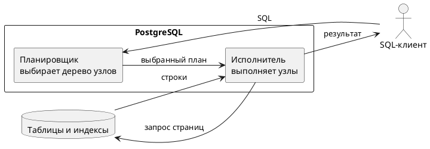
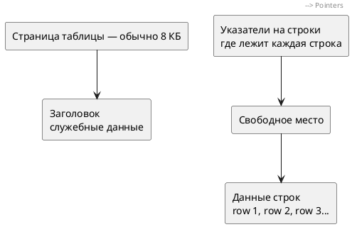
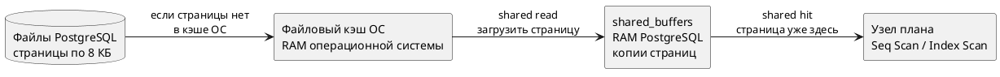
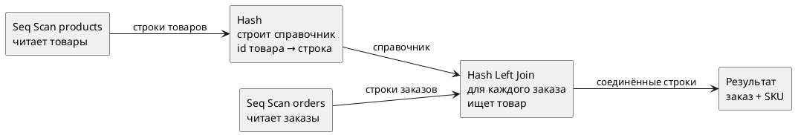
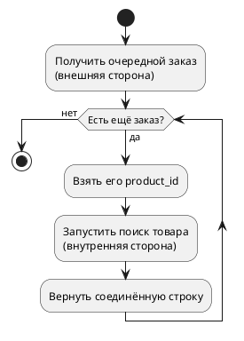
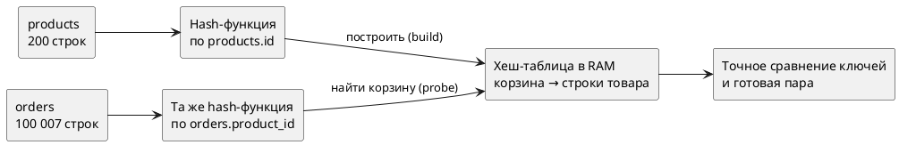
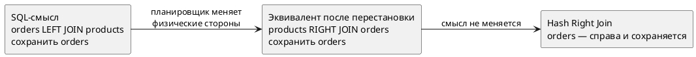

# Руководство: как читать планировщик PostgreSQL

> **Зачем этот файл.** Научиться снимать план запроса, понимать узлы и числа, отличать «медленный правильный запрос» от «быстрого, но с другим смыслом».  
> **База:** `reactive_study` (PostgreSQL 16.4).  
> **Перед каждой практикой:**

```sql

SET search_path TO reactive_study;
```

Миллисекунды у вас будут другими. Важны **форма дерева**, имена узлов и **число строк**, не точное время.

Ориентиры по объёму: ≈ 100 007 заказов, 200 товаров, 10 категорий, 20 товаров с `code = 'electronics'`, заказ `100003` без `product_id`.

---

## Оглавление

- [Урок 0 — данные, страницы и память](#урок-0--данные-страницы-и-память)
- [Урок 1 — что запускает планировщик](#урок-1--что-запускает-планировщик)
- [Урок 2 — как читать дерево плана](#урок-2--как-читать-дерево-плана)
- [Урок 3 — оценка без выполнения](#урок-3--оценка-без-выполнения)
- [Урок 4 — факт: ANALYZE и буферы](#урок-4--факт-analyze-и-буферы)
- [Урок 5 — другой текст JOIN → другой план](#урок-5--другой-текст-join--другой-план)
- [Урок 6 — когда полный просмотр уместен](#урок-6--когда-полный-просмотр-уместен)
- [Урок 7 — Seq Scan против индекса](#урок-7--seq-scan-против-индекса)
- [Урок 8 — WHERE ломает LEFT JOIN](#урок-8--where-ломает-left-join)
- [Урок 9 — чеклист: как править запрос](#урок-9--чеклист-как-править-запрос)
- [Откуда взяты факты](#откуда-взяты-факты)

После **каждого урока** — практика. Сначала выполните её в клиенте, потом сверьте с подсказкой в том же уроке.

---

## Урок 0 — данные, страницы и память

До чтения `EXPLAIN` нужно понять, **откуда PostgreSQL берёт данные** и о какой памяти
говорит план.

### Кто планирует и кто выполняет

Когда клиент отправляет SQL:

1. **Планировщик PostgreSQL** рассматривает возможные способы выполнения и выбирает план.
2. **Исполнитель PostgreSQL** проходит узлы выбранного плана и получает строки.
3. Это делает сервер PostgreSQL, а не SQL-клиент и не пользователь вручную.



### Что такое страница

PostgreSQL не читает с накопителя одну логическую строку изолированно. Таблицы и индексы
разделены на **страницы** (также говорят *блоки*). Обычно одна страница занимает **8 КБ** и
содержит несколько строк либо записей индекса.

Это похоже на книгу:

- таблица — вся книга;
- страница PostgreSQL — физическая страница книги;
- строки таблицы — несколько записей на этой странице;
- чтобы прочитать одну запись, системе часто нужно получить страницу целиком.

Упрощённое устройство одной страницы:



Это схема для понимания, а не побайтовая копия файла.

**Источник:** https://www.postgresql.org/docs/current/storage-page-layout.html

EN:

> Every table and index is stored as an array of pages of a fixed size (usually 8 kB, although a different page size can be selected when compiling the server). In a table, all the pages are logically equivalent, so a particular item (row) can be stored in any page.

RU:

> Каждая таблица и каждый индекс хранятся как массив страниц фиксированного размера
> (обычно 8 КБ, хотя при компиляции сервера можно выбрать другой размер). В таблице все
> страницы логически равнозначны, поэтому конкретный элемент (строка) может храниться на
> любой странице.

### Что такое shared buffers, hit и read

`shared_buffers` — область **оперативной памяти (RAM)** сервера PostgreSQL, общая для
подключений. В ней PostgreSQL держит недавно использованные страницы таблиц и индексов,
чтобы не получать их повторно из файлов.



В `EXPLAIN (ANALYZE, BUFFERS)`:

| Запись | Простыми словами |
|---|---|
| `shared hit=8` | узлы 8 раз нашли нужную страницу уже в `shared_buffers` |
| `shared read=3` | 3 страницы пришлось загрузить в `shared_buffers` |
| `read` | не обязательно физический диск: страница могла прийти из кэша ОС |

Число `hit` — не количество строк и не количество уникальных страниц: один и тот же блок
может учитываться при повторных обращениях.

**Источник:** https://www.postgresql.org/docs/current/runtime-config-resource.html#RUNTIME-CONFIG-RESOURCE-MEMORY

EN:

> Sets the amount of memory the database server uses for shared memory buffers. If this value is specified without units, it is taken as blocks, that is `BLCKSZ` bytes, typically 8kB.

RU:

> Задаёт объём памяти, который сервер базы данных использует для общих буферов памяти.
> Если значение указано без единиц, оно считается в блоках размером `BLCKSZ` байт —
> обычно 8 КБ.

### Shared buffers и память для хеша — не одно и то же

`shared_buffers` хранит **копии страниц таблиц и индексов**.  
`work_mem` — лимит памяти для **одной операции запроса**, например сортировки или
построения хеш-таблицы. В сложном запросе таких операций может быть несколько.

Если хеш не помещается в допустимую память, PostgreSQL делит работу на партии (`Batches`)
и может использовать временные файлы.

**Источник:** https://www.postgresql.org/docs/current/runtime-config-resource.html#RUNTIME-CONFIG-RESOURCE-MEMORY

EN:

> Sets the base maximum amount of memory to be used by a query operation (such as a sort or hash table) before writing to temporary disk files. Note that a complex query might perform several sort and hash operations at the same time, with each operation generally being allowed to use as much memory as this value specifies before it starts to write data into temporary files.

RU:

> Задаёт базовый максимальный объём памяти для одной операции запроса (например,
> сортировки или хеш-таблицы) до начала записи во временные файлы. Сложный запрос может
> одновременно выполнять несколько сортировок и хеш-операций; каждой операции обычно
> разрешено использовать указанный объём памяти до перехода к временным файлам.

### Практика 0

**Задача.** Посмотреть настройки памяти и размер страницы именно вашей базы.

```sql

SHOW block_size;
SHOW shared_buffers;
SHOW work_mem;
```

Ответьте:

1. Какой размер страницы показывает `block_size`?
2. Где хранятся страницы: в `shared_buffers` или `work_mem`?
3. Где строится хеш для `Hash Join`?

**На вашей базе:** `block_size = 8192` байт, `shared_buffers = 128MB`,
`work_mem = 4MB`. Страницы кэшируются в `shared_buffers`. Хеш-таблица операции использует
рабочую память запроса, ограниченную настройками семейства `work_mem`, а не `shared_buffers`.

---

## Урок 1 — что запускает планировщик

Отдельной программы «планировщик» нет. Вы пишете `EXPLAIN` перед запросом. PostgreSQL строит **дерево шагов** и оценивает стоимость.

| Команда | Запрос выполняется? | Что получите |
|---|---|---|
| `EXPLAIN …` | нет | дерево и оценка `cost` / `rows` |
| `EXPLAIN ANALYZE …` | **да** | плюс реальное время и фактические строки |
| `EXPLAIN (ANALYZE, BUFFERS) …` | да | плюс страницы `hit` / `read` |

`hit` — страница уже была в `shared_buffers`, то есть в RAM PostgreSQL.  
`read` — страницу загрузили в `shared_buffers`; это **не всегда** физический диск, мог
сработать кэш ОС. Подробная схема — в уроке 0.

**Источник:** https://www.postgresql.org/docs/current/using-explain.html#USING-EXPLAIN-ANALYZE

EN:

> It is possible to check the accuracy of the planner's estimates by using `EXPLAIN`'s `ANALYZE` option. With this option, `EXPLAIN` actually executes the query, and then displays the true row counts and true run time accumulated within each plan node, along with the same estimates that a plain `EXPLAIN` shows.

RU:

> Точность оценок планировщика можно проверить опцией `ANALYZE` у `EXPLAIN`. С этой опцией `EXPLAIN` **действительно выполняет** запрос и затем показывает истинные числа строк и реальное время в каждом узле плана — вместе с теми же оценками, что даёт обычный `EXPLAIN`.

EN:

> Keep in mind that because `EXPLAIN ANALYZE` actually runs the query, any side-effects will happen as usual, even though whatever results the query might output are discarded in favor of printing the `EXPLAIN` data.

RU:

> Важно помнить: `EXPLAIN ANALYZE` действительно выполняет запрос, поэтому любые побочные эффекты происходят как обычно, хотя результат запроса отбрасывается и вместо него печатается план.

Для `SELECT` это обычно безопасно. `INSERT` / `UPDATE` / `DELETE` — только на стенде или в транзакции с `ROLLBACK`.

Для оптимизации почти всегда нужен `EXPLAIN (ANALYZE, BUFFERS)`. Иначе вы правите оценку, а не факт.

### Практика 1

**Задача.** Сравнить два вывода для заказа `100003` без товара.

1. Выполните `EXPLAIN` (без `ANALYZE`) для запроса:

```sql

SELECT o.product_name, p.sku
FROM orders o
LEFT JOIN products p ON o.product_id = p.id
WHERE o.id = 100003;
```

2. Выполните тот же запрос с `EXPLAIN (ANALYZE, BUFFERS)`.
3. Запишите: появилось ли `actual time` во втором выводе? Есть ли во втором выводе строки результата (`product_name`, `sku`) или только план?

**Что должно получиться.** Во втором выводе есть `actual time` и `rows=1`. Таблицы результата запроса **нет**: `EXPLAIN ANALYZE` её отбрасывает. Обычный `EXPLAIN` не содержит `actual time`.

---

## Урок 2 — как читать дерево плана

План — это дерево **производителей строк**. Нижний узел отдаёт строки узлу над ним; верхний
узел формирует окончательный результат.

### Что такое родитель и ребёнок

Слова «родитель» и «ребёнок» относятся не к таблицам, а к узлам дерева:

```text
Hash Left Join                 ← родитель: просит данные у двух детей и соединяет
  ->  Seq Scan on orders       ← первый ребёнок: отдаёт строки заказов
  ->  Hash                     ← второй ребёнок: отдаёт готовую хеш-таблицу
        -> Seq Scan products   ← ребёнок узла Hash: отдаёт строки товаров
```

Аналогия — сборочная линия:



`Hash Left Join` не может закончить работу, пока его дочерние узлы не дадут нужные данные.
Поэтому показанное для верхнего узла время включает ожидание и обработку данных детей.
**Нельзя складывать времена всех строк плана**: одна и та же работа уже включена в время
узлов выше.

### Простые узлы чтения

| Имя в плане | Что делает исполнитель PostgreSQL |
|---|---|
| `Seq Scan` | по очереди получает страницы таблицы и проверяет строки |
| `Index Scan` | находит адреса по индексу, затем получает соответствующие строки таблицы |
| `Index Only Scan` | получает нужные данные из индекса; иногда всё же проверяет видимость в таблице |
| `Bitmap Index Scan` | индекс создаёт карту: какие страницы таблицы понадобятся |
| `Bitmap Heap Scan` | читает страницы, отмеченные в этой карте |

### Nested Loop — вложенный цикл

`Nested Loop` — буквально «цикл внутри цикла».

**Пример:** найдены три заказа с `product_id` 10, 20 и 30. Для каждого нужно найти товар
по индексу.

```text
заказ product_id=10 → поиск products.id=10 → товар найден
заказ product_id=20 → поиск products.id=20 → товар найден
заказ product_id=30 → поиск products.id=30 → товар найден
```



В плане:

```text
Nested Loop
  -> Scan orders                 ← outer: строки, по которым идёт внешний цикл
  -> Index Scan products         ← inner: запускается для каждой outer-строки
```

Если внешний узел отдал 3 заказа, внутренний поиск часто покажет `loops=3`.

> `outer` и `inner` здесь — роли **в физическом плане Nested Loop**. Это не обязательно
> левая и правая таблицы из текста SQL: планировщик может поменять способы и порядок обработки,
> если смысл запроса сохраняется.

**Источник:** https://www.postgresql.org/docs/current/using-explain.html

EN:

> The nested-loop join node will run its second, or “inner”, child once for each row obtained from the outer child. Column values from the current outer row can be plugged into the inner scan.

RU:

> Узел соединения вложенным циклом запускает второго, то есть «внутреннего», ребёнка один
> раз для каждой строки, полученной от внешнего ребёнка. Значения столбцов текущей внешней
> строки можно подставлять во внутреннее сканирование.

### Hash Join — соединение через хеш-таблицу

Хеш строит **исполнитель PostgreSQL**, потому что планировщик выбрал узел `Hash Join`.
Память — RAM, доступная операции запроса (см. `work_mem` в уроке 0).

Пусть маленькая таблица `products` содержит:

| id | sku |
|---|---|
| 10 | SKU-00010 |
| 20 | SKU-00020 |
| 30 | SKU-00030 |

Узел `Hash` выполняет два действия:

1. Берёт ключ, например `products.id = 20`.
2. Хеш-функция вычисляет номер «корзины» и кладёт туда ссылку на строку.

Упрощённая хеш-таблица в памяти:

```text
корзина 0 → (id=20, sku=SKU-00020)
корзина 1 → (id=10, sku=SKU-00010), (id=30, sku=SKU-00030)
корзина 2 → пусто
```

Номера корзин условные — реальные значения PostgreSQL будут другими. Если два ключа попали
в одну корзину, PostgreSQL дополнительно проверяет точное равенство ключей.

Затем `Hash Join` читает заказ:

```text
orders.product_id = 20
    ↓ применить ту же хеш-функцию
корзина 0
    ↓ проверить p.id = o.product_id
найдена строка SKU-00020
```



Это быстрее многократного полного поиска, когда нужно соединить много строк.

**Источник:** https://www.postgresql.org/docs/current/using-explain.html

EN:

> Here, the planner has chosen to use a hash join, in which rows of one table are entered into an in-memory hash table, after which the other table is scanned and the hash table is probed for matches to each row. The bitmap scan on `tenk1` is the input to the Hash node, which constructs the hash table. That's then returned to the Hash Join node, which reads rows from its outer child plan and searches the hash table for each one.

RU:

> Здесь планировщик выбрал соединение хешем: строки одной таблицы помещаются в
> хеш-таблицу в памяти, после чего другая таблица сканируется, а хеш-таблица проверяется
> для поиска совпадений с каждой строкой. Bitmap Scan по `tenk1` служит входом узла Hash,
> который строит хеш-таблицу. Затем она передаётся узлу Hash Join: он читает строки своего
> внешнего дочернего плана и для каждой ищет совпадение в хеш-таблице.

Разновидности:

| Узел | Какие строки обязан сохранить |
|---|---|
| `Hash Join` | только найденные пары (INNER) |
| `Hash Left Join` | все строки физической левой стороны |
| `Hash Right Join` | все строки физической правой стороны |

### Почему LEFT JOIN в SQL может стать Hash Right Join в плане

Запрос:

```sql

FROM orders o
LEFT JOIN products p ON p.id = o.product_id
WHERE o.id = 100003
```

Логический смысл: **заказ нужно сохранить**, даже если товар не найден.

Планировщик видит:

- после `WHERE` остался только **один заказ**;
- товаров — 200;
- удобно построить маленький хеш из одной строки заказа, а затем проверить товары.

Поэтому он физически записывает эквивалентную операцию:

```text
products RIGHT JOIN orders
```

и план показывает:

```text
Hash Right Join
  -> Seq Scan products                 ← просматриваем 200 товаров
  -> Hash
       -> Index Scan orders id=100003  ← хеш из одного заказа
```

`Right` означает: сохранить строки **правого физического входа** — там находится `orders`.
Следовательно, заказ 100003 останется, даже если ни один товар не совпал.



### HashAggregate — GROUP BY через хеш-таблицу

Здесь соединения нет. PostgreSQL группирует строки, например по `status`:

```sql

SELECT status, COUNT(*), SUM(amount)
FROM orders
GROUP BY status;
```

В рабочей памяти создаётся таблица накопителей:

| Ключ группы | Текущее количество | Текущая сумма |
|---|---:|---:|
| pending | 1 → 2 → 3 → … | 100 → 250 → 420 → … |
| delivered | 1 → 2 → … | 90 → 300 → … |

Для каждой строки вычисляется хеш от `status`, находится корзина группы и обновляются
`COUNT` и `SUM`. В конце одна корзина превращается в одну строку результата.

`HashAggregate` означает **«группировка хешем»**, а не JOIN.

Числа:

| Поле | Смысл |
|---|---|
| `cost=A..B` | оценка стоимости (условные единицы, **не** миллисекунды) |
| `rows=N` | сколько строк планировщик **ждал** |
| `actual time=X..Y` | миллисекунды реального времени |
| `actual … rows=M` | сколько строк узел **реально** отдал (в среднем за запуск) |
| `loops=L` | сколько раз узел запускали |

Время узла выше включает получение данных от вложенных под ним узлов. Например,
`Hash Left Join actual time=20 ms` уже включает чтение `orders` и построение `Hash`.
Не складывайте `20 ms + время детей`: получится двойной счёт.

Для узла, который запускался несколько раз, примерное общее число обработанных строк можно
оценить как `actual rows × loops`, потому что `actual rows` показывается в среднем за запуск.

`cost` и `actual time` сравнивать между собой бессмысленно: разные единицы.

**Источник:** https://www.postgresql.org/docs/current/using-explain.html#USING-EXPLAIN-ANALYZE

EN:

> Note that the “actual time” values are in milliseconds of real time, whereas the `cost` estimates are expressed in arbitrary units; so they are unlikely to match up. The thing that's usually most important to look for is whether the estimated row counts are reasonably close to reality.

RU:

> Значения `actual time` — это миллисекунды реального времени, а оценки `cost` выражены в условных единицах, поэтому они почти наверняка не совпадут. Обычно важнее всего смотреть, близки ли оценённые числа строк к реальности.

### Практика 2

**Задача.** Прочитать дерево и объяснить Hash Right Join своими словами.

```sql

EXPLAIN
SELECT o.id, p.sku
FROM orders o
LEFT JOIN products p ON o.product_id = p.id
WHERE o.id = 1;
```

Ответьте письменно:

1. Какой узел самый верхний (последний шаг)?
2. Есть ли `Index Scan` по `orders_pkey`?
3. Товары читают через `Seq Scan` или через индекс?
4. Если сверху `Hash Right Join`, какая физическая сторона сохраняется и почему заказ
   всё равно не теряется?
5. Какой узел строит хеш и из каких строк?

**Ориентир.** На текущей базе часто сверху `Hash Right Join`: товары — физическая левая
сторона (`Seq Scan`), один заказ — правая сохраняемая сторона (`Index Scan` → `Hash`).
Если ваш план другой, это не ошибка: объясните именно своё дерево.

**Дополнительная практика — HashAggregate.**

```sql

EXPLAIN (ANALYZE, BUFFERS)
SELECT status, COUNT(*), SUM(amount)
FROM orders
GROUP BY status;
```

Найдите:

1. `Seq Scan on orders` — он отдаёт 100 007 исходных строк.
2. `HashAggregate` — он создаёт корзины по `Group Key: status`.
3. `actual rows=5` сверху — пять итоговых статусов.
4. `Memory Usage` — сколько рабочей памяти заняли накопители групп на этом запуске.

На контрольном запуске: `Batches: 1`, `Memory Usage: 24kB`. Ваши числа могут отличаться.

---

## Урок 3 — оценка без выполнения

Обычный `EXPLAIN` **не читает** строки результата. По нему видно задумку планировщика.

**Задача урока.** Заказ `100003`, LEFT JOIN к товару и категории, но категория в `SELECT` не нужна.

```sql

EXPLAIN
SELECT o.product_name, p.sku
FROM orders o
LEFT JOIN products p ON o.product_id = p.id
LEFT JOIN product_categories pc ON p.category_id = pc.id
WHERE o.id = 100003;
```

Типичный вывод на этой базе:

```text

 Hash Right Join  (cost=8.32..12.86 rows=1 width=27)
   Hash Cond: (p.id = o.product_id)
   ->  Seq Scan on products p  (cost=0.00..4.00 rows=200 width=16)
   ->  Hash
         ->  Index Scan using orders_pkey on orders o
               Index Cond: (id = 100003)
```

**Разбор.** Таблицы `product_categories` в плане **нет**. Поля `pc` не используются ни в
`SELECT`, ни в фильтре. Кроме того, этот LEFT JOIN не может удалить строку заказа.
Следовательно, он не влияет на результат, и планировщик целиком убрал этот узел.
Это нормальная оптимизация, не ошибка SQL.

### Практика 3

**Задача.** Увидеть, как планировщик удаляет LEFT JOIN, который не влияет на результат.

1. Снимите `EXPLAIN` для запроса урока (категория не в `SELECT`). Есть ли `product_categories` в плане?
2. Добавьте в `SELECT` столбец `pc.code` и снова снимите `EXPLAIN`. Появилась ли категория в дереве?

**Ориентир.** В шаге 1 категории нет. В шаге 2 узел категории должен появиться (часто `Index Scan` / `Index Only Scan` по `product_categories`).

---

## Урок 4 — факт: ANALYZE и буферы

Оценку сверяют с фактом.

```sql

EXPLAIN (ANALYZE, BUFFERS)
SELECT o.product_name, p.sku
FROM orders o
LEFT JOIN products p ON o.product_id = p.id
LEFT JOIN product_categories pc ON p.category_id = pc.id
WHERE o.id = 100003;
```

На контрольном запуске:

- заказ: `actual rows=1`;
- товары: `Seq Scan`, `rows=200`;
- соединение: `rows=1` (заказ без товара сохранился);
- `Buffers: shared hit=…` — нужные 8-КБ страницы нашли в RAM PostgreSQL; выполнение заняло
  доли миллисекунды.

**Почему Seq Scan 200 товаров при одном заказе?** Маленькую таблицу часто дешевле прочитать целиком. Это не закон LEFT JOIN. На миллионе товаров план, скорее всего, сменится.

### Практика 4

**Задача.** Найти факт «заказ без товара дал одну строку».

Снимите `EXPLAIN (ANALYZE, BUFFERS)` для запроса этого урока.

Запишите:

1. `actual rows` верхнего узла;
2. `actual rows` у `Seq Scan on products`;
3. есть ли `read=` в `Buffers` выполнения или только `hit`.

**Ориентир.** Верх: 1 строка. Товары: 200. Часто только `hit` (данные уже в кэше).

---

## Урок 5 — другой текст JOIN → другой план

Скобки меняют **смысл** соединения, поэтому дерево другое. Это не «ускоритель».

```sql

EXPLAIN (ANALYZE, BUFFERS)
SELECT o.product_name, p.sku
FROM orders o
LEFT JOIN (
    products p
    INNER JOIN product_categories pc ON p.category_id = pc.id
) ON o.product_id = p.id
WHERE o.id = 100003;
```

Типичный план:

1. `Index Scan` заказа (`orders_pkey`);
2. `Index Scan` товара (`products_pkey`, `id = o.product_id`) → `rows=0`;
3. Категория `never executed` — этот узел **ни разу не запускался**. Внешний узел товара
   вернул 0 строк, поэтому входных данных для поиска категории не было.

Категорию **нельзя выкинуть**: INNER JOIN внутри скобок может отбросить товар без категории.

На одной строке оба запроса (урок 4 и урок 5) мгновенные. Сравнивать «кто быстрее» бессмысленно.

### Практика 5

**Задача.** Найти в плане `never executed`.

Снимите `EXPLAIN (ANALYZE, BUFFERS)` для запроса этого урока.

Ответьте:

1. Какой индекс использован для товара?
2. Есть ли у категории пометка `never executed`? Почему она законна?

**Ориентир.** Товар: `products_pkey`. Категория не запускалась, потому что `product_id` у заказа 100003 пустой и внутренняя сторона вернула 0 строк.

---

## Урок 6 — когда полный просмотр уместен

Нужны **все** заказы с артикулом, если товар есть.

```sql

EXPLAIN (ANALYZE, BUFFERS)
SELECT o.id, p.sku
FROM orders o
LEFT JOIN products p ON o.product_id = p.id;
```

Типичный план:

1. `Seq Scan on products` читает 200 товаров.
2. Узел `Hash` строит в рабочей RAM справочник вида `products.id → строка товара`.
3. `Seq Scan on orders` читает 100 007 заказов.
4. `Hash Left Join` для каждого `orders.product_id` ищет корзину справочника и проверяет
   точное равенство ключа.
5. Так как это LEFT JOIN, каждый заказ остаётся. Верхний узел отдаёт `actual rows=100007`.

Индекс по `orders.id` здесь не помогает: вы всё равно читаете каждую строку заказа.

### Практика 6

**Задача.** Отличить «полный просмотр вреден» от «полный просмотр обязателен».

1. Снимите план запроса этого урока. Есть ли `Seq Scan on orders`? Сколько `actual rows` у верхнего узла?
2. Сравните с планом: `SELECT * FROM orders WHERE id = 1` (с `EXPLAIN ANALYZE`). Там `Seq Scan` или `Index Scan`?

**Ориентир.** В (1) полный просмотр заказов уместен, строк ≈ 100 007. В (2) ожидают `Index Scan` по `orders_pkey` и 1 строку.

---

## Урок 7 — Seq Scan против индекса

Ищем заказ по **тексту названия**, не по `id`.

```sql

EXPLAIN (ANALYZE, BUFFERS)
SELECT id, product_name, amount
FROM orders
WHERE product_name = 'JOIN-DEMO-NO-PRODUCT-2';
```

Без индекса на `product_name` типичен `Seq Scan`: исполнитель последовательно получает
страницы `orders`, проверяет строки и отбрасывает ≈ 100 006. В результате остаётся 1 строка.
Большое число `Buffers` означает много обращений к 8-КБ страницам таблицы, а не большое число
возвращённых строк.

Сигнал: `Seq Scan` + большое `Rows Removed by Filter` на равенстве по одному полю.

Индекс **не** создают автоматически: он занимает место и замедляет запись. На этой базе учебный индекс после опыта нужно удалить.

### Практика 7

**Задача.** Увидеть смену пути после индекса. Делайте **строго в таком порядке**, индекс в конце удалите.

1. Снимите план запроса этого урока. Запишите тип скана и `Execution Time`.
2. Выполните:

```sql

CREATE INDEX idx_orders_product_name ON orders (product_name);
ANALYZE orders;
```

3. Снова снимите тот же `EXPLAIN (ANALYZE, BUFFERS)`. Какой узел вместо `Seq Scan`?
4. Обязательно:

```sql

DROP INDEX idx_orders_product_name;
ANALYZE orders;
```

**Ориентир.** До индекса: `Seq Scan`. После: часто `Index Scan using idx_orders_product_name`, время меньше. Если забыли `DROP INDEX` — индекс останется в базе.

---

## Урок 8 — WHERE ломает LEFT JOIN

Две разные бизнес-задачи.

| Задача | Правильный смысл | Сколько строк ждать |
|---|---|---|
| А | все заказы; товар только если электроника | ≈ 100 007 |
| Б (ошибка) | только заказы, у которых категория электроника | меньше, на базе ≈ 10 040 |

Ошибка: `LEFT JOIN` + `WHERE pc.code = 'electronics'`. `WHERE` отбрасывает NULL справа → LEFT превращается в INNER.

**Ошибочный запрос (задача Б):**

```sql

EXPLAIN (ANALYZE, BUFFERS)
SELECT o.id, p.sku, pc.code
FROM orders o
LEFT JOIN products p ON o.product_id = p.id
LEFT JOIN product_categories pc ON p.category_id = pc.id
WHERE pc.code = 'electronics';
```

В плане часто **нет** Left Join. Логическая работа выглядит так:

1. Найти категорию `electronics`.
2. Обычный `Hash Join` оставить только 20 товаров этой категории.
3. `Nested Loop` взять каждый из этих 20 товаров.
4. Для каждого товара запустить `Index Scan` по `idx_orders_product_id` — поэтому внутренний
   узел показывает `loops=20`.
5. Вернуть только заказы электроники: верхний `actual rows≈10040`.

Заказы без категории отсутствуют: их уже удалил `WHERE`. Оценка `rows` может сильно
ошибаться (на контрольном запуске план ждал 116 строк).

**Верный запрос (задача А):**

```sql

EXPLAIN (ANALYZE, BUFFERS)
SELECT o.id, p.sku, pc.code
FROM orders o
LEFT JOIN (
    products p
    INNER JOIN product_categories pc
        ON p.category_id = pc.id
       AND pc.code = 'electronics'
) ON o.product_id = p.id;
```

Сверху `Hash Left Join`:

1. Внутри скобок строится набор из 20 строк «товар электроники + категория».
2. Узел `Hash` создаёт по этому набору хеш-таблицу в рабочей RAM.
3. Читаются все 100 007 заказов.
4. Для каждого заказа ищется товар в хеш-таблице.
5. Нет совпадения — поля товара NULL, но LEFT сохраняет заказ.

Верхний `actual rows=100007`. Время больше, потому что результат больше, а не потому что
«скобки медленные».

Правило: сначала сверяют **число строк и смысл**, потом время.

### Практика 8

**Задача.** Доказать сломанный LEFT JOIN числом строк, не ощущением скорости.

1. Выполните `SELECT COUNT(*)` для ошибочного запроса (с `WHERE pc.code = 'electronics'`).
2. Выполните `SELECT COUNT(*)` для запроса со скобками.
3. Снимите `EXPLAIN (ANALYZE)` обоих. Есть ли слово `Left` в верхнем узле ошибочного плана?

**Ориентир.** Счётчики ≈ 10 040 и 100 007. В ошибочном плане сверху обычно `Nested Loop` или `Hash Join` без `Left`.

---

## Урок 9 — чеклист: как править запрос

Порядок работы. Текст вслепую не переписывают.

1. Снять `EXPLAIN (ANALYZE, BUFFERS)` на похожих на бой данных.
2. Найти дорогую **ветку дерева**, то есть узел вместе со всеми расположенными под ним
   узлами. Верхний узел уже включает время получения строк от нижних. Поэтому времена не
   складываем; сравниваем, где резко растут `actual time`, число строк, `loops` или `Buffers`.
3. Сравнить `rows` и `actual rows` (с учётом `loops`).
4. Посмотреть тип шага: большой `Seq Scan` при узком `=`; `WHERE` по правой таблице после LEFT JOIN.
5. Править **причину**: индекс, `ANALYZE`, условие в `ON` / скобки, убрать лишние таблицы из `SELECT`.

На запросе `id = 100003` оптимизировать нечего: доли миллисекунды. Имеет смысл возиться, когда большой просмотр или план отвечает не на тот вопрос (урок 8).

### Практика 9

**Задача.** Пройти чеклист на одном своём запросе.

Возьмите любой отчёт из темы 05 (например, заказы категории «Электроника», 5 строк). Снимите `EXPLAIN (ANALYZE, BUFFERS)` **без** `LIMIT` и **с** `LIMIT 5`.

Ответьте:

1. Изменился ли тип соединения?
2. Уменьшилось ли `actual rows` верхнего узла с `LIMIT`?
3. Можно ли по плану с `LIMIT 5` судить о стоимости полного отчёта?

**Ориентир.** `LIMIT` часто меняет план. Полный отчёт оценивают по плану **без** `LIMIT` (или с тем `LIMIT`, который будет в бою).

---

## Инструменты на потом

В сессии: `EXPLAIN`, `EXPLAIN (ANALYZE, BUFFERS)`, при необходимости `VERBOSE`.

На сервере (здесь не снимали): `pg_stat_statements`, `pg_stat_user_tables` / `pg_stat_user_indexes`, `auto_explain`.

Сайты вроде explain.depesz.com только рисуют то же дерево удобнее.

---

## Откуда взяты факты

| Факт | Источник |
|---|---|
| Смысл `EXPLAIN ANALYZE` и единиц `cost` vs `actual time` | https://www.postgresql.org/docs/current/using-explain.html#USING-EXPLAIN-ANALYZE |
| Формы планов и числа строк | `EXPLAIN` / `EXPLAIN (ANALYZE, BUFFERS)` на `reactive_study` |
| 10 040 против 100 007 | `COUNT(*)` тех же двух запросов урока 8 |

Песочница не заменяет боевой объём. Метод тот же: снять план с фактом, понять смысл, потом менять запрос.
