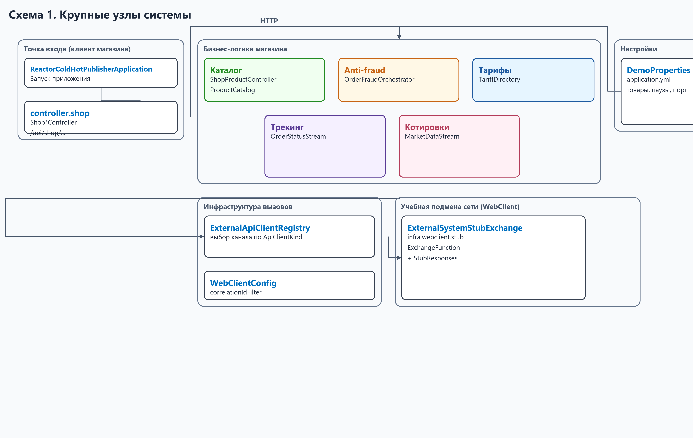
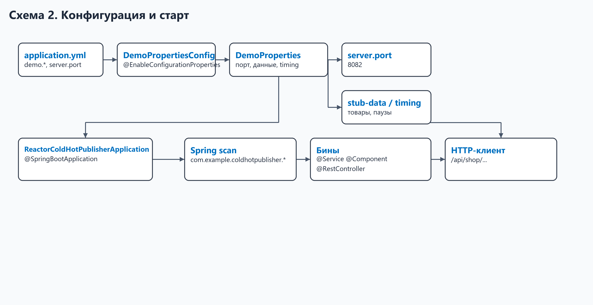
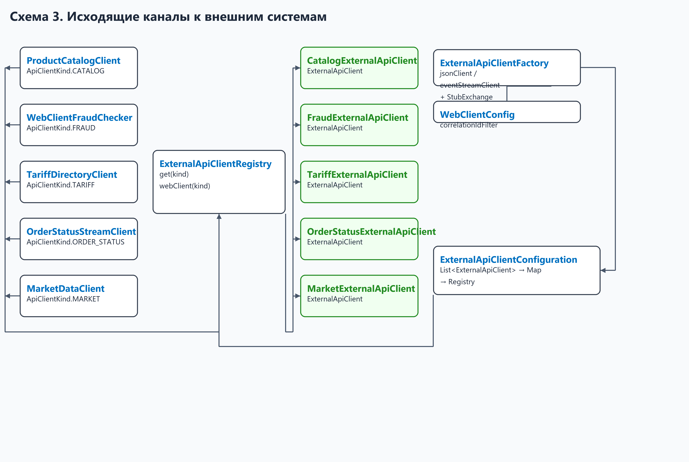
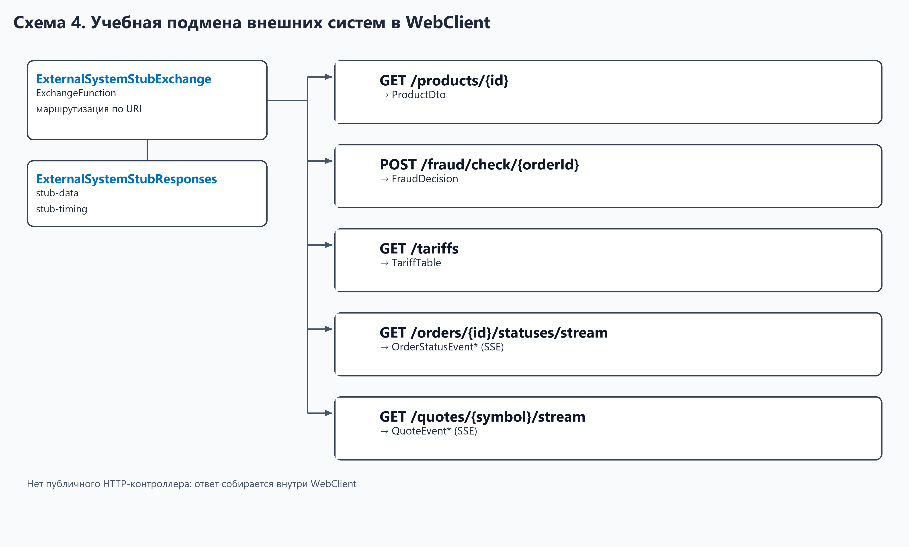
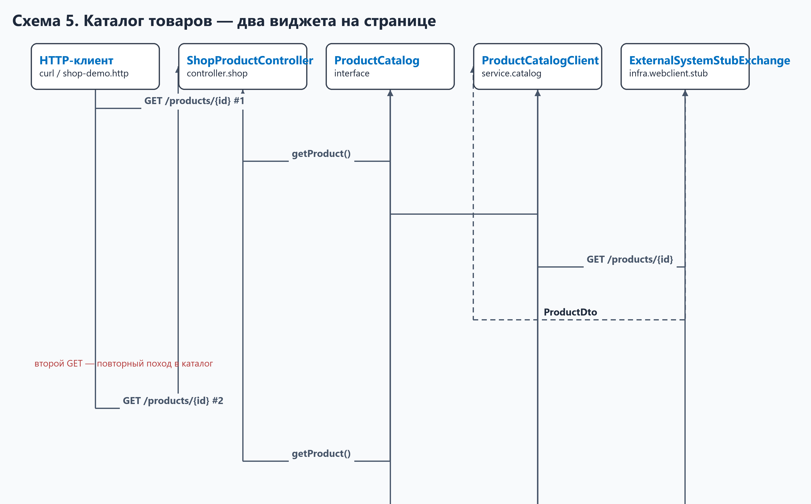
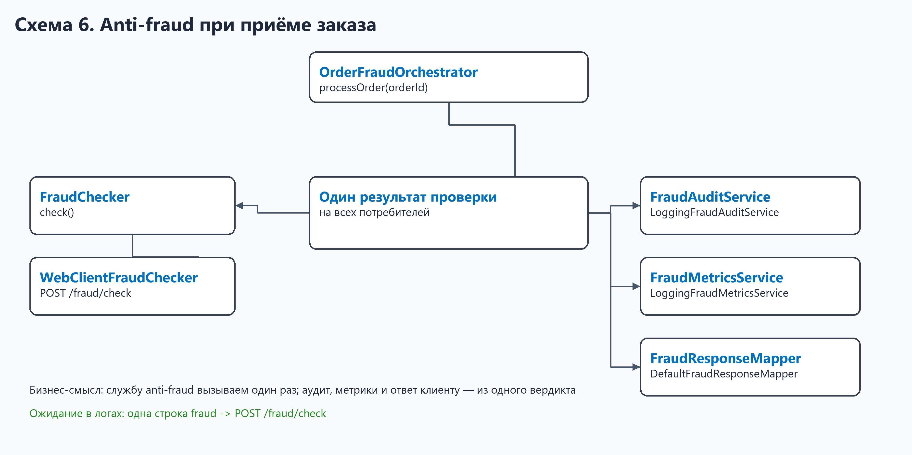
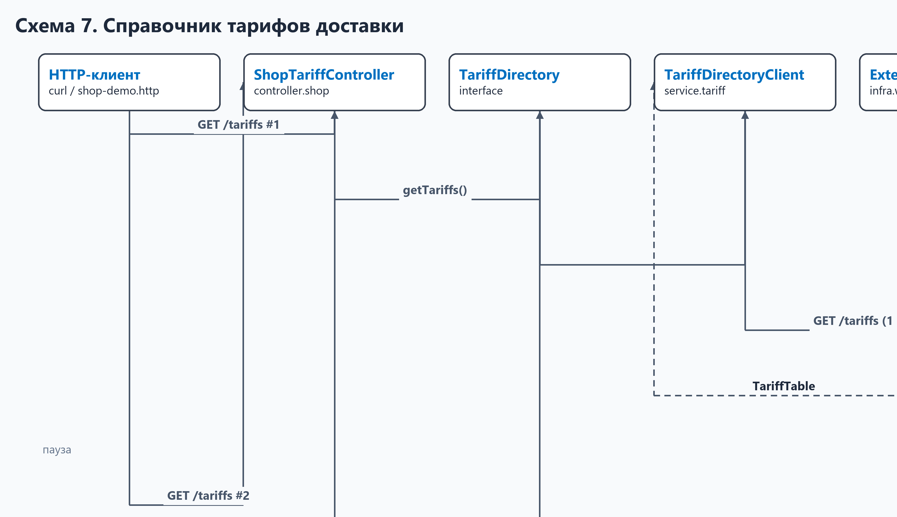
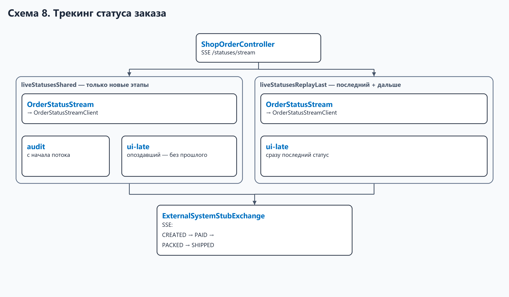
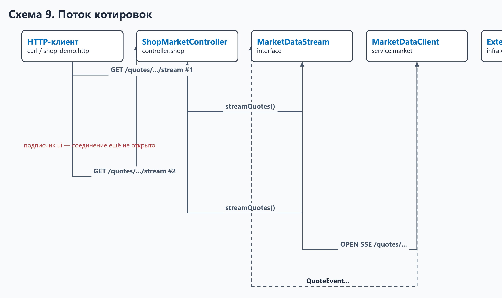
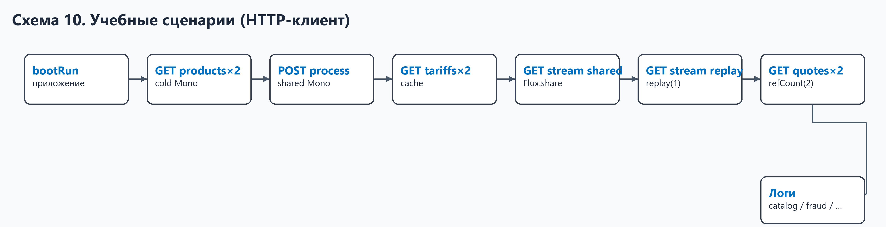

# reactor-cold-hot-publisher — быстрый вход в проект

Учебный Spring WebFlux-стенд **интернет-магазина**: в одном процессе живут клиенты к «внешним» системам и их заглушки. Цель — наглядно показать, как одни и те же бизнес-операции ведут себя при разном способе разделения потока данных между подписчиками (cold / hot, share, cache, replay, refCount).

Порт по умолчанию: **8082** (`demo.application.port`).

---

## Оглавление

- [Зачем этот модуль](#зачем-этот-модуль)
- [Как запустить](#как-запустить)
- [Схема 1. Крупные узлы системы](#схема-1-крупные-узлы-системы)
- [Схема 2. Конфигурация и старт](#схема-2-конфигурация-и-старт)
- [Схема 3. Исходящие каналы к внешним системам](#схема-3-исходящие-каналы-к-внешним-системам)
- [Схема 4. Заглушки внешних систем](#схема-4-заглушки-внешних-систем)
- [Схема 5. Каталог товаров (два виджета)](#схема-5-каталог-товаров-два-виджета)
- [Схема 6. Anti-fraud при приёме заказа](#схема-6-anti-fraud-при-приёме-заказа)
- [Схема 7. Справочник тарифов доставки](#схема-7-справочник-тарифов-доставки)
- [Схема 8. Трекинг статуса заказа](#схема-8-трекинг-статуса-заказа)
- [Схема 9. Поток котировок](#схема-9-поток-котировок)
- [Схема 10. Учебные сценарии (HTTP-клиент)](#схема-10-учебные-сценарии-http-клиент)
- [Карта пакетов](#карта-пакетов)
- [Связанные документы](#связанные-документы)
- [Пересборка схем](#пересборка-схем)

---

## Зачем этот модуль

| Бизнес-ситуация | Что показывает стенд | Где смотреть в коде |
|-----------------|----------------------|---------------------|
| Два виджета на странице товара запрашивают одну карточку | Каждый HTTP-запрос клиента — свой поход в каталог | `ShopProductController`, `ProductCatalog` |
| Заказ проверяется на мошенничество, результат нужен аудиту, метрикам и клиенту | Одна проверка — несколько последствий | `OrderFraudOrchestrator`, `FraudChecker` |
| Тарифы доставки меняются редко | Повторные обращения не должны снова тянуть тяжёлый справочник | `TariffDirectory`, `TariffDirectoryClient` |
| Клиент открыл трекинг заказа с опозданием | Видит только новые этапы или сразу последний известный статус | `OrderStatusStream`, `OrderStatusStreamClient` |
| Котировки нужны и витрине, и фоновому аудиту | Дорогое соединение открывается только когда оба потребителя готовы | `MarketDataStream`, `MarketDataClient` |

Теория и ожидаемые логи: [`docs/interview/Hot Publisher и Cold Publisher - примеры.md`](../../docs/interview/Hot%20Publisher%20и%20Cold%20Publisher%20-%20примеры.md).

Настройки: [`src/main/resources/application.md`](../src/main/resources/application.md).

---

## Как запустить

```bash

cd reactor-cold-hot-publisher
./gradlew bootRun --no-daemon
```

Сценарии **не запускаются сами** при старте. После `bootRun` вызывайте API магазина (`/api/shop/...`) из [`shop-demo.http`](shop-demo.http) или curl. В логах смотрите `catalog ->`, `fraud ->`, `tariff ->`, `status ->`, `quotes ->` — это исходящие вызовы `WebClient`; ответ подставляет `ExternalSystemStubExchange` (без HTTP на localhost).

```bash

# пример: cold Mono — два GET подряд
curl http://localhost:8082/api/shop/products/p-100
curl http://localhost:8082/api/shop/products/p-100
```

**Два слоя в процессе:**

| Кто звонит | Куда | Роль |
|------------|------|------|
| Клиент магазина (браузер, curl) | `/api/shop/...` | Бизнес API витрины (`controller.shop`) |
| `WebClient` из `ProductCatalogClient` и др. | виртуальный URI (`/products`, …) | Учебная подмена сети: `ExternalSystemStubExchange` |

Публичных HTTP-endpoint'ов «внешних» систем **нет** — заглушка на уровне `ExchangeFunction`, не контроллер.

---

## Схема 1. Крупные узлы системы

Общая картина: **кто** инициирует бизнес-процесс, **кто** обращается к внешним системам, **где** эти системы имитируются.



| Узел | Бизнес-роль | Ключевые типы |
|------|-------------|---------------|
| Точка входа (клиент) | HTTP API магазина | `controller.shop.*` (`/api/shop/...`) |
| Бизнес-логика | Пять типовых операций магазина | `service.catalog`, `service.fraud`, `service.tariff`, `service.status`, `service.market` |
| Инфраструктура | Выбор канала к нужной внешней системе | `ExternalApiClientRegistry`, `*ExternalApiClient` |
| Учебная подмена сети | Ответ «как будто» от внешнего API | `ExternalSystemStubExchange`, `ExternalSystemStubResponses` |
| Настройки | Порт, тестовые данные, паузы | `DemoProperties` |

---

## Схема 2. Конфигурация и старт



| Шаг | Бизнес-смысл | Класс |
|-----|--------------|-------|
| Чтение настроек | Параметры учебного магазина без хардкода в Java | `DemoProperties` |
| Регистрация бина | Подключение `demo.*` к Spring | `DemoPropertiesConfig` |
| Старт | Поднятие HTTP-сервера | `ReactorColdHotPublisherApplication` |
| Вызов сценариев | Вручную через HTTP-клиента | [`shop-demo.http`](shop-demo.http) |

---

## Схема 3. Исходящие каналы к внешним системам

Клиенты бизнес-слоя не знают имя Spring-бина: они запрашивают канал по **типу внешней системы** (`ApiClientKind`).



| Тип системы (`ApiClientKind`) | Зачем магазину | Реализация канала | Потребитель |
|------------------------------|----------------|-------------------|-------------|
| `CATALOG` | Карточка товара | `CatalogExternalApiClient` | `ProductCatalogClient` |
| `FRAUD` | Вердикт по заказу | `FraudExternalApiClient` | `WebClientFraudChecker` |
| `TARIFF` | Таблица тарифов доставки | `TariffExternalApiClient` | `TariffDirectoryClient` |
| `ORDER_STATUS` | Этапы жизни заказа | `OrderStatusExternalApiClient` | `OrderStatusStreamClient` |
| `MARKET` | Котировки валютной пары | `MarketExternalApiClient` | `MarketDataClient` |

Контракт канала: интерфейс `ExternalApiClient` (`getKind()`, `webClient()`). В стенде каждый `WebClient` использует `ExternalSystemStubExchange` вместо реального HTTP.

---

## Схема 4. Учебная подмена внешних систем в WebClient

Внешние системы **не** публикуются как REST-контроллер. `ProductCatalogClient` вызывает `WebClient`; `ExternalSystemStubExchange` по URI возвращает учебный ответ из `ExternalSystemStubResponses`.



| Виртуальный URI в WebClient | Бизнес-ответ | Где формируется |
|-----------------------------|--------------|-----------------|
| `GET /products/{id}` | Карточка товара | `ExternalSystemStubResponses#product` |
| `POST /fraud/check/{orderId}` | Вердикт anti-fraud | `ExternalSystemStubResponses#fraudDecision` |
| `GET /tariffs` | Тарифы по зонам | `ExternalSystemStubResponses#tariffs` |
| `GET /orders/{id}/statuses/stream` | CREATED → SHIPPED (SSE) | `ExternalSystemStubResponses#orderStatusStream` |
| `GET /quotes/{symbol}/stream` | Поток bid/ask (SSE) | `ExternalSystemStubResponses#quoteStream` |

---

## Схема 5. Каталог товаров (два виджета)

**Бизнес-идея:** на странице товара два независимых виджета (цена и описание) — каждый сам запрашивает каталог.



| Роль | Интерфейс | Реализация |
|------|-----------|------------|
| Вход HTTP-клиента | — | `ShopProductController` |
| Доступ к каталогу | `ProductCatalog` | `ProductCatalogClient` |
| Источник данных | — | `ExternalSystemStubResponses#product` |
| Данные | `ProductDto` | record в `model` |

**Ожидание в логах:** две строки `catalog -> GET /products/...`.

---

## Схема 6. Anti-fraud при приёме заказа

**Бизнес-идея:** заказ принят — одна проверка на мошенничество; результат уходит в аудит, метрики и ответ API. Службу anti-fraud нельзя вызывать трижды.



| Шаг процесса | Бизнес-смысл | Интерфейс | Реализация |
|--------------|--------------|-----------|------------|
| 1. Проверка | Запрос вердикта у anti-fraud | `FraudChecker` | `WebClientFraudChecker` |
| 2. Оркестрация | Один заказ — одна проверка, несколько последствий | — | `OrderFraudOrchestrator` |
| 3. Аудит | Запись решения для прослеживаемости | `FraudAuditService` | `LoggingFraudAuditService` |
| 4. Метрики | Учёт ALLOW/DENY | `FraudMetricsService` | `LoggingFraudMetricsService` |
| 5. Ответ клиенту | Краткий DTO для API | `FraudResponseMapper` | `DefaultFraudResponseMapper` |
| Данные | Запрос / вердикт / ответ | `FraudCheckRequest`, `FraudDecision`, `FraudResponseDto` | `model` |

**Ожидание в логах:** одна строка `fraud -> POST /fraud/check`.

---

## Схема 7. Справочник тарифов доставки

**Бизнес-идея:** тарифная таблица тяжёлая и редко меняется; корзина и виджеты не должны каждый раз заново тянуть её с источника.



| Роль | Интерфейс | Реализация |
|------|-----------|------------|
| Справочник тарифов | `TariffDirectory` | `TariffDirectoryClient` |
| TTL кэша | — | `DemoProperties.Cache` |
| Источник | — | `ExternalSystemStubResponses#tariffs` |
| Данные | `TariffTable`, `TariffRow` | `model` |

**Ожидание в логах:** одна строка `tariff -> GET /tariffs`, два ответа `request-N <-`.

---

## Схема 8. Трекинг статуса заказа

**Бизнес-идея:** заказ проходит этапы CREATED → PAID → PACKED → SHIPPED. Аудит слушает с начала; клиент может открыть трекинг позже — важно, видит ли он прошлое или только будущее.



| Режим | Бизнес-поведение для опоздавшего UI | Метод |
|-------|-------------------------------------|-------|
| Shared | Только этапы после подключения | `OrderStatusStream.liveStatusesShared` |
| Replay last | Сразу последний известный + дальше live | `OrderStatusStream.liveStatusesReplayLast` |

Реализация обоих режимов: `OrderStatusStreamClient`. Событие: `OrderStatusEvent`.

---

## Схема 9. Поток котировок

**Бизнес-идея:** котировки валютной пары — платный внешний поток. Соединение имеет смысл открывать, когда данные одновременно нужны витрине и фоновому аудиту.



| Роль | Интерфейс | Реализация |
|------|-----------|------------|
| Поток котировок | `MarketDataStream` | `MarketDataClient` |
| Источник | — | `ExternalSystemStubResponses#quoteStream` |
| Данные | `QuoteEvent` | `model` |

**Ожидание в логах:** `quotes -> OPEN` только после второго подписчика.

---

## Схема 10. Учебные сценарии (HTTP-клиент)

Сценарии запускает **внешний клиент** — запросы к `/api/shop/...` из [`shop-demo.http`](shop-demo.http).



| Вызов клиента | Бизнес-сценарий | Главные типы |
|---------------|-----------------|--------------|
| `GET /api/shop/products/{id}` ×2 | Два виджета — два запроса каталога | `ShopProductController`, `ProductCatalog` |
| `POST /api/shop/orders/{id}/process` | Один заказ — одна проверка fraud | `ShopOrderController`, `OrderFraudOrchestrator` |
| `GET /api/shop/tariffs` ×2 | Два запроса тарифов — один поход к источнику | `ShopTariffController`, `TariffDirectory` |
| `GET .../statuses/stream?mode=shared` ×2 | Опоздавший UI не видит старые статусы | `ShopOrderController`, `OrderStatusStream` |
| `GET .../statuses/stream?mode=replay` ×2 | Опоздавший UI видит последний статус | `ShopOrderController`, `OrderStatusStream` |
| `GET /api/shop/quotes/{symbol}/stream` ×2 | Котировки после двух подписчиков | `ShopMarketController`, `MarketDataStream` |

---

## Карта пакетов

```
com.example.coldhotpublisher/
├── ReactorColdHotPublisherApplication.java
├── controller/
│   └── shop/                 ShopProductController, ShopOrderController, …
├── service/
│   ├── catalog/              ProductCatalog, ProductCatalogClient
│   ├── fraud/                OrderFraudOrchestrator
│   │   ├── checker/          FraudChecker, WebClientFraudChecker
│   │   ├── audit/            FraudAuditService, LoggingFraudAuditService
│   │   ├── metrics/          FraudMetricsService, LoggingFraudMetricsService
│   │   └── response/         FraudResponseMapper, DefaultFraudResponseMapper
│   ├── tariff/               TariffDirectory, TariffDirectoryClient
│   ├── status/               OrderStatusStream, OrderStatusStreamClient
│   ├── market/               MarketDataStream, MarketDataClient
│   └── …
├── model/                    ProductDto, FraudDecision, TariffTable, …
├── config/                   DemoProperties, DemoPropertiesConfig
└── infra/
    ├── WebClientConfig.java
    └── webclient/            ExternalApiClient, Registry, *ExternalApiClient
        └── stub/             ExternalSystemStubExchange, ExternalSystemStubResponses
```

---

## Пересборка схем

PNG лежат в `docs/images/`. Перегенерация (Pillow, 3× масштаб + 300 DPI; зазор между блоками ≥ 5 мм, линии только горизонталь/вертикаль):

```bash

python reactor-cold-hot-publisher/docs/diagrams_render.py
```

---

## Связанные документы

| Документ | Содержание |
|----------|------------|
| [`application.md`](../src/main/resources/application.md) | Все ключи `demo.*` и где используются |
| [`Hot Publisher и Cold Publisher - примеры.md`](../../docs/interview/Hot%20Publisher%20и%20Cold%20Publisher%20-%20примеры.md) | Теория Reactor, фрагменты кода, ожидаемые логи |
| [`Архитурный подход к выбору реализации в Spring без Qualifier…`](../../docs/interview/Архитурный%20подход%20к%20выбору%20реализации%20в%20Spring%20без%20Qualifier,%20Primary,%20Profile.md) | Паттерн registry для `ExternalApiClient` |
